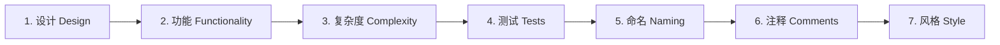

## 1. 从"作文批改"到"代码评审"

### 1.1 你其实早就做过代码评审

想象一下学生时代的场景：老师发回批改过的作文，红笔写满了批注——"这里逻辑不通""这个例子不恰当""结尾太仓促"。你在看批注时学到了两件事：一是知道了自己作文的问题，二是通过老师的视角学会了"什么样的文章算好文章"。

**代码评审（Code Review）本质上就是"作文批改"，只不过被改的对象是代码，批改者是你的同事。** 在代码评审中：

- **作者（Author）** 提交自己写的代码（在 Git 里叫 Pull Request 或 PR）
- **评审者（Reviewer）** 阅读代码、提出意见、决定是否批准合并
- **被改进的对象** 是代码库的整体健康度，而不是作者的个人能力

### 1.2 为什么需要代码评审

很多人第一次接触代码评审时的第一反应是："我自己写的代码自己最清楚，为什么要让别人看？"

这个想法只对了一半。**"自己最清楚"说的是意图，而不是质量。** 人类有一个认知盲区：写代码的人太熟悉自己的思路，往往看不出自己代码中的问题。就像作家很难发现自己的错别字——因为大脑会自动"脑补"正确的内容。

代码评审解决的正是这个盲区。它带来四个核心价值：

**价值一：质量保障。** 每行代码在被合并前经过第二双眼睛检查，能发现：边界条件没处理、错误路径遗漏、性能隐患、安全隐患。据统计，代码评审能提前拦截相当比例的线上缺陷——比上线后由用户发现再修复，成本低得多。

**价值二：知识共享。** 评审者是"读"别人代码最多的人。通过评审，团队每个人都能了解"别的模块在做什么、怎么做的"，打破信息孤岛。新人也通过评审快速了解团队规范和代码风格。

**价值三：标准统一。** 团队用同一个评审标准，代码风格、命名习惯、架构约定就会自然趋同。这比贴一份"编码规范文档"有效得多——因为规范是"在真实场景中被执行"的，而不是"挂在墙上"的。

**价值四：导师作用。** 有经验的工程师通过评审，把"为什么这里要这样写"讲给新人听——这是性价比最高的知识传递方式之一。

### 1.3 代码评审的三个前提

代码评审不是"灵丹妙药"，它要生效需要三个前提：

1. **评审发生在合并前。** 只有"先审查、后合并"才能真正拦截问题。如果代码先合并了再补审查，那只是形式主义。
2. **作者愿意接受意见。** 作者要明白：被指出问题不是"被打脸"，而是"有人帮你兜底"。
3. **评审者认真负责。** 评审不是"点个同意"走流程，而是要真的读懂代码、真的思考。

## 2. Google 的评审标准：持续改进，而非完美

Google 公开的工程实践文档（google.github.io/eng-practices）是全球代码评审领域最有影响力的公开资料。它最重要的原则只有一句话，值得全文加粗：

> **评审者应当在一份变更"确实改善了系统整体代码健康度"时批准它，即使这份变更并不完美。**

这句话听起来简单，但它纠正了两个极端：

**极端一：完美主义评审。** 评审者要求作者把所有细节都打磨到"理想状态"才放行：变量名还能更好、抽象还能更优雅、某个边界还能再想想。结果是：PR 永远合不进去，团队速度被拖垮，作者逐渐失去改进的动力。

**极端二：橡皮图章评审。** 评审者看都不看就批准，避免冲突。结果是：审查形同虚设，代码质量逐年下滑。

Google 的原则给出了第三条路：**"好"的标准不是"完美"，而是"比之前更好"（definitely improves the overall code health）。** 只要这个变更整体上是改进（利大于弊），就应当放行，把"锦上添花"的意见留到下一次变更。

配套的还有三条子原则：

**子原则一：技术事实和数据压倒个人偏好。** "我觉得这样更好"是个人偏好；"这样写会有 500ms 的额外延迟"是技术事实。评审应当基于事实。

**子原则二：风格问题以风格指南为准。** 纯风格问题（缩进、命名）以团队风格指南为唯一标准。指南没规定的，尊重作者的选择——"我和你的写法不同"不是阻止合并的理由。

**子原则三：小评论标注"Nit"。** Google 规定，非关键的润色意见要用 "Nit:"（nitpick，吹毛求疵）前缀标注，让作者知道"这只是可选优化，可以不改"。

## 3. 评审顺序：先看设计，再看细节

评审者拿到一份 PR，应该按什么顺序看？Google 的建议是**从宏观到微观**，因为后一层的质量问题，往往源于前一层的决策错误：



**为什么设计排第一？** 因为如果设计方向错了，后面的修正都白费：改命名、改风格都救不了一个"根本不该这么做"的代码。先确认"这个方案对不对"，再花时间抠细节。

### 3.1 第一层：设计

- 这个变更是否属于正确的模块/代码库？
- 是否与系统的其他部分正确集成？
- 现在是不是添加这个功能的最佳时机？
- 是否过度设计（为不存在的未来需求增加复杂度）或设计不足（没有考虑边界）？

### 3.2 第二层：功能

- 代码是否真正实现了 PR 描述的功能？
- 是否对用户有益？还是"实现了一个没人需要的需求"？
- 边界情况是否处理？（空值、超长、并发、重试）
- 错误路径是否完善？（网络失败、数据库异常、依赖不可用）

### 3.3 第三层：复杂度

- 是否存在不必要的复杂度？
- 单函数是否过长（一般超过 30-50 行就需要警惕）？
- 嵌套层级是否过深（超过 3 层就应该重构）？
- 是否有重复代码模式（复制粘贴的变体）？
- 是否有不必要的抽象（为了"通用"而通用）？

**检查复杂度的核心问题**：这段代码能否被一个不熟悉背景的同事快速理解？如果不能，要么是注释不够，要么是设计过复杂。

### 3.4 第四层：测试

- 这个功能有测试吗？测试失败时能正确反映问题吗？
- 测试是"验证行为"还是"只是为了覆盖率的摆设"？
- 边界情况有测试吗？
- Mock 是否合理？（过度 Mock 会导致测试"测试的是 Mock 而不是代码"）
- 测试代码本身是否清晰可读？

### 3.5 第五层：命名

- 变量/函数/类名是否准确描述了它们的含义？
- 是否有误导性命名（名字说 A，行为却是 B）？
- 是否有无意义的缩写（`uas` 不如 `userAccountService`）？

### 3.6 第六层：注释

- 注释解释"为什么"，而不是复述"是什么"？

好的注释：`// 使用 HashMap 而非 ConcurrentHashMap：此映射仅在单线程内使用，且读多写少`

坏的注释：

```java
// 设置用户名
user.setName(name);
```

- 是否存在过时或错误的注释？（比没有注释更危险）
- TODO 注释是否有对应 issue 跟踪？

### 3.7 第七层：风格

- 是否符合团队风格指南？
- 与周围代码风格是否一致？

注意：风格是**优先级最低**的维度。纯风格问题不应阻塞合并（除非违反强制规范）。

## 4. 完整的审查清单（Checklist）

把以上维度整理成一份可执行的清单。评审者可以对照清单逐项检查：

### 4.1 正确性

- [ ] 功能是否符合需求描述
- [ ] 边界条件是否处理（空值、0、负值、极值、超长输入）
- [ ] 错误处理是否完善（异常、失败路径、重试逻辑）
- [ ] 并发安全（是否有可能的竞态条件、死锁）
- [ ] 资源释放（连接、文件、内存是否在 finally/RAII 中释放）
- [ ] 幂等性（重复执行结果是否一致）

### 4.2 可读性

- [ ] 命名是否清晰准确
- [ ] 逻辑结构是否易懂（复杂逻辑是否有清晰的层次）
- [ ] 复杂部分是否有必要注释
- [ ] 函数是否过长、嵌套是否过深
- [ ] 是否有"魔法数字/魔法字符串"（应该提取为命名常量）

### 4.3 可维护性

- [ ] 是否遵循单一职责（一个函数/类只做一件事）
- [ ] 是否有重复代码（应该提取复用）
- [ ] 硬编码是否应该参数化
- [ ] 模块间耦合是否合理
- [ ] 新增类似功能时是否只需少量修改（扩展性）

### 4.4 安全性

- [ ] 外部输入是否全部验证（类型、长度、范围、白名单）
- [ ] 数据库操作是否使用参数化查询（防 SQL 注入）
- [ ] 用户输出是否转义（防 XSS）
- [ ] 是否泄露敏感信息（密钥、密码、token 是否出现在代码/日志中）
- [ ] 是否检查权限（越权访问防护）

### 4.5 性能

- [ ] 是否存在 N+1 查询（循环内查询数据库）
- [ ] 是否有明显不必要的计算（循环内重复计算常量）
- [ ] 是否合理使用缓存（热点数据）
- [ ] 大数据量操作是否用批量代替单条循环
- [ ] 是否创建了不必要的对象/大对象

### 4.6 测试

- [ ] 核心逻辑是否有测试覆盖
- [ ] 测试是否真正验证行为（断言是否有效）
- [ ] 边界与异常路径是否有测试
- [ ] Mock 使用是否合理
- [ ] 测试是否独立可重复（不依赖外部状态）

## 5. 评论的艺术：好评论 vs 坏评论

评审的质量，最终体现在**评论的质量**上。一条好的评论，能让作者直接行动；一条坏评论，只会引发争执。

### 5.1 评论分级：让作者知道严重程度

Google 建议用前缀明确标注严重级别，避免作者误解：

| 前缀 | 含义 | 作者处理方式 |
| :--- | :--- | :--- |
| （无前缀） | 必须修改 | 阻塞合并，必须处理 |
| Nit: | 锦上添花 | 可选，作者可忽略 |
| 建议 | 非必须但推荐 | 作者自主决定 |
| 问题 | 需澄清 | 需要作者回答 |

### 5.2 坏评论长什么样

**坏评论一：只说不改。**

> "这段代码有问题。"

问题出在哪？作者一脸懵：哪里有问题？什么问题？怎么改？——这不是评论，这是情绪。

**坏评论二：攻击作者。**

> "你怎么会这么写？这太业余了。"

攻击人而不对事，会摧毁作者的安全感，让整个团队以后都不敢提问题。评审的铁律是**对事不对人**。

**坏评论三：个人偏好当标准。**

> "我更喜欢用 switch 而不是 if-else。"

如果两者技术上都等价，这只是个人偏好，不该作为必须修改的意见。

### 5.3 好评论长什么样

**好评论一：指出问题 + 解释原因 + 给出建议。**

> "`requests.get()` 在网络失败时会抛 ConnectionError。这里没有 try/except，一旦外部服务抖动，用户会直接看到 500 错误。建议包一层 try/except，记录日志后返回友好错误。（Blocking：这是用户请求路径）"

这条评论做到了四件事：**说出具体问题（缺异常处理）、解释影响（用户看到 500）、给出方案（try/except）、标注级别（Blocking）**。作者看完就能直接动手改。

**好评论二：质疑设计但留出讨论空间。**

> "我注意到这里把支付逻辑拆成了独立服务。我担心的权衡是：这会引入一次额外的网络调用，而且部署依赖变复杂了。能补充一下为什么选择拆分而不是在现有服务内实现吗？"

这条评论不否定作者的方案，而是**说明自己的顾虑（网络开销、部署复杂度），邀请作者解释**——这是建设性的技术讨论，而不是命令。

**好评论三：指出问题但不越权修改。**

> "这里的循环在每次迭代里都调用 `getUserById`，会产生 N+1 查询。建议改为批量查询一次再内存映射。如果你想让我帮忙改，说一声。"

指出问题 + 给出方案 + 尊重作者对代码的所有权。

### 5.4 写评论的四条黄金法则

1. **对代码不对人。** 永远评论"这段代码"，而不是"你"。可以说"这里需要处理空值"，不要说"你怎么不处理空值"。

2. **先认可，再提意见。** 看到好的设计、清晰的名字、漂亮的边界处理，要说出来。认可不是客套，它让作者明白"什么是好的"，也营造安全的讨论氛围。

3. **给出"为什么"。** "这样写更好"不够，要说"因为……"。没有理由的评论只会引发"我不觉得"的拉锯。

4. **聚焦，不堆积。** 一条评论只谈一个问题。把互不相关的意见合并在一句"这整段可以简化"里，作者反而不知道该改哪。

## 6. 评审者的姿态：5 个该做与 5 个不该做

### 该做的

1. **先读 PR 描述和上下文。** 不了解"这次变更想解决什么"就评审，等于盲人摸象。
2. **从整体到局部。** 先确认设计，再抠细节（见第 3 节的顺序）。
3. **及时完成。** Google 的标准是"一个工作日内给出首轮反馈"。拖延会让分支分叉、冲突累积，反而制造风险。
4. **区分"必须"与"建议"。** 明确标注级别，不要所有问题都同等权重。
5. **理解作者的处境。** 作者可能受时间压力、技术约束、历史包袱影响。批评前先问"为什么这样设计"。

### 不该做的

1. **橡皮图章。** 不看就批准。如果你没时间，可以明确说"我先看核心逻辑，细节稍后"，但不能假装看过。
2. **完美主义。** 见第 2 节——"持续改进"而非"一步到位"。
3. **越权修改。** 评审是提意见，不是替作者重写。重大改动应该由作者自己完成（除非作者明确请求帮助）。
4. **情绪化表达。** "这不是我想要的""太乱了"——这类情绪语言没有任何信息量。
5. **当场重构别人的设计。** 如果设计方向有问题，先讨论"要不要换方向"，而不是直接按自己的思路改。

## 7. 作者的姿态：怎么把 PR 送进评审

代码评审不是"评审者的单方面审判"，作者也有自己的责任：

### 7.1 提交前的自查清单

- [ ] 自己通读一遍 diff，确认没有明显的调试残留（console.log、断点、注释掉的代码）
- [ ] 本地跑通测试与构建
- [ ] 写清楚 PR 描述：**为什么改、怎么改、影响范围**（评审者最需要的信息）
- [ ] 关联相关 issue（让评审者理解上下文）
- [ ] 把大 PR 拆小（详见下节）
- [ ] 需要的话附上截图/日志/测试结果

### 7.2 收到意见后的正确姿势

**正确：** 逐条回应（"已改""接受建议""我倾向保留，理由是……"），有分歧就讨论，讨论不清就升级（找第三方仲裁或团队规范）。

**错误：** 全部接受不加思考（可能引入评审者的个人偏好）、全部反驳（错失改进机会）、默默改完不回帖（评审者不知道你的处理结果，无从确认）。

**原则：** 技术问题讲数据、讲原理；风格问题以团队规范为准；如果评审者和作者各执一词且都有道理，**作者有最终决定权**——但评审者的意见必须被认真考虑过。

## 8. 让评审更高效：小 PR、快反馈、自动化辅助

### 8.1 小 PR：评审效率的第一杠杆

Google 建议一个变更控制在 200 行以内（约合一个"合理大小"的改动）。

- 50 行的 PR：10 分钟审完，当天合入
- 500 行的 PR：半天才能审完，容易排期拖延，合入时已经和主分支冲突

**小 PR 不是风格偏好，而是部署策略**：变更越小，评审越快，合并越安全，回滚越容易。如果一个需求改动太大，拆成多个连续的 PR（先改数据层、再改接口、最后改 UI），每个 PR 独立可合并。

### 8.2 快速反馈：评审的响应 SLA

- **评审者**：一个工作日内给出首轮反馈（哪怕只说"已收到，今天内审完"）
- **作者**：收到意见后尽快处理，避免 PR 长期悬挂

一条经验法则：**PR 悬挂的时间越长，合并的风险越大。** 因为主分支一直在变，你的分支会持续落后，最终要么冲突、要么在合并时引入隐藏问题。

### 8.3 自动化辅助：让机器人做机械活

2026 年的代码评审中，AI 工具（GitHub Copilot、CodeRabbit 等）已经可以承担第一遍机械审查：

- 风格与格式检查（交给 Lint + 格式化工具）
- 明显的 bug 模式（空指针、越界、资源未释放）
- 缺失的错误处理提示
- 依赖安全检查、覆盖率报告

**AI 审查的价值**是让人类评审者专注于 AI 做不好的事情：架构合理性、上下文理解、业务影响、团队规范、新人带教。**正确的工作流**：AI 先扫一遍机械问题，人类再聚焦设计层面——两者配合，而不是互相替代。

## 9. 常见反模式：评审是如何被做坏的

### 反模式一：橡皮图章（Rubber Stamp）

**症状**：所有 PR 秒批，从不提意见。**后果**：评审形同虚设，问题全留到线上。**对策**：每个 PR 至少认真看核心逻辑，提出至少一个具体问题（哪怕是小问题）。

### 反模式二：吹毛求疵（Nitpicking）

**症状**：只盯着格式、命名、标点，从不讨论设计与逻辑。**后果**：作者觉得评审者"没事找事"，评审失去信任。**对策**：把精力放在设计、功能、复杂度等真正影响质量的地方。

### 反模式三：拖延症（Review Latency）

**症状**：PR 挂一周没人理，作者催了才看一眼。**后果**：分支持续分叉，合并风险累积；团队速度被拖垮。**对策**：把"一个工作日内响应"当作评审者的 SLA。

### 反模式四：对抗式评审

**症状**：评论语气攻击性、情绪化，把技术讨论变成个人恩怨。**后果**：作者开始隐瞒问题、规避评审，团队信任崩塌。**对策**：对事不对人，用"这条代码路径"替代"你"。

### 反模式五：过度设计要求

**症状**：要求作者为"未来可能的需求"增加抽象层、通用组件。**后果**：代码提前复杂化，YAGNI（You Aren't Gonna Need It，你不需要它）原则被违背。**对策**：评审聚焦"当前需求是否被正确实现"，未来的扩展留到未来。
