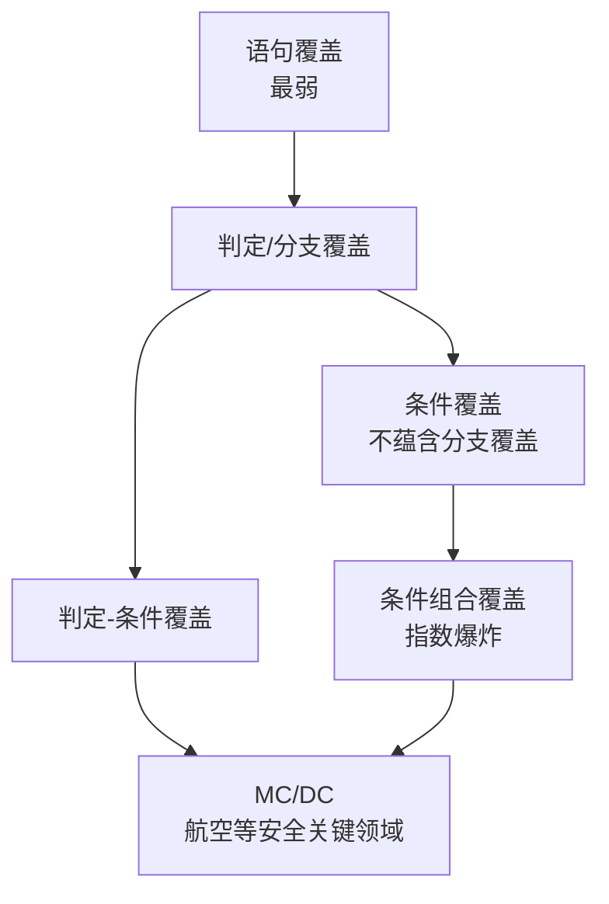
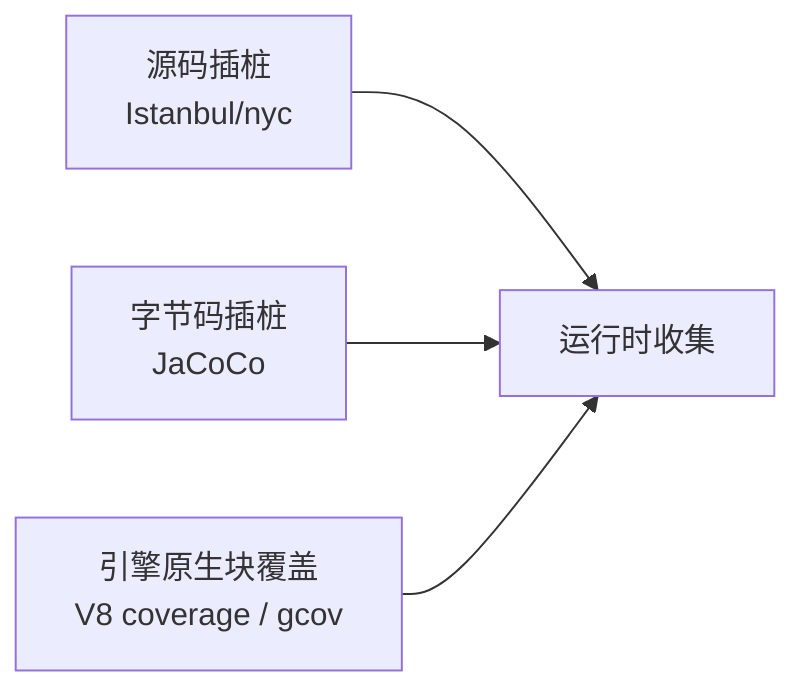

## 1. 覆盖率到底在度量什么

覆盖率回答的是一个很具体的问题：**测试运行时，代码的哪些部分被执行过**。
它是「发现没被测过的代码」的探照灯，而不是「代码质量」的分数。

一个容易混淆的点：行覆盖率（line coverage）不等于语句覆盖率（statement
coverage）。一行可能包含多条语句（`a = 1; b = 2`），也可能一条语句跨多行；
 JaCoCo 这类字节码工具统计的其实是指令/块覆盖，再映射回源码行展示。不同
工具对「覆盖了一条」的定义略有差异，跨工具比较百分比没有意义。

前置知识：分支与条件表达式、控制流图的基本概念。



## 2. 从一个例子算清所有指标

全文使用同一个被测函数，请动手算一遍再往下看：

```java
// 根据分数与是否加分计算结果
String grade(int score, boolean bonus) {
    if (score >= 90 && bonus) {   // 判定 D1，含条件 C1: score>=90、C2: bonus
        return "A+";
    }
    if (score >= 60) {            // 判定 D2
        return "及格";
    }
    return "不及格";
}
```

### 2.1 语句覆盖

**定义**：每条语句至少执行一次。

- 用例 `grade(95, true)` 即可让三条 `return` 全部执行吗？不能——它只走到
  `return "A+"`。还需要 `grade(70, false)` 走到 `"及格"`、`grade(30, false)`
  走到 `"不及格"`。
- 3 个用例达成 100% 语句覆盖。

**语义边界**：语句覆盖不关心判定结果的方向。短路表达式 `if (a || b)` 里
让 `a` 为真，`b` 根本不会被执行，但语句覆盖照样达标——这是它最弱的原因。

### 2.2 判定覆盖（分支覆盖）

**定义**：每个判定的**真、假两个结果**至少各出现一次。

- D1：`(95, true)` 真 + `(70, false)` 假
- D2：`(70, false)` 真 + `(30, false)` 假
- 共 3 个用例达成 100% 分支覆盖。

注意「判定」的单位是整个布尔表达式，而不是其中每个子条件。`(95, false)`
和 `(90, true)` 对 D1 来说都是「真」，分支覆盖看不出 `bonus` 到底有没有
单独起作用——这正是需要条件覆盖的原因。

### 2.3 条件覆盖

**定义**：判定中**每个原子条件**的真、假至少各取一次（不管判定本身的结果）。

- C1（score>=90）：`(95, false)` 真 + `(30, false)` 假
- C2（bonus）：`(30, true)` 真 + `(30, false)` 假

**经典反例（条件覆盖不蕴含分支覆盖）**：用例 `(95, false)` 与 `(30, true)`
让 C1、C2 的真假都取到了，但 D1 两次都是**假**——「真分支」一次都没走过。
所以条件覆盖与分支覆盖互不蕴含，二者合起来才是下一节。

### 2.4 判定-条件覆盖

**定义**：判定结果真假各一次 **且** 每个条件真假各一次，即上面 2.2 与 2.3
的并集。它修复了 2.3 的反例，但仍有一个盲区：无法发现**某个条件被另一个
条件掩盖**的情况（比如 `a || b` 中 `a` 恒为真时，`b` 写错也测不出来）。

### 2.5 条件组合覆盖

**定义**：同一判定内所有条件的真假的**全部组合**各出现一次。D1 有 2 个
条件，需要 2² = 4 个组合；3 个条件就是 8 个——组合数随条件个数**指数增长**，
工程上只用于小规模关键逻辑。

### 2.6 MC/DC（修正条件/判定覆盖）

**定义**：用最少的用例证明——**每个条件都能独立影响判定结果**。形式化要求：

1. 每个判定的真假结果都出现过（分支覆盖）；
2. 判定内每个条件真假各取一次（条件覆盖）；
3. 每个条件存在一个「独立影响对」：仅该条件翻转，判定结果就翻转。

对 n 个条件的判定，MC/DC 只需 **n + 1** 个用例（条件组合要 2ⁿ 个），
这就是它成为安全关键领域标配的原因：DO-178C（机载软件）对 A 级软件强制
要求 MC/DC，汽车 ASPICE、医疗 IEC 62304 也有类似取向。

| 用例 | score >= 90 | bonus | D1   | 说明                       |
| ---- | ----------- | ----- | ---- | -------------------------- |
| T1   | T           | T     | T    | 基准                       |
| T2   | T           | F     | F    | 仅翻转 C2 → D1 翻转，C2 独立 |
| T3   | F           | T     | F    | 仅翻转 C1 → D1 翻转，C1 独立 |

## 3. 强度对比与选择

| 指标         | n 条件用例数 | 蕴含关系                     | 适用场景           |
| ------------ | ------------ | ---------------------------- | ------------------ |
| 语句覆盖     | 少           | 最弱                         | 最低底线           |
| 分支覆盖     | 少           | 蕴含语句覆盖                 | 绝大多数业务代码   |
| 条件覆盖     | 少           | 与分支覆盖互不蕴含           | 与分支覆盖搭配使用 |
| 判定-条件    | 少           | 蕴含分支 + 条件              | 复杂布尔逻辑       |
| MC/DC        | n + 1        | 蕴含判定-条件（不含条件组合）| 安全关键领域       |
| 条件组合     | 2ⁿ           | 最强                         | 小规模关键决策表   |

工程默认值：**分支覆盖起步**。业务代码追条件组合覆盖的性价比极低，
把时间花在设计更好的用例上收益更大。

## 4. 覆盖率工具与实现原理

### 4.1 三种插桩路线



- **源码插桩**（JavaScript 的 Istanbul/nyc）：重写源码，在每个语句/分支
  前插入计数器。能精确知道「分支两个方向各走了几次」，代价是运行变慢、
  源码被改写。
- **字节码插桩**（Java 的 JaCoCo）：在 class 文件层面插入探针，对使用者
  透明，Java 事实标准。注意 JaCoCo 不支持 MC/DC（社区长期讨论中），
  安全关键领域的 Java 项目要选商业工具（如 VectorCAST/Jenkins 配合的
  TCMS 类方案）。
- **引擎原生覆盖**（V8 coverage、gcc/gcov、llvm-cov）：由运行时/编译器
  直接输出块覆盖数据，几乎零侵入、速度快。V8 原生给出的是块（block）
  覆盖，分支方向等语义信息要靠 **AST 重映射**还原——Vitest 3.2 起
  `@vitest/coverage-v8` 正是通过这一步把精度追平了 Istanbul，同时保留了
  不改源码的速度优势（v8 也是 Vitest 的默认 provider；切换 Istanbul 只需
  装 `@vitest/coverage-istanbul` 并设 `coverage.provider`）。

### 4.2 典型配置速览

```javascript
// vitest.config.ts —— 覆盖率门禁示例
export default {
  test: {
    coverage: {
      provider: 'v8',            // 默认即 v8，可换 istanbul
      include: ['src/**'],
      thresholds: {
        branches: 80,            // 四项指标低于阈值时命令失败
        functions: 80,
        lines: 80,
        statements: 80,
      },
    },
  },
};
```

```bash
# Java：surefire/jacoco 插件执行后生成报告
mvn verify
# 报告位于 target/site/jacoco/index.html
```

## 5. 常见陷阱

- **把 100% 覆盖当目标**：覆盖率只说明代码「被执行」，不说明「被验证」。
  一个没有断言的测试也能刷高覆盖率——先审计断言质量，再看数字。
- **断言为空的假覆盖**：`@Test void t() { service.run(); }` 语句覆盖率 100%，
  却什么都没证明。评审时重点看异常路径的断言。
- **难以覆盖的代码是设计信号**：必须私有方法、单例、静态初始化才能测的
  代码，通常耦合过重。覆盖率卡点反复上不去的模块，优先重构而不是硬怼测试。
- **跨工具比较百分比**：行/语句/块口径不同，JaCoCo 与 Istanbul 对同一段
  代码会给出不同数字；团队应固定一套工具再谈阈值。
- **排除代码掩盖问题**：把难测的类加进 `exclude` 列表，覆盖率变好看了，
  风险只是从报表移进了代码。

## 小结

- 初学者要点：语句覆盖最弱；分支覆盖要求判定的真假各一次；条件覆盖看的是
  判定内部的原子条件，与分支覆盖互不蕴含；「写测试时至少让每个 if 的两个
  方向都发生」是最实用的直觉。
- 进阶注意：MC/DC 用 n+1 个用例证明每个条件的独立影响，是安全关键领域的
  合规要求；工具数字来自不同插桩原理（源码/字节码/引擎原生），阈值要绑定
  固定工具；覆盖率是探照灯不是成绩单，断言质量与可测性设计才是根本。
