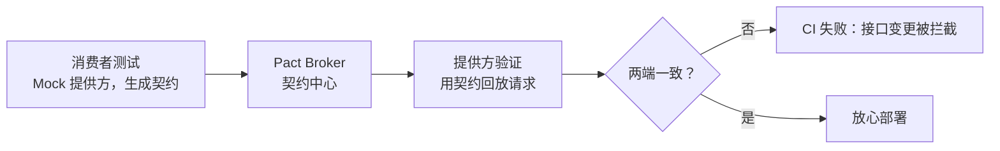

## 1. 本文定位

「API 自动化测试」一文讲的是 Python 栈与通用方法论；本文聚焦另外三种
常用技术栈——**Postman/Newman**（GUI 起家的团队协作路线）、
**REST Assured**（Java 栈标准）、**Supertest**（Node.js 栈进程内测试），
并补齐两块工程化内容：JSON Schema 结构校验与契约测试。

前置知识：HTTP 协议、JSON、任一语言的测试框架基本用法。

## 2. Postman 与 Newman：从手工工具到流水线

### 2.1 集合、环境与变量

Postman 以「集合（Collection）」组织请求，变量分层解决环境切换：

| 变量层级       | 作用域     | 典型用途                     |
| -------------- | ---------- | ---------------------------- |
| `pm.collectionVariables` | 集合内 | 接口路径、默认参数           |
| 环境变量       | 一套环境   | `base_url`、测试账号         |
| 全局变量       | 所有请求   | 登录 token 等跨环境共享值    |

写请求时用 `{{base_url}}/api/users` 占位，切换环境只换变量文件，
同一份集合即可在本地、测试、预发三套环境运行。

### 2.2 脚本与断言

```javascript
// Tests 标签页：响应断言（pm 对象是 Postman 的运行时 API）
pm.test("状态码为 201", () => pm.response.to.have.status(201));

pm.test("返回结构与关键字段正确", () => {
  const body = pm.response.json();
  pm.expect(body).to.have.property("id");       // 结构
  pm.expect(body.name).to.eql("Alice");         // 关键值
  pm.expect(pm.response.headers.get("Content-Type")).to.include("application/json");
});

// 把响应中的 id 存入变量，供后续请求使用（链式场景）
pm.collectionVariables.set("userId", pm.response.json().id);
```

### 2.3 Newman：让集合进 CI

Newman 是 Postman 的命令行运行器，集合即代码，可直接进流水线：

```bash
# 运行集合并应用环境文件，非零退出码表示有用例失败
npx newman run users.postman_collection.json \
  -e test-env.json \
  --reporters cli,junit --reporter-junit-export results.xml
```

工程化要点：集合文件与环境文件入库版本管理；敏感凭据走 CI 变量注入
（`--env-var token=$API_TOKEN`），不要把真实密钥提交进仓库。

## 3. REST Assured：Java 栈的 Given-When-Then

REST Assured 用流式 API 把「准备-请求-断言」三段写在一处：

```java
// 依赖：io.rest-assured:rest-assured（配合 JUnit 使用）
import static io.restassured.RestAssured.*;
import static org.hamcrest.Matchers.*;

public class UserApiTest {

    @Test
    void 应能创建用户并返回id() {
        int id =
        given()
            .baseUri("https://api.example.com")
            .contentType("application/json")
            .body("{\"name\":\"Alice\",\"email\":\"alice@example.com\"}")
        .when()
            .post("/api/users")
        .then()
            .statusCode(201)
            .body("name", equalTo("Alice"))
            .body("id", notNullValue())
            .extract().path("id");          // 提取响应值供后续用例使用

        // 清理：测试自己删自己建的数据
        given().baseUri("https://api.example.com")
              .when().delete("/api/users/" + id)
              .then().statusCode(204);
    }
}
```

配合 Hamcrest 匹配器可做结构化断言（`hasSize(3)`、`hasEntry("name",
"Alice")`）；配合 `RequestSpecification` 抽公共配置（baseUri、鉴权头），
避免每个用例重复样板。

## 4. Supertest：Node.js 进程内测试

Supertest 直接对 Node.js HTTP 应用（Express、Fastify、Koa 等）发请求，
**不起端口**，测试与被测应用在同一进程里，速度接近单元测试：

```typescript
// user.test.ts —— Jest/Vitest 皆可运行
import request from 'supertest';
import { app } from '../src/app';        // app 是 Express 实例，不 listen()

describe('用户接口', () => {
  it('POST /api/users 返回 201 与用户体', async () => {
    const res = await request(app)
      .post('/api/users')
      .send({ name: 'Alice', email: 'alice@example.com' })
      .expect(201)
      .expect('Content-Type', /json/);

    expect(res.body.name).toBe('Alice');
    expect(res.body.id).toBeDefined();
  });

  it('参数缺失返回 400', async () => {
    await request(app).post('/api/users').send({}).expect(400);
  });
});
```

进程内路线的取舍：快、便于打桩依赖（配合测试替身），但覆盖不到「真实
部署拓扑」问题（网关、TLS、跨服务鉴权）——这些交给少量真环境集成测试。

## 5. 结构校验：JSON Schema

断言关键字段之外，还应校验**响应结构**，防止上游悄悄删字段：

```python
# Schema 校验与语言无关，示例用 Python jsonschema 展示
from jsonschema import validate

user_schema = {
    "type": "object",
    "required": ["id", "name", "email"],
    "properties": {
        "id": {"type": "integer"},
        "name": {"type": "string", "minLength": 1},
        "email": {"type": "string", "format": "email"},
    },
    "additionalProperties": False,   # 拒绝多余字段，锁死契约面
}

validate(instance=response.json(), schema=user_schema)
```

层次建议：**每条用例断言状态码 + 关键值；每个接口至少一条用例跑完整
Schema 校验**，把「结构回归」与「业务回归」分开看。

## 6. 契约测试：跨团队接口的防护网

Supertest/REST Assured 的 Mock/Stub 都建立在「假设对方返回什么」之上，
假设过期就是联调事故。契约测试（Pact 为代表）把消费者对提供方的期望写成
**契约文件**，两端各自验证：



- 消费者侧：跑测试生成 pact 文件（期望的请求与响应）；
- 提供方侧：CI 用 pact 文件回放请求，验证真实实现满足契约；
- Broker 管理契约版本，配合 `can-i-deploy` 判断「这个版本能否安全上线」。

适合微服务间接口与对外 API 的版本治理；单体应用内部模块间用不上。

## 7. 常见陷阱

- **集合/用例没有清理**：Postman 手工点完就完事，进 CI 后同一环境反复
  运行，脏数据让用例互相影响。每条链路「自建自清」。
- **Postman 断言过弱**：只校验状态码 200。集合要进流水线，断言标准应与
  代码测试一致。
- **REST Assured 把所有配置散在用例里**：baseUri、token、日志过滤应收敛
  到 `RequestSpecification` 与测试基类。
- **Supertest 顺带测了数据库**：进程内测试若未隔离 DB，用例间顺序耦合；
  每条用例事务回滚或用一次性容器数据库。
- **契约文件无人维护**：契约测试的价值在「两端同时跑」，只跑一端等于
  没跑；接入 Pact Broker 并在部署流程校验 `can-i-deploy`。

## 小结

- 初学者要点：Postman 集合 + Newman 能把「手工接口测试」低成本搬进 CI；
  REST Assured 与 Supertest 分别是 Java/Node 栈的代码化路线；断言至少
  覆盖「状态码 + 关键字段」。
- 进阶注意：JSON Schema 锁结构、关键值断言看业务，两层分开；跨服务接口
  用契约测试替代脆弱的 Stub 假设；一切 API 测试都要「自建自清 + 显式
  超时 + 环境变量化」。
