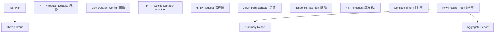
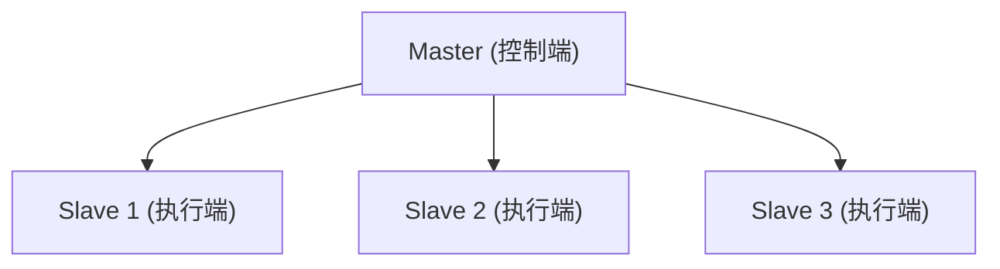

## 1. JMeter 概述

Apache JMeter 是开源负载测试的事实标准，Java 编写、纯 GUI 录制调试 +
CLI 施压的工作流。它与 k6/Locust 的横向对比见「压力测试与稳定性测试」；
本文聚焦 JMeter 自身的组件模型与实操。

前置知识：HTTP 协议基础、性能指标含义（RT/吞吐量/分位值）。

### 1.1 什么是 JMeter

Apache JMeter 是开源的负载测试和性能测量工具，支持多种协议和应用类型。

### 1.2 支持协议

| 协议       | 描述     |
| ---------- | -------- |
| HTTP/HTTPS | Web 应用 |
| FTP        | 文件传输 |
| JDBC       | 数据库   |
| JMS        | 消息队列 |
| SOAP/REST  | Web 服务 |
| TCP        | 原始 TCP |
| SMTP       | 邮件     |

### 1.3 核心概念

| 概念           | 描述               |
| -------------- | ------------------ |
| Test Plan      | 测试计划（顶层）   |
| Thread Group   | 线程组（模拟用户） |
| Sampler        | 采样器（发送请求） |
| Listener       | 监听器（收集结果） |
| Configuration  | 配置元件           |
| Pre-Processor  | 前置处理器         |
| Post-Processor | 后置处理器         |
| Assertion      | 断言               |
| Timer          | 定时器             |

## 2. 测试计划结构



## 3. 线程组配置

### 3.1 基本线程组

| 参数     | 描述                     |
| -------- | ------------------------ |
| 线程数   | 模拟用户数               |
| Ramp-Up  | 启动所有线程的时间（秒） |
| 循环次数 | 重复执行次数             |

**示例**：100 用户，10 秒启动，循环 5 次

```
线程数: 100
Ramp-Up: 10
循环次数: 5
```

### 3.2 Stepping Thread Group

逐步增加负载（来自 jp@gc 插件集，需另装 Custom Thread Groups）：

```
初始: 10 用户
每 30 秒增加: 20 用户
最大: 200 用户
持续: 60 秒
逐步减少
```

逐步加压的价值在于绘制「负载-响应时间」曲线找拐点；JMeter 5.2+ 原生的
开放模型线程组（Concurrency Thread Group / Arrival Rate 风格）配合
Throughput Shaping Timer 可按到达速率施压，更适合模拟真实流量。

## 4. 采样器

### 4.1 HTTP 请求

| 参数       | 描述                |
| ---------- | ------------------- |
| 服务器名称 | 目标主机            |
| 端口       | 目标端口            |
| 路径       | URL 路径            |
| 方法       | GET/POST/PUT/DELETE |
| 参数       | 请求参数            |
| Body Data  | 请求体              |

### 4.2 变量与参数化

**用户定义变量**：

| 变量名     | 值                |
| ---------- | ----------------- |
| `base_url` | `api.example.com` |
| `port`     | `443`             |
| `protocol` | `https`           |

**CSV 数据文件**：

```csv
username,password
user1,pass1
user2,pass2
user3,pass3
```

### 4.3 JSON 提取

```
# 从响应中提取 Token
JSON Path: $.token
变量名: auth_token

# 后续请求使用
Header: Authorization: Bearer ${auth_token}
```

## 5. 断言

### 5.1 响应断言

| 类型     | 描述           |
| -------- | -------------- |
| 响应码   | 200, 404 等    |
| 响应文本 | 包含/匹配/等于 |
| 响应头   | 检查头信息     |
| 响应时间 | < 2000ms       |

### 5.2 JSON 断言

```
Assert JSON Path: $.status
Expected Value: success
```

## 6. 监听器

### 6.1 常用监听器

| 监听器               | 描述             |
| -------------------- | ---------------- |
| View Results Tree    | 查看每个请求详情 |
| Summary Report       | 汇总报告         |
| Aggregate Report     | 聚合报告         |
| Response Times Graph | 响应时间图       |
| HTML Report          | HTML 报告        |

### 6.2 关键指标

| 指标       | 描述         |
| ---------- | ------------ |
| Samples    | 采样数       |
| Average    | 平均响应时间 |
| Median     | 中位数（P50）|
| 90% Line   | P90          |
| 99% Line   | P99          |
| Min/Max    | 最小/最大    |
| Error%     | 错误率       |
| Throughput | 吞吐量（req/s，即每秒请求数；注意 JMeter 报表口径与业务 TPS 不一定相同） |

## 7. 分布式测试

### 7.1 架构



### 7.2 配置步骤

```bash
# Slave 端启动
jmeter-server -Djava.rmi.server.hostname=slave-ip

# Master 端执行
jmeter -n -t test_plan.jmx -R slave1,slave2,slave3 -l results.jtl
```

## 8. CLI 模式

```bash
# 非GUI模式执行
jmeter -n -t test_plan.jmx -l results.jtl -e -o report/

# 参数化
jmeter -n -t test_plan.jmx \
  -Jusers=100 \
  -Jrampup=10 \
  -Jduration=300 \
  -l results.jtl

# 生成 HTML 报告
jmeter -g results.jtl -o html-report/
```

## 9. 最佳实践

| 实践       | 描述               |
| ---------- | ------------------ |
| CLI 模式   | 性能测试不用 GUI   |
| 参数化     | 变量替代硬编码     |
| 思考时间   | 模拟真实用户       |
| 断言       | 验证响应正确性     |
| 逐步加压   | 避免突发流量       |
| 监控服务端 | 同时监控服务器资源 |
| 多次运行   | 取平均值           |
| 清理数据   | 测试前清理         |

## 10. 常见陷阱

- **GUI 模式施压**：GUI 自身开销大，Swing 界面几千并发先把自己拖死。
  GUI 只用于录制与单请求调试，施压一律 `-n`。
- **没有断言的压测**：只看吞吐不看响应内容，服务端批量返回 500 时错误
  率会说话，但「200 却返回错误 JSON」只有断言能抓住。
- **正则提取器性能陷阱**：大量关联用正则后置处理器拖慢施压机，优先用
  JSON 提取器或边界提取器。
- **分布式时数据被均分**：CSV Data Set Config 默认所有 Slave 独立从头读
  文件，注意 `shareMode` 配置，避免多机重复使用同一批账号。

## 小结

- 初学者要点：组件模型「线程组-采样器-后置提取-断言-监听器」一条链；
  施压用 CLI；CSV 参数化解决多账号/多数据。
- 进阶注意：吞吐量口径（req/s 与 TPS）先讲清再汇报；逐步加压找拐点、
  开放模型模拟真实到达率；JMeter 结果要与服务端资源监控联合分析，
  工具侧数字只是故事的一半。
