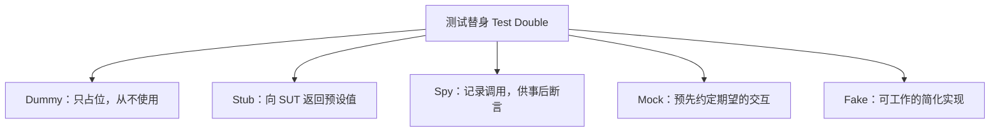
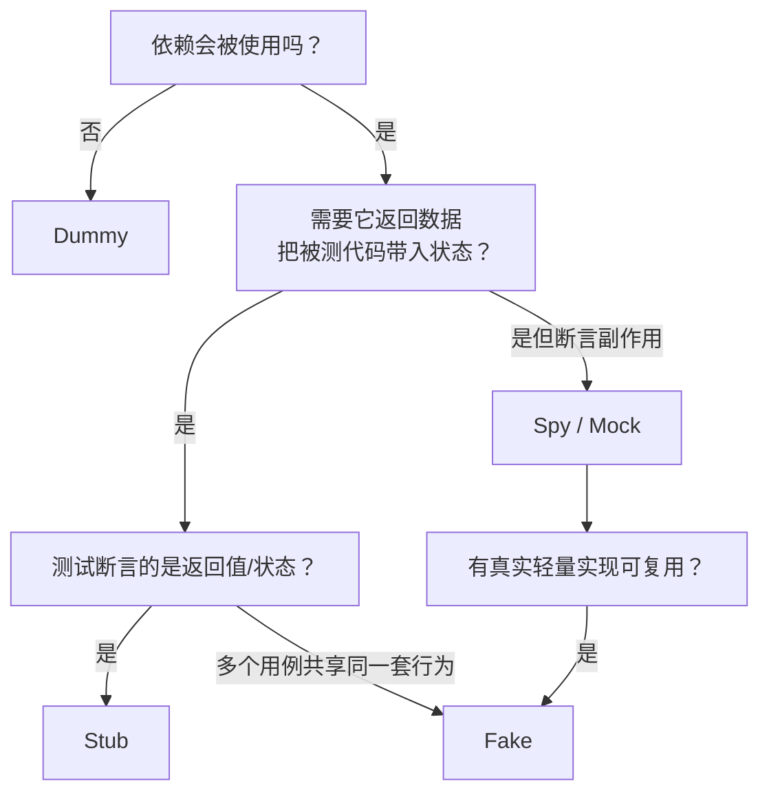

## 1. 为什么需要测试替身

被测代码很少是孤岛：下单逻辑要发邮件，风控逻辑要查数据库，报表逻辑要调
第三方接口。单元测试要求「快速、可重复、随时可跑」，而这些真实依赖恰好
三样都做不到。

**测试替身（Test Double）**就是给依赖找的「替身演员」——用一个小型、
可控、行为可预期的对象顶替真实依赖。这个词由 Gerard Meszaros 在
《xUnit Test Patterns》中提出并划分为五类；Mockito、Jest、unittest.mock
这些工具都是它的实现，而工具的 `Mock` 类往往同时能扮演多种角色，这也是
「Mock/Stub 分不清」混乱的根源：**分类看的是替身在测试中扮演的角色，
不是工具里的类名**。

前置知识：单元测试与 AAA 模式（见「测试层级」）、至少一门语言的 Mock 框架。



## 2. 五种替身：定义与代码

以下用同一个场景演示：被测对象 `OrderService`，依赖 `PaymentGateway`
（支付网关）和 `MailSender`（邮件通知）。

### 2.1 Dummy：只为了通过编译

Dummy 被传进被测代码但**永远不会被使用**，存在的唯一意义是填满参数列表。

```python
class DummyMailSender:
    def send(self, to, subject, body):  # 永远不应该被调用
        raise AssertionError("测试中不应发送邮件")

def test_create_draft_order():
    # 草稿单不触发支付也不发邮件，但构造函数要求这两个参数
    service = OrderService(PaymentGateway(), DummyMailSender())
    order = service.create_draft(user_id=1, items=[...])
    assert order.status == "DRAFT"
```

把它写成「一被调用就抛错」的形式，Dummy 还能兼职保护：替身被意外使用时
测试会立刻失败。

### 2.2 Stub：预设答案的「输入替身」

Stub 把依赖的**返回值**写死，用来把被测代码带入特定状态。

```python
class StubGateway:
    def charge(self, user_id, amount):
        return {"status": "declined"}   # 无论输入是什么，都返回「拒付」

def test_order_marked_failed_when_payment_declined():
    service = OrderService(StubGateway(), ...)
    order = service.checkout(user_id=1, amount=100)
    assert order.status == "PAYMENT_FAILED"   # 验证的是被测代码的状态
```

要点：测试断言的是 **`order.status` 这种被测对象的状态**，Stub 本身没有
任何断言。支付网关「被调用了几次、用什么参数」完全不在关注范围内。

### 2.3 Spy：先执行、后核账的记录员

Spy 包装真实或模拟对象，**记录每一次调用**，测试后半段再对记录做断言。

```python
from unittest.mock import patch

def test_welcome_mail_is_sent():
    with patch("order.mail.MailSender.send") as spy:
        service.register("alice@example.com")
        # 先执行业务，再检查「发生过什么」
        spy.assert_called_once()
        args = spy.call_args
        assert args.args[0] == "alice@example.com"
```

Spy 与 Stub 的分工：Stub 顶替「**进来**的数据」（查询、读操作），
Spy/观察「**出去**的副作用」（通知、写操作）。一个检验标准：把被测代码
的返回值换掉，测试仍应成立——因为你在验证副作用而非返回值。

### 2.4 Mock：先定剧本、后开演

Mock 在执行前就**约定好期望的交互**（被调用、用什么参数、调几次），
执行后由框架验证期望是否满足。它和 Spy 的区别是断言时机与归属：
Spy 的断言写在测试逻辑里，Mock 的期望在执行前声明。

```java
// Mockito：验证交互本身，而非返回值
@ExtendWith(MockitoExtension.class)
class OrderServiceTest {
    @Mock MailSender mail;   // 这个 "Mock" 同时承担了 Stub 的打桩职责

    @Test void should_notify_user() {
        OrderService service = new OrderService(mockGateway(), mail);
        service.register("alice@example.com");

        verify(mail).send(eq("alice@example.com"), anyString(), anyString());
        verify(mail, times(1)).send(any(), any(), any()); // 恰好一次
    }
}
```

注意 Mockito 的 `when(...).thenReturn(...)` 语法虽然叫「mock」，做的事
却是打桩（Stub）——这再次说明工具命名与概念分类并不同步。

### 2.5 Fake：能跑的简化实现

Fake 是**有真实行为的轻量实现**：内存数据库、内存消息队列、本地文件版
对象存储。它不是逐调用预设的，而是「给什么输入就按简化规则算出输出」。

```python
class InMemoryUserRepo:
    """SQLite/MySQL 的 Fake：字典版仓库，行为真实但生命周期只在内存"""
    def __init__(self): self._data = {}
    def save(self, user): self._data[user.id] = user
    def get(self, user_id): return self._data.get(user_id)

def test_get_user_after_save():
    repo = InMemoryUserRepo()
    repo.save(User(id=1, name="Alice"))
    assert repo.get(1).name == "Alice"
```

Fake 的优势是一条 Fake 能服务整个测试套件（不用每个测试各自打桩），
劣势是你必须维护它并保证它与真实实现的语义一致。

## 3. 状态验证 vs 行为验证

这是选型的根本判据：

| 维度     | 状态验证（出状态）           | 行为验证（出交互）             |
| -------- | ---------------------------- | ------------------------------ |
| 断言对象 | 返回值、对象状态、数据库落库 | 调用次数、参数、调用顺序       |
| 典型替身 | Stub、Fake                   | Spy、Mock                      |
| 脆弱程度 | 低：重构内部实现不影响测试   | 高：重构调用方式测试就红       |
| 适用场景 | 有明确产出的大多数逻辑       | 无可观察产出的副作用（发通知） |

结论：**能用状态验证就不用行为验证**。只有当被测逻辑的全部产出就是一次
副作用（发邮件、发消息、调下游）时，行为验证才是必要的。

## 4. 何时用哪种：决策路径



速记：

- 查询类依赖（读数据库、调汇率接口）→ **Stub / Fake**
- 命令类依赖（发邮件、扣库存、写审计）→ **Spy / Mock**
- 整个仓储层、消息队列 → 优先 **Fake**（如内存仓库、Testcontainers 起的
  真实数据库属于另一条路线——「真依赖集成测试」）

## 5. 过度 Mock 的代价

- **测试与实现耦合**：Mock 了 `repo.find()`、`repo.cache()`、`repo.log()`
  的每一次调用后，把两行代码换个顺序测试就全红——它锁死的是「怎么写」
  而不是「做成了什么」。
- **假绿**：Mock 返回的数据结构和真实接口不一致（字段改名、类型变化）时，
  单测全绿、联调爆炸。Mock 越接近边界（HTTP、DB），这种风险越大。
- **可读性崩塌**：一个测试里十几行打桩代码，读者已经不知道在测什么。

缓解手段，按优先级：

1. 缩小 Mock 边界：只 Mock 自己拥有的接口（hexagonal 的端口），不要直接
   Mock 第三方 SDK 的深层次方法。
2. 跨服务依赖用**契约测试**代替逐个 Mock：消费方与提供方各自运行同一份
   契约（Pact 是代表工具），接口变更在 CI 阶段即被发现——契约不是「假设
   对方返回什么」，而是双方共同验证的协议。
3. 涉及真实 SQL/真实序列化的逻辑，写集成测试（见「测试层级」），
   不要用 Mock 自欺欺人。

## 小结

- 初学者要点：五类替身一句话——Dummy 占位、Stub 给答案、Spy 记录调用、
  Mock 预设期望、Fake 是简化实现；查询用 Stub/Fake，副作用用 Spy/Mock；
  断言优先针对状态而非交互。
- 进阶注意：工具类名（`Mock`）与概念分类不同步，判断替身类型看它在测试里
  扮演的角色；过度 Mock 的三大症状是与实现强耦合、跨边界假绿、用例不可读；
  系统边界上的「Mock 假设」应当升级为契约测试或真实依赖的集成测试。
