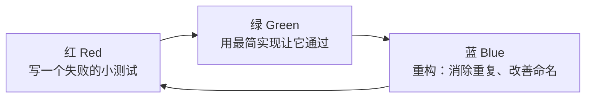

## 1. TDD：测试驱动开发

### 1.1 核心思想：先写测试，再写实现

传统流程是「先实现、后补测试」，测试往往沦为形式；TDD（Test-Driven
Development）把顺序倒过来：**在写任何实现代码之前，先写一个会失败的测试**。
测试在这里不只是验证工具，更是**设计工具**——为了写测试，你必须先想清楚
这个函数的名字、参数、返回值和边界，实现只是让测试变绿的桥。

类比：TDD 像导航软件设定目的地再出发——你先明确「到达时的样子」（断言），
再决定走哪条路（实现）；走偏了立刻有提示（测试变红）。

前置知识：单元测试结构（AAA 模式）、至少一门语言的测试框架。

### 1.2 红-绿-重构循环



每轮循环通常只有几分钟；循环多轮后统一跑一次全量测试与提交。

### 1.3 TDD 三定律（Robert C. Martin 表述）

1. 不写任何实现代码，除非为了让一个失败的测试通过；
2. 只写刚好让测试失败的测试（一次一个断言场景）；
3. 只写刚好让测试通过的实现。

三条定律合起来强制你以「小步幅」前进，每次失败都发生在刚刚改过的几行里，
调试成本被压到最低。

### 1.4 完整示例：订单折扣（TypeScript + Vitest）

需求：满 100 减 20，满 500 减 150，不含并列优惠。

第一轮（红）：先写测试，此时 `discount` 还不存在，运行即红。

```typescript
import { describe, it, expect } from 'vitest';
import { discount } from '../src/discount';

describe('订单折扣', () => {
  it('订单 120 元应减 20 元', () => {
    expect(discount(120)).toBe(20);   // 失败：discount 未实现
  });
});
```

第二轮（绿）：用最简实现让它通过，哪怕「作弊」。

```typescript
export function discount(amount: number): number {
  return 20; // 够土，但它让测试变绿——下一轮再加约束
}
```

第三轮（红）：加第二条规则，逼实现进化。

```typescript
it('订单 80 元无折扣', () => {
  expect(discount(80)).toBe(0);     // 失败：硬编码的 20 被揭穿
});

it('订单 600 元应减 150 元', () => {
  expect(discount(600)).toBe(150);  // 失败：还没有满 500 规则
});
```

第四轮（绿 + 重构）：正式实现并整理。

```typescript
export function discount(amount: number): number {
  if (amount >= 500) return 150;    // 条件从严到宽排列，便于阅读
  if (amount >= 100) return 20;
  return 0;
}
```

继续补边界用例（`500`、`100`、`99.99`），用「边界值分析」补齐清单。

### 1.5 测试清单与 TDD 的适用边界

动手前先列「测试清单」（如：正常满减、无折扣、恰好压线、金额为 0、负数
金额、非数字），每完成一轮划掉一项。清单保证边界不遗漏，循环保证节奏。

| 适合 TDD                              | 不太适合                          |
| ------------------------------------- | --------------------------------- |
| 纯逻辑：算法、规则引擎、解析器        | 一次性脚本、UI 视觉细节           |
| 接口/服务层，依赖可用替身隔离         | 探索性原型（需求本身还在变）      |
| 缺陷修复（先写复现缺陷的测试再修）    | 胶水代码、配置类改动              |

常见误用：一次写十几个测试再实现（违背小步幅）；对私有方法逐个 TDD
（应测公开行为）；断言写得太碎或太弱（测试失去了保护作用）。

## 2. BDD：行为驱动开发

### 2.1 从「测试」到「行为」

TDD 解决了开发者的设计节奏问题，但测试代码只有开发者看得懂。BDD（Behavior-
Driven Development）用业务各方都能读的**自然语言场景**描述行为，把 TDD 的
循环外推到需求讨论环节：产品、测试、开发共同确认场景，场景即验收标准，
再由工具把场景「粘」到自动化代码上。

BDD 最持久的遗产不是工具，而是 Given-When-Then 三段式——不写 Cucumber
也值得在测试命名与注释中沿用这套结构。

### 2.2 Given-When-Then

- **Given（给定）**：前置状态——世界现在是什么样；
- **When（当）**：触发动作——发生了什么操作或事件；
- **Then（那么）**：可观察结果——系统应该变成什么样。

### 2.3 Gherkin 与 Cucumber

Gherkin 是 BDD 场景的结构化自然语言（支持中文关键词 `假如/当/那么`），
Cucumber 是执行它的代表工具（另有 Python 的 behave、.NET 的 Reqnroll 等
对应物）。

```gherkin
# features/discount.feature
功能: 订单满减折扣

  场景: 满 500 元享受大额优惠
    假如 购物车中有 600 元的商品
    当 用户提交订单
    那么 系统应减免 150 元
    并且 订单应付 450 元
```

```typescript
// steps/discount.steps.ts —— 把每句自然语言粘到代码
import { Given, When, Then } from '@cucumber/cucumber';
import { strict as assert } from 'node:assert';
import { discount } from '../../src/discount';

let cartAmount: number;
let saved: number;

Given('购物车中有 {int} 元的商品', (amount: number) => {
  cartAmount = amount;
});

When('用户提交订单', () => {
  saved = discount(cartAmount);
});

Then('系统应减免 {int} 元', (expected: number) => {
  assert.equal(saved, expected);
});
```

### 2.4 落地建议与常见误用

- 场景应表述**业务规则**而非页面操作。「当用户提交订单」是规则，
  「当用户点击 id=submit 的按钮」是把 UI 细节泄漏进需求。
- 场景数量克制：每个功能 5-10 个关键场景，覆盖主要分支与失败路径；
  试图用 Gherkin 描述一切会让维护成本失控。
- 反模式「Cucumber 浮肿」：一层 Gherkin + 一层胶水代码 + 一层页面对象，
  三层转发只为测一个函数。简单逻辑直接 TDD 即可，BDD 只用在需要业务方
  确认的验收场景。

## 3. TDD 与 BDD 的关系

| 维度     | TDD                    | BDD                        |
| -------- | ---------------------- | -------------------------- |
| 驱动者   | 开发者                 | 产品/测试/开发三方         |
| 语言     | 代码                   | Gherkin 等结构化自然语言   |
| 关注点   | 单元行为与设计         | 业务行为与验收标准         |
| 产物     | 单元测试套件           | 可执行的验收场景           |
| 循环节奏 | 红-绿-重构（分钟级）   | 讨论澄清-场景化-自动化     |

两者不冲突：常见组合是「外层少量 BDD 验收场景 + 内层大量 TDD 单元循环」，
对应测试金字塔「少 E2E、多单元」的形状。

## 小结

- 初学者要点：TDD 三步——先写失败的小测试、最简实现转绿、重构；动手前列
  测试清单防漏边界；Given-When-Then 是描述任何测试的通用语言。
- 进阶注意：TDD 的价值在「以测试逼出可测的设计」，不是覆盖率指标；缺陷
  修复先用测试复现再修，防止回归；BDD 场景写业务规则不写 UI 操作，工具
  只是胶水，三方共同确认场景才是 BDD 的本体。
