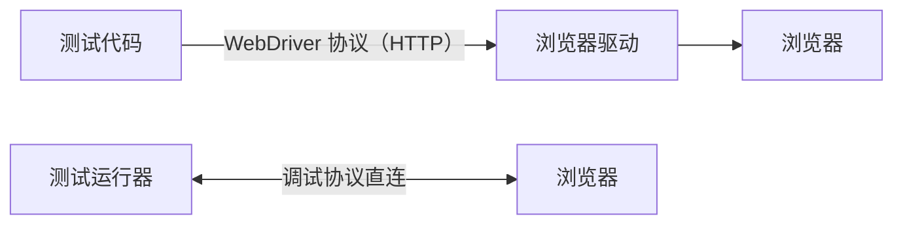
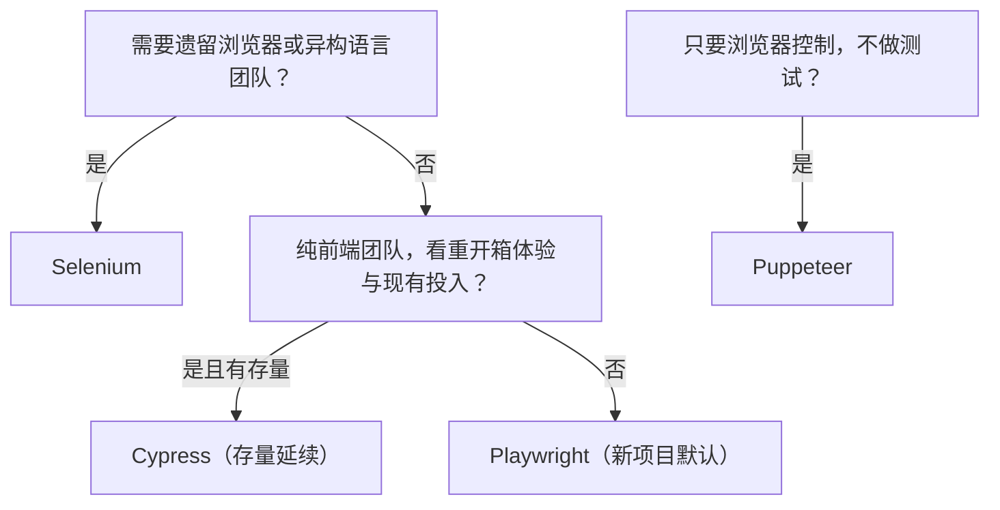

## 1. 四个框架，两种架构

浏览器自动化框架的差异，根源都在**驱动浏览器的方式**：

- **进程外协议**（Selenium）：测试代码经 WebDriver HTTP 协议与浏览器驱动
  通信，每条指令一次网络往返。跨语言、跨浏览器兼容性最好，代价是速度与
  稳定性受协议制约。
- **进程内/直连协议**（Cypress、Playwright、Puppeteer）：测试运行器与浏览器
  通过调试协议深度集成，可直接注入脚本、拦截网络、伪造时钟。快、稳、
  调试体验好，但与特定运行时绑定更深。

前置知识：测试层级（E2E 的定位）、HTML/CSS 选择器、Node.js 或 Python 基础。



## 2. Selenium：跨语言的行业标准

| 维度     | 说明                                                     |
| -------- | -------------------------------------------------------- |
| 协议     | W3C WebDriver 标准，进程外通信                           |
| 语言     | Java、Python、C#、Ruby、JavaScript 等几乎全部主流语言    |
| 浏览器   | 覆盖最广，含 IE/老 Edge 等遗留浏览器                     |
| 生态     | Grid 分布式、Selenium Manager 自动管理驱动（4.6+ 内置）  |
| 短板     | 每条指令一次 HTTP 往返，速度慢；无自动等待，需显式写等待 |

适合：遗留系统回归、团队语言异构（Java 团队 + Python 团队共用一套）、
严格的跨浏览器兼容要求。新建现代 Web 项目若没有这些约束，通常优先
考虑 Playwright。

## 3. Cypress：开箱即用的前端测试体验

| 维度     | 说明                                                     |
| -------- | -------------------------------------------------------- |
| 架构     | 测试与被测应用运行在同一个浏览器进程中，可深度控制 DOM 与网络 |
| 体验     | 时间旅行（每步 DOM 快照）、实时重载、错误提示友好        |
| 网络层   | 内置 `cy.intercept()` 拦截与 Mock 网络                   |
| 限制     | 语言仅 JavaScript/TypeScript；多标签页与多域场景支持有限；单次只控制一个浏览器实例 |

适合：纯前端团队（Vue/React 项目）快速搭建组件与 E2E 测试，重视调试
体验。它的「时间旅行」理念后来被 Playwright 的 Trace Viewer 与 UI Mode
以另一种形式继承。

## 4. Playwright：当前的综合默认选择

Playwright 由 Microsoft 维护，是 2020 年代中期新项目的主流选择：

- **三引擎**：Chromium、Firefox、WebKit 由官方统一构建与驱动，一套代码
  跨浏览器；
- **自动等待**：定位器在动作前自动等待元素可见、可交互，配 web-first
  断言（`expect(locator).toBeVisible()` 等带自动重试），从机制上消除了
  Selenium 时代大部分 flaky 来源；
- **可观测性**：Trace Viewer 记录每步截图、DOM 快照与网络请求，可前后
  回放；UI Mode 提供时间旅行式的本地调试体验；
- **多语言**：TypeScript/JavaScript 为主，官方支持 Python、Java、.NET；
- **超出 E2E**：组件测试、API 测试、多标签页/iframe/多域、移动端仿真。

```typescript
// e2e/login.spec.ts —— 自包含可运行
import { test, expect } from '@playwright/test';

test('用户登录后进入工作台', async ({ page }) => {
  await page.goto('https://app.example.com/login');
  await page.getByLabel('邮箱').fill('user@example.com');   // 语义定位，优于 CSS
  await page.getByLabel('密码').fill('correct-password');
  await page.getByRole('button', { name: '登录' }).click();

  // web-first 断言：自动重试直到超时，不写手工 sleep
  await expect(page).toHaveURL(/.*dashboard/);
  await expect(page.getByRole('heading', { name: '欢迎' })).toBeVisible();
});
```

```bash
npm init playwright@latest   # 脚手架：配置、示例与浏览器安装
npx playwright test          # 命令行执行
npx playwright test --ui     # UI Mode：时间旅行调试
npx playwright show-report   # 打开 HTML 报告与 Trace
```

## 5. Puppeteer：库，不是测试框架

Puppeteer 是 Google 推出的浏览器控制**库**（最初只针对 Chromium，对
Firefox 的支持长期处于实验阶段）。它提供细粒度的浏览器控制能力，常被用于
爬虫、PDF 生成、页面截图与性能采集；它本身没有测试运行器、断言与报告，
做 E2E 需要自行与 Jest/Vitest 组合。**「要做测试」这一需求上，Puppeteer
通常被 Playwright 取代**——API 相似，后者的等待、断言与工程化更完整。

## 6. 选型对比与决策

| 维度           | Selenium       | Cypress         | Playwright          | Puppeteer     |
| -------------- | -------------- | --------------- | ------------------- | ------------- |
| 定位           | 自动化标准协议 | 前端测试运行器  | 全能测试框架        | 浏览器控制库  |
| 语言           | 几乎全部       | JS/TS           | JS/TS、Python、Java、.NET | JS/TS 为主 |
| 浏览器覆盖     | 最广（含遗留） | Chromium 系为主 | 三引擎官方支持      | Chromium 系   |
| 自动等待       | 无（手写）     | 有              | 有                  | 无（手写）    |
| 调试/可观测    | 基础           | 时间旅行        | Trace Viewer + UI Mode | 基础       |
| 多标签/iframe  | 支持           | 支持有限        | 支持                | 支持          |
| 分布式执行     | Grid           | Dashboard/云    | 内置并行分片        | 需自行搭建    |
| 速度与稳定性   | 中             | 快              | 快                  | 快            |

决策路径：



## 7. 常见陷阱

- **在错误的一层定位**：优先 `getByRole`/`getByLabel` 这类语义定位，而非
  脆弱的 CSS 类名或 XPath；语义定位顺带守护可访问性。
- **用 sleep 解决等待**：`waitForTimeout(3000)` 既是慢测试也是 flaky 来源；
  依赖框架的自动等待与条件等待。
- **E2E 数量失控**：把所有分支都堆到 E2E 层，跑一小时还全红。回归测试
  金字塔：E2E 只保留关键业务路径，分支覆盖交给单元/集成层。
- **跨域/多标签误用 Cypress**：需求里有大量多标签、多域流转时，先确认
  框架支持边界再选型，避免中途迁移。
- **忽视无头/有头差异**：本地有头通过、CI 无头失败的案例常见（视口尺寸、
  字体、动画）。统一 viewport、禁用动画、固定时钟可显著减少环境差异。

## 小结

- 初学者要点：Selenium 走标准协议、语言最全但慢；Cypress 体验好但限于
  JS/TS；Playwright 兼顾速度、跨浏览器与可观测性，是新项目默认候选；
  Puppeteer 是控制库而非测试框架。
- 进阶注意：选型先看约束（遗留浏览器、团队语言、现有资产），再看体验；
  flaky 的三大解药是语义定位、自动等待与测试分层；Trace/时间旅行工具
  把 E2E 失败的排查成本从「猜」变成「回放」。
