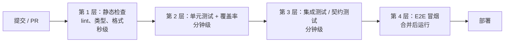

## 1. 为什么需要测试门禁

没有门禁的团队常说「测试在本地跑过就行」，结果主分支上积累着一堆只在
某人机器上通过的代码。**测试门禁（Quality Gate）**把质量标准写进流水线：
任何变更必须先通过自动化检查才允许合并与部署，让「质量标准」从口头约定
变成机器强制。

类比：门禁像机场安检——不管你是谁、改动多小，不达标就不能「登机」；
安检项目（跑什么检查）和标准（阈值多少）公开透明，规则面前一律平等。

前置知识：测试层级（单元/集成/E2E）、覆盖率基本概念、CI 基本工作流。

### 1.1 门禁分层设计



分层原则：**越靠前的检查越快、失败率越高；慢的检查后置**。单元测试必须
秒级反馈，E2E 放到合并后跑，否则开发者会在等待中失去纪律。

### 1.2 门禁内容清单

| 检查         | 典型工具                       | 失败即阻断的项               |
| ------------ | ------------------------------ | ---------------------------- |
| 静态检查     | ESLint、ruff、Checkstyle       | 错误级规则、类型错误         |
| 单元测试     | Vitest、pytest、JUnit          | 任何测试失败                 |
| 覆盖率       | Vitest thresholds、JaCoCo      | 新增代码覆盖率低于阈值       |
| 代码质量     | SonarQube                      | Quality Gate 为 Failed       |
| 安全扫描     | 依赖审计、SAST（Semgrep 等）   | 高危漏洞                     |
| 构建产物     | 构建 + 冒烟                    | 构建失败、健康检查不过       |

## 2. 覆盖率门禁：卡新增，不卡存量

覆盖率门禁最常见的失败方式是「一刀切」：要求全库 80%，但存量代码只有
40%，门禁永远红，最后被大家默契地关掉。正确做法是**对增量代码设卡**：

- SonarQube 的 `new coverage` 条件只统计新代码/变更代码；
- diff-cover、undercover 等工具只检查本次 diff 被测试覆盖的比例；
- 存量债务单独立专项行动逐步偿还，不阻塞日常 PR。

### 2.1 JaCoCo（Java）的 check 配置

```xml
<!-- pom.xml：jacoco-maven-plugin 的 check 目标 -->
<execution>
  <id>check</id>
  <goals><goal>check</goal></goals>
  <configuration>
    <rules>
      <rule>
        <element>BUNDLE</element>
        <limits>
          <limit>
            <counter>BRANCH</counter>
            <value>COVEREDRATIO</value>
            <minimum>0.80</minimum>  <!-- 分支覆盖率不低于 80% -->
          </limit>
        </limits>
      </rule>
    </rules>
  </configuration>
</execution>
```

`mvn verify` 时低于阈值即构建失败；`counter` 可换 `LINE`、`INSTRUCTION`，
配合「分支覆盖」语义更严（见「白盒测试覆盖度」）。

### 2.2 Vitest thresholds（JavaScript/TypeScript）

```typescript
// vitest.config.ts
export default {
  test: {
    coverage: {
      provider: 'v8',              // 默认 v8，精确度经 AST 重映射后与 Istanbul 相当
      include: ['src/**'],
      thresholds: {
        branches: 80,
        functions: 80,
        lines: 80,
        statements: 80,
      },
    },
  },
};
```

### 2.3 SonarQube Quality Gate

SonarQube 用「条件集合」定义质量门，默认的「Sonar way」即：新代码覆盖率
达标、无新增阻断级问题、安全热点已评审、重复率与复杂度不超限。与 CI 集成
时流水线向 SonarQube 提交分析结果，再回调查询门禁结论决定放行：

```yaml
# GitHub Actions 片段（示意）
- run: mvn verify sonar:sonar -Dsonar.projectKey=demo
- run: |
    # 轮询 Quality Gate Status，非 OK 则退出非零，阻断合并
    bash ci/wait_for_quality_gate.sh
```

## 3. Flaky 测试：门禁可信度的头号敌人

**flaky（抖动）测试**指同一代码下结果时好时坏的测试。它对门禁的破坏是
根本性的：重跑能过，大家就开始「重跑文化」，门禁失去威慑力。

常见成因与治理：

| 成因                     | 治理手段                                   |
| ------------------------ | ------------------------------------------ |
| 用例间共享状态、执行顺序 | 每个用例自建自清；随机顺序运行暴露依赖     |
| 时间、时区、随机数       | 注入时钟/随机源，用固定种子                |
| 等待写死（sleep）        | 事件驱动等待（如 Playwright 自动等待）     |
| 真实外部依赖             | 替身化或本地化（Testcontainers、契约测试） |
| 并发竞争                 | 用例内避免并行断言同一资源                 |

工程实践：CI 中统计每条用例的失败率，高抖动用例自动移入「隔离区」
（标记隔离并开单修复），而不是允许无限重试；部分平台（如 Playwright、
JUnit 平台插件）能输出重试与稳定性报告辅助定位。

## 4. 进阶门禁：变异测试与性能预算

### 4.1 变异测试：检验测试的有效性

覆盖率说「代码被执行过」，变异测试问「测试真能发现错误吗」。它向代码注入
微小变异（把 `>` 改成 `>=`、删掉一次取反），每个变异体称为一个 mutant；
跑测试套件，**被测试杀死的 mutant 比例即变异分数**。存活 mutant 说明该处
逻辑没有任何断言保护。

- Java/Kotlin 事实标准是 **PIT（pitest）**，字节码级变异，大项目通常
  几十分钟内完成；
- JavaScript/TypeScript 用 **Stryker**（StrykerJS，另有 .NET、Scala 版本），
  大型项目耗时明显更长，建议限定目录与 mutator 子集后 nightly 运行；
- 变异测试成本高，不适合每个 PR 全量执行，常作为门禁的进阶层或定时任务。

### 4.2 性能预算进入流水线

性能回归也应被门禁拦截：k6 这类脚本化压测工具可在 CI 对关键接口跑小规模
基线压测，`thresholds` 定义「P95 响应时间、错误率」等阈值，超限即失败；
Lighthouse CI 则守卫前端性能预算。注意 CI 机器噪声大，阈值要留余量并把
绝对数值比较换成「与基线对比的相对变化」。

## 5. 常见陷阱

- **红着 merge**：管理员权限绕过门禁救急一次，标准就永远回不去了。
  救急应走「回滚代码」而不是「跳过检查」。
- **门禁全红常态化**：阈值一步到位设 90%，全员习惯性无视。从现状出发
  设「新增代码」阈值，逐步收紧。
- **覆盖率指标博弈**：为达标写无断言测试。用变异测试抽查或评审把关。
- **慢门禁**：不并行、不缓存依赖、全量 E2E 每 PR 都跑，反馈时间超过
  15 分钟后开发者开始攒大 PR，恶性循环。用分片并行（sharding）、结果
  缓存、受影响测试选择（如 `pytest-testmon`、Nx affected）提速。

## 小结

- 初学者要点：门禁 = 机器强制的质量标准；分层排列（快检查在前）；
  覆盖率卡新增代码；失败必须修复或回滚，不允许静默重跑。
- 进阶注意：flaky 治理决定门禁可信度，隔离区机制比无限重试健康；
  变异测试（PIT/Stryker）检验测试有效性，适合定时任务；性能与安全
  检查同样是门禁的一等公民。
