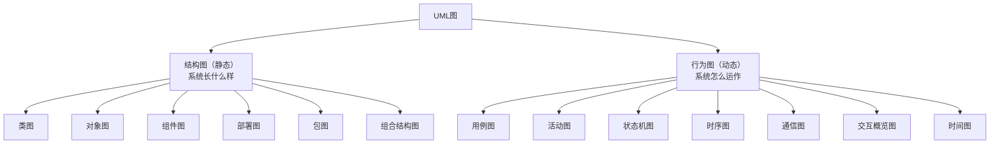
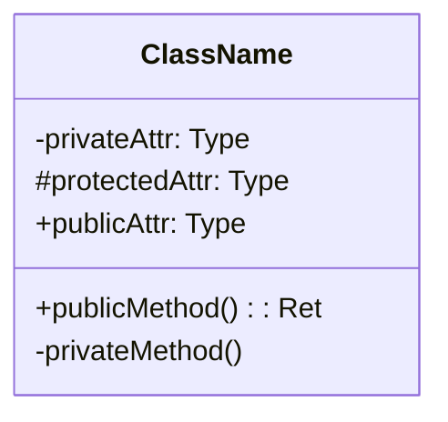
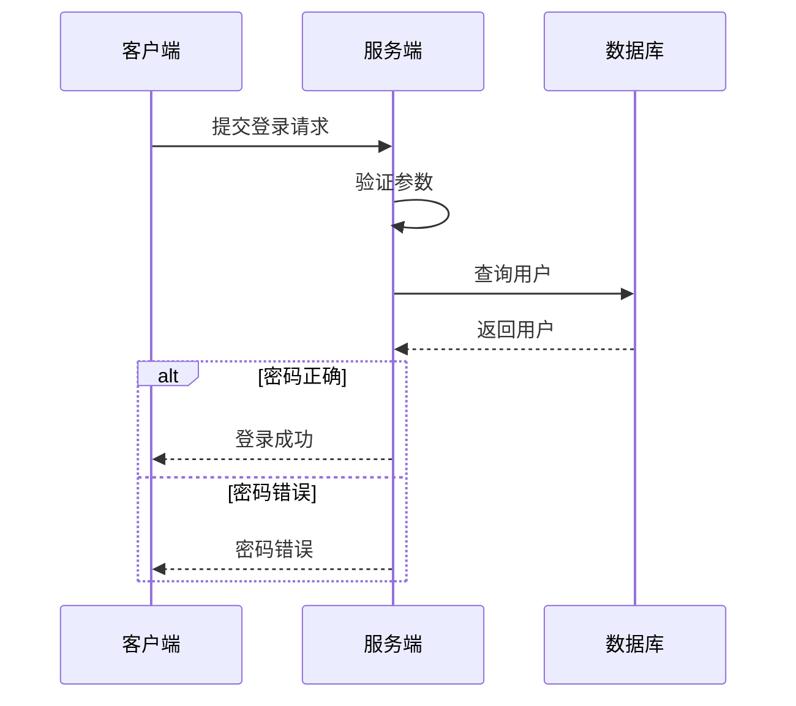
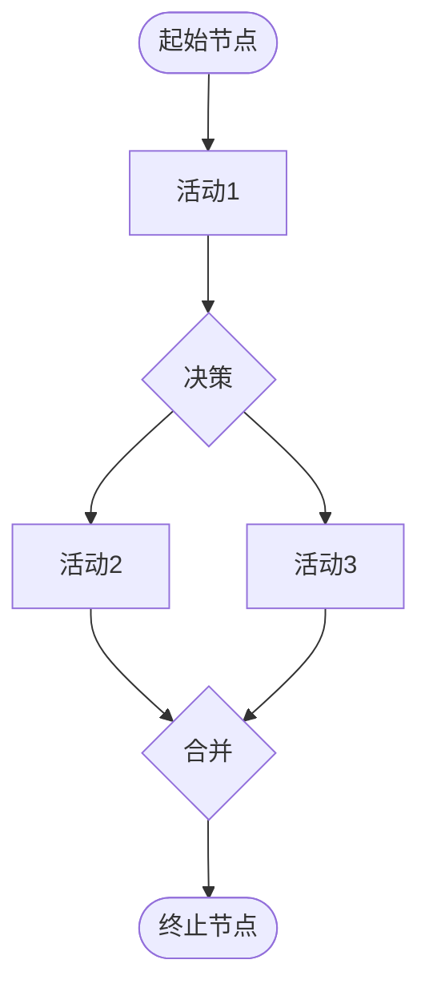
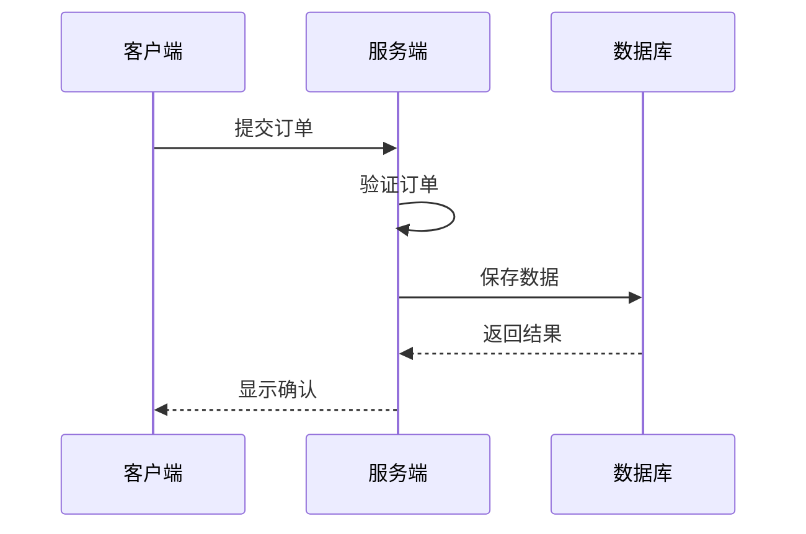
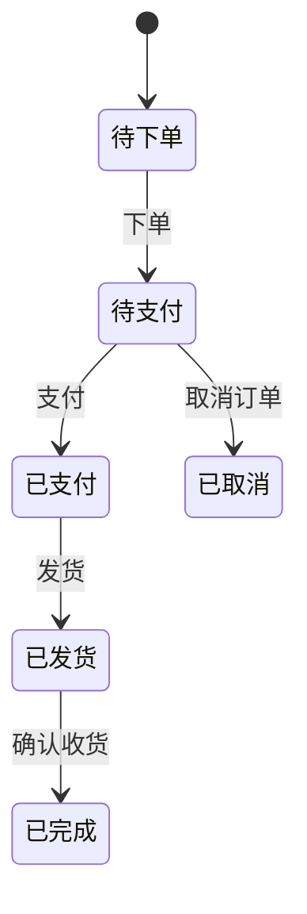
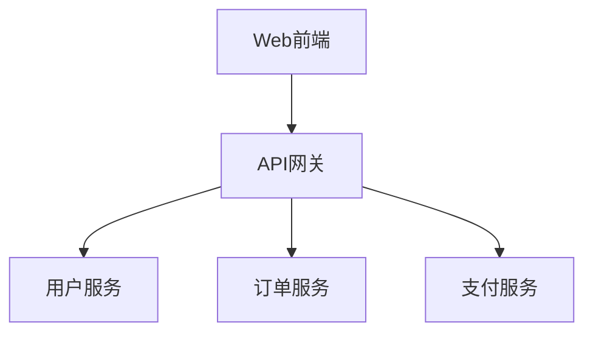
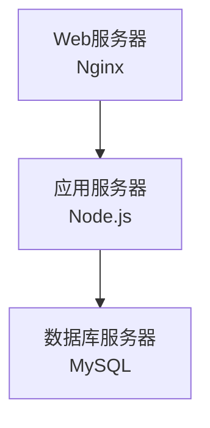

## 1. 从"建筑施工图"说起

### 1.1 为什么需要"图"

想象盖一栋大楼。施工队不会靠"口头描述"干活，而是看**建筑施工图**——每根梁在哪、每堵墙多厚、管线怎么走，都画得清清楚楚。图纸让"想法"变成"可执行的规范"。

**UML（Unified Modeling Language，统一建模语言）就是软件的"建筑施工图"**：用一套标准化的图形，描述软件的**结构**（类、对象、组件）和**行为**（流程、状态、交互），让团队对"系统长什么样、怎么运作"达成一致认知。

### 1.2 UML 的两种图

UML 定义了 14 种图，分为两大类：

**核心认知**：不需要掌握全部 14 种。日常开发最常用的只有 **5 种**：类图（结构）、时序图（交互）、活动图（流程）、状态机图（状态）、用例图（需求）。本篇重点讲这 5 种。

## 2. 类图：系统的"骨架"

类图是**最常用、最重要**的 UML 图，描述系统的类、类的属性和方法、以及类之间的关系。它是面向对象设计的"主图"。

### 2.1 类的表示

**符号含义**：

| 符号 | 可见性 |
| :--- | :--- |
| `+` | public（公开） |
| `-` | private（私有） |
| `#` | protected（受保护） |

### 2.2 类间关系（重点）

类之间的关系是类图的核心。六种关系按"强度"排列：

| 关系 | 符号 | 含义 | 示例 |
| :--- | :--- | :--- | :--- |
| 依赖 | - - → | A 使用 B（临时使用） | 方法参数 |
| 关联 | ——→ | A 知道 B（长期引用） | 成员变量 |
| 聚合 | ◇——→ | A 包含 B（弱拥有，B 可独立存在） | 部门-员工 |
| 组合 | ◆——→ | A 拥有 B（强拥有，B 随 A 消亡） | 人-心脏 |
| 泛化 | ——▷ | A 继承 B | 子类-父类 |
| 实现 | - -▷ | A 实现 B 接口 | 实现类-接口 |

**关系强度**：依赖 < 关联 < 聚合 < 组合 < 泛化/实现

**最容易混淆的是聚合 vs 组合**：

- **聚合**（弱拥有）：部门没了，员工还在（员工属于公司，但可以跳槽）——用空心菱形
- **组合**（强拥有）：人没了，心脏也没了（部件不能独立存在）——用实心菱形

**判断技巧**：问"如果整体消失了，部分还能存在吗？"能 → 聚合；不能 → 组合。

### 2.3 多重性

| 标记 | 含义 |
| :--- | :--- |
| 1 | 恰好一个 |
| 0..1 | 零或一个 |
| * | 任意多个 |
| 1..* | 一个或多个 |
| 0..* | 零或多个 |

**示例**：订单类图中，`Order 1 ── * OrderItem` 表示"一个订单包含多个订单项"。

## 3. 时序图：系统的"对话记录"

时序图描述**对象之间按时间顺序的消息交互**——就像一段"对话记录"，看出"谁先调谁、谁等谁、结果如何"。

### 3.1 基本元素

| 元素 | 说明 |
| :--- | :--- |
| 参与者 | 交互的对象 |
| 生命线 | 虚线，表示对象存在时间 |
| 激活条 | 矩形条，表示对象正在执行 |
| 同步消息 | 实心箭头，等待返回 |
| 异步消息 | 开放箭头，不等待 |
| 返回消息 | 虚线箭头 |
| 自调用 | 消息指向自身 |

### 3.2 一个登录时序图示例

### 3.3 组合片段

时序图可以表达复杂逻辑：

| 操作符 | 含义 |
| :--- | :--- |
| alt | 条件分支（if-else） |
| opt | 可选执行（if） |
| loop | 循环 |
| par | 并行执行 |
| critical | 临界区 |
| break | 中断 |

## 4. 活动图：系统的"流程图"

活动图描述**业务流程或算法逻辑**——类似流程图，但更规范。

### 4.1 基本元素

| 元素 | 说明 |
| :--- | :--- |
| 起始节点 | 实心圆 |
| 终止节点 | 实心圆加外圈 |
| 活动节点 | 圆角矩形 |
| 决策节点 | 菱形 |
| 合并节点 | 菱形 |
| 分叉/汇合 | 粗横线（并行） |
| 泳道 | 分区表示职责 |

### 4.2 泳道活动图

泳道（Swimlane）把活动按"执行者"分区，展示"谁负责哪一步"：

**泳道的价值**：一眼看出"职责分布"——哪里是客户端的活、哪里是服务端的活、哪里是数据库的活。这对接口设计（谁该提供什么）很有帮助。

## 5. 状态机图：系统的"状态变化"

状态机图描述**对象的状态变化**——特别适合订单、审批、流程类系统。

### 5.1 基本元素

### 5.2 状态转换表

状态机图也可以用表格表达（状态转换表），两者等价：

| 当前状态 | 事件 | 动作 | 目标状态 |
| :--- | :--- | :--- | :--- |
| 待下单 | 下单 | 创建订单 | 待支付 |
| 待支付 | 支付 | 处理支付 | 已支付 |
| 待支付 | 取消 | 释放库存 | 已取消 |
| 已支付 | 发货 | 更新物流 | 已发货 |
| 已发货 | 确认收货 | 完成订单 | 已完成 |

**状态机图的实战价值**：开发前画好状态图，能提前发现"非法状态转换"（如"已取消 → 已发货"就不应该存在），避免上线后出 bug。

## 6. 其他常用 UML 图

### 6.1 组件图

展示系统的**组件及其依赖关系**（架构层面）：

### 6.2 部署图

展示**硬件节点和软件部署**（运维层面）：

### 6.3 用例图

展示"谁（参与者）能用系统做什么（用例）"（需求层面，见《需求分析方法》）：

## 7. 实践建议：怎么用好 UML

**UML 不是"画得越全越好"，而是"在合适的时候画合适的图"**：

| 场景 | 推荐图 |
| :--- | :--- |
| 需求讨论 | 用例图、活动图 |
| 设计阶段 | 类图、时序图 |
| 状态复杂系统 | 状态机图 |
| 架构评审 | 组件图、部署图 |

**工具推荐**：

- **Mermaid**（本文档所用）：Markdown 内嵌，版本可控（文档即代码）
- PlantUML：文本描述 UML，自动生成图
- draw.io / StarUML：可视化拖拽

**核心原则**：**图的价值在于沟通，不在于美观**。一张"画得很丑但大家看懂了的图"，远胜"画得很漂亮但没人看得懂的图"。

## 8. 常见误区

**误区一：要把 14 种 UML 图全部掌握。** → 日常开发 5 种够用（类图、时序图、活动图、状态机图、用例图），其余用到再学。

**误区二：UML 图是"画完就扔"的文档。** → 图是"活文档"，要随代码一起维护（文档即代码）。过期的图比没有更糟。

**误区三：聚合和组合分不清没关系。** → 这是类图最常见的考点和实战点。记住"整体消失，部分还能存在吗"——能是聚合，不能是组合。

**误区四：UML 是"设计阶段"的专属。** → UML 可以用于任意阶段的沟通——需求讨论（用例图）、代码走读（类图）、故障排查（时序图）。
