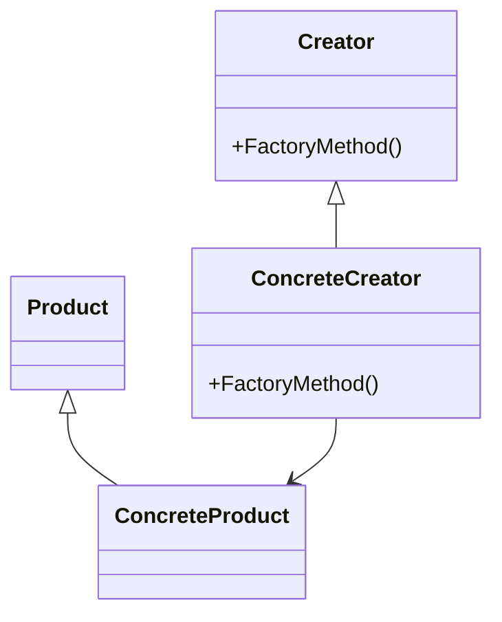
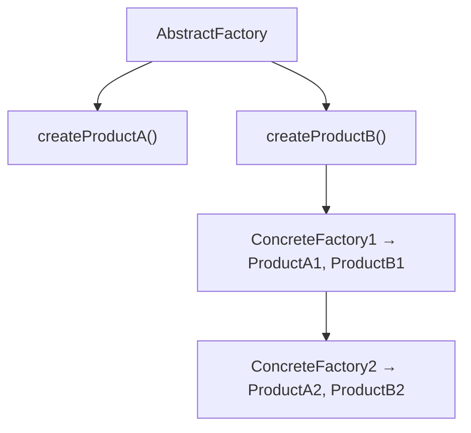
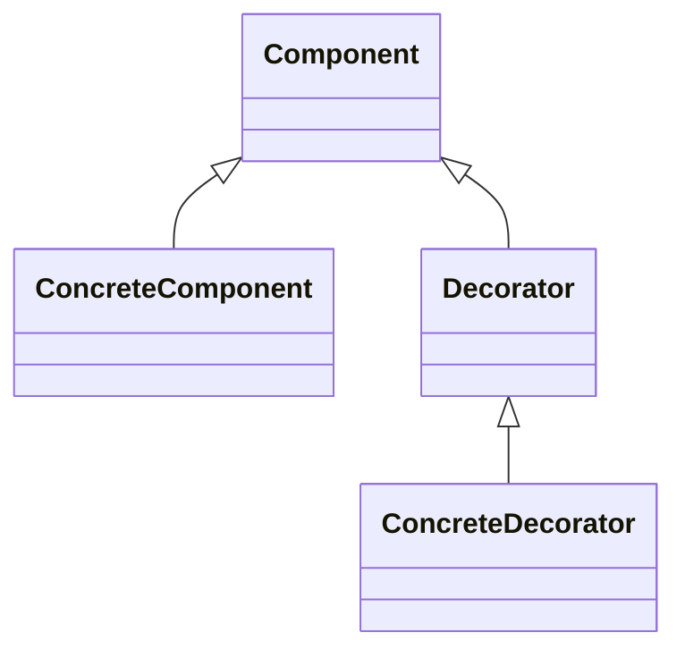

## 1. 从"盖房子的预制件"说起

### 1.1 设计模式是什么

想象盖房子。没有预制件时，每一堵墙、每一扇窗都要现场设计、现场浇筑；有了标准化的预制件（门窗、楼梯、梁柱的标准做法），工程师不用每次"发明"怎么搭，直接套用成熟方案即可。

**设计模式（Design Pattern）就是软件设计的"预制件"**：它是**经过验证的、可复用的解决方案**，针对"反复出现的软件设计问题"。

**权威定义**（GoF《设计模式》）：设计模式是对**特定场景下反复出现的问题**的**可复用解决方案**的描述。

### 1.2 三个关键词

| 关键词 | 含义 |
| :--- | :--- |
| 特定场景 | 模式不是万能的，只解决特定问题 |
| 反复出现 | 是"常见问题"的总结，不是一次性的灵感 |
| 可复用 | 可以在不同项目中重复使用 |

**重要认知**：设计模式不是"代码模板"（不是抄一段代码），而是"**解决问题的思路**"——它描述的是"类之间如何组织、对象之间如何协作"，具体实现可以千变万化。

## 2. 三大分类与设计原则

### 2.1 三大分类

GoF 把 23 种设计模式分为三类：

| 类型 | 数量 | 关注点 | 类比 |
| :--- | :--- | :--- | :--- |
| 创建型 | 5 | 对象创建机制 | 怎么"造"东西 |
| 结构型 | 7 | 对象组合方式 | 怎么"组装"东西 |
| 行为型 | 11 | 对象间通信 | 怎么"协作" |

### 2.2 六大设计原则（理解模式的前提）

设计模式是这些原则的具体实现。**先理解原则，再看模式就"顺理成章"**：

| 原则 | 说明 | 通俗理解 |
| :--- | :--- | :--- |
| 单一职责（SRP） | 一个类只有一个变化原因 | 一个人只做一件事 |
| 开闭原则（OCP） | 对扩展开放，对修改关闭 | 加新功能不改旧代码 |
| 里氏替换（LSP） | 子类可以替换父类 | 能替换而不出问题 |
| 接口隔离（ISP） | 接口应该小而专 | 接口不要"大而全" |
| 依赖倒置（DIP） | 依赖抽象而非具体 | 面向接口编程 |
| 迪米特法则 | 最少知识原则 | 不要和陌生人说话 |

## 3. 创建型模式：怎么"造"对象

### 3.1 单例模式（Singleton）

**问题**：某些对象（配置、连接池、日志）全局只需要一个实例。

**解决**：确保一个类只有一个实例，并提供一个全局访问点。

```java
// 双重检查锁
public class Singleton {
    private static volatile Singleton instance;
    private Singleton() {}
    public static Singleton getInstance() {
        if (instance == null) {
            synchronized (Singleton.class) {
                if (instance == null) {
                    instance = new Singleton();
                }
            }
        }
        return instance;
    }
}
```

**要点**：构造器私有（外部不能 new）、getInstance 提供全局访问、双重检查锁保证并发安全。

**注意**：单例有争议（全局状态难测试）。现代框架（Spring）默认单例但由容器管理，比手写单例更优雅。

### 3.2 工厂方法模式（Factory Method）

**问题**：创建对象时，具体类型可能变化——不想在代码里写死 `new ConcreteProduct()`。

**解决**：定义创建对象的接口，让子类决定实例化哪个类。



**场景**：日志系统要支持"文件日志/数据库日志/控制台日志"——用工厂方法，客户端只依赖 `Logger` 接口，新增日志类型不改客户端。

### 3.3 抽象工厂模式（Abstract Factory）

**问题**：需要创建"一组相关对象"，且这一组对象要保持风格一致。

**解决**：提供一个创建"一组对象"的接口。



**场景**：UI 主题系统——"暗色主题"工厂创建暗色按钮+暗色输入框，"亮色主题"工厂创建亮色组件。保证"同一主题的组件风格一致"。

### 3.4 建造者模式（Builder）

**问题**：创建"有大量可选参数"的复杂对象时，构造函数参数太多、可读性差。

**解决**：分步骤构建对象。

```java
User user = User.builder()
    .name("张三")
    .age(25)
    .email("zhangsan@example.com")
    .build();
```

**场景**：配置对象、DTO 等"可选字段很多"的对象。Lombok 的 `@Builder` 就是此模式的实现。

### 3.5 原型模式（Prototype）

**问题**：创建"与已有对象相同"的对象时，直接 new 可能很贵（大对象、深拷贝）。

**解决**：通过克隆已有对象来创建新对象。

```java
public class Prototype implements Cloneable {
    public Prototype clone() {
        return (Prototype) super.clone();
    }
}
```

**场景**：游戏中的大量 NPC、文档模板复制。注意深拷贝与浅拷贝的区别。

## 4. 结构型模式：怎么"组装"对象

### 4.1 适配器模式（Adapter）

**问题**：两个类的接口不兼容（"插头不匹配"）。

**解决**：加一个适配器，把"不匹配的接口"转换为"客户期望的接口"。

```
Client → [Target接口] ← [Adapter] → [Adaptee]
```

**场景**：对接第三方 SDK、旧系统接口——用一个 Adapter 翻译接口，不改业务代码（这就是 DDD 里的防腐层思想，见本模块「DDD」一文）。

### 4.2 装饰器模式（Decorator）

**问题**：想动态地给对象添加功能，而不是改类本身。

**解决**：用"包装"的方式一层层叠加功能。



```java
InputStream in = new FileInputStream("file.txt");
in = new BufferedInputStream(in);    // 装饰：缓冲
in = new GZIPInputStream(in);         // 装饰：解压
```

**场景**：Java IO 流（缓冲、压缩、加密层层包装）、日志（加时间戳、加级别过滤）。**装饰器是"叠加功能"最优雅的方式**——比继承子类组合更灵活。

### 4.3 代理模式（Proxy）

**问题**：想控制对对象的访问（延迟加载、权限控制、远程访问）。

**解决**：用一个代理对象控制对真实对象的访问。

| 代理类型 | 说明 |
| :--- | :--- |
| 虚拟代理 | 延迟创建开销大的对象 |
| 远程代理 | 为远程对象提供本地代表 |
| 保护代理 | 控制访问权限 |
| 智能引用 | 添加额外操作（引用计数） |

**场景**：图片懒加载（虚拟代理）、RPC 客户端（远程代理）、Spring AOP（动态代理）。

### 4.4 其他结构型模式

| 模式 | 意图 |
| :--- | :--- |
| 外观（Facade） | 为子系统提供统一接口（"门面"） |
| 桥接（Bridge） | 分离抽象与实现 |
| 组合（Composite） | 树形结构统一处理（文件系统） |
| 享元（Flyweight） | 共享对象减少内存（字符串池） |

## 5. 行为型模式：对象怎么"协作"

### 5.1 观察者模式（Observer）

**问题**：一个对象变化了，多个对象要响应（一对多依赖）。

**解决**：定义一对多的依赖，主题变化时自动通知所有观察者。

```mermaid
flowchart TD
    S[Subject<br/>attach(observer)<br/>detach(observer)<br/>notify()]
    S -->|Observer.update()| O1[ConcreteObserver1]
    S -->|Observer.update()| O2[ConcreteObserver2]
```

**场景**：消息通知、事件监听、发布订阅系统（这就是事件驱动架构的雏形，见本模块「事件驱动架构」一文）。

### 5.2 策略模式（Strategy）

**问题**：算法（排序、计费、认证方式）可以替换，且不想用一堆 if/else。

**解决**：定义算法族，封装后使它们可以互换。

```java
interface SortStrategy {
    void sort(int[] array);
}

class QuickSort implements SortStrategy { ... }
class MergeSort implements SortStrategy { ... }

class Sorter {
    private SortStrategy strategy;
    public void setStrategy(SortStrategy s) { this.strategy = s; }
    public void sort(int[] arr) { strategy.sort(arr); }
}
```

**场景**：运费计算（不同地区不同算法）、支付方式（微信/支付宝/银行卡）——**用策略替代 if/else 是消除重复 switch 的经典手法**（见《代码重构》）。

### 5.3 模板方法模式（Template Method）

**问题**：一个算法的"骨架"固定，但其中某些步骤实现不同。

**解决**：在父类定义算法骨架，子类实现具体步骤。

```java
abstract class DataProcessor {
    public final void process() {  // 模板方法
        readData();
        transformData();
        writeData();
    }
    protected abstract void readData();
    protected abstract void transformData();
    protected void writeData() { /* 默认实现 */ }
}
```

**场景**：数据处理流程（读→转换→写）、Spring 的 `JdbcTemplate`、`HttpServlet` 的 doGet/doPost。

### 5.4 其他行为型模式

| 模式 | 意图 |
| :--- | :--- |
| 命令（Command） | 将请求封装为对象（支持撤销/排队） |
| 迭代器（Iterator） | 顺序访问集合元素 |
| 中介者（Mediator） | 集中管理对象间交互（聊天室） |
| 备忘录（Memento） | 保存和恢复对象状态（存档） |
| 状态（State） | 允许对象在状态改变时改变行为 |
| 职责链（Chain of Responsibility） | 沿链传递请求（中间件） |
| 访问者（Visitor） | 在不改变类的前提下添加操作 |
| 解释器（Interpreter） | 定义语言的文法及解释器 |

## 6. 模式选择指南

**遇到问题时怎么选模式**？按"问题类型"查找：

| 问题 | 推荐模式 |
| :--- | :--- |
| 需要唯一实例 | 单例 |
| 创建对象逻辑复杂 | 工厂方法/抽象工厂 |
| 分步构建复杂对象 | 建造者 |
| 接口不兼容 | 适配器 |
| 动态添加功能 | 装饰器 |
| 一对多依赖 | 观察者 |
| 算法可替换 | 策略 |
| 算法骨架固定 | 模板方法 |
| 请求需要排队/撤销 | 命令 |
| 状态驱动的行为 | 状态 |

## 7. 常见误区

**误区一：设计模式 = 代码模板，背下来就能用。** → 模式是"解决问题的思路"，不是"可以抄的代码"。理解"解决什么问题、为什么这样设计"，比背代码重要得多。

**误区二：用得越多越好。** → 恰恰相反！**过度使用设计模式是"过度设计"**（违背 YAGNI）。能用简单代码解决的，就不要硬套模式。

**误区三：23 种模式都要掌握。** → 日常开发 80% 的场景只用 5-6 个模式（单例、工厂、策略、观察者、装饰器、模板方法）。先把常用的用熟，其他的用到再学。

**误区四：设计模式是"Java 的事"。** → 模式是语言无关的。JavaScript（回调即策略）、Python（装饰器语法糖）等语言同样适用——只是实现方式不同。

**误区五：设计模式能解决所有设计问题。** → 模式解决"局部设计问题"（类与对象组织）；系统级的架构问题（微服务、分层）用"架构模式"解决（见本模块「软件架构概述」）。
