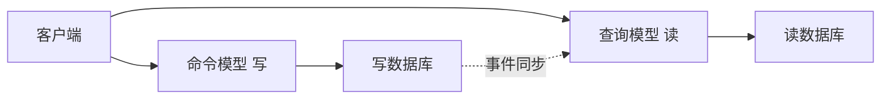
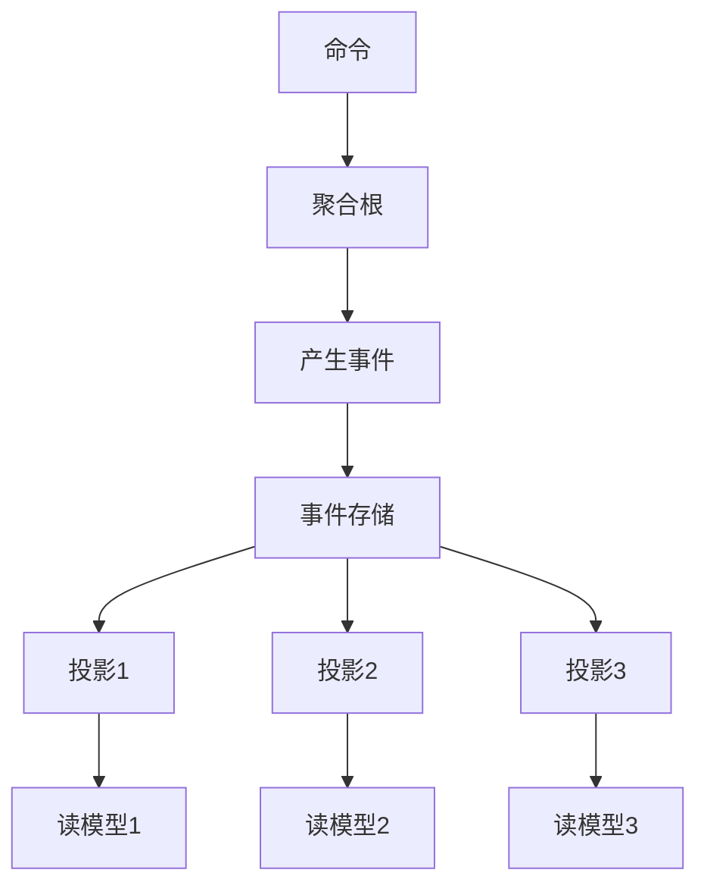

## 1. 从"杂志订阅"说起：什么是事件驱动

### 1.1 打电话 vs 订杂志

想象两家出版社通知用户"新刊出版了"：

**出版社 A（同步打电话）**：编辑挨个给订户打电话，告诉"新刊出版了"。问题：

- 订户不接电话，编辑就得一直等
- 打电话时，编辑被"锁住"了，没法做别的事
- 如果订户搬到国外，编辑还得重新打国际长途

**出版社 B（订阅杂志）**：杂志印好后放到发行渠道，订户**自己订阅**——谁感兴趣谁订，订了的到货就能收到，没订的人自然收不到。出版社**不需要知道**有多少人订、谁是订户，它只管"把杂志发行出去"。

**事件驱动架构（Event-Driven Architecture）就是"出版社 B 的模式"**：系统的各个组件之间不"直接打电话"（同步调用），而是通过"事件"（杂志）通信——生产者只管"发布事件"，消费者"订阅自己关心的事件"。

### 1.2 事件驱动 vs 传统请求-响应

| 对比 | 传统请求-响应 | 事件驱动 |
| :--- | :--- | :--- |
| 通信方式 | 同步调用（A 调 B 等 B 返回） | 异步发布（A 发事件，不关心谁消费） |
| 耦合 | A 知道 B 的存在（强耦合） | A 不知道消费者是谁（松耦合） |
| 等待 | A 必须等 B 处理完 | A 发完就走 |
| 失败影响 | B 挂了 A 也失败 | 消费者挂了，生产者不受影响 |
| 类比 | 打电话 | 订杂志 |

### 1.3 核心概念

| 概念 | 定义 | 类比 |
| :--- | :--- | :--- |
| 事件（Event） | "已经发生的、有意义的事"的记录 | 一本杂志 |
| 生产者（Producer） | 产生事件的组件 | 出版社 |
| 消费者（Consumer） | 处理事件的组件 | 订户 |
| 通道（Channel） | 事件传输的媒介（消息队列/事件总线） | 发行渠道 |
| 事件存储（Event Store） | 事件的持久化存储 | 杂志档案馆 |

**关键认知**：事件描述的是"**已经发生**的事实"（过去时），而不是"请求"（命令）。例如：

- "订单已创建"（OrderCreated）是事件
- "请创建订单"（CreateOrder）是命令（请求）

这个区别很重要：事件是**事实记录**，不能被"拒绝"——它已经发生了；消费者只能决定"要不要响应它"。

## 2. 事件驱动的两种拓扑

事件驱动有两种主要实现形态（拓扑）：

### 2.1 事件通知（Event Notification）

**生产者只发布"发生了什么"，不携带具体数据**，消费者需要时再主动查询。

```
订单服务: "订单已创建"（只含订单ID）
→ 邮件服务: 收到通知，主动调订单服务查详情，再发邮件
→ 库存服务: 收到通知，主动调订单服务查详情，再扣库存
```

**特点**：事件很小（只含 ID），事件间依赖查询。

**优点**：事件精简、消费者按需取数。

**缺点**：消费者收到通知后还要回查，增加一次往返；如果回查时数据已变，可能拿不到当时的快照。

### 2.2 事件携带状态转移（Event Carrying State Transfer）

**生产者发布的事件自带完整数据**，消费者无需回查。

```
订单服务: "订单已创建"（含订单全部数据）
→ 邮件服务: 直接用事件里的数据发邮件
→ 库存服务: 直接用事件里的数据扣库存
```

**特点**：事件是"数据快照"，消费者自给自足。

**优点**：消费者无需回查、解耦最彻底。

**缺点**：事件可能很大；数据在事件里复制一份，存在"事件数据与源数据不同步"的风险。

### 2.3 如何选择

- 消费者**总是需要最新数据** → 用事件通知（回查保证最新）
- 消费者**只需要事件发生时的快照** → 用事件携带状态转移
- 权衡：回查成本 vs 数据同步风险

## 3. 事件溯源（Event Sourcing）：不存结果，存过程

### 3.1 记账本思维

传统系统的数据存储方式是"记结果"：账户余额现在是 700 元，就存 700。

**事件溯源（Event Sourcing）换了一种思路：不存"当前状态"，只存"所有发生过的事件"。** 想要当前状态？把事件从头到尾重放一遍即可。

```
传统方式:
  账户余额 = 700（只存结果，不知道 700 是怎么来的）

事件溯源:
  AccountCreated(balance=0)
  MoneyDeposited(amount=500)    → 余额 500
  MoneyDeposited(amount=300)    → 余额 800
  MoneyWithdrawn(amount=100)    → 余额 700
  当前余额 = 0 + 500 + 300 - 100 = 700
```

**为什么这是有价值的？** 因为"结果"会丢失历史，而"过程"永远可追溯：

- 想知道"这个账户 3 个月前发生了什么"？重放事件
- 想知道"这个余额是怎么来的"？看事件链
- 想修正一个历史错误？不是改数据，而是追加一条"更正事件"

### 3.2 事件溯源的工作方式

```mermaid
flowchart TD
    E[事件流]<br/>1 AccountCreated {id: A1}<br/>2 MoneyDeposited {amt: 500}<br/>3 MoneyDeposited {amt: 300}<br/>4 MoneyWithdrawn {amt: 100}
```

- 事件是**追加写**的（append-only）：只增不改不删
- 事件是**不可变**的：已发生的事实不能修改
- 当前状态 = 重放所有事件得到的"投影"（projection）

### 3.3 快照优化

事件无限累积后，重放会越来越慢。解决方法是**定期存快照**：

```
快照@事件100: {balance: 700, ...}   ← 每 100 个事件存一次
事件101: MoneyDeposited(200)
事件102: MoneyWithdrawn(50)

重建状态: 从"事件100快照"开始 + 重放事件101-102
= 700 + 200 - 50 = 850
```

快照让"重放"变成"从快照续播"，大幅降低重建成本。

### 3.4 事件溯源的优缺点

| 优点 | 缺点 |
| :--- | :--- |
| 完整审计追踪（所有操作有据可查） | 事件流可能很长（存储和重放成本） |
| 时间旅行（可重建任意时刻状态） | 查询复杂（需要投影支持） |
| 天然适合事件驱动 | 事件模式演进困难（旧事件要兼容） |
| 事件不可变，天然安全 | 需要快照优化和投影机制 |

**适用场景**：金融、审计要求高的系统；需要"任意时刻状态回溯"的系统（如余额、库存流水）。

**不适用场景**：简单 CRUD（杀鸡用牛刀）；对查询性能要求极高且无法接受投影延迟的场景。

## 4. CQRS：命令查询职责分离

### 4.1 一个问题：读写混在一起的困境

传统架构里，读和写共用同一个数据模型（同一个数据库、同一套实体）。这在高并发场景下有问题：

- 写操作需要严格校验和事务
- 读操作需要灵活高效的查询
- 两者对数据模型的要求常常冲突：写要"稳定一致"，读要"灵活多样"

**CQRS（Command Query Responsibility Segregation，命令查询职责分离）** 的解法：**把"写"（命令）和"读"（查询）分成两个独立的模型。**



### 4.2 CQRS 的核心思想

| 概念 | 说明 |
| :--- | :--- |
| 命令（Command） | 改变状态的请求（"创建订单""扣库存"），有副作用 |
| 查询（Query） | 读取状态的请求（"查订单详情"），无副作用 |
| 写模型 | 处理命令，保证一致性和业务规则 |
| 读模型 | 处理查询，针对查询场景优化（缓存、反规范化） |
| 同步 | 写模型变化 → 通过事件更新读模型（最终一致） |

### 4.3 CQRS + 事件溯源：黄金组合

CQRS 和事件溯源常常搭配使用，因为它们天然互补：



- **写端**：事件溯源，保证数据完整性和审计
- **读端**：为不同查询场景构建不同的"投影"（读模型）
- **同步**：异步事件驱动，最终一致

**例**：电商系统里，订单的读模型可能有三个投影：

- 投影1：用户视角的订单列表（按时间倒序）
- 投影2：运营视角的订单统计（按商品聚合）
- 投影3：客服视角的订单详情（含完整物流信息）

每个投影针对自己的查询优化，互不影响。

### 4.4 CQRS 适用场景

| 适用 | 不适用 |
| :--- | :--- |
| 读写负载差异大（读远多于写） | 简单 CRUD 应用 |
| 业务规则复杂（写端需要严格校验） | 小型应用（复杂度不划算） |
| 需要不同读模型服务不同场景 | 团队经验不足 |
| 与事件溯源搭配（审计、追溯） | 强一致要求（读必须立即反映写） |

**重要提醒**：CQRS 增加了复杂度（两个模型 + 同步机制），**不要为了"炫技"而用**。只有当读写矛盾真实存在时才值得引入。

## 5. 事件设计：好事件长什么样

### 5.1 事件的完整结构

一个好的事件应该包含足够的上下文信息：

```json
{
  "eventId": "uuid-1234",                    // 事件唯一 ID（幂等处理的基础）
  "eventType": "OrderCreated",               // 事件类型（过去时，描述已发生的事）
  "timestamp": "2024-01-15T10:30:00Z",       // 发生时间（UTC）
  "aggregateId": "order-5678",               // 所属聚合的 ID
  "version": 1,                              // 事件版本（模式演进用）
  "data": {                                  // 事件携带的数据
    "orderId": "order-5678",
    "customerId": "cust-9012",
    "items": [{ "productId": "p1", "quantity": 2 }],
    "totalAmount": 99.99
  }
}
```

### 5.2 事件设计的原则

1. **事件命名用过去时**：`OrderCreated`（已创建）、`PaymentReceived`（已收到）——它描述的是事实
2. **事件描述业务语义**，不描述技术实现：用 `OrderCancelled`，不要用 `OrderStatusSetTo3`
3. **事件携带业务所需的全部上下文**：消费者不应该为了理解事件再去查别的系统
4. **事件是不可变的历史**：一旦发布，不再修改

### 5.3 事件版本化

系统演进时，事件的结构会变化。如何兼容旧事件？

| 策略 | 说明 |
| :--- | :--- |
| 向后兼容 | 新增字段提供默认值，旧消费者不受影响 |
| 多版本消费者 | 消费者同时支持 v1/v2 格式 |
| 事件升级 | 中间层把旧版事件转换成新版 |

**核心原则**：**只增加，不删除**。添加新字段是安全的；删除/重命名字段会破坏旧消费者。

## 6. 事件驱动架构模式总结

| 模式 | 核心思想 | 典型场景 |
| :--- | :--- | :--- |
| 事件通知 | 发布"发生了什么"，消费者按需回查 | 状态变更通知 |
| 事件携带状态转移 | 事件自带完整数据 | 跨服务数据同步 |
| 事件溯源 | 存储所有事件，状态从事件重放 | 金融、审计系统 |
| CQRS | 读写模型分离，各自优化 | 高并发读写系统 |
| Saga | 事件驱动的分布式事务（见《微服务架构》） | 订单-支付-库存 |

**它们的关系**：事件驱动是一个大框架，事件溯源和 CQRS 是其中的两个经典模式，Saga 解决了事件驱动下的数据一致性，事件通知/携带状态转移是两种基础通信形态。

## 7. 事件驱动架构的优缺点

### 7.1 优点

- **松耦合**：生产者不关心消费者，新增一个消费者不用改生产者——系统扩展"订阅"即可
- **高可用**：消费者挂了，生产者不受影响；事件积压在通道，恢复后继续处理
- **削峰填谷**：瞬时高峰被消息队列缓冲，下游按自己的速度消费
- **审计友好**：所有业务操作以事件形式留存，可追溯
- **适配微服务**：解决微服务之间的异步协作（见《微服务架构》）

### 7.2 缺点

- **调试困难**：请求流程被拆成多个事件步骤，问题定位需要链路追踪
- **最终一致性**：读者可能看到"稍旧"的数据（写和读之间有时延）
- **重复消息**：事件可能被重复投递，消费者必须幂等
- **事件顺序**：多个事件到达的顺序可能与产生顺序不同，需要处理
- **复杂度高**：需要消息基础设施（Kafka/RabbitMQ）、事件存储、投影维护

## 8. 实战注意事项

### 8.1 幂等处理：消费者必须能"重复接收"

消息队列不保证"恰好一次"投递，只保证"至少一次"。消费者必须设计成**幂等**的：同一个事件收到两次，效果和收到一次相同。

```java
// 反例：重复处理会扣两次库存
public void onOrderCreated(OrderCreatedEvent e) {
    inventory.decrease(e.getProductId(), e.getQuantity());
}

// 正例：用事件 ID 去重
public void onOrderCreated(OrderCreatedEvent e) {
    if (processedEventRepository.exists(e.getEventId())) return;  // 已处理过
    inventory.decrease(e.getProductId(), e.getQuantity());
    processedEventRepository.markProcessed(e.getEventId());
}
```

### 8.2 事件顺序

对于同一个聚合的事件（如某个订单的所有事件），要保证按产生顺序消费。Kafka 用"同一 key 进同一分区"保证分区内有序：

```
订单 order-5678 的所有事件 → 都进 partition 2 → 有序消费
```

### 8.3 死信队列

消费者反复处理失败的事件，不能无限重试。做法：重试 N 次仍失败 → 放入**死信队列（DLQ）**，人工介入处理。

## 9. 常见误区

### 误区一：所有通信都应该用事件

**真相**：事件驱动适合"解耦、异步、广播"场景。但简单查询（"给我订单详情"）用同步调用更合适——事件不是万能药，混用才是常态。

### 误区二：事件溯源 = 事件驱动

**真相**：事件驱动是通信模式（组件间如何协作），事件溯源是存储模式（如何存数据）。可以只事件驱动不事件溯源，也可以只事件溯源不事件驱动。

### 误区三：用了 CQRS 就没有一致性问题了

**真相**：CQRS 是"最终一致"——读写模型之间存在延迟。对强一致有要求的场景（如支付）不适合纯 CQRS。

### 误区四：事件越多越好

**真相**：事件是业务语义的一部分，设计过细的事件（"按钮被点击"）没有业务价值，只会增加噪音。**只发布"有业务意义"的事件**。
