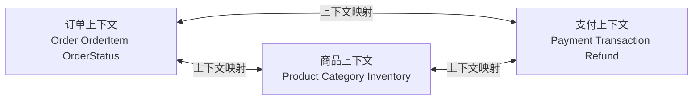
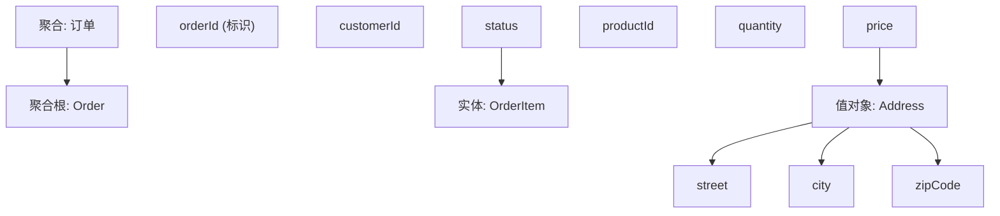
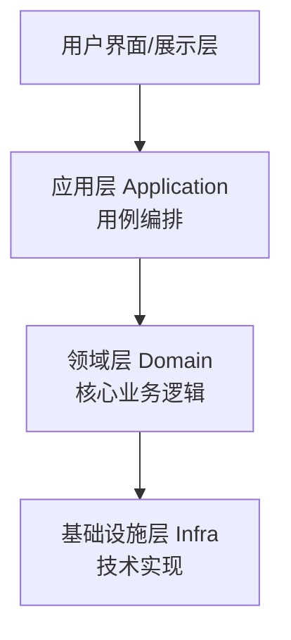

## 1. 从"语言不通"说起：DDD 要解决什么问题

### 1.1 一个项目中的"语言混乱"

想象一个电商项目组，业务方和开发方开会：

**产品经理说**："用户下单后，如果**子单**里有一件商品**售罄**，需要**拆分**订单，把可发货的部分先发出去。"

**开发听到的**：`Order` 实体、`OrderItem` 列表、`status` 字段、`split()` 方法……

**开发问**："你说的'子单'在代码里是什么？我们只有 OrderItem。"

**产品经理**："子单就是……嗯，一个订单里同一商家的商品合在一起那一组。"

**开发**："那和 OrderItem 有什么区别？"

……一个小时后，双方终于明白：产品经理说的"子单"是"按商家分组的订单明细"，代码里根本没有这个概念，而是被硬塞进了 OrderItem 的备注字段里。

**这就是 DDD 要解决的第一个问题：业务语言和技术语言不一致。** 业务方说"售罄""拆单""子单"，开发方说"status""list""split"——双方用不同的词汇描述同一件事，导致需求理解偏差、代码命名混乱、沟通成本极高。

### 1.2 什么是 DDD

**领域驱动设计（Domain-Driven Design，DDD）** 由 Eric Evans 在 2003 年提出，核心思想：

> **软件的核心是业务领域（Domain），而不是技术。设计应该以业务模型为中心，让代码成为业务模型的准确映射。**

DDD 不是一种技术框架，而是一套**建模方法论**——它教你怎么把"复杂的业务"变成"清晰的代码结构"。

### 1.3 DDD 的两个层面

DDD 分为两个层面，分别解决"怎么拆系统"和"怎么设计代码"：

| 层面 | 回答的问题 | 主要内容 |
| :--- | :--- | :--- |
| 战略设计 | 系统边界怎么划？ | 限界上下文、上下文映射、子域 |
| 战术设计 | 一个上下文内部怎么写？ | 实体、值对象、聚合、领域服务、仓储 |

**战略设计**关心"几个系统/服务之间的边界"（大方向），**战术设计**关心"一个系统内部怎么建模"（细节落地）。两者缺一不可。

## 2. 核心概念：统一语言（Ubiquitous Language）

### 2.1 什么是统一语言

**统一语言**是 DDD 最基础也最重要的概念：**业务人员和开发人员使用同一套词汇描述业务，并且这套词汇同时出现在讨论、文档、代码中。**

回到开头的例子：

- 业务方说"子单"
- 开发方在代码里建一个 `SubOrder` 类
- 讨论、文档、代码都叫"子单/SubOrder"

**统一语言的三个要点**：

1. **业务词汇就是代码词汇**：`Order`、`SubOrder`、`SoldOut` 直接进代码，而不是翻译成 `OrderStatus=3` 这种无意义编码
2. **词汇有唯一含义**：一个词在整个上下文里只有一个意思（避免"状态"既是订单状态又是物流状态）
3. **语言持续演进**：业务理解加深时，词汇和代码一起调整

**为什么重要**：语言不一致是软件项目最大的隐性成本——需求误解、返工、沟通低效，根源往往是"双方说的不是一回事"。

## 3. 战略设计：划定系统边界

战略设计回答"业务太大，怎么切分"的问题。三个核心工具：**限界上下文、上下文映射、子域**。

### 3.1 限界上下文（Bounded Context）

**限界上下文是一个明确的语义边界**：在这个边界内，领域模型的每个词汇有唯一、明确的含义。



**关键点**：同一个词在不同上下文里含义可以不同！

- 在**订单上下文**里，"Order"指的是"用户的一次购买行为"
- 在**仓储上下文**里，"Order"可能指"一批要拣货的货单"
- 它们**不需要**在代码里是同一个类——各上下文有自己的模型

**这就是"上下文"二字的含义**：词汇的含义依赖上下文。就像"bank"在"河岸"和"银行"两个语境下含义不同，软件里的同一个词在不同业务边界内也可以不同。

### 3.2 上下文映射（Context Mapping）

多个限界上下文之间存在交互，DDD 定义了这些关系的模式：

| 关系模式 | 说明 | 场景 |
| :--- | :--- | :--- |
| 合作关系（Partnership） | 两个团队协调开发 | 两个强耦合上下文 |
| 客户-供应商（Customer-Supplier） | 下游需求驱动上游 | API 提供方与消费方 |
| 遵奉者（Conformist） | 下游无条件接受上游模型 | 使用成熟第三方系统 |
| 防腐层（ACL） | 下游翻译上游模型，隔离影响 | 对接外部系统（见《分层架构》防腐层） |
| 开放主机服务（OHS） | 上游提供标准协议供下游使用 | 对外开放 API |
| 发布语言（PL） | 共享的事件/DTO 格式 | 事件驱动架构中的事件定义 |

**最重要的模式是防腐层（ACL）**：当对接一个"你无法控制"的外部系统时，在自己的边界内加一层翻译，让外部模型污染不了内部模型。

### 3.3 子域（Subdomain）：按业务价值切分

一个业务领域可以按"商业价值"划分为三种子域，决定投入策略：

| 子域 | 说明 | 投入策略 |
| :--- | :--- | :--- |
| 核心域（Core Domain） | 业务的核心竞争力 | **自研、投入最优资源** |
| 支撑域（Supporting） | 辅助核心业务的定制功能 | 自研或外包，适度投入 |
| 通用域（Generic） | 通用功能，无行业特殊性 | **采购现成方案或开源** |

**例**：一家电商公司：

- 核心域：商品推荐引擎（决定公司竞争力）→ 重兵投入自研
- 支撑域：订单管理（必要但无差异化）→ 自研，正常投入
- 通用域：邮件发送、权限管理（谁家都一样）→ 用现成服务

**关键认知**：**不要把资源平均分配**。核心域值得最好的团队和技术，通用域买现成的——把有限的资源聚焦在能产生差异化的地方。

## 4. 战术设计：在一个上下文内建模

战术设计是一套"代码级建模工具"，回答"一个上下文里，业务对象怎么组织"。

### 4.1 实体（Entity）与值对象（Value Object）

**实体（Entity）**：有唯一标识、状态会变化的对象。

- 用户（有 userId）、订单（有 orderId）、账户（有 accountId）
- 两个"相同属性的用户"是不同的人——靠 ID 区分

**值对象（Value Object）**：无标识、不可变、靠属性值区分的对象。

- 地址（{city: "北京", street: "中关村"}）、金额（{amount: 99.9, currency: "CNY"}）
- 两个"相同内容的地址"是同一个地址——靠值判断相等

**判断技巧**：问"两个对象属性相同，它们相等吗？"

- 两个 userId 相同但名字不同的用户 → 还是同一个人 → **实体**
- 两个内容相同的地址 → 就是同一个地址 → **值对象**

**为什么区分**：值对象天然不可变、可安全共享、可比较，设计时用值对象（而不是实体）能减少很多 bug。

### 4.2 聚合（Aggregate）与聚合根（Aggregate Root）

**聚合是一组对象的组合，对外表现为一个整体，内部保证数据一致性（事务边界）。聚合根是聚合的入口。**



**聚合设计四原则**（DDD 权威建议）：

1. **聚合尽量小**：一个聚合包含尽量少的对象（理想是一到几个）
2. **通过 ID 引用其他聚合**：聚合之间不持有对象引用，只存 ID（订单聚合持有 customerId，而不是 Customer 对象）
3. **一个事务只修改一个聚合**：跨聚合的修改要拆成多个操作/事件
4. **跨聚合用领域事件通信**：聚合 A 变了，通过事件通知聚合 B

**为什么**：聚合定义了"一致性边界"——边界内事务保护，边界外最终一致。聚合设计的好坏直接影响系统的并发能力和一致性。

### 4.3 领域服务（Domain Service）

有些业务逻辑不属于任何实体或值对象（比如"转账"涉及两个账户）。此时用**领域服务**：

```java
public class TransferService {
    public void transfer(Account from, Account to, Money amount) {
        from.debit(amount);   // 扣款（from 实体自己的逻辑）
        to.credit(amount);    // 入账（to 实体自己的逻辑）
    }
}
```

**要点**：领域服务中的逻辑应该是"业务规则"，而不是"技术操作"（不是拼 SQL、不是调接口）。

### 4.4 领域事件（Domain Event）

**领域事件是领域中"已经发生的有意义的事情"**（详见《事件驱动架构》）。

```java
public class OrderCreatedEvent {
    private final String orderId;
    private final String customerId;
    private final Money totalAmount;
    private final Instant occurredOn;
}
```

**作用**：

- 跨聚合通信（订单创建后，通知库存、通知邮件）
- 审计追踪（所有业务操作留痕）
- 解耦（发布者不关心谁响应）

### 4.5 仓储（Repository）

**仓储为聚合提供持久化接口**，隔离领域模型与数据库：

```java
public interface OrderRepository {
    Order findById(OrderId id);
    void save(Order order);
    void delete(Order order);
}
```

**关键点**：仓储接口由领域层定义（依赖倒置），数据库实现放在基础设施层。领域层**不知道**数据存在 MySQL 还是 Redis。

## 5. DDD 的分层架构

DDD 有自己推荐的层级划分（四层架构），比经典三层更强调"领域层为核心"：



| 层 | 职责 | 依赖方向 |
| :--- | :--- | :--- |
| 用户界面层 | 展示与交互 | → 应用层 |
| 应用层 | 用例编排、事务协调（薄层） | → 领域层 |
| 领域层 | **业务规则、领域模型（核心）** | 无外部依赖 |
| 基础设施层 | 持久化、消息、外部服务 | → 领域层（实现接口） |

**关键区别**（对比经典三层）：

- 经典三层：业务逻辑散在 Service 里（贫血模型）
- DDD 四层：**业务逻辑放在领域层的模型里**（充血模型），应用层只是"协调者"

## 6. DDD 落地：实践要点

### 6.1 事件风暴（Event Storming）

事件风暴是 DDD 团队常用的**工作坊式建模方法**：业务方和开发方围在一起，用便签纸把业务事件贴出来：

```
[用户提交订单] → [订单已创建] → [支付成功] → [库存已扣减] → [订单已发货]
```

通过梳理事件流，团队能：

- 快速理解整个业务流程
- 发现业务边界（哪些事件属于哪个上下文）
- 建立统一语言（事件名称就是词汇）

### 6.2 渐进式建模

DDD 建模不是一次完成的。**领域理解是逐步加深的，模型要随理解演进**：先建立初步模型 → 开发中发现新理解 → 重构模型 → 循环。

### 6.3 防腐层保护核心

对接外部系统（第三方支付、旧系统）时，一律通过防腐层翻译，**保护核心领域模型不被外部概念污染**。

### 6.4 与微服务的关系

DDD 是微服务拆分的最佳工具之一：**限界上下文 → 微服务边界**（一个上下文一个服务），这是业界公认的微服务拆分方法论（详见《微服务架构》拆分策略）。

## 7. DDD 的适用场景

### 7.1 适合 DDD

- **业务复杂**：规则多、状态多、概念多（金融、电商、医疗、物流）
- **业务是核心竞争力**：系统差异化来自业务模型（而非技术）
- **团队愿意投入建模**：需要业务方深度参与

### 7.2 不适合 DDD

- **业务简单**：纯 CRUD 系统，用 DDD 是过度设计
- **业务与代码无关**：计算器、工具类应用
- **团队无法深入业务**：外包项目、需求频繁短期变更

**关键认知**：DDD 是"重量级"方法论，它的价值随业务复杂度上升而上升。**业务简单时，经典三层 + 贫血模型完全够用**——不要为了"规范"而强行 DDD。

## 8. 常见误区

### 误区一：DDD = 一套代码模板

**真相**：DDD 是建模方法论，不是代码模板。照抄"Controller-Service-Repository"结构不等于用了 DDD——真正的 DDD 核心是"业务逻辑在领域层模型里"，而不是贫血的 Service 里。

### 误区二：一个系统一个"领域模型"

**真相**：一个系统通常有**多个限界上下文**，每个上下文有自己独立的模型。试图建立一个"大一统"的领域模型，恰恰是 DDD 要避免的。

### 误区三：聚合越大越好

**真相**：聚合越大，并发冲突越严重（所有操作都锁整个聚合）。**聚合应该尽量小**，宁可用领域事件做跨聚合协调。

### 误区四：DDD 能让需求理解自动变好

**真相**：DDD 只是提供了"统一语言 + 建模流程"的工具，**没有业务方的深度参与，DDD 也会沦为空壳**。建模过程本身需要业务和开发紧密协作。
