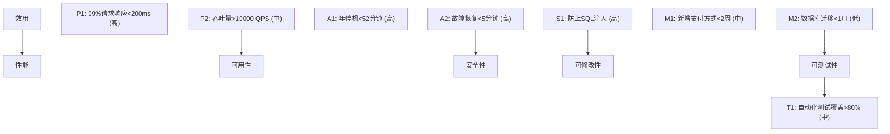

## 1. 从"买二手车"说起：为什么架构要评估

### 1.1 一个验车的故事

买车，尤其是二手车，正常人不会"看外观顺眼就付款"。你会：

- 看里程表、查保养记录（历史）
- 找第三方验车（发动机、底盘、事故痕迹）
- 试驾（实际体验）
- 评估维修成本和保值率（长期价值）

**为什么买车要这么谨慎？** 因为车是"大件"：买错了，几万到几十万打水漂，而且很难退货。

**软件架构也是"大件"**：架构选错了，重构成本极高（可能等于重写系统），而且很难"退货"。所以，在架构定型前（或重大变更前），必须系统性地评估它——这就是**架构评估（Architecture Evaluation）**。

### 1.2 架构评估的定义

> **架构评估是在架构定型（或重大变更）前，用系统化的方法检验"这个架构能否满足系统的质量需求（性能、可用性、安全……）"，并识别其中的风险。**

### 1.3 为什么需要评估

| 原因 | 说明 |
| :--- | :--- |
| 早期发现缺陷 | 架构缺陷的修复成本极高（越早发现越便宜） |
| 验证质量属性 | 确认架构确实能满足性能/可用性/安全目标 |
| 支持决策 | 在多个候选架构之间做选择时提供依据 |
| 识别风险 | 提前发现技术风险（而不是上线后爆雷） |
| 对齐相关方 | 让业务、开发、运维对架构达成一致认知 |

**核心逻辑**：架构是"影响深远、难以逆转"的决策（见《软件架构概述》），所以**投入一次系统评估，远比上线后重构便宜**。

## 2. 评估的时机

架构评估不是"某一次做完就完事"，而是在关键节点反复进行：

| 时机 | 目的 |
| :--- | :--- |
| 架构设计完成后 | 验证设计决策是否满足质量需求 |
| 重大变更前 | 评估变更对架构的影响（如引入微服务） |
| 迭代结束时 | 验证架构是否按预期演进 |
| 系统出现问题时 | 诊断根因（是不是架构缺陷导致） |

**实践建议**：把架构评估做成"里程碑活动"——每个重大阶段（需求确认、设计完成、上线前）都做一次轻量评估。

## 3. ATAM：最经典的架构评估方法

### 3.1 ATAM 是什么

ATAM（Architecture Tradeoff Analysis Method，架构权衡分析方法）由 SEI（卡内基梅隆软件工程研究所）开发，是业界最权威的架构评估方法。

**它的核心思想**：通过"质量属性场景"来检验架构——把质量需求（性能、可用性等）变成具体场景，然后逐个验证"架构是否支持这个场景"。

### 3.2 ATAM 的九步流程

```
第1步: 介绍 ATAM 方法（向参与者说明流程）
第2步: 介绍业务驱动（了解业务目标和约束）
第3步: 介绍架构（架构师讲解当前架构）
第4步: 识别架构方法（架构用了哪些模式/策略）
第5步: 生成质量属性效用树（梳理质量目标优先级）
第6步: 分析架构方法（架构如何满足效用树中的目标）
第7步: 头脑风暴场景（让各方提出关心的场景）
第8步: 分析架构方法（验证架构对场景的支撑）
第9步: 报告结果（敏感点、权衡点、风险、非风险）
```

### 3.3 效用树（Utility Tree）：质量目标的优先级排序

效用树是 ATAM 的核心工具：把"系统的质量目标"整理成一棵树，并为每个叶子节点标注优先级和风险等级：



**效用树的价值**：

1. 逼团队明确"哪些质量属性最重要"（高/中/低优先级）
2. 把抽象的质量目标变成可评估的叶子节点
3. 评估时对照叶子节点逐个验证，不漏项

### 3.4 ATAM 的输出：四类发现

ATAM 的评估结果归纳为四类：

| 类型 | 定义 | 示例 |
| :--- | :--- | :--- |
| 敏感点（Sensitivity Point） | 影响某个质量属性的架构决策 | 缓存策略对响应时间的影响 |
| 权衡点（Tradeoff Point） | 影响**多个**质量属性的决策 | 数据冗余提高可用性但降低一致性 |
| 风险（Risk） | 可能导致不良结果的决策 | 单点数据库可能成为瓶颈 |
| 非风险（Non-Risk） | 已验证安全的架构决策 | 已验证的负载均衡策略 |

**ATAM 的核心价值就在"权衡点"**：识别出那些"同时影响多个质量属性、需要谨慎决策"的地方——这是架构评估真正有价值的产出。

## 4. CBAM：把"钱"加进评估

### 4.1 为什么需要 CBAM

ATAM 回答"架构有哪些风险和权衡"，但它不回答"**值不值得投入**"。假设评估发现"数据库需要做主从复制"——做还是不做？

- 做了：可用性更高，但要花钱、花时间
- 不做：省成本，但可用性低

**CBAM（Cost Benefit Analysis Method，成本效益分析方法）** 在 ATAM 基础上加入经济分析：**量化每个架构策略的收益和成本，选择"性价比最高"的方案。**

### 4.2 CBAM 的流程

```
1. 从 ATAM 效用树中选择关键场景
2. 为每个场景确定候选架构策略
3. 评估每个策略的收益（对质量属性的改善程度）
4. 评估每个策略的成本（人力、资源、时间）
5. 计算 ROI（投入产出比）
6. 选择最优策略组合
```

### 4.3 ROI 计算

$$\text{ROI} = \frac{\text{收益} - \text{成本}}{\text{成本}}$$

| 策略 | 收益 | 成本 | ROI |
| :--- | :--- | :--- | :--- |
| 读写分离 | 8 | 3 | 167% |
| 缓存层 | 7 | 2 | 250% |
| 微服务化 | 9 | 8 | 12.5% |
| CDN 加速 | 6 | 1 | 500% |

**分析**：上表是典型的"性价比排序"——CDN 和缓存层性价比最高，微服务化性价比最低（成本极高、收益未必立刻兑现）。

**CBAM 的价值**：它把"架构决策"从"我觉得应该做"变成"数据表明这个策略 ROI 最高"。**预算有限时，先做性价比高的；微服务化这种高成本策略，要等真正需要时再做。**

## 5. 架构评审实践（轻量级评估）

ATAM/CBAM 是"重量级"评估，适合大型系统。日常工作中，更多用的是**架构评审（Architecture Review）**——一种轻量、快速、可频繁进行的评估形式。

### 5.1 评审清单

架构评审对照一份清单逐项检查：

| 维度 | 检查项 |
| :--- | :--- |
| 功能性 | 架构是否覆盖所有核心功能需求 |
| 性能 | 是否满足响应时间和吞吐量要求（对照质量属性场景） |
| 可用性 | 是否满足可用性 SLA（单点是否消灭） |
| 安全性 | 是否满足安全合规要求 |
| 可扩展性 | 是否支持未来业务增长（水平扩展能力） |
| 可维护性 | 是否易于理解和修改 |
| 可测试性 | 是否便于测试（解耦、依赖注入） |
| 可部署性 | 是否支持持续交付（CI/CD、灰度） |

### 5.2 评审流程

```
1. 准备: 收集架构文档和评审材料（架构图、ADR、质量属性场景）
2. 预审: 评审者独立阅读材料（提前1-2天）
3. 评审会议: 集体讨论，对照清单逐项评估
4. 输出: 评审报告（问题 + 建议 + 风险清单）
5. 跟踪: 确保改进措施落实（闭环）
```

### 5.3 评审 vs ATAM 的选择

| 维度 | 架构评审（轻量） | ATAM（重量） |
| :--- | :--- | :--- |
| 成本 | 低（半天） | 高（数天） |
| 适用 | 常规迭代、中小系统 | 大型系统、重大架构决策 |
| 产出 | 问题清单 | 敏感点/权衡点/风险/非风险 |
| 频率 | 可频繁进行 | 关键时刻一次 |

**实践建议**：常规用轻量评审；遇到"架构级重大决策"（微服务化、换数据库、重构核心模块）时，值得上完整 ATAM。

## 6. 架构评估的最佳实践

### 6.1 评估要基于"场景"，不是"感觉"

评估的每个质量目标，都要有**可测量的质量属性场景**（见《质量属性》）："99% 请求 < 200ms"而不是"性能不错"。没有场景，评估就沦为"各说各话"。

### 6.2 评估要邀请"局外人"

自己评估自己的架构，容易"当局者迷"。评估应该包括：

- **外部评审者**（其他团队的架构师）：没有"自己人"的思维惯性
- **运维/安全代表**：从"上线后"视角挑刺
- **业务代表**：确认质量目标与业务诉求一致

### 6.3 评估产出必须"可行动"

评估报告不能只是"列了一堆问题"就完事。每个发现都要有：

- **严重程度**（阻塞/重要/建议）
- **建议方案**（具体怎么做）
- **负责人与期限**（谁改、何时改）

**没有行动项的评估 = 白评估**（和事故复盘的原则一致）。

### 6.4 评估不是"一次性的"

架构在演进（见《软件架构概述》第 7 节），评估也要持续：**每次重大架构变更后，重新评估；每次评估的发现，纳入后续决策。**

## 7. 常见误区

### 误区一：架构评估 = 画架构图

**真相**：画图只是准备工作。**评估的核心是"用场景检验架构是否满足质量目标"**——图本身说明不了架构好不好。

### 误区二：只有大公司才需要架构评估

**真相**：架构评估的"重量"可以调整。小系统用"半天轻量评审"也行——关键是"在架构定型前认真检验一遍"这个**习惯**，而不是评估的规格。

### 误区三：评估报告写完就完事

**真相**：评估的价值在于**发现问题并修复**。报告归档不管，等于白做（和复盘报告一个道理）。

### 误区四：ATAM 输出的是"评分"

**真相**：ATAM 不给架构"打分"，它输出的是**敏感点、权衡点、风险、非风险**——目的是帮助决策，而不是评价好坏。
