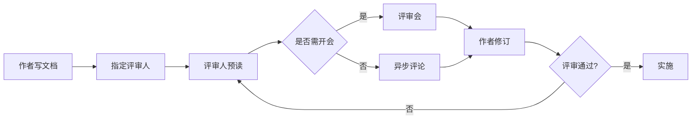

## 1. 为什么需要设计文档

### 1.1 一个真实的场景

小周负责一个订单系统。某天产品经理提出需求："用户下单后 15 分钟内可以取消订单。"

小周觉得很简单，直接动手写代码：在下单接口后面加了个取消逻辑，测试通过，上线。结果一周后：

- 用户在下单 16 分钟后点了"取消"，系统弹了个"操作失败"，产品经理来问怎么回事；
- 运营发现，取消的订单没有把"库存"加回去，导致商品超卖；
- 三个月后，小周自己都忘了当时为什么要把取消时间限制在 15 分钟，只知道"不能改，改了会出问题"。

**问题出在哪？** 不是代码写错了，而是**需求被直接翻译成了代码，中间缺了"设计"这一层**。没有人认真想过：为什么是 15 分钟？取消订单对库存、对支付、对优惠券分别有什么影响？这 15 分钟是写死的还是可配置的？取消后数据如何归档？

设计文档，就是强制你**在写代码之前，先把这些问题想清楚、写下来、并让大家讨论**的工具。

### 1.2 设计文档的三个价值

**价值一：逼你想清楚。** 写作的过程就是思考的过程。很多"写代码时才发现的问题"，其实在写设计文档时就应该被发现——因为文档要求你把边界条件、异常路径、数据流都写出来。

**价值二：让团队对齐。** 你的方案可能会影响别的模块（数据库、前端、运维）。提前让大家看文档，可以在实施前发现"这个 API 字段前端不好用""这个表结构扩展性差"等问题，而不是等代码写完了再返工。

**价值三：留下决策记录。** 半年后有人问"为什么这里要加 15 分钟限制"，答案在文档里，而不是在某个离职同事的脑子里。

## 2. 三种设计文书：RFC、ADR、技术方案

很多初学者把设计文档混为一谈，其实工程实践中有三种用途不同的文书。搞清楚它们的区别，是本章的核心。

| 文书 | 用途 | 什么时候写 | 性质 |
| :--- | :--- | :--- | :--- |
| RFC | 提出并讨论一个方案 | 方案**定稿前**，需要团队讨论 | 提案，可修改 |
| ADR | 记录一个重要决策 | 决策**做出后** | 记录，不可修改 |
| 技术方案 | 描述"怎么做"的完整设计 | 项目/功能开发前 | 指南，按需更新 |

用一个"盖房子"的类比来理解：

- **RFC** 是"我打算这样盖这栋房子，大家看看有没有更好的主意"——是讨论稿，改来改去很正常；
- **ADR** 是"我们决定用砖混结构而不是框架结构，因为……"——是决定记录，一旦定下就不再改（要改就重新记录一个新决定）；
- **技术方案** 是"这栋房子的完整施工图纸"——描述怎么从地基到封顶。

三者是**递进关系**：先有 RFC 讨论 → 讨论达成一致后形成 ADR 记录 → 然后写详细的技术方案指导实施。

```
需求 → RFC（讨论方案）→ 决策 → ADR（记录决策）→ 技术方案（指导实施）→ 代码
```

## 3. RFC：方案提案

### 3.1 什么是 RFC

RFC（Request for Comments，请求意见稿）用于**在实施前提出一个技术方案，并邀请团队讨论**。它的灵魂是"征求意见"：RFC 不是最终的结论，而是讨论的起点。

业界最著名的 RFC 流程是 Rust 语言社区：每个重大语言特性都要先提交 RFC，社区讨论、修订、最终由核心团队决定采纳或拒绝。React 的很多重要设计也走类似的公开流程。

### 3.2 RFC 的完整模板

```markdown
# RFC-003: 订单取消功能设计

| 元数据 | 值 |
| :--- | :--- |
| 作者 | 小周 |
| 状态 | 草案 / 评审中 / 已批准 / 已拒绝 |
| 创建日期 | 2026-08-02 |
| 目标决策日期 | 2026-08-09 |
| 相关方 | 订单组、支付组、前端组 |

## 摘要

用户下单后可在 15 分钟内取消订单，取消后库存回补、支付原路退回。

## 动机

### 问题陈述

用户误下单后无法取消，只能联系客服，客服工单量占比 12%。

### 目标

- 用户可在 15 分钟内自助取消
- 取消后库存准确回补，不允许超卖
- 支付金额原路退回

### 非目标（明确不做的）

- 不做"取消次数限制"
- 不做"部分取消"（一次只能取消整个订单）

## 详细设计

### 取消时间窗口

- 窗口长度可配置，默认 15 分钟，配置中心下发
- 窗口计算以"支付成功时间"为起点

### 状态机

下单 → 支付成功 → [15 分钟内] 取消申请 → 库存回补 → 退款 → 已取消

### API 设计

POST /orders/{id}/cancel
请求：{ "reason": "误下单" }
响应：200 + 新状态；409 表示已超过取消窗口

### 数据模型

orders 表新增字段：cancel_deadline_at、cancelled_at、cancel_reason

### 关键流程

1. 校验订单属于当前用户
2. 校验当前时间 < cancel_deadline_at
3. 开启事务：改订单状态 → 回补库存 → 记录取消日志
4. 提交事务后异步发起退款
5. 退款失败进入对账队列，人工介入

## 替代方案

### 方案 A：不限制时间，任何时候可取消

- 优点：用户体验最好
- 缺点：高峰期取消会造成库存剧烈波动，且超过发货时间后取消代价高
- 未采纳原因：业务上不可接受

### 方案 B：仅限"未支付"订单可取消

- 优点：实现最简单
- 缺点：未解决"误下单已支付"的核心痛点
- 未采纳原因：不解决问题

## 权衡取舍

| 取舍 | 选择 | 放弃 |
| :--- | :--- | :--- |
| 窗口时长 | 15 分钟可配置 | 更严格的规则 |
| 取消方式 | 仅整单取消 | 部分取消 |

## 风险与缓解

| 风险 | 影响 | 缓解 |
| :--- | :--- | :--- |
| 退款失败 | 资金风险 | 对账队列+告警 |
| 库存回补失败 | 超卖 | 事务+补偿脚本 |

## 迁移与兼容

- 存量订单不开放取消（新增 cancel_deadline_at 为空即不可取消）
- 前端在 15 分钟后隐藏取消按钮并提示

## 开放问题

- 取消是否占用用户每月取消额度？（待产品确认）
```

### 3.3 写 RFC 的三个关键

1. **"非目标"比"目标"更重要。** 明确写出"我们这次不做 X"，可以防止讨论跑偏。很多项目失败不是因为没做什么，而是因为什么都想做、结果什么都没做透。

2. **替代方案必须认真写。** "我们考虑了 A、B，因为 XX 原因选了 C"——这句话能向评审者证明你做过功课，也常常在写作过程中帮你发现自己方案的缺陷。

3. **目标决策日期要明确。** RFC 最怕"讨论了三个月没结论"。给每个 RFC 设定一个决策截止日，到时间必须有结论（采纳/拒绝/要求修改），否则 RFC 就失去意义。

## 4. ADR：架构决策记录

### 4.1 什么是 ADR

ADR（Architecture Decision Record，架构决策记录）由 Michael Nygard 在 2011 年提出，用于**记录一个已做出的重要决策及其理由**。

和 RFC 最大的区别：**RFC 在决策前写（可修改），ADR 在决策后写（一旦接受就不可修改）。** 如果后来决策被推翻了，不是去改旧 ADR，而是写一个新的 ADR 声明"取代了 ADR-003"。

### 4.2 ADR 模板（MADR 风格）

业界最流行的轻量模板是 MADR（Markdown Architectural Decision Records）：

```markdown
# ADR-012：订单系统使用 PostgreSQL 作为主数据库

## 状态

已接受

## 背景与上下文

订单系统需要支撑：
- 事务性写入（订单+库存+流水强一致）
- JSON 灵活字段（订单扩展属性）
- 全文检索（客服按商品名/单号搜索订单）
当前 MySQL 5.7 版本已到生命周期末期，且 JSON 能力弱。

## 决策

采用 PostgreSQL 16 作为订单系统主数据库。

## 理由（为什么）

1. 原生 JSONB 类型：性能与功能均优于 MySQL 的 JSON
2. 更成熟的 MVCC 与高级索引（部分索引、表达式索引）
3. 全文检索能力内置，减少引入 ES 的必要性
4. 团队已完成 PoC 验证：读写性能满足目标，数据迁移耗时 3 小时

## 后果

### 正面
- 满足全部功能需求，无需额外中间件
- 版本更新、社区活跃

### 负面
- 运维团队需要补充 PostgreSQL 经验（计划一次培训）
- 部分云厂商的托管服务价格略高于 MySQL

### 风险
- 迁移过程中数据一致性：通过双写+校验脚本缓解
- 团队习惯迁移成本：前 1 个月配置"PG 值班答疑人"

## 替代方案

- 继续使用 MySQL 8.0：JSON 能力不足，需额外引入 ES，复杂度更高
- TiDB：分布式能力超出当前需求，运维成本高

## 相关决策

- 取代 ADR-002（最初选择 MySQL）
- 关联 ADR-015（缓存采用 Redis）
```

### 4.3 ADR 的四个编写要点

**要点一：一个 ADR 只记录一个决策。** 不要在一篇 ADR 里同时写"数据库选型"和"缓存选型"——这是两个独立决策，应该分开记录。

**要点二：背景要写"当时的约束"，而不是"现在的结果"。** 目的是让未来的读者理解"当时为什么做这个决定"。如果只说结论不说上下文，ADR 就失去了意义。

**要点三：后果要同时写正面和负面。** 只写正面后果的 ADR 是宣传稿。诚实地记录负面后果，才能让未来的团队知道"这个决策的代价是什么"。

**要点四：写得要快。** 一篇 ADR 应该 10-20 分钟写完。如果写得太久，说明决策范围太大，应该拆分成多个决策。

### 4.4 ADR 的目录组织

ADR 通常放在仓库的 `docs/adr/` 目录，按编号排序：

```
docs/adr/
  0001-use-postgresql.md
  0002-adopt-grpc.md
  0003-react-for-frontend.md
  README.md   # ADR 索引表
```

README 里维护一张索引表，方便快速查找：

| 编号 | 决策 | 状态 | 日期 |
| :--- | :--- | :--- | :--- |
| 0001 | 使用 PostgreSQL | 已接受 | 2026-05-01 |
| 0002 | 内部通信用 gRPC | 已接受 | 2026-05-15 |
| 0003 | 前端用 React | 已废弃（被 0007 取代） | 2026-06-01 |
| 0007 | 前端用 Vue 3 | 已接受 | 2026-08-02 |

## 5. 技术方案文档

### 5.1 与 RFC/ADR 的区别

技术方案（Design Doc / Technical Design）描述的是"一个功能/项目怎么做"的完整设计，比 RFC 更详细、比 ADR 更全面。它指导整个实施过程。

可以这样理解：

- RFC 回答："我们该不该做、大概怎么做？"（短、粗、讨论用）
- ADR 回答："这个技术选型定了，是 XXX，因为 YYY。"（短、准、记录用）
- 技术方案回答："这个功能完整的设计是什么样？"（长、细、实施用）

### 5.2 技术方案模板

```markdown
# 「订单取消」技术方案

## 1. 背景与目标

### 1.1 业务背景
用户误下单后无法取消，客服工单占比 12%，需要自助取消能力。

### 1.2 技术目标
- 支持 15 分钟可配置取消窗口
- 库存回补准确率 100%（不允许超卖）
- 退款链路自动对账

### 1.3 非目标
- 不支持部分取消
- 不支持取消次数限制
- 不涉及用户评价体系

## 2. 现状分析

### 2.1 当前架构
[订单服务] → [订单库(MySQL)]、[库存服务] → [库存库]、
[支付网关] → [支付回调]

### 2.2 存在的问题
- 订单状态只有"已创建/已支付/已完成"，无"已取消"
- 库存扣减在支付回调后执行，取消需要逆操作

## 3. 方案设计

### 3.1 总体架构
新增取消状态与取消流程，复用现有事务框架

### 3.2 核心流程（时序）
用户点击取消 → 订单服务校验窗口 → 开启事务(状态+库存+流水)
→ 提交 → 异步退款 → 退款回调更新退款状态

### 3.3 数据模型
orders: +cancel_deadline_at DATETIME, +cancelled_at DATETIME,
        +cancel_reason VARCHAR(200)

### 3.4 API 设计
POST /orders/{id}/cancel   （见 RFC-003 中的 API 定义）

### 3.5 安全设计
- 仅订单所属用户可取消（鉴权）
- 取消接口幂等（重复调用只成功一次）

## 4. 方案对比

| 维度 | 方案A：仅整单取消 | 方案B：支持部分取消 |
| :--- | :--- | :--- |
| 实现复杂度 | 低 | 高（需拆单+多行库存） |
| 用户体验 | 满足 95% 场景 | 更完整 |
| 风险 | 低 | 中（部分取消退款规则复杂） |

结论：首期采用方案 A，部分取消作为二期规划。

## 5. 容量与性能

### 5.1 容量估算
取消峰值 QPS 约 50，库存回补事务 < 100ms，现有资源充足。

### 5.2 性能目标
取消接口 P99 < 300ms

### 5.3 压测方案
jmeter 模拟 100 并发取消，观察事务时长与数据库锁等待。

## 6. 风险与应对

| 风险 | 等级 | 应对 |
| :--- | :--- | :--- |
| 退款失败 | P0 | 对账任务+告警+人工介入手册 |
| 并发取消与支付冲突 | P1 | 状态机校验+唯一约束 |
| 库存回补重复 | P1 | 幂等键+事务 |

## 7. 实施计划

- 第一周：数据库变更+状态机改造
- 第二周：取消接口+库存回补
- 第三周：退款链路+对账
- 第四周：联调、压测、上线

## 8. 监控与告警

- 指标：取消成功率、取消延迟、退款失败数
- 告警：退款失败率 > 1% 触发 P1
```

### 5.3 技术方案的篇幅控制

技术方案不是越长越好。一个经验法则：

- 小型改动（改个字段、加个接口）：**不需要写技术方案**，直接 RFC 或代码审查解决
- 中型功能（一个新的业务模块）：1-3 页技术方案足够
- 大型系统（架构重构、平台建设）：需要完整方案，可能要 5-10 页甚至更多

**"写不写方案"的判断标准**：这个改动如果做错了，返工成本高不高？如果返工成本低（比如改个字段），就不需要方案；如果返工成本高（比如选错架构），就必须先设计。

## 6. 写作技巧：让文档真正被读

写了没人读的文档就是浪费。以下技巧能提高文档的"被读率"：

### 6.1 先结论后细节

用"金字塔原理"组织内容：**结论先行，再展开理由，最后给细节。** 读者扫描文档时，只看前几行就能理解你的核心主张，有兴趣再深入看。

反例：开头先写三页背景调研，最后一行才说"所以我们用 X"。
正例：开头第一段就说"本方案建议使用 X，因为 A、B、C 三个理由"，再展开。

### 6.2 为读者而写，不是为自己

问自己三个问题：

1. **谁在读？** 评审者（要判断方案是否可行）、实施者（要照着写代码）、新人（要理解为什么这么做）——读者不同，关注点不同
2. **他们要做什么？** 评审者要"提意见"，实施者要"照着做"
3. **他们缺少什么背景？** 补上必要的上下文，但不要科普常识

### 6.3 用数据说话

"性能可以满足要求"不如"压测显示 P99=150ms，目标 300ms"。**能用数字的地方不用形容词。** 数据不仅增加可信度，也方便评审者判断。

### 6.4 保持"够新"而非"完美"

设计文档是活文档：方案定稿后，实施中发现的新情况应当回写到文档里。但也不要为了追求"永远最新"而频繁改版——**文档的核心价值是"记录了当时的设计与理由"，而不是"永远和代码完全一致"。** 重大偏差（比如改了架构）才需要更新文档，小细节差异让代码注释去补充。

## 7. 文档评审流程

设计文档写完后，要走评审才能进入实施。完整流程：



**评审要点**：

1. **材料提前发**：至少提前 1-2 个工作日发文档，评审会不是现场读文档会
2. **评审人要对**：邀请真正相关的人——受影响的模块负责人、有经验的架构师、实施者本人
3. **结论要记录**：评审会要产出明确结论（通过/有条件通过/重审）和行动项
4. **拒绝"沉默即同意"**：评审人没回复 = 没评审，不能当作默认通过

## 8. 常见错误与反模式

### 反模式一：文档与代码脱节

文档写的是方案 A，代码实现的是方案 B，而且没人更新文档。后果：文档变成"历史遗留垃圾"，新人不信文档、自己翻代码。

**对策**：文档和代码同 PR 变更（文档即代码），代码审查时同时看文档是否同步。

### 反模式二：什么都写进文档

把"变量怎么命名"这种常识也写进设计文档，篇幅膨胀、重点淹没。

**对策**：设计文档只写"有决策含量的内容"——需要讨论的、有取舍的、影响他人的。纯常识留给代码规范和教科书。

### 反模式三：评审走过场

评审会开着，但没人真看文档，最后"全体通过"。等实施到一半发现方案有重大问题，返工。

**对策**：评审人必须真读真评。可以在评审会前要求每人提至少一个具体问题，强制参与。

### 反模式四：ADR 写成了"事后诸葛亮"流水账

为了"看起来规范"给每个小改动都写 ADR，而且内容空泛（"我们决定用 X"没有任何理由）。ADR 泛滥后，没人再读 ADR。

**对策**：只对"架构级、影响深远、难以逆转"的决策写 ADR。能轻易改回来的决策（比如"这个页面用蓝色"）不需要 ADR。
