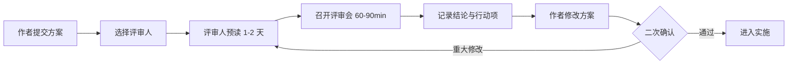

## 1. 从"体检"说起：为什么方案要评审

### 1.1 一个比喻

你带一位家人去体检。体检的意义在于：**在疾病还没造成严重后果时，就发现潜在问题。** 体检做的检查越早、越全面，越能避免大病。相反，如果等到"身体已经很难受了"才去医院，往往已经错过了最佳干预时机。

**技术方案评审（Design Review）就是软件项目的"体检"。** 在方案还没变成代码、还没上线之前，让一群有经验的人提前"把脉"：这个方案可行吗？有漏洞吗？风险在哪里？——趁发现问题还便宜的时候发现它。

### 1.2 为什么"早发现"如此重要

软件工程有个著名的经验规律：**缺陷发现得越晚，修复成本越高。**

- 方案阶段发现的问题：改几个字，成本几乎为零
- 编码阶段发现的问题：改代码，成本 1 倍
- 测试阶段发现的问题：改代码 + 重新测试，成本 5-10 倍
- 上线后发现的问题：改代码 + 走发布流程 + 通知用户 + 修复数据 + 处理客诉，成本 50-100 倍

**方案评审的价值**，就是让问题在"成本几乎为零"的阶段被发现，而不是在"成本高到无法承受"的阶段才暴露。

### 1.3 方案评审与代码评审的区别

| 维度 | 方案评审 | 代码评审 |
| :--- | :--- | :--- |
| 评审对象 | 设计文档（RFC/技术方案） | 代码（PR） |
| 评审时机 | 编码**之前** | 编码**之后**、合并前 |
| 关注重点 | "该不该做、怎么做" | "做出来的对不对" |
| 发现问题成本 | 极低（改文档） | 中等（改代码） |

两者是**接力关系**：方案评审先把"方向"定对，代码评审再把"实现"做对。方案评审做得好的团队，代码评审的压力会小很多——因为大问题在方案阶段就解决了。

## 2. 评审时机：什么时候必须评审

不是所有改动都需要方案评审。评审是有成本的（要花别人的时间），所以要用在"值得评审"的地方。

### 2.1 必须评审的场景

1. **新增系统/大型模块**：搭一个全新的服务、一个新的核心模块
2. **架构级变更**：改变系统结构（引入微服务、换数据库、改消息模型）
3. **新技术选型**：引入一个团队没人用过的新框架、新数据库、新中间件
4. **跨团队影响**：改动会波及多个团队（改了别人在用的 API、数据结构）
5. **高成本改动**：改动大、耗时长、返工代价高

### 2.2 不需要评审的场景

- 小功能：加个字段、调个样式
- 纯增量：加一个不影响现有逻辑的新接口
- 可逆改动：做错了能轻易回退

**判断核心**：这个决定如果做错了，返工成本高不高？高 → 评审；低 → 直接做。

### 2.3 评审的黄金时间

方案评审最好在**方案初稿完成、但还没开始写代码时**进行。太早（只有想法没有方案）评审没有对象；太晚（代码写了一半）评审发现方向错了，返工成本已经很高。

## 3. 评审流程：从提交到结论

一个完整的评审流程：

### 3.1 流程要点

1. **材料先行**：评审材料提前 1-2 个工作日发出。评审会是"讨论方案"的，不是"现场读方案"的。没预读的评审者没有发言权（或者说，预读是评审者的责任）。

2. **选对评审人**：评审人的质量决定评审的质量。邀请四类人：
   - 方案作者（主讲人）
   - 受影响系统的负责人（他们最清楚影响）
   - 有经验的架构师/资深工程师（提供专业判断）
   - 必要的运维/安全/前端代表（评估跨领域影响）

3. **控制时长**：评审会控制在 60-90 分钟。超过时间还没结论的议题，单独拉会继续，不要让会议无限延长。

4. **结论要明确**：评审必须产出明确的结论（见第 5 节），并记录行动项。

5. **闭环**：结论是"有条件通过"的，要跟踪作者是否完成了指定修改。

### 3.2 评审角色分工

| 角色 | 职责 | 关键原则 |
| :--- | :--- | :--- |
| 作者 | 讲解方案、回答问题 | 诚实，不要"辩护模式" |
| 主持人 | 控场、确保覆盖所有维度 | 不偏袒，维护讨论秩序 |
| 架构师 | 评估架构合理性与可扩展性 | 关注长期影响 |
| 相关团队 | 评估影响和依赖 | 尽早提出跨团队问题 |
| 运维/安全 | 评估可运维性、安全性 | 从"上线后"视角挑刺 |

## 4. 评审维度：评审时看什么

评审需要一套系统的"检查清单"，确保不遗漏重要维度。以下三个维度是核心框架。

### 4.1 功能性：方案能解决问题吗

- **需求覆盖**：方案是否完整覆盖了所有需求？（有没有漏掉某个功能点？）
- **边界场景**：是否考虑了边界情况？（空数据、极端输入、并发、重试）
- **兼容性**：是否向后兼容？（老版本客户端、存量数据、已有接口）
- **降级方案**：故障时如何降级？（某个依赖挂了，系统怎么办）
- **可回滚性**：上线后发现问题，能回滚吗？回滚代价多大？

### 4.2 非功能性：方案"好用吗"

| 维度 | 要问的问题 |
| :--- | :--- |
| 性能 | 容量估算是否合理？性能目标是什么？如何验证？ |
| 可用性 | 有容错吗？降级路径清晰吗？恢复时间目标？ |
| 安全性 | 认证授权怎么做？敏感数据如何保护？有审计吗？ |
| 可扩展性 | 业务增长 10 倍，方案还成立吗？如何水平扩展？ |
| 可维护性 | 代码结构清晰吗？文档有吗？维护难度如何？ |
| 可观测性 | 有日志/指标/告警吗？出问题能快速定位吗？ |

**这六个维度中，可观测性是最容易被忽略的。** 很多方案上线后出问题定位不到原因，就是因为设计时没考虑"上线后怎么观测"。

### 4.3 工程性：方案"能落地吗"

| 维度 | 要问的问题 |
| :--- | :--- |
| 实施计划 | 里程碑合理吗？时间线现实吗？ |
| 测试方案 | 如何测试？覆盖哪些场景？如何验证正确性？ |
| 部署方案 | 怎么发布？灰度吗？有回滚预案吗？ |
| 监控方案 | 上线后监控什么？告警规则是什么？ |
| 文档计划 | 需要更新哪些文档？API 文档、运维手册？ |

### 4.4 评审提问的"三问"技巧

评审时最有效的提问方式，不是"我觉得不行"，而是三个问题：

1. **"如果 X 发生，会怎样？"**——把方案放在极端场景下考验（如果流量翻倍、如果这个依赖挂了、如果数据量涨 10 倍）
2. **"为什么选这个，而不是 A/B？"**——确认作者考虑过替代方案（如果没考虑过，说明设计不完整）
3. **"上线后怎么知道它出问题了？"**——检验可观测性设计

## 5. 评审结论：四种结果

评审必须有明确的结论，不能让作者"感觉大家都还 OK，但又没人明确说行"。

| 结论 | 含义 | 后续动作 |
| :--- | :--- | :--- |
| 通过 | 方案可执行 | 进入实施 |
| 有条件通过 | 修改指定项后可执行 | 作者修改，主持人确认 |
| 需要重审 | 重大修改后需再次评审 | 修改后重新走评审 |
| 不通过 | 方案不可行，需重新设计 | 重新设计方案 |

**关键**：有条件通过的"条件"必须**具体、可检查**。不能说"再优化一下"，要说"补充容量估算表并让运维确认"。模糊的条件等于没条件。

## 6. 评审实践：让评审真正高效

### 6.1 作者的准备

1. **写一份"摘要"放在最前面**：让评审者 3 分钟了解全貌
2. **明确列出"需要评审者重点看的"**：你是想让大家确认技术选型？还是帮你看边界处理？不同的诉求，评审的侧重点不同
3. **先自己审一遍**：提交前用第 4 节的清单自查，把明显的问题先改掉——不要浪费评审者的时间
4. **对评论保持开放**：评审会上是"讨论模式"，不是"辩护模式"。即使不同意也要听完，吸收合理部分

### 6.2 评审者的责任

1. **预读**：拿到材料先读，带着问题去开会
2. **关注决策而非细节**：评审讨论"这个架构行不行"，不讨论"这个变量叫什么"
3. **给建设性意见**：指出问题的同时，给出可操作的建议
4. **对事不对人**：评论方案，不评论作者
5. **按时完成**：评审拖沓会让方案悬置，团队空等

### 6.3 评审会议主持人

1. 会议开始先明确"评审目标"和"结论要求"（避免开成漫谈会）
2. 控制时间：每个议题限时
3. 记录所有结论和行动项（专人记录）
4. 结束时明确"结论是什么、作者下一步做什么"

### 6.4 评审会议的大忌

- **现场读方案**：评审者没预读，开会从第一页开始读 → 浪费时间
- **变成技术辩论**：作者和某个评审者就一个细节争论不休，其他人旁观 → 会后单独讨论
- **无结论散会**：开完会不知道"到底通过没有" → 必须有明确结论
- **评审者过少**：只有作者自己一个人"评审"自己 → 失去评审意义

## 7. 常见反模式

### 反模式一：橡皮图章评审

**症状**：评审材料没人细看，开会走过场，"好好好，通过"。**后果**：问题全留到编码阶段甚至上线后。**对策**：强制预读，每个评审者必须带至少一个具体问题参会。

### 反模式二：为评审而评审

**症状**：明明是小改动，非要走完整评审流程。**后果**：流程成本高于收益，团队对评审反感。**对策**：按第 2 节的时机标准决定要不要评审，小事直接做。

### 反模式三：评审变"批斗"

**症状**：评审者对作者严苛挑剔，把方案评审变成能力评估。**后果**：作者不敢提交方案，或提交"保守到没价值"的方案。**对策**：评审对事不对人，聚焦"方案是否可行"，不评价"作者水平"。

### 反模式四：结论模糊

**症状**：会议开完没有明确结论，作者不知道要不要改、改什么。**后果**：方案悬置或带着问题进入实施。**对策**：结束前 5 分钟明确"结论 + 条件 + 行动项"。

### 反模式五：只评审技术，不评审风险

**症状**：评审只讨论"怎么做"，不讨论"做不成怎么办"。**后果**：方案看起来很完美，但没有任何预案，一出问题就抓瞎。**对策**：强制包含"风险与应对"和"回滚方案"两个检查项。

## 8. 评审与其他实践的配合

方案评审不是孤立的，它和本模块其他实践协同工作：

| 实践 | 与评审的关系 |
| :--- | :--- |
| 设计文档规范 | 评审的对象就是设计文档；文档质量决定评审质量 |
| 代码审查 | 评审把方向定对，代码审查把实现做对 |
| 事故复盘 | 复盘发现的问题，会反哺到"方案评审清单"中 |
| 知识管理 | 评审结论和决策要沉淀到知识库 |

**一个实用的建议**：把历次事故复盘发现的问题，不断补充进"评审检查清单"。这样每一场评审，都带着过去所有事故的教训在运行——这是"让错误不再重演"最有效的机制。
