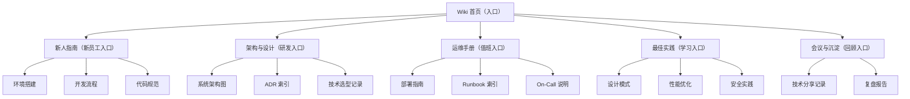
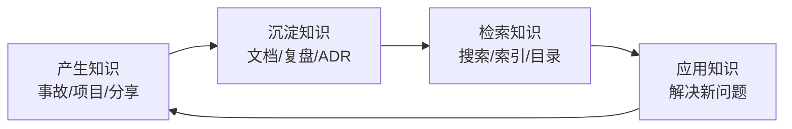

## 1. 从"图书馆"说起：团队的知识从哪里来

### 1.1 一个残酷的现实

小赵是团队里唯一懂"订单对账系统"的工程师。这套系统是他三年前搭的，很多"为什么这么设计"的逻辑只在他脑子里。某天小赵离职了。三个月后系统出了一个隐蔽的 bug，新接手的小钱花了整整两周才搞懂这套系统的来龙去脉——而这期间，他至少问了 6 个同事、翻了 40 个文件、对着代码猜了无数次"作者当时为什么要这么做"。

**这就是知识管理缺失的代价**：团队的知识如果只存在个别人的脑子里，那人一旦离开，知识就"蒸发"了。

### 1.2 知识管理的本质

知识管理（Knowledge Management）的目标可以概括为一句话：

> **把"存在人脑里的知识"转化为"存在团队里的知识"，让任何人在任何时候都能快速找到并复用。**

想象一个图书馆：书的分类有体系（书架编号）、检索有索引（卡片目录）、借阅有规则、新书有上架流程、旧书有淘汰机制。一个运转良好的图书馆，让"找一本书"变得非常快。

**团队的知识库就是一个图书馆**，只不过"书"是文档、代码注释、复盘报告、设计方案；"卡片目录"是搜索和索引；"上架流程"是文档的编写与维护规范。知识管理就是把"靠人传话"的信息流转方式，升级为"靠系统存取"的知识流转方式。

### 1.3 知识的两种类型

管理学把知识分为两种（Polanyi 的分类）：

| 类型 | 定义 | 例子 | 转化难度 |
| :--- | :--- | :--- | :--- |
| 显性知识 | 可以写下来的知识 | API 文档、架构图、规范 | 容易 |
| 隐性知识 | 只可意会、存在于经验中 | 排障直觉、设计品味、踩坑记忆 | 困难 |

**知识管理的核心挑战，是把"隐性知识"尽量转化为"显性知识"。** 比如老工程师的"排障直觉"，如果他能把排查步骤写成 Runbook，就变成了显性知识；如果只存在于他脑子里，一旦他离开就彻底丢失。

**关键认知**：隐性知识不可能 100% 转化（有些经验就是无法完全文字化），所以知识管理不是"消灭隐性知识"，而是"尽量转化 + 建立传承机制"（比如老带新、结对工作）。

## 2. 技术文档体系：团队的知识库骨架

### 2.1 文档的四类划分

团队文档按用途可以分为四类，各有各的读者和时效性要求：

| 类别 | 回答的问题 | 示例 | 读者 |
| :--- | :--- | :--- | :--- |
| 架构文档 | 系统为什么这么设计 | ADR、架构图、C4 模型 | 全员 |
| 开发文档 | 怎么在这个代码库上开发 | 编码规范、环境搭建、开发流程 | 开发者 |
| API 文档 | 接口怎么调用 | OpenAPI、gRPC proto、接口说明 | 调用方 |
| 运维文档 | 系统怎么部署和维护 | Runbook、部署手册、监控说明 | 运维/值班 |

**容易被忽视的一类**：新人指南（Onboarding Guide）——"从零开始在这个团队工作，需要知道什么"。这是性价比最高的文档之一：写一次，每个新人都受益，而且新人读完后提的问题会反过来暴露文档的不足。

### 2.2 文档即代码（Docs as Code）

现代工程团队普遍采用"文档即代码"的模式：**文档和代码一样，放在 Git 仓库里管理，走一样的版本控制、代码审查和发布流程。**

为什么比"把文档放在公司 Wiki/网盘"好？

1. **不会脱节**：代码变更时，同一个 PR 里的文档必须同步更新，审查者会检查一致性
2. **版本可控**：可以查看任何历史版本的文档，出了问题能追溯"文档什么时候被改错"
3. **自动构建**：Markdown 文档可以通过 CI 自动构建成网站（如 FANDEX 本身就是这么做的）
4. **可 diff 可审查**：文档修改像代码一样可以被审查，保证质量

**落地方式**：

```
docs/
  adr/            # 架构决策记录
  runbooks/       # 值班操作手册
  guides/         # 开发指南、新人指南
  api/            # API 文档（可自动生成）
  README.md       # 文档目录索引
```

### 2.3 文档的质量标准

不是所有"写下来的东西"都是好文档。一份好文档的标准：

1. **准确**：与实际代码一致（过时的文档比没有更糟）
2. **可搜索**：标题清晰、有索引、能被搜索到
3. **面向读者**：知道读者是谁，写他们需要的内容
4. **保持精简**：能短则短，不写废话
5. **有主人**：每份文档都有明确的维护者

**一个判断文档价值的简单方法**：如果有人照这份文档操作，能完成目标吗？如果不能（缺步骤、看不懂、与实际不符），这份文档就是负资产。

## 3. Wiki 建设：团队的知识中心

### 3.1 Wiki 与代码库文档的分工

很多团队会问：文档放代码仓库（docs/）还是放 Wiki？

| 对比 | 代码仓库文档 | Wiki |
| :--- | :--- | :--- |
| 优点 | 与代码同步、可版本控制 | 编写门槛低、适合协作编辑 |
| 缺点 | 不熟悉 Git 的人难编辑 | 容易过时、缺乏版本纪律 |
| 适合 | 与代码强相关的内容 | 流程类、制度类、会议记录类 |

**推荐实践**：**与代码相关的放仓库，与流程相关的放 Wiki。** 但无论放哪，都要遵循同样的维护纪律（有主人、定期审查、搜索友好），否则一样会变成"文档坟场"。

### 3.2 Wiki 的结构设计

一个清晰的 Wiki 结构，应当按"读者找信息的路径"来组织，而不是按"部门组织架构"来组织。典型结构：



**结构设计要点**：让"找文档的人"走最少的路。新人该看什么、研发该看什么、值班该看什么——从"入口"直接导航到"内容"，不要在几十个文件夹里翻找。

### 3.3 Wiki 的维护策略

Wiki 最大的敌人是**过期**。防止过期的策略：

1. **指定 Owner**：每个区域有明确负责人（"运维手册区归运维团队管"）
2. **定期审查**：季度审查文档时效性，过期的删除或更新
3. **贡献激励机制**：文档质量纳入团队文化（分享文档被认可、被表扬）
4. **搜索友好**：标签、索引、清晰的标题，让文档能被搜到

## 4. 知识分享：让知识流动起来

### 4.1 为什么"文档有了"还不够

文档解决"知识存取"，但知识的传播还需要**人的互动**。原因：

- 文档是"已经整理好的知识"，但很多知识在"还没整理"的状态时，只能通过交流传播
- 听人讲一遍，往往比读文档理解更快（尤其是隐性知识）
- 分享过程中的提问和讨论，能碰撞出新的知识

### 4.2 分享的形式与频率

| 形式 | 频率 | 时长 | 适合内容 |
| :--- | :--- | :--- | :--- |
| 技术分享会 | 每周 | 30-60 分钟 | 技术专题、项目复盘 |
| 闪电演讲 | 每周 | 5-10 分钟 | 小技巧、新工具 |
| 读书会 | 每月 | 60 分钟 | 书籍、论文精读 |
| 代码走读 | 按需 | 30 分钟 | 关键代码的设计讲解 |
| 工作坊 | 每季度 | 半天 | 实战演练、结对练习 |

### 4.3 让分享真正有效

1. **轮流主讲**：让每个人都有机会分享（也是锻炼表达能力的机会）
2. **录制存档**：分享录屏存到知识库，错过的人可以回看
3. **互动优先**：鼓励提问和讨论，不要变成"念 PPT"
4. **联系实际**：结合团队真实项目讲，而不是泛泛而谈
5. **认可激励**：分享被公开认可（口头表扬、文档归档、纳入绩效考量）

## 5. 组织学习：从个人知识到组织能力

### 5.1 学习型组织

管理学大师彼得·圣吉在《第五项修炼》中提出"学习型组织"的概念，其中有五个核心要素，放在工程团队语境下：

| 要素 | 在工程团队中的含义 |
| :--- | :--- |
| 系统思考 | 看到问题的整体（这个改动会如何影响整个系统） |
| 自我超越 | 个人持续学习，突破能力边界 |
| 心智模式 | 反思和改进"我们习惯的做事方式" |
| 共同愿景 | 团队共享目标（比如"零重大事故""一周一发布"） |
| 团队学习 | 集体复盘、集体分享，1+1>2 |

**组织学习的关键**：学习不只是"个人的事"。一个组织如果只在个人层面学习，那个人走了，学习成果就带走了。组织学习的标志是——**经验被沉淀为制度、文档、工具，留在组织里**。

### 5.2 知识管理的闭环

知识管理是一个闭环：



四个环节缺一不可：

- **产生**：没有产生环节，知识库就是空库
- **沉淀**：产生了但没写下来，等于没产生
- **检索**：写下来但找不到，等于没写
- **应用**：找到了但没人用，等于没找

**最常见的断点**是"检索"：文档写了一大堆，但搜索找不到、目录不清楚，大家干脆不找，直接问同事。所以知识管理要把"检索体验"当一等公民来设计。

### 5.3 知识管理度量

知识管理也需要度量，否则无法判断是否有效：

| 指标 | 含义 | 如何测量 |
| :--- | :--- | :--- |
| 文档覆盖率 | 关键系统有文档的比例 | 对照系统清单逐项检查 |
| 文档更新频率 | 文档是否长期未更新 | 检查文档最后修改时间 |
| 搜索命中率 | 搜索能找到答案的比例 | 调查"你最近一次查文档找到答案了吗" |
| 新人上手时间 | 新员工独立工作所需时间 | 对比新人平均上手周期 |
| "问我同事"比例 | 应该查文档却直接问人的次数 | 观察或调查 |

**核心问题**：如果团队里"有问题直接问人"的比例远高于"自己查文档"，说明知识库没有发挥作用——问题在系统，不在"大家不爱学习"。

## 6. 知识管理的常见失败模式

### 失败一：文档坟场

**症状**：Wiki 里有几千篇文档，但 80% 已经过期、没人看、没人维护。**后果**：大家不信文档，一切靠问人。**对策**：大规模清理一次（删除过期内容），建立"有主人 + 定期审查"机制。

### 失败二：只有沉淀，没有检索

**症状**：文档拼命写，但没有统一的目录和搜索入口，找一篇文档要翻半天。**后果**：文档变成"写了没人用"。**对策**：建索引（README）、统一命名、接入搜索工具。

### 失败三：知识只存在"关键人"脑子里

**症状**：某些系统只有一两个人懂，其他人不敢碰。**后果**：关键人一走，系统变"黑盒"。**对策**：强制文档化 + 轮岗/结对（让知识不再垄断）。

### 失败四：重建设轻维护

**症状**：花大力气搭了知识库，之后没人更新，一年后全部过期。**后果**：投入全打水漂。**对策**：把"文档维护"纳入日常工作（像代码一样评审、定期审查）。

### 失败五：分享变形式

**症状**：每周技术分享，但都是"念一遍 PPT"，没人提问、没人受益。**后果**：浪费时间，大家抵触。**对策**：要求分享与实际工作相关，增加互动环节，认可优质分享。

## 7. 知识管理的落地方案

### 7.1 从零开始的路线

如果你的团队还没有知识管理体系，不要一上来就"建设完整 Wiki"（大概率会变成坟场）。建议从最小闭环开始：

**第一步：先建"索引"而不是"内容"。** 建一个 README 或首页，列出"团队有什么系统、每套系统有什么文档、文档在哪"。让"找东西"先变得可能。

**第二步：从痛点开始沉淀。** 选择最痛的场景（比如"新人上手慢""值班排障难"），优先沉淀这两块内容（新人指南、Runbook）。

**第三步：建立"文档评审"习惯。** 文档和代码一样走评审：新文档有人审，改文档有人看 diff。让文档质量有保障。

**第四步：持续运营。** 每月花半天"知识盘点"：哪些文档该删、该更新、该补充。像维护代码一样维护知识库。

### 7.2 个人层面的知识管理

知识管理不只是组织的事，个人也可以做：

1. **写笔记**：学习、排障、新知识，随手记（结构化笔记）
2. **公开分享**：写博客、做分享，逼自己把隐性知识显性化
3. **建立个人知识库**：用工具（如 Obsidian、Notion）维护自己的笔记体系
4. **定期回顾**：重读旧笔记，更新过时内容

**个人知识管理的价值**：它训练你"把知识结构化"的能力——这种能力在写文档、做分享、解决复杂问题时都会用到，是工程师的元技能之一。
