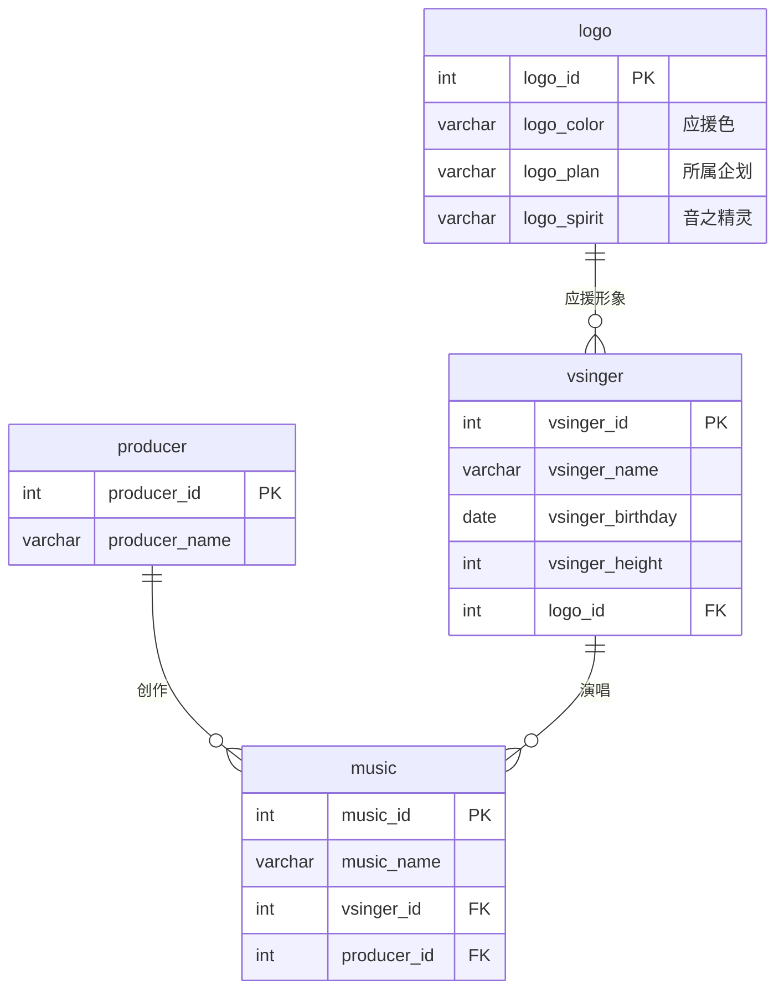

## 0. 项目导览

学习目标：把前几课学的 DDL（建库建表）、DML（增删改）、DQL（查询）在同一个项目里
连成完整闭环，并补上真实项目里必然遇到的多表设计与安全习惯。

项目背景：为一个虚拟歌手（Vocaloid）爱好者社区搭建"曲库"数据库。
三类核心实体与关系如下：



- 一个应援形象（logo）对应一位歌姬（1:1，本课程中简化为 logo 表被 vsinger 引用）。
- 一位 P主（producer）创作多首歌曲，一位歌姬演唱多首歌曲（1:N）。
- `music` 是典型的"双外键从表"，同时引用歌姬与 P主。

建议使用 MySQL 8.0+ 实操；每阶段先自己动手，再对照参考答案。

## 阶段一：设计与建库（DDL 实战）

### 1.1 建库与四张表

```sql
CREATE DATABASE IF NOT EXISTS music_project
    CHARACTER SET utf8mb4
    COLLATE utf8mb4_unicode_ci;
USE music_project;

-- 主表：应援形象
CREATE TABLE IF NOT EXISTS logo (
    logo_id         INT PRIMARY KEY COMMENT '形象ID',
    logo_color      VARCHAR(10) NOT NULL COMMENT '应援色(HEX)',
    logo_call       VARCHAR(15) DEFAULT NULL COMMENT '昵称',
    logo_plan       VARCHAR(50) NOT NULL COMMENT '所属企划',
    logo_spirit     VARCHAR(50) DEFAULT NULL COMMENT '音之精灵',
    logo_addtime    DATETIME DEFAULT (NOW()) COMMENT '录入时间'
) COMMENT = '应援形象表';

-- 从表：歌姬（引用 logo）
CREATE TABLE IF NOT EXISTS vsinger (
    vsinger_id       INT PRIMARY KEY COMMENT '歌姬ID',
    vsinger_name     VARCHAR(20) NOT NULL COMMENT '歌姬名',
    vsinger_birthday DATE NOT NULL COMMENT '生日',
    vsinger_height   INT NOT NULL CHECK (vsinger_height BETWEEN 100 AND 250) COMMENT '身高(cm)',
    vsinger_country  VARCHAR(30) NOT NULL DEFAULT '中国' COMMENT '国籍',
    vsinger_company  VARCHAR(45) NOT NULL COMMENT '所属公司',
    logo_id          INT NOT NULL COMMENT '应援形象ID',
    vsinger_addtime  DATETIME DEFAULT (NOW()) COMMENT '录入时间',
    CONSTRAINT uq_vsinger_name UNIQUE (vsinger_name),
    CONSTRAINT fk_vsinger_logo FOREIGN KEY (logo_id) REFERENCES logo (logo_id)
) COMMENT = '歌姬表';

-- 主表：P主
CREATE TABLE IF NOT EXISTS producer (
    producer_id      INT PRIMARY KEY COMMENT 'P主ID',
    producer_name    VARCHAR(35) NOT NULL COMMENT 'P主名',
    producer_addtime DATETIME DEFAULT (NOW()) COMMENT '录入时间'
) COMMENT = 'P主表';

-- 双外键从表：歌曲
CREATE TABLE IF NOT EXISTS music (
    music_id      INT PRIMARY KEY COMMENT '歌曲ID',
    music_name    VARCHAR(35) NOT NULL COMMENT '歌名',
    vsinger_id    INT NOT NULL COMMENT '演唱歌姬ID',
    producer_id   INT NOT NULL COMMENT '创作P主ID',
    music_addtime DATETIME DEFAULT (NOW()) COMMENT '录入时间',
    CONSTRAINT fk_music_vsinger FOREIGN KEY (vsinger_id) REFERENCES vsinger (vsinger_id),
    CONSTRAINT fk_music_producer FOREIGN KEY (producer_id) REFERENCES producer (producer_id)
) COMMENT = '歌曲表';

SHOW TABLES;
```

设计要点回顾（对应 [约束详解](/sql/015-Constraint)）：

- 主表在前、从表在后；建表顺序错了外键会建立失败。
- `CHECK` 让数据库兜底业务规则（身高区间），MySQL 8.0 起真正生效。
- 从表外键列（`logo_id`、`vsinger_id`、`producer_id`）必须与主表主键类型一致。

### 1.2 验证结构

```sql
DESC vsinger;
SHOW CREATE TABLE music\G   -- 能看到两条外键定义与引擎/字符集
```

## 阶段二：数据灌入（DML 实战）

### 2.1 幂等写入种子数据

全部使用 `INSERT IGNORE`（主键冲突时跳过），脚本可以放心重复执行：

```sql
INSERT IGNORE INTO logo (logo_id, logo_color, logo_call, logo_plan, logo_spirit)
VALUES (1, '#66CCFF', '天依', 'Vsinger', '天钿'),
       (2, '#EE0000', '阿绫', 'Vsinger', '释天'),
       (3, '#39C5BB', 'Miku', 'Crypton', NULL),
       (5, '#F6BE71', '山山', '五维介质', NULL),
       (6, '#9999FF', '尘宝', '五维介质', NULL);

INSERT IGNORE INTO producer (producer_id, producer_name)
VALUES (1, 'ilem'), (2, '阿良良木健'), (3, 'ChiliChill'),
       (4, 'COP'), (5, 'litterzy'), (8, 'Zeno');

INSERT IGNORE INTO vsinger
    (vsinger_id, vsinger_name, vsinger_birthday, vsinger_height, vsinger_company, logo_id)
VALUES (1001, '洛天依', '2012-07-12', 156, '上海禾念', 1),
       (1002, '乐正绫', '2015-04-12', 160, '上海禾念', 2),
       (1003, '初音未来', '2007-08-31', 158, 'Crypton', 3),
       (1008, '诗岸', '2019-04-07', 148, '五维介质', 5),
       (1009, '星尘', '2016-02-20', 160, '五维介质', 6);

INSERT IGNORE INTO music (music_id, music_name, vsinger_id, producer_id)
VALUES (2001, '勾指起誓', 1001, 1),
       (2002, '一花依世界', 1001, 2),
       (2003, '我的悲伤是水做的', 1001, 3),
       (2004, '普通DISCO', 1001, 1),
       (2005, '世末歌者', 1002, 4),
       (2006, '九九八十一', 1002, 5),
       (2007, '里表情人', 1003, 8),
       (2008, 'Rolling Girl', 1003, 8),
       (2009, '下等马', 1008, 3),
       (2010, '尘降', 1009, 8);
```

### 2.2 修正与删除（安全流程）

```sql
-- 需求：发现《普通DISCO》的 P主写错了，应改为 ilem（P主ID=1）→ 已正确，改为演示另一处
-- 先查证：这首歌现在挂在谁名下
SELECT m.music_id, m.music_name, p.producer_name
FROM music m JOIN producer p ON m.producer_id = p.producer_id
WHERE m.music_name = '普通DISCO';

-- 按主键修正（WHERE 用主键，影响范围可控）
UPDATE music SET producer_id = 1 WHERE music_id = 2004;

-- 软删除演示：给 music 表加删除标记列而不是物理删除
ALTER TABLE music
    ADD COLUMN deleted_at DATETIME NULL COMMENT '软删除时间';
UPDATE music SET deleted_at = NOW() WHERE music_id = 2009;
-- 之后的业务查询统一带上 deleted_at IS NULL 过滤
SELECT * FROM music WHERE deleted_at IS NULL;
```

## 阶段三：查询实战（DQL，12 道题）

题目由浅入深覆盖单表、聚合、多表连接、子查询。建议先写再对照答案。

**第 1 题**：查询所有身高不低于 155cm 的歌姬，按身高降序。

```sql
SELECT vsinger_name, vsinger_height
FROM vsinger
WHERE vsinger_height >= 155
ORDER BY vsinger_height DESC;
```

**第 2 题**：统计每个公司的歌姬数量，只保留人数大于等于 2 的公司。

```sql
SELECT vsinger_company AS 公司, COUNT(*) AS 人数
FROM vsinger
GROUP BY vsinger_company
HAVING COUNT(*) >= 2;
```

**第 3 题**：查询每首歌的歌名与演唱歌姬名（内连接）。

```sql
SELECT m.music_name AS 歌曲, v.vsinger_name AS 歌姬
FROM music m
JOIN vsinger v ON m.vsinger_id = v.vsinger_id;
```

**第 4 题**：查询歌名、歌姬名与创作 P主名（三表连接）。

```sql
SELECT m.music_name AS 歌曲,
       v.vsinger_name AS 歌姬,
       p.producer_name AS P主
FROM music m
JOIN vsinger v ON m.vsinger_id = v.vsinger_id
JOIN producer p ON m.producer_id = p.producer_id;
```

**第 5 题**：每位 P主创作了几首歌？没有作品的 P主也要出现（0 首）。

```sql
SELECT p.producer_name AS P主, COUNT(m.music_id) AS 作品数
FROM producer p
LEFT JOIN music m ON m.producer_id = p.producer_id
GROUP BY p.producer_id, p.producer_name
ORDER BY 作品数 DESC;
```

**第 6 题**：查询"洛天依"演唱过的所有歌曲。

```sql
SELECT m.music_name
FROM music m
JOIN vsinger v ON m.vsinger_id = v.vsinger_id
WHERE v.vsinger_name = '洛天依';
```

**第 7 题**：用子查询改写第 6 题（不使用 JOIN）。

```sql
SELECT music_name
FROM music
WHERE vsinger_id = (SELECT vsinger_id FROM vsinger WHERE vsinger_name = '洛天依');
```

**第 8 题**：查询没有演唱任何歌曲的歌姬（两栏写法等价）。

```sql
-- 左连接写法
SELECT v.vsinger_name
FROM vsinger v
LEFT JOIN music m ON m.vsinger_id = v.vsinger_id
WHERE m.music_id IS NULL;

-- NOT EXISTS 写法
SELECT vsinger_name
FROM vsinger v
WHERE NOT EXISTS (SELECT 1 FROM music WHERE vsinger_id = v.vsinger_id);
```

**第 9 题**：查询被两位以上歌姬"共享"过作品的 P主之外，找出只被初音未来演唱过作品的 P主。

```sql
SELECT DISTINCT p.producer_name
FROM producer p
JOIN music m ON m.producer_id = p.producer_id
WHERE m.vsinger_id = (SELECT vsinger_id FROM vsinger WHERE vsinger_name = '初音未来');
```

**第 10 题**：每首歌的歌名 + 该歌姬全部作品数量（窗口函数预演）。

```sql
SELECT m.music_name,
       v.vsinger_name,
       COUNT(*) OVER (PARTITION BY v.vsinger_id) AS 歌姬作品总数
FROM music m
JOIN vsinger v ON m.vsinger_id = v.vsinger_id;
```

**第 11 题**：按公司统计作品数，并列出每个公司最新的录入时间。

```sql
SELECT v.vsinger_company AS 公司,
       COUNT(*) AS 作品数,
       MAX(m.music_addtime) AS 最近录入
FROM music m
JOIN vsinger v ON m.vsinger_id = v.vsinger_id
GROUP BY v.vsinger_company;
```

**第 12 题**：找出比"本公司平均身高"高的歌姬（相关子查询）。

```sql
SELECT v1.vsinger_name, v1.vsinger_company, v1.vsinger_height
FROM vsinger v1
WHERE v1.vsinger_height > (
    SELECT AVG(v2.vsinger_height)
    FROM vsinger v2
    WHERE v2.vsinger_company = v1.vsinger_company
)
ORDER BY v1.vsinger_company, v1.vsinger_height DESC;
```

## 阶段四：收尾与安全习惯

```sql
-- 项目收尾前先备份（备份 → 确认 → 才做危险操作）
CREATE TABLE IF NOT EXISTS music_backup AS SELECT * FROM music;

SELECT (SELECT COUNT(*) FROM music) AS src_rows,
       (SELECT COUNT(*) FROM music_backup) AS bak_rows;
```

安全清单（项目制学习的习惯固化）：

- 种子数据一律幂等写入（`INSERT IGNORE` / `NOT EXISTS`），脚本可重复执行。
- `UPDATE`/`DELETE` 先 `SELECT` 验证 `WHERE` 命中的行，能用主键就用主键。
- 物理删除前先备份表；线上业务优先软删除（`deleted_at` 标记）。
- `TRUNCATE` 不可回滚且重置自增，只用于开发期清空测试数据。

## 小结与延伸

- 本项目把 DDL → DML → DQL 三阶段连成闭环，12 道查询覆盖了单表、聚合、连接、子查询与窗口函数预览。
- 设计层面的收获：主表/从表的建表顺序、双外键从表、`CHECK` 兜底业务规则、软删除字段。
- 延伸方向：查询性能如何保障？继续学习 [索引](/sql/032-Index) 与 [执行计划](/sql/033-ExecutionPlan)；
  想见识面试题风格的综合题库，见 [SQL 实战与面试](/sql/013-SQLPracticeInterview)。
