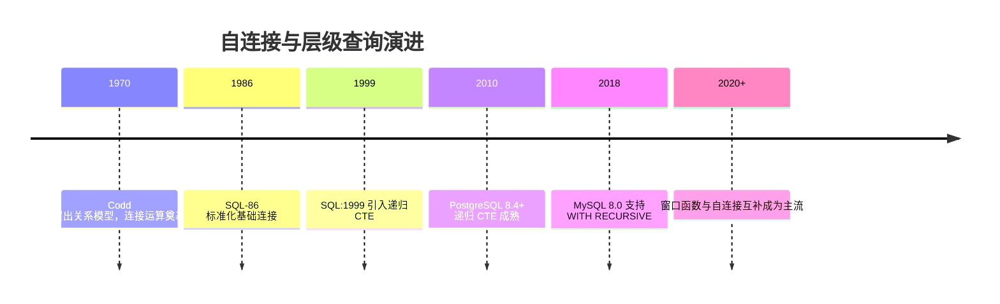
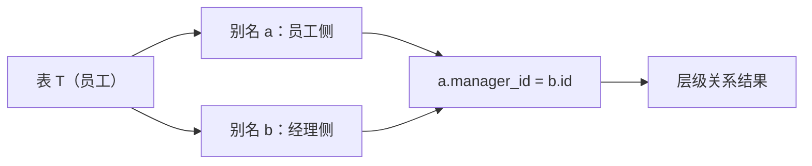

## 1. 历史动机与发展脉络

关系模型的奠基人 E. F. Codd 在 1970 年论文《A Relational Model of Data for Large Shared Data Banks》中定义了关系代数，连接（join）是核心运算。自连接并非特殊语法，而是连接运算的自然应用：把一张表同时当作两个关系实例使用。SQL 标准从一开始就允许表与自身连接，通过别名区分。

层次数据建模历史上主要有三种方案：邻接表（adjacency list，每行存 parent_id，自连接查询）、物化路径（materialized path）、嵌套集（nested set）。邻接表最直观，但深层查询需要递归；SQL:1999 引入递归 CTE，`WITH RECURSIVE` 成为邻接表任意深度查询的标准解法。现代数据库（PostgreSQL、MySQL 8+、SQL Server）都支持递归 CTE，自连接与其配合构成层级查询的完整工具箱。



## 2. 形式化定义

自连接是表 T 与自身的连接，形式化表示为：

```sql
SELECT ...
FROM T AS a
JOIN T AS b ON a.关键列 = b.关联列;
```

关键要素：

第一，必须为两侧实例指定不同别名（a、b），否则列引用歧义；

第二，连接条件决定行配对语义：`a.id = b.manager_id` 表达父子关系；`a.id < b.id` 表达无序对去重；

第三，连接类型决定保留行为：INNER 只保留配对行；LEFT 保留 a 侧全部行（含无配对）；CROSS 产生笛卡尔积（自连接全组合）。

自连接的数学本质：对 T 的两次投影做关系连接，结果行数在 0 到 |T|² 之间。不写连接条件的自连接会产生 |T|² 行，是典型的性能事故。



## 3. 理论推导与原理解析

### 3.1 自连接与关系代数

自连接本质是 `σ(条件)(T × T)` 的过滤投影。例如员工表 E，员工-经理查询等价于选择 E1.manager_id = E2.id 的笛卡尔积行。理解这一点可以推导：索引利用取决于连接列（manager_id、id）上的索引；无索引时是嵌套循环或哈希连接。

### 3.2 去重配对推导

好友关系表通常每对好友只存一行（如 user_a < user_b）。若要查询“所有好友对”，无需去重；若表中同时存在 (1,2) 与 (2,1)，自连接 `a.id < b.id` 保证每对只出现一次（取较小 id 在前）。推导：对任意无序对 {x, y}，条件 a.id < b.id 唯一确定一个方向。

### 3.3 自连接与递归 CTE 的分工

自连接固定一次连接，表达“一层关系”（直接下属）；要表达“所有层级”（组织树全展开）需要递归 CTE。递归 CTE 由锚点成员（顶层行）与递归成员（自连接下一层）构成，数据库迭代执行直到无新行。推导：树的深度 D 决定迭代次数，自连接写法需要 D-1 次手动连接，因此未知深度必须用递归。

## 4. 代码示例（带详尽注释）

### 4.1 员工-经理层级（内连接）

```sql
-- 员工表：id、姓名、直属经理 id
CREATE TABLE employee (
    id         INT PRIMARY KEY,
    name       VARCHAR(50),
    manager_id INT NULL REFERENCES employee(id)
);

-- 查询每位员工及其直属经理姓名
SELECT
    e.name AS 员工姓名,
    m.name AS 经理姓名
FROM employee AS e
JOIN employee AS m
  ON e.manager_id = m.id;
```

讲解：`e` 代表员工侧，`m` 代表经理侧，连接条件 `e.manager_id = m.id` 把每行员工与其经理行配对。INNER JOIN 会排除没有经理的顶层员工；需要包含顶层员工时改用 LEFT JOIN。

### 4.2 左连接保留顶层

```sql
-- 包含没有经理的 CEO（manager_id 为 NULL）
SELECT
    e.name AS 员工姓名,
    COALESCE(m.name, '无上级') AS 经理姓名
FROM employee AS e
LEFT JOIN employee AS m
  ON e.manager_id = m.id;
```

讲解：LEFT JOIN 保留 e 侧全部行，`COALESCE` 把 NULL 显示为“无上级”。这是组织架构查询的完整形态。

### 4.3 同表行间对比：同城市用户

```sql
-- 找出同一城市的用户对（每对只出现一次）
SELECT
    a.id   AS 用户A,
    b.id   AS 用户B,
    a.city AS 城市
FROM users AS a
JOIN users AS b
  ON a.city = b.city
 AND a.id < b.id;   -- 去重：只保留 a.id < b.id 的组合
```

讲解：`a.city = b.city` 配对同城用户，`a.id < b.id` 消除 (A,B) 与 (B,A) 的重复行。若去掉 `<` 条件，结果行数翻倍且含自配对（同一用户与自己）。

### 4.4 相邻记录对比：价格变化

```sql
-- 商品价格历史：找出价格变动的相邻记录
SELECT
    curr.product_id,
    prev.price AS 旧价格,
    curr.price AS 新价格,
    curr.changed_at AS 变动时间
FROM price_history AS curr
JOIN price_history AS prev
  ON curr.product_id = prev.product_id
 AND prev.changed_at = (
        SELECT MAX(changed_at)
        FROM price_history AS p
        WHERE p.product_id = curr.product_id
          AND p.changed_at < curr.changed_at
     );
```

讲解：子查询找到“当前记录之前的最近一条”作为旧价格，实现相邻记录配对。该模式用自连接表达“上一条”语义；现代数据库也可用 `LAG()` 窗口函数实现，写法更简洁：

```sql
SELECT product_id, price, changed_at,
       LAG(price) OVER (PARTITION BY product_id ORDER BY changed_at) AS 旧价格
FROM price_history;
```

### 4.5 连续登录检测

```sql
-- 找出连续两天登录的用户：今天登录且昨天也登录
SELECT DISTINCT
    today.user_id
FROM login_log AS today
JOIN login_log AS yesterday
  ON today.user_id = yesterday.user_id
 AND today.login_date = yesterday.login_date + INTERVAL '1 day';
```

讲解：自连接把“今天的行”与“昨天的行”配对，`INTERVAL '1 day'` 表达日期差。连续 N 天可以递归推广，但窗口函数（`DATE - ROW_NUMBER()` 分组）在长序列上更高效。

### 4.6 递归 CTE：全层级展开

```sql
-- 以 CEO 为根，展开整棵组织树
WITH RECURSIVE org_tree AS (
    -- 锚点成员：顶层员工
    SELECT id, name, manager_id, 1 AS depth
    FROM employee
    WHERE manager_id IS NULL

    UNION ALL

    -- 递归成员：连接直属下级
    SELECT
        e.id, e.name, e.manager_id, ot.depth + 1
    FROM employee AS e
    JOIN org_tree AS ot
      ON e.manager_id = ot.id
)
SELECT id, name, depth
FROM org_tree
ORDER BY depth, id;
```

讲解：递归 CTE 的锚点选择根节点，递归成员用自连接把下一层并入结果集，`depth` 记录层级。数据库迭代直到没有新行；若数据存在环（manager 循环引用），需在递归成员中去重或限制深度防止无限循环。

### 4.7 重复数据检测

```sql
-- 找出 email 重复的用户
SELECT a.id, a.email
FROM users AS a
JOIN users AS b
  ON a.email = b.email
 AND a.id < b.id;
```

讲解：按 email 配对并去重，命中的行表示存在重复。更高效的做法是 `GROUP BY email HAVING COUNT(*) > 1`，但自连接可以进一步展示重复行明细。

### 4.8 组合查询：第二高工资

```sql
-- 自连接求第二高工资（经典方案）
SELECT MAX(e1.salary) AS 第二高工资
FROM employee AS e1
JOIN employee AS e2
  ON e1.salary < e2.salary
GROUP BY e1.salary
HAVING COUNT(DISTINCT e2.salary) = 1;
```

讲解：e1 是候选行，e2 是比 e1 高的行；`COUNT(DISTINCT e2.salary) = 1` 表示恰好只有一档工资高于 e1，即 e1 是第二高。现代写法 `OFFSET 1` 或窗口函数更简洁，但该自连接方案展示了连接运算的表达能力。

## 5. 对比分析

### 5.1 自连接 vs 窗口函数

| 维度 | 自连接 | 窗口函数 |
| --- | --- | --- |
| 相邻记录 | 需要子查询找前驱 | LAG/LEAD 直接表达 |
| 性能 | 可能 O(N²) | 单次扫描 |
| 可读性 | 层级关系直观 | 序列计算直观 |
| 适用 | 层级、配对 | 排名、差值、累计 |

### 5.2 自连接 vs 子查询

子查询适合“每行一个标量结果”；自连接适合“行与行配对后联合输出”。多数场景可互换，但自连接能同时输出两侧字段（如员工与经理姓名），子查询难以做到。

### 5.3 邻接表 vs 物化路径 vs 嵌套集

邻接表（parent_id）配合递归 CTE 最灵活；物化路径（path 字段）读快写慢，适合读多写少的分类树；嵌套集（left/right）查询子树 O(1) 但更新成本高。现代 OLTP 首选邻接表 + 递归，OLAP 树结构可用物化路径。

## 6. 常见陷阱与最佳实践

陷阱一：忘记表别名，出现列歧义错误。自连接必须给两侧起不同别名。

陷阱二：漏写连接条件，产生笛卡尔积。自连接结果上限是 |T|²，大表直接爆炸。最佳实践：写自连接先确认连接条件，用 EXPLAIN 检查行数估算。

陷阱三：INNER JOIN 静默排除无配对行（如 CEO）。需要保留全部行时用 LEFT JOIN。

陷阱四：日期比较时忽略时区与精度。`today.login_date = yesterday.login_date + 1` 在带时间部分时失效，应使用 DATE 类型或 `::date` 转换。

陷阱五：递归 CTE 遇环无限循环。最佳实践：限制深度（`WHERE depth < 10`）或去重（UNION 代替 UNION ALL 的部分场景需谨慎）。

陷阱六：用自连接做大量行对比（O(N²)）而不加索引。连接列必须有索引；大数据量考虑窗口函数或物化聚合。

## 7. 工程实践

### 7.1 组织架构通用查询模板

```sql
-- 查询某员工的完整汇报链（向上）
WITH RECURSIVE report_chain AS (
    SELECT id, name, manager_id
    FROM employee
    WHERE id = :emp_id
    UNION ALL
    SELECT e.id, e.name, e.manager_id
    FROM employee AS e
    JOIN report_chain AS rc ON e.id = rc.manager_id
)
SELECT name FROM report_chain;
```

讲解：模板把“从某节点向上遍历”表达为递归 CTE，业务层只需替换参数。配合视图或函数封装，团队可复用。

### 7.2 性能验证

```sql
-- 查看自连接的执行计划：确认索引被使用
EXPLAIN ANALYZE
SELECT e.name, m.name
FROM employee AS e
JOIN employee AS m ON e.manager_id = m.id;
```

讲解：`EXPLAIN ANALYZE` 显示实际执行计划与耗时。连接列（manager_id、id）应有索引；若出现 Hash Join 且表很大，评估是否需要维护冗余层级表。

## 8. 案例研究：电商分类树的商品统计

需求：分类表（id、parent_id、name），统计每个分类（含子分类）下的商品数。

```sql
-- 1. 先展开每对“祖先-后代”关系（含自身）
WITH RECURSIVE category_tree AS (
    SELECT id AS ancestor, id AS descendant
    FROM category
    UNION ALL
    SELECT ct.ancestor, c.id
    FROM category AS c
    JOIN category_tree AS ct
      ON c.parent_id = ct.descendant
)
-- 2. 聚合：每个祖先分类下的商品数 = 所有后代分类商品数之和
SELECT
    ct.ancestor,
    COUNT(DISTINCT p.id) AS product_count
FROM category_tree AS ct
JOIN product AS p
  ON p.category_id = ct.descendant
GROUP BY ct.ancestor
ORDER BY ct.ancestor;
```

讲解：递归 CTE 先构造“祖先-后代”闭包，再连接商品表聚合。该模式把任意深度层级问题转化为平面配对问题，是分类树统计的标准解法。自连接在递归成员中承担“逐层下钻”的职责。

## 9. 知识要点总结与深入讲解

自连接的三个要点：别名（区分两侧）、连接条件（定义配对语义）、连接类型（控制保留行为）。掌握这三点，自连接就是普通连接。

自连接擅长表达“同表行之间的关系”，包括父子、相邻、配对、对比。遇到“行与行比”的需求，先想自连接；遇到“连续序列计算”，优先窗口函数；遇到“未知深度层级”，使用递归 CTE。

性能上自连接的最大风险是笛卡尔积与缺少索引。写完后用 EXPLAIN 验证，是每个 SQL 开发者的基本素养。

### 1. 自连接概述

自连接（Self Join）是将同一张表与自身进行连接的操作。表在自连接中扮演两个不同角色，需要使用不同的别名区分。

```sql
-- 自连接基本语法
SELECT a.column_name, b.column_name
FROM table_name AS a
JOIN table_name AS b ON a.some_id = b.some_id;
```

### 1. 典型场景

#### 1.1 层级结构查询

```sql
-- 员工-经理关系
CREATE TABLE employees (
    emp_id    SERIAL PRIMARY KEY,
    name      VARCHAR(100),
    manager_id INTEGER REFERENCES employees(emp_id),
    dept_id   INTEGER
);

-- 查询员工及其直接上级
SELECT
    e.name AS employee,
    m.name AS manager
FROM employees e
LEFT JOIN employees m ON e.manager_id = m.emp_id;

-- 查询同一经理下的所有员工对
SELECT
    e1.name AS emp1,
    e2.name AS emp2,
    e1.manager_id
FROM employees e1
JOIN employees e2 ON e1.manager_id = e2.manager_id AND e1.emp_id < e2.emp_id;
```

#### 1.2 同表比较

```sql
-- 查找薪资高于所在部门平均薪资的员工
SELECT e.name, e.salary, e.dept_id
FROM employees e
JOIN (
    SELECT dept_id, AVG(salary) AS avg_salary
    FROM employees
    GROUP BY dept_id
) dept_avg ON e.dept_id = dept_avg.dept_id
WHERE e.salary > dept_avg.avg_salary;

-- 使用自连接比较相邻行
SELECT
    curr.order_date,
    curr.amount AS current_amount,
    prev.amount AS previous_amount,
    curr.amount - prev.amount AS diff
FROM daily_sales curr
JOIN daily_sales prev ON curr.order_date = prev.order_date + INTERVAL '1 day';
```

#### 1.3 查找重复数据

```sql
-- 查找重复记录
SELECT a.emp_id, a.name, a.email
FROM employees a
JOIN employees b ON a.email = b.email AND a.emp_id <> b.emp_id;

-- 查找每组中除最新一条外的重复记录
SELECT a.id, a.user_id, a.action
FROM user_actions a
JOIN (
    SELECT user_id, MAX(created_at) AS latest
    FROM user_actions
    GROUP BY user_id
) b ON a.user_id = b.user_id AND a.created_at < b.latest;
```

#### 1.4 路径与距离计算

```sql
-- 航班中转查询
CREATE TABLE flights (
    flight_id   SERIAL PRIMARY KEY,
    from_city   VARCHAR(50),
    to_city     VARCHAR(50),
    distance    INTEGER
);

-- 查找经停一次的航线
SELECT
    f1.from_city,
    f1.to_city AS via_city,
    f2.to_city,
    f1.distance + f2.distance AS total_distance
FROM flights f1
JOIN flights f2 ON f1.to_city = f2.from_city
WHERE f1.from_city = '北京' AND f2.to_city = '上海';
```

### 2. 自连接与递归查询

#### 2.1 自连接的局限

```sql
-- 自连接只能查询固定层级
-- 查询2层：1次自连接
SELECT e.name, m.name AS manager
FROM employees e
LEFT JOIN employees m ON e.manager_id = m.emp_id;

-- 查询3层：2次自连接
SELECT e.name, m1.name AS manager, m2.name AS senior_manager
FROM employees e
LEFT JOIN employees m1 ON e.manager_id = m1.emp_id
LEFT JOIN employees m2 ON m1.manager_id = m2.emp_id;

-- 层级不确定时，应使用递归 CTE
```

#### 2.2 递归 CTE 替代方案

```sql
-- 使用递归 CTE 查询任意层级
WITH RECURSIVE org_chart AS (
    -- 基础查询：顶级经理
    SELECT emp_id, name, manager_id, 1 AS level
    FROM employees
    WHERE manager_id IS NULL

    UNION ALL

    -- 递归查询：下属
    SELECT e.emp_id, e.name, e.manager_id, oc.level + 1
    FROM employees e
    JOIN org_chart oc ON e.manager_id = oc.emp_id
)
SELECT * FROM org_chart ORDER BY level, name;
```

### 3. 性能优化

#### 3.1 索引策略

```sql
-- 自连接的连接列需要索引
CREATE INDEX idx_employees_manager_id ON employees(manager_id);

-- 覆盖索引减少回表
CREATE INDEX idx_employees_manager_cover ON employees(manager_id, name, salary);
```

#### 3.2 避免笛卡尔积

```sql
-- 错误：缺少连接条件导致笛卡尔积
SELECT a.*, b.*
FROM employees a, employees b;  -- n × n 行！

-- 正确：明确连接条件
SELECT a.name, b.name
FROM employees a
JOIN employees b ON a.manager_id = b.emp_id;
```

#### 3.3 使用不等条件控制结果

```sql
-- 使用 < 而非 <> 避免重复对
SELECT a.name AS emp1, b.name AS emp2
FROM employees a
JOIN employees b ON a.dept_id = b.dept_id AND a.emp_id < b.emp_id;
-- 只返回 (a,b) 不返回 (b,a)
```
### 自连接基础

**基本写法：表自连接**
`SELECT a.<列>, b.<列> FROM <表> a JOIN <表> b ON <条件>`
```sql
-- 同一张表连接自身，必须使用别名
SELECT e1.name AS employee, e2.name AS manager
FROM employees e1
JOIN employees e2 ON e1.manager_id = e2.emp_id;
```

---

**基本写法：自连接查找上下级**
`SELECT a.<列>, b.<列> FROM <表> a JOIN <表> b ON a.<父列> = b.<子列>`
```sql
-- 查找每个员工的直接上级
SELECT
  e.name AS employee_name,
  m.name AS manager_name
FROM employees e
LEFT JOIN employees m ON e.manager_id = m.id;
```

---

### 组织架构查询

**基本写法：查找同级同事**
`SELECT b.<列> FROM <表> a JOIN <表> b ON a.<列> = b.<列> AND a.<主键> <> b.<主键>`
```sql
-- 查找同部门的同事
SELECT a.name, b.name AS colleague
FROM employees a
JOIN employees b ON a.dept_id = b.dept_id
WHERE a.emp_id <> b.emp_id;
```

---

**基本写法：查找下属**
`SELECT b.* FROM <表> a JOIN <表> b ON b.<上级列> = a.<主键>`
```sql
-- 查找某经理的所有直接下属
SELECT m.name AS manager, e.name AS subordinate
FROM employees m
JOIN employees e ON e.manager_id = m.id
WHERE m.name = '张三';
```

---

### 对比查询

**基本写法：同表数据对比**
`SELECT a.* FROM <表> a JOIN <表> b ON <关联条件> WHERE <对比条件>`
```sql
-- 查找工资高于自己经理的员工
SELECT e.name, e.salary, m.name AS manager, m.salary AS mgr_salary
FROM employees e
JOIN employees m ON e.manager_id = m.id
WHERE e.salary > m.salary;
```

---

**基本写法：查找重复数据**
`SELECT a.* FROM <表> a JOIN <表> b ON a.<列> = b.<列> WHERE a.<主键> <> b.<主键>`
```sql
-- 查找重复邮箱的用户
SELECT a.id, a.name, a.email
FROM users a
JOIN users b ON a.email = b.email
WHERE a.id < b.id;
```

---

### 路径与层级查询

**基本写法：查找两级层级路径**
`SELECT a.<列> AS level1, b.<列> AS level2 FROM <表> a JOIN <表> b ON b.<父列> = a.<主键>`
```sql
-- 查找祖孙两级关系
SELECT p.name AS parent, c.name AS child
FROM categories p
JOIN categories c ON c.parent_id = p.id;
```

---

**基本写法：查找三级层级路径**
`SELECT a.<列>, b.<列>, c.<列> FROM <表> a JOIN <表> b ON ... JOIN <表> c ON ...`
```sql
-- 三级层级关系
SELECT
  l1.name AS level1,
  l2.name AS level2,
  l3.name AS level3
FROM categories l1
JOIN categories l2 ON l2.parent_id = l1.id
JOIN categories l3 ON l3.parent_id = l2.id;
```

---

### 日期与序列对比

**基本写法：查找连续事件**
`SELECT a.* FROM <表> a JOIN <表> b ON a.<日期> = b.<日期> - INTERVAL 1 DAY`
```sql
-- 查找连续登录的用户
SELECT a.user_id, a.login_date
FROM login_log a
JOIN login_log b ON a.user_id = b.user_id
  AND a.login_date = DATE_SUB(b.login_date, INTERVAL 1 DAY);
```

---

**基本写法：查找相邻行差值**
`SELECT a.<列>, b.<列>, (b.<列> - a.<列>) AS diff FROM <表> a JOIN <表> b ON <序列条件>`
```sql
-- 查找价格变动
SELECT a.date, a.price, b.date AS next_date, b.price AS next_price,
  b.price - a.price AS price_change
FROM stock_prices a
JOIN stock_prices b ON a.stock_id = b.stock_id
  AND b.date = DATE_ADD(a.date, INTERVAL 1 DAY);
```

---

### 自连接去重

**基本写法：自连接排除重复对**
`SELECT DISTINCT LEAST(a.<列>, b.<列>), GREATEST(a.<列>, b.<列>) FROM <表> a JOIN <表> b ON <条件>`
```sql
-- 查找所有不同的用户对
SELECT DISTINCT
  LEAST(a.user_id, b.user_id) AS user1,
  GREATEST(a.user_id, b.user_id) AS user2
FROM orders a
JOIN orders b ON a.product_id = b.product_id
WHERE a.user_id < b.user_id;
```

---

### 自连接性能优化

**基本写法：自连接加索引提示**
`-- 确保 JOIN 条件列有索引`
```sql
-- 在 manager_id 列上创建索引
CREATE INDEX idx_emp_manager ON employees(manager_id);

-- 查询使用索引
SELECT e.name, m.name AS manager
FROM employees e FORCE INDEX(idx_emp_manager)
JOIN employees m ON e.manager_id = m.id;
```

---

**基本写法：使用子查询替代自连接**
`SELECT * FROM <表> WHERE <列> = (SELECT MAX(<列>) FROM <表>)`
```sql
-- 某些场景子查询比自连接更高效
SELECT name, salary
FROM employees
WHERE salary = (SELECT MAX(salary) FROM employees);
```
