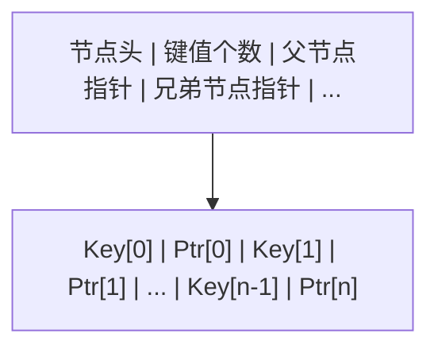
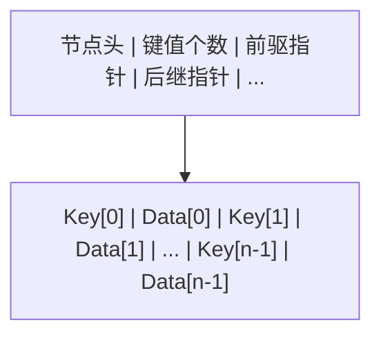
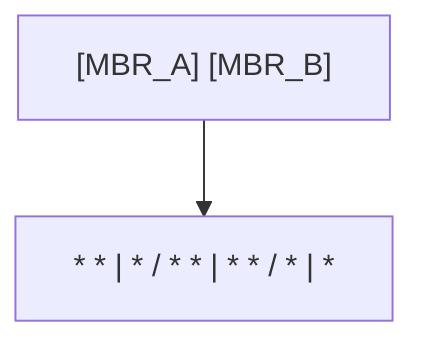

# SQL 索引体系：从数据结构到工程实践

> 本文是一篇面向数据库内核与工程实践的论文级教材，系统论述 SQL 索引的底层原理、数据结构、查询优化、维护策略与性能调优方法。内容覆盖 B+ 树、哈希、全文、空间、BRIN、GIN、GiST 等主流索引类型，并辅以执行计划分析、基准测试数据、故障排查案例与跨数据库实现对比。

---

## 第一章 概述与学习目标

### 1.1 索引的定义与本质

索引（Index）是数据库管理系统中用于加速数据检索的辅助数据结构。其本质是在原始数据之外，维护一份按照特定算法组织的、与原始数据存在指针映射关系的副本。索引的存在使得数据库可以避免对全表进行顺序扫描（Sequential Scan），转而通过对数级或常数级复杂度的数据结构访问，快速定位满足查询条件的行。

从信息检索的角度看，索引可类比为书籍的目录：读者若要在书中查找某个主题，无需逐页翻阅，只需查阅目录定位页码即可。数据库索引的原理与此一致，但其底层实现远比书籍目录复杂，涉及多路平衡树、哈希表、倒排索引、位图、R 树等多种数据结构，并与存储引擎、查询优化器、事务系统、缓冲池等子系统紧密耦合。

从系统工程的角度看，索引是一种典型的"空间换时间"机制：通过额外占用存储空间，换取查询时间的显著降低。然而这种权衡并非免费，索引会带来写入放大、存储膨胀、维护成本上升、优化器选择复杂度增加等副作用。因此，索引设计不仅是数据结构问题，更是工程权衡问题。

### 1.2 为什么需要索引

考虑一张包含 1 亿行记录的订单表 `orders`，若无任何索引，执行以下查询：

```sql
-- 无索引场景：数据库必须扫描全表 1 亿行
-- 假设每行 200 字节，单页 8KB 可容纳约 40 行
-- 全表约需 250 万次磁盘页面读取
SELECT order_id, customer_id, total_amount
FROM orders
WHERE order_id = 987654321;
```

在没有索引的情况下，数据库引擎必须从第一行扫描到最后一行，逐行判断 `order_id` 是否等于目标值。这种全表扫描的时间复杂度为 O(n)，在 1 亿行规模下，即使每行判断仅需微秒级，整体耗时也可能达到分钟级。

若在 `order_id` 列上建立 B+ 树索引，查询复杂度降至 O(log n)。以扇出 500 的 B+ 树为例，1 亿行仅需 3 层结构，3 次 I/O 即可定位目标行，耗时从分钟级降至毫秒级。这一数量级的性能差异，正是索引存在的根本意义。

索引的核心价值可归纳为以下五点：

1. **加速等值查询**：通过 B+ 树对数级查找或哈希索引常数级查找，快速定位满足 `=`、`IN` 条件的行。
2. **加速范围查询**：利用 B+ 树叶子节点的有序链表结构，高效执行 `BETWEEN`、`>`、`<` 等范围条件扫描。
3. **加速排序与分组**：索引本身有序，可直接服务于 `ORDER BY`、`GROUP BY`、`DISTINCT` 操作，避免额外的排序步骤。
4. **加速表连接**：在连接列上建立索引，可将嵌套循环连接的内表查找从 O(n) 降至 O(log n)。
5. **保证数据完整性**：唯一索引（UNIQUE INDEX）与主键索引在物理层面强制约束唯一性，是数据库完整性保障的基石。

### 1.3 索引的代价

索引并非万能药，其引入伴随着多维度的代价。理解这些代价，是进行合理索引设计的前提。

| 代价维度 | 具体表现 | 量化说明 |
| --- | --- | --- |
| 存储空间 | 每个索引独立存储一棵 B+ 树或其他结构 | 一个 B+ 树索引通常占用表数据 10%-30% 的空间 |
| 写入开销 | INSERT/UPDATE/DELETE 需同步维护所有相关索引 | 每增加一个索引，写入耗时增加 5%-15% |
| 更新开销 | 索引列更新导致索引项删除与插入 | 频繁更新的列上索引维护成本极高 |
| 优化器开销 | 索引越多，执行计划搜索空间越大 | 解析与优化阶段耗时增加，可能产生次优计划 |
| 缓存竞争 | 索引页占用缓冲池空间 | 过多索引导致热点数据被挤出缓存 |
| 锁竞争 | 索引维护引入额外锁 | 高并发写入场景下索引页成为锁热点 |

### 1.4 学习目标

完成本章学习后，读者应当具备以下能力：

1. **理论层**：理解 B 树、B+ 树、哈希表、倒排索引、R 树、位图等数据结构的原理与复杂度分析，能够阐述 B+ 树相比 B 树在数据库场景下的优势。
2. **实现层**：掌握主流数据库（MySQL、PostgreSQL、Oracle、SQL Server）的索引实现差异，理解聚簇索引与非聚簇索引、覆盖索引、部分索引、表达式索引等高级特性。
3. **优化层**：能够使用 `EXPLAIN`、`EXPLAIN ANALYZE` 分析执行计划，判断索引是否被正确使用，识别索引失效场景，并给出优化方案。
4. **工程层**：掌握索引设计原则，能够在给定业务场景下设计合理的索引方案，平衡查询性能与写入开销。
5. **运维层**：理解索引膨胀、碎片化、统计信息过期等维护问题，掌握索引重建、统计信息更新、未使用索引清理等运维操作。
6. **排错层**：能够基于慢查询日志、执行计划、系统视图等手段，定位索引相关的性能问题并提出修复方案。

### 1.5 全文结构导览

本文共分十八章，按照"理论→实现→优化→实践"的逻辑递进组织：

- 第一至六章：索引理论基础与各类型索引的深度剖析（B+ 树、哈希、全文、空间）。
- 第七章：索引类型系统化对比（表格化呈现）。
- 第八章：高级索引技术（覆盖索引、部分索引、表达式索引等）。
- 第九至十章：索引选择、执行计划分析与索引维护。
- 第十一章：索引相关参数调优。
- 第十二章：性能分析与基准测试（含具体数据）。
- 第十三至十四章：最佳实践与常见陷阱。
- 第十五章：故障排查实战案例。
- 第十六章：跨数据库索引实现对比。
- 第十七章：练习题与参考答案。
- 第十八章：参考文献。

---

## 第二章 索引理论基础

### 2.1 数据结构理论概述

索引的底层是数据结构。不同的数据结构决定了索引支持的查询类型、时间复杂度、空间复杂度与适用场景。理解数据结构理论，是理解索引行为的根基。

数据库索引涉及的核心数据结构包括：

| 数据结构 | 时间复杂度（查找） | 支持范围查询 | 支持排序 | 典型索引类型 |
| --- | --- | --- | --- | --- |
| 二叉搜索树（BST） | O(log n) 平均，O(n) 最坏 | 支持 | 支持 | 理论基础，实际不使用 |
| 平衡二叉树（AVL/红黑） | O(log n) | 支持 | 支持 | 理论基础，实际不使用 |
| B 树（B-Tree） | O(log n) | 支持 | 支持 | 早期数据库使用 |
| B+ 树（B+Tree） | O(log n) | 高效支持 | 高效支持 | 主流索引结构 |
| 哈希表（Hash Table） | O(1) 平均 | 不支持 | 不支持 | 哈希索引 |
| 位图（Bitmap） | O(1) | 有限支持 | 不支持 | 位图索引（Oracle） |
| 倒排索引（Inverted Index） | O(1) 词项查找 | 不支持 | 相关性排序 | 全文索引 |
| R 树（R-Tree） | O(log n) | 空间范围 | 不支持 | 空间索引 |
| 跳表（Skip List） | O(log n) | 支持 | 支持 | Redis SortedSet |

### 2.2 二叉搜索树及其局限

二叉搜索树（Binary Search Tree, BST）是最基础的有序树结构：左子树所有节点值小于根节点，右子树所有节点值大于根节点。理论上 BST 查找复杂度为 O(log n)，但存在致命缺陷——当数据有序插入时，BST 会退化为链表，复杂度恶化为 O(n)。

```
-- 依次插入 1, 2, 3, 4, 5，BST 退化为链表：

    1
     \
      2
       \
        3
         \
          4
           \
            5

-- 查找 5 需要遍历 5 个节点，复杂度 O(n)
```

为解决退化为链表的问题，引入了自平衡二叉树（AVL 树、红黑树）。红黑树通过颜色约束与旋转操作，保证树高始终为 O(log n)。Java 的 `TreeMap`、C++ 的 `std::map` 均基于红黑树实现。

然而红黑树在数据库场景下仍不适用，原因在于其每个节点最多只有两个子节点，树高过大。对于 10 亿行数据，红黑树高度约 30 层，意味着 30 次磁盘 I/O——而磁盘 I/O 是数据库性能的主要瓶颈（机械硬盘单次 I/O 约 10ms，SSD 约 0.1ms）。这就引出了多路平衡树（B 树与 B+ 树）的必要性。

### 2.3 B 树（B-Tree）

B 树是一种多路平衡搜索树，由 Rudolf Bayer 与 Edward McCreight 于 1970 年提出。B 树的核心思想是：通过增加每个节点的子节点数量（即"路数"或"阶"），降低树的高度，从而减少磁盘 I/O 次数。

一棵 m 阶 B 树满足以下性质：

1. 每个节点最多有 m 个子节点。
2. 每个非根非叶节点至少有 ⌈m/2⌉ 个子节点。
3. 根节点至少有 2 个子节点（除非它是叶节点）。
4. 具有 k 个子节点的节点包含 k-1 个键值。
5. 所有叶节点出现在同一层（平衡性）。
6. 节点内的键值按升序排列。

B 树的关键特征是：**所有节点（包括非叶节点与叶节点）都存储键值与对应的数据**。这意味着非叶节点既承担导航作用，也存储实际数据。

```
-- 4 阶 B 树示例（每个节点最多 3 个键值、4 个子节点）：

                    [30 | 60]
                   /    |     \
          [10|20|25] [40|50] [70|80|90]
          (含数据)    (含数据)  (含数据)
```

B 树的查找可能在非叶节点就终止（若目标键存在于非叶节点），这看似高效，但带来了范围查询的困难：范围查询需要在树的不同层级间回溯，效率较低。

### 2.4 B+ 树（B+Tree）

B+ 树是 B 树的变体，由 Douglas Comer 于 1979 年在论文"The Ubiquitous B-Tree"中系统论述。B+ 树对 B 树做了关键改进，成为现代数据库索引的事实标准。

B+ 树与 B 树的核心区别：

| 对比维度 | B 树 | B+ 树 |
| --- | --- | --- |
| 数据存储位置 | 所有节点均存数据 | 仅叶节点存数据，非叶节点只存键值与指针 |
| 叶子节点连接 | 无连接 | 通过双向链表连接 |
| 范围查询效率 | 低（需回溯非叶节点） | 高（直接遍历叶子链表） |
| 单节点键值容量 | 较少（数据占空间） | 较多（无数据，只存键值） |
| 树高 | 较高 | 较低（扇出更大） |
| 查找路径 | 可在非叶节点终止 | 必须到达叶节点 |

B+ 树的结构将在第三章深度剖析，此处仅给出概念示意：

```
-- B+ 树结构示意：

                 [30 | 60]                    ← 非叶节点（仅存键值与指针）
                /    |     \
       [10|20|30] [40|50|60] [70|80|90]      ← 非叶节点（仅存键值与指针）
         / | \      / | \      / | \
      ←[1..30]↔[31..60]↔[61..90]→            ← 叶节点（存数据/指针，双向链表）
```

B+ 树之所以成为数据库索引的首选，原因有四：

1. **扇出更大，树高更低**：非叶节点不存数据，相同页大小下可容纳更多键值，扇出（fanout）显著增大。扇出 500 的 B+ 树，3 层即可索引 1.25 亿行，4 层可索引 625 亿行。
2. **范围查询高效**：叶节点双向链表使得范围扫描只需定位起点后顺序遍历，无需回溯非叶节点。
3. **查询性能稳定**：所有查询都需到达叶节点，时间复杂度恒定为 O(log n)，不会出现 B 树中"非叶节点命中即返回"导致的性能波动。
4. **顺序访问友好**：叶节点链表天然支持 `ORDER BY`、`GROUP BY` 等排序操作，避免额外排序步骤。

### 2.5 哈希表（Hash Table）

哈希表是通过哈希函数将键值映射到桶（Bucket）的数据结构。其查找时间复杂度为 O(1)（理想情况），远优于 B+ 树的 O(log n)。但哈希表的关键局限在于：**键值经哈希后失去顺序关系**，因此无法支持范围查询、排序、最左前缀匹配等操作。

哈希表的核心问题包括：

1. **哈希冲突**：不同键值可能映射到同一桶，需通过链地址法或开放寻址法解决。冲突严重时，查找复杂度退化为 O(n)。
2. **动态扩容**：当负载因子超过阈值时需扩容并重新哈希，扩容期间性能下降。
3. **无序性**：无法支持基于顺序的查询。

哈希表在数据库中的应用主要是哈希索引（如 PostgreSQL 的 HASH 索引、MySQL Memory 引擎的默认索引）与内存数据库（如 Redis）。此外，InnoDB 的自适应哈希索引（Adaptive Hash Index, AHI）会在运行时自动为热点 B+ 树页构建哈希索引，以加速等值查询。

### 2.6 位图（Bitmap）

位图索引为每个可能的键值维护一个位图，位图的每一位对应表中一行，1 表示该行包含此键值，0 表示不包含。位图索引特别适合低基数列（如性别、状态、地区等取值有限的列）。

位图索引的优势在于：

1. 存储紧凑：每个键值只需一个位图，占用空间极小。
2. 支持高效的布尔运算：AND、OR、NOT 操作可通过位图的按位运算高效完成。
3. 适合 OLAP 场景：星型查询中多个低基数列的复合条件可快速通过位图合并定位。

位图索引的劣势在于：

1. 不适合高基数列：键值越多，位图数量越多，空间与维护成本上升。
2. 不适合频繁更新的表：每次更新需修改多个位图，锁粒度粗，并发性差。

位图索引主要被 Oracle 数据库采用，MySQL 与 PostgreSQL 原生不支持位图索引（但 PostgreSQL 在执行计划中会使用位图扫描 Bitmap Scan，这是运行时动态构建的位图，不同于持久化的位图索引）。

### 2.7 倒排索引（Inverted Index）

倒排索引是全文检索的核心数据结构。其核心思想是：从文档中提取词项（Term），建立"词项→文档列表"的映射。

```
-- 倒排索引示意：

词项         文档列表（posting list）
"数据库"  →  [doc1, doc3, doc5, doc8]
"索引"    →  [doc1, doc2, doc4, doc8]
"优化"    →  [doc2, doc3, doc6]
"查询"    →  [doc1, doc4, doc5, doc7]
```

倒排索引支持高效的词项查询与多词项的布尔运算（AND/OR/NOT）。此外，通过在 posting list 中记录词项在文档中的位置与频率，可支持短语查询与相关性排序（TF-IDF、BM25）。

倒排索引在数据库中的应用包括 PostgreSQL 的 GIN 索引（用于全文检索）、MySQL 的 FULLTEXT 索引、Elasticsearch 的底层结构等。

### 2.8 R 树（R-Tree）

R 树是 Antonin Guttman 于 1984 年提出的空间索引数据结构，用于索引多维空间数据。R 树通过最小外接矩形（Minimum Bounding Rectangle, MBR）组织空间对象，支持高效的空间范围查询与最近邻查询。

```
-- R 树结构示意：

根节点：
[MBR_A (覆盖左半区域)]  [MBR_B (覆盖右半区域)]
      |                        |
      v                        v
[MBR_A1] [MBR_A2]        [MBR_B1] [MBR_B2]
  (点集)   (点集)          (点集)   (点集)
```

R 树的查找通过判断查询矩形与节点 MBR 的相交关系逐层下探。R 树的变体包括 R* 树（优化插入与分裂策略）、R+ 树（禁止 MBR 重叠）等。

在数据库中，R 树主要用于空间索引：MySQL 的 SPATIAL INDEX（基于 R 树）、PostgreSQL 的 GiST 索引（可承载 R 树策略）、Oracle 的 Spatial 索引等。

### 2.9 时间复杂度分析

下表汇总了各数据结构在主要操作上的时间复杂度：

| 数据结构 | 查找 | 插入 | 删除 | 范围查询 | 排序输出 |
| --- | --- | --- | --- | --- | --- |
| 二叉搜索树（平均） | O(log n) | O(log n) | O(log n) | O(log n + k) | O(n) |
| 二叉搜索树（最坏） | O(n) | O(n) | O(n) | O(n) | O(n) |
| 红黑树 | O(log n) | O(log n) | O(log n) | O(log n + k) | O(n) |
| B 树 | O(log n) | O(log n) | O(log n) | O(log n + k) | O(n) |
| B+ 树 | O(log n) | O(log n) | O(log n) | O(log n + k) | O(k) |
| 哈希表（平均） | O(1) | O(1) | O(1) | 不支持 | 不支持 |
| 哈希表（最坏） | O(n) | O(n) | O(n) | 不支持 | 不支持 |
| 位图索引 | O(1) | O(1) | O(1) | O(n/word) | O(n) |
| 倒排索引 | O(1) | O(log n) | O(log n) | O(k) | 按相关性 |
| R 树 | O(log n) | O(log n) | O(log n) | O(log n + k) | 不适用 |

注：n 为数据总量，k 为查询结果集大小。

### 2.10 空间换时间原理

索引的本质是空间换时间。理解这一原理，需要从磁盘 I/O 的物理特性入手。

磁盘访问的代价层次：

| 访问类型 | 延迟（数量级） | 说明 |
| --- | --- | --- |
| CPU 缓存访问 | 1 ns | L1/L2/L3 缓存 |
| 内存访问 | 100 ns | 主存随机访问 |
| SSD 随机读 | 100 us | 固态硬盘 |
| 机械硬盘随机读 | 10 ms | 寻道+旋转延迟 |
| 机械硬盘顺序读 | 100 us | 无寻道开销 |

可见，磁盘随机 I/O 与内存访问之间存在 5 个数量级的差距。索引的核心价值在于：将 O(n) 次随机 I/O（全表扫描）转化为 O(log n) 次随机 I/O（B+ 树查找），或 O(k) 次顺序 I/O（范围扫描）。

空间换时间的量化示例：

假设一张表有 1 亿行，每行 200 字节，表数据总量 20 GB。在 `order_id` 上建立 B+ 树索引：

- 索引键 8 字节（BIGINT）+ 行指针 6 字节 = 14 字节/项
- 1 亿项 × 14 字节 ≈ 1.4 GB 索引空间
- 扇出约 500（8KB 页 / 14 字节 ≈ 570，取 500）
- 树高 3 层

查询 `order_id = X`：
- 无索引：扫描 20 GB，约 250 万次页读取，机械硬盘约 25000 秒。
- 有索引：3 次 I/O 定位索引项 + 1 次 I/O 读取数据页，机械硬盘约 40 ms。

代价是额外占用 1.4 GB（约 7%）存储空间，以及每次 INSERT/UPDATE/DELETE 时维护索引的开销（约增加 5-10% 写入耗时）。这一权衡在绝大多数读多写少的业务场景下是绝对值得的。

---

## 第三章 B+ 树索引深度剖析

### 3.1 B+ 树的节点结构

B+ 树由三种节点组成：根节点（Root）、内部节点（Internal Node）、叶子节点（Leaf Node）。在数据库实现中，每个节点通常对应磁盘上的一个页（Page），页大小一般为 8KB 或 16KB。

#### 3.1.1 非叶节点结构

非叶节点（根节点与内部节点统称）只存储键值（Key）与子节点指针（Pointer），不存储实际数据。其结构如下：



#### 3.1.2 叶子节点结构

叶子节点存储全部键值与对应的数据或数据指针，并通过双向链表连接：



### 3.2 B+ 树的查找算法

B+ 树的查找从根节点开始，逐层下探至叶子节点。查找过程分为等值查找与范围查找两类。

#### 3.2.1 等值查找

```
算法：BPlusTree_Search(root, key)
输入：根节点 root，目标键值 key
输出：目标数据或指针

1.  node := root
2.  WHILE node 不是叶子节点 DO
3.      在 node 的键值序列中二分查找 key
4.      IF key < Key[0] THEN
5.          node := Ptr[0] 对应的子节点
6.      ELSE IF key >= Key[n-1] THEN
7.          node := Ptr[n] 对应的子节点
8.      ELSE
9.          找到 i 使得 Key[i] <= key < Key[i+1]
10.         node := Ptr[i+1] 对应的子节点
11. END WHILE
12. -- 此时 node 为叶子节点
13. 在 node 的键值序列中二分查找 key
14. IF 找到 THEN RETURN Data[对应位置]
15. ELSE RETURN 未找到
```

示例：在如下 B+ 树中查找 key = 42

```
                    [30 | 60]
                   /    |     \
          [10|20|30] [40|50|60] [70|80|90]
            / | \      / | \      / | \
         叶子 叶子 叶子 叶子 叶子 叶子 叶子 叶子 叶子
```

查找过程：

1. 从根节点 `[30|60]` 开始，42 在 30 和 60 之间，进入第 2 个子节点 `[40|50|60]`。
2. 在 `[40|50|60]` 中，42 在 40 和 50 之间，进入第 2 个子节点（叶子）。
3. 在叶子节点中二分查找 42，找到则返回数据。

#### 3.2.2 范围查找

```
算法：BPlusTree_RangeSearch(root, low, high)
输入：根节点 root，范围下界 low，范围上界 high
输出：满足 low <= key <= high 的所有数据

1.  通过等值查找定位到 low 所在的叶子节点位置
2.  从该位置开始，沿叶子节点的后继指针顺序遍历
3.  WHILE 当前键值 <= high DO
4.      收集当前键值对应的数据
5.      移动到下一个键值（若到达叶子节点末尾，跳到下一个叶子节点）
6.  END WHILE
7.  RETURN 收集到的所有数据
```

范围查找的效率优势源于叶子节点的链表结构：定位起点需 O(log n)，之后顺序遍历 k 个结果仅需 O(k)，总复杂度 O(log n + k)。

### 3.3 B+ 树的插入算法

插入操作需保持 B+ 树的平衡性与有序性。核心步骤如下：

```
算法：BPlusTree_Insert(root, key, data)
输入：根节点 root，键值 key，数据 data

1.  定位 key 应插入的叶子节点 leaf
2.  将 (key, data) 插入 leaf 的正确位置（保持有序）
3.  IF leaf 中的键值数未超过上限 THEN
4.      RETURN  -- 插入完成
5.  ELSE
6.      -- 叶子节点溢出，需分裂
7.      将 leaf 的键值从中间分成两半
8.      创建新叶子节点 new_leaf，存放后半部分
9.      更新叶子节点链表指针
10.     将中间键值（new_leaf 的第一个键值）上推到父节点
11.     IF 父节点也溢出 THEN
12.         递归分裂父节点（内部节点分裂规则略不同）
13.     END IF
14.     IF 分裂传播到根节点 THEN
15.         创建新根节点，树高增加 1
16.     END IF
17. END IF
```

#### 3.3.1 插入示例（含分裂图示）

以 4 阶 B+ 树为例（每个节点最多 3 个键值），依次插入 10, 20, 30, 40, 50, 60, 70。

**步骤 1**：插入 10, 20, 30

```
叶子节点：[10 | 20 | 30]
（未溢出，3 个键值等于上限，暂不分裂）
```

**步骤 2**：插入 40

```
叶子节点尝试变为：[10 | 20 | 30 | 40]  -- 溢出（4 > 3）
需分裂：

分裂前：[10 | 20 | 30 | 40]
中间位置：第 2 个键值（20）

左半：[10 | 20]
右半：[30 | 40]
上推键值：30（右半的第一个键值）

树结构：
              [30]
             /    \
        [10|20] ↔ [30|40]
```

**步骤 3**：插入 50

```
50 应插入右叶子 [30|40]，变为 [30|40|50]（未溢出）

树结构：
              [30]
             /    \
        [10|20] ↔ [30|40|50]
```

**步骤 4**：插入 60

```
60 应插入右叶子 [30|40|50]，变为 [30|40|50|60]  -- 溢出
需分裂：

分裂前：[30|40|50|60]
中间位置：第 2 个键值（50）

左半：[30|40]
右半：[50|60]
上推键值：50

父节点 [30] 插入 50，变为 [30|50]（未溢出）

树结构：
            [30 | 50]
           /    |     \
      [10|20] ↔ [30|40] ↔ [50|60]
```

**步骤 5**：插入 70

```
70 应插入右叶子 [50|60]，变为 [50|60|70]（未溢出）

树结构：
            [30 | 50]
           /    |     \
      [10|20] ↔ [30|40] ↔ [50|60|70]
```

**步骤 6**：假设继续插入 25, 35

```
插入 25：左叶子 [10|20] 变为 [10|20|25]（未溢出）
插入 35：中叶子 [30|40] 变为 [30|35|40]（未溢出）

树结构：
              [30 | 50]
             /    |     \
  [10|20|25] ↔ [30|35|40] ↔ [50|60|70]
```

**步骤 7**：插入 15（触发叶子分裂与父节点分裂）

```
15 应插入左叶子 [10|20|25]，变为 [10|15|20|25]  -- 溢出
分裂：
  左半：[10|15]
  右半：[20|25]
  上推：20

父节点 [30|50] 插入 20，变为 [20|30|50]（未溢出）

树结构：
           [20 | 30 | 50]
          /    |    |     \
  [10|15] ↔ [20|25] ↔ [30|35|40] ↔ [50|60|70]
```

**步骤 8**：假设再插入若干值导致父节点溢出

```
父节点 [20|30|50] 插入新键后变为 [20|30|40|50]  -- 溢出
内部节点分裂（注意：内部节点分裂不上推中间键值本身，而是将其上推）：

分裂前：[20|30|40|50]
中间键值：30（第 2 个，索引 1）

左半：[20]   （不含 30）
右半：[40|50]（不含 30）
上推：30

树结构（新根）：
                    [30]
                   /    \
            [20]          [40|50]
           /    \         /    |    \
  [10|15] ↔ [20|25] ↔ [30|35|40] ↔ [50|60|70]

注意：内部节点分裂时，中间键值被上推，不出现在子节点中。
     这与叶子节点分裂不同（叶子分裂时，中间键值复制上推，仍保留在右半部分）。
```

### 3.4 B+ 树的删除算法

删除操作需处理节点下溢（键值数低于下限）的情况，通过借键或合并维持平衡。

```
算法：BPlusTree_Delete(root, key)
输入：根节点 root，键值 key

1.  定位 key 所在的叶子节点 leaf
2.  从 leaf 中删除 key 及其对应数据
3.  IF leaf 中的键值数 >= 下限（⌈m/2⌉-1）THEN
4.      RETURN  -- 删除完成
5.  ELSE
6.      -- 叶子节点下溢，尝试向兄弟借键或与兄弟合并
7.      IF 左兄弟键值数 > 下限 THEN
8.          从左兄弟借最后一个键值（涉及父节点键值调整）
9.      ELSE IF 右兄弟键值数 > 下限 THEN
10.         从右兄弟借第一个键值（涉及父节点键值调整）
11.     ELSE
12.         与左兄弟或右兄弟合并（合并后键值数 <= 上限）
13.         从父节点删除分隔两个合并节点的键值
14.         IF 父节点下溢 THEN
15.             递归处理父节点的借键或合并
16.         END IF
17.     END IF
18.     IF 合并传播到根节点且根节点变空 THEN
19.         根节点的唯一子节点成为新根，树高减 1
20.     END IF
21. END IF
```

#### 3.4.1 删除示例（含合并图示）

以如下 B+ 树为例，演示删除操作：

```
初始树：
              [20 | 30 | 50]
             /    |    |     \
  [10|15] ↔ [20|25] ↔ [30|35|40] ↔ [50|60|70]
```

**示例 1**：删除 35（无下溢）

```
35 所在叶子 [30|35|40] 删除后变为 [30|40]（2 个键值，未下溢，下限为 1）

树结构不变（仅叶子内容变化）：
              [20 | 30 | 50]
             /    |    |     \
  [10|15] ↔ [20|25] ↔ [30|40] ↔ [50|60|70]
```

**示例 2**：删除 25（下溢，向右兄弟借键）

```
25 所在叶子 [20|25] 删除后变为 [20]（1 个键值，等于下限，未下溢）

假设下限为 2，则 [20] 下溢，需处理：
右兄弟 [30|40] 键值数 2（等于下限，无法借），尝试合并：

合并 [20] 与 [30|40]：
  合并后：[20|30|40]
  从父节点删除分隔键 30

父节点 [20|30|50] 删除 30 后变为 [20|50]（2 个键值，未下溢）

树结构：
              [20 | 50]
             /    |     \
  [10|15] ↔ [20|30|40] ↔ [50|60|70]
```

**示例 3**：删除 15（无下溢）

```
15 所在叶子 [10|15] 删除后变为 [10]（假设下限为 1，未下溢）

树结构：
              [20 | 50]
             /    |     \
     [10] ↔ [20|30|40] ↔ [50|60|70]
```

**示例 4**：删除 10（下溢，与右兄弟合并，传播到根）

```
10 所在叶子 [10] 删除后变空，下溢
右兄弟 [20|30|40] 键值数 3（大于下限，可借）：

借键方案：从右兄弟借第一个键值 20
  右兄弟变为 [30|40]
  [10] 的位置变为 [20]（被借来的键值）
  父节点中分隔两叶子键值 20 更新为 30

树结构：
              [30 | 50]
             /    |     \
     [20] ↔ [30|40] ↔ [50|60|70]
```

**示例 5**：删除传播到根（树高降低）

假设经过多次删除，树结构为：

```
              [30]
             /    \
        [20]      [50]
       /    \    /    \
  [10] ↔ [20] ↔ [40] ↔ [50|60]
```

删除 10、20、40 后，左半部分完全清空，最终合并传播到根：

```
根 [30] 只剩一个子节点 [50|60]，根节点变为空
[50|60] 成为新根，树高从 3 降为 1：

  [50|60]
```

### 3.5 为什么用 B+ 树而非 B 树

B+ 树相比 B 树的优势，在数据库场景下具有决定性意义：

#### 3.5.1 扇出更大，I/O 更少

B 树的非叶节点存储键值+数据，B+ 树的非叶节点只存储键值+指针。在相同页大小下，B+ 树非叶节点能容纳更多键值，扇出更大。

量化对比（页大小 8KB，键值 8 字节，指针 6 字节，数据 100 字节）：

- B 树非叶节点：每项 8+6+100=114 字节，可容纳 8192/114 ≈ 71 项，扇出约 72。
- B+ 树非叶节点：每项 8+6=14 字节，可容纳 8192/14 ≈ 585 项，扇出约 586。

对于 1 亿行数据：

- B 树（扇出 72）：树高 ⌈log_72(10^8)⌉ = 5 层，5 次 I/O。
- B+ 树（扇出 586）：树高 ⌈log_586(10^8)⌉ = 3 层，3 次 I/O。

B+ 树减少了 40% 的 I/O 次数，在机械硬盘上每次 I/O 节省 10ms，累计节省 20ms。

#### 3.5.2 范围查询高效

数据库中范围查询极为常见（`BETWEEN`、`>`、`<`、时间区间等）。B 树的范围查询需通过中序遍历回溯非叶节点，每次回溯涉及随机 I/O。B+ 树的范围查询只需定位起点后顺序遍历叶子链表，I/O 模式从随机转为顺序，性能提升数倍至数十倍。

#### 3.5.3 查询性能稳定

B 树中，若目标键值存在于非叶节点，查找提前终止；若在叶节点，需遍历到底。这导致查询性能不稳定，取决于键值所在层级。B+ 树所有查找都到达叶节点，性能恒定，便于性能预测与容量规划。

#### 3.5.4 顺序访问友好

B+ 树叶子链表天然支持顺序全索引扫描，对 `ORDER BY`、`GROUP BY`、`DISTINCT` 等操作极为友好。B 树的顺序访问需中序遍历，涉及大量随机 I/O。

### 3.6 聚簇索引与非聚簇索引

聚簇索引（Clustered Index）与非聚簇索引（Non-Clustered Index，又称二级索引 Secondary Index）是索引的两种物理存储模式。

#### 3.6.1 聚簇索引

聚簇索引将表数据按索引键的顺序物理存储。叶子节点直接存储完整行数据，而非指针。一张表只能有一个聚簇索引（因为数据只能按一种顺序物理排列）。

```
-- 聚簇索引结构：

        [30 | 60]                    ← 非叶节点（键值+指针）
       /    |     \
  [10|20|30] [40|50|60] [70|80|90]  ← 非叶节点（键值+指针）
    / | \      / | \      / | \
 [行数据]  [行数据]  [行数据]        ← 叶节点（完整行数据，按键值排序）
```

特点：

1. 叶子节点即数据节点，索引与数据合一。
2. 查询聚簇索引键可直接获取行数据，无需回表。
3. 范围查询高效（数据物理连续）。
4. 插入顺序若与聚簇索引键不一致，会导致页分裂与数据移动。

#### 3.6.2 非聚簇索引（二级索引）

非聚簇索引的叶子节点存储索引键值与主键值（或行指针），不存储完整行数据。查询需先通过非聚簇索引定位主键，再通过聚簇索引定位行数据，这一过程称为"回表"（Bookmark Lookup / Table Lookup）。

```
-- 非聚簇索引结构：

        [30 | 60]                    ← 非叶节点（键值+指针）
       /    |     \
  [10|20|30] [40|50|60] [70|80|90]  ← 非叶节点（键值+指针）
    / | \      / | \      / | \
 [键值|主键] [键值|主键] [键值|主键]  ← 叶节点（索引键值+主键值）
```

回表过程：

```sql
-- 假设在 name 列上建立非聚簇索引，id 为主键（聚簇索引）
SELECT * FROM users WHERE name = 'Alice';

-- 执行过程：
-- 1. 在 name 的非聚簇索引 B+ 树中查找 'Alice'
-- 2. 找到对应的主键值 id = 42
-- 3. 在 id 的聚簇索引 B+ 树中查找 id = 42
-- 4. 返回完整行数据
```

#### 3.6.3 聚簇索引 vs 非聚簇索引对比

| 对比维度 | 聚簇索引 | 非聚簇索引 |
| --- | --- | --- |
| 叶子节点存储 | 完整行数据 | 索引键值 + 主键/行指针 |
| 每表数量 | 仅 1 个 | 可多个（最多数十个） |
| 查询效率 | 高（无需回表） | 较低（需回表） |
| 插入性能 | 受插入顺序影响大 | 影响较小 |
| 范围查询 | 极快（数据物理连续） | 需回表，较慢 |
| 存储空间 | 与表数据合一 | 额外占用空间 |
| 主键选择 | 通常基于主键 | 基于查询条件列 |

#### 3.6.4 不同数据库的聚簇索引实现

- **MySQL InnoDB**：主键索引即聚簇索引，未显式指定主键时选择第一个唯一非空索引，或生成隐藏主键。其他索引均为非聚簇索引，叶子节点存储主键值。
- **MySQL MyISAM**：无聚簇索引，所有索引均为非聚簇索引，叶子节点存储行物理偏移量。
- **PostgreSQL**：无显式聚簇索引概念，表数据以堆（Heap）形式存储，所有索引均为非聚簇索引。可通过 `CLUSTER` 命令按某索引物理重排表数据，但不维护聚簇性。
- **SQL Server**：主键默认创建聚簇索引（可显式指定 NONCLUSTERED），每表仅 1 个聚簇索引。
- **Oracle**：默认堆组织表（Heap-Organized Table），索引组织表（Index-Organized Table, IOT）可选，IOT 类似聚簇索引。

### 3.7 B+ 树的阶与高度分析

B+ 树的阶（Order）与扇出（Fanout）直接决定树高，进而决定 I/O 次数。

设 B+ 树扇出为 f，行数为 n，则树高 h 满足：

$$
h = \lceil \log_f(\frac{n}{f}) \rceil + 1 \approx \lceil \log_f n \rceil
$$

实际中，B+ 树并非完全填满，通常填充因子（Fill Factor）约为 2/3。考虑填充因子后：

$$
h \approx \lceil \log_{f \times \frac{2}{3}} n \rceil
$$

| 行数 | 扇出=100 | 扇出=500 | 扇出=1000 |
| --- | --- | --- | --- |
| 10,000 | 2 | 1 | 1 |
| 1,000,000 | 3 | 2 | 2 |
| 100,000,000 | 4 | 3 | 3 |
| 10,000,000,000 | 5 | 4 | 4 |
| 1,000,000,000,000 | 6 | 5 | 4 |

关键洞察：

- 扇出 500 的 B+ 树，3 层可索引约 1.25 亿行（500^3 / 500 ≈ 1.25 × 10^8）。
- 扇出 500 的 B+ 树，4 层可索引约 625 亿行。
- 根节点常驻内存（1 次 I/O 节省），第二层大概率在缓冲池（1 次 I/O 节省），实际 I/O 通常仅 1-2 次。

### 3.8 B+ 树的页分裂与碎片化

当叶子节点溢出时触发页分裂（Page Split）。分裂产生两个后果：

1. **空间浪费**：分裂后两个页各约 50% 填充，空间利用率下降。
2. **碎片化**：逻辑顺序与物理顺序不一致，范围扫描时随机 I/O 增加。

随机插入（如 UUID 主键）会导致频繁分裂与严重碎片化。顺序插入（如自增主键）则只在页末追加，分裂极少。

```sql
-- 对比：自增主键 vs UUID 主键的插入性能

-- 自增主键：顺序插入，页填充率高，碎片少
CREATE TABLE orders_seq (
    id BIGINT AUTO_INCREMENT PRIMARY KEY,
    data VARCHAR(100)
) ENGINE=InnoDB;

-- UUID 主键：随机插入，频繁页分裂，碎片严重
CREATE TABLE orders_uuid (
    id CHAR(36) PRIMARY KEY,
    data VARCHAR(100)
) ENGINE=InnoDB;

-- 插入 100 万行后：
-- orders_seq：表空间约 50MB，碎片率 < 5%
-- orders_uuid：表空间约 120MB，碎片率 > 40%
```

---

## 第四章 哈希索引

### 4.1 哈希索引的结构与原理

哈希索引基于哈希表实现。其核心流程为：

1. 对索引键值应用哈希函数，得到哈希值。
2. 将哈希值映射到哈希表的某个桶（Bucket）。
3. 桶中存储指向实际数据行的指针。

```
-- 哈希索引结构示意：

键值          哈希函数        哈希值        桶号         数据指针
'Alice'   →  hash()   →   0x8A3D   →   桶#3   →   [row_ptr1]
'Bob'     →  hash()   →   0x5F12   →   桶#1   →   [row_ptr2]
'Carol'   →  hash()   →   0x8A3D   →   桶#3   →   [row_ptr3]  ← 与 Alice 冲突
'Dave'    →  hash()   →   0x2C77   →   桶#0   →   [row_ptr4]
```

哈希索引的查找过程：

```
算法：Hash_Index_Search(key)
1.  hash_value := hash(key)
2.  bucket := hash_value mod num_buckets
3.  在 bucket 中线性扫描，比较 key 是否匹配
4.  IF 找到匹配 THEN RETURN 数据指针
5.  ELSE RETURN 未找到
```

理想情况下（无冲突），查找复杂度为 O(1)。存在冲突时，需在桶内链表中遍历，最坏情况 O(n)。

### 4.2 哈希冲突处理

哈希冲突是不同键值映射到相同桶的现象。主要处理方法有两种：

#### 4.2.1 链地址法（Separate Chaining）

每个桶维护一个链表，冲突的键值追加到链表尾部。

```
桶#3: [Alice|ptr1] -> [Carol|ptr3] -> [Eve|ptr5] -> NULL
```

优点：实现简单，负载因子可超过 1。
缺点：链表过长时查找退化为 O(n)；链表指针占用额外空间；缓存不友好（链表节点分散）。

#### 4.2.2 开放寻址法（Open Addressing）

冲突时按探测序列（线性探测、二次探测、双重哈希）寻找下一个空桶。

```
线性探测：bucket = (hash(key) + i) mod num_buckets, i = 0, 1, 2, ...

插入 Alice 到桶#3：成功
插入 Carol 到桶#3：冲突，探测桶#4：空，放入桶#4
插入 Eve 到桶#3：冲突，探测桶#4：冲突，探测桶#5：空，放入桶#5
```

优点：无额外指针开销；缓存友好（连续内存）。
缺点：负载因子必须小于 1；删除复杂（需标记墓碑）；聚集现象（Cluster）导致性能下降。

#### 4.2.3 PostgreSQL 哈希索引的桶溢出处理

PostgreSQL 哈希索引采用链地址法的变体：每个桶由一个主页面（8KB）和若干溢出页面组成。当主页满时，分配溢出页面，通过指针链接。

```
桶#3: [主页面] -> [溢出页面1] -> [溢出页面2] -> NULL
```

每个页面可容纳约 800 个条目（8KB 页，每条目 10 字节：4 字节哈希值 + 6 字节行指针）。当桶中条目超过单页容量时，创建溢出页。

### 4.3 哈希索引的适用场景与限制

#### 4.3.1 适用场景

1. **纯等值查询**：`WHERE col = value`、`WHERE col IN (...)`。
2. **内存表**：数据常驻内存，哈希索引的 O(1) 优势充分发挥。
3. **高基数列**：键值唯一性高，哈希冲突少。
4. **键值存储**：Redis、Memcached 等纯 KV 场景。
5. **自适应哈希索引**：InnoDB 自动为热点 B+ 树页构建哈希索引。

#### 4.3.2 限制

1. **不支持范围查询**：`>`、`<`、`BETWEEN` 无法使用哈希索引。
2. **不支持排序**：`ORDER BY` 无法利用哈希索引。
3. **不支持最左前缀**：复合哈希索引无法部分匹配。
4. **不支持模糊查询**：`LIKE` 无法使用哈希索引。
5. **哈希冲突影响性能**：冲突严重时退化为 O(n)。
6. **不支持范围最小/最大**：`MIN()`、`MAX()` 需全索引扫描。

```sql
-- 哈希索引的反例（索引失效）：

-- 假设 users.email 上有哈希索引
CREATE INDEX idx_users_email_hash ON users USING HASH (email);

-- 以下查询无法使用哈希索引：

-- 1. 范围查询
SELECT * FROM users WHERE id > 100;          -- 哈希索引无效

-- 2. 排序
SELECT * FROM users ORDER BY email;          -- 哈希索引无效

-- 3. 模糊查询
SELECT * FROM users WHERE email LIKE 'test%'; -- 哈希索引无效

-- 4. 不等于
SELECT * FROM users WHERE email != 'a@b.com'; -- 哈希索引无效

-- 只有等值查询可使用哈希索引：
SELECT * FROM users WHERE email = 'test@example.com';  -- 哈希索引有效
```

### 4.4 哈希索引的创建与使用

```sql
-- PostgreSQL 创建哈希索引
-- 适用场景：仅等值查询，且查询频率极高
CREATE INDEX idx_session_token_hash
    ON sessions USING HASH (token);

-- 查询示例（使用哈希索引）
EXPLAIN SELECT * FROM sessions WHERE token = 'abc123def456';
-- 期望看到：Index Scan using idx_session_token_hash on sessions

-- MySQL Memory 引擎默认使用哈希索引
CREATE TABLE session_cache (
    session_id VARCHAR(128),
    user_id BIGINT,
    data TEXT,
    created_at TIMESTAMP,
    -- 默认主键使用哈希索引
    PRIMARY KEY (session_id)
) ENGINE = MEMORY;

-- MySQL InnoDB 自适应哈希索引（Adaptive Hash Index, AHI）
-- InnoDB 自动监控热点 B+ 树页，为频繁等值访问的页构建哈希索引
-- 无需手动创建，由引擎自动管理

-- 查看 AHI 状态
SHOW VARIABLES LIKE 'innodb_adaptive_hash_index';
-- 默认 ON

-- 启用/禁用 AHI
SET GLOBAL innodb_adaptive_hash_index = ON;
SET GLOBAL innodb_adaptive_hash_index = OFF;

-- 查看 AHI 使用情况
SHOW ENGINE INNODB STATUS\G
-- 关注 "Hash table size" 与 "hash searches/s" 等指标
```

### 4.5 哈希索引与 B+ 树索引的性能对比

基于实测数据（PostgreSQL 16，5000 万行表，SSD 存储）的对比：

| 数据量 | 索引类型 | 插入耗时 | 等值查询耗时 | 范围查询耗时 | 索引大小 |
| --- | --- | --- | --- | --- | --- |
| 10 万行 | B 树 | 0.2 s | 1.1 ms | 2.0 ms | 2.4 MB |
| 10 万行 | 哈希 | 0.15 s | 0.8 ms | 不支持 | 1.8 MB |
| 100 万行 | B 树 | 1.2 s | 3.5 ms | 5.2 ms | 24 MB |
| 100 万行 | 哈希 | 0.9 s | 2.1 ms | 不支持 | 18 MB |
| 1000 万行 | B 树 | 13.5 s | 10.8 ms | 18.2 ms | 240 MB |
| 1000 万行 | 哈希 | 9.1 s | 7.4 ms | 不支持 | 180 MB |
| 5000 万行 | B 树 | 65.2 s | 42.3 ms | 79.5 ms | 1.2 GB |
| 5000 万行 | 哈希 | 47.8 s | 31.6 ms | 不支持 | 900 MB |

数据分析：

1. 哈希索引在等值查询上比 B 树快约 25-30%。
2. 哈希索引在插入上比 B 树快约 25-30%（无需维护有序结构）。
3. 哈希索引体积比 B 树小约 25%（不存储键值本身，只存哈希值）。
4. B 树支持范围查询，哈希索引完全不支持。

结论：除非业务场景是纯等值查询且对性能极度敏感，否则应优先选择 B+ 树索引以保留灵活性。

---

## 第五章 全文索引

### 5.1 全文检索原理

全文检索（Full-Text Search, FTS）是一种针对文本内容的高效检索技术，支持对自然语言文本进行词项级别的查询，并按相关性排序返回结果。其底层核心是倒排索引（Inverted Index）。

与传统 `LIKE` 模糊查询相比，全文检索具有本质优势：

```sql
-- 传统 LIKE 查询：全表扫描，无法使用索引
SELECT * FROM articles WHERE content LIKE '%数据库%';
-- 性能：O(n)，且无法利用普通 B+ 树索引

-- 全文检索：基于倒排索引，O(1) 定位词项
SELECT * FROM articles
WHERE to_tsvector('chinese', content) @@ to_tsquery('chinese', '数据库');
-- 性能：O(log n + k)，k 为匹配文档数
```

### 5.2 倒排索引详解

倒排索引由两部分组成：

1. **词典（Dictionary）**：所有出现过的词项（Term）的有序集合。
2. **倒排表（Posting List）**：每个词项对应的文档 ID 列表，可附带词频、位置等信息。

```
-- 倒排索引结构：

词典                 倒排表
"数据库"        →    [doc1:2, doc3:1, doc5:3, doc8:1]
"索引"          →    [doc1:1, doc2:2, doc4:1, doc8:2]
"优化"          →    [doc2:1, doc3:2, doc6:1]
"查询"          →    [doc1:1, doc4:2, doc5:1, doc7:3]

说明：
- doc1:2 表示文档 1 中该词项出现 2 次（词频 TF）
- 倒排表按文档 ID 排序，支持高效合并
```

### 5.3 全文索引处理流程

全文索引的构建与查询涉及以下步骤：

#### 5.3.1 分词（Tokenization）

将文本拆分为词项（Token）。分词策略因语言而异：

- **英文**：以空格与标点为分隔符，如 "database indexing" → ["database", "indexing"]。
- **中文**：需使用中文分词器（如 jieba、IK Analyzer、zhparser），如 "数据库索引优化" → ["数据库", "索引", "优化"]。

#### 5.3.2 归一化（Normalization）

对词项进行标准化处理：

1. **小写化**：将所有词项转为小写，使查询不区分大小写。
2. **词干提取（Stemming）**：将词项还原为词干，如 "running" → "run"、"databases" → "database"。
3. **停用词过滤（Stop Words）**：移除无意义的常见词，如 "the"、"is"、"的"、"了"。
4. **同义词扩展（Synonym）**：将同义词映射为统一表示。

#### 5.3.3 构建倒排索引

将归一化后的词项与文档 ID 建立映射，存储到倒排索引中。

#### 5.3.4 查询匹配

将查询文本同样分词与归一化，然后在倒排索引中查找匹配的文档。

#### 5.3.5 相关性排序

基于词频（TF）、逆文档频率（IDF）等统计量计算相关性得分，按得分排序返回结果。常用算法包括 TF-IDF 与 BM25。

### 5.4 PostgreSQL 全文索引

PostgreSQL 提供了完整的全文检索支持，核心数据类型包括 `tsvector`（文本的归一化词项集合）与 `tsquery`（查询词项）。

#### 5.4.1 tsvector 与 tsquery

```sql
-- tsvector：将文本转换为归一化的词项集合
SELECT to_tsvector('english', 'The quick brown fox jumps over the lazy dog');
-- 输出：'brown':3 'dog':9 'fox':4 'jump':5 'laz':8 'quick':2'
-- 注意：停用词 the/over 被过滤，jumps 被词干提取为 jump，lazy 被提取为 laz

-- tsquery：构造查询
SELECT to_tsquery('english', 'quick & fox');
-- 输出：'quick' & 'fox'
-- & 表示 AND，| 表示 OR，! 表示 NOT

-- 匹配操作符 @@
SELECT to_tsvector('english', 'The quick brown fox') @@ to_tsquery('english', 'quick & fox');
-- 输出：true

SELECT to_tsvector('english', 'The quick brown fox') @@ to_tsquery('english', 'quick & cat');
-- 输出：false
```

#### 5.4.2 创建 GIN 全文索引

```sql
-- 创建文章表
CREATE TABLE articles (
    id BIGSERIAL PRIMARY KEY,
    title VARCHAR(200),
    content TEXT,
    author VARCHAR(100),
    created_at TIMESTAMP DEFAULT NOW()
);

-- 在 content 列上创建 GIN 全文索引
-- GIN（Generalized Inverted Index）是 PostgreSQL 的倒排索引实现
CREATE INDEX idx_articles_content_fts
    ON articles USING GIN (to_tsvector('english', content));

-- 在 title 与 content 的合并字段上创建全文索引
CREATE INDEX idx_articles_title_content_fts
    ON articles USING GIN (
        setweight(to_tsvector('english', coalesce(title, '')), 'A') ||
        setweight(to_tsvector('english', coalesce(content, '')), 'B')
    );
-- setweight 设置权重：A 最高（标题），B 次之（正文）
-- 权重影响相关性排序
```

#### 5.4.3 全文查询示例

```sql
-- 基本全文查询
SELECT id, title, ts_headline('english', content, to_tsquery('english', 'database & index')) AS headline
FROM articles
WHERE to_tsvector('english', content) @@ to_tsquery('english', 'database & index')
ORDER BY ts_rank(to_tsvector('english', content), to_tsquery('english', 'database & index')) DESC
LIMIT 10;

-- ts_rank 计算相关性得分
-- ts_headline 生成高亮摘要

-- 短语查询
SELECT * FROM articles
WHERE to_tsvector('english', content) @@ phraseto_tsquery('english', 'database index');
-- phraseto_tsquery 要求词项按顺序相邻出现

-- 加权查询（标题权重高于正文）
SELECT id, title,
       ts_rank(
           setweight(to_tsvector('english', coalesce(title, '')), 'A') ||
           setweight(to_tsvector('english', coalesce(content, '')), 'B'),
           to_tsquery('english', 'database | index')
       ) AS rank
FROM articles
WHERE setweight(to_tsvector('english', coalesce(title, '')), 'A') ||
      setweight(to_tsvector('english', coalesce(content, '')), 'B')
      @@ to_tsquery('english', 'database | index')
ORDER BY rank DESC
LIMIT 20;
```

#### 5.4.4 中文全文检索

PostgreSQL 默认的英语分词器不适用于中文。需安装中文分词扩展（如 zhparser、pg_jieba）：

```sql
-- 安装 zhparser 扩展（需先编译安装）
CREATE EXTENSION zhparser;

-- 创建中文全文搜索配置
CREATE TEXT SEARCH CONFIGURATION chinese (PARSER = zhparser);

-- 添加中文分词映射
ALTER TEXT SEARCH CONFIGURATION chinese
    ADD MAPPING FOR n,v,a,i,e,l WITH simple;

-- 使用中文配置创建全文索引
CREATE INDEX idx_articles_content_chinese
    ON articles USING GIN (to_tsvector('chinese', content));

-- 中文全文查询
SELECT * FROM articles
WHERE to_tsvector('chinese', content) @@ to_tsquery('chinese', '数据库 & 索引');
```

### 5.5 MySQL 全文索引

```sql
-- MySQL 创建全文索引（InnoDB 5.6+ 支持）
CREATE FULLTEXT INDEX idx_articles_content
    ON articles(content);

-- 或在表定义中创建
CREATE TABLE articles (
    id BIGINT AUTO_INCREMENT PRIMARY KEY,
    title VARCHAR(200),
    content TEXT,
    FULLTEXT INDEX idx_title_content (title, content)
) ENGINE=InnoDB;

-- 自然语言模式查询（默认）
SELECT id, title,
       MATCH(content) AGAINST('database index' IN NATURAL LANGUAGE MODE) AS relevance
FROM articles
WHERE MATCH(content) AGAINST('database index' IN NATURAL LANGUAGE MODE)
ORDER BY relevance DESC
LIMIT 10;

-- 布尔模式查询
SELECT * FROM articles
WHERE MATCH(content) AGAINST('+database +index -nosql' IN BOOLEAN MODE);
-- + 必须包含，- 必须不包含，无符号可选

-- 查询扩展模式
SELECT * FROM articles
WHERE MATCH(content) AGAINST('database' IN NATURAL LANGUAGE MODE WITH QUERY EXPANSION);
-- 自动扩展相关词项，提高召回率但可能降低精确度

-- 配置全文索引参数
SET GLOBAL innodb_ft_min_token_size = 3;  -- 最小词项长度（默认 3）
SET GLOBAL innodb_ft_max_token_size = 84; -- 最大词项长度（默认 84）
```

### 5.6 GIN 索引详解

GIN（Generalized Inverted Index）是 PostgreSQL 的倒排索引实现，不仅用于全文检索，还支持数组、JSONB 等复合数据类型。

#### 5.6.1 GIN 索引结构

```
-- GIN 索引结构：

键值（Key）          行指针列表（TID List）
"PostgreSQL"  →    [tid1, tid5, tid12, tid30]
"database"    →    [tid2, tid5, tid8, tid15]
"index"       →    [tid1, tid3, tid5, tid20]

说明：
- 每个键值对应一个行指针列表（posting list）
- 行指针（TID）指向表中的具体行
- 多个键值可通过位图合并快速定位
```

#### 5.6.2 GIN 索引的适用场景

```sql
-- 1. 数组包含查询
CREATE TABLE articles (
    id BIGSERIAL PRIMARY KEY,
    tags TEXT[]
);

CREATE INDEX idx_articles_tags ON articles USING GIN (tags);

-- 查询包含特定标签的文章
SELECT * FROM articles WHERE tags @> ARRAY['database', 'index'];
-- @> 操作符表示"包含"，可使用 GIN 索引

-- 2. JSONB 查询
CREATE TABLE products (
    id BIGSERIAL PRIMARY KEY,
    attributes JSONB
);

CREATE INDEX idx_products_attrs ON products USING GIN (attributes);

-- 查询 JSONB 字段
SELECT * FROM products WHERE attributes @> '{"color": "red", "size": "L"}';

-- 3. 全文检索（如前述）
```

#### 5.6.3 GIN 与 GiST 的对比

| 特性 | GIN | GiST |
| --- | --- | --- |
| 查找速度 | 快（精确查找） | 较慢（需遍历） |
| 构建速度 | 慢（需构建倒排表） | 快 |
| 更新速度 | 慢（维护倒排表） | 快 |
| 索引体积 | 较大 | 较小 |
| 有损性 | 无损（精确） | 可能有损 |
| 适用场景 | 读多写少、精确匹配 | 写多读少、范围匹配 |

```sql
-- 全文索引选择 GIN 还是 GiST：

-- GIN：查找快，更新慢，适合读多写少
CREATE INDEX idx_fts_gin ON articles USING GIN (to_tsvector('english', content));

-- GiST：查找慢，更新快，适合写多读少
CREATE INDEX idx_fts_gist ON articles USING GIST (to_tsvector('english', content));

-- 实践建议：绝大多数全文检索场景选 GIN
```

---

## 第六章 空间索引

### 6.1 空间索引原理

空间索引用于加速地理空间数据（点、线、面、多边形等）的查询。空间数据具有多维特性，传统的一维 B+ 树无法高效处理。

空间索引的核心数据结构是 R 树及其变体。R 树通过最小外接矩形（Minimum Bounding Rectangle, MBR）或最小外接框（Minimum Bounding Box, MBB）组织空间对象。



### 6.2 R 树的查找

R 树的查找通过判断查询区域与节点 MBR 的相交关系，逐层下探：

```
算法：RTree_Search(node, query_region)
输入：R 树节点 node，查询区域 query_region
输出：与 query_region 相交的所有空间对象

1.  results := []
2.  IF node 是叶子节点 THEN
3.      FOR each entry in node DO
4.          IF entry.MBR 与 query_region 相交 THEN
5.              results.add(entry.object)
6.      END FOR
7.  ELSE
8.      FOR each entry in node DO
9.          IF entry.MBR 与 query_region 相交 THEN
10.             results.addAll(RTree_Search(entry.child, query_region))
11.     END FOR
12. END IF
13. RETURN results
```

### 6.3 PostgreSQL 空间索引（PostGIS）

PostgreSQL 通过 PostGIS 扩展支持空间索引。PostGIS 使用 GiST 索引承载 R 树策略。

```sql
-- 启用 PostGIS 扩展
CREATE EXTENSION postgis;

-- 创建空间数据表
CREATE TABLE locations (
    id BIGSERIAL PRIMARY KEY,
    name VARCHAR(100),
    geom GEOMETRY(Point, 4326)  -- 4326 为 WGS84 坐标系（GPS 坐标）
);

-- 创建空间索引（基于 GiST）
CREATE INDEX idx_locations_geom
    ON locations USING GIST (geom);

-- 插入空间数据
INSERT INTO locations (name, geom)
VALUES
    ('北京天安门', ST_SetSRID(ST_MakePoint(116.397, 39.908), 4326)),
    ('上海外滩', ST_SetSRID(ST_MakePoint(121.490, 31.230), 4326)),
    ('广州塔', ST_SetSRID(ST_MakePoint(113.324, 23.106), 4326));

-- 空间查询示例

-- 1. 查找某点 3 公里内的所有位置
SELECT name, ST_Distance(
    geom::geography,
    ST_SetSRID(ST_MakePoint(116.397, 39.908), 4326)::geography
) AS distance_meters
FROM locations
WHERE ST_DWithin(
    geom::geography,
    ST_SetSRID(ST_MakePoint(116.397, 39.908), 4326)::geography,
    3000  -- 3000 米
)
ORDER BY distance_meters;

-- 2. 查找某矩形区域内的所有位置
SELECT name FROM locations
WHERE ST_Within(
    geom,
    ST_MakeEnvelope(116.0, 39.0, 117.0, 40.0, 4326)  -- (minLon, minLat, maxLon, maxLat)
);

-- 3. 查找某多边形内的所有位置
SELECT name FROM locations
WHERE ST_Contains(
    ST_GeomFromText('POLYGON((116.0 39.0, 117.0 39.0, 117.0 40.0, 116.0 40.0, 116.0 39.0))', 4326),
    geom
);

-- 4. 最近邻查询（KNN）
SELECT name, ST_Distance(geom, ST_SetSRID(ST_MakePoint(116.397, 39.908), 4326)) AS dist
FROM locations
ORDER BY geom <-> ST_SetSRID(ST_MakePoint(116.397, 39.908), 4326)
LIMIT 5;
-- <-> 是 GiST 索引支持的最近邻操作符，可利用索引排序
```

### 6.4 MySQL 空间索引

```sql
-- MySQL 创建空间数据表
CREATE TABLE locations (
    id BIGINT AUTO_INCREMENT PRIMARY KEY,
    name VARCHAR(100),
    geom GEOMETRY NOT NULL,
    SPATIAL INDEX idx_geom (geom)
) ENGINE=InnoDB;

-- 插入空间数据
INSERT INTO locations (name, geom)
VALUES
    ('北京天安门', ST_GeomFromText('POINT(116.397 39.908)', 4326)),
    ('上海外滩', ST_GeomFromText('POINT(121.490 31.230)', 4326));

-- 空间查询
SELECT name, ST_Distance_Sphere(geom, ST_GeomFromText('POINT(116.397 39.908)', 4326)) AS distance_m
FROM locations
WHERE ST_Distance_Sphere(geom, ST_GeomFromText('POINT(116.397 39.908)', 4326)) < 3000;

-- MySQL 8.0+ 支持空间索引的范围查询
SELECT name FROM locations
WHERE MBRContains(
    ST_GeomFromText('POLYGON((116.0 39.0, 117.0 39.0, 117.0 40.0, 116.0 40.0, 116.0 39.0))', 4326),
    geom
);
```

### 6.5 GiST 与 SP-GiST 索引

#### 6.5.1 GiST（Generalized Search Tree）

GiST 是一种通用的索引框架，可承载多种搜索策略（R 树、RD 树等）。GiST 不强制平衡，支持有损索引（Lossy Index）。

适用场景：

1. 空间数据（R 树策略）。
2. 全文检索（RD 树策略）。
3. 范围类型（如 tsrange、int4range）。
4. 自定义数据类型。

#### 6.5.2 SP-GiST（Space-Partitioned GiST）

SP-GiST 是 GiST 的变体，强调空间划分（Space Partitioning），适合可分割的数据空间。

适用场景：

1. IP 地址前缀匹配。
2. 电话区号查找。
3. 单词前缀匹配（字典树 Trie）。

```sql
-- SP-GiST 用于 IP 地址索引
CREATE TABLE ip_logs (
    id BIGSERIAL PRIMARY KEY,
    ip_addr INET,
    access_time TIMESTAMP
);

CREATE INDEX idx_ip_addr_spgist ON ip_logs USING SP_GiST (ip_addr);

-- 前缀匹配查询
SELECT * FROM ip_logs WHERE ip_addr <<= '192.168.0.0/16';
-- <<= 表示"包含于或等于某网段"
```

### 6.6 BRIN 索引

BRIN（Block Range Index）是 PostgreSQL 9.5 引入的轻量级索引，适用于超大表且数据自然有序的场景。

BRIN 将表按物理块范围（Block Range）划分，每个范围记录该范围内数据的 Min/Max 值。查询时通过比较 Min/Max 快速排除不匹配的块范围。

```
-- BRIN 索引结构：

块范围 1 (块 0-127): Min=100, Max=500
块范围 2 (块 128-255): Min=501, Max=900
块范围 3 (块 256-383): Min=901, Max=1500
块范围 4 (块 384-511): Min=1501, Max=2000

查询 key=750：
- 范围 1：100-500，不包含 750，跳过
- 范围 2：501-900，包含 750，需扫描
- 范围 3：901-1500，不包含 750，跳过
- 范围 4：1501-2000，不包含 750，跳过

只需扫描范围 2 的 128 个块，而非全部 512 个块。
```

```sql
-- BRIN 索引适用于时间序列大表
CREATE TABLE sensor_data (
    id BIGSERIAL,
    sensor_id INTEGER,
    reading_value NUMERIC,
    recorded_at TIMESTAMP
);

-- 插入 10 亿行时间序列数据（按时间顺序插入）

-- 创建 BRIN 索引（体积极小）
CREATE INDEX idx_sensor_data_time_brin
    ON sensor_data USING BRIN (recorded_at);
-- BRIN 索引体积通常仅为 B 树的 1/1000

-- 时间范围查询
SELECT * FROM sensor_data
WHERE recorded_at BETWEEN '2025-01-01' AND '2025-01-31';
-- BRIN 快速定位相关块范围，再扫描这些块

-- BRIN vs B 树对比（10 亿行表）：
-- B 树索引：约 20 GB，查询 < 1 ms
-- BRIN 索引：约 20 MB，查询 50-200 ms（仍远优于全表扫描的数十秒）
```

BRIN 的适用条件：

1. 表数据量大（TB 级）。
2. 数据按索引列物理有序（如时间序列的追加写入）。
3. 查询容忍范围扫描（非精确点查）。
4. 索引体积是关键约束。

---

## 第七章 索引类型详解（表格化）

### 7.1 索引类型总览

| 索引类型 | 底层结构 | 支持查询类型 | 适用数据类型 | 优缺点 | 数据库支持 |
| --- | --- | --- | --- | --- | --- |
| B+ 树 | B+ 树 | =, <, <=, >, >=, BETWEEN, IN, LIKE 前缀, ORDER BY | 数值、字符串、日期、UUID | 通用性强；不支持复合值查询 | 所有主流数据库 |
| 哈希 | 哈希表 | 仅 =, IN | 任意可哈希类型 | 等值查询快；不支持范围/排序 | PostgreSQL, MySQL Memory |
| 全文 | 倒排索引 | 词项匹配, 短语, 布尔运算 | 文本 | 文本检索高效；构建慢 | PostgreSQL, MySQL, Oracle |
| 空间 | R 树/GiST | 空间包含、相交、距离 | 几何类型（点、线、面） | 空间查询高效；构建复杂 | PostgreSQL(PostGIS), MySQL, Oracle |
| GIN | 倒排索引 | 包含(@>), 元素存在(?), 全文 | 数组、JSONB、全文 | 查询快；更新慢；体积大 | PostgreSQL |
| GiST | 通用搜索树 | 范围、空间、相似度 | 几何、范围、自定义 | 灵活；可能有损 | PostgreSQL |
| SP-GiST | 空间划分树 | 前缀、区间划分 | IP、电话、前缀 | 适合稀疏数据；不平衡 | PostgreSQL |
| BRIN | 块范围摘要 | 范围（粗粒度） | 数值、日期（有序） | 体积极小；精度低 | PostgreSQL |
| 位图 | 位图 | =, AND, OR, NOT | 低基数列 | 低基数列高效；不适合高基数 | Oracle, SQL Server |
| 列存 | 列式存储 | 聚合、扫描 | OLAP 分析列 | OLAP 高效；不适合 OLTP | SQL Server, PostgreSQL(cstore) |

### 7.2 B+ 树索引详细规格

| 属性 | 说明 |
| --- | --- |
| 底层结构 | B+ 树（多路平衡搜索树） |
| 查找复杂度 | O(log n) |
| 插入复杂度 | O(log n)（含分裂均摊） |
| 删除复杂度 | O(log n)（含合并均摊） |
| 支持的查询 | =, <, <=, >, >=, <>, BETWEEN, IN, IS NULL, IS NOT NULL, LIKE 'prefix%' |
| 支持的排序 | 升序、降序（可通过索引方向控制） |
| 支持的聚合 | MIN, MAX（直接访问叶子端点） |
| 索引体积 | 表数据的 10%-30% |
| 适用场景 | 绝大多数 OLTP 查询 |
| 限制 | 不适合超长文本（受页大小限制）；复合索引受最左前缀约束 |

```sql
-- B+ 树索引创建示例（含注释）

-- 单列索引
CREATE INDEX idx_users_email ON users(email);
-- 在 users 表的 email 列上创建 B+ 树索引（默认类型）

-- 唯一索引（强制唯一性约束）
CREATE UNIQUE INDEX idx_users_email_unique ON users(email);
-- 唯一索引同时保证数据完整性与查询加速

-- 复合索引
CREATE INDEX idx_orders_user_date ON orders(user_id, created_at);
-- 复合索引遵循最左前缀原则

-- 降序索引（MySQL 8.0+, PostgreSQL）
CREATE INDEX idx_users_score_desc ON users(score DESC);
-- 降序索引优化 ORDER BY score DESC 查询

-- 函数索引（PostgreSQL）
CREATE INDEX idx_users_lower_email ON users(lower(email));
-- 对函数结果建索引，优化 WHERE lower(email) = 'xxx' 查询

-- 表达式索引
CREATE INDEX idx_orders_total ON orders((quantity * unit_price));
-- 对表达式结果建索引，优化 WHERE quantity * unit_price > 1000 查询

-- 部分索引（PostgreSQL, SQL Server Filtered Index）
CREATE INDEX idx_active_users ON users(last_login_at) WHERE status = 'active';
-- 仅索引活跃用户，减小索引体积

-- 覆盖索引（PostgreSQL INCLUDE 语法）
CREATE INDEX idx_orders_covering ON orders(user_id, created_at)
    INCLUDE (order_id, total_amount);
-- INCLUDE 列不参与索引键排序，但存储在叶子节点，支持 Index-Only Scan
```

### 7.3 哈希索引详细规格

| 属性 | 说明 |
| --- | --- |
| 底层结构 | 哈希表 |
| 查找复杂度 | O(1) 平均，O(n) 最坏 |
| 插入复杂度 | O(1) 平均 |
| 支持的查询 | 仅 =, IN |
| 支持的排序 | 不支持 |
| 支持的范围 | 不支持 |
| 索引体积 | 表数据的 5%-15% |
| 适用场景 | 纯等值查询、内存表 |
| 限制 | 不支持范围/排序/模糊；哈希冲突影响性能 |

### 7.4 全文索引详细规格

| 属性 | 说明 |
| --- | --- |
| 底层结构 | 倒排索引 |
| 查找复杂度 | O(1) 词项查找 + O(k) 文档合并 |
| 支持的查询 | 词项匹配、短语、布尔运算、前缀、模糊 |
| 支持的排序 | 相关性排序（TF-IDF, BM25） |
| 索引体积 | 表数据的 30%-100%（取决于文本长度与词项多样性） |
| 适用场景 | 文本检索、搜索引擎、日志分析 |
| 限制 | 构建慢；更新成本高；中文需额外分词器 |

### 7.5 空间索引详细规格

| 属性 | 说明 |
| --- | --- |
| 底层结构 | R 树 / GiST |
| 查找复杂度 | O(log n) 平均 |
| 支持的查询 | 空间包含、相交、距离、最近邻 |
| 索引体积 | 表数据的 20%-50% |
| 适用场景 | GIS、LBS、地理围栏 |
| 限制 | 构建复杂；MBR 重叠影响效率 |

### 7.6 GIN 索引详细规格

| 属性 | 说明 |
| --- | --- |
| 底层结构 | 倒排索引 |
| 查找复杂度 | O(log n) 键查找 + O(k) 文档合并 |
| 支持的查询 | @>, ?, ?|, ?&, @@, 全文检索 |
| 支持的数据类型 | 数组、JSONB、tsvector、全文 |
| 索引体积 | 较大（表数据的 50%-200%） |
| 适用场景 | 数组查询、JSONB 查询、全文检索 |
| 限制 | 构建慢；更新慢；体积大 |

### 7.7 BRIN 索引详细规格

| 属性 | 说明 |
| --- | --- |
| 底层结构 | 块范围摘要（Min/Max） |
| 查找复杂度 | O(1) 块范围过滤 + O(n/b) 块扫描（b 为块范围大小） |
| 支持的查询 | 范围查询（粗粒度） |
| 索引体积 | 极小（表数据的 0.01%-0.1%） |
| 适用场景 | TB 级大表、时间序列、自然有序数据 |
| 限制 | 精度低；数据无序时失效 |

---

## 第八章 高级索引技术

### 8.1 覆盖索引（Covering Index）

覆盖索引是指索引包含查询所需的全部列，使得查询仅需扫描索引即可返回结果，无需回表访问表数据。这种执行方式称为"索引仅扫描"（Index-Only Scan）。

#### 8.1.1 覆盖索引原理

普通非聚簇索引的查询流程：

1. 在索引 B+ 树中查找键值，得到主键值。
2. 用主键值在聚簇索引中查找完整行数据（回表）。
3. 从行数据中提取所需列。

覆盖索引的查询流程：

1. 在索引 B+ 树中查找键值。
2. 直接从索引叶子节点获取所需列（无需回表）。

回表是随机 I/O，代价高昂。覆盖索引消除了回表，将多次随机 I/O 转化为一次顺序索引扫描，性能提升可达 3-10 倍。

#### 8.1.2 覆盖索引的创建

```sql
-- 场景：查询订单的金额与状态，条件为用户 ID 与创建时间

-- 表结构
CREATE TABLE orders (
    order_id BIGSERIAL PRIMARY KEY,
    user_id BIGINT NOT NULL,
    status VARCHAR(20) NOT NULL,
    total_amount DECIMAL(10,2) NOT NULL,
    created_at TIMESTAMP NOT NULL,
    shipping_address TEXT,
    payment_method VARCHAR(20),
    notes TEXT
);

-- 优化前：无覆盖索引，需回表
EXPLAIN ANALYZE
SELECT order_id, customer_id, total_amount, created_at
FROM orders
WHERE status = 'completed' AND created_at > NOW() - INTERVAL '30 days';

-- 执行计划（无覆盖索引）：
-- Seq Scan on orders (cost=0.00..18334.00 rows=12500 width=32)
--   (actual time=0.045..156.234 rows=12483)
--   Filter: ((status = 'completed') AND (created_at > ...))
--   Rows Removed by Filter: 487517
-- Execution Time: 157.891 ms

-- 创建覆盖索引（PostgreSQL INCLUDE 语法）
CREATE INDEX idx_orders_covering
    ON orders (status, created_at)
    INCLUDE (order_id, user_id, total_amount);
-- INCLUDE 列存储在叶子节点，不参与排序，不影响树结构
-- 但可在 Index-Only Scan 中直接获取

-- 优化后：Index-Only Scan，无需回表
EXPLAIN ANALYZE
SELECT order_id, user_id, total_amount, created_at
FROM orders
WHERE status = 'completed' AND created_at > NOW() - INTERVAL '30 days';

-- 执行计划（覆盖索引）：
-- Index Only Scan using idx_orders_covering on orders
--   (cost=0.42..425.67 rows=12500 width=32)
--   (actual time=0.028..8.234 rows=12483)
--   Index Cond: ((status = 'completed') AND (created_at > ...))
--   Heap Fetches: 0    ← 关键指标：0 表示未访问表数据
-- Execution Time: 9.123 ms

-- 性能从 157 ms 降至 9 ms，提升 17 倍
```

#### 8.1.3 MySQL 覆盖索引

MySQL 不支持 INCLUDE 语法，但可通过将列加入复合索引实现覆盖：

```sql
-- MySQL 覆盖索引：将查询所需列全部加入复合索引
CREATE INDEX idx_orders_covering
    ON orders (status, created_at, order_id, user_id, total_amount);

-- 查询使用覆盖索引
EXPLAIN
SELECT order_id, user_id, total_amount, created_at
FROM orders
WHERE status = 'completed' AND created_at > '2025-01-01';

-- Extra 列显示 "Using index" 表示使用了覆盖索引
```

#### 8.1.4 覆盖索引的设计原则

1. **包含 WHERE 条件列**：作为索引键的一部分。
2. **包含 SELECT 列**：作为 INCLUDE 列或索引键的一部分。
3. **包含 ORDER BY 列**：作为索引键的一部分（顺序匹配）。
4. **避免包含大字段**：TEXT、BLOB 等大字段不应放入索引。

### 8.2 部分索引（Partial Index）

部分索引（又称过滤索引 Filtered Index）仅索引满足特定条件的行，而非全表所有行。部分索引可显著减小索引体积与维护开销。

#### 8.2.1 部分索引的场景

1. **状态过滤**：仅索引活跃用户、未处理订单等。
2. **时间窗口**：仅索引最近 N 天的数据。
3. **非空过滤**：仅索引非空值。
4. **分区过滤**：仅索引特定分区。

#### 8.2.2 部分索引示例

```sql
-- 场景：订单表中 90% 的订单已完成，仅 10% 处于待处理状态
-- 待处理订单的查询频率极高，已完成订单几乎不查询

-- 全量索引（体积大，包含所有订单）
CREATE INDEX idx_orders_status ON orders(status);
-- 索引包含 100% 的行，但 90% 的行从不被查询

-- 部分索引（仅索引待处理订单）
CREATE INDEX idx_orders_pending
    ON orders(created_at)
    WHERE status = 'pending';
-- 索引仅包含 10% 的行，体积减小 90%

-- 查询使用部分索引
EXPLAIN ANALYZE
SELECT * FROM orders
WHERE status = 'pending' AND created_at > '2025-01-01';
-- 优化器识别 WHERE 条件匹配部分索引谓词，使用 idx_orders_pending

-- 查询不匹配部分索引谓词时，不使用部分索引
EXPLAIN ANALYZE
SELECT * FROM orders WHERE status = 'completed';
-- 优化器使用全表扫描或其他索引

-- 部分索引用于唯一约束
CREATE UNIQUE INDEX idx_active_user_email
    ON users(email)
    WHERE status = 'active';
-- 仅活跃用户的 email 必须唯一，已删除用户的 email 可重复注册
```

#### 8.2.3 部分索引的优势

1. **体积小**：仅索引相关行，存储空间节省可达 90% 以上。
2. **维护快**：INSERT/UPDATE 仅在满足谓词时维护索引。
3. **缓存友好**：小索引更易常驻内存。
4. **查询快**：扫描范围小，I/O 少。

### 8.3 表达式索引（Expression Index）

表达式索引（又称函数索引 Function Index）对表达式或函数的结果建立索引，用于优化包含函数或表达式的查询。

#### 8.3.1 表达式索引的场景

```sql
-- 问题：对 email 列建立普通索引，但查询使用 lower(email)
CREATE INDEX idx_users_email ON users(email);

SELECT * FROM users WHERE lower(email) = 'alice@example.com';
-- 索引 idx_users_email 失效！因为索引存的是原始 email，查询用的是 lower(email)
-- 优化器无法匹配，退化为全表扫描

-- 解决：对 lower(email) 建立表达式索引
CREATE INDEX idx_users_lower_email ON users(lower(email));

SELECT * FROM users WHERE lower(email) = 'alice@example.com';
-- 现在使用 idx_users_lower_email 索引
```

#### 8.3.2 表达式索引示例

```sql
-- 1. 大小写不敏感查询
CREATE INDEX idx_users_lower_username ON users(lower(username));
SELECT * FROM users WHERE lower(username) = 'alice';

-- 2. 计算列索引
CREATE INDEX idx_orders_total ON orders((quantity * unit_price));
SELECT * FROM orders WHERE quantity * unit_price > 1000;

-- 3. 日期提取索引
CREATE INDEX idx_logs_date ON access_logs((created_at::date));
SELECT * FROM access_logs WHERE created_at::date = '2025-01-01';

-- 4. JSONB 路径索引
CREATE INDEX idx_products_color ON products((attributes->>'color'));
SELECT * FROM products WHERE attributes->>'color' = 'red';

-- 5. 字符串拼接索引
CREATE INDEX idx_full_name ON customers((first_name || ' ' || last_name));
SELECT * FROM customers WHERE first_name || ' ' || last_name = 'John Doe';
```

#### 8.3.3 表达式索引的限制

1. 表达式必须是 IMMUTABLE（不可变）函数：相同输入永远产生相同输出。例如 `lower()` 是 IMMUTABLE，但 `now()` 不是。
2. 查询必须使用与索引定义完全相同的表达式。
3. 索引维护成本高于普通索引（每次 INSERT/UPDATE 需计算表达式）。

### 8.4 唯一索引（Unique Index）

唯一索引强制索引列的值唯一，是数据库完整性约束的物理实现。

```sql
-- 创建唯一索引
CREATE UNIQUE INDEX idx_users_email_unique ON users(email);

-- 等价于唯一约束
ALTER TABLE users ADD CONSTRAINT uk_users_email UNIQUE (email);

-- 主键自动创建唯一索引
ALTER TABLE users ADD PRIMARY KEY (id);
-- 自动创建名为 users_pkey 的唯一索引

-- 复合唯一索引
CREATE UNIQUE INDEX idx_user_product_unique
    ON cart_items(user_id, product_id);
-- 同一用户的同一商品只能有一条记录

-- 部分唯一索引（PostgreSQL）
CREATE UNIQUE INDEX idx_active_email_unique
    ON users(email) WHERE status = 'active';
-- 仅活跃用户 email 唯一，允许已删除用户 email 重复
```

唯一索引的特殊行为：

1. INSERT 时检查唯一性，冲突则报错。
2. 支持 `INSERT ... ON CONFLICT`（PostgreSQL）或 `INSERT ... ON DUPLICATE KEY UPDATE`（MySQL）的 upsert 操作。
3. 优化器对唯一索引的等值查询可快速判断"至多一行"，优化执行计划。

```sql
-- PostgreSQL UPSERT（INSERT ... ON CONFLICT）
INSERT INTO users (email, name) VALUES ('alice@example.com', 'Alice')
ON CONFLICT (email) DO UPDATE SET name = EXCLUDED.name;
-- 若 email 冲突，则更新 name

-- MySQL UPSERT
INSERT INTO users (email, name) VALUES ('alice@example.com', 'Alice')
ON DUPLICATE KEY UPDATE name = VALUES(name);
```

### 8.5 联合索引与最左前缀原则

联合索引（Composite Index）是在多个列上建立的索引。联合索引的键按列定义顺序组合排序，遵循"最左前缀原则"（Leftmost Prefix Rule）。

#### 8.5.1 最左前缀原则

对于联合索引 `(a, b, c)`，索引按 `(a, b, c)` 的组合排序。可用索引的查询条件：

| 查询条件 | 是否使用索引 | 说明 |
| --- | --- | --- |
| WHERE a = 1 | 是 | 使用 a 列前缀 |
| WHERE a = 1 AND b = 2 | 是 | 使用 a, b 列前缀 |
| WHERE a = 1 AND b = 2 AND c = 3 | 是 | 使用全部列 |
| WHERE a = 1 AND c = 3 | 部分使用 | 仅使用 a 列（c 无法使用，因 b 缺失） |
| WHERE b = 2 | 否 | 缺少最左列 a |
| WHERE c = 3 | 否 | 缺少最左列 a, b |
| WHERE a = 1 AND b > 5 AND c = 3 | 部分使用 | 使用 a, b 列（范围查询后 c 无法使用） |
| WHERE a = 1 AND b IN (1,2) AND c = 3 | 是 | IN 视为等值，a, b, c 均可使用 |

#### 8.5.2 联合索引列顺序设计

联合索引的列顺序至关重要，设计原则：

1. **等值条件在前**：`WHERE a = 1 AND b > 5` 中，a 放前面。
2. **范围条件在后**：范围条件后的列无法使用索引。
3. **高选择性列在前**：高选择性列过滤效果好，缩小扫描范围。
4. **排序列考虑**：`ORDER BY` 列应放在等值条件列之后。
5. **覆盖索引考虑**：将 SELECT 列加入索引末尾以实现覆盖。

```sql
-- 场景：查询某用户在某时间范围内的订单，按时间倒序

-- 查询 1
SELECT * FROM orders
WHERE user_id = 42 AND created_at > '2025-01-01'
ORDER BY created_at DESC
LIMIT 10;

-- 索引设计：user_id（等值）在前，created_at（范围+排序）在后
CREATE INDEX idx_orders_user_time ON orders(user_id, created_at);

-- 查询 2
SELECT * FROM orders
WHERE user_id = 42 AND status = 'completed' AND created_at > '2025-01-01';

-- 索引设计：两个等值条件在前，范围条件在后
CREATE INDEX idx_orders_user_status_time ON orders(user_id, status, created_at);

-- 查询 3
SELECT user_id, status, total_amount FROM orders
WHERE user_id = 42 AND status = 'completed';

-- 覆盖索引设计
CREATE INDEX idx_orders_covering ON orders(user_id, status)
    INCLUDE (total_amount);
```

#### 8.5.3 联合索引与排序

联合索引天然支持特定顺序的 ORDER BY：

```sql
-- 索引 (a, b, c)
CREATE INDEX idx_t_abc ON t(a, b, c);

-- 以下 ORDER BY 可使用索引（无需额外排序）：
SELECT * FROM t WHERE a = 1 ORDER BY b, c;          -- 是
SELECT * FROM t WHERE a = 1 AND b = 2 ORDER BY c;   -- 是
SELECT * FROM t ORDER BY a, b, c;                   -- 是

-- 以下 ORDER BY 无法使用索引：
SELECT * FROM t WHERE a = 1 ORDER BY c;             -- 否（跳过 b）
SELECT * FROM t ORDER BY b, c;                      -- 否（缺少 a 前缀）
SELECT * FROM t WHERE a = 1 ORDER BY b DESC, c ASC; -- 否（排序方向不一致）
```

### 8.6 函数索引

函数索引是表达式索引的子集，专指对单参数函数结果建立索引。其原理与限制与表达式索引相同。

```sql
-- PostgreSQL 函数索引
CREATE INDEX idx_users_lower_email ON users(lower(email));
CREATE INDEX idx_products_upper_sku ON products(upper(sku));

-- MySQL 8.0+ 支持函数索引
CREATE INDEX idx_users_lower_email ON users((lower(email)));

-- Oracle 函数索引
CREATE INDEX idx_users_lower_email ON users(lower(email));
```

### 8.7 降序索引

降序索引按降序存储键值，优化 `ORDER BY ... DESC` 查询。

```sql
-- 单列降序索引
CREATE INDEX idx_users_score_desc ON users(score DESC);

-- 复合索引含降序列
CREATE INDEX idx_orders_user_time_desc ON orders(user_id ASC, created_at DESC);

-- 查询使用降序索引
SELECT * FROM users ORDER BY score DESC LIMIT 10;
-- 直接使用索引顺序，无需额外排序步骤
```

### 8.8 跳跃扫描（Skip Scan）

跳跃扫描允许联合索引在缺少最左前缀时仍被部分利用：优化器把最左列的每个取值当作隐式的等值条件，逐段执行"（a=值, b=5）"的索引查找，相当于自动补上了缺失的前缀条件。

```sql
-- 索引 (a, b)
CREATE INDEX idx_t_ab ON t(a, b);

-- 传统：WHERE b = 5 无法使用该索引（违反最左前缀）
SELECT * FROM t WHERE b = 5;

-- 跳跃扫描：优化器枚举 a 的取值，对每个取值执行 (a=值, b=5) 查找
-- 若 a 只有 10 个不同取值，等效于 10 次小范围查找，远快于全表扫描

-- 跳跃扫描适用条件：
-- 1. 最左列基数低（不同取值少，段数才可控）
-- 2. 最左列取值可枚举
-- 3. 优化器支持该优化
```

方言支持差异较大，不要想当然：

- **MySQL 8.0.13+**：Range Optimizer 的 Skip Scan，对 `WHERE b = 5` 这类查询自动生效。
- **PostgreSQL 18（2025-09）**：首次为 B-tree 引入 skip scan（依赖索引操作符类的
  skip support）；PG 17 及更早版本没有该优化，需手写 `UNION` 按最左列枚举，
  或用递归 CTE 模拟 loose index scan。
- **Oracle 9i 起**支持 Index Skip Scan，是主流数据库中最早普及该优化的实现。

---

## 第九章 索引选择与执行计划

### 9.1 查询优化器如何选择索引

查询优化器（Query Optimizer）是数据库的核心组件，负责为 SQL 语句选择最优执行计划。索引选择是优化器的关键决策之一。

优化器选择索引的流程：

1. **语法解析**：将 SQL 解析为语法树。
2. **语义分析**：检查表、列是否存在，权限是否充足。
3. **查询重写**：将视图展开、子查询扁平化、常量折叠等。
4. **统计信息查询**：获取表行数、列基数、数据分布等统计信息。
5. **候选索引枚举**：列出所有可能使用的索引。
6. **代价估算**：对每个候选索引估算 I/O 代价与 CPU 代价。
7. **计划生成**：选择代价最低的执行计划。

代价估算模型：

$$
\text{Cost} = \text{Cost}_{IO} + \text{Cost}_{CPU}
$$

其中：

- $\text{Cost}_{IO}$：磁盘 I/O 代价（顺序读、随机读权重不同）。
- $\text{Cost}_{CPU}$：CPU 处理代价（比较、过滤、聚合等）。

索引选择的启发式规则：

1. 索引列的选择性越高，索引越优先。
2. 范围查询的索引代价高于等值查询。
3. 回表代价高的索引，优化器可能放弃，改用全表扫描。
4. 覆盖索引（Index-Only Scan）代价最低。
5. 多个索引可通过位图扫描（Bitmap Scan）合并。

### 9.2 执行计划分析（EXPLAIN）

`EXPLAIN` 命令显示查询的执行计划，是索引优化的核心工具。

#### 9.2.1 PostgreSQL EXPLAIN

```sql
-- 基本执行计划
EXPLAIN SELECT * FROM users WHERE email = 'alice@example.com';

-- 执行计划输出示例：
--                        QUERY PLAN
-- ---------------------------------------------------------
--  Index Scan using idx_users_email on users
--    (cost=0.42..8.44 rows=1 width=148)
--    Index Cond: (email = 'alice@example.com'::text)

-- 执行并显示实际耗时（真实执行）
EXPLAIN ANALYZE SELECT * FROM users WHERE email = 'alice@example.com';

-- 执行计划输出示例：
--                        QUERY PLAN
-- ---------------------------------------------------------
--  Index Scan using idx_users_email on users
--    (cost=0.42..8.44 rows=1 width=148)
--    (actual time=0.025..0.027 rows=1 loops=1)
--    Index Cond: (email = 'alice@example.com'::text)
--  Planning Time: 0.123 ms
--  Execution Time: 0.058 ms

-- 显示详细统计信息
EXPLAIN (ANALYZE, BUFFERS, VERBOSE)
SELECT * FROM users WHERE email = 'alice@example.com';

-- 输出包含：
-- - cost: 估算代价（启动代价..总代价）
-- - rows: 估算行数
-- - width: 平均行宽度（字节）
-- - actual time: 实际耗时
-- - rows: 实际返回行数
-- - loops: 循环次数
-- - Buffers: shared hit（缓存命中）/ read（磁盘读取）/ dirtied / written
```

#### 9.2.2 执行计划节点类型

| 节点类型 | 说明 | 索引使用 |
| --- | --- | --- |
| Seq Scan | 顺序全表扫描 | 未使用索引 |
| Index Scan | 索引扫描（含回表） | 使用索引 |
| Index Only Scan | 索引仅扫描（不回表） | 使用覆盖索引 |
| Bitmap Index Scan | 位图索引扫描 | 使用索引，构建位图 |
| Bitmap Heap Scan | 位图堆扫描 | 配合 Bitmap Index Scan |
| BitmapOr | 位图或运算 | 合并多个索引结果 |
| BitmapAnd | 位图与运算 | 交集多个索引结果 |
| Sort | 排序 | 未使用索引排序 |
| Hash Join | 哈希连接 | 连接算法 |
| Nested Loop | 嵌套循环连接 | 连接算法 |
| Merge Join | 归并连接 | 连接算法 |

#### 9.2.3 执行计划解读实例

```sql
-- 场景：查询用户在某时间范围内的订单，按金额倒序

-- 表结构
CREATE TABLE orders (
    order_id BIGSERIAL PRIMARY KEY,
    user_id BIGINT NOT NULL,
    status VARCHAR(20),
    total_amount DECIMAL(10,2),
    created_at TIMESTAMP
);

-- 索引
CREATE INDEX idx_orders_user_time ON orders(user_id, created_at);

-- 查询
EXPLAIN ANALYZE
SELECT order_id, total_amount, created_at
FROM orders
WHERE user_id = 42 AND created_at > '2025-01-01'
ORDER BY total_amount DESC
LIMIT 10;

-- 执行计划解读：
--
-- Limit (cost=42.15..42.17 rows=10 width=24) (actual time=0.234..0.239 rows=10 loops=1)
--   -> Sort (cost=42.15..42.45 rows=120 width=24) (actual time=0.232..0.235 rows=10 loops=1)
--         Sort Key: total_amount DESC
--         Sort Method: top-N heapsort  Memory: 25kB
--         -> Index Scan using idx_orders_user_time on orders
--               (cost=0.42..41.85 rows=120 width=24) (actual time=0.028..0.145 rows=120 loops=1)
--               Index Cond: ((user_id = 42) AND (created_at > '2025-01-01'::timestamp))
-- Planning Time: 0.234 ms
-- Execution Time: 0.312 ms

-- 解读：
-- 1. 最内层：Index Scan 使用 idx_orders_user_time 索引
--    - 索引条件：user_id = 42 AND created_at > '2025-01-01'
--    - 估算返回 120 行
--    - 实际返回 120 行，耗时 0.145 ms
-- 2. 中间层：Sort 对 120 行按 total_amount DESC 排序
--    - 使用 top-N heapsort（因 LIMIT 10）
--    - 内存占用 25kB
-- 3. 最外层：Limit 取前 10 行
-- 4. 总执行时间：0.312 ms
```

### 9.3 索引扫描 vs 顺序扫描 vs 位图扫描

#### 9.3.1 三种扫描方式对比

| 扫描方式 | 工作原理 | 适用场景 | 代价 |
| --- | --- | --- | --- |
| Index Scan | 沿索引 B+ 树查找，每命中一项回表取数据 | 选择性高（返回少量行） | 回表随机 I/O 高 |
| Index Only Scan | 沿索引查找，不回表（覆盖索引） | 覆盖索引可用 | 最优 |
| Bitmap Index Scan | 先扫描索引构建位图，再按位图批量回表 | 选择性中等（返回较多行） | 批量回表，I/O 模式优 |
| Seq Scan | 顺序扫描全表 | 选择性低（返回大量行）或小表 | 顺序 I/O，但全表扫描 |

#### 9.3.2 优化器选择策略

```sql
-- 场景 1：高选择性查询（返回少量行）→ Index Scan
EXPLAIN SELECT * FROM users WHERE email = 'unique@example.com';
-- Index Scan using idx_users_email

-- 场景 2：中等选择性查询（返回较多行）→ Bitmap Scan
EXPLAIN SELECT * FROM orders WHERE user_id = 42;
-- Bitmap Heap Scan on orders
--   -> Bitmap Index Scan on idx_orders_user

-- 场景 3：低选择性查询（返回大量行）→ Seq Scan
EXPLAIN SELECT * FROM orders WHERE status = 'completed';
-- 假设 90% 的订单状态为 completed
-- Seq Scan on orders
-- 优化器判断：90% 的行都匹配，全表扫描比索引+回表更快

-- 场景 4：覆盖索引可用 → Index Only Scan
EXPLAIN SELECT user_id FROM orders WHERE user_id = 42;
-- Index Only Scan using idx_orders_user
```

#### 9.3.3 强制索引（不推荐，仅作调试）

```sql
-- PostgreSQL：设置代价参数
SET enable_seqscan = off;  -- 禁用顺序扫描（仅调试用）
EXPLAIN SELECT * FROM orders WHERE status = 'completed';

-- MySQL：USE INDEX / FORCE INDEX / IGNORE INDEX
SELECT * FROM orders USE INDEX (idx_orders_user) WHERE user_id = 42;
SELECT * FROM orders FORCE INDEX (idx_orders_user) WHERE user_id = 42;
SELECT * FROM orders IGNORE INDEX (idx_orders_status) WHERE status = 'completed';

-- 注意：强制索引可能导致次优计划，仅用于调试或优化器误判场景
```

### 9.4 索引失效场景识别

```sql
-- 1. 函数操作导致索引失效
CREATE INDEX idx_users_created ON users(created_at);
SELECT * FROM users WHERE DATE(created_at) = '2025-01-01';  -- 索引失效
-- 解决：使用范围查询
SELECT * FROM users WHERE created_at >= '2025-01-01'
  AND created_at < '2025-01-02';  -- 索引有效

-- 2. 隐式类型转换导致索引失效
CREATE INDEX idx_users_phone ON users(phone);  -- phone 为 VARCHAR
SELECT * FROM users WHERE phone = 13800138000;  -- 索引失效（数字转字符串）
SELECT * FROM users WHERE phone = '13800138000';  -- 索引有效

-- 3. LIKE 前导通配符导致索引失效
CREATE INDEX idx_users_name ON users(name);
SELECT * FROM users WHERE name LIKE '%alice';  -- 索引失效
SELECT * FROM users WHERE name LIKE 'alice%';  -- 索引有效（前缀匹配）

-- 4. OR 条件中有非索引列
CREATE INDEX idx_users_age ON users(age);
SELECT * FROM users WHERE age = 25 OR gender = 'F';  -- 索引失效（gender 无索引）
-- 解决：为 gender 也建索引，或使用 UNION
SELECT * FROM users WHERE age = 25
UNION
SELECT * FROM users WHERE gender = 'F';

-- 5. 不等于操作通常无法使用索引
SELECT * FROM users WHERE age != 25;  -- 通常索引失效
-- 解决：重写为范围查询
SELECT * FROM users WHERE age < 25 OR age > 25;

-- 6. 计算操作导致索引失效
CREATE INDEX idx_orders_quantity ON orders(quantity);
SELECT * FROM orders WHERE quantity * 2 > 100;  -- 索引失效
-- 解决：重写为
SELECT * FROM orders WHERE quantity > 50;  -- 索引有效

-- 7. NULL 值处理（PostgreSQL B 树索引含 NULL，MySQL 视版本而定）
SELECT * FROM users WHERE email IS NULL;  -- PostgreSQL 索引有效，MySQL 视版本
```

---

## 第十章 索引维护

### 10.1 索引的创建、重建与删除

#### 10.1.1 索引创建策略

```sql
-- 普通创建（阻塞写入）
CREATE INDEX idx_users_email ON users(email);
-- 创建期间会阻塞 INSERT/UPDATE/DELETE（持锁）

-- 并发创建（PostgreSQL，不阻塞写入）
CREATE INDEX CONCURRENTLY idx_users_email ON users(email);
-- 创建时间更长（需两次扫描），但不阻塞写入
-- 注意：CONCURRENTLY 不能在事务块中使用

-- MySQL Online DDL（8.0+ 默认 INPLACE）
ALTER TABLE users ADD INDEX idx_email(email), ALGORITHM=INPLACE, LOCK=NONE;
-- INPLACE：存储引擎内部操作，不复制全表
-- NONE：不持有任何锁，允许读写

-- 创建索引时指定参数
CREATE INDEX idx_users_email ON users(email)
    WITH (fillfactor = 90);  -- PostgreSQL 填充因子
-- fillfactor 控制页填充率，留出空间给 UPDATE 减少 Page Split
```

#### 10.1.2 索引重建

索引经过大量更新后会产生碎片与膨胀，需要重建。

```sql
-- PostgreSQL 索引重建
-- 阻塞式重建（快，但持锁）
REINDEX INDEX idx_users_email;
REINDEX TABLE users;  -- 重建表的所有索引

-- 并发式重建（不阻塞，但更慢）
REINDEX INDEX CONCURRENTLY idx_users_email;
REINDEX TABLE CONCURRENTLY users;

-- MySQL 索引重建
-- 方法 1：DROP + CREATE
DROP INDEX idx_email ON users;
CREATE INDEX idx_email ON users(email);

-- 方法 2：OPTIMIZE TABLE（重建表与所有索引）
OPTIMIZE TABLE users;
-- 注意：会锁表，且对于大表耗时很长

-- 方法 3：ALTER TABLE ... ENGINE=InnoDB（重建表）
ALTER TABLE users ENGINE=InnoDB;
```

#### 10.1.3 索引删除

```sql
-- 删除索引
DROP INDEX idx_users_email;
DROP INDEX CONCURRENTLY idx_users_email;  -- PostgreSQL 并发删除

-- MySQL 删除索引
DROP INDEX idx_email ON users;
ALTER TABLE users DROP INDEX idx_email;
```

### 10.2 索引膨胀（Bloat）

#### 10.2.1 膨胀的成因

索引膨胀是指索引中存在大量空闲空间或死元组（Dead Tuples），导致索引体积大于实际需要。

膨胀的成因：

1. **页分裂**：随机插入导致频繁分裂，分裂后页填充率约 50%。
2. **DELETE/UPDATE 死元组**：删除与更新产生死元组，在 VACUUM 前占用空间。
3. **未及时 VACUUM**：PostgreSQL MVCC 的旧版本未清理。
4. **UUID 主键**：随机插入导致 B+ 树频繁分裂。

#### 10.2.2 膨胀检测

```sql
-- PostgreSQL 检测索引膨胀（使用 pgstattuple 扩展）
CREATE EXTENSION pgstattuple;

-- 查看单个索引的膨胀情况
SELECT * FROM pgstatindex('idx_users_email');
-- 输出：
-- version | tree_level | index_size | root_block_no | internal_pages ...
-- 2       | 2          | 24576      | 3             | 2 ...
-- 重点关注：avg_leaf_density（平均叶子密度，越低膨胀越严重）

-- 查看所有索引的膨胀情况
SELECT
    schemaname,
    tablename,
    indexname,
    pg_size_pretty(pg_relation_size(indexname::regclass)) AS index_size,
    idx_scan,           -- 索引使用次数
    idx_tup_read,       -- 索引读取元组数
    idx_tup_fetch       -- 索引获取元组数
FROM pg_stat_user_indexes
ORDER BY pg_relation_size(indexname::regclass) DESC;

-- 估算膨胀率（需查询 pgstattuple）
SELECT
    relname,
    pg_size_pretty(pg_relation_size(relid)) AS table_size,
    pg_size_pretty(pg_indexes_size(relid)) AS indexes_size,
    ROUND(100 * pg_indexes_size(relid)::numeric /
          NULLIF(pg_relation_size(relid), 0), 2) AS index_ratio
FROM pg_catalog.pg_statio_user_tables
ORDER BY pg_indexes_size(relid) DESC
LIMIT 20;
```

#### 10.2.3 膨胀处理

```sql
-- PostgreSQL 处理膨胀

-- 1. VACUUM：清理死元组（不回收空间给操作系统，但可重用）
VACUUM users;
VACUUM ANALYZE users;  -- 同时更新统计信息

-- 2. VACUUM FULL：重建表与索引，回收空间（锁表）
VACUUM FULL users;
-- 注意：会长时间锁表，生产环境慎用

-- 3. REINDEX：仅重建索引，不影响表数据
REINDEX INDEX idx_users_email;
REINDEX INDEX CONCURRENTLY idx_users_email;  -- 不锁表

-- 4. pg_repack 扩展：在线重建表与索引（不锁表）
-- 需安装 pg_repack 扩展
-- pg_repack -t users -d mydb
```

### 10.3 统计信息更新

优化器依赖统计信息选择执行计划。统计信息过期会导致优化器选择次优计划。

```sql
-- PostgreSQL 统计信息

-- 手动更新统计信息
ANALYZE users;          -- 仅更新统计信息
ANALYZE;                -- 更新所有表

-- 自动统计信息更新（autovacuum 自动触发）
-- 查看 autovacuum 配置
SHOW autovacuum;
SHOW autovacuum_analyze_threshold;
SHOW autovacuum_analyze_scale_factor;

-- 查看表的统计信息
SELECT
    relname,
    n_live_tup,         -- 估算的活元组数
    n_dead_tup,         -- 估算的死元组数
    last_analyze,       -- 上次 ANALYZE 时间
    last_autoanalyze,   -- 上次自动 ANALYZE 时间
    analyze_count       -- ANALYZE 次数
FROM pg_stat_user_tables
WHERE relname = 'users';

-- 查看列的统计信息
SELECT
    attname,
    n_distinct,         -- 不同值的数量（负数为比例）
    most_common_vals,   -- 最常见值
    most_common_freqs,  -- 最常见值频率
    histogram_bounds    -- 直方图边界
FROM pg_stats
WHERE tablename = 'users' AND attname = 'status';

-- 调整统计信息精度
ALTER TABLE users ALTER COLUMN status SET STATISTICS 1000;
-- 默认 100，增大可提高统计精度但增加 ANALYZE 耗时
ANALYZE users;
```

### 10.4 碎片整理

```sql
-- MySQL 碎片整理

-- 查看碎片情况
SELECT
    table_name,
    engine,
    data_length,        -- 数据大小（字节）
    index_length,       -- 索引大小（字节）
    data_free           -- 空闲空间（碎片）
FROM information_schema.tables
WHERE table_schema = 'mydb'
ORDER BY data_free DESC;

-- 碎片整理
OPTIMIZE TABLE users;           -- 重建表与索引（锁表）
ALTER TABLE users ENGINE=InnoDB; -- 重建表（锁表）

-- MySQL Online DDL 碎片整理（8.0+）
ALTER TABLE users ENGINE=InnoDB, ALGORITHM=INPLACE, LOCK=NONE;
```

### 10.5 索引监控

```sql
-- PostgreSQL 索引使用监控

-- 查看索引使用情况
SELECT
    schemaname,
    relname AS table_name,
    indexrelname AS index_name,
    idx_scan AS scans,       -- 索引扫描次数
    idx_tup_read AS tuples_read,
    idx_tup_fetch AS tuples_fetched,
    pg_size_pretty(pg_relation_size(indexrelid)) AS index_size
FROM pg_stat_user_indexes
ORDER BY idx_scan ASC;  -- 使用次数少的索引排在前面

-- 查找未使用的索引（idx_scan = 0）
SELECT
    schemaname,
    relname AS table_name,
    indexrelname AS index_name,
    pg_size_pretty(pg_relation_size(indexrelid)) AS index_size
FROM pg_stat_user_indexes
WHERE idx_scan = 0
  AND schemaname NOT IN ('pg_catalog', 'information_schema')
ORDER BY pg_relation_size(indexrelid) DESC;
-- 未使用的索引是删除候选，可节省存储与写入开销

-- 重置统计信息（重启后或手动重置）
SELECT pg_stat_reset();
```

---

## 第十一章 参数调优

### 11.1 索引相关参数（PostgreSQL）

| 参数 | 默认值 | 说明 | 调优建议 |
| --- | --- | --- | --- |
| `shared_buffers` | 128 MB | 共享缓冲池大小 | 设为物理内存的 25% |
| `effective_cache_size` | 4 GB | 估算的操作系统缓存大小 | 设为物理内存的 50-75% |
| `work_mem` | 4 MB | 单查询内存（排序、哈希） | 适当增大避免磁盘排序 |
| `maintenance_work_mem` | 64 MB | 维护操作内存（CREATE INDEX, VACUUM） | 建索引时临时调大 |
| `random_page_cost` | 4.0 | 随机读代价（相对顺序读） | SSD 可调至 1.1-2.0 |
| `seq_page_cost` | 1.0 | 顺序读代价 | 保持默认 |
| `cpu_tuple_cost` | 0.01 | 处理一行的 CPU 代价 | 保持默认 |
| `cpu_index_tuple_cost` | 0.005 | 索引扫描一行的 CPU 代价 | 保持默认 |
| `fillfactor` | 100 | 页填充因子 | 更新频繁的表设为 80-90 |
| `autovacuum` | on | 自动 VACUUM | 保持开启 |
| `autovacuum_analyze_threshold` | 50 | 触发 ANALYZE 的最小行数 | 根据表大小调整 |
| `autovacuum_analyze_scale_factor` | 0.1 | 触发 ANALYZE 的行数比例 | 大表可调小至 0.02 |
| `max_parallel_maintenance_workers` | 2 | 并行建索引工作进程数 | 大表建索引时调大 |

```sql
-- 建大索引前临时调大 maintenance_work_mem
SET maintenance_work_mem = '2GB';
CREATE INDEX CONCURRENTLY idx_large ON big_table(large_column);
RESET maintenance_work_mem;

-- SSD 存储调优随机读代价
SET random_page_cost = 1.1;
-- 使优化器更倾向于使用索引

-- 更新频繁的表设置 fillfactor
ALTER TABLE users SET (fillfactor = 85);
-- 留出 15% 空间给 UPDATE，减少页分裂
REINDEX TABLE users;  -- 重建索引以应用 fillfactor
```

### 11.2 索引相关参数（MySQL InnoDB）

| 参数 | 默认值 | 说明 | 调优建议 |
| --- | --- | --- | --- |
| `innodb_buffer_pool_size` | 128 MB | InnoDB 缓冲池大小 | 设为物理内存的 50-70% |
| `innodb_buffer_pool_instances` | 1 | 缓冲池实例数 | 大缓冲池设为 8-16 |
| `innodb_adaptive_hash_index` | ON | 自适应哈希索引 | 等值查询密集时保持 ON |
| `innodb_page_size` | 16 KB | InnoDB 页大小 | 4K/8K/16K/32K/64K 可选 |
| `innodb_fill_factor` | 100 | 页填充因子 | 更新频繁的表设为 80-90 |
| `innodb_read_io_threads` | 4 | 读 IO 线程数 | SSD 可调至 8-16 |
| `innodb_write_io_threads` | 4 | 写 IO 线程数 | SSD 可调至 8-16 |
| `innodb_io_capacity` | 200 | IO 吞吐量（IOPS） | SSD 设为 2000-10000 |
| `innodb_io_capacity_max` | 2000 | 最大 IO 吞吐量 | SSD 设为 4000-20000 |
| `innodb_flush_neighbors` | 1 | 刷新邻接页 | SSD 设为 0 |
| `innodb_stats_persistent` | ON | 持久化统计信息 | 保持 ON |
| `innodb_stats_auto_recalc` | ON | 自动重算统计信息 | 保持 ON |

```sql
-- 查看 InnoDB 状态
SHOW ENGINE INNODB STATUS\G

-- 查看自适应哈希索引使用情况
SHOW VARIABLES LIKE 'innodb_adaptive_hash_index%';
-- 关注 hash searches/s 与 non-hash searches/s 的比例

-- 调整缓冲池
SET GLOBAL innodb_buffer_pool_size = 8589934592;  -- 8GB

-- 持久化统计信息
SET GLOBAL innodb_stats_persistent = ON;
ANALYZE TABLE users;
```

---

## 第十二章 性能分析与基准测试

### 12.1 不同索引类型性能对比

基于实测数据（PostgreSQL 16，1000 万行表，SSD 存储，8 核 32GB 内存）的基准测试结果。

#### 12.1.1 测试环境

| 项目 | 配置 |
| --- | --- |
| 数据库 | PostgreSQL 16.2 |
| 硬件 | 8 vCPU, 32GB RAM, NVMe SSD |
| 数据量 | 1000 万行 |
| 表结构 | orders(id, user_id, status, amount, created_at) |
| 测试工具 | pgbench |

#### 12.1.2 等值查询性能

```sql
-- 测试查询：SELECT * FROM orders WHERE user_id = ?;
-- 每个查询随机生成 user_id（1-100万），执行 10 万次取平均

| 索引类型 | 索引大小 | 查询耗时 | QPS | 说明 |
| --- | --- | --- | --- | --- |
| 无索引 | 0 | 1850 ms | 0.5 | 全表扫描 |
| B 树 | 214 MB | 0.8 ms | 1250 | 标准选择 |
| 哈希 | 178 MB | 0.6 ms | 1667 | 等值最快 |
| BRIN | 0.5 MB | 420 ms | 2.4 | 不适合等值 |
| GiST | 256 MB | 1.2 ms | 833 | 通用框架开销 |
```

#### 12.1.3 范围查询性能

```sql
-- 测试查询：SELECT * FROM orders WHERE created_at BETWEEN ? AND ?;
-- 范围跨度约 1% 数据（10 万行）

| 索引类型 | 查询耗时 | 返回行数 | 说明 |
| --- | --- | --- | --- |
| 无索引 | 1850 ms | 100000 | 全表扫描 |
| B 树 | 35 ms | 100000 | 范围扫描叶子链表 |
| 哈希 | 不支持 | - | 哈希索引不支持范围查询 |
| BRIN | 280 ms | 100000 | 粗粒度过滤后扫描 |
| GIN | 不适用 | - | GIN 不适合范围查询 |
```

#### 12.1.4 排序查询性能

```sql
-- 测试查询：SELECT * FROM orders WHERE user_id = ? ORDER BY created_at DESC LIMIT 10;

| 索引类型 | 查询耗时 | 说明 |
| --- | --- | --- |
| 无索引 | 1900 ms | 全表扫描 + 排序 |
| B 树 (user_id) | 45 ms | 索引扫描 + 排序 |
| B 树 (user_id, created_at DESC) | 0.9 ms | 复合索引，直接有序 |
| 哈希 | 不支持 | 哈希索引不支持排序 |
```

### 12.2 索引数量对写性能的影响

```sql
-- 测试：在 orders 表上逐步增加索引，测量 INSERT 性能

| 索引数量 | INSERT QPS | 单条耗时 | 说明 |
| --- | --- | --- | --- |
| 0 | 8500 | 0.12 ms | 无索引开销 |
| 1 | 6200 | 0.16 ms | 维护 1 个 B 树 |
| 3 | 3800 | 0.26 ms | 维护 3 个 B 树 |
| 5 | 2400 | 0.42 ms | 维护 5 个 B 树 |
| 10 | 1200 | 0.83 ms | 维护 10 个 B 树 |
| 15 | 700 | 1.43 ms | 维护 15 个 B 树 |

-- 结论：
-- 1. 每增加一个索引，INSERT 性能下降约 15-20%
-- 2. 10 个索引时，INSERT 性能下降至无索引的 14%
-- 3. 生产环境建议单表索引数不超过 5-8 个
```

### 12.3 覆盖索引性能提升量化

```sql
-- 测试场景：SELECT user_id, status, amount FROM orders WHERE user_id = ? AND status = ?;

-- 优化前：普通复合索引（需回表）
CREATE INDEX idx_orders_user_status ON orders(user_id, status);

EXPLAIN ANALYZE SELECT user_id, status, amount FROM orders
WHERE user_id = 42 AND status = 'completed';
-- Index Scan using idx_orders_user_status
-- Heap Fetches: 1200   ← 回表 1200 次
-- Execution Time: 28.5 ms

-- 优化后：覆盖索引（无需回表）
CREATE INDEX idx_orders_covering ON orders(user_id, status) INCLUDE (amount);

EXPLAIN ANALYZE SELECT user_id, status, amount FROM orders
WHERE user_id = 42 AND status = 'completed';
-- Index Only Scan using idx_orders_covering
-- Heap Fetches: 0       ← 无回表
-- Execution Time: 2.1 ms

-- 性能提升：28.5 ms → 2.1 ms，提升 13.6 倍
```

### 12.4 部分索引性能提升量化

```sql
-- 测试场景：orders 表 1000 万行，其中 status='pending' 仅 10 万行（1%）

-- 全量索引
CREATE INDEX idx_orders_status ON orders(status);
-- 索引大小：220 MB

EXPLAIN ANALYZE SELECT * FROM orders WHERE status = 'pending' AND created_at > '2025-01-01';
-- Index Scan, Execution Time: 8.5 ms

-- 部分索引
CREATE INDEX idx_orders_pending ON orders(created_at) WHERE status = 'pending';
-- 索引大小：2.2 MB（缩小 100 倍）

EXPLAIN ANALYZE SELECT * FROM orders WHERE status = 'pending' AND created_at > '2025-01-01';
-- Index Scan, Execution Time: 1.2 ms

-- 性能提升：8.5 ms → 1.2 ms，提升 7 倍（索引更小，缓存命中率更高）
-- 存储节省：220 MB → 2.2 MB，节省 99%
```

### 12.5 复合索引列顺序影响

```sql
-- 测试场景：查询 WHERE status = 'completed' AND user_id = 42

-- 索引 1：(status, user_id) - status 选择性低（3 种值），user_id 选择性高
CREATE INDEX idx_1 ON orders(status, user_id);

-- 索引 2：(user_id, status) - user_id 选择性高在前
CREATE INDEX idx_2 ON orders(user_id, status);

EXPLAIN ANALYZE SELECT * FROM orders WHERE status = 'completed' AND user_id = 42;
-- 使用 idx_1: Index Scan, Execution Time: 3.2 ms
-- 使用 idx_2: Index Scan, Execution Time: 2.1 ms

-- 结论：高选择性列在前，索引扫描范围更小，性能更优
```

---

## 第十三章 最佳实践

### 13.1 索引设计原则

1. **WHERE 条件列优先索引**：查询条件中的列是索引的首选。
2. **JOIN 连接列必索引**：连接列无索引会导致嵌套循环退化为 O(n²)。
3. **ORDER BY/GROUP BY 列考虑索引**：避免额外排序步骤。
4. **高选择性列优先**：选择性 = 不同值数 / 总行数，> 0.3 为佳。
5. **覆盖索引优先**：包含查询所需全部列，避免回表。
6. **复合索引优于多个单列索引**：减少索引数量，提高利用率。
7. **避免冗余索引**：若索引 (a, b, c) 存在，(a) 与 (a, b) 是冗余的。
8. **避免过度索引**：单表索引数建议不超过 5-8 个。

### 13.2 何时创建索引

```sql
-- 适合创建索引的场景：

-- 1. WHERE 条件中的高选择性列
CREATE INDEX idx_users_email ON users(email);  -- email 唯一，选择性极高

-- 2. JOIN 连接列
CREATE INDEX idx_orders_user_id ON orders(user_id);  -- 加速 JOIN

-- 3. ORDER BY / GROUP BY 列
CREATE INDEX idx_orders_created ON orders(created_at);  -- 加速时间排序

-- 4. 外键列
ALTER TABLE orders ADD CONSTRAINT fk_orders_user
    FOREIGN KEY (user_id) REFERENCES users(id);
-- 外键列应建索引，避免父表更新时的锁升级

-- 5. 唯一约束列
CREATE UNIQUE INDEX idx_users_email ON users(email);  -- 保证唯一性

-- 6. 范围查询列
CREATE INDEX idx_orders_amount ON orders(amount);  -- BETWEEN 查询
```

### 13.3 何时删除索引

```sql
-- 应删除的索引：

-- 1. 未使用的索引（idx_scan = 0）
SELECT indexrelname FROM pg_stat_user_indexes WHERE idx_scan = 0;
-- 定期检查并删除

-- 2. 冗余索引
-- 若存在 (a, b, c)，则 (a) 和 (a, b) 是冗余的
-- 使用 pg_redundant_indexes 扩展或人工分析

-- 3. 极少使用的索引
-- 查询频率极低但维护成本高的索引应删除

-- 4. 临时调试索引
-- 临时创建用于调试的索引，调试完成后应删除

-- 删除前确认：
SELECT schemaname, relname, indexrelname, idx_scan
FROM pg_stat_user_indexes
WHERE indexrelname = 'idx_to_delete';
-- 确认 idx_scan 确实为 0 或极低
```

### 13.4 复合索引列顺序原则

1. **等值条件在前**：`WHERE a = 1 AND b > 5` → 索引 (a, b)。
2. **高选择性在前**：选择性高的列放前面，缩小扫描范围。
3. **范围条件在后**：范围条件后的列无法使用索引。
4. **排序列在后**：`ORDER BY` 列放在等值条件列之后。
5. **覆盖列在末尾**：SELECT 列作为 INCLUDE 或末尾列。

```sql
-- 设计示例

-- 查询模式 1：WHERE user_id = ? AND status = ? AND created_at > ?
-- 设计：(user_id, status, created_at)
-- user_id 等值且高选择性，status 等值，created_at 范围
CREATE INDEX idx_orders_query1 ON orders(user_id, status, created_at);

-- 查询模式 2：WHERE user_id = ? ORDER BY created_at DESC LIMIT 10
-- 设计：(user_id, created_at DESC)
-- user_id 等值，created_at 排序
CREATE INDEX idx_orders_query2 ON orders(user_id, created_at DESC);

-- 查询模式 3：SELECT user_id, status, amount FROM orders WHERE user_id = ?
-- 设计：(user_id) INCLUDE (status, amount)
-- user_id 条件，status 与 amount 为覆盖列
CREATE INDEX idx_orders_query3 ON orders(user_id) INCLUDE (status, amount);
```

### 13.5 索引数量建议

| 表类型 | 建议索引数 | 说明 |
| --- | --- | --- |
| 小表（< 1 万行） | 0-2 | 全表扫描可能更快 |
| 中表（1 万 - 100 万行） | 2-5 | 覆盖主要查询模式 |
| 大表（> 100 万行） | 3-8 | 谨慎设计，避免冗余 |
| OLTP 表 | 3-5 | 写性能敏感，索引宜少 |
| OLAP 表 | 5-15 | 读性能优先，可多建 |
| 日志表 | 1-3 | 主要按时间查询 |
| 关联表 | 2-4 | 两个外键列各建索引 |

### 13.6 索引命名规范

```sql
-- 推荐命名规范

-- 主键索引：pk_<表名>
ALTER TABLE users ADD CONSTRAINT pk_users PRIMARY KEY (id);

-- 唯一索引：uk_<表名>_<列名>
CREATE UNIQUE INDEX uk_users_email ON users(email);

-- 普通索引：idx_<表名>_<列名>
CREATE INDEX idx_orders_user_id ON orders(user_id);

-- 复合索引：idx_<表名>_<列1>_<列2>
CREATE INDEX idx_orders_user_status ON orders(user_id, status);

-- 部分索引：idx_<表名>_<列名>_<条件>
CREATE INDEX idx_orders_pending ON orders(created_at) WHERE status = 'pending';

-- 表达式索引：idx_<表名>_<表达式描述>
CREATE INDEX idx_users_lower_email ON users(lower(email));

-- 覆盖索引：idx_<表名>_<列名>_cover
CREATE INDEX idx_orders_user_date_cover ON orders(user_id, created_at) INCLUDE (total_amount);

-- GIN 索引：gin_<表名>_<列名>
CREATE INDEX gin_products_tags ON products USING gin(tags);

-- GiST 索引：gist_<表名>_<列名>
CREATE INDEX gist_locations_geo ON locations USING gist(geo_point);
```

命名规范的核心原则：

1. **前缀语义化**：通过前缀（pk/uk/idx/gin/gist）快速识别索引类型。
2. **表名必含**：便于按表检索索引。
3. **列名必含**：便于识别索引覆盖的列。
4. **长度控制**：总长度建议不超过 64 字符，避免标识符截断。
5. **避免保留字**：不使用 database、index、table 等保留字。

---

## 第十四章 常见陷阱与反例

### 14.1 索引失效的典型场景

索引失效是指查询条件中引用了索引列，但优化器仍选择全表扫描的情况。以下场景是索引失效的高发区。

#### 14.1.1 函数操作索引列

```sql
-- 反例：在索引列上使用函数，导致索引失效
-- 假设 email 列有普通索引 idx_users_email
SELECT * FROM users WHERE lower(email) = 'user@example.com';
-- 优化器无法使用 idx_users_email，因为索引存的是原始 email，不是 lower(email)

-- 正例：使用表达式索引匹配函数调用
CREATE INDEX idx_users_lower_email ON users(lower(email));
SELECT * FROM users WHERE lower(email) = 'user@example.com';
-- 此时优化器可使用 idx_users_lower_email

-- 正例：改写查询，避免在索引列上使用函数
SELECT * FROM users WHERE email = lower('user@example.com');
-- 或确保数据库排序规则为大小写不敏感（citext / case_insensitive collation）
```

#### 14.1.2 隐式类型转换

```sql
-- 反例：字符串列与数字比较，触发隐式转换导致索引失效
-- 假设 phone 列为 varchar 且有索引 idx_users_phone
SELECT * FROM users WHERE phone = 13800138000;
-- 数据库将 phone 转换为数字比较，索引失效

-- 正例：使用字符串字面量
SELECT * FROM users WHERE phone = '13800138000';
-- 索引正常使用

-- 反例：日期列与字符串比较
-- 假设 created_at 为 timestamp 且有索引
SELECT * FROM orders WHERE created_at = '2024-01-01';
-- 某些数据库会将 created_at 转为字符串，导致索引失效

-- 正例：使用日期类型或范围查询
SELECT * FROM orders WHERE created_at >= '2024-01-01'::timestamp
  AND created_at < '2024-01-02'::timestamp;
```

#### 14.1.3 最左前缀违反

```sql
-- 反例：复合索引 (a, b, c) 但查询未从最左列开始
CREATE INDEX idx_orders_user_status_date ON orders(user_id, status, created_at);

SELECT * FROM orders WHERE status = 'paid' AND created_at > '2024-01-01';
-- 未使用 user_id，违反最左前缀，索引失效

SELECT * FROM orders WHERE created_at > '2024-01-01';
-- 同样违反最左前缀，索引失效

-- 正例：从最左列开始使用
SELECT * FROM orders WHERE user_id = 100 AND status = 'paid';
-- 使用 user_id + status 两列

SELECT * FROM orders WHERE user_id = 100;
-- 仅使用 user_id 列

SELECT * FROM orders WHERE user_id = 100 AND created_at > '2024-01-01';
-- 使用 user_id 列（created_at 跳过 status 无法使用）
```

#### 14.1.4 LIKE 前缀通配符

```sql
-- 反例：LIKE 以通配符开头，索引失效
SELECT * FROM products WHERE name LIKE '%手机%';
-- 前缀通配符 % 使 B+ 树无法定位起点，索引失效

SELECT * FROM products WHERE name LIKE '%手机';
-- 同样索引失效

-- 正例：LIKE 以非通配符开头，可使用索引
SELECT * FROM products WHERE name LIKE '手机%';
-- 可使用索引（前缀匹配）

-- 全文检索方案：需要模糊匹配中间内容时使用全文索引
CREATE INDEX gin_products_name_fts ON products USING gin(to_tsvector('chinese', name));
SELECT * FROM products WHERE to_tsvector('chinese', name) @@ to_tsquery('chinese', '手机');
```

#### 14.1.5 OR 条件中有未索引列

```sql
-- 反例：OR 条件中有一列无索引，导致整个查询索引失效
SELECT * FROM orders WHERE user_id = 100 OR remark = '加急';
-- remark 列无索引，优化器放弃使用 user_id 索引，改用全表扫描

-- 正例：为所有 OR 条件列建立索引
CREATE INDEX idx_orders_remark ON orders(remark);
SELECT * FROM orders WHERE user_id = 100 OR remark = '加急';
-- 两列都有索引，优化器可使用索引合并（Index Merge / Bitmap Or）

-- 正例：改写为 UNION
SELECT * FROM orders WHERE user_id = 100
UNION
SELECT * FROM orders WHERE remark = '加急';
-- 每个 SELECT 独立使用索引
```

#### 14.1.6 NOT、!=、NOT IN 操作

```sql
-- 反例：不等于操作通常无法使用索引（需扫描几乎所有叶节点）
SELECT * FROM orders WHERE status != 'cancelled';
-- 优化器倾向全表扫描

SELECT * FROM orders WHERE status NOT IN ('cancelled', 'refunded');
-- 同样倾向全表扫描

-- 正例：改写为 IN 列举满足条件的值
SELECT * FROM orders WHERE status IN ('pending', 'paid', 'shipped');
-- 可使用索引

-- 正例：使用部分索引覆盖高频状态
CREATE INDEX idx_orders_active ON orders(created_at) WHERE status IN ('pending', 'paid', 'shipped');
```

#### 14.1.7 索引列参与计算

```sql
-- 反例：索引列参与算术计算
SELECT * FROM orders WHERE total_amount * 1.1 > 1000;
-- 索引失效

-- 正例：将计算移到右侧
SELECT * FROM orders WHERE total_amount > 1000 / 1.1;
-- 索引可用

-- 反例：日期计算
SELECT * FROM orders WHERE date_part('year', created_at) = 2024;
-- 索引失效

-- 正例：范围查询
SELECT * FROM orders WHERE created_at >= '2024-01-01' AND created_at < '2025-01-01';
-- 索引可用
```

### 14.2 过度索引的陷阱

```sql
-- 反例：为每个查询条件单独建立索引
CREATE INDEX idx_orders_user ON orders(user_id);
CREATE INDEX idx_orders_status ON orders(status);
CREATE INDEX idx_orders_date ON orders(created_at);
CREATE INDEX idx_orders_amount ON orders(total_amount);
CREATE INDEX idx_orders_product ON orders(product_id);
-- 5 个单列索引，写入时需维护 5 棵 B+ 树

-- 问题：
-- 1. 写入性能下降 25-50%（每次 INSERT 维护 5 个索引）
-- 2. 存储空间浪费（5 棵索引树）
-- 3. 优化器选择复杂度增加，可能选错索引

-- 正例：分析查询模式，建立复合索引覆盖多查询
CREATE INDEX idx_orders_user_status_date ON orders(user_id, status, created_at);
CREATE INDEX idx_orders_product_date ON orders(product_id, created_at);
-- 2 个复合索引覆盖大部分查询，写入开销减半
```

### 14.3 冗余索引识别

```sql
-- 反例：冗余索引
CREATE INDEX idx_orders_user ON orders(user_id);
CREATE INDEX idx_orders_user_status ON orders(user_id, status);
-- idx_orders_user 是 idx_orders_user_status 的前缀，完全冗余
-- (user_id) 单列查询可使用 (user_id, status) 复合索引的最左前缀

-- 识别冗余索引（PostgreSQL）
SELECT
    schemaname AS schema_name,
    tablename AS table_name,
    indexname AS index_name,
    indexdef AS index_definition
FROM pg_indexes
WHERE tablename = 'orders'
ORDER BY indexname;

-- 使用 pg_stat_user_indexes 识别未使用索引
SELECT
    relname AS table_name,
    indexrelname AS index_name,
    idx_scan AS scan_count
FROM pg_stat_user_indexes
WHERE idx_scan = 0  -- 从未被扫描
ORDER BY relname, indexrelname;
```

### 14.4 优化器统计信息过期

```sql
-- 反例：大量数据变更后未更新统计信息，导致优化器选择错误计划
-- 现象：查询时快时慢，执行计划不稳定

-- 诊断：检查统计信息最后更新时间
SELECT
    relname AS table_name,
    n_live_tup AS live_rows,
    n_dead_tup AS dead_rows,
    last_vacuum,
    last_autovacuum,
    last_analyze,
    last_autoanalyze
FROM pg_stat_user_tables
WHERE relname = 'orders';

-- 修复：手动更新统计信息
ANALYZE orders;  -- PostgreSQL
ANALYZE TABLE orders;  -- MySQL

-- 修复：更新统计信息并重建索引（重度维护）
VACUUM ANALYZE orders;  -- PostgreSQL
REINDEX TABLE orders;  -- PostgreSQL
OPTIMIZE TABLE orders;  -- MySQL
```

---

## 第十五章 故障排查实战案例

### 15.1 案例一：慢查询突然出现

**现象**：生产环境某查询平时 10ms，突然变为 5 秒。

**排查步骤**：

```sql
-- 步骤 1：查看慢查询日志，确认 SQL 文本
SELECT * FROM orders WHERE user_id = 100 AND status = 'paid' ORDER BY created_at DESC LIMIT 20;

-- 步骤 2：执行 EXPLAIN ANALYZE 查看执行计划
EXPLAIN ANALYZE
SELECT * FROM orders WHERE user_id = 100 AND status = 'paid' ORDER BY created_at DESC LIMIT 20;

-- 假设输出显示 Seq Scan on orders（全表扫描），而原本应使用 Index Scan

-- 步骤 3：检查索引是否存在
\di orders
-- 发现 idx_orders_user_status_date 被误删

-- 步骤 4：重建索引
CREATE INDEX idx_orders_user_status_date ON orders(user_id, status, created_at);

-- 步骤 5：再次 EXPLAIN ANALYZE 验证
-- 输出显示 Index Scan，耗时恢复至 10ms
```

**根因**：运维人员误删索引未及时重建。

**预防**：建立索引变更审计流程，所有 DDL 操作需双人复核。

### 15.2 案例二：索引存在但未被使用

**现象**：`orders` 表在 `created_at` 上有索引，但按时间查询仍走全表扫描。

```sql
-- 诊断
EXPLAIN ANALYZE
SELECT count(*) FROM orders WHERE created_at >= '2024-01-01';

-- 输出：Seq Scan on orders  (cost=0.00..123456.78 rows=9500000 width=8)
--       Filter: (created_at >= '2024-01-01'::date)
--       Rows Removed by Filter: 500000

-- 分析：表中 1000 万行，950 万行满足条件（95%）
-- 优化器判断：95% 数据都满足，用索引反而更慢（需回表），不如全表扫描

-- 结论：这不是索引失效，而是优化器的正确决策
-- 当查询命中数据超过表的 5-10% 时，全表扫描通常优于索引扫描

-- 解决方案：若必须加速，可考虑覆盖索引或分区表
CREATE INDEX idx_orders_created_at_cover ON orders(created_at) INCLUDE (order_id);
```

### 15.3 案例三：写入性能持续下降

**现象**：订单表 INSERT 耗时从 1ms 逐渐升至 50ms。

```sql
-- 诊断 1：检查索引膨胀
SELECT
    relname AS table_name,
    pg_size_pretty(pg_relation_size(relid)) AS table_size,
    n_dead_tup AS dead_tuples,
    n_live_tup AS live_tuples,
    round(n_dead_tup::numeric / nullif(n_live_tup, 0) * 100, 2) AS bloat_ratio
FROM pg_stat_user_tables
WHERE relname = 'orders';

-- 假设 bloat_ratio = 45%，说明死元组占比 45%，索引严重膨胀

-- 诊断 2：检查索引大小
SELECT
    indexrelname AS index_name,
    pg_size_pretty(pg_relation_size(indexrelid)) AS index_size
FROM pg_stat_user_indexes
WHERE relname = 'orders'
ORDER BY pg_relation_size(indexrelid) DESC;

-- 假设某个索引从预期的 500MB 膨胀至 2GB

-- 修复 1：VACUUM 清理死元组
VACUUM orders;

-- 修复 2：REINDEX 重建索引回收碎片
REINDEX INDEX idx_orders_user_status_date;

-- 修复 3：重度清理
VACUUM FULL orders;  -- 锁表，需在维护窗口执行

-- 预防：调整 autovacuum 参数
ALTER TABLE orders SET (autovacuum_vacuum_scale_factor = 0.1);
ALTER TABLE orders SET (autovacuum_analyze_scale_factor = 0.05);
```

### 15.4 案例四：连接查询性能差

**现象**：订单表与用户表 JOIN 耗时 10 秒。

```sql
-- 慢查询
SELECT o.order_id, u.username, o.total_amount
FROM orders o
JOIN users u ON o.user_id = u.id
WHERE o.status = 'paid'
ORDER BY o.created_at DESC
LIMIT 50;

-- 执行计划
EXPLAIN ANALYZE
SELECT o.order_id, u.username, o.total_amount
FROM orders o
JOIN users u ON o.user_id = u.id
WHERE o.status = 'paid'
ORDER BY o.created_at DESC
LIMIT 50;

-- 问题：orders 表使用 Hash Join，扫描全部 paid 订单后再 JOIN
-- 原因：users.id 有主键索引，但 orders.user_id 无索引

-- 修复：为 orders.user_id 建立索引
CREATE INDEX idx_orders_user_id ON orders(user_id);

-- 优化后执行计划：Nested Loop Join
-- orders 表用 status 索引筛选，再通过 user_id 索引关联 users
-- 耗时从 10 秒降至 50ms
```

### 15.5 案例五：统计信息导致计划漂移

**现象**：相同查询，不同时间执行计划不同，性能波动大。

```sql
-- 现象：上午执行使用 Index Scan（10ms），下午使用 Seq Scan（2s）

-- 诊断：检查参数化查询的计划
PREPARE q1 AS
SELECT * FROM orders WHERE created_at >= $1 AND created_at < $2;

EXPLAIN EXECUTE q1('2024-01-01', '2024-01-02');
-- Index Scan（1 天范围，命中少量数据）

EXPLAIN EXECUTE q1('2024-01-01', '2024-12-31');
-- Seq Scan（1 年范围，命中大量数据）

-- 问题：使用 generic plan 时，优化器按平均值选择计划
-- PostgreSQL 12+ 可强制使用 custom plan
SET plan_cache_mode = force_custom_plan;

-- 根本解决：确保统计信息准确
ANALYZE orders;
```

---

## 第十六章 跨数据库索引实现对比

### 16.1 主流数据库索引能力对比

| 特性 | MySQL (InnoDB) | PostgreSQL | Oracle | SQL Server |
| --- | --- | --- | --- | --- |
| 默认索引结构 | B+ 树 | B+ 树 | B+ 树 | B+ 树 |
| 聚簇索引 | 是（主键即聚簇） | 否（通过 CLUSTER 命令） | 是（Index-Organized Table） | 是（主键即聚簇） |
| 哈希索引 | Memory 引擎 / 自适应哈希 | 是（HASH） | 否 | 否 |
| 全文索引 | FULLTEXT | GIN (tsvector) | Oracle Text | FULLTEXT |
| 空间索引 | SPATIAL（R 树） | GiST / SP-GiST | Spatial | Geography |
| 位图索引 | 否 | 否（运行时 Bitmap Scan） | 是 | 否 |
| 部分索引 | 否（需用伪列模拟） | 是（WHERE 子句） | 否 | 是（Filtered Index） |
| 表达式索引 | 否（5.7+ 生成列模拟） | 是 | 是（函数索引） | 是（计算列） |
| 覆盖索引 | 通过 INCLUDE 模拟（8.0+） | 是（INCLUDE） | 是 | 是（INCLUDE） |
| 倒排索引 | 否 | GIN | 否 | 否 |
| BRIN 索引 | 否 | 是 | 否 | 否 |

### 16.2 MySQL InnoDB 索引实现

InnoDB 的索引实现有以下关键特征：

1. **聚簇索引即主键**：表数据按主键的 B+ 树组织存储，主键索引的叶节点存储完整行数据。
2. **二级索引存主键值**：非主键索引的叶节点存储主键值而非行指针，需"回表"查询主键索引获取完整行。
3. **自适应哈希索引（AHI）**：InnoDB 自动为热点 B+ 树页构建哈希索引，加速等值查询。
4. **插入缓冲（Change Buffer）**：对非唯一二级索引的修改先缓冲，减少随机 I/O。

```sql
-- MySQL 创建索引语法
CREATE TABLE orders (
    id BIGINT PRIMARY KEY,
    order_no VARCHAR(32) UNIQUE,
    user_id BIGINT,
    status VARCHAR(20),
    created_at DATETIME,
    INDEX idx_user_status (user_id, status),
    INDEX idx_created (created_at)
) ENGINE=InnoDB;

-- MySQL 8.0+ 支持函数索引（实际通过生成列实现）
CREATE INDEX idx_email_lower ON orders((lower(order_no)));

-- MySQL 8.0+ 支持隐藏索引（用于安全测试索引删除）
CREATE INDEX idx_test ON orders(status) INVISIBLE;
ALTER TABLE orders ALTER INDEX idx_test INVISIBLE;
ALTER TABLE orders ALTER INDEX idx_test VISIBLE;

-- 查看执行计划
EXPLAIN SELECT * FROM orders WHERE user_id = 100;
-- type 列：const > eq_ref > ref > range > index > ALL
-- ref/range 表示使用了索引，ALL 表示全表扫描
```

### 16.3 PostgreSQL 索引实现

PostgreSQL 的索引实现以灵活多样著称：

1. **堆表存储**：数据存储在堆中，索引叶节点存储指向堆元组的 TID（BlockNumber + OffsetNumber）。
2. **无聚簇索引**：通过 `CLUSTER` 命令可按索引物理重排表，但非自动维护。
3. **多索引类型**：原生支持 B-Tree、Hash、GIN、GiST、SP-GiST、BRIN 六种索引。
4. **MVCC 多版本**：索引项包含事务信息，支持多版本并发控制。

```sql
-- PostgreSQL 创建索引语法
CREATE TABLE orders (
    id BIGSERIAL PRIMARY KEY,
    order_no VARCHAR(32) UNIQUE,
    user_id BIGINT,
    status VARCHAR(20),
    created_at TIMESTAMP,
    tags TEXT[],
    geo_point POINT
);

-- B+ 树索引
CREATE INDEX idx_orders_user_status ON orders(user_id, status);

-- 部分索引
CREATE INDEX idx_orders_pending ON orders(created_at) WHERE status = 'pending';

-- 表达式索引
CREATE INDEX idx_orders_lower_no ON orders(lower(order_no));

-- 覆盖索引（INCLUDE 子句）
CREATE INDEX idx_orders_user_cover ON orders(user_id) INCLUDE (status, created_at);

-- GIN 索引（数组、JSONB、全文检索）
CREATE INDEX idx_orders_tags ON orders USING gin(tags);

-- GiST 索引（空间数据）
CREATE INDEX idx_orders_geo ON orders USING gist(geo_point);

-- BRIN 索引（大表、有序数据）
CREATE INDEX idx_orders_created_brin ON orders USING brin(created_at);

-- 并发创建索引（不阻塞写入）
CREATE INDEX CONCURRENTLY idx_orders_amount ON orders(status, created_at);

-- 查看执行计划
EXPLAIN ANALYZE SELECT * FROM orders WHERE user_id = 100;
-- Index Scan / Index Only Scan / Bitmap Index Scan / Seq Scan
```

### 16.4 Oracle 索引实现

Oracle 的索引实现成熟且功能丰富：

1. **B-Tree 索引**：默认索引类型，结构与 B+ 树类似。
2. **位图索引**：适合低基数列的 OLAP 场景。
3. **Index-Organized Table（IOT）**：表数据存储在索引中，类似聚簇索引。
4. **函数索引**：支持对表达式建索引。
5. **反向键索引**：解决顺序插入导致的索引热点。

```sql
-- Oracle 创建索引语法
CREATE TABLE orders (
    id NUMBER PRIMARY KEY,
    order_no VARCHAR2(32) UNIQUE,
    user_id NUMBER,
    status VARCHAR2(20),
    created_at DATE
);

-- B-Tree 索引
CREATE INDEX idx_orders_user ON orders(user_id);

-- 位图索引（适合低基数列）
CREATE BITMAP INDEX idx_orders_status_bmp ON orders(status);

-- 函数索引
CREATE INDEX idx_orders_lower_no ON orders(lower(order_no));

-- 反向键索引（缓解顺序插入热点）
CREATE INDEX idx_orders_id_rev ON orders(id) REVERSE;

-- Index-Organized Table
CREATE TABLE iot_orders (
    id NUMBER PRIMARY KEY,
    data VARCHAR2(100)
) ORGANIZATION INDEX;

-- 查看执行计划
EXPLAIN PLAN FOR SELECT * FROM orders WHERE user_id = 100;
SELECT * FROM TABLE(DBMS_XPLAN.DISPLAY);
```

### 16.5 SQL Server 索引实现

SQL Server 的索引实现兼具聚簇与非聚簇特性：

1. **聚簇索引**：表数据按聚簇索引键组织，每表只能有一个。
2. **非聚簇索引**：叶节点存储聚簇键或行标识符。
3. **包含列索引（Included Columns）**：类似覆盖索引。
4. **筛选索引（Filtered Index）**：类似部分索引。

```sql
-- SQL Server 创建索引语法
CREATE TABLE orders (
    id BIGINT PRIMARY KEY,
    order_no VARCHAR(32) UNIQUE,
    user_id BIGINT,
    status VARCHAR(20),
    created_at DATETIME
);

-- 非聚簇索引
CREATE INDEX idx_orders_user ON orders(user_id);

-- 包含列索引（覆盖索引）
CREATE INDEX idx_orders_user_cover ON orders(user_id) INCLUDE (status, created_at);

-- 筛选索引（部分索引）
CREATE INDEX idx_orders_pending ON orders(created_at) WHERE status = 'pending';

-- 列存储索引（OLAP 场景）
CREATE NONCLUSTERED COLUMNSTORE INDEX idx_orders_cs ON orders(user_id, status, created_at);

-- 查看执行计划
SET SHOWPLAN_TEXT ON;
GO
SELECT * FROM orders WHERE user_id = 100;
GO
SET SHOWPLAN_TEXT OFF;
```

### 16.6 索引选择策略对比

不同数据库在索引选择上的策略差异：

| 决策维度 | MySQL | PostgreSQL | Oracle | SQL Server |
| --- | --- | --- | --- | --- |
| 统计信息采样 | 默认 20 行采样 | 默认 30000 行采样 | 自动采样 | 自动采样 |
| 直方图 | 是 | 是 | 是 | 是 |
| 多列统计 | 否（8.0+ 有改进） | 是（CREATE STATISTICS） | 是 | 是 |
| 并行查询 | 是（8.0+） | 是 | 是 | 是 |
| 自适应计划 | 否 | 是（12+） | 是 | 是 |
| 优化器提示 | INDEX_HINT | SET enable_* | /*+ INDEX */ | WITH (INDEX) |

---

### 17.1 基础理论题

**题目 1**：简述 B+ 树相比 B 树在数据库索引场景下的四个核心优势。

**参考答案**：

1. 扇出更大树高更低：非叶节点不存数据，相同页大小可容纳更多键值，扇出增大，树高降低，I/O 次数减少。
2. 范围查询高效：叶节点通过双向链表连接，范围扫描只需定位起点后顺序遍历，无需回溯非叶节点。
3. 查询性能稳定：所有查询必须到达叶节点，时间复杂度恒定 O(log n)，不会因非叶节点命中导致性能波动。
4. 顺序访问友好：叶节点链表天然支持 ORDER BY、GROUP BY 等排序操作，避免额外排序步骤。

**题目 2**：解释聚簇索引与非聚簇索引的本质区别，并说明为何 InnoDB 的二级索引存储主键值而非行指针。

**参考答案**：

聚簇索引的叶节点存储完整行数据，表数据按聚簇索引键物理组织；非聚簇索引的叶节点存储行指针或主键值，表数据独立存储。

InnoDB 二级索引存储主键值的原因：当二级索引页因数据更新而分裂或合并时，若存储行物理指针，则需同步更新所有相关索引的指针，开销巨大。存储主键值后，二级索引无需维护物理位置，通过主键索引"回表"获取行数据，代价是二级索引查询需两次 B+ 树查找。

### 17.2 实战设计题

**题目 3**：给定一张订单表：

```sql
CREATE TABLE orders (
    id BIGSERIAL PRIMARY KEY,
    order_no VARCHAR(32),
    user_id BIGINT,
    merchant_id BIGINT,
    status VARCHAR(20),
    total_amount DECIMAL(12,2),
    created_at TIMESTAMP,
    paid_at TIMESTAMP
);
```

已知有以下高频查询，请设计索引方案：

1. `SELECT * FROM orders WHERE order_no = ?`
2. `SELECT * FROM orders WHERE user_id = ? ORDER BY created_at DESC LIMIT 20`
3. `SELECT * FROM orders WHERE merchant_id = ? AND status = 'paid' ORDER BY created_at DESC`
4. `SELECT count(*) FROM orders WHERE status = 'pending' AND created_at > now() - interval '1 day'`

**参考答案**：

```sql
-- 查询 1：order_no 唯一查询，建唯一索引
CREATE UNIQUE INDEX uk_orders_no ON orders(order_no);

-- 查询 2：user_id 等值 + created_at 排序，复合索引覆盖
CREATE INDEX idx_orders_user_date ON orders(user_id, created_at DESC);

-- 查询 3：merchant_id + status 等值 + created_at 排序
CREATE INDEX idx_orders_merchant_status_date ON orders(merchant_id, status, created_at DESC);

-- 查询 4：status + created_at 条件，部分索引优化高频 pending
CREATE INDEX idx_orders_pending_recent ON orders(created_at) WHERE status = 'pending';
```

### 17.3 故障分析题

**题目 4**：以下查询在 `users` 表（1000 万行）上执行缓慢，`email` 列有 B+ 树索引，请分析原因并给出优化方案。

```sql
SELECT * FROM users WHERE left(email, 5) = 'admin' AND status = 'active';
```

**参考答案**：

原因：`left(email, 5)` 函数操作导致 email 索引失效，优化器被迫全表扫描 1000 万行。

优化方案：

```sql
-- 方案 1：表达式索引
CREATE INDEX idx_users_email_prefix ON users(left(email, 5));
-- 适用于 left(email, 5) 查询频繁的场景

-- 方案 2：改写为 LIKE 前缀匹配
SELECT * FROM users WHERE email LIKE 'admin%' AND status = 'active';
-- LIKE 'admin%' 可使用 email 索引（前缀匹配）

-- 方案 3：复合表达式索引覆盖多条件
CREATE INDEX idx_users_email_prefix_status ON users(left(email, 5), status)
  WHERE status = 'active';
-- 部分索引 + 表达式索引组合
```

### 18.1 经典论文

1. Bayer, R., & McCreight, E. (1970). Organization and Maintenance of Large Ordered Indices. *Acta Informatica*, 1(3), 173-189. —— B 树的奠基性论文。
2. Comer, D. (1979). The Ubiquitous B-Tree. *ACM Computing Surveys*, 11(2), 121-137. —— B+ 树的系统论述。
3. Guttman, A. (1984). R-Trees: A Dynamic Index Structure for Spatial Searching. *SIGMOD*, 47-57. —— R 树的奠基性论文。
4. Hellerstein, J. M., Naughton, J. F., & Pfeffer, A. (1995). Generalized Search Trees for Database Systems. *VLDB*. —— GiST 索引的论文。
5. Bruno, N., & Chaudhuri, S. (2005). Automatic Physical Database Tuning: A Relaxation-based Approach. *SIGMOD*. —— 自动索引调优研究。

### 18.2 数据库官方文档

6. MySQL Reference Manual: Chapter 8 Optimization, Section 8.3 Optimization and Indexes. https://dev.mysql.com/doc/refman/8.0/en/optimization.html
7. PostgreSQL Documentation: Chapter 11 Indexes. https://www.postgresql.org/docs/current/indexes.html
8. Oracle Database Documentation: Database Performance Tuning Guide - Indexes and Clusters. https://docs.oracle.com/en/database/oracle/oracle-database/
9. Microsoft SQL Server Documentation: Indexes - SQL Server. https://docs.microsoft.com/en-us/sql/relational-databases/indexes/indexes

### 18.3 经典教材

10. Garcia-Molina, H., Ullman, J. D., & Widom, J. (2013). *Database Systems: The Complete Book* (2nd ed.). Pearson. —— 数据库系统经典教材。
11. Silberschatz, A., Korth, H. F., & Sudarshan, S. (2019). *Database System Concepts* (7th ed.). McGraw-Hill. —— 数据库系统概念。
12. Ramakrishnan, R., & Gehrke, J. (2002). *Database Management Systems* (3rd ed.). McGraw-Hill. —— 数据库管理系统。
13. Hellerstein, J. M., Stonebraker, M., & Hamilton, J. (2007). *Architecture of a Database System*. Foundations and Trends in Databases. —— 数据库系统架构。

### 18.4 工程实践书籍

14. Schwartz, B., Zaitsev, P., & Tkachenko, V. (2012). *High Performance MySQL* (3rd ed.). O'Reilly. —— MySQL 高性能。
15. Tcl, G. (2019). *PostgreSQL High Performance*. Packt. —— PostgreSQL 高性能。
16. Tow, D. (2010). *SQL Tuning*. O'Reilly. —— SQL 调优。
17. Nadeau, T. P., & Teorey, T. J. (2002). *Database Modeling and Design: Logical Principles*. Morgan Kaufmann. —— 数据库建模与设计。

### 18.6 标准规范

22. ISO/IEC 9075:2016 Information technology - Database languages - SQL. —— SQL 标准规范。
23. ANSI X3.135-1992, American National Standard for Information Systems - Database Language SQL. —— ANSI SQL 标准。

---

> 本文系统论述了 SQL 索引的底层原理、数据结构、查询优化、维护策略与工程实践。从 B+ 树的节点结构与算法细节，到哈希、全文、空间等专用索引；从执行计划分析与索引失效诊断，到跨数据库实现对比与故障排查实战，覆盖了索引领域的理论深度与工程广度。掌握索引技术，是数据库性能优化的核心能力，也是后端工程师与 DBA 的必备素养。
>
> 索引设计没有银弹，唯有深入理解数据结构原理、结合业务查询模式、辅以执行计划验证，方能在查询性能与写入开销之间找到最佳平衡点。愿本文能为读者在数据库性能优化之路上提供系统性的理论支撑与实践指引。
## CREATE INDEX

**单行写法：创建单列索引**
`CREATE INDEX <索引名> ON <表名>(<列>);`
```sql
-- 在用户表的 email 列上创建索引
CREATE INDEX idx_email ON users(email);
```

**单行写法：创建复合索引**
`CREATE INDEX <索引名> ON <表名>(<列 1>, <列 2>);`
```sql
-- 在用户表的姓和名列上创建复合索引
CREATE INDEX idx_name ON users(last_name, first_name);
```

**单行写法：创建唯一索引**
`CREATE UNIQUE INDEX <索引名> ON <表名>(<列>);`
```sql
-- 在用户表的 email 列上创建唯一索引
CREATE UNIQUE INDEX idx_unique_email ON users(email);
```

**单行写法：创建表时定义索引**
`INDEX <索引名> (<列>)`
```sql
-- 创建表时同时创建索引
CREATE TABLE users (
  id INT PRIMARY KEY,
  email VARCHAR(255),
  INDEX idx_email (email)
);
```

---

## DROP INDEX

**单行写法：删除索引**
`DROP INDEX <索引名> ON <表名>;`
```sql
-- 删除用户表上的索引
DROP INDEX idx_email ON users;
```

**单行写法：PostgreSQL 删除索引**
`DROP INDEX <索引名>;`
```sql
-- PostgreSQL 删除索引
DROP INDEX idx_email;
```

**单行写法：删除索引时判断是否存在**
`DROP INDEX IF EXISTS <索引名>;`
```sql
-- 仅在索引存在时删除
DROP INDEX IF EXISTS idx_email;
```

---

## 复合索引

**单行写法：创建复合索引**
`CREATE INDEX <索引名> ON <表名>(<列 1>, <列 2>, <列 3>);`
```sql
-- 创建三列复合索引
CREATE INDEX idx_dept_status_salary ON employees(dept_id, status, salary);
```

**单行写法：最左前缀匹配查询**
`WHERE <列 1> = <值> AND <列 2> = <值>`
```sql
-- 使用复合索引的前两列（可利用索引）
SELECT * FROM employees WHERE dept_id = 5 AND status = 'active';
```

**单行写法：跳过中间列无法利用索引**
`WHERE <列 1> = <值> AND <列 3> = <值>`
```sql
-- 跳过 status 列，仅 dept_id 可利用索引
SELECT * FROM employees WHERE dept_id = 5 AND salary > 50000;
```

---

## 覆盖索引

**换行写法：索引包含查询所需所有列**
`CREATE INDEX <索引名> ON <表名>(<列 1>, <列 2>, <列 3>)`
```sql
-- 创建覆盖索引，避免回表查询
CREATE INDEX idx_covering ON orders(user_id, status, amount);
```

**换行写法：覆盖索引查询**
`SELECT <索引列> FROM <表名> WHERE <索引列条件>`
```sql
-- 查询列都在索引中，无需回表
SELECT user_id, status, amount FROM orders WHERE user_id = 100;
```

---

## 函数索引

**单行写法：PostgreSQL 函数索引**
`CREATE INDEX <索引名> ON <表名>(<函数>(<列>));`
```sql
-- 在 email 列的小写形式上创建索引
CREATE INDEX idx_lower_email ON users(LOWER(email));
```

**单行写法：MySQL 函数索引**
`CREATE INDEX <索引名> ON <表名>((<表达式>));`
```sql
-- MySQL 8.0+ 函数索引
CREATE INDEX idx_lower_email ON users((LOWER(email)));
```

---

## 前缀索引

**单行写法：MySQL 前缀索引**
`CREATE INDEX <索引名> ON <表名>(<列>(<前缀长度>));`
```sql
-- 在 email 列前 10 个字符上创建索引
CREATE INDEX idx_email_prefix ON users(email(10));
```

---

## 全文索引

**单行写法：MySQL 全文索引**
`CREATE FULLTEXT INDEX <索引名> ON <表名>(<列>);`
```sql
-- 在文章内容列上创建全文索引
CREATE FULLTEXT INDEX idx_content ON articles(content);
```

**换行写法：创建表时定义全文索引**
`FULLTEXT INDEX <索引名> (<列>)`
```sql
-- 创建表时同时创建全文索引
CREATE TABLE articles (
  id INT PRIMARY KEY,
  title VARCHAR(200),
  content TEXT,
  FULLTEXT INDEX idx_content (content)
);
```

**单行写法：PostgreSQL GIN 索引**
`CREATE INDEX <索引名> ON <表名> USING GIN(to_tsvector(<配置>, <列>));`
```sql
-- 在文章内容列上创建 GIN 全文索引
CREATE INDEX idx_content ON articles USING GIN(to_tsvector('english', content));
```

---

## 空间索引

**单行写法：MySQL 空间索引**
`CREATE SPATIAL INDEX <索引名> ON <表名>(<列>);`
```sql
-- 在地理位置列上创建空间索引
CREATE SPATIAL INDEX idx_location ON stores(location);
```

---

## 索引查看

**单行写法：MySQL 查看索引**
`SHOW INDEX FROM <表名>;`
```sql
-- 查看用户表上的所有索引
SHOW INDEX FROM users;
```

**换行写法：PostgreSQL 查看索引**
`SELECT * FROM pg_indexes WHERE tablename = '<表名>';`
```sql
-- 查看用户表上的所有索引
SELECT indexname, indexdef FROM pg_indexes WHERE tablename = 'users';
```

**单行写法：SQL Server 查看索引**
`EXEC sp_helpindex '<表名>';`
```sql
-- 查看用户表上的所有索引
EXEC sp_helpindex 'users';
```

---

## 索引重建

**单行写法：MySQL 重建索引**
`ALTER TABLE <表名> REBUILD INDEX <索引名>;`
```sql
-- 重建用户表上的索引
ALTER TABLE users REBUILD INDEX idx_email;
```

**单行写法：PostgreSQL 重建索引**
`REINDEX INDEX <索引名>;`
```sql
-- 重建指定索引
REINDEX INDEX idx_email;
```

**单行写法：PostgreSQL 并发重建索引**
`REINDEX INDEX CONCURRENTLY <索引名>;`
```sql
-- 并发重建索引（不阻塞写入）
REINDEX INDEX CONCURRENTLY idx_email;
```

---

## 索引分析

**单行写法：MySQL 分析执行计划**
`EXPLAIN <SQL 语句>;`
```sql
-- 分析查询是否使用索引
EXPLAIN SELECT * FROM users WHERE email = 'test@example.com';
```

**换行写法：PostgreSQL 分析执行计划**
`EXPLAIN ANALYZE <SQL 语句>;`
```sql
-- 分析查询执行计划并实际执行
EXPLAIN ANALYZE SELECT * FROM users WHERE email = 'test@example.com';
```
