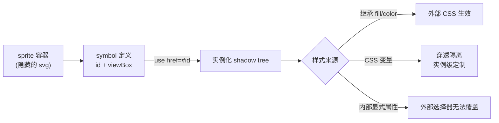

---

> 前置知识：文档骨架与 `<defs>` 的基本概念（《SVG 基础语法与文档结构》，002-SVGBasicSyntaxDocStructure）；CSS 选择器与变量。
>
> 学习目标：分清 defs + url(#)、use 直引、symbol + use 三种复用机制的适用场景；理解 `<use>` 的 shadow DOM 隔离带来哪些样式限制及 CSS 变量如何穿透；能搭建一套 sprite 图标系统。

## 1. 为什么要复用

重复代码会带来体积膨胀、维护困难、不一致风险。SVG 提供三种复用机制：

| 机制                  | 用途                       |
| --------------------- | -------------------------- |
| `<defs>` + `url(#id)` | 复用渐变、滤镜、图案等资源 |
| `<symbol>` + `<use>`  | 复用图形，适合图标系统     |
| `<use>` 直接引用      | 复用任意已存在元素         |

## 2. defs 定义资源

`<defs>` 内的元素不直接渲染，通过 `url(#id)` 引用。

```html
<svg viewBox="0 0 400 200">
  <defs>
    <linearGradient id="brand" x1="0%" x2="100%">
      <stop offset="0%" stop-color="#4f5bd5" />
      <stop offset="100%" stop-color="#00b894" />
    </linearGradient>
    <filter id="shadow">
      <feDropShadow dx="2" dy="2" stdDeviation="2" flood-opacity="0.3" />
    </filter>
  </defs>
  <rect x="20" y="20" width="160" height="80" rx="8" fill="url(#brand)" filter="url(#shadow)" />
  <circle cx="280" cy="60" r="40" fill="url(#brand)" filter="url(#shadow)" />
</svg>
```

## 3. use 引用元素

`<use>` 复制并实例化任意元素（包括 `<g>`、`<symbol>`、单个图形）。

```html
<svg viewBox="0 0 300 100">
  <defs>
    <g id="star">
      <polygon
        points="50,10 60,40 90,40 65,55 75,85 50,65 25,85 35,55 10,40 40,40"
        fill="#f9a825"
      />
    </g>
  </defs>
  <use href="#star" />
  <use href="#star" x="100" />
  <use href="#star" x="200" />
</svg>
```

### 3.1 关键属性

| 属性            | 说明                                          |
| --------------- | --------------------------------------------- |
| `href`          | 引用目标（SVG 2 推荐使用，替代 `xlink:href`） |
| `x, y`          | 实例位置偏移                                  |
| `width, height` | 仅对 `<symbol>` 生效                          |
| `transform`     | 应用变换                                      |

### 3.2 跨文件引用

```html
<svg>
  <use href="icons.svg#icon-home" width="24" height="24" />
</svg>
```

> 跨文件引用存在缓存与跨域限制，且无法被外部 CSS 样式化（shadow DOM 行为）。生产环境常用 inline sprite。

## 4. symbol 符号

`<symbol>` 类似 `<g>`，但自带 `viewBox`，适合定义可缩放的图标模板。

```html
<svg style="display:none">
  <symbol id="icon-home" viewBox="0 0 24 24">
    <path
      d="M3 12 L12 3 L21 12 M5 10 V21 H19 V10"
      fill="none"
      stroke="currentColor"
      stroke-width="2"
      stroke-linecap="round"
      stroke-linejoin="round"
    />
  </symbol>
  <symbol id="icon-user" viewBox="0 0 24 24">
    <circle cx="12" cy="8" r="4" fill="currentColor" />
    <path
      d="M4 20 C4 16 8 14 12 14 C16 14 20 16 20 20"
      fill="none"
      stroke="currentColor"
      stroke-width="2"
    />
  </symbol>
</svg>

<svg width="24" height="24"><use href="#icon-home" /></svg>
<svg width="48" height="48"><use href="#icon-user" /></svg>
```

### 4.1 symbol vs g

| 维度          | `<g>`       | `<symbol>`             |
| ------------- | ----------- | ---------------------- |
| 直接渲染      | 是          | 否                     |
| 自带 viewBox  | 否          | 是                     |
| 配合 use 尺寸 | 仅 x/y 偏移 | 支持 width/height 缩放 |
| 典型场景      | 简单分组    | 图标定义               |

### 4.2 隐藏定义

定义 symbol 的容器 SVG 必须隐藏，避免渲染空白：

```html
<!-- 方法 1：CSS -->
<svg style="display:none">...</svg>

<!-- 方法 2：0 尺寸 + 绝对定位（更稳妥） -->
<svg width="0" height="0" style="position:absolute" aria-hidden="true">...</svg>
```

> 只放 `<symbol>` 时 `display:none` 没有问题；但如果 sprite 里还包含渐变、蒙版、裁剪路径等被 `url()` 引用的资源，个别浏览器（历史上以 Safari 为主）存在"display:none 容器内资源引用失效"的 bug。稳妥做法是统一用方法 2 的 0 尺寸隐藏。

## 5. 构建图标系统

复用机制的整体工作流如下：



### 5.1 Sprite 模式

将所有图标定义为 symbol，集中存放：

```html
<!-- icons.svg -->
<svg xmlns="http://www.w3.org/2000/svg" style="display:none">
  <symbol id="icon-home" viewBox="0 0 24 24">
    <path d="M3 12 L12 3 L21 12" />
    <path d="M5 10 V21 H19 V10" />
  </symbol>
  <symbol id="icon-search" viewBox="0 0 24 24">
    <circle cx="11" cy="11" r="7" />
    <line x1="16" y1="16" x2="21" y2="21" />
  </symbol>
  <!-- 更多图标 -->
</svg>
```

页面内使用：

```html
<svg class="icon"><use href="#icon-home" /></svg>
<svg class="icon"><use href="#icon-search" /></svg>
```

```css
.icon {
  width: 24px;
  height: 24px;
  fill: none;
  stroke: currentColor;
  stroke-width: 2;
}
.icon-lg {
  width: 48px;
  height: 48px;
}
```

### 5.2 主题化

`currentColor` 让图标颜色继承父元素 `color`：

```html
<nav>
  <a href="/" class="nav-link active"
    ><svg class="icon"><use href="#icon-home" /></svg> 首页</a
  >
  <a href="/search" class="nav-link"
    ><svg class="icon"><use href="#icon-search" /></svg> 搜索</a
  >
</nav>
```

```css
.nav-link {
  color: #666;
}
.nav-link:hover {
  color: #4f5bd5;
}
.nav-link.active {
  color: #4f5bd5;
}
```

悬停或激活时图标颜色自动跟随文字颜色变化。

## 6. use 的样式继承

`<use>` 实例化时会生成一棵**封闭的 shadow tree**（影子树）：内容在视觉上完全继承 `<use>` 所在位置的层叠与继承链，但 CSS 选择器无法"钻进去"选中内部节点。所以外部样式对实例的影响只有两条通道——**属性继承**（fill、stroke、color 等可继承属性）与 **CSS 变量**。

```html
<style>
  .icon-primary use {
    fill: #4f5bd5;
  }
</style>

<svg class="icon-primary"><use href="#icon-star" /></svg>
```

| 属性               | 外部 CSS 是否可覆盖            |
| ------------------ | ------------------------------ |
| `fill` / `stroke`  | 是（仅当 symbol 内未显式设置） |
| `color`            | 是（通过 currentColor 联动）   |
| `width` / `height` | 是                             |
| 内部 path 的样式   | 否（shadow DOM 隔离）          |

> **最佳实践**：symbol 内部使用 `currentColor` 而非显式颜色，让外部可完全控制。

## 7. use 的局限性

### 7.1 无法单独修改内部元素

```html
<!-- symbol 定义 -->
<symbol id="card" viewBox="0 0 100 50">
  <rect width="100" height="50" fill="#4f5bd5" />
  <text x="50" y="30" text-anchor="middle" fill="#fff">CARD</text>
</symbol>

<!-- 多个实例 -->
<use href="#card" />
<use href="#card" x="120" />

<!-- 无法让第二个实例的文字变红 -->
```

### 7.2 替代方案：CSS 变量

```html
<symbol id="card" viewBox="0 0 100 50">
  <rect width="100" height="50" fill="var(--card-bg, #4f5bd5)" />
  <text x="50" y="30" text-anchor="middle" fill="var(--card-text, #fff)">CARD</text>
</symbol>

<use href="#card" style="--card-bg: #d63031; --card-text: #fff" />
<use href="#card" style="--card-bg: #00b894; --card-text: #000" />
```

CSS 变量可穿透 shadow DOM，实现实例级定制。

## 8. 复用与动画

```html
<svg viewBox="0 0 300 100">
  <defs>
    <g id="pulse-dot">
      <circle cx="0" cy="0" r="8" fill="#4f5bd5" />
      <circle cx="0" cy="0" r="8" fill="#4f5bd5" opacity="0.5">
        <animate attributeName="r" values="8;20;8" dur="2s" repeatCount="indefinite" />
        <animate attributeName="opacity" values="0.5;0;0.5" dur="2s" repeatCount="indefinite" />
      </circle>
    </g>
  </defs>
  <use href="#pulse-dot" x="50" y="50" />
  <use href="#pulse-dot" x="150" y="50" />
  <use href="#pulse-dot" x="250" y="50" />
</svg>
```

每个 `<use>` 实例都带有独立的动画时间轴。

## 9. use 的 transform

```html
<use href="#star" transform="translate(100, 50) rotate(15) scale(1.5)" />
```

`<use>` 的 `transform` 在实例化时应用，不修改原始定义。

## 10. 实战：状态徽章

```html
<svg style="display:none">
  <symbol id="badge" viewBox="0 0 120 32">
    <rect width="120" height="32" rx="16" fill="var(--bg, #e0e0e0)" />
    <circle cx="16" cy="16" r="4" fill="var(--dot, #999)" />
    <text x="28" y="20" font-size="14" fill="var(--text, #333)" font-family="sans-serif">状态</text>
  </symbol>
</svg>

<svg width="120" height="32">
  <use href="#badge" style="--bg: #e3f2fd; --dot: #4f5bd5; --text: #4f5bd5" />
</svg>
<svg width="120" height="32">
  <use href="#badge" style="--bg: #e8f5e9; --dot: #00b894; --text: #00b894" />
</svg>
<svg width="120" height="32">
  <use href="#badge" style="--bg: #fbe9e7; --dot: #d63031; --text: #d63031" />
</svg>
```

通过 CSS 变量复用同一徽章模板，实现不同状态颜色。

## 11. 性能考量

| 场景                 | 推荐                              |
| -------------------- | --------------------------------- |
| 少量图标（< 20）     | 内联 SVG + symbol                 |
| 大量图标（> 20）     | 外部 sprite 文件 + use 引用       |
| 频繁切换主题         | CSS 变量 + currentColor           |
| 需要单独定制内部元素 | 直接内联，避免 use 的 shadow 限制 |

## 12. 现代替代方案：Web Components

对于需要深度定制的图标系统，可考虑使用 Web Components：

```html
<icon-button name="home" size="24" color="primary"></icon-button>
```

但 SVG sprite + use 仍是性能与兼容性最优的方案，适合大多数场景。

## 小结

初学者要点：

- 三种复用各司其职：`<defs>` 藏资源（渐变/滤镜/图案，用 `url(#id)` 取用）、`<use>` 复制任意元素、`<symbol>` 定义带 viewBox 的可缩放模板，图标系统用第三种。
- `<use>` 的实例生活在一棵封闭 shadow tree 里，外部 CSS 只能通过"继承属性 + CSS 变量"两条通道影响它；想让图标可换色，定义里就写 `currentColor` 或 `var(--x, 默认值)`。
- 隐藏 sprite 容器用 0 尺寸 + 绝对定位比 `display:none` 更稳，尤其是容器里还有渐变、蒙版等被 `url()` 引用的资源时。

进阶注意：

- `<use href="icons.svg#id">` 跨文件引用已被所有现代浏览器支持，但受同源/CORS 约束，且实例内部同样无法被页面 CSS 选择器命中——需要按页面状态换色的图标仍应内联 sprite。
- 每个实例的 SMIL 动画时间轴相互独立（见第 8 节），若需要各实例同步或错峰，CSS 动画（作用于 `<use>` 或其宿主）是更可控的方案。
- `use` 的 `width` / `height` 只对 `<symbol>` 实例有意义；对普通 `<g>`/图形实例，定位用 `x` / `y` 或 `transform`。

