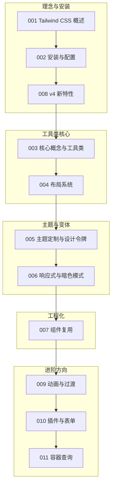

本篇是 tailwind 模块的收官总结。我们继续用"虚拟歌手音乐平台"做贯穿场景：页面要展示歌姬（virtual singer）卡片、P 主（producer）作品列表与演唱会（concert）开票横幅，而歌姬的应援色（theme color）恰好是讲解主题定制与设计令牌的最佳素材。围绕这些场景，把前 11 篇文档的内容重新串一遍：utility-first 理念、工具类家族、布局系统、主题令牌、响应式暗色与组件复用，最后落到 v4 的 CSS-first 新架构。读完请用自检清单核对掌握程度。回顾建议围绕"一条主线、两个工具箱"展开：主线是从设计稿到设计令牌再到工具类拼装；工具箱一是写页面的类名库（003、004），二是管理类名的工程库（005、006、007）。v4 的架构变化（008）则决定了前两者的写法形态，把这条主线走通，类名就不再是记忆负担而是可推理的语法。

## 前置知识

- [Tailwind CSS 概述](/tailwind/001-TailwindOverview)：utility-first 与传统 CSS、Bootstrap 的本质差异，是理解一切工具类设计的前提。
- [Tailwind CSS 核心概念与工具类](/tailwind/003-UtilityCore)：七大工具类族与命名规律是"读类名"的基本功，回顾前先确认能看懂任意一段类名。

## 学习目标

1. 能解释 utility-first 的原子化思想，说清它与传统组件库在协作方式上的差异。
2. 能熟练运用七大工具类族与 Flex/Grid 布局类，脱离自定义 CSS 完成常规页面。
3. 能用 @theme 建立以应援色为素材的设计令牌体系，并实现运行时换肤。
4. 能为组件复用选对方案（组件封装、@apply、cva），并理解 v4 CSS-first 架构带来的变化。

最后提醒一条主线：工具类方案的全部价值都建立在"约束"之上——颜色 constrained 在令牌里、间距 constrained 在刻度里、变体 constrained 在组件里。约束不是限制，而是让全站样式可推理、可统一、可交接。回顾各节时，留意每篇如何把自由度收敛到合适范围，这是比记住任何类名都重要的能力。

## 知识地图



读图按编号推进：001、002、008 是理念与架构块，003、004 是工具类核心块，005、006 是主题与变体块，007 是工程化块，009 到 011 是待补全的进阶块。主线从理念直达工程化；009-011 三篇当前为占位文档，可先按计划要点自行预研，等正文发布后对照补齐。

## 核心概念回顾

### 1. utility-first 理念

Tailwind 不提供成品组件，而是提供成百上千个单一用途的"积木颗粒"：一个工具类只负责一条 CSS 声明，页面样式由颗粒在 HTML 里拼装出来。它解决的是传统 CSS 的两大顽疾——命名困难与样式全局污染（见[Tailwind CSS 概述](/tailwind/001-TailwindOverview)）：

```html
<!-- 歌姬卡片：全部样式由工具类拼装，无需另写 .css 文件 -->
<article class="flex items-center gap-4 rounded-md border-l-4 p-4"
         style="border-left-color: var(--theme-color)">
  
  <div>
    <h2 class="text-lg font-semibold">初音未来</h2>
    <p class="text-sm text-gray-500">应援色 #39c5bb</p>
  </div>
</article>
```

命名规律是"可读性投资"：前缀对应属性、中段对应色相或对象、尾段对应刻度，三者拼起来就是一条 CSS 声明。团队新成员不需要读样式表就能从模板猜出视觉结果，代码评审时"看 HTML 即看设计"成为可能，这也是工具类方案在协作上的核心优势。

### 2. 工具类家族与命名规律

类名遵循"属性前缀 + 值"的两级命名：`bg` 对应 background、`p` 对应 padding、`text` 对应字号与文字颜色；颜色都落在 50-950 的明度刻度上，间距都是 0.25rem 的倍数。规格统一意味着类名可以"读"出来（见[核心概念与工具类](/tailwind/003-UtilityCore)）：

```html
<!-- 拆一个类名练手：演唱会开票横幅 -->
<section class="bg-indigo-600 px-6 py-4 text-white rounded-md">
  <!-- bg-indigo-600：背景色，indigo 色相 + 600 明度刻度 -->
  <!-- px-6 py-4：水平内边距 1.5rem，垂直内边距 1rem（0.25rem 的倍数） -->
  <p class="text-sm tracking-wide">演唱会开票中：歌姬全阵容登场</p>
</section>
```

Flex 与 Grid 的选择口诀是"一维问 Flex、二维问 Grid"：歌姬一览这种整版分格交给 Grid，卡片内部的对齐交给 Flex，gap 统一管间距，子元素不再需要 margin 技巧。布局类名一旦写对，响应式调整通常只是加断点前缀，不需要推翻重排。

### 3. 布局系统：Flex 与 Grid

Flex 擅长一维排布（一行或一列），Grid 擅长二维排布（行列同时控制）。平台首页的"歌姬一览"用 Grid 分格，卡片内部用 Flex 对齐，`gap-*` 统一替代子元素间距（见[布局系统](/tailwind/004-LayoutFlexGrid)）：

```html
<!-- 歌姬一览：Grid 控制整体分格 -->
<section class="grid grid-cols-2 gap-4 md:grid-cols-4">
  <!-- 卡片内部：Flex 纵向排列，内容顶部对齐 -->
  <article class="flex flex-col items-start gap-2 border-l-4 border-teal-500 p-3">
    <h3 class="font-semibold">初音未来</h3>
    <p class="text-xs text-gray-500">P 主作品 39 首</p>
  </article>
  <article class="flex flex-col items-start gap-2 border-l-4 border-pink-500 p-3">
    <h3 class="font-semibold">重音テト</h3>
    <p class="text-xs text-gray-500">P 主作品 31 首</p>
  </article>
</section>
```

设计令牌的收益在换肤时集中兑现：六位歌姬的应援色注册进 @theme 后，bg-miku、text-miku 这类语义类名全站可用，改版只需改一处定义。@theme inline 与 OKLCH 色彩空间进一步解决跨设备色彩一致性问题，令牌体系由此从"颜色变量"升级为完整的设计语言。

### 4. @theme 与设计令牌

设计令牌就是把"颜色、字体、间距"等设计决策起名保存。Tailwind 4 把这份"图纸"从 tailwind.config.js 搬进 CSS：`@theme` 块声明的变量会自动生成对应工具类，歌姬应援色正是最贴切的例子（见[主题定制与设计令牌](/tailwind/005-ThemeCustomization)）：

```css
/* app.css —— 用 @theme 把六位歌姬的应援色注册为品牌令牌 */
@import "tailwindcss";

@theme {
  --color-miku: #39c5bb; /* 自动生成 bg-miku、text-miku 等工具类 */
  --color-teto: #eba9ee;
  --color-luka: #f6b3c0;
}

/* 运行时换肤：只切一个变量，全部引用处随之更新 */
:root[data-singer="teto"] {
  --theme-color: var(--color-teto);
}
```

断点前缀的阅读顺序要养成习惯：从左到右即屏幕由小到大的覆盖关系，移动优先的基准类写在最前。dark: 变体默认跟随系统偏好，需要手动切换时用 @custom-variant 换成 class 策略，再由脚本控制根元素——原理层的媒体查询知识（006 篇）是这一切的根基。

### 5. 响应式与暗色模式

响应式与暗色的本质是媒体查询，Tailwind 把"变形条件"写成类名前缀：`md:grid-cols-2` 表示达到平板宽度变两列，`dark:bg-gray-900` 表示系统暗色时换深色底。移动优先意味着不带前缀的类是基准样式（见[响应式与暗色模式](/tailwind/006-ResponsiveDark)）：

```html
<!-- 演唱会横幅：移动优先 + 暗色变体 -->
<section class="bg-white text-gray-900 dark:bg-gray-900 dark:text-gray-100">
  <div class="flex flex-col gap-2 p-4 md:flex-row md:items-center md:justify-between md:p-6">
    <h2 class="text-xl font-bold md:text-2xl">夏季演唱会 8 月 31 日开票</h2>
    <p class="text-sm opacity-70">白天用亮色，夜里自动切换暗色应援</p>
  </div>
</section>
```

复用方案的选择依据只有两个问题：项目是否组件化、变体是否丰富。组件化且变体多选 cva，纯 HTML 或服务端模板选 @apply，需要跨主题多端复用则押注 CSS 变量。三套方案不互斥，大项目往往同时存在，关键是把决策表贴在团队看得见的地方。

### 6. 组件复用：从工具类到组件

反复出现的工具类组合要沉淀为可复用零件：组件化项目用"组件 + cva"管理变体，纯 HTML 场景用 `@apply` 提取，需要主题切换时用 CSS 变量组合。变体多的按钮用 cva 最省心（见[组件复用](/tailwind/007-ComponentReuse)）：

```typescript
// src/components/badge.ts —— 用 cva 定义应援色徽章的多个变体
import { cva } from "class-variance-authority"

export const badge = cva("inline-block rounded-md px-2 py-1 text-xs", {
  variants: {
    singer: {
      miku: "bg-teal-100 text-teal-800", // 初音蓝徽章
      teto: "bg-pink-100 text-pink-800" // 重音粉徽章
    }
  },
  defaultVariants: { singer: "miku" }
})
```

```html
<!-- 使用处：一行类名切换歌姬主题，tailwind-merge 可解决类冲突 -->
<span class="{badge({ singer: 'teto' })}">重音テト 新曲</span>
```

v4 的自动内容检测扫的是完整类名字符串，这正是"拼接类名失效"的根源。理解了扫描机制，很多灵异问题都能自诊：动态样式要么完整写出候选类名，要么改用 CSS 变量与行内样式组合，二选一都有清晰的操作路径。

### 7. v4 的 CSS-first 架构

v4 是从零重写的换代：构建引擎换成 Rust（Oxide），配置从 JS 文件搬进 CSS 的 @theme 块，内容检测自动化（不再维护 content 数组），并原生支持容器查询与 3D 变换。理解"为什么变"比记住"变成什么"更重要（见[v4 新特性](/tailwind/008-V4Features)）：

```css
/* v4 接入：一行 @import 取代 v3 的三层指令与 config 文件 */
@import "tailwindcss";

@source "../src"; /* 内容检测的补充目录，多数项目无需手写 */
```

架构演进的学习心法是对照着学：把 v3 的 config 文件翻译成 v4 的 @theme 块，把三层 @tailwind 指令翻译成一行 @import，翻译完一遍，差异自然内化，迁移旧项目时也就知道该动哪些文件。

## 易混淆概念对比

初学者最常把 Tailwind 与 Bootstrap 混为一谈，两者代表两种生态位：

| 维度 | Bootstrap（预置组件） | Tailwind（原子化工具类） |
| --- | --- | --- |
| 提供物 | 成品组件与主题 | 单一用途的工具类 |
| 定制方式 | 覆盖组件样式，越改越乱 | 令牌与工具类自由拼装 |
| HTML 体积 | 类名短，样式集中在 CSS | 类名长，产出 CSS 极小 |
| 心智模型 | 挑现成的用 | 攒积木自己搭 |

v3 与 v4 的架构差异则是新老资料冲突的根源，迁移前先对齐：

| 维度 | v3（config 文件时代） | v4（CSS-first 时代） |
| --- | --- | --- |
| 配置载体 | tailwind.config.js | CSS 中的 @theme 块 |
| 内容检测 | 手动维护 content 数组 | 自动检测，可 @source 补充 |
| 构建引擎 | JavaScript（JIT） | Rust 引擎 Oxide |
| 指令入口 | @tailwind base/components/utilities | @import "tailwindcss" |

## 常见误区与排查

以下五条是最高频的样式事故，每条先给错误写法，再给修正代码。

1. 用 JS 拼接类名，扫描器扫不到完整字符串，样式静默失效。类名必须以完整字面量出现在源码中（自动内容检测的前提）：

```typescript
// 错误：拼接出的类名不会被扫描生成
// const cls = "text-" + color + "-600"

// 正确：完整写出所有候选类名，用条件选择
const cls = isMiku ? "text-teal-600" : "text-pink-600"
```

2. 用 `class` 策略做暗色切换，却没重定义 dark 变体，`dark:` 全部不生效（见[响应式与暗色模式](/tailwind/006-ResponsiveDark)）：

```css
/* 错误：只给 html 挂 class，dark: 仍跟随系统媒体查询 */
/* <html class="dark"> */

/* 正确：v4 中用 @custom-variant 把 dark: 改为 class 策略 */
@custom-variant dark (&:where(.dark, .dark *));
```

3. 滥用任意值 `[color:#39c5bb]`，绕开了设计令牌，颜色散落全站无法统一改版：

```html
<!-- 错误：硬编码十六进制，脱离令牌体系 -->
<!-- <p class="text-[#39c5bb]">初音未来</p> -->

<!-- 正确：把应援色注册进 @theme，用语义类名 -->
<p class="text-miku">初音未来</p>
```

4. 合并动态类名时 `p-2` 与 `p-4` 同时存在，优先级取决于书写顺序，样式随机失效。用 tailwind-merge 做合并（见[组件复用](/tailwind/007-ComponentReuse)）：

```typescript
// 错误：直接拼接，两个 padding 类冲突
// const cls = `p-2 ${extra}` // extra = "p-4" 时结果不可预期

// 正确：twMerge 保留后者，去掉冲突的前者
import { twMerge } from "tailwind-merge"
const cls = twMerge("p-2", extra) // extra = "p-4" 得到 "p-4"
```

5. 全部复用都押在 @apply 上，把 Tailwind 又写回了"另起类名"的传统 CSS，失去原子化的直接可见性。复用方案要按项目形态选：

```css
/* 错误：过度 @apply，工具类的优势被完全抵消 */
/* .btn { @apply bg-miku px-4 py-2 rounded-md; } */

/* 正确：组件化项目封装组件，@apply 只留给纯 HTML 模板 */
.btn { @apply px-4 py-2 rounded-md; } /* 仅少量固定组合 */
```

全部自检通过后，做一个综合练习：把歌姬一览页升级为"令牌驱动"——@theme 注册六位应援色、cva 定义卡片变体、dark: 与 md: 双前缀适配、tailwind-merge 合并动态类名，四个知识点一次落地，做完再检查是否还有硬编码的色值残留。

## 自检清单

- [ ] 能向同事解释 utility-first 与预置组件框架（如 Bootstrap）的生态位差异
- [ ] 能拆解任意一个工具类名的前缀、色相与刻度含义
- [ ] 能用 Grid 搭歌姬一览、用 Flex 排卡片内部，并说明两者的适用边界
- [ ] 能用 @theme 注册应援色令牌并实现运行时换肤
- [ ] 能写出移动优先的响应式布局，并用 @custom-variant 接管 dark: 策略
- [ ] 能为徽章组件用 cva 定义变体，并说出 tailwind-merge 解决什么问题
- [ ] 能说出 v4 相对 v3 的四项架构变化及其动机
- [ ] 能对照决策表为一个具体场景选出组件封装、@apply 或 CSS 变量组合方案

自检反复不过的条目，多半是类名没有亲手拼过：回到对应文档把示例敲一遍，再用浏览器检查元素核对生成的 CSS，比反复阅读有效十倍。

## 后续学习路径

1. 夯实布局：重读[布局系统](/tailwind/004-LayoutFlexGrid)，把主轴交叉轴与网格线原理用自己的话讲一遍。
2. 建立设计系统：跟随[主题定制与设计令牌](/tailwind/005-ThemeCustomization)为平台落地完整令牌体系，衔接[响应式与暗色模式](/tailwind/006-ResponsiveDark)完成多形态适配。
3. 工程化复用：精读[组件复用](/tailwind/007-ComponentReuse)，用 cva 重构一个现有组件并对比维护成本。
4. 展望新特性：按[组件复用](/tailwind/007-ComponentReuse)、[v4 新特性](/tailwind/008-V4Features)的顺序收束主线，并跟进[动画与过渡](/tailwind/009-TailwindAnimationTransition)、[插件与表单](/tailwind/010-TailwindPluginsForms)、[容器查询](/tailwind/011-TailwindContainerQueries)的后续更新。
