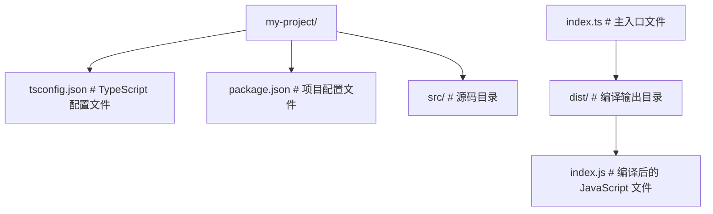
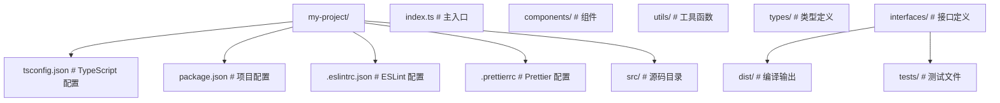

## 前置知识

- [本课程使用指南（先读这里）](/typescript/002-HowToReadThisCourse)：建议先完成前一篇的学习

## 学习目标

- 掌握「1. TypeScript 概述 (Overview)」的核心机制、典型用法与常见陷阱
- 掌握「2. 环境配置 (Environment Setup)」的核心机制、典型用法与常见陷阱
- 掌握「3. tsconfig.json 核心配置」的核心机制、典型用法与常见陷阱
- 掌握「4. 工具链与生态系统」的核心机制、典型用法与常见陷阱
- 掌握「5. 最佳实践」的核心机制、典型用法与常见陷阱

## 1. TypeScript 概述 (Overview)

TypeScript 是 JavaScript 的一个**超集**，由微软开发，于 2012 年首次发布。它在 JavaScript 的基础上增加了**静态类型系统**和其他高级特性，最终通过编译器转换为纯 JavaScript 代码运行。TypeScript 的设计目标是帮助开发者构建大型、复杂的应用程序，提供更好的开发体验和代码质量。

### 1.1 核心价值 (Core Value)

| 价值                | 描述                                             | 优势                               |
| :------------------ | :----------------------------------------------- | :--------------------------------- |
| **类型安全**        | 在开发阶段发现潜在错误 (如拼写错误、类型不匹配)  | 减少运行时错误，提高代码可靠性     |
| **更好的 IDE 支持** | 自动补全、重构更精准，提供更好的代码导航         | 提高开发效率，减少编码错误         |
| **增强可读性**      | 类型注解使代码更加自文档化                       | 便于团队协作和代码维护             |
| **支持最新语法**    | 提前使用尚未在所有浏览器实现的 ECMAScript 新特性 | 保持代码现代化，无需等待浏览器支持 |
| **渐进式 adoption** | 可以与 JavaScript 代码无缝集成                   | 便于现有项目逐步迁移到 TypeScript  |
| **大型项目支持**    | 提供模块化、命名空间等特性                       | 适合构建和维护大型应用程序         |

### 1.2 TypeScript 与 JavaScript 的关系

TypeScript 是 JavaScript 的超集，这意味着：

- **所有 JavaScript 代码都是有效的 TypeScript 代码**
- TypeScript 增加了额外的特性，如类型注解、接口、泛型等
- TypeScript 代码最终会被编译为 JavaScript 代码运行
- TypeScript 可以与 JavaScript 代码和库无缝集成

### 1.4 应用场景

TypeScript 适用于以下场景：

- **大型应用程序**：需要类型安全和更好的代码组织
- **团队开发**：需要清晰的代码结构和类型约束
- **前端框架**：React、Vue、Angular 等框架的类型定义
- **Node.js 后端**：提供类型安全的服务器端代码
- **库和工具**：提供类型定义，改善开发者体验

## 2. 环境配置 (Environment Setup)

### 2.1 安装 TypeScript

#### 2.1.1 全局安装

```bash
 # 全局安装 TypeScript 编译器
 npm install -g typescript
 # 验证安装
 tsc --version
```

**讲解：**

1. `npm install -g` 把 TypeScript 安装到全局，之后任何目录都能直接用 `tsc` 命令。
2. `tsc --version` 验证安装是否成功，并显示当前版本号。
3. 全局安装适合学习阶段；真实项目应使用下面的"本地安装"，保证团队版本一致。

#### 2.1.2 项目本地安装

```bash
 # 在项目中本地安装 TypeScript
 npm install --save-dev typescript
 # 验证安装
 npx tsc --version
```

**讲解：**

1. `--save-dev` 表示 TypeScript 是开发依赖：只在开发与构建时使用，不会进入生产代码。
2. 本地安装后不能直接敲 `tsc`，要写 `npx tsc`——`npx` 会优先使用项目里的 `node_modules/.bin/tsc`。
3. 团队项目必须用本地安装：每个人执行 `npm install` 后得到完全相同的编译器版本。

### 2.2 初始化 TypeScript 项目

#### 2.2.1 生成 tsconfig.json

```bash
 # 生成默认的 tsconfig.json 文件
 tsc --init
 # 或使用 npm init 初始化项目后添加 TypeScript
 npm init -y
 npm install --save-dev typescript
 npx tsc --init
```

**讲解：**

1. `tsc --init` 生成带注释的 `tsconfig.json`，里面包含 TypeScript 全部配置项的说明。
2. 第二组命令是标准三步：`npm init -y` 生成 `package.json`，安装 TypeScript，再初始化编译配置。
3. `tsconfig.json` 是项目的"编译说明书"，后面的 3.x 小节会逐项解释。

#### 2.2.2 基本项目结构



**结构解析：**

1. 图中只有两条路径需要记住：源码在 `src/`，编译产物在 `dist/`。
2. `tsconfig.json` 决定"从 src 编译到 dist"，`package.json` 记录依赖与脚本。
3. `index.ts` 是入口文件，编译后变成同名的 `index.js`，交给 Node.js 或浏览器运行。

### 2.3 编译与运行

#### 2.3.1 基本编译

```bash
 # 编译单个文件
 tsc src/index.ts
 # 编译整个项目 (使用 tsconfig.json)
 tsc
 # 监视模式编译 (文件变化时自动重新编译)
 tsc --watch
```

**讲解：**

1. `tsc src/index.ts` 只编译指定文件；`tsc`（不带参数）按 `tsconfig.json` 编译整个项目。
2. `--watch` 是"监听模式"：保存文件后自动重新编译，开发时一直开着即可。
3. 初学者最常用的组合是：一个终端跑 `tsc --watch`，编辑器里直接看类型报错。

#### 2.3.2 使用 ts-node 直接运行

```bash
 # 安装 ts-node
 npm install --save-dev ts-node
 # 直接运行 TypeScript 文件
 npx ts-node src/index.ts
 # 监视模式运行
 npx ts-node --watch src/index.ts
```

**讲解：**

1. `ts-node` 在内存里把 TypeScript 编译后直接执行，省去"先编译再看 js"的步骤。
2. `npx ts-node src/index.ts` 与 `node dist/index.js` 效果相同，但能更快进入调试。
3. 注意：ts-node 只适合开发；生产环境一般用 `tsc` 编译出 JS 后再运行。

#### 2.3.3 使用构建工具

#### Webpack

```bash
 # 安装依赖
 npm install --save-dev webpack webpack-cli ts-loader
 # webpack.config.js
 module.exports = {
  entry: './src/index.ts',
  module: {
  rules: [
  {
  test: /\.tsx?$/,
  use: 'ts-loader',
  exclude: /node_modules/
  }
  ]
  },
  resolve: {
  extensions: ['.tsx', '.ts', '.js']
  },
  output: {
  filename: 'bundle.js',
  path: path.resolve(__dirname, 'dist')
  }
 }
```

**讲解：**

1. 这是 Webpack 的最小 TS 配置：`entry` 是入口文件，`output` 是打包结果。
2. `module.rules` 里的 `ts-loader` 负责把 `.tsx?` 文件编译成 JS，`exclude: /node_modules/` 跳过第三方库。
3. `resolve.extensions` 让 import 时可以省略 `.ts/.tsx/.js` 后缀。
4. 新项目更推荐 Vite（下一段），Webpack 主要用于维护存量项目。

#### Vite

```bash
 # 创建 Vite + TypeScript 项目
 npm create vite@latest my-project -- --template react-ts
 # 或使用 Vue + TypeScript
 npm create vite@latest my-project -- --template vue-ts
```

**讲解：**

1. `npm create vite@latest` 是官方脚手架：`--template react-ts` 生成 React+TS 模板，`vue-ts` 生成 Vue+TS 模板。
2. 创建后进入目录执行 `npm install && npm run dev` 即可启动。
3. Vue 项目也可用官方 `create-vue`，在交互提示中勾选 TypeScript 支持。

创建 Vue + TypeScript 项目更推荐官方脚手架 create-vue：`npm create vue@latest`，在交互提示中选择 TypeScript。

## 3. `tsconfig.json` 核心配置

`tsconfig.json` 是 TypeScript 项目的配置文件，用于指定编译选项和项目设置。

### 3.1 基本配置示例

```json
 {
  "compilerOptions": {
  "target": "ES2022",
  "module": "esnext",
  "moduleResolution": "bundler",
  "lib": ["ES2020", "DOM"],
  "strict": true,
  "esModuleInterop": true,
  "skipLibCheck": true,
  "forceConsistentCasingInFileNames": true,
  "outDir": "./dist",
  "rootDir": "./src",
  "sourceMap": true,
  "declaration": true,
  "declarationMap": true,
  "removeComments": false,
  "noEmitOnError": true
  },
  "include": ["src/**/*"],
  "exclude": ["node_modules", "dist"]
 }
```

**讲解：**

1. `target` 决定编译成哪个版本的 JavaScript（ES2022 已是很现代的目标）；`module` 决定模块语法（esnext 适合浏览器/打包器）。
2. `strict: true` 打开全部严格检查，是 TypeScript 类型安全的核心开关，新项目必须开启。
3. `outDir` 与 `rootDir` 控制"从 src 进、到 dist 出"的目录结构。
4. `include` 声明参与编译的文件范围，`exclude` 排除 `node_modules` 与产物目录。
5. `declaration` 在库开发时生成 `.d.ts` 类型声明文件，应用项目一般不需要。

### 3.2 核心配置选项

| 选项                                 | 描述                      | 默认值                         | 推荐值                                |
| :----------------------------------- | :------------------------ | :----------------------------- | :------------------------------------ |
| **target**                           | 编译后的 JavaScript 版本  | ES3                            | ES2020 或更高                         |
| **module**                           | 模块化规范                | commonjs                       | commonjs (Node.js) 或 esnext (浏览器) |
| **moduleResolution**                 | 模块解析策略              | node                           | node                                  |
| **lib**                              | 包含的库文件              | 取决于 target                  | ["ES2020", "DOM"]                     |
| **strict**                           | 开启所有严格类型检查      | false                          |                                       |
| **esModuleInterop**                  | 启用 ES 模块互操作性      | false                          |                                       |
| **skipLibCheck**                     | 跳过库文件的类型检查      | false                          |                                       |
| **forceConsistentCasingInFileNames** | 强制文件名大小写一致      | false                          |                                       |
| **outDir**                           | 编译输出目录              | 与源文件同目录                 | "./dist"                              |
| **rootDir**                          | 源码根目录                | 包含所有输入文件的最长公共路径 | "./src"                               |
| **sourceMap**                        | 生成 source map 文件      | false                          | (开发环境)                            |
| **declaration**                      | 生成 .d.ts 类型声明文件   | false                          | (库开发)                              |
| **declarationMap**                   | 为声明文件生成 source map | false                          | (库开发)                              |
| **removeComments**                   | 移除注释                  | false                          | false (保留注释)                      |
| **noEmitOnError**                    | 有错误时不生成输出        | false                          |                                       |

### 3.3 严格模式选项

| 选项                             | 描述                             | 启用条件          |
| :------------------------------- | :------------------------------- | :---------------- |
| **strictNullChecks**             | 严格的 null 和 undefined 检查    | strict:           |
| **strictFunctionTypes**          | 严格的函数类型检查               | strict:           |
| **strictBindCallApply**          | 严格的 bind, call, apply 检查    | strict:           |
| **strictPropertyInitialization** | 严格的属性初始化检查             | strict:           |
| **noImplicitAny**                | 禁止隐式 any 类型                | strict:           |
| **noImplicitThis**               | 禁止隐式 this                    | strict:           |
| **useUnknownInCatchVariables**   | 在 catch 变量中使用 unknown 类型 | strict: (TS 4.0+) |

### 3.4 高级配置选项

| 选项                       | 描述                       | 用途                           |
| :------------------------- | :------------------------- | :----------------------------- |
| **baseUrl**                | 模块解析的基础目录         | 简化模块导入路径               |
| **paths**                  | 模块路径映射               | 自定义模块解析路径             |
| **allowJs**                | 允许编译 JavaScript 文件   | 混合 TypeScript 和 JavaScript  |
| **checkJs**                | 检查 JavaScript 文件的类型 | 对 JavaScript 文件进行类型检查 |
| **jsx**                    | JSX 处理模式               | React 或其他 JSX 框架          |
| **experimentalDecorators** | 启用装饰器                 | 使用装饰器特性                 |
| **emitDecoratorMetadata**  | 生成装饰器元数据           | 配合装饰器使用                 |
| **resolveJsonModule**      | 允许导入 JSON 文件         | 直接导入 JSON 数据             |
| **isolatedModules**        | 每个文件作为独立模块编译   | 与 Babel 等工具配合            |

### 3.5 配置示例

#### 3.5.1 浏览器项目配置

```json
{
  "compilerOptions": {
    "target": "ES2022",
    "module": "esnext",
    "moduleResolution": "bundler",
    "lib": ["ES2020", "DOM", "DOM.Iterable"],
    "strict": true,
    "esModuleInterop": true,
    "skipLibCheck": true,
    "forceConsistentCasingInFileNames": true,
    "outDir": "./dist",
    "rootDir": "./src",
    "sourceMap": true,
    "jsx": "react-jsx"
  },
  "include": ["src/**/*"],
  "exclude": ["node_modules", "dist"]
}
```

**讲解：**

1. 浏览器项目与基础配置的差异集中在三处：`moduleResolution: "bundler"`、`lib` 增加 `DOM` 与 `DOM.Iterable`、`jsx: "react-jsx"`。
2. `lib` 是"环境说明书"：声明代码里可用的全局对象，DOM 类型来自浏览器环境。
3. `jsx: "react-jsx"` 使用 React 17+ 的自动 JSX 转换，不需要手动 `import React`。

#### 3.5.2 Node.js 项目配置

```json
 {
  "compilerOptions": {
  "target": "ES2022",
  "module": "nodenext",
  "moduleResolution": "nodenext",
  "lib": ["ES2020"],
  "strict": true,
  "esModuleInterop": true,
  "skipLibCheck": true,
  "forceConsistentCasingInFileNames": true,
  "outDir": "./dist",
  "rootDir": "./src",
  "sourceMap": true,
  "declaration": true
  },
  "include": ["src/**/*"],
  "exclude": ["node_modules", "dist"]
 }
```

**讲解：**

1. Node.js 项目把 `module` 与 `moduleResolution` 都设为 `nodenext`，与 Node 的 ESM/CJS 规则对齐。
2. `lib` 不包含 DOM，因为 Node 环境没有浏览器对象；需要安装 `@types/node` 提供 `process`、`fs` 等类型。
3. `sourceMap: true` 生成源码映射，运行报错时能定位回 `.ts` 原始行号。

## 4. 工具链与生态系统

### 4.1 开发工具

| 工具              | 描述                     | 用途                 |
| :---------------- | :----------------------- | :------------------- |
| **tsc**           | TypeScript 编译器        | 编译 TypeScript 代码 |
| **ts-node**       | 直接运行 TypeScript 文件 | 开发和调试           |
| **tslint/eslint** | TypeScript 代码检查工具  | 代码质量检查         |
| **prettier**      | 代码格式化工具           | 保持代码风格一致     |
| **jest**          | 测试框架                 | 单元测试             |
| **webpack**       | 模块打包工具             | 前端项目构建         |
| **vite**          | 现代前端构建工具         | 快速开发和构建       |
| **rollup**        | 模块打包工具             | 库构建               |

### 4.2 类型定义

| 类型定义                | 描述                   | 安装方式                                                                            |
| :---------------------- | :--------------------- | :---------------------------------------------------------------------------------- |
| **@types/node**         | Node.js 类型定义       | `npm install --save-dev @types/node`                                                |
| **@types/react**        | React 类型定义         | `npm install --save-dev @types/react`                                               |
| **@types/react-dom**    | React DOM 类型定义     | `npm install --save-dev @types/react-dom`                                           |
| **@types/jest**         | Jest 类型定义          | `npm install --save-dev @types/jest`                                                |
| \*_@typescript-eslint/_ | ESLint TypeScript 插件 | `npm install --save-dev @typescript-eslint/eslint-plugin @typescript-eslint/parser` |

### 4.3 IDE 支持

推荐的 IDE 和编辑器：
| IDE/编辑器 | 特点 | 推荐插件 |
| :--- | :--- | :--- |
| **Visual Studio Code** | 官方推荐，内置 TypeScript 支持 | TypeScript Hero, ESLint, Prettier |
| **WebStorm** | 强大的 IDE，内置 TypeScript 支持 | ESLint, Prettier |
| **Sublime Text** | 轻量级编辑器 | TypeScript, SublimeLinter |
| **Atom** | 开源编辑器 | atom-typescript |

## 5. 最佳实践

### 5.1 项目结构



**结构解析：**

1. 源码目录按"组件/工具/类型/接口"分包，是中型项目的常见组织方式。
2. `types/` 与 `interfaces/` 集中放类型定义，避免类型散落在业务文件里。
3. `tests/` 与源码分开，便于测试工具按目录扫描。

### 5.2 类型定义最佳实践

- **使用接口定义对象结构**：清晰描述对象的形状
- **使用类型别名**：为复杂类型创建有意义的名称
- **避免使用 any 类型**：尽量使用具体类型或联合类型
- **使用泛型**：提高代码复用性和类型安全性
- **使用枚举**：为一组相关常量提供有意义的名称
- **使用命名空间**：组织相关类型和功能

### 5.3 代码风格

- **使用 PascalCase**：命名类、接口、类型别名
- **使用 camelCase**：命名函数、变量、属性
- **使用 UPPER_SNAKE_CASE**：命名常量
- **使用下划线前缀**：命名私有成员
- **使用 JSDoc 注释**：为类型和函数添加文档

### 5.4 性能优化

- **使用类型断言**：在确知类型时使用，避免不必要的类型检查
- **使用 const 断言**：为字面量类型提供更精确的类型
- **使用类型守卫**：在运行时检查类型
- **避免过度泛型**：只在必要时使用泛型
- **使用模块导入**：避免全局命名空间污染

## 6. 实际应用示例

### 6.1 基本 TypeScript 示例

```typescript
 // src/index.ts
 // 类型定义
 interface User {
  id: number;
  name: string;
  email: string;
  age?: number; // 可选属性
 }
 // 函数定义
 function greet(user: User): string {
  return `Hello, ${user.name}!`;
 }
 // 类定义
 class UserService {
  private users: User[] = [];
  addUser(user: User): void {
  this.users.push(user);
  }
  getUserById(id: number): User | undefined {
  return this.users.find(user => user.id === id);
  }
  getAllUsers(): User[] {
  return this.users;
  }
 }
 // 使用示例
 const userService = new UserService();
 userService.addUser({
  id: 1,
  name: "John Doe",
  email: "john@example.com",
  age: 30
 });
 userService.addUser({
  id: 2,
  name: "Jane Smith",
  email: "jane@example.com"
 });
 const user = userService.getUserById(1);
 if (user) {
  console.log(greet(user));
 }
 console.log(userService.getAllUsers());
```

**讲解：**

1. `interface User` 定义对象形状：`age?: number` 表示 age 可省略，这就是"可选属性"。
2. `function greet(user: User): string` 标注参数类型与返回值类型，传错结构会在编译期报错。
3. `class UserService` 中 `private users: User[]` 是私有数组字段；`User | undefined` 表示"可能找不到"。
4. `find` 可能返回 `undefined`，所以用 `if (user)` 判断后再调用——`strictNullChecks` 强制处理这个分支。
5. 最后 `console.log(greet(user))` 输出带模板字符串的问候语，`getAllUsers()` 打印完整列表。

### 6.2 编译与运行

```bash
 # 编译
 tsc
 # 运行
 node dist/index.js
 # 或直接运行
 npx ts-node src/index.ts
```

**讲解：**

1. `tsc` 先按配置把 `src/` 编译到 `dist/`，再 `node dist/index.js` 运行编译结果。
2. 开发调试用 `npx ts-node src/index.ts` 更省事，一条命令完成"编译+运行"。
3. 生产部署应使用 `tsc` 的编译产物，运行环境不需要安装 TypeScript。

### 6.3 与 JavaScript 集成

```typescript
// src/index.ts
// 导入 JavaScript 模块
import { calculateTotal } from './utils.js';
// 类型定义
interface Order {
  id: number;
  items: {
    name: string;
    price: number;
    quantity: number;
  }[];
}
// 使用 JavaScript 函数
const order: Order = {
  id: 1,
  items: [
    { name: 'Item 1', price: 10, quantity: 2 },
    { name: 'Item 2', price: 15, quantity: 1 },
  ],
};
const total = calculateTotal(order.items);
console.log(`Order total: $${total}`);
// ---------- 下面是普通 JavaScript 文件 utils.js ----------
// src/utils.js
// JavaScript 函数
export function calculateTotal(items) {
  return items.reduce((total, item) => {
    return total + item.price * item.quantity;
  }, 0);
}
```

**讲解：**

1. 前半段是 TypeScript 调用 JavaScript：`import { calculateTotal } from './utils.js'` 导入 JS 模块，并给订单数据标注 `Order` 类型。
2. `items` 的类型是"对象数组"：`{ name: string; price: number; quantity: number }[]`，数组里每个元素结构一致。
3. 后半段 `utils.js` 是普通 JS：`reduce` 累加 `price * quantity`。TypeScript 项目可以逐步把 JS 文件改成 TS，不用一次性重写。
4. 这是"渐进式迁移"的样板：JS 函数保持不动，调用方先获得类型。

## 7. 常见问题与解决方案

### 7.1 编译错误

| 错误                                        | 原因           | 解决方案                                 |
| :------------------------------------------ | :------------- | :--------------------------------------- |
| **Type 'X' is not assignable to type 'Y'**  | 类型不匹配     | 检查变量类型，确保类型一致               |
| **Property 'X' does not exist on type 'Y'** | 属性不存在     | 检查对象结构，确保属性存在或使用可选属性 |
| **Cannot find name 'X'**                    | 变量未定义     | 检查变量是否已声明，或添加类型定义       |
| **Module 'X' has no exported member 'Y'**   | 模块导出不存在 | 检查模块导出，确保导出名称正确           |
| **Cannot find module 'X'**                  | 模块未找到     | 检查模块路径，确保模块已安装             |

### 7.2 类型定义问题

| 问题             | 原因                 | 解决方案                            |
| :--------------- | :------------------- | :---------------------------------- |
| **缺少类型定义** | 第三方库没有类型定义 | 安装 @types/ 包或创建自定义类型定义 |
| **类型冲突**     | 多个类型定义冲突     | 检查类型定义文件，解决冲突          |
| **类型过于严格** | 类型定义过于严格     | 使用类型断言或调整类型定义          |
| **类型不完整**   | 类型定义不完整       | 扩展类型定义或使用接口继承          |

### 7.3 性能问题

| 问题           | 原因               | 解决方案                                 |
| :------------- | :----------------- | :--------------------------------------- |
| **编译速度慢** | 项目过大或配置不当 | 优化 tsconfig.json，使用增量编译         |
| **类型检查慢** | 复杂类型或循环依赖 | 简化类型定义，避免循环依赖               |
| **运行时性能** | 编译输出效率低     | 优化 TypeScript 代码，使用适当的编译选项 |

### 7.4 工具链问题

| 问题                 | 原因     | 解决方案                              |
| :------------------- | :------- | :------------------------------------ |
| **与 Babel 集成**    | 配置冲突 | 使用 @babel/preset-typescript         |
| **与 Webpack 集成**  | 配置不当 | 正确配置 ts-loader 或 babel-loader    |
| **与 ESLint 集成**   | 规则冲突 | 使用 @typescript-eslint/eslint-plugin |
| **与 Prettier 集成** | 格式冲突 | 配置 Prettier 与 ESLint 配合          |

### 8.2 书籍

- **《TypeScript 实战》** - 梁宵
- **《深入理解 TypeScript》** - Basarat Ali Syed
- **《TypeScript 编程》** - Boris Cherny
- **《TypeScript 权威指南》** - 张容铭

### 8.3 在线教程

- **TypeScript 官方教程**: [https://www.typescriptlang.org/docs/handbook/typescript-from-scratch.html](https://www.typescriptlang.org/docs/handbook/typescript-from-scratch.html)
- **MDN TypeScript 教程**: [https://developer.mozilla.org/en-US/docs/Web/JavaScript/TypeScript](https://developer.mozilla.org/en-US/docs/Web/JavaScript/TypeScript)
- **TypeScript Deep Dive**: [https://basarat.gitbook.io/typescript/](https://basarat.gitbook.io/typescript/)
- **freeCodeCamp TypeScript 教程**: [https://www.freecodecamp.org/learn/typescript/](https://www.freecodecamp.org/learn/typescript/)

### 8.4 社区与论坛

- **TypeScript 社区**: [https://github.com/microsoft/TypeScript/discussions](https://github.com/microsoft/TypeScript/discussions)
- **Stack Overflow TypeScript**: [https://stackoverflow.com/questions/tagged/typescript](https://stackoverflow.com/questions/tagged/typescript)
- **Reddit r/typescript**: [https://www.reddit.com/r/typescript/](https://www.reddit.com/r/typescript/)
- **TypeScript 中文社区**: [https://www.typescriptlang.cn/](https://www.typescriptlang.cn/)

## 9. 总结

TypeScript 是一种强大的编程语言，它通过添加静态类型系统和其他高级特性，使 JavaScript 开发更加安全、高效和可维护。通过正确配置环境、使用最佳实践和利用丰富的工具链，开发者可以充分发挥 TypeScript 的优势，构建高质量的应用程序。

### 9.1 关键要点

- **类型安全**: TypeScript 的核心价值在于提供静态类型检查，减少运行时错误
- **渐进式 adoption**: 可以与 JavaScript 无缝集成，便于现有项目逐步迁移
- **强大的工具链**: 丰富的工具和 IDE 支持，提高开发效率
- **现代语言特性**: 支持最新的 ECMAScript 特性，保持代码现代化
- **大型项目支持**: 适合构建和维护大型应用程序

### 9.2 学习建议

- **从基础开始**: 学习 TypeScript 的基本类型和语法
- **实践项目**: 通过实际项目练习 TypeScript
- **阅读文档**: 参考官方文档和最佳实践
- **参与社区**: 加入 TypeScript 社区，学习和分享经验
- **持续学习**: 关注 TypeScript 的更新和新特性
  TypeScript 已经成为现代前端和 Node.js 开发的重要工具，掌握 TypeScript 可以帮助开发者构建更加可靠、可维护的应用程序，提高开发效率和代码质量。

## 5.0 const 类型参数

> 进阶预览（第一遍可跳过）：从这里到文件末尾是 TS 5.x 以来的新特性速览，包括 const 类型参数、satisfies、using、NoInfer、类型谓词推断等。它们解决的是"类型更精确"的进阶问题，零基础第一遍读到上面的"9. 总结"即可，等做过小项目、写过真实类型后再回来读，会更容易理解。这些章节编号（5.0/5.2/5.3……）是历史追加形成的，与前面的正文章节号不连续，不影响阅读顺序。

**基本写法：const 泛型参数**
`function <名><const T extends <约束>>(<参数>: T)`
```typescript
// 推断字面量类型而非放宽
function pickFirst<const T>(arr: readonly T[]): T {
  return arr[0];
}
const r = pickFirst(["red", "green"]); // "red" | "green"
```

**讲解：**

1. `<const T>` 告诉编译器"不要放宽推断"：`["red", "green"]` 被推断为字面量联合 `"red" | "green"` 而不是 `string`。
2. `readonly T[]` 表示只读数组参数，函数内不能修改元素。
3. 返回值 `T` 保留调用时的精确类型，是"配置对象、路由表"等场景的常用技巧。

---

**基本写法：const 配合元组**
`<const T extends readonly string[]>`
```typescript
// 保留元组字面量
function define<const T extends readonly string[]>(routes: T): T {
  return routes;
}
const c = define(["/home", "/about"]); // readonly ["/home", "/about"]
```

**讲解：**

1. `<const T extends readonly string[]>` 约束 T 必须是字符串数组，且保留"元组"形态。
2. 推断结果是 `readonly ["/home", "/about"]`：长度与每个位置的字符串都精确固定。
3. 之后遍历 `c` 时，每个元素都是具体的字面量类型，拼路由时不会丢失类型信息。

---

## 5.0 satisfies 操作符

**基本写法：satisfies 校验不放宽**
`const <变量> = <值> satisfies <类型>`
```typescript
// 校验符合类型，保留具体字面量推断
const palette = {
  red: "#f00",
  green: [0, 255, 0],
} satisfies Record<string, string | number[]>;
palette.red;   // string（具体）
palette.green; // number[]
```

**讲解：**

1. `satisfies` 的作用是"校验但不改变推断"：对象必须符合 `Record<string, string | number[]>`，同时每个属性保留自己的具体类型。
2. `palette.red` 的类型是字面量 `"#f00"`（而不是 string），`palette.green` 是 `number[]`。
3. 对比直接标注 `: Record<...>`，satisfies 让使用方获得更精确的类型提示。

---

**基本写法：satisfies 与 as 区别**
`<值> satisfies <类型>`
```typescript
// as 断言可能撒谎，satisfies 强制校验
const m = { a: 1 } satisfies Record<"a", number>;
// const m = { a: 1 } satisfies Record<"a", string>; // 报错
```

**讲解：**

1. `as` 断言是"我保证它是对的"，类型不匹配时编译器可能放过，运行期才暴露问题。
2. `satisfies` 是"请检查我"：不符合类型就立刻报错，绝不撒谎。
3. 规则：能写 satisfies 就别写 as；as 只用于编译器确实无法推断的场景。

---

## 5.0 新版装饰器

**基本写法：标准装饰器**
`@<装饰器> <类成员>`
```typescript
// 符合 TC39 Stage 3，无需 experimentalDecorators
function log(target: Function, ctx: ClassMethodDecoratorContext) {
  return function (this: unknown, ...args: unknown[]) {
    console.log(ctx.name, args);
    return target.apply(this, args);
  };
}
class S { @log greet() { return "hi"; } }
```

**讲解：**

1. 这是标准装饰器（TC39 Stage 3 语义），不需要开启 `experimentalDecorators`。
2. 装饰器函数接收 `target`（被装饰的方法）与 `ctx`（上下文，含方法名），返回包装函数。
3. `@log greet()` 表示给 `greet` 方法套上日志：每次调用先打印方法名与参数，再执行原方法。
4. `return target.apply(this, args)` 保持 `this` 与参数原样传递，这是装饰器的标准收尾。

---

## 5.2 using 声明

**基本写法：同步资源管理**
`using <变量> = <带 Symbol.dispose>`
```typescript
// 离开作用域自动释放
function read() {
  using f = openFile("./a.txt");
  // 作用域结束调用 [Symbol.dispose]
}
```

**讲解：**

1. `using` 是"同步资源管理"语法：变量离开作用域时自动调用其 `[Symbol.dispose]` 方法。
2. 示例里 `openFile` 返回带释放逻辑的对象，函数结束时文件自动关闭，无需手写 try/finally。
3. 对应提案已进入主流运行时，TS 5.2+ 提供类型支持。

---

**基本写法：异步资源管理**
`await using <变量> = <带 Symbol.asyncDispose>`
```typescript
// 异步自动清理
async function run() {
  await using conn = await db.connect();
  // 自动 await [Symbol.asyncDispose]
}
```

**讲解：**

1. `await using` 是异步版本：离开作用域时自动 `await` 资源的 `[Symbol.asyncDispose]` 方法。
2. `await using conn = await db.connect()`：右侧先连接数据库，`conn` 在作用域结束时自动断开。
3. 适合数据库连接、流、锁等"用完必须清理"的资源。

---

## 5.3 switch(true) 收窄

**基本写法：switch(true) 类型收窄**
`switch (true) { case <条件>: ... }`
```typescript
// 每个 case 体内自动收窄
function desc(v: unknown) {
  switch (true) {
    case typeof v === "string": return v.toUpperCase();
    case typeof v === "number": return v.toFixed(2);
    default: return "unknown";
  }
}
```

**讲解：**

1. `switch (true)` 不是比较某个变量，而是让每个 `case` 写"布尔条件"，从上到下找第一个为真的分支。
2. 每个 case 体内变量 `v` 自动收窄：`typeof v === "string"` 成立后，`v.toUpperCase()` 合法。
3. 相比 if/else 链，这种写法让"多个互斥条件"的结构更整齐。

---

## 5.4 NoInfer 工具类型

**基本写法：阻止推断**
`NoInfer<<T>>`
```typescript
// 不从该位置推断 T，仅校验
function withDefault<T>(v: T | undefined, fb: NoInfer<T>): T {
  return v ?? fb;
}
const r = withDefault("hi", "x"); // T = string
// withDefault("hi", 42); // 报错：number 不能赋给 string
```

**讲解：**

1. `NoInfer<T>` 是 TS 5.4 新增工具类型：声明"不要从我这个位置推断 T"。
2. 示例里 T 只由第一个参数 `v` 推断为 `string`，第二个参数 `fb` 仅做校验。
3. 若没有 NoInfer，`withDefault("hi", 42)` 可能把 T 推断成 `string | number`，错误被放过。

---

## 5.4 闭包保留收窄

**基本写法：闭包内保留 narrowing**
`const <fn> = () => <使用收窄变量>`
```typescript
// 5.4 修复闭包内类型丢失
function fn(v: string | null) {
  if (v === null) return;
  const cb = () => v.toUpperCase(); // v 已收窄为 string
  return cb();
}
```

**讲解：**

1. TS 5.4 之前，闭包内捕获的变量可能丢失收窄信息（v 被当成 string | null）。
2. 5.4 起，`if (v === null) return;` 之后的闭包 `() => v.toUpperCase()` 能确认 `v` 是 string。
3. 这个修复让"先判断、再在回调里使用"的安全模式真正生效。

---

## 5.5 推断类型谓词

**基本写法：自动推断 is**
`function <f>(<x>): <TypePredicate>`
```typescript
// 返回布尔值自动推断为类型谓词
const isString = (x: unknown) => typeof x === "string";
const arr = [1, "a"].filter(isString); // string[]
```

**讲解：**

1. `(x: unknown) => typeof x === "string"` 返回布尔值，TS 5.5 起自动识别为类型谓词 `x is string`。
2. `filter` 使用该谓词后，结果数组类型从 `(string | number)[]` 收窄为 `string[]`。
3. 以前必须手写 `: x is string` 标注，现在编译器能自己推断。

---

## 5.6 离散联合与迭代器

**基本写法：离散联合类型**
`type <名> = { ... } | { ... }`
```typescript
// 成员间无公共字段时更严格检查
type A = { kind: "a"; x: number };
type B = { kind: "b"; y: string };
type U = A | B;
```

**讲解：**

1. `A` 与 `B` 是"离散联合"：两个成员没有公共字段（除了没有共同的 kind 判别）。
2. TS 5.6 对这种联合做更严格的检查：操作时必须先区分是哪种成员。
3. 实际项目中更常见"可辨识联合"（每个成员带 kind 字段），用 `switch (u.kind)` 收窄。

---

**基本写法：Iterator Helpers 类型**
`<iterator>.map(<fn>).filter(<fn>)`
```typescript
// 内置 Iterator 类型支持链式
function* gen() { yield 1; yield 2; }
const r = gen().map(x => x * 2).filter(x => x > 2).toArray(); // [4]
```

**讲解：**

1. `function* gen()` 是生成器：逐个 `yield` 出 1 和 2。
2. Iterator Helpers（ES2025）给迭代器加了 `.map/.filter/.toArray` 等链式方法。
3. 流程：1→2 变成 2→4，过滤大于 2 留下 4，`toArray()` 输出 `[4]`。

---

## 5.9 import defer 与 node20

**基本写法：延迟导入**
`import defer * as <名> from "<模块>"`
```typescript
// 首次使用时才求值
import defer * as lib from "./heavy";
// 用到 lib 时才执行模块
export function use() { return lib.foo(); }
```

**讲解：**

1. `import defer * as lib` 是延迟导入：`./heavy` 模块不会立即执行，首次访问 `lib` 时才求值。
2. 适合"体积大但未必用得上"的模块（如重型工具库），能缩短启动时间。
3. 与动态 `import()` 的区别：`import defer` 仍是静态依赖，模块关系可被构建工具静态分析。

---

**基本写法：node20 模块解析**
`"moduleResolution": "node20"`
```json
{
  "compilerOptions": {
    "module": "node20",
    "moduleResolution": "node20"
  }
}
```

**讲解：**

1. `"module": "node20"` 与 `"moduleResolution": "node20"` 配对使用，对齐 Node.js 20+ 的模块解析规则。
2. node20 解析同时支持 ESM 与 CJS 的导入导出规则，`package.json` 的 `type` 字段决定文件按哪种模块处理。
3. Node 22 LTS 环境与这套配置完全兼容。

---

## 装饰器上下文

**基本写法：装饰器上下文对象**
`<ctx>: ClassMethodDecoratorContext`
```typescript
// 上下文提供 name/kind/addInitializer 等
function bound(target: Function, ctx: ClassMethodDecoratorContext) {
  ctx.addInitializer(function (this: unknown) {
    (this as Record<string, unknown>)[ctx.name as string] =
      target.bind(this);
  });
}
```

**讲解：**

1. `ctx`（ClassMethodDecoratorContext）提供 `name`、`kind`、`addInitializer` 等成员。
2. `addInitializer` 在实例初始化时执行：示例把方法绑定到实例，实现"自动 bind"。
3. `(this as Record<string, unknown>)` 是类型断言：给未知结构的 this 添加索引访问能力。

---

## satisfies + const 组合

**基本写法：校验且保留字面量**
`<值> satisfies <类型>` + `function f<const T>`
```typescript
// 配置对象校验且保留字面量联合
function config<const T extends Record<string, string>>(c: T): T { return c; }
const c = config({
  home: "/",
  api: "/api",
} satisfies Record<string, string>);
c.home; // "/" 字面量
```

**讲解：**

1. `<const T extends Record<string, string>>` 保留传入对象的字面量类型，同时约束所有值必须是 string。
2. `satisfies` 在参数处校验：`c` 满足 `Record<string, string>`，且每个属性保留 `"/"`、`"/api"` 字面量。
3. 组合效果：写错配置（如值为数字）会报错，读 `c.home` 时又得到精确类型。

## 附录：核心术语表（零基础速查）

> 本表收录零基础前三周必然遇到的术语，一句话解释，不追求学术严谨，只求可理解。遇到陌生词先来这里查。

| 术语 | 一句话解释 |
| --- | --- |
| 类型（Type） | 数据的"种类"：数字、字符串、对象、数组等，决定能对它做什么操作 |
| 类型注解 | 在变量/参数后写 `: 类型` 的语法，声明"这里必须是这个类型" |
| 类型推断 | 你不写注解时，编译器根据值自动猜出类型（能猜就不用手写） |
| 接口（interface） | 描述对象"长什么样"的契约：有哪些字段、字段什么类型 |
| 类型别名（type） | 给一个类型起名字，方便复用；也能表达联合、元组等接口表达不了的类型 |
| 联合类型（Union） | "或"：`string \| number` 表示既可能是字符串也可能是数字 |
| 交叉类型（Intersection） | "且"：`A & B` 表示同时满足 A 和 B 的全部字段 |
| 字面量类型 | 把"值本身"当类型：`"active"` 表示只能等于这个字符串 |
| 泛型（Generic） | 占位类型 `<T>`：调用时再确定具体类型，让函数/类适配多种类型 |
| 类型守卫（Type Guard） | 用 `typeof`/`instanceof` 等判断在运行时"收窄"类型，让代码更安全 |
| 类型断言（as） | 告诉编译器"我知道它是什么类型"（有撒谎风险，能不用就不用） |
| 条件类型 | 类型层面的三目运算：`T extends X ? A : B` |
| 协变/逆变 | 高级类型兼容规则：数组是协变的、函数参数是逆变的，初学先记住"赋值时类型要兼容" |
| 类型体操 | 用条件类型、映射类型等"像写程序一样写类型"，属于进阶领域 |
| 速查（Cheat Sheet） | 文档末尾的紧凑代码片段区，用于查阅而非逐行精读 |
