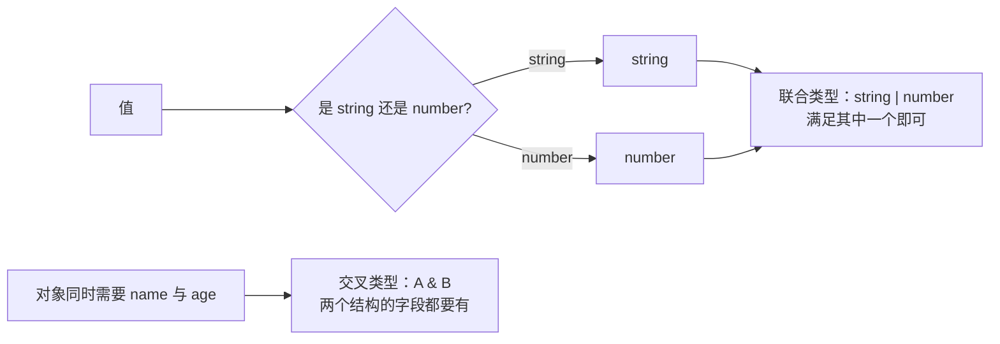

## 前置知识

- [TS 前篇 04：泛型基础](/typescript/007-TSBasicsGenerics)：建议先完成前一篇的学习

## 学习目标

- 掌握「1. 基础类型 (Basic Types)」的核心机制、典型用法与常见陷阱
- 掌握「2. 特殊类型」的核心机制、典型用法与常见陷阱
- 掌握「3. 联合类型与交叉类型 (Unions & Intersections)」的核心机制、典型用法与常见陷阱
- 掌握「4. 类型别名 (type)」的核心机制、典型用法与常见陷阱
- 掌握「5. 字面量类型 (Literal Types)」的核心机制、典型用法与常见陷阱


> 阅读提示：正文以代码和白话为主，不出现类型论公式。文末"进阶附录 A"集中解释 `Γ ⊢ e : τ` 这类记号，零基础第一遍可完全跳过。

## 1. 基础类型 (Basic Types)

TypeScript 提供了丰富的类型系统，包括 JavaScript 原有的类型和 TypeScript 增强的类型。

### 1.1 原始类型 (Primitive Types)

| 类型          | 描述                    | 示例                                                                          |
| :------------ | :---------------------- | :---------------------------------------------------------------------------- |
| **`boolean`** | 布尔值                  | `let isDone: boolean = false;`                                                |
| **`number`**  | 数字 (包括整数和浮点数) | `let count: number = 42; let pi: number = 3.14;`                              |
| **`string`**  | 字符串                  | `let name: string = "TypeScript"; let message: string = \`Hello, ${name}!\`;` |
| **`symbol`**  | 唯一标识符              | `let sym1: symbol = Symbol("key"); let sym2: symbol = Symbol("key");`         |
| **`bigint`**  | 大整数                  | `let big: bigint = 100n; let big2: bigint = BigInt("9007199254740991");`      |

### 1.2 复合类型 (Composite Types)

#### 1.2.1 数组 (Array)

```typescript
// 方式 1: 类型[]
let numbers: number[] = [1, 2, 3, 4, 5];
let strings: string[] = ['a', 'b', 'c'];
// 方式 2: Array<类型>
let numbers2: Array<number> = [1, 2, 3, 4, 5];
let strings2: Array<string> = ['a', 'b', 'c'];
// 多维数组
let matrix: number[][] = [
  [1, 2],
  [3, 4],
];
```

**拆解化讲解：**

（1）两种等价的数组写法：`number[]` 简洁，`Array<number>` 是泛型形式，语义完全相同；

（2）`number[][]` 是“数组的数组”，即二维数组，每一行是一个 `number[]`；

（3）类型约束让 `strings.push(123)` 这类错误在编译期就被拦截。

#### 1.2.2 元组 (Tuple)

元组是固定长度和类型的数组，每个位置的类型可以不同。

```typescript
// 基本元组
let person: [string, number] = ['John', 30];
// 访问元组元素
let name: string = person[0];
let age: number = person[1];
// 元组越界访问
// person[2] = "Smith"; // 错误: 元组长度为 2
// 可选元素
let optionalTuple: [string, number?] = ['John'];
// 剩余元素
let restTuple: [string, ...number[]] = ['John', 1, 2, 3];
// 只读元组
let readonlyTuple: readonly [string, number] = ['John', 30];
// readonlyTuple[0] = "Jane"; // 错误: 只读元组
```

**拆解化讲解：**

（1）元组是“定长定类型”的数组：`[string, number]` 表示第 0 位必须是字符串、第 1 位必须是数字；

（2）越界访问/赋值会编译报错，这是元组与普通数组的核心区别；

（3）`number?` 表示可选元素；`...number[]` 表示剩余元素（可任意多个数字）；

（4）`readonly` 让元组不可修改，适合“创建后不再改变”的配置对。

#### 1.2.3 枚举 (Enum)

枚举是一组命名的常量，默认从 0 开始递增。

```typescript
// 基本枚举
enum Direction {
  Up,
  Down,
  Left,
  Right,
}
let dir: Direction = Direction.Up; // 0
// 自定义枚举值
enum Color {
  Red = 1,
  Green = 2,
  Blue = 4,
}
let color: Color = Color.Green; // 2
// 字符串枚举
enum Status {
  Active = 'ACTIVE',
  Inactive = 'INACTIVE',
  Pending = 'PENDING',
}
let status: Status = Status.Active; // "ACTIVE"
// 常量枚举 (编译时会被内联)
const enum Weekday {
  Monday,
  Tuesday,
  Wednesday,
  Thursday,
  Friday,
  Saturday,
  Sunday,
}
let day: Weekday = Weekday.Monday;
```

**拆解化讲解：**

（1）数字枚举默认从 0 递增：`Up=0, Down=1...`；也可以显式赋值（`Red=1, Green=2`）；

（2）字符串枚举的值就是字符串本身，可读性更好，适合接口状态码；

（3）`const enum` 在编译时把枚举成员直接替换为字面量（内联），不生成运行时代码，性能更好；

（4）现代 TS 更推荐 `as const` 对象或联合字面量替代枚举，见第 5 节。

### 1.3 对象类型 (Object Types)

```typescript
// 内联对象类型
let user: { name: string; age: number } = {
  name: 'John',
  age: 30,
};
// 可选属性
let user2: { name: string; age?: number } = {
  name: 'John',
};
// 只读属性
let user3: { readonly name: string; age: number } = {
  name: 'John',
  age: 30,
};
// user3.name = "Jane"; // 错误: 只读属性
// 索引签名
let map: { [key: string]: number } = {
  a: 1,
  b: 2,
};
map.c = 3; // 允许添加新属性
```

**拆解化讲解：**

（1）内联对象类型直接声明“这个对象有哪些属性、各是什么类型”，缺属性或多属性都会报错；

（2）`age?: number` 表示可选属性，不传也不报错；

（3）`readonly name` 只读属性：赋值后不可再修改；

（4）索引签名 `[key: string]: number` 表示“所有键的值都是数字”，适合字典/映射结构，且允许运行时新增键。

## 2. 特殊类型

### 2.1 `any` 类型

`any` 类型会绕过所有类型检查，使用时需谨慎。

```typescript
// 任何值都可以赋值给 any 类型
let anyValue: any = 42;
anyValue = 'Hello';
anyValue = true;
// any 类型的变量可以访问任何属性或方法
let anyObj: any = { name: 'John' };
console.log(anyObj.name); // 没问题
console.log(anyObj.age); // 没问题，运行时会是 undefined
anyObj.method(); // 没问题，运行时会报错
// 避免使用 any
// 推荐使用具体类型或 unknown
```

**拆解化讲解：**

（1）`any` 关闭该变量的全部类型检查：赋任何值、访问任何属性都不报错；

（2）风险：`anyObj.method()` 编译期不报错，运行时才崩溃——错误被推迟到线上；

（3）原则：`any` 是“逃生门”，只用于迁移存量 JS 或临时兜底，新代码优先 `unknown` 或具体类型。

### 2.2 `unknown` 类型

`unknown` 是安全的 `any` 类型，在使用前必须进行类型缩小。

```typescript
// 任何值都可以赋值给 unknown 类型
let unknownValue: unknown = 42;
unknownValue = 'Hello';
unknownValue = true;
// unknown 类型的变量不能直接访问属性或方法
let unknownObj: unknown = { name: 'John' };
// console.log(unknownObj.name); // 错误: 类型 'unknown' 不能访问属性
// 需要进行类型缩小
if (typeof unknownObj === 'object' && unknownObj !== null) {
  console.log((unknownObj as { name: string }).name);
}
// 或使用类型守卫
function isPerson(obj: unknown): obj is { name: string; age: number } {
  return typeof obj === 'object' && obj !== null && 'name' in obj && 'age' in obj;
}
if (isPerson(unknownObj)) {
  console.log(unknownObj.name);
  console.log(unknownObj.age);
}
```

**拆解化讲解：**

（1）`unknown` 同样可以接收任何值，但**使用前必须缩小类型**，直接访问属性会编译报错；

（2）缩小方式一：`typeof` + `as` 断言，先确认是对象再按目标形状读取；

（3）缩小方式二：自定义类型守卫 `obj is {...}`，校验通过后 TS 自动把类型收窄；

（4）结论：`unknown` 是“安全的 any”，适合解析外部数据（JSON、接口响应）后再校验。

### 2.3 `void` 类型

`void` 表示没有返回值的函数。

```typescript
// 无返回值的函数
function logMessage(message: string): void {
  console.log(message);
  // 不需要 return 语句
}
// 可以返回 undefined
function returnUndefined(): void {
  return undefined;
}
// 不能返回其他值
// function returnNumber(): void {
// return 42; // 错误: 不能返回 number 类型
// }
// void 类型的变量只能赋值 undefined 或 null (在 strictNullChecks 为 false 时)
let voidVar: void = undefined;
// let voidVar2: void = null; // 错误: 在 strictNullChecks 为  时
```

**拆解化讲解：**

（1）`void` 表示函数“没有返回值”，`return undefined` 是唯一合法的显式返回；

（2）`return 42` 会编译报错，因为返回类型与 `void` 不匹配；

（3）`void` 变量只能赋 `undefined`（严格模式下连 `null` 都不行），日常很少直接使用变量形式的 `void`。

### 2.4 `never` 类型

`never` 表示永远不会有值的类型，如抛出异常的函数或无限循环的函数。

```typescript
// 抛出异常的函数
function throwError(message: string): never {
  throw new Error(message);
}
// 无限循环的函数
function infiniteLoop(): never {
  while (true) {
    // 无限循环
  }
}
// never 类型可以赋值给任何类型
let num: number = throwError('Error');
let str: string = throwError('Error');
// 没有类型可以赋值给 never 类型 (除了 never 本身)
// let neverVar: never = 42; // 错误: 不能赋值 number 类型
let neverVar: never = throwError('Error'); // 正确
```

**拆解化讲解：**

（1）`never` 表示“永远不会有值”：函数要么抛异常、要么无限循环，不会正常返回；

（2）因为不会返回，`throwError()` 可以赋给任何类型（`let num: number = throwError(...)` 合法）；

（3）没有任何值能赋给 `never`（除了 `never` 本身），常用于穷尽检查：switch 的 default 分支若 `never` 类型报错，说明有分支漏处理。

### 2.5 `null` 和 `undefined` 类型

`null` 和 `undefined` 是 TypeScript 中的基本类型。

```typescript
// null 类型
let nullValue: null = null;
// undefined 类型
let undefinedValue: undefined = undefined;
// 在 strictNullChecks 为 false 时，null 和 undefined 是所有类型的子类型
// let num: number = null; // 在 strictNullChecks 为 false 时允许
// 在 strictNullChecks 为  时，需要明确指定
let numWithNull: number | null = null;
let numWithUndefined: number | undefined = undefined;
let numWithBoth: number | null | undefined = 42;
// 可选属性和参数会自动包含 undefined
function greet(name?: string) {
  // name 类型为 string | undefined
  console.log(`Hello, ${name || 'Guest'}!`);
}
```

**拆解化讲解：**

（1）`strictNullChecks` 开启后，`null`/`undefined` 不能隐式赋给其它类型，必须显式写 `number | null`；

（2）可选参数 `name?: string` 的类型实际是 `string | undefined`，所以函数内要处理“没传”的情况；

（3）`name || 'Guest'` 利用空值回退，是处理可选参数的最简写法。

## 3. 联合类型与交叉类型 (Unions & Intersections)



**结构解析：** 联合类型是"或"——值属于其中一个成员；交叉类型是"且"——值必须同时满足全部成员。上图是两者心智模型的对比，代码示例见 3.1 与 3.2。

### 3.1 联合类型 (Union Types)

联合类型使用 `|` 符号，表示值可以是其中之一。

```typescript
// 基本联合类型
let id: string | number;
id = '123';
id = 456;
// 联合类型的类型缩小
function processId(id: string | number) {
  if (typeof id === 'string') {
    // id 类型缩小为 string
    console.log(`String ID: ${id.toUpperCase()}`);
  } else {
    // id 类型缩小为 number
    console.log(`Number ID: ${id.toFixed(2)}`);
  }
  ;
}
// 联合类型与字面量类型
type Status = 'active' | 'inactive' | 'pending';
let userStatus: Status = 'active';
// 联合类型与对象类型
interface Cat {
  type: 'cat';
  meow: () => void;
  ;
}
interface Dog {
  type: 'dog';
  bark: () => void;
  ;
}
type Pet = Cat | Dog;
function makeSound(pet: Pet) {
  if (pet.type === 'cat') {
    pet.meow();
  } else {
    pet.bark();
  }
  ;
}
```

**拆解化讲解：**

（1）联合类型 `string | number` 表示“二选一”，配合 `typeof` 判断即可缩小类型；

（2）联合字面量 `'active' | 'inactive' | 'pending'` 把取值限定为固定集合，比字符串更安全；

（3）判别式联合：每个对象带 `type` 字段作为“标签”，`if (pet.type === 'cat')` 后 TS 自动知道是 `Cat` 并允许调用 `meow()`；

（4）这是处理“同一概念的不同形态”的标准模式（如消息、形状、订单状态）。

### 3.2 交叉类型 (Intersection Types)

交叉类型使用 `&` 符号，表示值必须同时满足所有类型。

```typescript
 // 基本交叉类型
 interface Person {
  name: string;
  age: number;
 }
 interface Serializable {
  serialize: () => string;
 }
 type SerializablePerson = Person & Serializable;
 let person: SerializablePerson = {
  name: "John",
  age: 30,
  serialize: function() {
  return JSON.stringify(this);
  }
 }
 // 交叉类型与类型别名
 interface A {
  a: number;
 }
 interface B {
  b: string;
 }
 type C = A & B;
 let c: C = {
  a: 1,
  b: "hello"
 }
 // 交叉类型与联合类型
 interface X {
  x: number;
 }
 interface Y {
  y: string;
 }
 interface Z {
  z: boolean;
 }
 type XY = X & Y;
 type XYZ = XY & Z;
let xyz: XYZ = {
  x: 1,
  y: "hello",
  z:
 }
```

**拆解化讲解：**

（1）交叉类型 `A & B` 表示“同时满足两者”：对象必须包含 A 和 B 的全部属性；

（2）`Person & Serializable` 的结果类型拥有 `name`、`age` 和 `serialize`，缺一不可；

（3）交叉可以逐层叠加（`X & Y & Z`），常用于“基础类型 + 扩展能力”的组合；

（4）记忆：联合是“或”（`|`），交叉是“且”（`&`）。

## 4. 类型别名 (`type`)

类型别名使用 `type` 关键字为类型创建一个新名称。

```typescript
// 基本类型别名
type ID = string | number;
let userId: ID = '123';
let productId: ID = 456;
// 联合类型别名
type Status = 'active' | 'inactive' | 'pending';
let userStatus: Status = 'active';
// 对象类型别名
type User = {
  id: ID;
  name: string;
  email: string;
  age?: number;
};
let user: User = {
  id: '123',
  name: 'John',
  email: 'john@example.com',
};
// 函数类型别名
type AddFunction = (a: number, b: number) => number;
const add: AddFunction = (a, b) => a + b;
// 泛型类型别名
type Container<T> = {
  value: T;
  getValue: () => T;
};
let numberContainer: Container<number> = {
  value: 42,
  getValue: function () {
    return this.value;
  },
};
let stringContainer: Container<string> = {
  value: 'Hello',
  getValue: function () {
    return this.value;
  },
};
// 递归类型别名
type TreeNode<T> = {
  value: T;
  children: TreeNode<T>[];
};
let tree: TreeNode<number> = {
  value: 1,
  children: [
    {
      value: 2,
      children: [],
    },
    {
      value: 3,
      children: [
        {
          value: 4,
          children: [],
        },
      ],
    },
  ],
};
```

**拆解化讲解：**

（1）`type` 给复杂类型起名字：联合、对象、函数签名都能复用；

（2）函数类型别名 `(a: number, b: number) => number` 描述“入参两个数字、返回数字”的函数形状；

（3）泛型别名 `Container<T>` 让同一容器适配任意类型（`Container<number>`、`Container<string>`）；

（4）递归别名 `TreeNode<T>` 引用自身表示树结构，是链表、树、图建模的基础。

## 5. 字面量类型 (Literal Types)

字面量类型表示具体的值，而不是类型范围。

### 5.1 字符串字面量类型

```typescript
// 单个字符串字面量类型
type Direction = 'North' | 'South' | 'East' | 'West';
let move: Direction = 'North';
// move = "Northwest"; // 错误: 不在字面量类型中
// 字符串字面量类型与联合类型
type HttpMethod = 'GET' | 'POST' | 'PUT' | 'DELETE';
function fetchData(url: string, method: HttpMethod) {
  // 实现
}
fetchData('/api/users', 'GET'); // 正确
// fetchData("/api/users", "PATCH"); // 错误: 不在字面量类型中
```

**拆解化讲解：**

（1）字符串字面量类型把值限定为固定集合，`Direction` 只能是四个方向之一；

（2）`HttpMethod` 让 API 函数只接受标准方法，拼写错误在编译期暴露；

（3）原理：字面量类型是“单值类型”，联合多个单值就得到允许的取值集合。

### 5.2 数字字面量类型

```typescript
// 数字字面量类型
type DiceRoll = 1 | 2 | 3 | 4 | 5 | 6;
let roll: DiceRoll = 4;
// roll = 7; // 错误: 不在字面量类型中
// 数字字面量类型与联合类型
type HttpStatus = 200 | 400 | 401 | 404 | 500;
function handleResponse(status: HttpStatus) {
  switch (status) {
    case 200:
      return 'Success';
    case 404:
      return 'Not Found';
    case 500:
      return 'Internal Server Error';
    default:
      return 'Error';
  }
}
```

**拆解化讲解：**

（1）`DiceRoll = 1 | 2 | ... | 6` 把变量限制在骰子的六个面；

（2）`HttpStatus` 限定合法的 HTTP 状态码，配合 `switch` 实现穷尽处理；

（3）数字字面量常用于“枚举值集合”，比随意 number 更安全。

### 5.3 布尔字面量类型

```typescript
// 布尔字面量类型
type Only = true;
type Only = false;
let isActive: Only = true;
// isActive = false; // 错误: 只能是
let isInactive: Only = false;
// isInactive = true; // 错误: 只能是 false
// 布尔字面量类型的应用
function assert(condition: boolean, message: string): asserts condition {
  if (!condition) {
    throw new Error(message);
  }
}
function processValue(value: string | null) {
  assert(value !== null, 'Value cannot be null');
  // 此时 value 类型缩小为 string
  console.log(value.length);
}
```

**拆解化讲解：**

（1）`type Only = true` 表示只能取 `true` 一个值，实际中较少单独使用；

（2）`asserts condition` 是“断言函数”类型：函数返回后，TS 认为条件一定成立；

（3）`assert(value !== null, ...)` 之后，`value` 的类型自动收窄为 `string`，无需再写 `if`。

### 5.4 字面量类型的组合

```typescript
// 字符串和数字字面量组合
type Action = 'add' | 'remove' | 0 | 1;
let action: Action = 'add';
action = 0;
// 对象字面量类型
type Point = { x: 0; y: 0 } | { x: 1; y: 1 };
let point: Point = { x: 0, y: 0 };
// 字面量类型与类型守卫
type Shape =
  | { kind: 'circle'; radius: number }
  | { kind: 'square'; sideLength: number }
  | { kind: 'rectangle'; width: number; height: number };
function getArea(shape: Shape): number {
  switch (shape.kind) {
    case 'circle':
      return Math.PI * shape.radius ** 2;
    case 'square':
      return shape.sideLength ** 2;
    case 'rectangle':
      return shape.width * shape.height;
    default:
      return 0;
  }
}
```

**拆解化讲解：**

（1）字面量可以混合：`'add' | 'remove' | 0 | 1` 同时允许字符串和数字；

（2）`Shape` 是“判别式联合 + 字面量”的典型组合：每个分支用 `kind` 区分，`switch` 中自动收窄；

（3）`default: return 0` 兜底，配合 `never` 可做穷尽检查（所有分支都处理过）。

## 6. 类型断言

类型断言允许你告诉 TypeScript 编译器你知道变量的实际类型。

### 6.1 尖括号语法

```typescript
let someValue: any = 'this is a string';
let strLength: number = (<string>someValue).length;
```

**拆解化讲解：** 尖括号断言 `<string>someValue` 是早期写法，含义是“我确定它是 string”；在 JSX 文件中会与标签语法冲突，因此不推荐。

### 6.2 as 语法 (推荐)

```typescript
let someValue: any = 'this is a string';
let strLength: number = (someValue as string).length;
// 双重断言
let value: unknown = 'hello';
let str: string = value as any as string;
// 非空断言 (使用 ! 操作符)
function getElement(id: string): HTMLElement | null {
  return document.getElementById(id);
}
let element = getElement('myElement')!;
// 告诉 TypeScript 元素不会是 null
console.log(element.textContent);
```

**拆解化讲解：**

（1）`someValue as string` 是推荐的断言写法，可读性更好；

（2）双重断言 `value as any as string` 用于强行跨越不兼容类型，属于“危险操作”，应尽量避免；

（3）非空断言 `!` 告诉 TS“这里不会是 null”，只在确定元素存在时使用，否则运行时仍会报错。

### 6.3 类型断言的最佳实践

- **只在你确定类型时使用**：类型断言不会在运行时进行检查
- **优先使用类型守卫**：类型守卫更安全，会在运行时检查类型
- **避免过度使用**：过多的类型断言可能表明类型设计有问题
- **使用 as const**：为字面量类型提供更精确的类型

```typescript
// as const 断言
const config = {
  apiUrl: 'https://api.example.com',
  timeout: 5000,
};
// config.apiUrl 类型为 "https://api.example.com"
// config.timeout 类型为 5000
// 数组 as const
const numbers = [1, 2, 3] as const;
// numbers 类型为 readonly [1, 2, 3]
```

**拆解化讲解：**

（1）`as const` 把值“锁死”为字面量类型：`apiUrl` 不再是 string，而是具体的 `"https://api.example.com"`；

（2）`[1, 2, 3] as const` 得到只读元组 `readonly [1, 2, 3]`，常用于配置对象与常量表；

（3）原则：断言不改运行时行为，只改类型认知；能用守卫就用守卫。

## 7. 类型守卫

类型守卫是运行时检查，用于确定变量的具体类型。

### 7.1 `typeof` 类型守卫

```typescript
function processValue(value: string | number) {
  if (typeof value === 'string') {
    // value 类型缩小为 string
    console.log(value.toUpperCase());
  } else {
    // value 类型缩小为 number
    console.log(value.toFixed(2));
  }
}
```

### 7.2 `instanceof` 类型守卫

```typescript
class Animal {
  name: string;
  constructor(name: string) {
    this.name = name;
  }
}
class Dog extends Animal {
  bark() {
    console.log('Woof!');
  }
}
class Cat extends Animal {
  meow() {
    console.log('Meow!');
  }
}
function makeSound(animal: Animal) {
  if (animal instanceof Dog) {
    // animal 类型缩小为 Dog
    animal.bark();
  } else if (animal instanceof Cat) {
    // animal 类型缩小为 Cat
    animal.meow();
  }
}
```

**拆解化讲解：**

（1）`instanceof` 检查对象是否是某个类的实例，适合“类层次”的类型收窄；

（2）进入 `if (animal instanceof Dog)` 分支后，TS 自动把参数类型从 `Animal` 收窄为 `Dog`，可以安全调用 `bark()`；

（3）`else if` 分支同理收窄为 `Cat`，两个分支互斥且完备。

### 7.3 自定义类型守卫

```typescript
interface Person {
  name: string;
  age: number;
  ;
}
interface Animal {
  species: string;
  sound: string;
  ;
}
type LivingBeing = Person | Animal;
function isPerson(being: LivingBeing): being is Person {
  return 'name' in being && 'age' in being;
  ;
}
function isAnimal(being: LivingBeing): being is Animal {
  return 'species' in being && 'sound' in being;
  ;
}
function processBeing(being: LivingBeing) {
  if (isPerson(being)) {
    console.log(`Person: ${being.name}, ${being.age} years old`);
  } else if (isAnimal(being)) {
    console.log(`Animal: ${being.species}, makes ${being.sound}`);
  }
  ;
}
```

**拆解化讲解：**

（1）自定义守卫的签名 `being is Person` 是“承诺”：函数返回 true 时，TS 把参数类型收窄为 Person；

（2）函数体用 `'name' in being && 'age' in being` 做真实的运行时检查；

（3）自定义守卫适合接口/对象结构（`instanceof` 只适合类），是解析未知数据的标准做法。

### 7.4 判别式联合类型

```typescript
interface Square {
  kind: 'square';
  size: number;
  ;
}
interface Rectangle {
  kind: 'rectangle';
  width: number;
  height: number;
  ;
}
interface Circle {
  kind: 'circle';
  radius: number;
  ;
}
type Shape = Square | Rectangle | Circle;
function getArea(shape: Shape): number {
  switch (shape.kind) {
    case 'square':
      return shape.size ** 2;
    case 'rectangle':
      return shape.width * shape.height;
    case 'circle':
      return Math.PI * shape.radius ** 2;
    default:
      // 类型保护，确保所有情况都被处理
      const exhaustiveCheck: never = shape;
      return 0;
  }
  ;
}
```

**拆解化讲解：**

（1）每个分支接口都有唯一的 `kind` 字面量字段，作为“判别标签”；

（2）`switch (shape.kind)` 后，每个 `case` 里 TS 自动收窄到对应形状，能直接访问专属字段；

（3）`const exhaustiveCheck: never = shape` 是穷尽检查：若未来新增一种形状而漏处理，`shape` 不再能赋给 `never`，编译报错——这是“编译器帮你查漏”的经典手法。

## 8. 类型推断

TypeScript 会根据上下文自动推断类型，减少显式类型注解的需要。

### 8.1 变量类型推断

```typescript
// 类型推断为 number
let num = 42;
// 类型推断为 string
let str = 'Hello';
// 类型推断为 boolean
let is = true;
// 类型推断为 string[]
let arr = ['a', 'b', 'c'];
// 类型推断为 { name: string; age: number }
let obj = { name: 'John', age: 30 };
```

**拆解化讲解：** 不写注解时，TS 根据初始值自动推断：`42` → `number`、`'Hello'` → `string`、数组 → `string[]`、对象 → 对应结构。推论遵循“字面量放宽为基本类型”的规则。

### 8.2 函数返回类型推断

```typescript
// 返回类型推断为 number
function add(a: number, b: number) {
  return a + b;
}
// 返回类型推断为 string
function greet(name: string) {
  return `Hello, ${name}!`;
}
// 返回类型推断为 void
function log(message: string) {
  console.log(message);
}
```

**拆解化讲解：** 返回值由 `return` 表达式自动推断：`a + b` → `number`，模板字符串 → `string`，没有 `return` → `void`。显式注解（`: number`）只在需要“约束实现”或对外契约时写。

### 8.3 泛型类型推断

> 进阶衔接：泛型（`<T>`）在这里只是"推断"的配角；它的完整体系——约束、默认值、泛型类、工具类型——在 `008-FunctionGeneric` 中系统讲解。第一遍读到本节知道"编译器会从实参推断 T"即可。

```typescript
function identity<T>(value: T): T {
  return value;
}
// T 推断为 number
let num = identity(42);
// T 推断为 string
let str = identity('Hello');
// T 推断为 { name: string }
let obj = identity({ name: 'John' });
```

**拆解化讲解：** 调用泛型函数 `identity(42)` 时，TS 从实参推断类型参数 `T = number`，返回值随之确定为 `number`；无需手写 `identity<number>(42)`。

### 8.4 上下文类型推断

```typescript
// 上下文类型推断
const names = ['John', 'Jane', 'Bob'];
// 回调函数参数类型推断为 string
names.forEach((name) => {
  console.log(name.toUpperCase());
});
// 事件处理函数类型推断
const button = document.getElementById('myButton');
button?.addEventListener('click', (event) => {
  // event 类型推断为 MouseEvent
  console.log(event.clientX, event.clientY);
});
```

**拆解化讲解：**

（1）`forEach((name) => ...)` 的回调参数类型由数组元素类型“反向”推断为 `string`，不需要写注解；

（2）`addEventListener` 的回调 `event` 由事件名推断为 `MouseEvent`，能直接访问 `clientX`；

（3）`button?.addEventListener` 中的 `?.` 是可选链：`button` 为 null 时整行跳过，不报错。

## 9. 最佳实践

### 9.1 类型定义最佳实践

- **使用具体类型**：尽量避免使用 `any` 类型
- **使用接口定义对象结构**：清晰描述对象的形状
- **使用类型别名**：为复杂类型创建有意义的名称
- **使用泛型**：提高代码复用性和类型安全性
- **使用枚举**：为一组相关常量提供有意义的名称
- **使用字面量类型**：限制变量的取值范围

### 9.2 类型守卫最佳实践

- **使用 `typeof` 检查原始类型**：`string`, `number`, `boolean`, `symbol`
- **使用 `instanceof` 检查类实例**：类和构造函数
- **使用 `in` 操作符检查对象属性**：对象类型
- **使用判别式联合类型**：带有共同属性的联合类型
- **使用自定义类型守卫**：复杂类型检查

### 9.3 类型断言最佳实践

- **只在必要时使用**：优先使用类型守卫
- **使用 `as` 语法**：比尖括号语法更通用
- **避免双重断言**：除非确实需要
- **使用 `as const`**：为字面量类型提供更精确的类型
- **使用非空断言 `!`**：只在确定值不为 null 或 undefined 时使用

### 9.4 性能优化

- **避免过度使用联合类型**：联合类型会增加类型检查的复杂度
- **避免过度使用交叉类型**：交叉类型会增加类型计算的复杂度
- **使用 `readonly` 修饰符**：减少不必要的类型检查
- **使用 `const` 断言**：为字面量类型提供更精确的类型
- **避免循环依赖**：循环依赖会导致类型检查缓慢

## 10. 实际应用示例

### 10.1 表单验证

```typescript
// 表单数据类型
type FormData = {
  name: string;
  email: string;
  age: number;
  agree: boolean;
  ;
};
// 表单验证函数
function validateForm(data: Partial<FormData>): string[] {
  const errors: string[] = [];
  if (!data.name) {
    errors.push('Name is required');
  }
  if (!data.email) {
    errors.push('Email is required');
  } else if (!/^[^\s@]+@[^\s@]+\.[^\s@]+$/.test(data.email)) {
    errors.push('Email is invalid');
  }
  if (data.age !== undefined && (data.age < 18 || data.age > 120)) {
    errors.push('Age must be between 18 and 120');
  }
  if (!data.agree) {
    errors.push('You must agree to the terms');
  }
  return errors;
  ;
}
// 使用示例
const formData: Partial<FormData> = {
  name: 'John',
  email: 'john@example.com',
  age: 30,
  agree: true,
};
const errors = validateForm(formData);
if (errors.length === 0) {
  console.log('Form is valid');
  ;
} else {
  console.log('Form errors:', errors);
  ;
}
```

**拆解化讲解：**

（1）`Partial<FormData>` 让所有字段可选，适合“只提交已填字段”的场景；

（2）校验函数逐项检查并收集错误数组，返回空数组表示通过；

（3）邮箱用正则 `^[^\s@]+@[^\s@]+\.[^\s@]+$` 做基础格式校验；

（4）这是“类型 + 纯函数校验”的典型表单模式：数据形状由类型保证，规则由函数保证。

### 10.2 API 响应处理

```typescript
// API 响应类型
type ApiResponse<T> = {
  success: boolean;
  data?: T;
  error?: string;
};
// 用户类型
interface User {
  id: number;
  name: string;
  email: string;
}
// 处理 API 响应
function handleResponse(response: ApiResponse<User>) {
  if (response.success && response.data) {
    console.log('User:', response.data);
  } else {
    console.error('Error:', response.error || 'Unknown error');
  }
}
// 模拟 API 响应
const successResponse: ApiResponse<User> = {
  success: true,
  data: {
    id: 1,
    name: 'John',
    email: 'john@example.com',
  },
};
const errorResponse: ApiResponse<User> = {
  success: false,
  error: 'User not found',
};
handleResponse(successResponse);
handleResponse(errorResponse);
```

**拆解化讲解：**

（1）泛型 `ApiResponse<T>` 用同一个壳包装不同类型的数据（`ApiResponse<User>`、`ApiResponse<Product>`）；

（2）`data?` 与 `error?` 可选字段表达“成功时有数据、失败时有错误”；

（3）处理函数先判 `success && data` 再安全访问，错误分支给出兜底文案。

### 10.3 状态管理

```typescript
 // 状态类型
 type State = {
  user: User | null;
  loading: boolean;
  error: string | null;
 }
 // 动作类型
 type Action =
  | { type: "SET_USER"; payload: User }
  | { type: "SET_LOADING"; payload: boolean }
  | { type: "SET_ERROR"; payload: string }
  | { type: "CLEAR_ERROR" }
  | { type: "LOGOUT" };
 // 状态更新函数
 function reducer(state: State, action: Action): State {
  switch (action.type) {
  case "SET_USER":
  return {
  ...state,
  user: action.payload,
  error: null
  };
  case "SET_LOADING":
  return {
  ...state,
  loading: action.payload
  };
  case "SET_ERROR":
  return {
  ...state,
  error: action.payload,
  loading: false
  };
  case "CLEAR_ERROR":
  return {
  ...state,
  error: null
  };
  case "LOGOUT":
  return {
  ...state,
  user: null
  };
  default:
  return state;
  }
 }
 // 初始状态
 const initialState: State = {
  user: null,
  loading: false,
  error: null
 }
 // 使用示例
 let state = initialState;
 state = reducer(state, { type: "SET_LOADING", payload: true });
 console.log("Loading state:", state);
 state = reducer(state, {
  type: "SET_USER",
  payload: { id: 1, name: "John", email: "john@example.com" }
 });
 console.log("User set:", state);
 state = reducer(state, { type: "SET_ERROR", payload: "Something went wrong" });
 console.log("Error state:", state);
 state = reducer(state, { type: "LOGOUT" });
 console.log("Logged out:", state);
```

**拆解化讲解：**

（1）状态（`State`）与动作（`Action`）分开定义：动作是“发生了什么”，状态是“现在长什么样”；

（2）`Action` 用判别式联合：每种动作带 `type` 标签，`payload` 随类型变化；

（3）`reducer` 是纯函数：接收旧状态与动作，返回新状态，不修改旧状态（用展开运算符 `...state` 复制）；

（4）这是 React useReducer / Redux 的核心模式：类型保证每个 case 能安全访问对应 payload；

（5）示例中的 `payload: true` 补全了类型，原代码此处为空值，编译期就会报错。

## 11. 常见问题与解决方案

### 11.1 类型错误

| 错误                                         | 原因                           | 解决方案                                 |
| :------------------------------------------- | :----------------------------- | :--------------------------------------- |
| **Type 'X' is not assignable to type 'Y'**   | 类型不匹配                     | 检查变量类型，确保类型一致               |
| **Property 'X' does not exist on type 'Y'**  | 属性不存在                     | 检查对象结构，确保属性存在或使用可选属性 |
| **Cannot find name 'X'**                     | 变量未定义                     | 检查变量是否已声明，或添加类型定义       |
| **Object is possibly 'null' or 'undefined'** | 可能为 null 或 undefined       | 使用非空断言或类型守卫                   |
| **Type 'any' is not assignable to type 'X'** | any 类型不能直接赋值给具体类型 | 使用类型断言或类型守卫                   |

### 11.2 类型推断问题

| 问题                                       | 原因               | 解决方案                       |
| :----------------------------------------- | :----------------- | :----------------------------- |
| **Type inference is too narrow**           | 类型推断过于狭窄   | 使用类型注解或类型断言         |
| **Type inference is too wide**             | 类型推断过于宽泛   | 使用字面量类型或 as const 断言 |
| **Type inference fails for complex types** | 复杂类型的推断失败 | 使用显式类型注解               |

### 11.3 类型守卫问题

| 问题                                | 原因                     | 解决方案                             |
| :---------------------------------- | :----------------------- | :----------------------------------- |
| **Type guard not narrowing type**   | 类型守卫没有正确缩小类型 | 检查类型守卫的实现，确保返回类型正确 |
| **Discriminated union not working** | 判别式联合类型不工作     | 确保所有联合成员都有共同的判别属性   |
| **Type guard performance**          | 类型守卫执行缓慢         | 优化类型守卫逻辑，避免复杂检查       |

## 12. 总结

TypeScript 的类型系统是其最强大的特性之一，它提供了丰富的类型定义和检查机制，帮助开发者在编译时发现错误，提高代码质量和可维护性。通过理解和使用 TypeScript 的基础类型、联合类型、交叉类型、类型别名、字面量类型等特性，开发者可以构建更加可靠、类型安全的应用程序。

### 12.1 关键要点

- **类型安全**：TypeScript 的核心价值在于提供静态类型检查，减少运行时错误
- **类型推断**：TypeScript 会根据上下文自动推断类型，减少显式类型注解的需要
- **类型守卫**：运行时检查，用于确定变量的具体类型
- **类型断言**：告诉 TypeScript 编译器你知道变量的实际类型
- **字面量类型**：限制变量的取值范围，提高类型安全性
- **联合类型和交叉类型**：组合多个类型，提高代码灵活性

### 12.2 学习建议

- **从基础开始**：学习 TypeScript 的基本类型和语法
- **实践项目**：通过实际项目练习 TypeScript 类型系统
- **阅读文档**：参考官方文档和最佳实践
- **使用类型守卫**：优先使用类型守卫而不是类型断言
- **避免使用 any**：尽量使用具体类型或 unknown
- **使用类型别名**：为复杂类型创建有意义的名称
  TypeScript 的类型系统是一个强大的工具，掌握它可以帮助开发者构建更加可靠、可维护的应用程序，提高开发效率和代码质量。

## 13. 常见错误与修正（错-对对比）

> 以下每组都是"错误写法 → 正确写法"，零基础建议亲手把错误版本敲一遍，感受编译器报错，再改成正确版本。

### 13.1 对象字面量缺字段

```typescript
// 错误：缺少 age，编译器报 "Property 'age' is missing"
const user: { name: string; age: number } = { name: "Alice" }

// 正确：补全所有必填字段
const user2: { name: string; age: number } = { name: "Alice", age: 30 }
```

**讲解：** 结构类型检查是 TS 的核心：对象字面量必须满足声明中的所有必填属性，少一个都不行。

### 13.2 把 any 当万能类型

```typescript
// 错误：any 让类型检查失效，拼错属性名也不会报错
let data: any = { id: 1 }
console.log(data.nmae) // 运行期才报错

// 正确：用具体类型或 unknown，让错误在编译期暴露
let data2: { id: number } = { id: 1 }
// console.log(data2.nmae) // 编译期就报错
```

**讲解：** any 是"退出类型系统"的逃生口；能用具体类型就不用 any，不确定时用 unknown 再收窄。

### 13.3 用 == 判断空值

```typescript
// 错误：== null 同时匹配 null 与 undefined，语义模糊
function f(x: string | null | undefined) {
  if (x == null) return
}

// 正确：显式声明判断目标
function g(x: string | null | undefined) {
  if (x === null || x === undefined) return
}
```

**讲解：** TS 类型与 `===` 配合时，分支收窄更精确，代码意图也更清楚。

### 13.4 类型断言滥用

```typescript
// 错误：as 强制断言，掩盖了真实的 undefined 风险
const el = document.getElementById("app") as HTMLDivElement
el.innerText = "hi" // 运行时可能报错：el 是 null

// 正确：先收窄再使用
const el2 = document.getElementById("app")
if (el2) {
  el2.innerText = "hi"
}
```

**讲解：** 断言是"我比编译器懂"，但 null 风险是运行时事实；先判断再使用是最稳的写法。

## 原始类型

> 速查索引：从这里到文件末尾与正文内容重复，按需查阅，第一遍阅读可以跳过。

**基本写法：布尔类型**
`let <变量>: boolean = <值>`

```typescript
// 布尔类型
let is_active: boolean = true
```

---

**基本写法：数字类型**
`let <变量>: number = <值>`

```typescript
// 数字类型
let count: number = 42
```

---

**基本写法：字符串类型**
`let <变量>: string = <值>`

```typescript
// 字符串类型
let name: string = "Alice"
```

---

**基本写法：空值类型**
`let <变量>: void = undefined`

```typescript
// void 类型（通常用于函数返回值）
let unused: void = undefined
```

---

**基本写法：null 类型**
`let <变量>: null = null`

```typescript
// null 类型
let empty: null = null
```

---

**基本写法：undefined 类型**
`let <变量>: undefined = undefined`

```typescript
// undefined 类型
let not_defined: undefined = undefined
```

---

**基本写法：symbol 类型**
`let <变量>: symbol = Symbol(<描述>)`

```typescript
// symbol 类型
let unique_id: symbol = Symbol("id")
```

---

**基本写法：bigint 类型**
`let <变量>: bigint = <大整数>n`

```typescript
// bigint 类型
let large_number: bigint = 9007199254740991n
```

---

## 数组类型

**基本写法：使用类型加方括号**
`let <变量>: <类型>[] = [<值>]`

```typescript
// 数字数组
let numbers: number[] = [1, 2, 3]
```

---

**基本写法：使用泛型数组**
`let <变量>: Array<<类型>> = [<值>]`

```typescript
// 使用泛型语法的字符串数组
let names: Array<string> = ["Alice", "Bob"]
```

---

**换行写法：多行数组定义**
`let <变量>: <类型>[] = [`
`    <值1>,`
`    <值2>,`
`]`

```typescript
// 多行数组定义
let users: string[] = [
    "Alice",
    "Bob",
    "Charlie",
]
```

---

## 元组类型

**单行写法：定义元组**
`let <变量>: [<类型1>, <类型2>] = [<值1>, <值2>]`

```typescript
// 元组类型（固定长度和类型的数组）
let person: [string, number] = ["Alice", 30]
```

---

**换行写法：多元素元组**
`let <变量>: [`
`    <类型1>,`
`    <类型2>,`
`    <类型3>,`
`] = [<值1>, <值2>, <值3>]`

```typescript
// 多元素元组定义
let record: [
    string,
    number,
    boolean,
] = ["Alice", 30, true]
```

---

## 枚举类型

**换行写法：数字枚举**
`enum <枚举名> {`
`    <成员1>,`
`    <成员2>,`
`}`

```typescript
// 数字枚举
enum Direction {
    Up,
    Down,
    Left,
    Right,
}
```

---

**换行写法：字符串枚举**
`enum <枚举名> {`
`    <成员1> = "<值1>",`
`    <成员2> = "<值2>",`
`}`

```typescript
// 字符串枚举
enum Color {
    Red = "RED",
    Green = "GREEN",
    Blue = "BLUE",
}
```

---

**基本写法：访问枚举成员**
`<枚举名>.<成员>`

```typescript
// 访问枚举成员
let direction: Direction = Direction.Up
```

---

## any 类型

**基本写法：使用 any 类型**
`let <变量>: any = <值>`

```typescript
// any 类型（允许任意类型赋值）
let data: any = "hello"
data = 123
```

---

## unknown 类型

**基本写法：使用 unknown 类型**
`let <变量>: unknown = <值>`

```typescript
// unknown 类型（安全的 any，使用前必须类型检查）
let value: unknown = "hello"
if (typeof value === "string") {
    console.log(value.toUpperCase())
}
```

---

## never 类型

**基本写法：使用 never 类型**
`function <函数>(): never { <语句> }`

```typescript
// never 类型（表示永不返回的函数）
function error(message: string): never {
    throw new Error(message)
}
```

---

**基本写法：无限循环返回 never**
`function <函数>(): never { while(true) {} }`

```typescript
// 无限循环返回 never
function infinite_loop(): never {
    while (true) {}
}
```

---

## object 类型

**基本写法：使用 object 类型**
`let <变量>: object = <对象>`

```typescript
// object 类型（表示非原始类型）
let obj: object = { name: "Alice" }
```

---

## 类型断言

**基本写法：使用尖括号断言**
`<<类型>><表达式>`

```typescript
// 尖括号语法类型断言
let value: any = "hello"
let length: number = (<string>value).length
```

---

**基本写法：使用 as 断言**
`<表达式> as <类型>`

```typescript
// as 语法类型断言
let value: any = "hello"
let length: number = (value as string).length
```

---

## 联合类型

**基本写法：联合类型**
`let <变量>: <类型1> | <类型2> = <值>`

```typescript
// 联合类型（可以是多种类型之一）
let id: string | number = 123
id = "ABC"
```

---

## 交叉类型

**基本写法：交叉类型**
`type <类型> = <类型1> & <类型2>`

```typescript
// 交叉类型（组合多个类型）
type Person = { name: string }
type Employee = { employee_id: number }
type Staff = Person & Employee
```

---

## 字面量类型

**基本写法：字符串字面量类型**
`let <变量>: "<值>" = "<值>"`

```typescript
// 字符串字面量类型
let direction: "left" = "left"
```

---

**基本写法：数字字面量类型**
`let <变量>: <数字> = <数字>`

```typescript
// 数字字面量类型
let dice: 6 = 6
```

---

## let 与 const

**基本写法：使用 let 声明变量**
`let <变量>: <类型> = <值>`

```typescript
// 使用 let 声明可变变量
let count: number = 0
count = 1
```

---

**基本写法：使用 const 声明常量**
`const <变量>: <类型> = <值>`

```typescript
// 使用 const 声明不可变常量
const PI: number = 3.14159
```

---

## 类型推断

**基本写法：自动类型推断**
`let <变量> = <值>`

```typescript
// 自动推断变量类型
let name = "Alice"  // 推断为 string
let count = 42      // 推断为 number
```

---

## 解构赋值类型

**基本写法：数组解构类型**
`let [<变量1>, <变量2>]: <类型>[] = <数组>`

```typescript
// 数组解构赋值
let [first, second]: number[] = [1, 2]
```

---

**基本写法：对象解构类型**
`let { <属性1>, <属性2> }: { <属性1>: <类型1>, <属性2>: <类型2> } = <对象>`

```typescript
// 对象解构赋值
let { name, age }: { name: string, age: number } = { name: "Alice", age: 30 }
```

---

## 函数类型

**基本写法：函数参数类型**
`function <函数名>(<参数>: <类型>): <返回类型> { <语句> }`

```typescript
// 函数参数和返回值类型注解
function add(a: number, b: number): number {
    return a + b
}
```

---

**基本写法：箭头函数类型**
`const <函数名> = (<参数>: <类型>): <返回类型> => <表达式>`

```typescript
// 箭头函数类型注解
const greet = (name: string): string => `Hello, ${name}`
```

---

**基本写法：可选参数**
`function <函数名>(<参数1>: <类型>, <参数2>?: <类型>): <返回类型> { <语句> }`

```typescript
// 可选参数（使用 ? 标记）
function greet(name: string, greeting?: string): string {
    return `${greeting || "Hello"}, ${name}`
}
```

---

**基本写法：默认参数**
`function <函数名>(<参数>: <类型> = <默认值>): <返回类型> { <语句> }`

```typescript
// 默认参数值
function greet(name: string = "World"): string {
    return `Hello, ${name}`
}
```

---

**基本写法：剩余参数**
`function <函数名>(...<参数>: <类型>[]): <返回类型> { <语句> }`

```typescript
// 剩余参数
function sum(...numbers: number[]): number {
    return numbers.reduce((a, b) => a + b, 0)
}
```

---

## 类型别名

**基本写法：定义类型别名**
`type <别名> = <类型>`

```typescript
// 定义类型别名
type ID = string | number
```

---

## 可空类型

**基本写法：可空类型**
`let <变量>: <类型> | null = <值>`

```typescript
// 可空类型（值为指定类型或 null）
let name: string | null = "Alice"
name = null
```

---

## 可选链

**基本写法：使用可选链**
`<对象>?.<属性>`

```typescript
// 可选链操作符
let user: { name?: string } = {}
let name: string | undefined = user?.name
```

---

## 空值合并

**基本写法：使用空值合并**
`<值> ?? <默认值>`

```typescript
// 空值合并运算符
let name: string | null = null
let display_name: string = name ?? "Anonymous"
```

## 14. 自测（小测验）

先不看答案，把每题自己写一遍或口头回答，再对照答案。

**第 1 题（单选）**：`type A = string | number` 中，`true` 属于 A 吗？

**第 2 题（填空）**：`let x: unknown = "hi"` 后，直接执行 `x.toUpperCase()` 会怎样？应该先做什么？

**第 3 题（判断）**：`interface User { name: string; age?: number }` 中，`{ name: "A" }` 是否满足 User？为什么？

<details>
<summary>点击查看答案</summary>

1. 不属于。`true` 是布尔类型，`string | number` 只接受字符串或数字。
2. 编译报错。unknown 必须先收窄：`if (typeof x === "string") x.toUpperCase()`。
3. 满足。`age?: number` 是可选属性，缺省时合法；而 `name` 必填不能缺。

</details>

## 进阶附录 A：类型论记号说明（进阶可选）

> 本附录面向有项目经验后回来精读的读者，零基础第一遍可以完全跳过，不影响正文任何内容。

部分进阶文档会使用类型论记号描述类型规则，最常见的是判断式（judgment）：

```text
Γ ⊢ e : τ
```

读作："在类型环境 Γ 下，表达式 e 具有类型 τ"。三个符号的含义：

| 记号 | 含义 | 白话解释 |
| --- | --- | --- |
| `Γ`（Gamma） | 类型环境（type environment） | 一张"变量名 → 类型"的登记表 |
| `⊢`（turnstile） | 推导符号（entailment） | "可以推出"或"根据左边能判定右边" |
| `e : τ` | 表达式 e 的类型是 τ | 变量 x 的类型是 number，写作 `x : number` |

例如 `x : number, y : number ⊢ x + y : number` 表示"已知 x 和 y 都是 number，可以推出 x + y 也是 number"。

**为什么正文不出现这类记号**：类型论记号精确但抽象，零基础读者不需要通过它理解 TypeScript。本模块的正文统一使用代码示例与白话解释；需要形式化表达时，一律放在文末的"进阶附录"中。

相关深入内容见 `028-OnTheRoleOfSymbolicExecutionInTypeSystems`（符号执行与类型系统）、`061-ATheoryOfTypePolymorphismInProgramming`（类型论理论串讲）与 `026-CovarianceContravariance`（子类型关系的形式化）。
