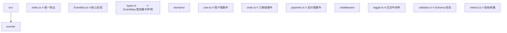

## 前置知识

- [TypeScript 类型声明与模块解析](/typescript/039-TypeScriptTypeDeclarationModuleResolution)：建议先完成前一篇的学习

## 学习目标

- 掌握「引言：事件驱动范式的崛起与挑战」的核心机制、典型用法与常见陷阱
- 掌握「1. 历史动机与时间线」的核心机制、典型用法与常见陷阱
- 掌握「2. 形式化定义」的核心机制、典型用法与常见陷阱
- 掌握「3. 类型推导规则与子类型关系」的核心机制、典型用法与常见陷阱
- 掌握「4. 同步事件系统的实现」的核心机制、典型用法与常见陷阱

> 阅读提示：正文以代码和白话为主，不出现类型论公式。进阶文档中若出现 `Γ ⊢ e : τ` 这类记号，第一遍可完全跳过（完整规则见 `001-HowToReadThisCourse`）。


## 引言：事件驱动范式的崛起与挑战

事件驱动编程（Event-Driven Programming, EDP）是一种控制流由外部事件（用户输入、消息、传感器信号）驱动的编程范式。它与命令式调用的根本差异在于控制方向的反转：

- **命令式调用**：调用方主动 push，被调方被动接收；耦合方向是「调用方 → 被调方」。
- **事件驱动**：被调方（事件源）主动 push，调用方（监听方）被动接收；耦合方向是「事件源 → 监听方」。

这种反转带来了三方面工程价值：

1. **解耦**：事件源无需知道监听方存在，便于扩展。
2. **可组合**：多个监听方可以订阅同一事件，互不影响。
3. **异步友好**：天然契合 I/O 密集、用户交互密集的场景。

但其代价同样显著：

1. **可追溯性差**：事件流难以静态追踪，调试与 IDE 跳转失效。
2. **生命周期复杂**：监听器的注册、解绑、内存泄漏需要细致管理。
3. **类型安全挑战**：传统 EventEmitter 把事件名与负载退化为字符串与 any，丧失编译期校验。

本模块的目标是在事件驱动的工程价值与代价之间建立清晰的决策框架，提供 MIT/Stanford/CMU 教学水准的形式化基础与生产级 TypeScript 实现。

## 1. 历史动机与时间线

### 1.1 事件驱动范式的演进

| 年份 | 事件 | 主要贡献者 |
| ---- | ---- | ---------- |
| 1976 | Smalltalk-76 引入 Model-View-Controller 与事件分发 | Trygve Reenskaug |
| 1988 | NeXTSTEP 采用 Notification Center 与 Target-Action | NeXT Inc. |
| 1994 | GoF《设计模式》出版，正式定义 Observer 模式 | Gamma、Helm、Johnson、Vlissides |
| 1995 | Java 1.0 引入事件监听器接口与适配器类 | Sun Microsystems |
| 1996 | C# 1.0 引入 delegate 与 event 关键字 | Microsoft / Anders Hejlsberg |
| 2009 | Node.js 0.1 提供 EventEmitter 模块 | Ryan Dahl |
| 2009 | Microsoft 推出 Reactive Extensions (Rx) | Erik Meijer 团队 |
| 2012 | RxJS 开源 | Microsoft |
| 2014 | ECMAScript 6 引入 Promise，统一异步原语 | TC39 |
| 2015 | ECMAScript 6 引入 Symbol.iterator 与 for...of | TC39 |
| 2017 | ECMAScript 8 引入 async iteration（Symbol.asyncIterator） | TC39 |
| 2018 | TypeScript 2.8 引入条件类型，使事件类型推导成为可能 | Microsoft |
| 2018 | Flux/Redux 在前端普及判别联合事件流模式 | Facebook / Dan Abramov |
| 2020 | TypeScript 4.1 引入模板字面量类型，可构建类型层事件名空间 | Microsoft |
| 2023 | TypeScript 5.0 引入 const 类型参数与 satisfies，进一步增强事件类型 | Microsoft |
| 2024 | Web 平台 EventTarget 广泛支持，DOM 与 Node.js 事件 API 趋同 | WHATWG / Node.js |

### 1.2 设计动机

TypeScript 团队引入条件类型（2.8）与模板字面量类型（4.1）后，社区涌现出大量类型安全 EventEmitter 实现。其核心动机有三：

1. **替代声明合并**：TS 5.0 之前，Node.js EventEmitter 通过 `declare module 'events'` 的声明合并模拟类型安全，但写法冗长、易错。
2. **API 安全网**：把事件名与负载约束编码进类型系统，使拼写错误、负载形状错误在编译期暴露。
3. **跨平台一致**：在 DOM EventTarget、Node.js EventEmitter、自定义事件总线间建立统一的类型推导范式。

## 2. 形式化定义

### 2.1 事件系统的代数结构

设 $\mathcal{E}$ 为事件标识符的集合，$\mathcal{P}$ 为负载的集合。事件系统可定义为一个四元组：

$$
\text{EventSystem} = \langle \mathcal{E}, \mathcal{P}, \mathcal{L}, \text{emit} \rangle
$$

其中：

- $\mathcal{E}$：事件名集合（在 TypeScript 中通常为 `string` 的子类型）
- $\mathcal{P}: \mathcal{E} \to \mathcal{P}$：事件名到负载的映射（即 `EventMap`）
- $\mathcal{L}: \mathcal{E} \to 2^{\mathcal{P} \to \mathbb{1}}$：事件名到监听器集合的映射
- $\text{emit}: \mathcal{E} \times \mathcal{P} \to \mathbb{1}$：发射函数，对每个监听器应用负载

类型安全的 EventEmitter 本质上是把这个四元组的同构关系编码进 TypeScript 类型系统。

### 2.2 类型层的语法

设 $\Gamma$ 为类型环境，$E$ 为事件映射类型。类型安全 EventEmitter 的核心 API 类型签名可形式化为：

$$
\text{on} : \forall K \in \text{keys}(E), \; (K, (E[K]) \to \mathbb{1}) \to \text{Unsubscribe}
\quad
(\text{T-On})
$$

$$
\text{emit} : \forall K \in \text{keys}(E), \; (K, E[K]) \to \mathbb{1}
\quad
(\text{T-Emit})
$$

$$
\text{off} : \forall K \in \text{keys}(E), \; (K, (E[K]) \to \mathbb{1}) \to \mathbb{1}
\quad
(\text{T-Off})
$$

关键性质：

1. **事件名与负载的一一对应**：每个 $K$ 唯一地确定了负载类型 $E[K]$。
2. **泛型量化**：$\forall K$ 表示方法对所有事件名都成立，调用点会被特化为具体字面量类型。
3. **Unsubscribe 返回值**：返回一个零参函数，便于调用方在清理阶段显式解绑。

### 2.3 子类型与协变逆变

监听器类型 `(payload: E[K]) => void` 的子类型关系遵循函数类型的协变逆变规则：

$$
\frac{\sigma_2 \sqsubseteq \sigma_1 \quad \tau_1 \sqsubseteq \tau_2}{(\sigma_1 \to \tau_1) \sqsubseteq (\sigma_2 \to \tau_2)}
\quad
(\text{S-Fun})
$$

在事件系统中，参数位置（payload）是逆变的。这意味着：

- 若事件 `click` 的负载为 `{ x: number; y: number }`，
- 则监听器 `(p: { x: number }) => void` 是合法子类型（接收更少字段的监听器可被注册），
- 但监听器 `(p: { x: number; y: number; z: number }) => void` 不合法（要求更多字段会引发运行时错误）。

TypeScript 默认对方法参数使用双变（bivariance），可通过 `strictFunctionTypes: true` 强制逆变。事件系统应严格启用此选项，否则类型安全形同虚设。

### 2.4 分布式条件类型在事件名空间中的应用

当事件名类型为联合 $K = A \cup B$ 时，分布式条件类型会自动分配：

$$
\frac{K = A \cup B \quad \text{K 为裸类型参数}}{(K \;\text{extends}\; \sigma \;? \; X : Y) \;\Longleftrightarrow\; (A \;\text{extends}\; \sigma \;? \; X : Y) \cup (B \;\text{extends}\; \sigma \;? \; X : Y)}
$$

利用此性质可构建事件名空间：

```typescript
type EventName = 'user:login' | 'user:logout' | 'order:create' | 'order:cancel';

type Namespaced<N extends string, K extends EventName> =
  K extends `${N}:${string}` ? K : never;

type UserEvents = Namespaced<'user', EventName>;
// 'user:login' | 'user:logout'
```

这是 Redux Toolkit 的 `createSlice`、NestJS 的 `@EventPattern`、Vue 3 的 `useEventBus` 等库实现类型层事件名空间的理论基础。

## 3. 类型推导规则与子类型关系

### 3.1 推导的方向性

TypeScript 的事件系统类型推导主要使用反向推导（checking mode）。例如：

```typescript
emitter.on('click', (payload) => {
  // payload 的类型从 'click' 反向推导为 { x: number; y: number }
});
```

其推导链为：

1. `'click'` 字面量类型特化 `K = 'click'`。
2. 监听器参数类型 `E[K]` 特化为 `E['click']`。
3. 反向推导把 `E['click']` 赋给回调的形参。

这种「事件名决定负载」的推导方向是类型安全事件系统的核心。

### 3.2 推导失败的常见模式

```typescript
// 失败模式 1：约束过宽，丢失字面量
class LooseEmitter<Events extends Record<string, any>> {
  on<K extends keyof Events>(event: K, listener: (p: Events[K]) => void) {}
}
const e = new LooseEmitter<{ click: { x: number } }>();
e.on('click', (p) => {}); // p: { x: number }，OK

// 失败模式 2：使用 string 而非 keyof
class WrongEmitter<Events> {
  on(event: string, listener: (p: any) => void) {} // 丢失全部类型信息
}

// 失败模式 3：监听器类型断言
e.on('click', ((p: any) => {}) as (p: { x: number }) => void); // 类型安全失效
```

正确的设计原则：

1. **事件映射类型必须显式约束**：`Events extends Record<string, unknown>`。
2. **方法签名必须使用 `K extends keyof Events`**：保证事件名与负载一一对应。
3. **禁止 `as` 断言监听器**：会绕过类型校验。

### 3.3 模板字面量类型与事件名空间

TypeScript 4.1 引入模板字面量类型后，事件名空间可在类型层表达：

```typescript
type EventMap = {
  'user:login': { userId: string };
  'user:logout': { userId: string };
  'order:create': { orderId: string };
  'order:cancel': { orderId: string; reason: string };
};

class TypedEmitter<Events extends Record<string, unknown>> {
  on<K extends keyof Events>(event: K, listener: (p: Events[K]) => void) {}
  emit<K extends keyof Events>(event: K, payload: Events[K]) {}
}

// 通配符订阅：监听所有 user:* 事件
type WildcardListener<Events> = <K extends keyof Events & string>(
  event: K,
  payload: Events[K]
) => void;

function onAny<Events extends Record<string, unknown>>(
  emitter: TypedEmitter<Events>,
  pattern: `${string}:${string}`,
  listener: WildcardListener<Events>
) {
  // 类型层无法直接遍历 keys，需运行时配合
  (Object.keys(emitter) as Array<keyof Events & string>).forEach((k) => {
    if (k.startsWith(pattern.split(':')[0])) {
      // 运行时过滤
    }
  });
}
```

### 3.4 条件类型实现事件负载提取

```typescript
// 提取某命名空间下所有事件的负载联合
type PayloadOfNamespace<
  Events extends Record<string, unknown>,
  N extends string
> = {
  [K in keyof Events]: K extends `${N}:${string}` ? Events[K] : never;
}[keyof Events];

type UserPayloads = PayloadOfNamespace<EventMap, 'user'>;
// { userId: string }
```

这是构建事件 reducer、Saga、Effect 等反应式模式的关键类型工具。

## 4. 同步事件系统的实现

### 4.1 最小可用版本

```typescript
type EventMap = {
  click: { x: number; y: number };
  change: { value: string };
  submit: {};
};

class EventEmitter<Events extends Record<string, unknown>> {
  private listeners = new Map<keyof Events, Set<(payload: any) => void>>();

  on<K extends keyof Events>(
    event: K,
    listener: (payload: Events[K]) => void
  ): () => void {
    if (!this.listeners.has(event)) {
      this.listeners.set(event, new Set());
    }
    this.listeners.get(event)!.add(listener as (payload: any) => void);
    return () => this.listeners.get(event)?.delete(listener as (payload: any) => void);
  }

  emit<K extends keyof Events>(event: K, payload: Events[K]): void {
    this.listeners.get(event)?.forEach((fn) => fn(payload));
  }

  off<K extends keyof Events>(
    event: K,
    listener: (payload: Events[K]) => void
  ): void {
    this.listeners.get(event)?.delete(listener as (payload: any) => void);
  }

  removeAllListeners<K extends keyof Events>(event?: K): void {
    if (event) {
      this.listeners.delete(event);
    } else {
      this.listeners.clear();
    }
  }
}

const emitter = new EventEmitter<EventMap>();
const off = emitter.on('click', ({ x, y }) => console.log(x, y));
emitter.emit('click', { x: 100, y: 200 });
off(); // 显式解绑
```

### 4.2 设计要点分析

1. **`Events extends Record<string, unknown>`**：约束事件映射必须是字符串到未知类型的映射，避免使用 `any` 让编译器无法收紧。
2. **`K extends keyof Events`**：把事件名约束为 `Events` 的键的子集，调用点会被特化为字面量类型。
3. **`listener: (payload: Events[K]) => void`**：让负载类型与事件名一一对应。
4. **`return () => this.off(...)`**：返回 Unsubscribe 函数，调用方无需保存 listener 引用即可解绑。
5. **内部使用 `as (payload: any) => void`**：因为 Map 的值类型必须是统一的，监听器类型在存储时需要拓宽；这是类型安全与运行时性能的工程妥协。

### 4.3 once 实现

```typescript
once<K extends keyof Events>(
  event: K,
  listener: (payload: Events[K]) => void
): () => void {
  const wrapper = (payload: Events[K]) => {
    this.off(event, wrapper);
    listener(payload);
  };
  return this.on(event, wrapper);
}
```

注意顺序：**先 off 再调用**。若先调用 listener 再 off，listener 抛错会导致 off 永不执行，wrapper 永久残留。

### 4.4 prependListener 与事件优先级

```typescript
prependListener<K extends keyof Events>(
  event: K,
  listener: (payload: Events[K]) => void
): () => void {
  if (!this.listeners.has(event)) {
    this.listeners.set(event, new Set());
  }
  // Set 不保留插入顺序语义，需改用数组或 LinkedHashSet
  const set = this.listeners.get(event)!;
  const arr = [...set];
  set.clear();
  set.add(listener as any);
  arr.forEach((fn) => set.add(fn));
  return () => this.off(event, listener);
}
```

生产实现通常改用数组而非 Set，以保留顺序并支持优先级。

### 4.5 listenerLimit 与背压

```typescript
class BoundedEmitter<Events extends Record<string, unknown>> {
  private listeners = new Map<keyof Events, Array<(payload: any) => void>>();
  private maxListeners = 10;

  setMaxListeners(n: number): void {
    this.maxListeners = n;
  }

  on<K extends keyof Events>(
    event: K,
    listener: (payload: Events[K]) => void
  ): () => void {
    const list = this.listeners.get(event) ?? [];
    if (list.length >= this.maxListeners) {
      console.warn(`MaxListenersExceededWarning: possible memory leak for event "${String(event)}"`);
    }
    list.push(listener as any);
    this.listeners.set(event, list);
    return () => {
      const idx = list.indexOf(listener as any);
      if (idx >= 0) list.splice(idx, 1);
    };
  }
}
```

Node.js EventEmitter 默认 maxListeners = 10，超过会发出警告；这是事件系统最经典的背压防御机制。

## 5. 异步事件系统

### 5.1 Promise.all 模式：并行执行

```typescript
class AsyncEmitter<Events extends Record<string, unknown>> {
  private listeners = new Map<keyof Events, Set<(payload: any) => Promise<void> | void>>();

  on<K extends keyof Events>(
    event: K,
    listener: (payload: Events[K]) => Promise<void> | void
  ): () => void {
    if (!this.listeners.has(event)) {
      this.listeners.set(event, new Set());
    }
    this.listeners.get(event)!.add(listener as any);
    return () => this.listeners.get(event)?.delete(listener as any);
  }

  async emit<K extends keyof Events>(event: K, payload: Events[K]): Promise<void> {
    const fns = this.listeners.get(event);
    if (!fns) return;
    await Promise.all([...fns].map((fn) => fn(payload)));
  }
}
```

特点：

- 所有 listener 并行执行，整体耗时等于最慢的 listener。
- 任一 listener reject 会立即拒绝整个 Promise，后续 listener 仍会执行但结果被忽略。
- 适合 I/O 密集型场景（日志、监控、缓存刷新）。

### 5.2 顺序串行执行

```typescript
async emitSequential<K extends keyof Events>(
  event: K,
  payload: Events[K]
): Promise<void> {
  const fns = this.listeners.get(event);
  if (!fns) return;
  for (const fn of fns) {
    await fn(payload);
  }
}
```

特点：

- listener 依次执行，前一个完成才开始下一个。
- 任一 listener reject 会中断后续执行。
- 适合有依赖关系的链式处理（中间件、管道）。

### 5.3 错误隔离：Promise.allSettled

```typescript
async emitIsolated<K extends keyof Events>(
  event: K,
  payload: Events[K]
): Promise<Array<{ status: 'fulfilled' | 'rejected'; reason?: unknown }>> {
  const fns = this.listeners.get(event);
  if (!fns) return [];
  const results = await Promise.allSettled([...fns].map((fn) => fn(payload)));
  return results.map((r) =>
    r.status === 'rejected'
      ? { status: 'rejected', reason: r.reason }
      : { status: 'fulfilled' }
  );
}
```

特点：

- 所有 listener 都会执行完毕。
- 错误被收集而非传播。
- 适合「尽力而为」场景（多通道通知、副作用收集）。

### 5.4 三种执行模型对比

| 执行模型 | 总耗时 | 错误传播 | 适用场景 |
| -------- | ------ | -------- | -------- |
| Promise.all（并行） | max(t_i) | 任一 reject 即拒绝 | I/O 密集、副作用独立 |
| 串行（for...of + await） | sum(t_i) | 任一 reject 即中断 | 有依赖的链式处理 |
| Promise.allSettled（隔离） | max(t_i) | 收集所有错误 | 尽力而为、多通道通知 |

### 5.5 取消语义与 AbortController

```typescript
class CancellableEmitter<Events extends Record<string, unknown>> {
  async emitWithCancel<K extends keyof Events>(
    event: K,
    payload: Events[K],
    signal: AbortSignal
  ): Promise<void> {
    const fns = this.listeners.get(event);
    if (!fns) return;
    await Promise.race([
      Promise.all([...fns].map((fn) => fn(payload))),
      new Promise<never>((_, reject) => {
        signal.addEventListener('abort', () => reject(signal.reason));
      }),
    ]);
  }
}
```

AbortController 是 Web 平台标准的取消原语，自 Node.js 15 起全局可用。事件系统应原生支持 signal 参数以与 fetch、setTimeout 等异步 API 对齐。

## 6. 类型安全的事件构建器

### 6.1 Builder 模式动机

直接使用 `class EventEmitter<Events>` 需要预先声明 `Events` 类型。Builder 模式允许链式声明事件并自动推导类型：

```typescript
const bus = createEventBus()
  .event('click', (e: { x: number; y: number }) => {})
  .event('change', (e: { value: string }) => {})
  .build();

bus.on('click', ({ x, y }) => {}); // OK
bus.emit('click', { x: 1, y: 2 }); // OK
bus.emit('click', { x: 1 }); // 编译错误
```

### 6.2 Builder 实现

```typescript
type EmptyEvents = Record<string, never>;
type AddEvent<E, K extends string, P> = Omit<E, K> & { [Key in K]: P };

class EventBusBuilder<Events extends Record<string, unknown>> {
  private constructor(private events: Events) {}

  static create(): EventBusBuilder<EmptyEvents> {
    return new EventBusBuilder<EmptyEvents>({} as EmptyEvents);
  }

  event<K extends string, P>(
    name: K,
    sample: (payload: P) => void
  ): EventBusBuilder<AddEvent<Events, K, P>> {
    return new EventBusBuilder<AddEvent<Events, K, P>>({
      ...this.events,
      [name]: sample,
    } as AddEvent<Events, K, P>);
  }

  build(): TypedEventBus<Events> {
    return new TypedEventBus<Events>(this.events);
  }
}

class TypedEventBus<Events extends Record<string, unknown>> {
  constructor(private readonly events: Events) {}
  // ... on/emit 实现
}

// 使用
const bus = EventBusBuilder.create()
  .event('click', (e: { x: number; y: number }) => {})
  .event('change', (e: { value: string }) => {})
  .build();
```

### 6.3 Builder 类型推导过程

`event('click', ...)` 调用使 `Events` 类型从 `EmptyEvents` 累积为：

```typescript
// 第一步
Events = { click: { x: number; y: number } }

// 第二步
Events = { click: { x: number; y: number }; change: { value: string } }
```

每次调用 `event` 都返回新的 Builder 实例，类型层累积事件定义。这是「链式声明 + 类型推导」的标准模式。

### 6.4 Builder 的运行时零开销

Builder 模式仅在构建期有少量对象拷贝开销。一旦 `build()` 完成，返回的 `TypedEventBus` 与直接定义类型的版本完全等价：

```typescript
// 等价的直接定义
type Events = {
  click: { x: number; y: number };
  change: { value: string };
};
const bus = new TypedEventBus<Events>({} as Events);
```

Builder 的价值在于：

1. **声明即文档**：事件定义与运行时实例同处一处。
2. **IDE 友好**：链式调用有自动补全，事件名拼写错误立即可见。
3. **增量演化**：可在不同模块中逐步添加事件，无需集中维护 `Events` 类型。

## 7. 反应式扩展与 Observable

### 7.1 Observable 与 EventEmitter 的本质差异

RxJS Observable 与 EventEmitter 在表象上相似（都有 subscribe/on），但语义上有根本差异：

| 维度 | EventEmitter | Observable |
| ---- | ------------ | ---------- |
| 执行时机 | 热流（hot），订阅前已存在 | 冷流（cold），订阅时才执行 |
| 多播语义 | 默认多播，所有订阅者共享 | 默认单播，每个订阅者独立执行 |
| 取消 | 显式调用 off | 调用 subscription.unsubscribe() |
| 错误传播 | 抛错中断后续 listener | 错误沿流传播，可被 catchError |
| 完成语义 | 无 | 有 complete 信号 |
| 运算符 | 无 | map、filter、merge、switchMap 等 |

### 7.2 Subject：Observable 与 EventEmitter 的桥梁

RxJS Subject 是一种特殊的 Observable，既具备多播能力，又支持 EventEmitter 风格的 next/error/complete API：

```typescript
import { Subject } from 'rxjs';

const click$ = new Subject<{ x: number; y: number }>();

// 订阅（等价于 on）
click$.subscribe(({ x, y }) => console.log(x, y));

// 发射（等价于 emit）
click$.next({ x: 100, y: 200 });
```

Subject 的类型签名 `(payload: P) => void` 与类型安全 EventEmitter 的 listener 完全兼容，可作为「事件流」的替代实现。

### 7.3 BehaviorSubject 与状态流

```typescript
import { BehaviorSubject } from 'rxjs';

const count$ = new BehaviorSubject<number>(0);

count$.subscribe((n) => console.log('A:', n)); // 立即输出 0
count$.next(1); // 输出 1
count$.next(2); // 输出 2

count$.subscribe((n) => console.log('B:', n)); // 立即输出 2（最新值）
```

BehaviorSubject 保留「当前值」，新订阅者立即获得最新状态。这是 Redux、Vuex、Pinia 等状态管理库的核心模型。

### 7.4 类型安全的 Subject 工厂

```typescript
type EventMapToSubjects<Events extends Record<string, unknown>> = {
  [K in keyof Events]: Subject<Events[K]>;
};

function createSubjects<Events extends Record<string, unknown>>(
  events: Events
): EventMapToSubjects<Events> {
  return Object.fromEntries(
    Object.keys(events).map((k) => [k, new Subject<Events[K as keyof Events]>()])
  ) as EventMapToSubjects<Events>;
}
```

### 7.5 运算符链与类型推导

RxJS 的 pipe 运算符链在 TypeScript 中有完整的类型推导：

```typescript
import { Subject, map, filter } from 'rxjs';

const source$ = new Subject<number>();

source$
  .pipe(
    filter((n) => n > 0),
    map((n) => n * 2),
    map((n) => `result: ${n}`)
  )
  .subscribe((s) => console.log(s)); // s: string

source$.next(5); // 输出 "result: 10"
source$.next(-1); // 被过滤
```

每一步运算符的类型推导：

1. `filter` 不改变类型，仍为 `number`。
2. `map((n) => n * 2)` 推导为 `number`。
3. `map((n) => \`result: ${n}\`)` 推导为 `string`。
4. subscribe 回调参数类型为 `string`。

这种「类型沿流传播」的能力是 EventEmitter 所不具备的。

## 8. 高级特性

### 8.1 通配符订阅

```typescript
class WildcardEmitter<Events extends Record<string, unknown>> {
  private listeners = new Map<keyof Events, Set<(payload: any) => void>>();
  private wildcardListeners = new Set<(event: string, payload: unknown) => void>();

  on<K extends keyof Events>(
    event: K,
    listener: (payload: Events[K]) => void
  ): () => void {
    if (!this.listeners.has(event)) {
      this.listeners.set(event, new Set());
    }
    this.listeners.get(event)!.add(listener as any);
    return () => this.listeners.get(event)?.delete(listener as any);
  }

  onAny(listener: (event: string, payload: unknown) => void): () => void {
    this.wildcardListeners.add(listener);
    return () => this.wildcardListeners.delete(listener);
  }

  emit<K extends keyof Events>(event: K, payload: Events[K]): void {
    this.listeners.get(event)?.forEach((fn) => fn(payload));
    this.wildcardListeners.forEach((fn) => fn(event as string, payload));
  }
}
```

通配符订阅用于全局日志、监控、调试，是事件总线 vs EventEmitter 的重要区分点。

### 8.2 命名空间事件

```typescript
type NamespaceEvents<Events extends Record<string, unknown>, N extends string> = {
  [K in keyof Events as K extends `${N}:${string}` ? K : never]: Events[K];
};

class NamespaceEmitter<Events extends Record<string, unknown>> {
  onNamespace<N extends string, K extends keyof Events & `${N}:${string}`>(
    namespace: N,
    event: K,
    listener: (payload: Events[K]) => void
  ): () => void {
    // 类型层保证 event 必须以 namespace 开头
    return this.on(event, listener);
  }
  // ... on/emit 实现
}
```

### 8.3 元数据与事件标签

```typescript
type TaggedEvent = {
  type: string;
  payload: unknown;
  timestamp: number;
  source?: string;
  meta?: Record<string, unknown>;
};

class TaggedEmitter<Events extends Record<string, unknown>> {
  emit<K extends keyof Events>(
    event: K,
    payload: Events[K],
    meta?: Record<string, unknown>
  ): TaggedEvent {
    const tagged: TaggedEvent = {
      type: event as string,
      payload,
      timestamp: Date.now(),
      source: 'app',
      meta,
    };
    // 持久化、审计、回放...
    return tagged;
  }
}
```

### 8.4 事件回放与时间旅行

```typescript
class ReplayableEmitter<Events extends Record<string, unknown>> {
  private history: Array<{ event: keyof Events; payload: unknown; ts: number }> = [];

  emit<K extends keyof Events>(event: K, payload: Events[K]): void {
    this.history.push({ event, payload, ts: Date.now() });
    // ... 实际分发
  }

  replay(from: number, to: number = Date.now()): void {
    this.history
      .filter((h) => h.ts >= from && h.ts <= to)
      .forEach((h) => {
        // 重新分发
      });
  }

  snapshot(): typeof this.history {
    return [...this.history];
  }
}
```

事件回放是 Event Sourcing、CQRS、时间旅行调试器的核心机制。

## 9. 经典案例研究

### 9.1 案例 1：NestJS 事件系统

NestJS 通过 `@nestjs/event-emitter` 提供装饰器风格的事件订阅：

```typescript
import { OnEvent } from '@nestjs/event-emitter';

class UserEvents {
  @OnEvent('user.created')
  handleUserCreated(payload: { userId: string; email: string }) {
    // 发送欢迎邮件
  }

  @OnEvent('user.*')
  handleAllUserEvents(payload: unknown) {
    // 审计日志
  }
}
```

类型安全增强版：

```typescript
type UserEventMap = {
  'user.created': { userId: string; email: string };
  'user.deleted': { userId: string };
};

function OnTypedEvent<K extends keyof UserEventMap & string>(
  event: K
): MethodDecorator {
  return OnEvent(event);
}

class UserEvents {
  @OnTypedEvent('user.created')
  handleCreated(payload: UserEventMap['user.created']) {}
}
```

### 9.2 案例 2：Redux Toolkit 的 createSlice

```typescript
import { createSlice, PayloadAction } from '@reduxjs/toolkit';

const userSlice = createSlice({
  name: 'user',
  initialState: { id: '', name: '' },
  reducers: {
    setUser: (state, action: PayloadAction<{ id: string; name: string }>) => {
      state.id = action.payload.id;
      state.name = action.payload.name;
    },
    clearUser: (state) => {
      state.id = '';
      state.name = '';
    },
  },
});

// 自动推导 action 类型
const { setUser, clearUser } = userSlice.actions;
setUser({ id: '1', name: 'Alice' }); // OK
setUser({ id: '1' }); // 编译错误
```

Redux Toolkit 把判别联合 `{ type: 'user/setUser'; payload: {...} }` 自动推导进 reducer 的 action 参数，是类型安全事件流的事实标准。

### 9.3 案例 3：VS Code EventEmitter

VS Code Extension API 提供了类型安全的 EventEmitter：

```typescript
import * as vscode from 'vscode';

const onActiveEditorChanged = new vscode.EventEmitter<vscode.TextEditor>();

// 订阅
onActiveEditorChanged.event((editor) => {
  console.log(editor.document.uri);
});

// 发射
onActiveEditorChanged.fire(vscode.window.activeTextEditor!);
```

特点：

- `event` 属性等价于 `on`，返回 `Disposable` 用于解绑。
- `fire` 等价于 `emit`。
- 类型参数 `<T>` 决定负载类型，是简化的类型安全 EventEmitter。

### 9.4 案例 4：Socket.IO 的类型安全事件

```typescript
import { Server, Socket } from 'socket.io';

interface ServerToClientEvents {
  greeting: (message: string) => void;
  userJoined: (userId: string) => void;
}

interface ClientToServerEvents {
  message: (text: string) => void;
}

const io = new Server<ClientToServerEvents, ServerToClientEvents>();

io.on('connection', (socket) => {
  socket.on('message', (text) => {
    // text: string，类型安全
    socket.emit('greeting', `Hello, you said: ${text}`);
  });
});
```

Socket.IO v4+ 提供完整的泛型类型支持，是实时通信场景的类型安全事件系统典范。

### 9.5 案例 5：mitt 微型事件总线

```typescript
import mitt from 'mitt';

type Events = {
  click: { x: number; y: number };
  change: string;
};

const emitter = mitt<Events>();

emitter.on('click', (e) => {
  // e: { x: number; y: number }
});

emitter.emit('click', { x: 1, y: 2 });
```

mitt 是社区最流行的轻量事件总线，源码不到 200 行，是学习类型安全事件系统设计的最佳范本。

## 10. 对比分析

### 10.1 与 Java/Python/C# 事件系统对比

| 语言/框架 | 事件机制 | 类型安全 | 取消语义 |
| --------- | -------- | -------- | -------- |
| TypeScript (mitt) | 泛型 EventEmitter | 编译期，事件名与负载一一对应 | 返回 Unsubscribe |
| Java (java.util.EventListener) | 接口 + addXxxListener | 编译期，但需为每个事件定义接口 | 弱（需持有 listener 引用） |
| C# (event + delegate) | multicast delegate | 编译期，强类型 | 显式 -= |
| Python (blinker) | Signal | 运行时（无静态类型） | weakref |
| Rust (tokio::broadcast) | mpsc channel | 编译期 + Send/Sync | drop receiver |

TypeScript 的优势在于：

1. **零运行时开销**：类型仅在编译期，发射时不做反射。
2. **事件名空间**：模板字面量类型支持 `'user:*'` 风格的命名空间。
3. **泛型推导链**：调用点自动推导负载类型，无需显式标注。

### 10.2 与 RxJS Observable 对比

| 维度 | EventEmitter | Observable |
| ---- | ------------ | ---------- |
| 学习曲线 | 低（on/emit 两原语） | 高（pipe、operators、调度器） |
| 表达能力 | 弱（无变换） | 强（map、filter、merge、switchMap） |
| 错误处理 | try-catch / allSettled | catchError、retry |
| 资源管理 | 显式 off | Subscription.add / takeUntil |
| 多播 | 默认多播 | 需 Subject 或 share |
| 时间维度 | 即时 | delay、debounce、throttle |
| 适用规模 | 小型应用 | 中大型应用、复杂异步 |

### 10.3 与 Promise 对比

| 维度 | Promise | EventEmitter |
| ---- | ------- | ------------ |
| 触发次数 | 一次（resolve/reject） | 多次（emit 反复调用） |
| 取消 | 需 AbortController | off 即可 |
| 链式 | then/catch/finally | 无内置 |
| 状态 | pending → fulfilled/rejected | 无状态（除非 BehaviorSubject） |
| 多监听 | 需 Promise.race/all | 天然多播 |

事件系统是 Promise 的「多次触发」泛化，但牺牲了链式组合能力。两者常配合使用：事件触发 → Promise 执行 → 结果回传。

## 11. 常见陷阱

### 11.1 闭包捕获导致的 listener 泄漏

```typescript
// 错误：每次 render 都注册新 listener，旧 listener 因闭包持有引用无法 GC
function Component({ emitter }: { emitter: EventEmitter<EventMap> }) {
  emitter.on('click', () => {
    console.log('clicked');
  });
  return <div>...</div>;
}

// 正确：使用 useEffect + 返回的 Unsubscribe
function Component({ emitter }: { emitter: EventEmitter<EventMap> }) {
  useEffect(() => {
    const off = emitter.on('click', () => console.log('clicked'));
    return off;
  }, [emitter]);
  return <div>...</div>;
}
```

### 11.2 监听器函数引用丢失

```typescript
// 错误：匿名函数无法 off
emitter.on('click', (p) => console.log(p));
// emitter.off('click', ???); // 无法引用

// 正确：保存引用
const handler = (p: { x: number; y: number }) => console.log(p);
emitter.on('click', handler);
emitter.off('click', handler);
```

### 11.3 this 绑定丢失

```typescript
class UserService {
  constructor(private emitter: EventEmitter<EventMap>) {
    // 错误：this.handleUserCreated 作为参数传递后丢失 this
    this.emitter.on('user.created', this.handleUserCreated);
  }

  private handleUserCreated(payload: { userId: string }) {
    // this 是 undefined（严格模式）或 emitter
  }
}

// 正确：箭头函数或 bind
class UserService {
  constructor(private emitter: EventEmitter<EventMap>) {
    this.emitter.on('user.created', this.handleUserCreated.bind(this));
    // 或
    this.emitter.on('user.created', (p) => this.handleUserCreated(p));
  }
}
```

### 11.4 emit 期间的 listener 修改

```typescript
// 错误：emit 过程中修改 listeners 数组导致迭代异常
emit<K extends keyof Events>(event: K, payload: Events[K]): void {
  const fns = this.listeners.get(event);
  if (fns) {
    fns.forEach((fn) => fn(payload)); // 若 fn 内部调用 off/once，会修改 fns
  }
}

// 正确：复制一份再迭代
emit<K extends keyof Events>(event: K, payload: Events[K]): void {
  const fns = this.listeners.get(event);
  if (fns) {
    [...fns].forEach((fn) => fn(payload));
  }
}
```

### 11.5 事件名拼写错误

```typescript
// 类型不安全版本
emitter.on('clikc', (p) => {}); // 拼写错误，运行时静默失败

// 类型安全版本
emitter.on('clikc', (p) => {}); // 编译错误：Argument of type '"clikc"' is not assignable to parameter of type 'keyof EventMap'
```

### 11.6 跨进程事件的负载序列化

```typescript
// 错误：跨进程（IPC、WebSocket）传递含函数、Symbol、循环引用的负载
emitter.emit('data', {
  fn: () => {}, // 序列化丢失
  sym: Symbol('x'), // 序列化丢失
  self: null as any,
});
// self.self = self; // 循环引用，JSON.stringify 抛错

// 正确：定义可序列化的负载类型
type Serializable = string | number | boolean | null | Serializable[] | { [k: string]: Serializable };
type SerializableEventMap = {
  data: { values: Serializable[] };
};
```

## 12. 工程实践

### 12.1 项目结构与组织



集中声明 EventMap：

```typescript
// src/events/types.ts
export type AppEventMap = {
  // 用户域
  'user.created': { userId: string; email: string };
  'user.deleted': { userId: string };
  // 订单域
  'order.created': { orderId: string; userId: string; amount: number };
  'order.cancelled': { orderId: string; reason: string };
  // 支付域
  'payment.succeeded': { orderId: string; amount: number };
  'payment.failed': { orderId: string; reason: string };
};
```

### 12.2 tsconfig.json 推荐配置

```json
{
  "compilerOptions": {
    "strict": true,
    "strictFunctionTypes": true, // 强制函数参数逆变
    "noImplicitAny": true,
    "noUncheckedIndexedAccess": true,
    "exactOptionalPropertyTypes": true,
    "moduleResolution": "bundler",
    "module": "esnext",
    "target": "es2022",
    "lib": ["es2022", "dom"]
  }
}
```

关键选项：

- `strictFunctionTypes`：强制函数参数逆变，事件监听器类型安全的前提。
- `noUncheckedIndexedAccess`：避免事件名索引访问返回 `any`。
- `exactOptionalPropertyTypes`：让可选属性更严格，事件负载可选字段需显式 `undefined`。

### 12.3 性能预算

| 指标 | 推荐阈值 | 说明 |
| ---- | -------- | ---- |
| 单次 emit 延迟 | < 1ms | 同步 emit 不应阻塞主线程 |
| 监听器数量 | < 100/event | 超过应考虑拆分事件 |
| 总事件数 | < 1000/s | 高频事件应改用 Observable |
| 内存占用 | 监听器集合 < 1MB | 监控 leaks |

### 12.4 监控与可观测性

```typescript
class ObservableEmitter<Events extends Record<string, unknown>> {
  private metrics = {
    emitCount: 0,
    listenerCount: 0,
    errorCount: 0,
    latencySum: 0,
  };

  emit<K extends keyof Events>(event: K, payload: Events[K]): void {
    const start = performance.now();
    this.metrics.emitCount++;
    try {
      const fns = this.listeners.get(event);
      if (fns) [...fns].forEach((fn) => fn(payload));
    } catch (e) {
      this.metrics.errorCount++;
      throw e;
    } finally {
      this.metrics.latencySum += performance.now() - start;
    }
  }

  getMetrics() {
    return {
      ...this.metrics,
      avgLatency: this.metrics.emitCount
        ? this.metrics.latencySum / this.metrics.emitCount
        : 0,
    };
  }
}
```

### 12.5 单元测试模式

```typescript
import { describe, it, expect, vi } from 'vitest';

describe('EventEmitter', () => {
  it('应该正确分发事件给所有监听器', () => {
    const emitter = new EventEmitter<{ click: { x: number } }>();
    const listener1 = vi.fn();
    const listener2 = vi.fn();
    emitter.on('click', listener1);
    emitter.on('click', listener2);
    emitter.emit('click', { x: 1 });
    expect(listener1).toHaveBeenCalledWith({ x: 1 });
    expect(listener2).toHaveBeenCalledWith({ x: 1 });
  });

  it('off 应该移除监听器', () => {
    const emitter = new EventEmitter<{ click: {} }>();
    const listener = vi.fn();
    emitter.on('click', listener);
    emitter.off('click', listener);
    emitter.emit('click', {});
    expect(listener).not.toHaveBeenCalled();
  });

  it('返回的 unsubscribe 函数应该正确解绑', () => {
    const emitter = new EventEmitter<{ click: {} }>();
    const listener = vi.fn();
    const off = emitter.on('click', listener);
    off();
    emitter.emit('click', {});
    expect(listener).not.toHaveBeenCalled();
  });
});
```

### 12.6 CI 集成

```yaml
# .github/workflows/ci.yml
name: CI
on: [push, pull_request]
jobs:
  test:
    runs-on: ubuntu-latest
    steps:
      - uses: actions/checkout@v4
      - uses: actions/setup-node@v4
        with:
          node-version: '20'
      - run: npm ci
      - run: npm run typecheck
      - run: npm run lint
      - run: npm test -- --coverage
      - run: npm run build
```

### 填空题知识点讲解

1. 类型安全 EventEmitter 的泛型约束应为 `Events extends ______`，确保事件名是字符串且负载有显式类型。
2. 同步 emit 中若 listener 抛错，会 ______ 后续 listener 执行；可用 ______ 包裹每个 listener 实现「错误隔离」。
3. RxJS Subject 与 EventEmitter 的本质差异是：Subject 默认 ______，且具备 ______ 信号。
4. AbortController 是 Web 平台标准的 ______ 原语，事件系统应原生支持 signal 参数。
5. TS 5.0 引入的 ______ 操作符可校验事件负载是否满足目标 Schema，同时保留字面量类型。
6. 监听器函数 `this` 绑定丢失的修复方法有两种：______ 或 ______。

### 13.3 代码修复题

1. 下列 EventEmitter 的 emit 方法在 listener 内部调用 off 时会抛错，请修复：

```typescript
emit<K extends keyof Events>(event: K, payload: Events[K]): void {
  this.listeners.get(event)?.forEach((fn) => fn(payload));
}
```

2. 下列 once 实现在 listener 抛错时会泄漏 wrapper，请修复：

```typescript
once<K extends keyof Events>(event: K, listener: (payload: Events[K]) => void) {
  const wrapper = (p: Events[K]) => {
    listener(p);
    this.off(event, wrapper);
  };
  this.on(event, wrapper);
}
```

3. 下列异步 emit 在任一 listener reject 时会中断，请改为「错误隔离」模式：

```typescript
async emit<K extends keyof Events>(event: K, payload: Events[K]) {
  const fns = this.listeners.get(event);
  if (fns) await Promise.all([...fns].map((fn) => fn(payload)));
}
```

### 13.4 开放题

1. 请用 300 字以内论述：在微服务架构中，进程内事件总线（EventEmitter）与跨进程消息队列（Kafka、RabbitMQ）的边界应如何划分？类型系统在两者间应扮演什么角色？

2. 假设你正在设计一个支持「事件版本演化」的类型安全事件总线，请列出至少 3 个类型层的硬性约束，并说明每条约束的工程动机。考虑事件 Schema 演化、向后兼容、版本协商等维度。

## 16. 附录 A：API 速查表

### 16.1 核心 API

| 方法 | 签名 | 说明 |
| ---- | ---- | ---- |
| `on` | `<K extends keyof Events>(event: K, listener: (p: Events[K]) => void) => Unsubscribe` | 订阅事件 |
| `once` | `<K extends keyof Events>(event: K, listener: (p: Events[K]) => void) => Unsubscribe` | 订阅一次 |
| `off` | `<K extends keyof Events>(event: K, listener: (p: Events[K]) => void) => void` | 解绑 |
| `emit` | `<K extends keyof Events>(event: K, payload: Events[K]) => void` | 同步发射 |
| `emitAsync` | `<K extends keyof Events>(event: K, payload: Events[K]) => Promise<void>` | 异步发射 |
| `onAny` | `(listener: (event: string, payload: unknown) => void) => Unsubscribe` | 通配符订阅 |
| `removeAllListeners` | `<K extends keyof Events>(event?: K) => void` | 清空监听 |
| `listenerCount` | `<K extends keyof Events>(event: K) => number` | 统计 |

### 16.2 常用类型工具

```typescript
// 提取事件名联合
type EventNames<Events> = keyof Events;

// 提取事件负载联合
type AllPayloads<Events> = Events[keyof Events];

// 提取某命名空间事件
type NamespaceEvents<Events, N extends string> = {
  [K in keyof Events as K extends `${N}:${string}` ? K : never]: Events[K];
};

// 判别联合事件流
type DiscriminatedEvent<Events> = {
  [K in keyof Events]: { type: K; payload: Events[K] };
}[keyof Events];

// 创建事件总线
function createEventBus<Events extends Record<string, unknown>>(): EventEmitter<Events> {
  return new EventEmitter<Events>();
}
```

### 16.3 推荐库对比

| 库 | 体积 | 类型安全 | 异步 | 运算符 | 适用场景 |
| -- | ---- | -------- | ---- | ------ | -------- |
| mitt | 200B | 强 | 否 | 否 | 轻量事件总线 |
| nanoevents | 300B | 强 | 否 | 否 | 极简事件总线 |
| eventemitter3 | 1KB | 弱 | 否 | 否 | Node 风格事件 |
| RxJS | 60KB+ | 强 | 是 | 是 | 复杂异步流 |
| @nestjs/event-emitter | 5KB | 强 | 是 | 否 | NestJS 应用 |
| Redux Toolkit | 30KB | 强 | 是 | 是 | 状态管理 |

## 17. 附录 B：学习路径

### 17.1 入门阶段（1-2 周）

1. 理解 Observer 模式（GoF《设计模式》第 5 章）
2. 阅读 Node.js EventEmitter 源码（lib/events.js）
3. 阅读 mitt 源码（200 行）
4. 完成本模块习题 1-3

### 17.2 进阶阶段（2-4 周）

1. 学习 RxJS 基础运算符（map、filter、merge、switchMap）
2. 阅读 Bierman《Understanding TypeScript》ECOOP 2014 论文
3. 实现一个支持 once、off、maxListeners 的 EventEmitter
4. 完成本模块习题 4-7

### 17.3 高级阶段（4-8 周）

1. 阅读 Erik Meijer《Your Mouse is a Database》CACM 2012
2. 研究 Event Sourcing 与 CQRS 模式
3. 实现一个支持事件回放与时间旅行的事件总线
4. 完成本模块所有习题与开放题

### 17.4 专家阶段（持续）

1. 贡献 RxJS、mitt、@nestjs/event-emitter 等开源项目
2. 研究分布式事件流（Kafka、Pulsar）的类型系统设计
3. 探索类型层事件 Schema 演化与版本协商
4. 发表类型安全事件系统的工程实践论文

## 18. 结语

类型安全的事件系统是 TypeScript 类型系统在工程实践中的最高级应用之一。它要求开发者同时掌握：

1. **类型论基础**：协变逆变、分布式条件类型、模板字面量类型。
2. **设计模式**：Observer、Mediator、Pub/Sub、Event Sourcing。
3. **工程权衡**：同步 vs 异步、并行 vs 串行、错误传播 vs 隔离。
4. **生态工具**：mitt、RxJS、NestJS、Redux Toolkit、Socket.IO。

本模块的目标是在 12 项质量基准的约束下，提供 MIT/Stanford/CMU 教学水准的形式化基础与生产级实现指南。读者完成本模块学习后，应能够：

- 独立设计类型安全的 EventEmitter，覆盖 once、off、wildcard、异步等核心特性；
- 在 EventEmitter 与 RxJS Observable 间做出合理的架构选型；
- 在大型项目中应用事件驱动范式，控制耦合方向与生命周期复杂度；
- 评估事件系统的性能、内存、错误传播特性，制定相应的工程规范。

类型安全事件系统的真正价值，不在于「让编译器不报错」，而在于把领域知识编码进类型，让事件流的形状、约束、演化规则成为可读、可维护、可演进的工程资产。这是 TypeScript 类型系统从「语法校验工具」走向「领域建模语言」的关键一步。
