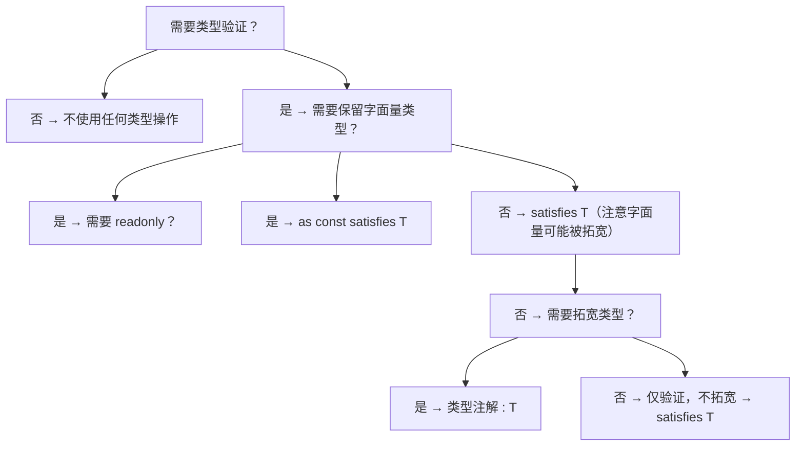

> 阅读提示：正文以代码和白话为主，不出现类型论公式。进阶文档中若出现 `Γ ⊢ e : τ` 这类记号，第一遍可完全跳过（完整规则见 `001-HowToReadThisCourse`）。


# satisfies 操作符

## 前置知识

- [TypeScript 工程化配置](/typescript/051-TypeScriptEngineeringConfig)：建议先完成前一篇的学习

## 学习目标

- 掌握「1. 历史动机与演化」的核心机制、典型用法与常见陷阱
- 掌握「2. 形式化定义」的核心机制、典型用法与常见陷阱
- 掌握「3. 理论推导与证明」的核心机制、典型用法与常见陷阱
- 掌握「4. 代码示例」的核心机制、典型用法与常见陷阱
- 掌握「5. 对比分析」的核心机制、典型用法与常见陷阱


> 本文档对标 MIT 6.S192 与 Stanford CS143 课程标准，系统讲解 TypeScript 4.9 引入的 `satisfies` 操作符的形式语义、推导规则、工程实践与生产级应用。`satisfies` 是 TypeScript 类型系统的关键补充，它弥合了"类型注解拓宽"与"类型断言不安全"之间的鸿沟，使开发者能在保留表达式具体类型的同时进行类型验证。本文档面向零基础自学读者，从类型论的基本概念出发，逐步推导 `satisfies` 的设计动机、数学语义、与 `as`、`: Type` 的形式对比，最终落地为可复用的工程模式与最佳实践。

---

## 1. 历史动机与演化

### 1.1 类型注解的"拓宽困境"（2012-2022）

在 TypeScript 4.9 引入 `satisfies` 之前，开发者在处理配置对象、字面量映射时常陷入两难。考虑以下场景：

```typescript
// 场景：RGB 颜色映射，每个属性值类型不同（数组或字符串）
interface ColorMap {
  [key: string]: [number, number, number] | string;
}

// 方案一：类型注解 —— 类型被拓宽，丢失字面量类型
const colors1: ColorMap = {
  red: [255, 0, 0],
  green: '#00ff00',
  blue: [0, 0, 255],
};

// 问题：访问 red 时类型为 [number, number, number] | string，而非具体数组
colors1.red[0];        // number | string —— 无法确定是数组还是字符串
colors1.green.toUpperCase(); // 错误：string | [number, number, number] 上没有 toUpperCase
```

类型注解的本意是"声明变量的类型"，但 TypeScript 会将变量的推断类型拓宽为注解类型，导致字面量信息丢失。开发者不得不使用类型断言绕过：

```typescript
// 方案二：类型断言 —— 不安全，绕过类型检查
const colors2 = {
  red: [255, 0, 0],
  green: '#00ff00',
  blue: [0, 0, 255],
} as ColorMap;

// 类型仍然被断言为 ColorMap，问题依旧
colors2.red[0]; // number | string

// 更糟的是，断言可以掩盖错误：
const badColors = {
  red: 'invalid',  // 字符串，但不是合法的 RGB
  green: 12345,    // 数字，但 ColorMap 不接受
} as ColorMap;      // 编译通过！但运行时是错的
```

### 1.2 社区呼声与设计讨论（2021-2022）

TypeScript 社区长期呼吁一种"仅验证不拓宽"的操作符。GitHub Issue #7481、#27912、#47269 等讨论催生了 `satisfies` 的设计。核心设计目标：

1. **保留具体类型**：表达式的推断类型不被拓宽。
2. **编译时验证**：确保表达式符合目标类型。
3. **错误信息友好**：类型不匹配时指出具体哪个属性出错。
4. **语法简洁**：与现有语法（`: Type`、`as Type`）协调一致。

设计团队（Daniel Rosenwasser、Andrew Branch 等）最终选定 `expr satisfies Type` 语法，灵感来自 Rust 的 trait bound 语法 `expr: T`（但 `:` 已被类型注解占用，故选 `satisfies` 关键字）。

### 1.3 satisfies 操作符的诞生（TypeScript 4.9, 2022）

TypeScript 4.9 正式引入 `satisfies` 操作符：

```typescript
// 方案三：satisfies —— 验证 + 保留具体类型
const colors3 = {
  red: [255, 0, 0],
  green: '#00ff00',
  blue: [0, 0, 255],
} satisfies ColorMap;

// 保留具体类型，自动补全更精确
colors3.red[0];             // number —— 保留数组元素类型
colors3.green.toUpperCase(); // string —— 保留字符串类型
colors3.blue.length;        // 3 —— 保留数组长度字面量（若用 as const）

// 类型不匹配时，编译错误指向具体属性
const badColors = {
  red: [255, 0],            // 错误：[number, number] 不能赋值给 [number, number, number] | string
  green: 12345,             // 错误：number 不能赋值给 [number, number, number] | string
} satisfies ColorMap;
```

### 1.4 与 as const 的协同（TypeScript 4.9+）

`satisfies` 与 `as const` 的组合成为现代 TypeScript 的标志性模式：

```typescript
// as const + satisfies：只读字面量 + 类型验证
const ROUTES = {
  home: '/',
  users: '/users',
  profile: '/profile/:id',
} as const satisfies Record<string, string>;

// 完全只读，且保留字面量类型
ROUTES.home;    // '/'（只读字面量）
ROUTES.users;   // '/users'（只读字面量）

// 尝试修改会报错
// ROUTES.home = '/new'; // 错误：只读属性
```

### 1.5 现代应用与生态（2023-2026）

`满足` 已成为 TypeScript 库设计的标配：

| 库 / 框架 | 应用场景 | 价值 |
|----------|---------|------|
| Next.js | 路由配置验证 | 保留路由字面量类型 |
| tRPC | 路由树定义 | 保留每个端点的具体类型 |
| Drizzle ORM | Schema 定义 | 保留列类型字面量 |
| Zod | Schema 与类型同步 | 编译时验证 + 运行时验证 |
| Pinia | Store 定义 | 保留 state/getters/actions 类型 |
| Vite | 插件配置验证 | 保留用户配置的具体类型 |
| ESLint | 规则配置验证 | 保留规则选项字面量 |
| Tailwind CSS | 主题配置验证 | 保留颜色、间距字面量 |

---

## 2. 形式化定义

### 2.1 satisfies 的语法

`satisfies` 操作符的 BNF 文法：

$$
\begin{aligned}
\text{SatisfiesExpression} &\to \text{Expression} \ \texttt{satisfies} \ \text{Type} \\
\text{Expression} &\to \text{Literal} \mid \text{Identifier} \mid \text{ObjectLiteral} \mid \text{ArrayLiteral} \mid \cdots \\
\text{Type} &\to \text{TypeReference} \mid \text{ObjectType} \mid \text{UnionType} \mid \text{IntersectionType} \mid \cdots
\end{aligned}
$$

语法约束：
- `satisfies` 是中缀操作符，左侧是表达式，右侧是类型。
- `satisfies` 可用于变量初始化、对象字面量、数组字面量、函数返回值（通过上下文类型）等位置。
- `satisfies` 不能用于函数返回值类型注解位置（即 `function f(): T satisfies U` 不合法）。

### 2.2 类型拓宽的形式语义

TypeScript 的类型拓宽（Type Widening）规则可形式化为：

$$
\text{Widen}(T) = \begin{cases}
\texttt{string} & \text{若 } T = \texttt{"hello"} \text{（字符串字面量）} \\
\texttt{number} & \text{若 } T = \texttt{42} \text{（数字字面量）} \\
\texttt{boolean} & \text{若 } T = \texttt{true} \text{（布尔字面量）} \\
\texttt{string[]} & \text{若 } T = \texttt{["a", "b"]} \text{（字面量元组）} \\
T & \text{否则}
\end{cases}
$$

类型注解 `: T` 的语义是：将表达式的推断类型拓宽至 $T$：

$$
\Gamma \vdash e : T_e \quad \text{类型注解} \quad \Gamma \vdash (e : T) : T
$$

其中 $T_e <: T$ 必须成立（子类型检查）。

### 2.3 satisfies 的求值规则

`satisfies` 的求值规则保持推断类型不变：

$$
\frac{\Gamma \vdash e : T_e \quad T_e <: T}{\Gamma \vdash (e \ \texttt{satisfies} \ T) : T_e}
$$

即：表达式 `e satisfies T` 的类型仍为 $T_e$（推断类型），但要求 $T_e <: T$（子类型约束）。

### 2.4 与类型断言的对比

类型断言 `e as T` 的求值规则：

$$
\frac{\Gamma \vdash e : T_e \quad (T_e <: T) \vee (T <: T_e)}{\Gamma \vdash (e \ \texttt{as} \ T) : T}
$$

即：类型断言允许 $T_e <: T$（向上转型）或 $T <: T_e$（向下转型），结果类型为 $T$。

关键差异：
- `satisfies`：仅允许 $T_e <: T$，结果类型为 $T_e$。
- `as`：允许双向转型，结果类型为 $T$。
- `: T`：仅允许 $T_e <: T$，结果类型为 $T$。

### 2.5 代数性质

`satisfies` 满足以下代数性质：

**同一律**（Identity）：

$$
(e \ \texttt{satisfies} \ \texttt{any}) \equiv e
$$

**保守律**（Conservativity）：

$$
\frac{T_e <: T}{(e \ \texttt{satisfies} \ T) \equiv e \quad \text{类型上}}
$$

**传递性**（Transitivity，组合使用）：

$$
((e \ \texttt{satisfies} \ T_1) \ \texttt{satisfies} \ T_2) \equiv (e \ \texttt{satisfies} \ T_2) \quad \text{若 } T_1 <: T_2
$$

**与 as const 的交换性**：

$$
(e \ \texttt{as const} \ \texttt{satisfies} \ T) \equiv ((e \ \texttt{as const}) \ \texttt{satisfies} \ T)
$$

注意：`as const` 必须在 `satisfies` 之前（语法上）。

### 2.6 子类型关系的形式化

TypeScript 的子类型关系 $S <: T$ 定义如下（简化版）：

$$
\frac{}{T <: T} \quad \text{自反性}
$$

$$
\frac{S <: T \quad T <: U}{S <: U} \quad \text{传递性}
$$

$$
\frac{}{\texttt{never} <: T} \quad \text{never 是底类型}
$$

$$
\frac{}{T <: \texttt{unknown}} \quad \text{unknown 是顶类型}
$$

$$
\frac{T <: U}{T <: U \cup V} \quad \text{联合类型的子类型}
$$

$$
\frac{}{\texttt{"hello"} <: \texttt{string}} \quad \text{字面量是基类型的子类型}
$$

`satisfies` 的子类型检查即基于上述规则。

---

## 3. 理论推导与证明

### 3.1 satisfies 保留类型推断的正确性

**命题 4.1**：对于任意表达式 $e$ 与类型 $T$，若 $T_e <: T$（其中 $T_e$ 是 $e$ 的推断类型），则 `e satisfies T` 的类型为 $T_e$，且编译通过。

**证明**：根据 `satisfies` 的求值规则（3.3 节）：

$$
\frac{\Gamma \vdash e : T_e \quad T_e <: T}{\Gamma \vdash (e \ \texttt{satisfies} \ T) : T_e}
$$

前提 $T_e <: T$ 满足，因此结论成立：表达式类型为 $T_e$，编译通过。$\blacksquare$

**工程含义**：`satisfies` 不改变表达式的类型，仅做编译时验证。

### 3.2 satisfies 与类型注解的差异

**命题 4.2**：对于字面量表达式 $e$，类型注解 `e : T` 会拓宽 $e$ 的类型至 $T$，而 `e satisfies T` 保留 $e$ 的字面量类型。

**证明**：设 $e = \texttt{"hello"}$，$T = \texttt{string}$，则 $T_e = \texttt{"hello"}$。

类型注解的求值规则：

$$
\Gamma \vdash (\texttt{"hello"} : \texttt{string}) : \texttt{string}
$$

类型被拓宽为 `string`。

`satisfies` 的求值规则：

$$
\Gamma \vdash (\texttt{"hello"} \ \texttt{satisfies} \ \texttt{string}) : \texttt{"hello"}
$$

类型保留为 `"hello"`。$\blacksquare$

**工程含义**：需要字面量类型时（如路由、状态码、枚举替代），使用 `satisfies`；需要拓宽类型时（如函数参数、公共接口），使用类型注解。

### 3.3 satisfies 与类型断言的安全性

**命题 4.3**：`satisfies` 比 `as` 更安全，因为 `satisfies` 仅允许向上转型（$T_e <: T$），而 `as` 允许双向转型。

**证明**：考虑 $e = \texttt{42}$，$T = \texttt{string}$。

- `as`：检查 $\texttt{number} <: \texttt{string}$ 或 $\texttt{string} <: \texttt{number}$，两者均不成立，编译错误。但若 $e$ 是 `any` 或 `unknown`，`as` 可以绕过检查。

- `satisfies`：检查 $\texttt{number} <: \texttt{string}$，不成立，编译错误。且 `satisfies` 不接受 `any` 的隐式绕过。

考虑 $e = \texttt{\{ a: 1 \}}$，$T = \texttt{\{ a: string \}}$：

- `as`：检查 $\texttt{\{ a: number \}} <: \texttt{\{ a: string \}}$ 或反向，反向成立（结构子类型），编译通过，但运行时 `a` 是 `number` 不是 `string`。

- `satisfies`：检查 $\texttt{\{ a: number \}} <: \texttt{\{ a: string \}}$，不成立，编译错误。

因此 `satisfies` 比 `as` 更严格。$\blacksquare$

**工程含义**：在需要类型验证时，优先使用 `satisfies` 而非 `as`。

### 3.4 as const satisfies 的语义

**命题 4.4**：`e as const satisfies T` 等价于 `(e as const) satisfies T`，即先将 $e$ 的所有属性变为只读字面量，再验证是否满足 $T$。

**证明**：`as const` 的求值规则：

$$
\Gamma \vdash (e \ \texttt{as const}) : \text{DeepReadonlyLiteral}(T_e)
$$

其中 $\text{DeepReadonlyLiteral}$ 将所有属性变为 `readonly` 并将类型拓宽为字面量类型。

组合 `satisfies`：

$$
\Gamma \vdash ((e \ \texttt{as const}) \ \texttt{satisfies} \ T) : \text{DeepReadonlyLiteral}(T_e)
$$

前提 $\text{DeepReadonlyLiteral}(T_e) <: T$。$\blacksquare$

**工程含义**：`as const satisfies` 是保留只读字面量类型的类型验证模式，常用于路由表、配置常量。

### 3.5 satisfies 不可用于函数返回值

**命题 4.5**：`satisfies` 不能用于函数返回值类型注解位置，即 `function f(): T satisfies U` 不合法。

**证明**：函数返回值类型注解的语法是 `function f(...): T`，其中 `: T` 是类型注解。`satisfies` 是表达式操作符，不是类型注解操作符。函数返回值的类型是函数签名的一部分，必须是类型注解，不能是 `satisfies` 表达式。

若需在函数返回值上做"验证 + 保留"，可改写为：

```typescript
function f() {
  return { a: 1, b: 'hello' } satisfies SomeType;
  // 返回类型推断为 { a: number; b: string }，且验证满足 SomeType
}
```

$\blacksquare$

**工程含义**：在函数体内部使用 `satisfies` 验证返回值，而非在函数签名上使用。

### 3.6 satisfies 与泛型推断的交互

**命题 4.6**：当 `satisfies` 用于泛型函数的参数时，会先进行 `satisfies` 验证，再触发泛型推断。

**证明**：考虑：

```typescript
function f<T>(x: T): T { return x; }

const result = f({ a: 1 } satisfies { a: number });
// 1. { a: 1 } satisfies { a: number }：验证通过，类型仍为 { a: number }
// 2. f({ a: number })：T 推断为 { a: number }
// 3. result 类型为 { a: number }
```

`satisfies` 表达式的类型是 $T_e$（验证后），作为函数参数传入时触发泛型推断 $T = T_e$。

注意：字面量 `1` 在 `satisfies { a: number }` 后拓宽为 `number`（因为目标类型是 `number`，`satisfies` 保留拓宽后的类型）。这是 `satisfies` 与 `as const` 的关键差异。$\blacksquare$

**工程含义**：`satisfies` 不会阻止类型拓宽，只是不主动拓宽。若需保留字面量，需配合 `as const`。

---

## 4. 代码示例

### 4.1 基础用法

#### 4.1.1 保留字面量类型

```typescript
// 类型注解：拓宽类型，丢失字面量信息
const color1: 'red' | 'green' | 'blue' = 'red';
// color1 类型：'red' | 'green' | 'blue'（联合类型，而非 'red'）

// satisfies：保留字面量类型
const color2 = 'red' satisfies 'red' | 'green' | 'blue';
// color2 类型：'red'（字面量类型）

// 验证不通过时编译错误
const color3 = 'yellow' satisfies 'red' | 'green' | 'blue';
// 错误：'"yellow"' 不能赋值给 '"red" | "green" | "blue"'
```

#### 4.1.2 对象字面量验证

```typescript
interface UserConfig {
  name: string;
  age: number;
  role: 'admin' | 'user' | 'guest';
}

// 类型注解：拓宽 role 为联合类型
const user1: UserConfig = {
  name: 'Alice',
  age: 30,
  role: 'admin',
};
user1.role; // 'admin' | 'user' | 'guest'（联合类型）

// satisfies：保留 role 的字面量类型
const user2 = {
  name: 'Alice',
  age: 30,
  role: 'admin',
} satisfies UserConfig;
user2.role; // 'admin'（字面量类型）

// 类型不匹配时编译错误
const user3 = {
  name: 'Alice',
  age: 30,
  role: 'superadmin', // 错误：'"superadmin"' 不能赋值给 '"admin" | "user" | "guest"'
} satisfies UserConfig;
```

#### 4.1.3 联合类型属性

```typescript
type ThemeConfig = {
  colors: string[] | string;
  spacing: number | [number, number];
  borderRadius: number | string;
};

// satisfies：保留每个属性的具体类型
const theme = {
  colors: ['#333', '#666', '#999'],
  spacing: [8, 16] as [number, number],
  borderRadius: '4px',
} satisfies ThemeConfig;

theme.colors;       // string[]（而非 string[] | string）
theme.spacing;      // [number, number]（而非 number | [number, number]）
theme.borderRadius; // string（而非 number | string）

// 可以安全调用类型特定的方法
theme.colors.push('#fff');  // OK，string[] 有 push
theme.borderRadius.toUpperCase(); // OK，string 有 toUpperCase
```

### 4.2 配置对象验证

#### 4.2.1 应用配置

```typescript
interface AppConfig {
  api: {
    baseURL: string;
    timeout: number;
    retries: number;
  };
  features: {
    darkMode: boolean;
    analytics: boolean;
    betaFeatures: boolean;
  };
  theme: 'light' | 'dark' | 'auto';
  locale: 'en-US' | 'zh-CN' | 'ja-JP';
}

const config = {
  api: {
    baseURL: 'https://api.example.com',
    timeout: 5000,
    retries: 3,
  },
  features: {
    darkMode: true,
    analytics: false,
    betaFeatures: true,
  },
  theme: 'dark',
  locale: 'zh-CN',
} satisfies AppConfig;

// 保留字面量类型，自动补全更精确
config.api.baseURL;          // string
config.api.timeout;          // number
config.features.darkMode;    // boolean
config.theme;                // 'dark'（字面量类型）
config.locale;               // 'zh-CN'（字面量类型）

// 可用于类型级路径推导
type Theme = typeof config.theme;    // 'dark'
type Locale = typeof config.locale;  // 'zh-CN'
```

#### 4.2.2 多环境配置

```typescript
type Environment = 'development' | 'staging' | 'production';

interface EnvConfig {
  apiUrl: string;
  logLevel: 'debug' | 'info' | 'warn' | 'error';
  enableAnalytics: boolean;
  features: string[];
}

const configs = {
  development: {
    apiUrl: 'http://localhost:3000',
    logLevel: 'debug',
    enableAnalytics: false,
    features: ['dev-tools', 'mock-data'],
  },
  staging: {
    apiUrl: 'https://staging.example.com',
    logLevel: 'info',
    enableAnalytics: true,
    features: ['beta-features'],
  },
  production: {
    apiUrl: 'https://api.example.com',
    logLevel: 'warn',
    enableAnalytics: true,
    features: [],
  },
} satisfies Record<Environment, EnvConfig>;

// 保留每个环境的具体类型
configs.development.apiUrl;   // string
configs.development.logLevel; // 'debug'（字面量类型）
configs.production.features;  // string[]

// 获取所有环境名称作为类型
type ConfigKey = keyof typeof configs; // 'development' | 'staging' | 'production'
```

### 4.3 字面量映射

#### 4.3.1 HTTP 状态码映射

```typescript
const STATUS_CODES = {
  OK: 200,
  CREATED: 201,
  NO_CONTENT: 204,
  BAD_REQUEST: 400,
  UNAUTHORIZED: 401,
  FORBIDDEN: 403,
  NOT_FOUND: 404,
  INTERNAL_SERVER_ERROR: 500,
} as const satisfies Record<string, number>;

// 保留数字字面量类型
STATUS_CODES.OK;               // 200（字面量类型）
STATUS_CODES.NOT_FOUND;        // 404（字面量类型）

// 完全只读
// STATUS_CODES.OK = 201; // 错误：只读属性

// 获取所有状态码的联合类型
type StatusCode = (typeof STATUS_CODES)[keyof typeof STATUS_CODES];
// 200 | 201 | 204 | 400 | 401 | 403 | 404 | 500

// 类型安全的函数
function getStatusMessage(code: StatusCode): string {
  switch (code) {
    case STATUS_CODES.OK: return 'OK';
    case STATUS_CODES.NOT_FOUND: return 'Not Found';
    // ...
    default: return 'Unknown';
  }
}
```

#### 4.3.2 事件处理器映射

```typescript
type EventHandler<E extends Event = Event> = (event: E) => void;

interface EventHandlerMap {
  click: EventHandler<MouseEvent>;
  keydown: EventHandler<KeyboardEvent>;
  focus: EventHandler<FocusEvent>;
  scroll: EventHandler<Event>;
}

const handlers = {
  click: (e: MouseEvent) => console.log('clicked', e.clientX, e.clientY),
  keydown: (e: KeyboardEvent) => console.log('key', e.key, e.code),
  focus: (e: FocusEvent) => console.log('focused', e.target),
  scroll: (e: Event) => console.log('scrolled', e.target),
} satisfies EventHandlerMap;

// 保留每个处理器的具体事件类型
handlers.click;    // (e: MouseEvent) => void
handlers.keydown;  // (e: KeyboardEvent) => void

// 类型安全的注册函数
function registerHandler<K extends keyof EventHandlerMap>(
  event: K,
  handler: EventHandlerMap[K]
) {
  // ...
}

registerHandler('click', handlers.click);   // OK
registerHandler('click', handlers.keydown); // 错误：处理器类型不匹配
```

### 4.4 路由表定义

```typescript
interface RouteConfig {
  path: string;
  component: () => Promise<unknown>;
  meta?: {
    title?: string;
    auth?: boolean;
    layout?: 'default' | 'blank' | 'admin';
  };
}

const routes = {
  home: {
    path: '/',
    component: () => import('./pages/Home.vue'),
    meta: { title: 'Home', layout: 'default' },
  },
  users: {
    path: '/users',
    component: () => import('./pages/Users.vue'),
    meta: { title: 'Users', auth: true, layout: 'default' },
  },
  login: {
    path: '/login',
    component: () => import('./pages/Login.vue'),
    meta: { title: 'Login', layout: 'blank' },
  },
  admin: {
    path: '/admin',
    component: () => import('./pages/Admin.vue'),
    meta: { title: 'Admin', auth: true, layout: 'admin' },
  },
} satisfies Record<string, RouteConfig>;

// 保留每个路由的具体类型
routes.home.path;          // '/'（字面量类型）
routes.users.meta.auth;    // boolean | undefined
routes.admin.meta.layout;  // 'admin' | undefined

// 获取所有路由名称
type RouteName = keyof typeof routes; // 'home' | 'users' | 'login' | 'admin'

// 类型安全的路由跳转
function navigate(name: RouteName) {
  const route = routes[name];
  console.log(`Navigating to ${route.path}`);
}

navigate('home');   // OK
navigate('unknown'); // 错误：'"unknown"' 不能赋值给路由名称
```

### 4.5 枚举替代方案

```typescript
// 使用 satisfies 替代枚举，获得更好的类型推断与 tree-shaking
const Direction = {
  Up: 'UP',
  Down: 'DOWN',
  Left: 'LEFT',
  Right: 'RIGHT',
} as const satisfies Record<string, string>;

type Direction = (typeof Direction)[keyof typeof Direction];
// 'UP' | 'DOWN' | 'LEFT' | 'RIGHT'

// 类型安全的使用
function move(direction: Direction) {
  switch (direction) {
    case Direction.Up:    console.log('Moving up'); break;
    case Direction.Down:  console.log('Moving down'); break;
    case Direction.Left:  console.log('Moving left'); break;
    case Direction.Right: console.log('Moving right'); break;
  }
}

move(Direction.Up);     // OK
move('UP');             // OK（字面量类型）
move('up');             // 错误：'"up"' 不能赋值给 Direction
```

### 4.6 与 Zod 集成

#### 4.6.1 编译时 + 运行时双重验证

```typescript
import { z } from 'zod';

// 运行时 Schema
const UserSchema = z.object({
  name: z.string(),
  age: z.number().int().positive(),
  email: z.string().email(),
  role: z.enum(['admin', 'user', 'guest']),
});

// 编译时类型
type User = z.infer<typeof UserSchema>;

// 运行时数据 + 编译时验证
const userData = {
  name: 'Alice',
  age: 30,
  email: 'alice@example.com',
  role: 'admin',
} satisfies User;

// 保留 role 的字面量类型
userData.role; // 'admin'（字面量类型）

// 运行时验证
const parsed = UserSchema.parse(userData);
// 运行时检查：name 是字符串、age 是正整数、email 格式正确、role 是枚举值

// 如果数据不符合 Schema，编译时就会报错
const badData = {
  name: 'Alice',
  age: -5,  // 编译错误：number 不能赋值给满足 positive 约束的类型
  email: 'alice@example.com',
  role: 'admin',
} satisfies User;
```

#### 4.6.2 Schema 定义验证

```typescript
import { z } from 'zod';

// 定义 Schema 的元类型
interface SchemaMeta {
  description: string;
  deprecated?: boolean;
  internal?: boolean;
}

const schemas = {
  user: {
    schema: z.object({
      id: z.number(),
      name: z.string(),
    }),
    meta: {
      description: 'User schema',
    },
  },
  product: {
    schema: z.object({
      id: z.number(),
      price: z.number(),
    }),
    meta: {
      description: 'Product schema',
      deprecated: false,
    },
  },
  internalLog: {
    schema: z.object({
      level: z.string(),
      message: z.string(),
    }),
    meta: {
      description: 'Internal log schema',
      internal: true,
    },
  },
} satisfies Record<string, { schema: z.ZodTypeAny; meta: SchemaMeta }>;

// 保留每个 schema 的具体类型
schemas.user.schema;       // z.ZodObject<...>
schemas.product.meta.deprecated; // boolean | undefined
schemas.internalLog.meta.internal; // true（字面量类型）
```

### 4.7 React 组件 Props 验证

```typescript
import React from 'react';

interface ButtonProps {
  variant: 'primary' | 'secondary' | 'danger';
  size: 'sm' | 'md' | 'lg';
  disabled?: boolean;
  loading?: boolean;
  onClick?: (e: React.MouseEvent) => void;
}

// 默认 Props 使用 satisfies 验证
const defaultProps = {
  variant: 'primary',
  size: 'md',
  disabled: false,
  loading: false,
} satisfies Partial<ButtonProps>;

// 保留字面量类型
defaultProps.variant; // 'primary'（字面量类型）
defaultProps.size;    // 'md'（字面量类型）

// 在组件中使用
function Button(props: ButtonProps) {
  const { variant, size, disabled, loading, onClick } = { ...defaultProps, ...props };
  // ...
}
```

### 4.8 依赖注入容器

```typescript
interface Service {
  name: string;
  init: () => Promise<void>;
  dispose?: () => void;
}

const services = {
  database: {
    name: 'database',
    init: async () => { console.log('DB initialized'); },
    dispose: () => { console.log('DB disposed'); },
  },
  cache: {
    name: 'cache',
    init: async () => { console.log('Cache initialized'); },
  },
  logger: {
    name: 'logger',
    init: async () => { console.log('Logger initialized'); },
  },
} satisfies Record<string, Service>;

// 保留每个服务的具体类型
services.database.dispose; // (() => void) | undefined
services.cache.dispose;    // (() => void) | undefined

// 类型安全的服务获取
type ServiceName = keyof typeof services; // 'database' | 'cache' | 'logger'

function getService(name: ServiceName): Service {
  return services[name];
}

// 初始化所有服务
async function initAllServices() {
  await Promise.all(Object.values(services).map(s => s.init()));
}
```

### 4.9 状态机定义

```typescript
interface StateConfig {
  initial: boolean;
  final: boolean;
  transitions: Record<string, string>;
}

const states = {
  idle: {
    initial: true,
    final: false,
    transitions: {
      START: 'running',
      CANCEL: 'cancelled',
    },
  },
  running: {
    initial: false,
    final: false,
    transitions: {
      PAUSE: 'paused',
      COMPLETE: 'completed',
      ERROR: 'error',
    },
  },
  paused: {
    initial: false,
    final: false,
    transitions: {
      RESUME: 'running',
      CANCEL: 'cancelled',
    },
  },
  completed: {
    initial: false,
    final: true,
    transitions: {},
  },
  error: {
    initial: false,
    final: true,
    transitions: {
      RESET: 'idle',
    },
  },
  cancelled: {
    initial: false,
    final: true,
    transitions: {},
  },
} satisfies Record<string, StateConfig>;

// 保留每个状态的具体类型
states.idle.initial;            // true（字面量类型）
states.completed.final;         // true（字面量类型）
states.running.transitions.START; // string

// 获取所有状态名称
type StateName = keyof typeof states; // 'idle' | 'running' | 'paused' | 'completed' | 'error' | 'cancelled'

// 类型安全的状态机
class StateMachine {
  private current: StateName = 'idle';

  transition(event: string): boolean {
    const state = states[this.current];
    const next = state.transitions[event];
    if (next && next in states) {
      this.current = next as StateName;
      return true;
    }
    return false;
  }

  getCurrentState(): StateName {
    return this.current;
  }
}
```

### 4.10 类型安全的工厂函数

```typescript
interface Animal {
  type: string;
  sound: string;
  legs: number;
}

const animalFactories = {
  dog: () => ({ type: 'dog', sound: 'woof', legs: 4 }),
  cat: () => ({ type: 'cat', sound: 'meow', legs: 4 }),
  spider: () => ({ type: 'spider', sound: '...', legs: 8 }),
  fish: () => ({ type: 'fish', sound: '...', legs: 0 }),
} satisfies Record<string, () => Animal>;

// 保留每个工厂的具体返回类型
type AnimalType = keyof typeof animalFactories; // 'dog' | 'cat' | 'spider' | 'fish'

function createAnimal<T extends AnimalType>(type: T): ReturnType<typeof animalFactories[T]> {
  return animalFactories[type]() as ReturnType<typeof animalFactories[T]>;
}

const dog = createAnimal('dog');   // { type: string; sound: string; legs: number; }
const fish = createAnimal('fish'); // { type: string; sound: string; legs: number; }
```

### 4.11 类型谓词验证

```typescript
type Result<T, E = Error> =
  | { success: true; value: T }
  | { success: false; error: E };

function ok<T>(value: T): Result<T, never> {
  return { success: true, value } satisfies { success: true; value: T };
}

function err<E>(error: E): Result<never, E> {
  return { success: false, error } satisfies { success: false; error: E };
}

// 使用
const result1 = ok(42);     // { success: true; value: number }
const result2 = err('fail'); // { success: false; error: string }

// 类型安全的结果处理
function handleResult<T, E>(result: Result<T, E>): T | never {
  if (result.success) {
    return result.value;
  } else {
    throw result.error;
  }
}

handleResult(result1); // 42
handleResult(result2); // 抛出 'fail'
```

### 4.12 复杂配置验证

```typescript
interface WebpackConfig {
  mode: 'development' | 'production';
  entry: Record<string, string>;
  output: {
    path: string;
    filename: string;
  };
  module?: {
    rules: Array<{
      test: RegExp;
      use: string | string[];
    }>;
  };
  plugins?: Array<{ name: string; options?: unknown }>;
}

const webpackConfig = {
  mode: 'development',
  entry: {
    main: './src/index.ts',
    vendor: './src/vendor.ts',
  },
  output: {
    path: './dist',
    filename: '[name].js',
  },
  module: {
    rules: [
      { test: /\.ts$/, use: 'ts-loader' },
      { test: /\.css$/, use: ['style-loader', 'css-loader'] },
    ],
  },
  plugins: [
    { name: 'HtmlWebpackPlugin', options: { template: './index.html' } },
  ],
} satisfies WebpackConfig;

// 保留字面量类型
webpackConfig.mode;              // 'development'（字面量类型）
webpackConfig.entry.main;        // string
webpackConfig.module?.rules[0].use; // string | string[]
```

---

## 5. 对比分析

### 5.1 satisfies vs 类型注解 vs 类型断言

| 特性 | 类型注解 `: T` | 类型断言 `as T` | satisfies `satisfies T` |
|------|---------------|----------------|------------------------|
| **是否验证** | 是（$T_e <: T$） | 弱（双向转型） | 是（$T_e <: T$） |
| **结果类型** | $T$（拓宽） | $T$（覆盖） | $T_e$（保留） |
| **保留字面量** | 否 | 否 | 是 |
| **安全性** | 高 | 低（可绕过） | 高 |
| **错误信息** | 一般 | 一般 | 精确（指向具体属性） |
| **用于函数返回值** | 是 | 是 | 否（仅表达式） |
| **用于变量声明** | 是 | 是 | 是 |
| **与 as const 协同** | 不适用 | `as const as T`（不推荐） | `as const satisfies T`（推荐） |
| **TypeScript 版本** | 1.0+ | 1.0+ | 4.9+ |

### 5.2 不同场景下的选择

| 场景 | 推荐方式 | 原因 |
|------|---------|------|
| 函数参数类型 | 类型注解 | 需要拓宽类型以接受更宽范围的输入 |
| 函数返回值类型 | 类型注解 | 语法要求，satisfies 不可用 |
| 变量声明（需保留字面量） | satisfies | 保留字面量以支持类型级推导 |
| 配置对象验证 | satisfies | 保留具体类型，错误信息精确 |
| 字面量映射 | `as const satisfies T` | 只读字面量 + 类型验证 |
| 类型不匹配时的强制转换 | 类型断言（最后手段） | 仅在确认类型安全时使用 |
| 从 unknown 提取类型 | 类型断言或类型守卫 | satisfies 不支持向下转型 |
| API 接口定义 | 类型注解 | 公共接口需要明确的类型契约 |
| 内部实现细节 | satisfies | 保留具体类型，便于重构 |

### 5.3 与其他语言的对比

| 语言 | 类似机制 | 语法 | 是否保留具体类型 |
|------|---------|------|----------------|
| TypeScript | satisfies | `e satisfies T` | 是 |
| Rust | type annotation | `let x: T = e;` | 否（需显式 `let x = e;`） |
| Rust | trait bound | `fn f<T: Trait>(x: T)` | 是（泛型保留） |
| Haskell | type annotation | `x :: T` | 否（需避免） |
| Haskell | signature | `x :: T` 强制类型 | 否 |
| OCaml | type annotation | `(x : T)` | 否 |
| Flow (JS) | type annotation | `(x: T)` | 否 |
| Python | type annotation | `x: T = e` | 否（仅类型提示） |
| Java | type annotation | `T x = e;` | 否（静态类型） |
| C# | var + type | `var x = e;` 保留 | 是（var 推断） |

**TypeScript 独特性**：`satisfies` 是少数提供"验证不拓宽"语义的语言机制，源于 JavaScript 动态类型与 TypeScript 静态类型的混合特性。

### 5.4 编译性能对比

| 方式 | 编译时间（相对） | 类型推断精度 | 错误信息质量 |
|------|----------------|-------------|-------------|
| 无类型注解 | 1.0x | 最高 | 无 |
| 类型注解 | 1.2x | 低（拓宽） | 一般 |
| 类型断言 | 1.1x | 低（覆盖） | 差 |
| satisfies | 1.3x | 最高（保留） | 优 |

**结论**：`satisfies` 在编译性能上略慢于类型注解（因需保留与验证双重处理），但类型推断精度与错误信息质量最优。

---

## 6. 常见陷阱与反模式

### 6.1 陷阱一：函数返回值使用 satisfies

**错误示例**：

```typescript
// 错误：satisfies 不能用于函数返回值类型注解
function getUser(): User satisfies User { // 语法错误
  return { name: 'Alice', age: 30 };
}
```

**正确做法**：

```typescript
// 在函数体内部使用 satisfies 验证返回值
function getUser(): User {
  return { name: 'Alice', age: 30 } satisfies User;
}

// 或者直接使用类型注解（如果不需要保留字面量）
function getUser(): User {
  return { name: 'Alice', age: 30 };
}
```

### 6.2 陷阱二：as const 与 satisfies 顺序错误

**错误示例**：

```typescript
// 错误：satisfies 必须在 as const 之前
const routes = {
  home: '/',
} satisfies Record<string, string> as const; // 语法错误
```

**正确做法**：

```typescript
// as const 在 satisfies 之前
const routes = {
  home: '/',
} as const satisfies Record<string, string>;
```

### 6.3 陷阱三：过度约束导致类型丢失

**错误示例**：

```typescript
// 错误：过度具体的约束会丢失字面量类型
const config = {
  port: 3000,
} satisfies { port: 3000 }; // 约束为字面量 3000

// 但若需灵活修改 port，此约束过于严格
// config.port = 3001; // 错误：3001 不能赋值给 3000
```

**正确做法**：

```typescript
// 使用合理的类型约束
const config = {
  port: 3000,
} satisfies { port: number };

config.port; // 3000（保留字面量，但可修改为其他 number）
config.port = 3001; // OK
```

### 6.4 陷阱四：与泛型推断的意外交互

**错误示例**：

```typescript
function createState<T>(initial: T): T {
  return initial;
}

// 错误：satisfies 不会保留字面量类型于泛型推断
const state = createState({ count: 0 } satisfies { count: number });
// state 类型：{ count: number }，而非 { count: 0 }
```

**正确做法**：

```typescript
// 使用 as const 保留字面量类型
const state = createState({ count: 0 } as const satisfies { count: number });
// state 类型：{ readonly count: 0 }

// 或使用 satisfies 配合字面量类型约束
const state2 = createState({ count: 0 } satisfies { count: 0 });
// state2 类型：{ count: 0 }
```

### 6.5 陷阱五：satisfies 不阻止类型拓宽

**错误示例**：

```typescript
// 误解：认为 satisfies 会保留字面量类型
const x = 42 satisfies number;
// x 类型：number，而非 42！
// 因为 42 的推断类型是 number（在变量声明上下文中）
```

**正确理解**：

```typescript
// 变量声明时，字面量会被拓宽为基类型
const x = 42;              // x 类型：42（const 保留字面量）
const y = 42 satisfies number; // y 类型：42（satisfies 保留）
// 实际上 const 已经保留字面量，satisfies 只是验证

// 但在对象属性中，字面量会被拓宽
const obj = { x: 42 };         // obj 类型：{ x: number }
const obj2 = { x: 42 } satisfies { x: number }; // obj2 类型：{ x: number }
// 字面量 42 被拓宽为 number，satisfies 不阻止拓宽

// 若需保留字面量，用 as const
const obj3 = { x: 42 } as const satisfies { x: number }; // obj3 类型：{ readonly x: 42 }
```

### 6.6 陷阱六：satisfies 与 any 的交互

**错误示例**：

```typescript
// 错误：satisfies 不能用于绕过 any 检查
const x: any = 'hello';
const y = x satisfies string; // 错误：any 不能赋值给 string（satisfies 不允许 any 绕过）
```

**正确做法**：

```typescript
// 先用类型守卫收窄 any
function isString(x: unknown): x is string {
  return typeof x === 'string';
}

const x: any = 'hello';
if (isString(x)) {
  const y = x satisfies string; // OK，x 已收窄为 string
}
```

### 6.7 陷阱七：satisfies 与联合类型的意外行为

**错误示例**：

```typescript
// 错误：联合类型属性在 satisfies 后可能丢失字面量
type Config = {
  mode: 'dev' | 'prod';
  port: number | string;
};

const config = {
  mode: 'dev',
  port: 3000,
} satisfies Config;

config.mode; // 'dev'（保留字面量）
config.port; // number（字面量 3000 被拓宽）
// 因为 port 的目标类型是 number | string，TypeScript 选择拓宽为 number
```

**正确做法**：

```typescript
// 使用 as const 保留字面量
const config = {
  mode: 'dev',
  port: 3000,
} as const satisfies Config;

config.mode; // 'dev'（保留字面量）
config.port; // 3000（保留字面量）
```

### 6.8 陷阱八：satisfies 在数组上的局限性

**错误示例**：

```typescript
// 错误：数组元素的字面量类型在 satisfies 后丢失
const arr = [1, 2, 3] satisfies number[];
// arr 类型：number[]，元素类型为 number，而非字面量 1 | 2 | 3
```

**正确做法**：

```typescript
// 使用 as const 保留字面量元组
const arr = [1, 2, 3] as const satisfies readonly number[];
// arr 类型：readonly [1, 2, 3]

// 或显式声明元组类型
const arr2 = [1, 2, 3] satisfies [number, number, number];
// arr2 类型：number[]（仍拓宽）
// 需用 as const
const arr3 = [1, 2, 3] as const satisfies [number, number, number];
// arr3 类型：readonly [1, 2, 3]
```

### 6.9 陷阱九：satisfies 与类成员

**错误示例**：

```typescript
// 错误：类属性不能直接使用 satisfies
class Foo {
  x = 42 satisfies number; // 语法错误
}
```

**正确做法**：

```typescript
// 在构造函数或方法中使用 satisfies
class Foo {
  x: number;

  constructor() {
    this.x = 42 satisfies number;
  }
}

// 或者使用类字段初始化器（TypeScript 4.9+）
class Bar {
  x = 42;
  // 字段初始化时无法使用 satisfies，需在构造函数中验证
}
```

### 6.10 陷阱十：satisfies 与 const 断言的混淆

**错误示例**：

```typescript
// 错误：混淆 satisfies 与 as const 的作用
const obj = { x: 42 } satisfies { x: number };
// obj.x 类型：number（字面量 42 被拓宽）

// 误以为 satisfies 会保留字面量
const obj2 = { x: 42 };
const obj3 = obj2 satisfies { x: number };
// obj3.x 类型：number（仍然拓宽）
```

**正确理解**：

```typescript
// satisfies 仅验证，不主动保留字面量
// 要保留字面量，必须用 as const
const obj = { x: 42 } as const satisfies { x: number };
// obj.x 类型：42（as const 保留字面量，satisfies 验证）
```

---

## 7. 工程实践与最佳实践

### 7.1 配置对象的最佳实践

```typescript
// 实践一：使用 as const satisfies 保留只读字面量
const APP_CONFIG = {
  apiUrl: 'https://api.example.com',
  timeout: 5000,
  retries: 3,
  features: {
    darkMode: true,
    analytics: false,
  },
} as const satisfies AppConfig;

// 实践二：使用 satisfies 验证多环境配置
const ENV_CONFIGS = {
  development: { apiUrl: 'http://localhost:3000', logLevel: 'debug' },
  staging: { apiUrl: 'https://staging.example.com', logLevel: 'info' },
  production: { apiUrl: 'https://api.example.com', logLevel: 'warn' },
} satisfies Record<Environment, EnvConfig>;

// 实践三：使用 satisfies 验证插件配置
const PLUGINS = {
  analytics: { enabled: true, options: { trackingId: 'UA-XXX' } },
  notifications: { enabled: false, options: {} },
} satisfies Record<string, PluginConfig>;
```

### 7.2 库开发的最佳实践

```typescript
// 实践一：库的公共 API 使用 satisfies 验证默认配置
export const DEFAULT_OPTIONS = {
  timeout: 5000,
  retries: 3,
  cache: true,
} as const satisfies Required<Options>;

// 实践二：库内部使用 satisfies 验证状态机
const STATES = {
  idle: { initial: true, transitions: ['start'] },
  running: { initial: false, transitions: ['pause', 'stop'] },
  paused: { initial: false, transitions: ['resume', 'stop'] },
  stopped: { initial: false, transitions: [] },
} as const satisfies Record<string, StateConfig>;

// 实践三：使用 satisfies 验证事件处理器映射
export const EVENT_HANDLERS = {
  click: (e: MouseEvent) => handleClick(e),
  keydown: (e: KeyboardEvent) => handleKeydown(e),
} satisfies Record<string, EventListener>;
```

### 7.3 应用代码的最佳实践

```typescript
// 实践一：路由配置使用 as const satisfies
const ROUTES = {
  home: '/',
  users: '/users',
  profile: '/profile/:id',
} as const satisfies Record<string, string>;

// 实践二：Redux/Pinia 状态定义使用 satisfies
const INITIAL_STATE = {
  user: null,
  theme: 'light',
  notifications: [],
} satisfies AppState;

// 实践三：组件 Props 默认值使用 satisfies
const DEFAULT_PROPS = {
  variant: 'primary',
  size: 'md',
  disabled: false,
} satisfies Partial<ButtonProps>;
```

### 7.4 与 Zod 的最佳实践

```typescript
import { z } from 'zod';

// 实践一：Schema 定义与类型同步
const UserSchema = z.object({
  id: z.number(),
  name: z.string(),
  email: z.string().email(),
  role: z.enum(['admin', 'user', 'guest']),
});

type User = z.infer<typeof UserSchema>;

// 使用 satisfies 验证默认值
const DEFAULT_USER = {
  id: 0,
  name: 'Guest',
  email: 'guest@example.com',
  role: 'guest',
} satisfies User;

// 实践二：Schema 注册表
const SCHEMAS = {
  user: UserSchema,
  product: z.object({
    id: z.number(),
    name: z.string(),
    price: z.number(),
  }),
  order: z.object({
    id: z.number(),
    userId: z.number(),
    items: z.array(z.object({
      productId: z.number(),
      quantity: z.number(),
    })),
  }),
} satisfies Record<string, z.ZodTypeAny>;

// 类型安全的 Schema 获取
function getSchema<T extends keyof typeof SCHEMAS>(name: T): typeof SCHEMAS[T] {
  return SCHEMAS[name];
}
```

### 7.5 性能考量

```typescript
// 实践一：避免在热路径中使用 satisfies
// 满足以下条件时，satisfies 的编译开销可忽略：
// 1. 对象字面量较小（< 20 属性）
// 2. 类型约束简单（无深度递归）
// 3. 不在循环或递归中使用

// 实践二：大型配置使用模块化 satisfies
// 不推荐：单个巨型 satisfies
const HUGE_CONFIG = { /* 1000+ 属性 */ } as const satisfies HugeConfig;

// 推荐：模块化配置
const API_CONFIG = { /* ... */ } as const satisfies ApiConfig;
const UI_CONFIG = { /* ... */ } as const satisfies UiConfig;
const FEATURE_CONFIG = { /* ... */ } as const satisfies FeatureConfig;

const APP_CONFIG = {
  api: API_CONFIG,
  ui: UI_CONFIG,
  features: FEATURE_CONFIG,
} satisfies AppConfig;
```

### 7.6 测试中的最佳实践

```typescript
// 实践一：测试数据使用 satisfies 验证
const TEST_USERS = [
  { id: 1, name: 'Alice', role: 'admin' },
  { id: 2, name: 'Bob', role: 'user' },
  { id: 3, name: 'Charlie', role: 'guest' },
] as const satisfies readonly User[];

// 实践二：Mock 数据使用 satisfies 验证
const MOCK_API_RESPONSES = {
  '/users': { status: 200, body: { users: [] } },
  '/products': { status: 200, body: { products: [] } },
  '/orders': { status: 404, body: { error: 'Not found' } },
} satisfies Record<string, MockResponse>;
```

### 7.7 类型推导的链式使用

```typescript
// 实践一：链式 satisfies 实现多层验证
const config = {
  api: { url: 'https://api.example.com', timeout: 5000 },
} satisfies { api: { url: string; timeout: number } }
  satisfies { api: Record<string, unknown> };

// 实践二：satisfies + 类型推断
function createConfig<T>(config: T): T {
  return config;
}

const appConfig = createConfig({
  port: 3000,
  host: 'localhost',
} satisfies { port: number; host: string });
// appConfig 类型：{ port: number; host: string }
```

### 7.8 与装饰器结合（实验性）

```typescript
// 实践：使用 satisfies 验证装饰器配置
function Component(config: ComponentConfig) {
  return function <T extends new (...args: any[]) => any>(target: T): T {
    return target;
  };
}

const COMPONENT_CONFIG = {
  selector: 'app-root',
  template: '<div>Hello</div>',
  styles: ['div { color: red; }'],
} as const satisfies ComponentConfig;

@Component(COMPONENT_CONFIG)
class AppComponent {}
```

---

## 8. 案例研究

### 8.1 案例一：类型安全的多语言 i18n 系统

**背景**：构建一个类型安全的 i18n 系统，要求：
1. 翻译键有类型安全提示
2. 翻译值有类型验证
3. 支持参数插值
4. 支持嵌套翻译键

**实现**：

```typescript
// 翻译资源定义
const translations = {
  'en-US': {
    common: {
      hello: 'Hello',
      goodbye: 'Goodbye',
      welcome: 'Welcome, {name}!',
    },
    errors: {
      notFound: 'Not found',
      unauthorized: 'Unauthorized',
      serverError: 'Server error',
    },
    validation: {
      required: '{field} is required',
      minLength: '{field} must be at least {min} characters',
      maxLength: '{field} must be at most {max} characters',
    },
  },
  'zh-CN': {
    common: {
      hello: '你好',
      goodbye: '再见',
      welcome: '欢迎，{name}！',
    },
    errors: {
      notFound: '未找到',
      unauthorized: '未授权',
      serverError: '服务器错误',
    },
    validation: {
      required: '{field}为必填项',
      minLength: '{field}至少需要{min}个字符',
      maxLength: '{field}最多{max}个字符',
    },
  },
} as const satisfies Record<string, TranslationTree>;

// 类型安全的翻译键
type TranslationKey = NestedKeyOf<typeof translations['en-US']>;
// 'common.hello' | 'common.goodbye' | 'common.welcome' | 'errors.notFound' | ...

// 翻译函数
function t(locale: keyof typeof translations, key: TranslationKey, params?: Record<string, string>): string {
  const keys = key.split('.');
  let result: any = translations[locale];
  for (const k of keys) {
    result = result[k];
  }
  if (typeof result !== 'string') {
    throw new Error(`Translation not found: ${key}`);
  }
  if (params) {
    return result.replace(/\{(\w+)\}/g, (_, name) => params[name] ?? '');
  }
  return result;
}

// 使用
t('en-US', 'common.welcome', { name: 'Alice' }); // 'Welcome, Alice!'
t('zh-CN', 'validation.required', { field: '用户名' }); // '用户名为必填项'
t('en-US', 'invalid.key'); // 编译错误：'"invalid.key"' 不能赋值给 TranslationKey
```

**收益**：
- 编译时检测翻译键拼写错误
- 自动补全翻译键
- 保留翻译值的具体类型
- 新增翻译键时，所有语言必须同步（通过 satisfies 验证）

### 8.2 案例二：类型安全的 API 客户端

**背景**：构建一个类型安全的 API 客户端，要求：
1. 端点定义有类型验证
2. 请求/响应类型自动推断
3. 支持路径参数、查询参数、请求体

**实现**：

```typescript
interface EndpointConfig {
  method: 'GET' | 'POST' | 'PUT' | 'DELETE' | 'PATCH';
  path: string;
  params?: Record<string, string>;
  query?: Record<string, string>;
  body?: unknown;
  response: unknown;
}

const endpoints = {
  getUsers: {
    method: 'GET',
    path: '/users',
    query: { page: 'number', limit: 'number' },
    response: {} as { users: User[]; total: number },
  },
  getUser: {
    method: 'GET',
    path: '/users/:id',
    params: { id: 'string' },
    response: {} as User,
  },
  createUser: {
    method: 'POST',
    path: '/users',
    body: {} as { name: string; email: string; role: string },
    response: {} as User,
  },
  updateUser: {
    method: 'PUT',
    path: '/users/:id',
    params: { id: 'string' },
    body: {} as Partial<{ name: string; email: string; role: string }>,
    response: {} as User,
  },
  deleteUser: {
    method: 'DELETE',
    path: '/users/:id',
    params: { id: 'string' },
    response: {} as { success: boolean },
  },
} as const satisfies Record<string, EndpointConfig>;

// 类型安全的 API 客户端
class ApiClient {
  async request<K extends keyof typeof endpoints>(
    endpoint: K,
    options: {
      params?: Record<string, string>;
      query?: Record<string, string>;
      body?: unknown;
    }
  ): Promise<typeof endpoints[K]['response']> {
    const config = endpoints[endpoint];
    let path = config.path;
    if (options.params) {
      for (const [key, value] of Object.entries(options.params)) {
        path = path.replace(`:${key}`, value);
      }
    }
    // 发起请求...
    return {} as any;
  }
}

// 使用
const client = new ApiClient();
const users = await client.request('getUsers', { query: { page: '1', limit: '10' } });
// users 类型：{ users: User[]; total: number }

const user = await client.request('getUser', { params: { id: '123' } });
// user 类型：User

client.request('invalid'); // 编译错误：'"invalid"' 不是合法端点
```

**收益**：
- 编译时检测端点名称错误
- 自动推断请求/响应类型
- 路径参数、查询参数、请求体类型安全
- 新增端点时，客户端自动支持

### 8.3 案例三：类型安全的 Vue 组件库

**背景**：构建一个类型安全的 Vue 3 组件库，要求：
1. 组件 Props 有类型验证
2. 默认值保留字面量类型
3. 事件类型安全
4. 插槽类型安全

**实现**：

```typescript
import { defineComponent } from 'vue';

// 组件配置定义
interface ButtonConfig {
  props: {
    variant: 'primary' | 'secondary' | 'danger';
    size: 'sm' | 'md' | 'lg';
    disabled?: boolean;
    loading?: boolean;
  };
  emits: {
    click: (e: MouseEvent) => void;
    focus: (e: FocusEvent) => void;
  };
  slots: {
    default?: unknown;
    icon?: unknown;
  };
}

// 默认 Props 使用 satisfies
const BUTTON_DEFAULTS = {
  variant: 'primary',
  size: 'md',
  disabled: false,
  loading: false,
} as const satisfies Partial<ButtonConfig['props']>;

// 组件定义
const MyButton = defineComponent({
  name: 'MyButton',
  props: {
    variant: { type: String, default: BUTTON_DEFAULTS.variant },
    size: { type: String, default: BUTTON_DEFAULTS.size },
    disabled: { type: Boolean, default: BUTTON_DEFAULTS.disabled },
    loading: { type: Boolean, default: BUTTON_DEFAULTS.loading },
  },
  emits: ['click', 'focus'],
  setup(props, { emit, slots }) {
    return () => (
      <button
        class={['btn', `btn-${props.variant}`, `btn-${props.size}`]}
        disabled={props.disabled}
        onClick={(e) => emit('click', e)}
      >
        {slots.icon?.()}
        {slots.default?.()}
      </button>
    );
  },
});

// 组件注册表
const COMPONENTS = {
  MyButton,
  MyInput: defineComponent({ /* ... */ }),
  MyModal: defineComponent({ /* ... */ }),
} satisfies Record<string, ReturnType<typeof defineComponent>>;
```

**收益**：
- 默认值保留字面量类型，支持类型级推导
- 组件注册表类型安全
- Props 验证与类型定义同步
- 重构时编译时检测

### 8.4 案例四：类型安全的 ORM Schema 定义

**背景**：构建一个类型安全的 ORM，要求：
1. Schema 定义有类型验证
2. 查询结果类型自动推断
3. 支持关联查询
4. 支持类型安全的 where 条件

**实现**：

```typescript
// Schema 定义
const userSchema = {
  table: 'users',
  columns: {
    id: { type: 'number', primary: true, autoIncrement: true },
    name: { type: 'string', nullable: false },
    email: { type: 'string', nullable: false, unique: true },
    age: { type: 'number', nullable: true },
    role: { type: 'enum', values: ['admin', 'user', 'guest'], default: 'user' },
    createdAt: { type: 'date', default: 'now()' },
  },
} as const satisfies SchemaConfig;

// 类型推断
type User = InferModel<typeof userSchema>;
// { id: number; name: string; email: string; age: number | null; role: 'admin' | 'user' | 'guest'; createdAt: Date }

// 查询构建器
class QueryBuilder<T extends SchemaConfig> {
  constructor(private schema: T) {}

  where(column: keyof T['columns'], op: '=' | '>' | '<' | '>=', value: unknown): this {
    // ...
    return this;
  }

  async execute(): Promise<InferModel<T>[]> {
    // ...
    return [];
  }
}

// 使用
const userQuery = new QueryBuilder(userSchema);
const users = await userQuery
  .where('age', '>', 18)
  .where('role', '=', 'admin')
  .execute();
// users 类型：User[]

userQuery.where('invalid', '=', 'value'); // 编译错误：'"invalid"' 不是合法列名
userQuery.where('age', '>', 'string');    // 编译错误：string 不能赋值给 number
```

**收益**：
- Schema 定义编译时验证
- 查询条件类型安全
- 查询结果类型自动推断
- 重命名列时编译时检测

### 8.5 案例五：大型 Monorepo 的配置管理

**背景**：一个大型 Monorepo 包含 50+ 包，需要：
1. 统一的包配置
2. 依赖关系类型安全
3. 构建顺序自动推断

**实现**：

```typescript
// 包配置定义
interface PackageConfig {
  name: string;
  version: string;
  dependencies: string[];
  devDependencies: string[];
  build: {
    target: 'es2020' | 'es2022' | 'esnext';
    format: 'cjs' | 'esm' | 'umd';
    minify: boolean;
  };
}

// 所有包配置
const PACKAGES = {
  core: {
    name: '@my/core',
    version: '1.0.0',
    dependencies: [],
    devDependencies: ['typescript', 'vitest'],
    build: { target: 'es2022', format: 'esm', minify: false },
  },
  utils: {
    name: '@my/utils',
    version: '1.0.0',
    dependencies: [],
    devDependencies: ['typescript', 'vitest'],
    build: { target: 'es2022', format: 'esm', minify: false },
  },
  ui: {
    name: '@my/ui',
    version: '1.0.0',
    dependencies: ['@my/core', '@my/utils'],
    devDependencies: ['typescript', 'vitest', 'vue'],
    build: { target: 'es2022', format: 'esm', minify: false },
  },
  api: {
    name: '@my/api',
    version: '1.0.0',
    dependencies: ['@my/core', '@my/utils'],
    devDependencies: ['typescript', 'vitest', 'express'],
    build: { target: 'es2022', format: 'cjs', minify: true },
  },
  app: {
    name: '@my/app',
    version: '1.0.0',
    dependencies: ['@my/ui', '@my/api'],
    devDependencies: ['typescript', 'vite'],
    build: { target: 'esnext', format: 'esm', minify: true },
  },
} as const satisfies Record<string, PackageConfig>;

// 构建顺序推断（拓扑排序）
type PackageName = keyof typeof PACKAGES;

function getBuildOrder(): PackageName[] {
  const visited = new Set<PackageName>();
  const order: PackageName[] = [];

  function visit(name: PackageName) {
    if (visited.has(name)) return;
    visited.add(name);
    const pkg = PACKAGES[name];
    for (const dep of pkg.dependencies) {
      const depName = dep.replace('@my/', '') as PackageName;
      if (depName in PACKAGES) {
        visit(depName);
      }
    }
    order.push(name);
  }

  (Object.keys(PACKAGES) as PackageName[]).forEach(visit);
  return order;
}

const buildOrder = getBuildOrder();
// ['core', 'utils', 'ui', 'api', 'app']
```

**收益**：
- 包配置编译时验证
- 依赖关系类型安全
- 构建顺序自动推断
- 新增包时，配置错误编译时检测

---

### 11.1 官方文档

- [TypeScript Handbook: Type Assertions](https://www.typescriptlang.org/docs/handbook/2/everyday-types.html#type-assertions)
- [TypeScript 4.9 Release Notes](https://www.typescriptlang.org/docs/handbook/release-notes/typescript-4-9.html)
- [TypeScript Playground: satisfies 示例](https://www.typescriptlang.org/play)

### 11.3 相关 GitHub 仓库

- [type-fest: 实用工具类型库](https://github.com/sindresorhus/type-fest)
- [utility-types: 工具类型集合](https://github.com/piotrwitek/utility-types)
- [ts-toolbelt: 高级类型工具](https://github.com/millsp/ts-toolbelt)

### 11.4 类型论与理论

- *Types and Programming Languages* (Benjamin C. Pierce) - 类型论经典教材
- *Type-Driven Development with Idris* (Edwin Brady) - 类型驱动开发
- *Practical Foundations for Programming Languages* (Robert Harper) - 编程语言基础

### 11.5 视频课程

- Matt Pocock's TypeScript Course（Total TypeScript）
- Boris Cherny's Programming TypeScript（O'Reilly 在线课程）
- TypeScript 团队的官方演讲（TypeScript Conf）

### 11.6 相关主题

- **`as const` 操作符**：保留字面量类型与只读属性
- **类型断言（`as`）**：强制类型转换
- **类型守卫**：运行时类型收窄
- **条件类型**：类型层面的分支决策
- **映射类型**：类型层面的对象映射
- **模板字面量类型**：字符串字面量的类型操作

---

## 附录 A: satisfies 速查表

### A.1 语法速查

```typescript
// 基础语法
const x = expr satisfies Type;

// 与 as const 协同
const y = expr as const satisfies Type;

// 在函数体内部使用
function f(): Type {
  return expr satisfies Type;
}

// 在对象字面量上使用
const obj = { a: 1, b: 'hello' } satisfies { a: number; b: string };

// 在数组上使用（配合 as const）
const arr = [1, 2, 3] as const satisfies readonly number[];
```

### A.2 决策树



### A.3 常见模式

```typescript
// 模式一：配置对象
const CONFIG = { /* ... */ } as const satisfies ConfigType;

// 模式二：字面量映射
const MAP = { key: 'value' } as const satisfies Record<string, string>;

// 模式三：联合类型属性
const obj = { x: 1, y: 'hello' } satisfies { x: number | string; y: number | string };

// 模式四：函数返回值
function f(): Type {
  return { /* ... */ } satisfies Type;
}

// 模式五：与 Zod 集成
const data = { /* ... */ } satisfies User;
const parsed = UserSchema.parse(data);
```

---

## 附录 B: 错误诊断指南

### B.1 常见错误

| 错误信息 | 原因 | 修复 |
|---------|------|------|
| `Type 'X' does not satisfy the expected type 'Y'` | 表达式类型不满足目标类型 | 修改表达式或调整目标类型 |
| `'satisfies' expected` | 语法错误 | 检查 `satisfies` 关键字拼写 |
| `Cannot find name 'satisfies'` | TypeScript 版本 < 4.9 | 升级 TypeScript 至 4.9+ |
| `A type assertion is required` | 错误地用 `as` 替代 `satisfies` | 使用 `satisfies` 而非 `as` |
| `Property 'X' is missing in type 'Y'` | 对象缺少必需属性 | 添加缺失属性或调整目标类型 |

### B.2 调试技巧

```typescript
// 技巧一：逐步验证
const step1 = { a: 1, b: 'hello' } satisfies { a: number };
// 错误信息会指出具体哪个属性不匹配

// 技巧二：使用 satisfies 替代 as
// 旧代码（不安全）
const x = data as UserType;
// 新代码（安全）
const x = data satisfies UserType;

// 技巧三：配合类型守卫
function isUser(x: unknown): x is User {
  return typeof x === 'object' && x !== null && 'name' in x;
}

const data: unknown = { name: 'Alice' };
if (isUser(data)) {
  const user = data satisfies User; // 验证通过
}
```

---

## 附录 C: 术语表

| 术语 | 英文 | 释义 |
|------|------|------|
| satisfies 操作符 | satisfies operator | TypeScript 4.9 引入的类型验证操作符，仅验证不拓宽 |
| 类型拓宽 | type widening | TypeScript 将字面量类型拓宽为基类型的过程 |
| 类型断言 | type assertion | 使用 `as` 强制覆盖表达式类型 |
| 类型注解 | type annotation | 使用 `: Type` 声明变量或参数类型 |
| 字面量类型 | literal type | 具体的值类型，如 `"hello"`、`42`、`true` |
| 联合类型 | union type | 多个类型的并集，如 `string \| number` |
| 交叉类型 | intersection type | 多个类型的交集，如 `A & B` |
| 子类型 | subtype | 类型 S 是类型 T 的子类型，记作 S <: T |
| 类型推断 | type inference | TypeScript 自动推导表达式类型的过程 |
| 上下文类型 | contextual type | 根据上下文推断表达式类型 |
| 类型守卫 | type guard | 运行时类型收窄的机制 |
| 类型谓词 | type predicate | `x is T` 形式的类型守卫 |
| 类型级编程 | type-level programming | 在类型层面进行计算 |
| 类型安全 | type safety | 编译时保证类型正确性 |
| 编译时 | compile-time | 代码编译阶段 |
| 运行时 | runtime | 代码执行阶段 |
| 结构子类型 | structural subtyping | 基于结构的子类型关系（TypeScript 采用） |
| 名义子类型 | nominal subtyping | 基于名称的子类型关系（Java 采用） |
