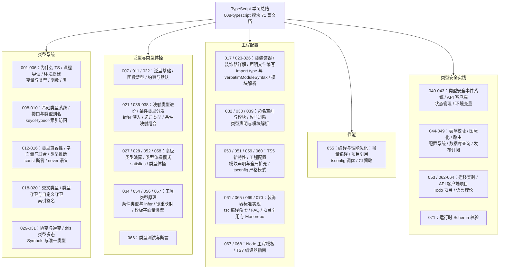

TypeScript 模块共 71 篇文档，从"为什么需要 TypeScript"讲到 TS7 新编译器指南。这篇总结把全部内容收拢为一张知识地图，并用"虚拟歌手音乐平台"这一贯穿领域重写核心示例：歌姬档案的接口、歌单的泛型函数、演唱会的判别式联合、工具类型的自制实现、严格模式下的空值防御——每个示例都在 `strict: true` 下成立。读完本文，你应该能把"让非法状态无法表示"落到自己的类型定义里。

## 前置知识

- [为什么需要 TypeScript：从 JavaScript 的烦恼说起](/typescript/001-WhyTypeScript)：JS 的类型陷阱与 TS 的价值定位。
- [TS 基础：变量与类型](/typescript/004-TSBasicsVariablesAndTypes)：基础标注语法与推断规则。
- [JavaScript 是什么](/javascript/001-WhatIsJavaScript)：TS 是 JS 的超集，语言基础决定类型学习的上限。

## 学习目标

1. 综合运用接口、联合、字面量与推断，描述业务数据形状并让非法赋值在编译期报错。
2. 用泛型函数与 `extends` 约束写出"输入输出类型联动"的通用工具。
3. 用判别式联合、类型谓词与穷尽检查把运行时判断转化为编译期保证。
4. 手写 `Partial/Pick/ReturnType` 的简化实现，解释映射类型、条件类型与 `infer` 的协作。
5. 配置一套 `strict: true` 的 tsconfig，并用项目引用与增量编译控制大型仓库的编译时间。

## 知识地图



## 核心概念回顾

### 1. 基础标注与类型推断

TypeScript 是 JS 的超集：所有合法 JS 都是合法 TS，编译器（更准确说是转译器）去掉类型标注后交给运行时。标注的黄金法则是"能推断就不标注"：变量初始化、函数返回值大多可自动推断，需要标注的是函数参数、公开 API 边界与"先声明后赋值"的变量。联合类型与字面量类型让"合法取值集合"成为类型本身，把业务规则写进编译期。

```typescript
// 1. 声明时初始化，类型自动推断，无需显式标注
const platform = '虚拟歌手音乐平台';
let playCount = 0;                       // 推断为 number

// 2. 字面量联合：状态只能取三个值之一
type SingerStatus = 'active' | 'hiatus' | 'retired';

// 3. 接口描述对象形状，是数据契约的最小单元
interface VSinger {
  name: string;
  themeColor: string;                    // 应援色 HEX
  status: SingerStatus;
}

const miku: VSinger = {
  name: '初音未来',
  themeColor: '#39C5BB',
  status: 'active',                      // 4. 写成 'onTour' 会直接编译报错
};
```

### 2. 接口、类型别名与联合的分工

`interface` 与 `type` 大多数场景可互换：前者面向对象形状、支持声明合并，后者能表达联合、元组、映射等一切类型。组合数据的核心武器是判别式联合——给每个成员一个字面量"标签"字段，编译器依据标签自动收窄成员，配合穷尽检查（default 分支落到 `never`）保证新增成员时旧代码立刻报错。这套组合是 TS 模块 040 篇"类型安全事件系统"的地基。

```typescript
// 1. 判别式联合：kind 字段是每个成员的"标签"
type Concert =
  | { kind: 'offline'; venue: string }
  | { kind: 'online'; streamUrl: string };

// 2. 穷尽检查：switch 依据标签收窄，漏写分支时 never 报错
function openConcert(c: Concert): string {
  switch (c.kind) {
    case 'offline':
      return `线下场：${c.venue}`;
    case 'online':
      return `线上场：${c.streamUrl}`;
    default: {
      const _exhaustive: never = c;      // 3. 新增成员时此行立即编译报错
      return _exhaustive;
    }
  }
}

console.log(openConcert({ kind: 'offline', venue: 'MAGICAL MIRAI' }));
```

### 3. 泛型与约束

泛型是"类型的形参"：`identity<T>` 保证传入与返回的类型一致，而 `any` 只会让类型信息在出口处蒸发。真实业务中泛型几乎总要加约束——`T extends Titled` 声明"至少要有 title 字段"，既保住灵活性又保住成员访问的合法性。泛型接口（如分页响应 `Page<T>`）与泛型约束默认值（`<T = string>`）是组织大型类型体系的支架。

```typescript
// 1. 泛型函数：T 保住参数与返回值的类型联系
function pickTop<T>(songs: T[], rank: (s: T) => number): T | undefined {
  return songs.reduce((top, cur) => (rank(cur) > rank(top) ? cur : top));
}

// 2. 约束：T 必须含 title 字段，函数体内才能访问 song.title
interface Titled { title: string }
function showTitle<T extends Titled>(song: T): string {
  return `正在播放：${song.title}`;
}

// 3. 调用时类型参数自动推断，返回类型精确到成员
const best = pickTop(
  [{ title: 'Melt', plays: 900 }, { title: 'Ghost Rule', plays: 1200 }],
  (s) => s.plays,
);
console.log(showTitle(best));            // 正在播放：Ghost Rule
```

### 4. 类型收窄与守卫

TS 的控制流分析会在 `if/switch` 后自动收窄类型：`typeof`、`instanceof`、`in`、真值判断都是内置守卫；跨函数复用判断则要自定义类型谓词 `x is T`（或 TS 3.7 的断言函数 `asserts x is T`）。收窄体系的关键认知是：运行时检查与编译期收窄必须对齐，`as` 断言是"我保证"而非"编译器验证"，能收窄就不要断言。

```typescript
// 1. strictNullChecks 下，查询结果显式携带"可能为空"的信息
function findSinger(id: number): VSinger | null {
  return id === 39
    ? { name: '初音未来', themeColor: '#39C5BB', status: 'active' }
    : null;
}

// 2. 自定义类型谓词：运行时判空 + 编译期收窄二合一
function isRealSinger(s: VSinger | null): s is VSinger {
  return s !== null;
}

const found = [39, 1].map(findSinger);            // (VSinger | null)[]
const singers = found.filter(isRealSinger);       // VSinger[]

// 3. 收窄之后访问成员，编译器不再报"可能为空"
singers.forEach((s) => console.log(`${s.name} 在册`));
```

### 5. 映射类型、条件类型与工具类型原理

内置工具类型都是三个原语的组合：映射类型 `[K in keyof T]` 遍历键集合生成新类型；条件类型 `T extends U ? X : Y` 做类型级分支（对联合类型逐成员分发）；`infer` 在条件类型里"捕获"待推断的位置。理解这三个原语，就能读懂 `Partial/Exclude/ReturnType` 的源码，也就能按团队需求自定义工具类型——这是从"会用 TS"到"会设计类型 API"的分水岭。

```typescript
// 1. 映射类型：Partial 的本质，键保留、值加可选修饰符
type MyPartial<T> = { [K in keyof T]?: T[K] };

// 2. 条件类型 + infer：从函数类型中提取返回值
type MyReturnType<T> = T extends (...args: never[]) => infer R ? R : never;

// 3. 分布式条件类型：联合类型逐成员分发，过滤掉 null 与 undefined
type NonNull<T> = T extends null | undefined ? never : T;
type Theme = NonNull<string | null>;     // string

// 4. typeof 把"值"变回"类型"，与工具类型组合成完整链路
function getSongInfo(id: number) {
  return { id, title: 'Melt', plays: 900 };
}
type SongInfo = MyReturnType<typeof getSongInfo>;
const draft: MyPartial<SongInfo> = { title: 'Ghost Rule' };  // 全字段可选
```

### 6. 模板字面量类型与 satisfies

TS 4.1 的模板字面量类型把字符串的"形状"搬进类型层：`` `#${string}` `` 约束应援色必须以井号开头，`` `${SingerEvent}-${number}` `` 能拼出事件编号类型。TS 4.9 的 `satisfies` 运算符补齐了最后一环：既用大类型校验对象合法性，又保留每个属性的具体字面量类型，兼得"检查"与"推断"。

```typescript
// 1. satisfies：用 Record 校验整体，同时保留每个键的字面量类型
const themeColors = {
  miku: '#39C5BB',
  rin: '#FFE211',
  len: '#FFE211',
} satisfies Record<string, `#${string}`>;

// 2. 访问 themeColors.miku 仍是具体字面量类型，而非宽泛的 string
type MikuColor = typeof themeColors.miku;    // "#39C5BB"

// 3. 模板字面量类型在类型层拼接事件名
type ConcertEvent = `concert-${number}`;
const ev: ConcertEvent = 'concert-2026';
const note: `MikuColor is ${MikuColor}` = `MikuColor is ${themeColors.miku}`;
console.log(themeColors.miku, ev, note);
```

### 7. tsconfig 严格模式：类型安全的地基

`strict: true` 是聚合开关：`noImplicitAny` 禁止类型悄悄退化为 any，`strictNullChecks` 把 `null/undefined` 从一切类型中隔离出来，`strictFunctionTypes` 收紧函数参数双向兼容，`strictPropertyInitialization` 强制属性初始化。在此之上还应启用 `noUncheckedIndexedAccess`（索引访问追加 `| undefined`）与 `isolatedModules`（保证单文件转译安全）。从宽松配置迁移时按文档 053 篇的路径分阶段开启，而不是一次性打开全部报错。

```typescript
// 1. strictNullChecks：null 不能悄悄赋给其他类型
function searchSinger(keyword: string): VSinger | null {
  return keyword === 'miku'
    ? { name: '初音未来', themeColor: '#39C5BB', status: 'active' }
    : null;
}

// 2. map 之后数组元素类型仍精确为 (VSinger | null)[]
const candidates = ['miku', 'luka'].map(searchSinger);

// 3. 类型谓词完成收窄，非空成员安全使用
const enrolled = candidates.filter((s): s is VSinger => s !== null);
enrolled.forEach((s) => console.log(`${s.name} 在册`));
```

### 8. 编译性能与工程组织

类型检查的代价随类型复杂度非线性增长，大型仓库的调优路径固定四步：开启 `incremental` 与 `.tsbuildinfo` 增量缓存；用项目引用（Project References）把仓库切成可独立编译的子包；类型只导入不执行（`import type`、`verbatimModuleSyntax`）以减少跨文件分析；控制类型体操深度，递归类型加上终止条件。文档 055 篇的核心结论是：类型系统的性能问题几乎都来自"过大的联合"与"过深的递归"。

```typescript
// 1. import type：只导入类型信息，编译产物中不留任何痕迹
import type { VSinger } from './types.js';

// 2. 模板字面量类型：类型层约束应援色格式，运行时零成本
type ThemeColor = `#${string}`;

// 3. as const + typeof：复用 JS 值生成只读类型，避免手写两遍
const miku = { name: '初音未来', color: '#39C5BB' } as const;
type Miku = typeof miku;

const accent: ThemeColor = '#31C6C0';    // 4. 格式不符在编译期直接报错
export type { Miku, ThemeColor, VSinger };
void accent;
```

## 易混淆概念对比

### any vs unknown

| 维度 | any | unknown |
| --- | --- | --- |
| 语义 | 放弃检查的逃生舱 | 安全的"未知类型"顶点 |
| 可赋给任意类型 | 是（不检查直接通过） | 否（必须先收窄或断言） |
| 任意类型可赋给它 | 是 | 是（这半边相同） |
| 成员访问 | 允许，编译器不再设防 | 禁止，必须先证明具体类型 |
| 传播性 | 极强，一处 any 污染整条链路 | 弱，只在收窄前限制使用 |
| catch 变量 | 旧版默认 any | TS 4.4 起默认 unknown |
| 建议 | 仅在渐进迁移的临时边界使用 | 一切"未知数据"的默认选择 |

### interface vs type

| 维度 | interface | type |
| --- | --- | --- |
| 表达范围 | 对象形状（含函数与可索引签名） | 一切类型：联合、元组、映射、条件 |
| 声明合并 | 支持，同名自动合并（扩展库类型靠它） | 不支持，同名报错 |
| extends 继承 | 单继承语法，可多 extends | 用交叉类型 `&` 组合 |
| 映射与条件 | 不能使用 | 完整支持 |
| 判别式联合成员 | 需配合 type 使用 | 原生表达 |
| 报错可读性 | 对象形状错误更友好 | 复杂组合错误信息较长 |
| 团队约定 | 公开对象契约优先 | 类型运算与联合优先 |

## 常见误区与排查

### 误区 1：用 any 或双重断言绕过检查

```typescript
// 错误：as any 让所有检查失效，错误被推迟到运行时
const data = JSON.parse(raw) as any;
console.log(data.songlist[0].title);   // 属性拼错也不会被提醒
```

```typescript
// 修正：unknown 起步，运行时校验后收窄成精确类型
const data: unknown = JSON.parse(raw);
function isSongList(v: unknown): v is Array<{ title: string }> {
  return Array.isArray(v) && v.every((s) => typeof s?.title === 'string');
}
if (isSongList(data)) console.log(data[0].title);   // 收窄后安全访问
```

### 误区 2：联合类型未收窄就访问成员

```typescript
// 错误：TSinger | null 还可能是 null，直接访问成员编译报错
function greet(singer: TSinger | null): string {
  return `欢迎 ${singer.name}`;        // Object is possibly 'null'
}
```

```typescript
// 修正：先判空收窄，再访问成员
function greet(singer: TSinger | null): string {
  if (singer === null) return '嘉宾尚未到场';
  return `欢迎 ${singer.name}`;        // 此分支里 singer 已收窄
}
interface TSinger { name: string }
```

### 误区 3：分布式条件类型把联合"打散"却没意识到

```typescript
// 错误：裸类型参数触发分发，本想"整体 extends"却逐成员判断
type IsString<T> = T extends string ? true : false;
type R = IsString<string | number>;   // boolean，而不是 false
```

```typescript
// 修正：用 [T] 包住避免分发，得到整体判断
type IsStringExact<T> = [T] extends [string] ? true : false;
type R1 = IsStringExact<string | number>;   // false
type R2 = IsStringExact<string>;            // true
```

### 误区 4：Partial 代替"全部字段可选"以外的语义

```typescript
// 错误：更新接口用 Partial 后，调用方可以什么都不传，缺陷被类型放行
interface Song { id: number; title: string; duration: number }
function update(id: number, patch: Partial<Song>): void {}
update(1, {});   // 空更新也合法，业务上无意义
```

```typescript
// 修正：要求至少一个键且键必须在 Song 中
type AtLeastOne<T> = { [K in keyof T]-?: Record<K, T[K]> }[keyof T];
function update(id: number, patch: AtLeastOne<Song>): void {}
update(1, { title: 'Melt' });   // 合法
update(1, {});                  // 编译报错：至少提供一个字段
```

### 误区 5：catch 里的错误变量直接当 Error 用

```typescript
// 错误：catch 变量默认 unknown，直接访问 message 编译报错且运行时不可靠
try {
  throw new Error('上传失败');
} catch (err) {
  console.log(err.message);        // Object is of type 'unknown'
}
```

```typescript
// 修正：先用收窄确认形态，再读取属性
try {
  throw new Error('上传失败');
} catch (err: unknown) {
  const message = err instanceof Error ? err.message : String(err);
  console.log(`歌曲上传失败：${message}`);
}
```

### 误区 6：枚举当常量联合的替代品滥用

```typescript
// 错误：数字枚举产生双向映射与运行时对象，编译目标里多出实体代码
enum Status { Active = 1, Hiatus = 2 }
const s: Status = 3;    // 旧版本下数字枚举竟然不报错（宽松兼容）
```

```typescript
// 修正：字面量联合 + as const 对象，类型与值统一且可被推断
const STATUS = { active: 'active', hiatus: 'hiatus' } as const;
type Status = (typeof STATUS)[keyof typeof STATUS];   // 'active' | 'hiatus'
const s: Status = 'onTour';   // 编译期直接报错
void s;
```

## 自检清单

- [ ] 能说清"能推断就不标注"的边界：函数参数、API 边界、延迟初始化必须标注
- [ ] 能用判别式联合加穷尽检查建模演唱会等业务状态，并保证新增成员时编译报错
- [ ] 能写出带 `extends` 约束的泛型函数，说明它与 `any` 版本的本质区别
- [ ] 能手写 `MyPartial` 与 `MyReturnType`，并解释映射、条件、infer 三者的协作
- [ ] 能解释分布式条件类型的触发条件，并用 `[T] extends [U]` 阻止分发
- [ ] 能区分类型谓词 `x is T` 与 `as` 断言的检查力度差异
- [ ] 能列出 `strict: true` 包含的关键子选项及各自拦截的缺陷
- [ ] 能用 `import type` 与项目引用优化大型仓库的编译时间
- [ ] 能说出 `satisfies` 相对类型标注与 `as const` 的双重优势
- [ ] 能为 `unknown` 类型的外部数据写一个运行时校验函数并安全收窄

## 后续学习路径

1. 精读 [条件类型与 infer](/typescript/054-ConditionalTypeInfer) 与 [模板字面量类型](/typescript/057-TemplateLiteralType)，打通类型体操的两大核心原语。
2. 按 [类型体操](/typescript/058-TypeGymnastics) 的题目序列刻意练习，用 [类型测试与断言](/typescript/066-TypeTestingAndAssertions) 为类型代码补上"单元测试"。
3. 学习 [TypeSafe API Client](/typescript/041-TypeSafeAPIClient) 与 [运行时 Schema 校验](/typescript/071-RuntimeSchemaValidation)，把类型安全推进到网络边界。
4. 按 [TypeScript 迁移实践](/typescript/053-TypeScriptMigrationPractice) 与 [项目引用与 Monorepo](/typescript/070-ProjectReferencesMonorepo) 把存量 JS 仓库分阶段迁入严格模式。
5. 以 [项目实战：类型安全 API 客户端](/typescript/062-TypeScriptProjectExampleTypeSafeAPIClient) 与 [TS7 编译器指南](/typescript/068-TypeScript7CompilerGuide) 收官，站在工具链演进的视角审视自己的工程配置。
