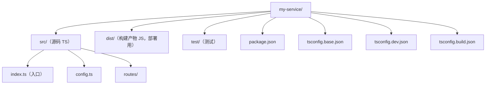

> 阅读提示：正文以代码和白话为主，不出现类型论公式。进阶文档中若出现 `Γ ⊢ e : τ` 这类记号，第一遍可完全跳过（完整规则见 `001-HowToReadThisCourse`）。


## 概述

Node.js + TypeScript 工程化的目标是让开发、构建、部署三个阶段互不干扰：开发时用热重载快速验证，构建时用 `tsc` 产出干净的 JavaScript，部署时只携带 `dist` 与生产依赖。实现这一目标的最小骨架是"固定目录 + 双 tsconfig + 三个脚本命令"：基础配置统一编译选项，开发配置开启源码映射与 watch 模式，构建配置输出到 dist 并保留类型声明。本文给出可直接套用的工程模板，逐项解释目录、配置与脚本的取舍，并列出常见的坑位。

## 目录结构



## tsconfig：一个基础 + 两个场景

```json
// tsconfig.base.json：共享编译选项
{
  "compilerOptions": {
    "target": "ES2022",
    "module": "NodeNext",
    "moduleResolution": "NodeNext",
    "strict": true,
    "outDir": "dist",
    "rootDir": "src",
    "sourceMap": true,
    "declaration": true,
    "skipLibCheck": true
  },
  "include": ["src"]
}
json
// tsconfig.dev.json：开发期只做类型检查，不产出文件
{
  "extends": "./tsconfig.base.json",
  "compilerOptions": {
    "noEmit": true
  }
}
json
// tsconfig.build.json：构建期产出 dist
{
  "extends": "./tsconfig.base.json"
}
```

## 三个脚本命令

```json
{
  "scripts": {
    "dev": "tsx watch src/index.ts",
    "build": "tsc -p tsconfig.build.json",
    "start": "node dist/index.js",
    "typecheck": "tsc -p tsconfig.dev.json"
  }
}
typescript
// src/index.ts：最小示例
import { createServer } from 'node:http';

const port = Number(process.env.PORT ?? 3000);

createServer((req, res) => {
  res.writeHead(200, { 'content-type': 'text/plain; charset=utf-8' });
  res.end('hello');
}).listen(port, () => {
  console.log(`listening on ${port}`);
});
```

开发用 `pnpm dev`（tsx 直接跑 TS），提交前 `pnpm typecheck`，
发布时 `pnpm build && pnpm start`。

## 常见误区

| 误区 | 真相 |
| --- | --- |
| 生产环境直接跑 ts-node/tsx | 部署应使用构建后的 JS，避免运行时依赖 TS 编译 |
| module 随意设成 CommonJS | ESM 项目应使用 NodeNext，让 Node 正确解析 `.js` 导入 |
| 导入写 `./config` 不写扩展名 | NodeNext 下 ESM 要求显式 `.js`（TS 源文件里写 `./config.js`） |
| dist 里混入测试文件 | `rootDir: src` + include 只编译 src，测试放 test/ 不参与构建 |

## 小结

这套骨架的核心是"开发快、构建干净、类型严格"：
`tsx` 负责开发体验，`tsc` 负责产物质量，双 tsconfig 让两件事互不干扰。
继续深化可看 tsconfig 严格模式 与
编译与性能优化。
