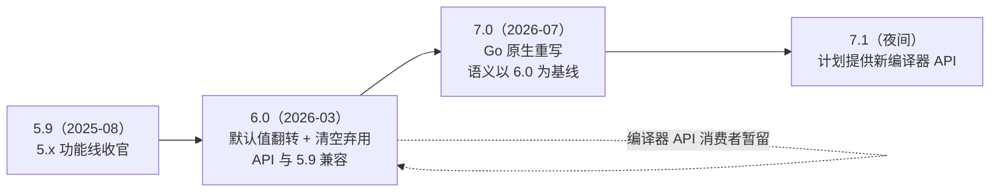

## 0. 一句话理解

> TypeScript 6.0（2026-03，当前维护版 6.0.3）是**最后一个基于 JavaScript 实现的编译器**：翻转一串默认值、清空弃用项，为换代铺路的"桥梁版本"；TypeScript 7.0（2026-07 正式发布，当前最新 7.0.2）是 Go 原生重写（原 tsgo / Native Preview），典型全量构建提速 8-12 倍，类型语义以 6.0 为对齐基线。语言本身没变，变的是"谁来执行规则、跑多快"。

打个比方：6.0 像搬家前的"断舍离"——把旧家具（弃用选项）清掉、把水电（默认值）改成新居规格；7.0 则是把整栋房子换成了钢筋结构（Go 原生），房间布局（类型系统规则）保持原样。

## 学习目标

- [ ] 能说出 6.0 与 7.0 各自的定位，以及两者"语义对齐基线"的关系
- [ ] 能列出 6.0 翻转默认值的 7 个选项，并写出防御性的 tsconfig 写法
- [ ] 能区分哪些选项在 6.0 被"弃用"（可用 `ignoreDeprecations` 压制）、哪些被"移除"
- [ ] 能判断自己的项目属于"普通用户"还是"编译器 API 消费者"，并选择对应迁移路线
- [ ] 能说出 7.0 的性能收益来源与当前的生态限制（无程序化 API、模板框架工具链）

## 1. 时间线：从双轨并进到 7.0 主线

| 时间 | 事件 |
| --- | --- |
| 2025-03 | 微软宣布 Go 原生移植：仓库 `microsoft/typescript-go`，预览包 `@typescript/native-preview`（命令 `tsgo`），宣称约 10 倍提速 |
| 2025-08 | TypeScript 5.9 发布，5.x 功能线收官 |
| 2026-03-23 | **TypeScript 6.0 正式发布**（后续补丁至 6.0.3）：最后一个基于 JS 代码库的版本，编译器 API 与 5.9 完全兼容 |
| 2026-07-08 | **TypeScript 7.0 正式发布**：经 `typescript` npm 包直接发布，`latest` 标签指向 7.0.2；`@typescript/native-preview` 完成历史使命 |
| 2026-07 起 | `typescript@next` 已是 7.1 夜间版（7.1 计划提供新的编译器 API） |

`npm` 上的 `typescript` 包 `latest` 已是 7.0.2，命令行入口仍叫 `tsc`——对多数项目，"升级"真的只是改一下依赖版本号。

## 2. 6.0 与 7.0 的关系：桥梁与对齐基线

两个版本不是"大小版本"的普通关系，而是**一次有计划的世代交接**：

1. **6.0 = 桥梁版本**。它有意做成"最后一个 JS 实现的编译器"：把 5.x 时代宽容的默认值翻到现代档、把历史弃用项清到只剩硬错误，让"新编译器的行为基线"先在稳定版里落地。它的编译器 API 与 5.9 完全兼容，工具链可以无感停留。
2. **7.0 = Go 原生重写**。类型检查、模块解析、CLI 语义均以 6.0 为对齐基线；官方给出的一致性判据是：**一份在 6.0 下（开启 `stableTypeOrdering`、未使用 `ignoreDeprecations`）干净编译的代码，在 7.0 下行为一致**。7.0 中 `stableTypeOrdering` 默认开启且不可关闭。
3. **分工**：6.0 管"规则现代化"，7.0 管"执行速度"。语言特性层面 6.0 之后趋近冻结，团队重心转向把 7.0 推向稳定——这也是为什么 6.0 的"新特性"大多是小改进与类型定义补齐。



## 3. TypeScript 6.0 详解

### 3.1 默认值翻转（迁移报错的头号来源）

6.0 一口气翻转了 7 个默认值。没显式配置的项目升级后"突然变红"，几乎全部源于此：

| 选项 | 5.x 默认 | 6.0 默认 | 升级后的典型症状 |
| --- | --- | --- | --- |
| `strict` | `false` | `true` | 隐式 `any`、可能的 `null` 未检查全部报错 |
| `module` | `commonjs`（因 `target` 而异） | `esnext` | Node 直跑 `.js` 产物出现 `import` 语句，构建管线报错 |
| `target` | `es3`/`es5` | **当年年度 ES 版本**（现为 `es2025`，逐年浮动） | 产物语法现代化，旧浏览器/旧 Node 报语法错误 |
| `noUncheckedSideEffectImports` | `false` | `true` | `import './style.css'` 拼错路径立即报错 |
| `libReplacement` | `true` | `false` | 默认不替换 lib 文件，检查行为与缓存策略变化 |
| `rootDir` | 推断（所有输入文件的最长公共目录） | `"."`（tsconfig 所在目录） | 原先"碰巧"把依赖挡在输出外的项目，目录假设被打破 |
| `types` | 注入全部 `@types/*` 包 | `[]`（仅显式声明的包） | 依赖隐式全局类型（如 `node`）的代码报"找不到名称" |

**应对策略只有一条：把这些值显式写进 tsconfig。** 写了就是"锁档"，无论留在 5.x、6.0 还是 7.0，行为都可控：

```jsonc
// tsconfig.json：迁移期防御性写法（显式声明 = 行为锁定）
{
  "compilerOptions": {
    "strict": true,                        // 显式化：接受严格模式，报错逐个处理
    "module": "esnext",                    // 显式化：模块格式不再随版本漂移
    "target": "es2025",                    // 显式化：不依赖"当年年度值"的浮动
    "types": ["node"],                     // 显式化：只注入需要的全局类型包
    "rootDir": "src",                      // 显式化：输入根目录不再被推断
    "noUncheckedSideEffectImports": true,  // 显式化：副作用导入要查存在性
    "ignoreDeprecations": "6.0"            // 过渡期压制弃用报错（7.0 起失效）
  }
}
```

### 3.2 弃用与移除清单

6.0 把 5.x 里"警告但可用"的选项升级为默认报错（`ignoreDeprecations: "6.0"` 可压制，**7.0 起该开关失效、选项彻底移除**）；少数选项直接移除：

| 类别 | 条目 | 迁移方向 |
| --- | --- | --- |
| 弃用 | `target: es5`（新的最低目标是 ES2015） | 产物需支持 IE 的场景交给 Babel/SWC 等转译器 |
| 弃用 | `--downlevelIteration` | 目标已是 ES2015+，迭代器降级编译不再需要 |
| 弃用 | `moduleResolution: node` / `node10` | 迁移到 `nodenext` 或 `bundler` |
| 弃用 | `module: amd / umd / systemjs / none` | 交给打包器处理模块格式 |
| 弃用 | `baseUrl`（不再是模块查找根；`paths` 也不再要求 `baseUrl`） | 改用相对 `paths` 或 `#/` 子路径导入 |
| 弃用 | 命名空间的 `module` 关键字写法 | 统一改用 `namespace` |
| 弃用 | 导入断言的 `asserts` 关键字（扩展到 `import()` 调用） | 改用 `with`（导入属性） |
| 弃用 | `/// <reference no-default-lib="true"/>` | 改用 `--noLib` / `lib` 配置 |
| 弃用 | `esModuleInterop: false` / `allowSyntheticDefaultImports: false` | 互操作行为固定为开启 |
| 弃用 | `alwaysStrict: false` | 严格模式固定开启 |
| **移除** | `--outFile`（多文件合并输出） | 改用打包器（esbuild/Rollup 等） |
| **移除** | `moduleResolution: classic` | 改用 `bundler` / `nodenext` |
| **报错** | tsconfig.json 存在时再在命令行传文件（TS5112） | 用 `--ignoreConfig` 或干脆只依赖 tsconfig |

这里有个容易被忽略的点：**`baseUrl` 弃用后，`paths` 不再要求先写 `baseUrl`**，可以直接写相对于 tsconfig 的映射，monorepo 的路径别名配置因此更简洁。

### 3.3 语言与类型层的正向改进

6.0 不只是"删东西"，也带来一批小而实的改进：

```typescript
// 1) this 不再"无谓地"触发上下文敏感：未使用 this 的函数表达式参数
//    不再按 this 类型参与推断，泛型调用的报错面明显收窄
function map<T, U>(arr: T[], fn: (item: T) => U): U[] { /* ... */ return [] as U[]; }
const nums = map([1, 2, 3], (n) => n * 2);   // 6.0 前某些嵌套写法会误伤推断

// 2) "#/" 开头的子路径导入（module: nodenext 或 bundler 下）
//    对应 package.json 的 "imports" 字段，包内私有路径不外泄
import { helper } from "#/utils/helper.js";

// 3) moduleResolution: bundler 终于可以与 module: commonjs 组合
//    （此前 bundler 仅限 module: esnext / preserve）

// 4) lib 层面跟进 ES2025 与新提案（target/lib es2025）：
const esc = RegExp.escape("a.b(c)");                 // ES2025：正则元字符转义
const m = new Map<string, number>();
m.getOrInsert("k", 0);                                // upsert 家族：getOrInsert
m.getOrInsertComputed("k2", () => Date.now());        // getOrInsertComputed
const temp = Temporal.Now.instant();                  // Temporal：Stage 4 定稿后的内置类型
```

另外三项"基础设施"级变化：

- **`--stableTypeOrdering`**：让诊断信息里类型的展示顺序稳定化（旧的实现顺序依赖哈希表，同一类型可能在报错/悬停中呈现不同顺序）。6.0 作为可选项提供（有约 25% 以内的检查减速），7.0 中默认开启且不可关闭；
- **`dom` 库并入迭代器**：`dom.iterable` 与 `dom.asynciterable` 的内容并入 `dom`，二者变成空库。`"lib": ["dom"]` 的项目自动获得 `NodeList.forEach`、`Headers` 迭代等能力；
- **实验性 codemod `ts5to6`**：官方提供的迁移工具，自动调整 `baseUrl` 与 `rootDir` 相关配置。

## 4. TypeScript 7.0 详解

### 4.1 为什么快：Go 原生 + 共享内存并行

旧编译器是"用 TypeScript 写的 TypeScript"，跑在 Node/V8 上，启动要加载几十万行 JS，类型检查是单线程的。7.0 用 Go 重写后获得三重红利：**原生执行无 JIT 预热**、**多个检查器共享同一块内存并行工作**（无需序列化/IPC）、**解析/检查/产出全流程并行**。

官方给出的实测数据（VS Code 代码库）：

| 指标 | TypeScript 6.0（JS） | TypeScript 7.0（Go） | 提升幅度 |
| --- | --- | --- | --- |
| 全量检查耗时 | 125.7 秒 | 10.6 秒 | 11.9 倍 |
| 编辑器内首次报错 | 17.5 秒 | 1.3 秒以内 | 13 倍+ |
| 内存占用 | 基线 | 通常更低 | -6% 至 -26% |

官方口径：默认配置（`--checkers 4`，即 4 个并行检查器）下典型全量构建提速 **8-12 倍**。速度与并行度的权衡可通过参数调节：

```bash
tsc --noEmit --checkers 4      # 默认：4 个并行检查器（性能/资源平衡点）
tsc --noEmit --checkers 8      # 核多内存大的 CI 机器可加码
tsc --noEmit --singleThreaded  # 退回单线程：调试、复现问题时使用
tsc --build --builders 4       # Project References 的并行构建器
```

`--watch` 模式同样重写：基于 Parcel 的 `@parcel/watcher` 的 Go 移植，文件监听更稳更快。

### 4.2 兼容性基线与有意的行为变更

7.0 的对齐承诺是：**6.0 下干净编译的代码（开 `stableTypeOrdering`、不用 `ignoreDeprecations`），7.0 下编译结果一致**。在此基线上仍有少量"有意变更"，升级前应过一遍：

```typescript
// 有意变更示例：模板字面量类型按 Unicode 码点（而非 UTF-16 码元）切分
type HeadTail<S extends string> = S extends `${infer Head}${infer Tail}`
  ? [Head, Tail]
  : never;

type R = HeadTail<"𠮷abc">;   // "𠮷" 是增补平面字符（U+20BB7，占两个码元）
// 6.0（JS 实现，按码元切）：["\uD842", "\uDFB7abc"]（字符被劈开）
// 7.0（Go 实现，按码点切）：["𠮷", "abc"]（字符保持完整）
```

JS/JSDoc 项目（纯 JS + 注释类型）的支持在 7.0 中重构，收紧了几条历史宽容行为，常用差异速查：

| JSDoc 写法 | 6.0（JS 编译器） | 7.0（Go） |
| --- | --- | --- |
| 把值直接放在期望类型的位置（`/** @type {myValue} */`） | 宽容处理 | 报错：值不是类型 |
| `@enum` 特殊语法 | 识别 | 不再特殊识别 |
| 独立的 `?`（可空简写） | 支持 | 不支持，写完整类型 |
| `@class` 使对象字面量可 `new` | 支持 | 不再生成构造器语义 |
| 表达式后缀 `!`（`/** @type {string!} */`） | 容忍 | 不支持 |
| Closure 风格函数类型 `function(string): number` | 部分容忍 | 不支持，用箭头形式 |

### 4.3 完成度与生态限制

| 能力 | 7.0 状态 |
| --- | --- |
| 解析/扫描、程序构建、模块解析、tsconfig 解析 | 完成（个别错误提示不如旧版详细，持续改进中） |
| 类型检查、JS/JSX 支持、声明文件与 JS 产出 | 完成 |
| watch / `--build`（Project References）/ 增量构建 | 完成（watch 与 builders 为重写实现） |
| 编辑器体验（LSP：自动导入、悬停展开、内联提示等） | 基本完成；VS Code 提供专用扩展，后续内置于 VS Code；Visual Studio 自动启用 |
| **编译器 API**（`ts.createProgram`、自定义 transformer 等） | **7.0 未提供**；7.1 计划提供一套"新的、不同的" API |
| 依赖旧 API 的模板框架工具链（vue-tsc、Volar、Svelte/Astro/MDX 语言工具） | 暂无法迁移，继续基于 TS 6.0 工作 |

最后一行是 7.0 当前最大的现实限制：**没有程序化 API，意味着所有"嵌进自家工具链"的消费者暂时上不了 7.0**。写 Vue/单文件组件的项目，CLI 可以换 7.0 提速，但模板类型检查仍由 6.0 驱动；Angular 是例外先行者——官方文档已支持"CLI 用 7.0、编辑器语言服务留在 6.0"的混合模式。

### 4.4 安装与并行共存

```bash
# 7.x 已是 typescript 包的稳定线，命令不变
npm install -D typescript
npx tsc --version        # 7.0.x

# 需要与 6.0 并行共存（CLI + 编译器 API 双轨）：
npm install -D @typescript/typescript6
#    该包提供两个能力：
#    1. 可执行文件 tsc6（6.0 编译器）
#    2. 再导出 TypeScript 6.0 的完整编译器 API
npx tsc6 --noEmit        # 用 6.0 跑一次全量检查

# 用 npm alias 让两代编译器同仓共存、各自独立目录
npm install -D typescript7@npm:typescript@7.0.2
npm install -D typescript6@npm:@typescript/typescript6@latest

# 追踪 7.1 夜间版（新的编译器 API 会先在这里落地）
npm install -D typescript@next
```

编辑器侧：VS Code 通过"TypeScript 7 语言服务"提供原生体验，对不兼容的 workspace 可用命令 **"Disable TypeScript 7 Language Server"** 一键回退到旧服务，灰度成本很低。

## 5. 迁移指南：普通用户 vs API 消费者

先做一次自我定位——项目里是否有代码**直接 import 编译器**：

```bash
# 清点编译器 API 依赖面：命中任何一条，就属于 API 消费者
grep -rn "require('typescript')"        src/ scripts/ --include="*.ts" --include="*.js"
grep -rn "from 'typescript'"            src/ scripts/
grep -rn "ts.createProgram|ts.factory"  src/ scripts/
# ts-morph、ts-node 的 transpileOnly 之外用法、自定义 webpack ts-loader transformer
```

| 维度 | 普通用户（只用 tsc/编辑器） | API 消费者（工具链嵌编译器） |
| --- | --- | --- |
| 可否直接上 7.0 | 可以，收益最大 | 不行（7.0 无 API），先落 6.0 |
| 必做功课 | 处理 6.0 默认值翻转与弃用项 | 同左，另需关注 7.1 新 API 形态 |
| 并行工具 | 可选 `@typescript/typescript6` 留底 | 必须：7.0 CLI + 6.0 API 双轨 |
| 库项目特别项 | 开 `isolatedDeclarations` 让 dts 产出与打包器友好 | dts 生成链（如 @microsoft/api-extractor）确认适配进度 |

**推荐迁移清单（普通用户，顺序执行）**：

1. 先在 5.9/6.0 上把 tsconfig 关键项（`strict`/`module`/`target`/`rootDir`/`types`）显式写全，全量 `tsc --noEmit` 归零；
2. 跑官方 codemod `ts5to6` 处理 `baseUrl`/`rootDir` 相关调整；
3. 清理 3.2 节弃用清单命中的条目（去掉 `ignoreDeprecations` 验证一遍）；
4. 升级到 7.0，CI 上并行跑 `tsc6` 与 `tsc` 比对一周（错误集合应一致）；
5. 切换主工具链，保留 `@typescript/typescript6` 以备回退。

**API 消费者**：停留在 6.0（API 与 5.9 兼容，无迁移成本），把"7.0 CLI + `tsc6`/6.0 API"双轨作为过渡架构，跟踪 `typescript@next`（7.1 夜间）中 API 的落地形态再评估重写量。

## 6. 常见疑问

**Q1：6.0 之后还会出 6.1、6.2 吗？**

官方定位 6.0 为桥梁版本，团队重心已转向 7.0 稳定化与 7.1 API；6.0 线以补丁维护为主（当前 6.0.3）。新语言特性应默认"不会再有"，这本身也是 6.0 存在的意义——冻结行为基线。

**Q2：7.0 这么快，能立刻给 Vue/Svelte 项目用吗？**

编辑器内 Vue/Svelte/Astro/MDX 的模板类型检查依赖程序化 API，目前只能继续跑在 TS 6.0 上。可以只把 CLI/CI 的纯检查任务切到 7.0，编辑器语言服务留在 6.0，等对应语言工具链官方宣布适配。

**Q3：`ignoreDeprecations` 能一直用下去吗？**

不能。`"ignoreDeprecations": "6.0"` 只在 6.0 生效，7.0 直接移除了这些选项本体，开关随之失效。它是缓冲带，不是豁免权。

**Q4：语言层面的知识需要重学吗？**

不需要。泛型、条件类型、类型体操、装饰器等一切类型系统知识在 7.0 原样适用；变化集中在编译器实现（速度）、默认值与少数有意行为变更（如模板字面量的码点切分）。

## 7. 动手试试

1. 给项目 tsconfig 显式写上 `strict`/`module`/`target`/`rootDir`/`types` 五项，删掉 `ignoreDeprecations` 跑一次全量检查，记录报错清单并归零；
2. 分别用 `tsc6` 与 7.0 的 `tsc` 对同一仓库跑 `--noEmit`，对比耗时与报错集合是否一致；
3. 用 `--checkers 2/4/8` 三档跑全量检查，记录耗时曲线，找出自己机器的平衡点；
4. 写一个 `HeadTail<"𠮷ab">` 泛型，分别在 6.0 与 7.0 下悬停查看结果，验证码点切分差异；
5. 在代码库中 grep 编译器 API 依赖（见第 5 节命令），确定自己的迁移路线归属。

## 8. 小结

**初学者记住这三点**：

1. 6.0（2026-03）是过渡版：把 `strict`、`target`、`module`、`rootDir`、`types` 等默认值翻到现代档并清空弃用项；7.0（2026-07）是 Go 原生编译器：快 8-12 倍，语义以 6.0 为基线；
2. 升级 90% 的工作量是"把 tsconfig 关键项显式写全 + 清理弃用选项"，与语言知识无关；
3. 类型系统知识完全不用重学——编译器换代，语言照旧。

**进阶者还需注意**：

- 7.0 没有编译器 API，`ts.createProgram` 类消费者必须双轨（7.0 CLI + `@typescript/typescript6` 的 6.0 API），新 API 预计随 7.1 落地且形态不同；
- 一致性判据：6.0 + `stableTypeOrdering` + 无 `ignoreDeprecations` 的干净编译结果 = 7.0 行为；`stableTypeOrdering` 在 7.0 不可关闭；
- 模板字面量类型按 Unicode 码点切分、JS/JSDoc 支持收紧等"有意变更"要过一遍官方清单；
- 库项目迁移前开 `isolatedDeclarations`，并确认 dts 消费链与模板框架工具链（vue-tsc 等）的适配声明。
