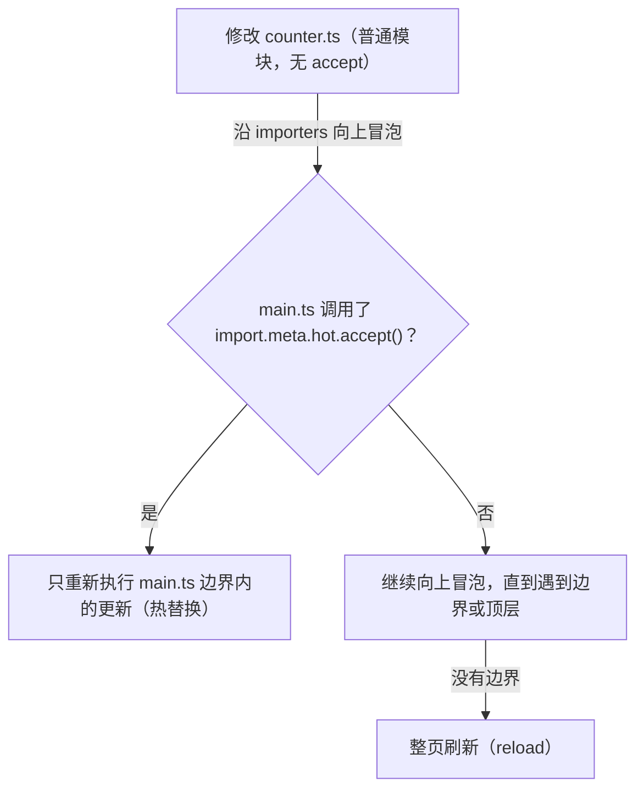

## 0. 一个类比：餐厅后厨的"尝菜"

想象你开了一家餐厅。客人点了一桌菜，如果每次厨师调整一道菜的咸淡，都要把**整桌菜**重新端出去，客人的体验会非常糟糕。真正的大厨是**在后厨先尝一口**：哪道菜咸了，只回锅重做那一道，其他菜原封不动，客人正在进行的交谈也不被打断。

Vite 开发服务器里的 HMR（Hot Module Replacement，模块热替换）干的正是这件事：

- **你写的代码 = 后厨的菜**
- **浏览器里的页面 = 客人的餐桌**
- **HMR = 后厨尝菜**：哪一行代码改了，只把"那一道菜"（那一个模块）端回后厨重做，再送回去
- **整页刷新 = 把整桌菜撤掉重上**：页面状态（输入框内容、滚动位置、弹窗）全部丢失

如果你给手机换过电池，对这个概念会更有体感：换电池是"模块级替换"，手机不需要重启；而"整页刷新"相当于关机再开机。Vite 的目标，就是让你在开发时永远只"换电池"，不"关机重启"。

## 1. 初体验：改一行代码，页面瞬间更新

先不聊原理，动手体验一次。用 002 篇的方式创建一个 Vite 项目并启动：

```bash
# 创建项目（以 vanilla-ts 模板为例）
pnpm create vite my-hmr-demo --template vanilla-ts
cd my-hmr-demo
pnpm install
pnpm dev
```

浏览器打开 `http://localhost:5173`，然后修改 `src/main.ts` 中的任意一行文本，保存。你会看到：

```text
终端输出：
[vite] hmr update /src/main.ts
页面表现：内容立即变化，页面没有闪烁、没有重新加载
```

此时打开浏览器开发者工具的 Network 面板，切到 WS（WebSocket）标签，可以看到一条条类似下面的消息：

```json
{ "type": "update", "updates": [{ "type": "js-update", "path": "/src/main.ts" }] }
```

这就是 HMR 的全部"魔法"入口：**文件一保存，一条 WebSocket 消息就从服务器推到了浏览器**。接下来我们一层层拆开，看看消息发出前后到底发生了什么。

## 2. 认识 dev server：不只是"起个本地服务"

### 2.1 传统静态服务器 vs Vite dev server

用 `python -m http.server` 或 `http-server` 也能打开一个网页，但那是"纯静态"服务：文件是什么样就发什么样，不经过任何加工。Vite 的 dev server 是"智能加工厂"：

```text
浏览器请求 /src/main.ts
        ↓
Vite dev server 收到请求
        ↓
按需转换（TS -> JS、JSX -> JS、处理 import 路径）
        ↓
返回浏览器可直接执行的 ESM 代码
```

关键点：Vite 开发环境**不打包**，浏览器直接以原生 ES Module 的方式按需请求每个文件。这正是它冷启动快的原因——不需要像 Webpack 那样先把整个项目的依赖图构建一遍。

### 2.2 依赖预构建

dev server 启动时，Vite 会做一件重要的事：把 `node_modules` 里的依赖（如 React、Vue）用 esbuild/Rolldown 预构建成 ESM，存放在 `node_modules/.vite/deps`。这样浏览器请求第三方库时，得到的是转换好、扁平化的 ESM，而不是层层嵌套的 CommonJS，加载速度大幅提升。

```text
pnpm dev 启动时的输出：
  vite v8.x.x ready in 320 ms
  Local:   http://localhost:5173/
  Network: http://192.168.1.100:5173/
```

### 2.3 冷启动与按需加载

Vite 只转换"浏览器当前真正请求到的文件"。项目有 1000 个文件，但你只打开了首页，那就只转换首页涉及的几十个文件。这就是"按需加载"：加载多少，转换多少。

## 3. server 配置总览

dev server 的行为全部通过 `vite.config.ts` 的 `server` 块配置：

```ts
// vite.config.ts
import { defineConfig } from 'vite'

export default defineConfig({
  server: {
    port: 5173,           // 指定端口，被占用时自动加 1
    strictPort: false,    // true 时端口被占用直接报错，不再自动换端口
    host: 'localhost',    // 监听地址，见第 4 节
    open: true,           // 启动后自动打开浏览器
    cors: true,           // 允许跨域访问开发资源
    https: false,         // 需要 https 时配置证书对象
    proxy: {},            // 开发期请求代理，见第 5 节
    forwardConsole: 'js', // 浏览器日志转发到终端，见第 8 节
  },
})
```

| 选项 | 默认值 | 说明 |
| --- | --- | --- |
| `port` | `5173` | 开发服务器端口，被占用时自动 +1 |
| `strictPort` | `false` | 端口被占用时是否直接报错退出 |
| `host` | `localhost` | 监听的主机名或 IP，见第 4 节 |
| `open` | `false` | 启动后自动用默认浏览器打开页面 |
| `cors` | `true` | 允许跨域请求开发资源 |
| `proxy` | 无 | 请求代理配置，见第 5 节 |
| `forwardConsole` | `'js'` | 浏览器 console 日志转发到终端，见第 8 节 |

注意：`vite preview`（预览构建产物）使用独立的 `preview` 配置块，语法与 `server` 相同但互不影响，例如 `preview.port` 默认 4173。

## 4. host 与端口：让局域网也能访问

`host` 决定 dev server 监听在哪张网卡上，直接影响"别人能不能访问到你的开发页面"：

```bash
# 仅本机可访问（默认）
pnpm dev --host localhost

# 暴露到局域网，手机/同事可访问
pnpm dev --host 0.0.0.0

# 监听全部网卡，并自动打开浏览器
pnpm dev --host 0.0.0.0 --open
```

讲解：默认 `localhost` 下，同一局域网的手机访问 `http://你的IP:5173` 会失败。改成 `0.0.0.0` 后，Vite 终端会输出 `Network: http://192.168.x.x:5173/`，其他设备即可访问。

两个常见的附加问题：

- **HTTPS**：浏览器对局域网 HTTP 环境下的敏感 API（摄像头、麦克风、蓝牙）有限制。可用 `server.https` 配置自签证书，或使用 `@vitejs/plugin-basic-ssl` 插件一键开启。
- **Node 代理**：公司网络环境下 HMR 的 WebSocket 连接可能被拦截，可配置 `server.hmr` 的相关选项解决（见第 9 节错误表）。

## 5. 代理 proxy：解决开发跨域

前后端分离开发时，前端在 `5173` 端口，后端接口在 `8080` 端口，浏览器直接请求必然遇到跨域。推荐方案是**开发代理**而不是去改后端的 CORS：

```ts
// vite.config.ts
export default defineConfig({
  server: {
    proxy: {
      // 前端请求 /api/xxx -> 转发到 http://localhost:8080/xxx
      '/api': {
        target: 'http://localhost:8080',
        changeOrigin: true,
        rewrite: (path) => path.replace(/^\/api/, ''),
      },
      // 简写形式：无 rewrite 需求时直接写目标地址
      '/socket': 'ws://localhost:3000',
    },
  },
})
```

讲解：

- `/api` 开头的请求由 dev server 转发到目标地址，**浏览器看到的仍是同源请求**（页面和接口都来自 5173），从而绕过跨域。
- `changeOrigin: true` 会把请求头中的 `Host` 改为目标地址——后端按 Host 做鉴权或路由时需要开启。
- `rewrite` 用于路径改写：去掉 `/api` 前缀、添加前缀、替换路径片段都行。
- 代理基于 http-proxy 实现，天然支持 WebSocket（`ws://` 协议）。

| 场景 | 配置要点 |
| --- | --- |
| 转发 REST API | `target` + `changeOrigin` + `rewrite` |
| 转发 WebSocket（如 HMR、聊天） | `target` 用 `ws://` 协议 |
| 转发到 HTTPS 后端 | `target` 填 https 地址 + `secure: false`（自签证书时） |
| 仅开发环境生效 | 放在 `server.proxy` 中，构建产物不受影响 |

## 6. HMR 原理：从"尝菜"到"换菜"

### 6.1 三个关键角色

HMR 能成立，靠的是三个角色各司其职：

```text
1. 文件监听器（chokidar）
   监听磁盘上的文件变化，一保存就触发

2. 模块图（ModuleGraph）
   记录"谁 import 了谁"的依赖关系，决定影响范围

3. WebSocket 通道
   服务器与浏览器之间的"对讲机"，负责推送更新消息
```

### 6.2 模块图：谁依赖谁

服务器内部维护着一张"模块关系网"。Vite 用 `ModuleGraph` 数据结构保存四类映射：

```text
urlToModuleMap      按请求 URL 找模块（如 "/src/main.ts?v=123"）
idToModuleMap       按解析后的模块 ID 找模块（绝对路径）
fileToModulesMap    按文件路径找模块（一个文件可能产生多个模块，如 .module.css）
etagToModuleMap     按 ETag 找模块（用于协商缓存，避免重复转换）
```

每个模块节点（ModuleNode）记录两条方向的边：

```text
importedModules  指向"这个模块 import 了谁"（向下依赖）
importers        指向"谁 import 了这个模块"（向上引用）
```

这两条边是 HMR 的核心。**文件变化时，Vite 沿着 `importers` 向上走**，寻找"愿意接受热更新"的边界；找到就只更新边界之下的模块，找不到就整页刷新。由于只向上走有限的层数，HMR 的耗时取决于模块深度（O(深度)）而不是项目总模块数（O(总数)），所以项目再大也能保持即时。

### 6.3 热替换 vs 整页刷新：accept 边界

"能不能热替换"取决于模块是否声明了"我接受热更新"。Vite 内部用 `isSelfAccepting`（模块自己调用了 `import.meta.hot.accept()`）和 `acceptedHmrDeps`（声明接受了哪些依赖的更新）两个标记来判断：



各类型模块的默认更新方式：

| 模块类型 | 更新方式 | 原因 |
| --- | --- | --- |
| CSS / SCSS | 样式热替换，不刷新 | 浏览器直接替换 `<link>` 标签 |
| React / Vue 组件 | 组件级热更新，状态保留 | 框架插件提供 Fast Refresh |
| 普通 JS 模块（无 accept） | 递归更新依赖它的模块，必要时整页刷新 | 没有声明更新边界 |

### 6.4 完整更新流程

把以上串起来，一次保存动作的完整链路是：

1. 你保存文件
2. chokidar 监听到文件变化
3. 服务器在 ModuleGraph 中定位受影响的模块并使其失效
4. 服务器沿 importers 向上寻找 accept 边界，计算出"更新范围"
5. 服务器通过 WebSocket 推送 { type: 'update', updates: [...] } 消息
6. 浏览器端 @vite/client 收到消息
7. 浏览器用 import() 以 "原路径?t=时间戳" 重新拉取模块（时间戳用于绕过浏览器缓存）
8. 执行对应模块的更新逻辑（React Fast Refresh / Vue 重渲染 / 你的 accept 回调）
9. 页面其余部分原封不动

注意第 7 步：浏览器重新加载模块时在 URL 后面加了时间戳参数（如 `main.ts?t=1785700000000`），这是为了防止浏览器缓存机制拦截到旧版本代码。

## 7. HMR API：import.meta.hot

框架项目里，React/Vue 插件的 HMR 是开箱即用的。但如果你在写工具函数、状态库、原生 JS 模块，想让它们也"热起来"，就需要手动接入 HMR API。

### 7.1 核心 API 一览

| API | 作用 |
| --- | --- |
| `import.meta.hot.accept(deps?, cb)` | 接受自身或指定依赖的热更新，声明"热更新边界" |
| `import.meta.hot.dispose(cb)` | 模块被替换前清理副作用（定时器、事件监听、全局变量） |
| `import.meta.hot.prune(cb)` | 模块从页面中消失（不再被任何模块引用）时清理副作用 |
| `import.meta.hot.invalidate(msg?)` | 使当前模块失效，强制走整页刷新 |
| `import.meta.hot.data` | 跨热更新保存数据的容器，状态在替换前后共享 |

### 7.2 完整示例一：可热更新的计数器

```ts
// counter.ts
// 需求：页面上的计数器在热更新后继续累加，而不是从 0 开始
let count = 0

// 从上一次热更新的 data 中恢复状态（首次加载时没有）
if (import.meta.hot && import.meta.hot.data.count !== undefined) {
  count = import.meta.hot.data.count
}

export function inc() {
  return ++count
}
export function getCount() {
  return count
}

// 声明：本模块接受热更新
if (import.meta.hot) {
  // 模块被替换前执行：把当前状态存进 data，留给新模块
  import.meta.hot.dispose(() => {
    import.meta.hot.data.count = count
  })

  // 新模块加载完成后的回调（可选，用于触发页面重新渲染）
  import.meta.hot.accept((newModule) => {
    if (newModule) {
      console.log('counter.ts 已热更新，当前计数：', newModule.getCount())
    }
  })
}
```

讲解：`dispose` 里保存状态，`accept` 回调里重新渲染——这是手写 HMR 的标准套路。`import.meta.hot.data` 在旧模块与新模块之间共享同一个对象，所以状态能"接力"。

### 7.3 完整示例二：清理定时器防泄漏

```ts
// timer.ts
// 需求：热更新时旧的定时器必须清掉，否则会出现多个定时器叠加
let seconds = 0

const timer = setInterval(() => {
  seconds++
  console.log(`已运行 ${seconds} 秒`)
}, 1000)

if (import.meta.hot) {
  // 每次热更新前清理旧定时器，防止内存泄漏和重复输出
  import.meta.hot.dispose(() => {
    clearInterval(timer)
    console.log('旧定时器已清理')
  })
}
```

### 7.4 三个容易踩的规则

1. **`accept()` 必须是字面量调用**。Vite 通过静态分析源码判断模块是否可热更新，`import.meta.hot.accept (`（带空格）或把调用包进函数再导出，都可能不被识别。
2. **`hot.data` 不能被重新赋值**。`import.meta.hot.data = {}` 是无效的，应修改其属性：`import.meta.hot.data.count = 1`。
3. **生产环境没有 `import.meta.hot`**。所有 HMR 代码必须包在 `if (import.meta.hot)` 里，这样生产构建时能被 tree-shaking 整段删掉。

## 8. forwardConsole：日志转发

Vite 8 新增的 `server.forwardConsole`（默认 `'js'`）会把**浏览器控制台日志转发到终端**，开发调试时不用在浏览器和终端之间来回切换：

```ts
// vite.config.ts
export default defineConfig({
  server: {
    // 'js' | 'all' | 'none'
    // js：转发 console.log/warn/error 等 JS 日志（默认）
    // all：额外转发网络请求等浏览器日志
    // none：关闭转发
    forwardConsole: 'all',
  },
})
```

典型场景：移动端真机调试、iframe 内日志、SSR 场景——这些情况下 DevTools 不方便打开，日志直接看终端最省事。觉得刷屏就设成 `'none'`。

## 9. 常见错误与对策表

| 现象 / 报错信息 | 常见原因 | 解决办法 |
| --- | --- | --- |
| 修改 `vite.config.ts` 或新增插件后 HMR 失灵 | 配置文件与插件列表变更不会触发 HMR，需重启 | 手动重启 dev server：`pnpm dev` |
| 热更新变成了整页刷新（页面闪一下） | 修改的模块没有 accept 边界，冒泡到了顶层 | 给模块加 `import.meta.hot.accept()`，或用框架插件（React/Vue） |
| React 组件热更新后 state 丢失 | 缺少 `@vitejs/plugin-react`，无法获得 Fast Refresh | 安装并注册 `@vitejs/plugin-react` |
| 网络面板 WS 一直报错、页面不更新 | 代理配置把 HMR 的 WebSocket 请求拦走了 | 代理中为 HMR 路径放行，或配置 `server.hmr` 的端口/协议 |
| `Failed to connect websocket` 或公司网络下 HMR 失效 | 内网拦截了 WebSocket 长连接 | 配置 `server.hmr: { protocol: 'wss' }` 等，或改用 `--host` 直连 |
| 修改普通 `.ts` 工具模块后状态初始化了 | 模块自身的顶层副作用在热更新时重新执行 | 用 `hot.data` 保存状态、`hot.dispose` 清理旧副作用 |
| 端口被占用且 `strictPort: true` | 端口冲突 | 换端口，或 `lsof -i:5173` 查占用进程后处理 |
| 代理不生效、接口 404 | 请求没走代理前缀，或 `rewrite` 误删了路径 | 确认请求路径以 `/api` 开头，检查 `rewrite` 正则 |

## 11. 一句话记忆

HMR 就是"后厨尝菜"：保存文件后，Vite 沿着模块图向上找到 accept 边界，只把改动的模块通过 WebSocket 换掉，页面状态原封不动——把整页刷新留给实在热不起来的模块。
