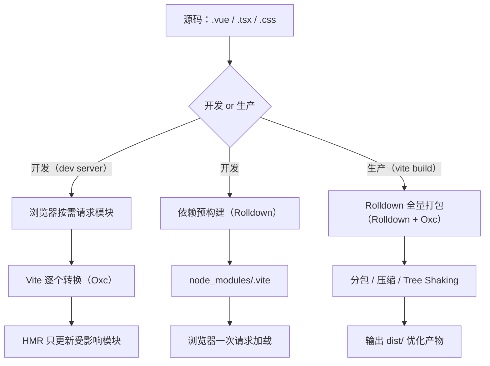

> 本节为增量补充，帮助你选择 Vite 版本。

- Vite：8.x 为当前主线（2026-09 最新为 8.2.x），依赖优化与打包已切换到 Rolldown 引擎；配套测试框架 Vitest 已迭代到 5.0（2026-09 发布）。
- 新项目 `npm create vite@latest` 默认安装 8.x；框架模板（Vue/React/Svelte）由官方维护。
- 注意：Vite 要求 Node.js 20.19+/22.12+，推荐直接使用 Node 22 LTS。


## 1. 从一个生活类比说起：快递分拣中心

先想象一个快递分拣中心。假设你从网上买了 10 件商品，分拣中心有两种处理方式：

- **方式 A（一次性打包）**：分拣员把所有包裹全部拆开，重新按收货地址装进一辆大货车，全部装完才发车。如果这时你又加购了 1 件商品，不好意思，整车要卸下来重新装。
- **方式 B（随到随发）**：每辆货车按目的地排队，哪个方向的包裹凑够了就先发；新加购的商品，只要送往同一条线路，直接补进下一班车，不影响已经发走的车。

传统打包器（如 webpack）开发时就像**方式 A**：不管页面是否需要，先把整个项目的所有文件打包成一个巨大的 bundle，浏览器一次性下载；你改一行代码，它就要把相关模块重新编译一遍，项目越大等待越久——这就是著名的"webpack 打包太慢"痛点。

Vite（法语"快"的意思，读作 /viːt/）就像**方式 B**：浏览器按需向开发服务器请求模块，服务器只处理"当前请求的那一个文件"，改一行代码只更新一个模块。本文就从这条思路出发，带你理解 Vite 为什么快、它内部做了什么。

## 2. 真实的痛点故事：等一次编译要喝几杯咖啡

时间回到 2018-2020 年，前端工程化处于 webpack 主导的时代。一个中型项目（几百个页面模块、几十个 npm 依赖）的日常是这样的：

1. 早上到公司，运行 `npm run dev`，盯着终端等 **30 秒到 3 分钟**的冷启动；
2. 每次保存代码，触发热更新，又要等 **3-10 秒**（改到公共模块甚至触发全量重编译）；
3. 项目超过 10 万行后，打包器单线程执行 JavaScript，速度肉眼可见地变慢。

这背后是打包器的固有缺陷：**开发阶段不该打包**。开发时我们只需要"浏览器能跑的代码"，而不是"最优化压缩的产物"。把"编译"和"打包"这两个本来可以分开的动作强行合并，就产生了大量无效等待。

Vite 的解法是一句话：**开发时让浏览器自己按需加载模块，服务器只做"翻译"**。这正是浏览器原生 ES Modules（ESM）带来的能力。

## 3. Vite 是什么

Vite 是由 Vue 作者尤雨溪（Evan You）于 2020 年发布并开源的下一代前端构建工具，2021 年起成为 Vue 官方推荐，随后被 React、Svelte、Astro 等生态广泛采用。它由两大部分组成：

| 组成 | 负责什么 | 关键能力 |
| --- | --- | --- |
| 开发服务器（dev server） | 本地开发阶段 | 冷启动快、HMR 毫秒级、按需编译 |
| 构建器（bundler） | 生产构建阶段 | 打包、代码分割、压缩、生成优化产物 |

两条管线分开设计，各司其职，这就是 Vite 的核心架构思想。理解"开发与生产是两套不同逻辑"，是理解 Vite 一切行为的总钥匙。

## 4. 原理一：原生 ESM 与按需编译

### 4.1 直观理解

ES Modules 是 JavaScript 官方规定的模块标准。浏览器原生支持它：在 HTML 中写 `<script type="module">`，浏览器就会按 `import` 语句**自动、按需地**去网络上下载每一个模块文件，不需要任何打包器参与。

```html
<!-- index.html：浏览器原生支持的模块加载方式 -->
<script type="module" src="/src/main.js"></script>
```

```js
// main.js 被浏览器下载后，它 import 谁，浏览器就去下载谁
import { renderHeader } from './components/Header.js'
import { renderFooter } from './components/Footer.js'

renderHeader()
renderFooter()
```

### 4.2 原理

传统打包器在开发阶段会把所有源码打包成一个 bundle，浏览器拿到的是"成品大礼包"；Vite 反其道而行，开发阶段**不做打包**，浏览器直接请求哪个文件，Vite 才转换哪个文件：

```text
传统方式：所有源码 -> 打包成一个 bundle -> 浏览器下载 -> 执行
Vite 方式：浏览器按需请求每个模块 -> Vite 逐个转换 -> 浏览器执行
```

这样做的好处是：**冷启动速度与项目规模几乎无关**。项目从 10 个模块涨到 1000 个模块，首次启动依然是"浏览器发起第一个请求"那点时间，因为 Vite 不需要预先知道全部代码。

### 4.3 局限与补齐

浏览器原生只能识别标准的 `.js` 文件，那 `.ts`、`.tsx`、`.vue` 怎么办？Vite 的 dev server 会拦截这些请求，在返回前把它们"翻译"成浏览器可执行的 JavaScript：

```text
浏览器请求 /src/App.tsx
    -> Vite 服务器拦截
    -> 用 Oxc 转译器把 TypeScript 转成 JavaScript
    -> 返回给浏览器执行
```

这个"翻译"是**单文件级别**的，只处理当前请求的文件，因此速度极快。Vite 8 中这个转译器是 Oxc（Rust 编写的编译器工具链），官方宣称 HMR 更新反映到浏览器的时间小于 50ms。

## 5. 原理二：依赖预构建

### 5.1 直观理解

浏览器能加载 ESM，但它加载不了 `import { useState } from 'react'` 这种**裸模块导入**（没有路径的导入）——浏览器不知道该去哪里找 `react`。另外，`node_modules` 里大量第三方包是 CommonJS 格式（`require` 写法），浏览器根本不认识；还有的包由成百上千个小文件组成，如果原样加载，浏览器要发起几百次请求，性能灾难。

### 5.2 原理

Vite 在 dev server 启动时会扫描依赖，把 `node_modules` 中的第三方包**预先合并**成少数几个 ESM 文件，缓存在 `node_modules/.vite` 目录（Vite 8 中这一步骤由 Rolldown 执行）：

```text
依赖预构建的两大收益：
1. 兼容性：CommonJS / UMD 格式的依赖转为浏览器可识别的 ESM
2. 性能：把数百个小模块合并为一个大文件，浏览器一次请求即可加载
```

依赖被重写为合法 URL 供浏览器加载：

```text
import { useState } from 'react'
        ↓ 重写为
import { useState } from '/node_modules/.vite/deps/react.js?v=3f2ebd01'
```

注意：预构建**只针对依赖**（`node_modules`），你自己的源码依然按需转换。若修改依赖版本或 Vite 版本导致缓存失效，删除 `node_modules/.vite` 目录后重启即可重建；也可以直接用 `vite --force` 强制重新预构建。

## 6. 原理三：模块热替换（HMR）

### 6.1 直观理解

没有 HMR 的开发是这样的：改一行 CSS，浏览器整页刷新，页面回到顶部，登录状态丢失，又要重新点一遍操作。HMR（Hot Module Replacement，模块热替换）让"只替换改动的那一个模块"，页面其他部分原封不动。

### 6.2 原理

Vite 内部维护一张**模块依赖图**（module graph）。当你保存文件时：

```text
1. 文件系统监听到变更
2. 找到变更文件对应的模块，以及依赖它的所有模块（上游）
3. 只把"受影响模块"的最新代码通过 WebSocket 推送给浏览器
4. 浏览器执行替换，不动其他模块
```

在开发环境，dev server 与浏览器之间建立了一条 WebSocket 长连接，这就是 HMR 能"秒级"生效的通信基础。框架级 HMR（如 React Fast Refresh、Vue SFC 热更新）由官方插件接入，脚手架模板已预先配置，无需手动设置。

## 7. 原理四：生产构建——从 Rollup 到 Rolldown

### 7.1 为什么生产环境要"打包"

开发时按需加载是为了"快"；但上线后，几百个模块意味着几百次网络请求，用户要等很久。生产构建要做的是**反过来**：把源码合并、压缩、分包，形成少量、体积小、可缓存的产物文件。这需要完整的模块图分析、Tree Shaking（摇树优化，删除未用代码）、代码分割等重型能力。

### 7.2 双引擎时代的遗产与 Vite 8 的统一

Vite 长期采用"双引擎"设计：

| 阶段 | 引擎 | 语言 | 职责 |
| --- | --- | --- | --- |
| 开发（预构建 + 转译） | esbuild | Go | 依赖预打包、TS/JSX 转换 |
| 生产（打包优化） | Rollup | JavaScript | 打包、分包、Tree Shaking |

双引擎方案让 Vite 快速成长，但也带来代价：两套转换管线、两套插件系统、行为不一致的边缘案例越积越多。

**2026 年 3 月 12 日发布的 Vite 8 终结了双引擎时代**：改用 **Rolldown**（VoidZero 团队用 Rust 编写的打包器）作为唯一打包引擎，配合 **Oxc**（Rust 编译器）做 JavaScript/TypeScript 转换。官方基准显示 Rolldown 比 Rollup 快 10-30 倍（项目越大差距越明显），性能与 esbuild 处于同一水平；实际公司案例中 Linear 的生产构建从 46 秒降到 6 秒。由于 Rolldown 兼容 Rollup 插件 API，绝大多数现有 Vite 插件无需修改即可工作。

```text
Vite 7 及之前：
  开发：esbuild（依赖预打包 + TS/JSX 转换）
  生产：Rollup（打包 + 代码分割 + Tree Shaking）
  问题：两套插件系统、两套转换规则、行为偶有差异

Vite 8：
  开发 + 生产：Rolldown（统一打包）+ Oxc（解析/转译/压缩）
  收益：一条流水线、一套插件 API、行为一致性
```

## 8. 一张图看懂 Vite 的完整工作流程



## 9. 常见错误与对策表

新手在使用 Vite 时最容易遇到以下问题：

| 序号 | 报错/现象 | 原因 | 解决办法 |
| --- | --- | --- | --- |
| 1 | 开发正常，`vite build` 却报错 | 依赖使用了浏览器不支持的新语法，而生产构建默认目标较新但不支持该语法；或 dev/build 两套管线行为差异 | 查看报错定位到具体依赖；通过 `build.target` 调整目标，或用 `@vitejs/plugin-legacy` 处理旧浏览器 |
| 2 | 裸导入报错：`Failed to resolve import "lodash"` | 依赖未安装，或 import 路径写错 | 执行 `pnpm add lodash`，检查包名拼写 |
| 3 | 修改 `vite.config.ts` 后配置不生效 | 部分插件、配置需要重启 dev server | 重启 `pnpm dev`；Vite 会自动重启大部分配置变更，但新增插件时建议手动重启 |
| 4 | HMR 不生效，保存后整页刷新 | 模块未声明接受更新；或修改了 vite 配置/新增了插件 | 检查是否为 HMR 边界场景；重启 dev server 后重试 |
| 5 | 部署后资源 404 | `base` 配置与部署路径不匹配（部署在子路径却用了默认 `/`） | 设置 `base: '/子路径/'`，参见《Vite 静态资源处理》 |
| 6 | 环境变量拿到 undefined | 变量未加 `VITE_` 前缀，或用了动态访问 `import.meta.env[key]` | 变量加 `VITE_` 前缀；使用完整字面量写法 `import.meta.env.VITE_X` |

## 10. 一句话记忆

Vite 的"快"来自三个设计：**开发时用浏览器原生 ESM 按需加载，依赖交给预构建合并，生产时用 Rolldown 全量优化——把"开发体验"和"生产质量"两条管线彻底分开**。
