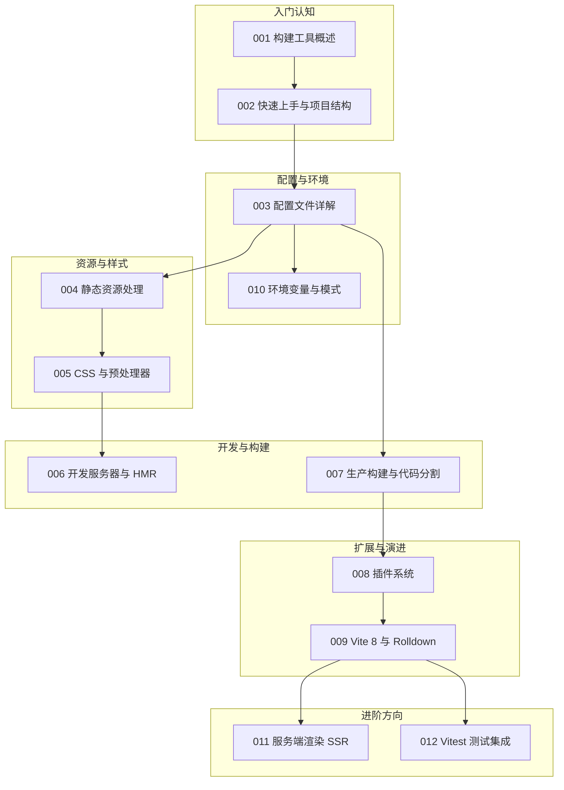

本篇是 vite 模块的收官总结。我们假设你在为"虚拟歌手音乐平台"搭建前端：站点要展示歌姬的应援色主题页、P 主的作品列表和演唱会开票倒计时。围绕这些场景，把前 12 篇文档的内容重新串一遍——开发时为什么快、资源与样式怎么走、构建产物怎么切、插件如何扩展，以及 Vite 8 的 Rolldown 单引擎意味着什么。读完请用自检清单核对掌握程度。回顾时建议自问自答：每看到一项配置，先合上文档问自己"不配会发生什么"，再展开验证。Vite 的知识分为开发期、构建期与扩展期三块，彼此独立又互相衔接，卡在哪一块就回哪一篇精读，不必从头再来。

## 前置知识

- [Vite 构建工具概述](/vite/001-ViteOverview)：原生 ESM 与依赖预构建是理解一切后续机制的前提，总结前请先回顾"快递分拣中心"类比。
- [Vite 快速上手与项目结构](/vite/002-QuickStart)：dev/build/preview 三个命令与目录结构是动手操作的基础，本文所有示例都基于该结构。

## 学习目标

1. 能解释 Vite 开发时"按需请求 + 依赖预构建"与生产时"整包构建"的两套工作模式差异。
2. 能独立编写 `vite.config.ts`，覆盖路径别名、开发代理、构建分包与环境变量等高频配置项。
3. 能为静态资源选对存放位置（public 还是 src/assets），并说清两条路径在构建期分别发生什么。
4. 能编写简单的自定义插件，理解 Rolldown 单引擎对插件生态与开发构建一致性的影响。

## 知识地图



读图按编号推进即可：001、002 打底，003 与 010 管配置，004 与 005 管资源与样式，006 管开发体验，007 与 009 管构建与引擎，008 管扩展能力，011、012 是两个待补全的进阶方向。箭头大致就是依赖关系：不理解配置，资源与代理的讨论就悬在半空；不理解构建，插件的学习也会缺一个挂靠点。

## 核心概念回顾

### 1. 为什么快：原生 ESM 与依赖预构建

传统打包器开发时要先把整个项目打成一个大 bundle；Vite 则让浏览器按需向开发服务器请求模块，改一行代码只处理一个文件。但第三方依赖动辄几百个模块请求，所以 Vite 在首次启动时用引擎把它们预构建成单文件缓存起来——这就是"冷启动一次、之后毫秒级"的原因（见[构建工具概述](/vite/001-ViteOverview)）。平台入口对歌姬主页的按需引用就是这条链路：

```html
<!-- index.html：浏览器直接请求 main.ts，开发服务器逐个转换返回 -->
<body>
  <script type="module" src="/src/main.ts"></script>
</body>
```

```typescript
// src/main.ts —— 只有当前页面用到的模块才会被请求与转换
import { renderSingerPage } from "./pages/singer"
import { themeColor } from "./config/theme" // 应援色配置，独立小模块

renderSingerPage(themeColor.miku) // 按需引入，改 theme 不必重启应用
```

依赖预构建做两件事：把几百个零散的依赖模块合并成单文件减少请求数，把 CommonJS 依赖转换成 ESM 以便浏览器直接消费。缓存位于 node_modules/.vite，只有 lockfile 或相关配置变化才会失效——开发服务器突然变慢时，先想想最近是不是动过依赖，而不是急着重启。

### 2. 配置文件：方向盘与仪表盘

`vite.config.ts` 决定端口、别名、代理、插件与构建产物形态，`defineConfig` 提供完整类型提示。音乐平台最典型的两处配置是 `@` 别名与 `/api` 代理——前端请求转发给后端歌曲服务（见[配置文件详解](/vite/003-ConfigFile)）：

```typescript
// vite.config.ts —— 平台前端的核心配置
import { defineConfig } from "vite"

export default defineConfig({
  resolve: {
    alias: { "@": "/src" } // 统一用 @ 指向 src，深层导入不再写长相对路径
  },
  server: {
    proxy: {
      // 歌曲与演唱会接口转发给后端，避免开发期跨域
      "/api": { target: "http://localhost:3000", changeOrigin: true }
    }
  }
})
```

配置文件按 vite.config.ts、mjs、js 的优先级自动加载，还能按 mode 差异化环境。写配置时牢记"不配、配、配好"的三段对比：每一项配置都应能回答"不配会怎样"，回答不了的就删掉——配置膨胀同样是需要偿还的技术债，精简的配置文件本身就是团队文档。

### 3. 静态资源：两类货架

静态资源分两种存放方式：`src/` 下的资源用 `import` 引入，参与构建（加内容哈希、可压缩、可内联）；`public/` 下的资源原样复制，适合favicon、robots.txt 这类不需要处理的文件（见[静态资源处理](/vite/004-StaticAssets)）：

```typescript
// src/pages/singer.ts —— 歌姬立绘走"加工区"，构建后获得哈希文件名
import singerCover from "@/assets/singer-cover.svg" // 参与 hash 与压缩
import themeSheet from "@/assets/theme-colors.json" // 应援色表也能 import

export function renderSingerPage(color: string) {
  document.querySelector<HTMLImageElement>("#cover")!.src = singerCover
  document.body.style.setProperty("--theme-color", color) // CSS 变量换肤
  void themeSheet
}
```

CSS Modules 的价值在多人协作时最明显：平台前端两位开发者各自的 .card 互不干扰，类名经编译后带哈希；若项目不需要局部化，普通 import 同样会走 PostCSS 流水线，获得厂商前缀补全与压缩。理解这条流水线后，样式问题的排查就有章可循：先定位是哪一站出了问题。

### 4. CSS 流水线：从 Sass 到浏览器

一段 Sass 源码要经过"入口登记、预处理器编译、PostCSS 后处理、CSS Modules 局部化、注入或抽取"五站才能生效。开发时以 `<style>` 标签注入保证 HMR 粒度，生产时抽取为独立 CSS 按需加载（见[CSS 与预处理器](/vite/005-CSSPreprocessors)）：

```css
/* src/pages/singer.module.css —— CSS Modules：类名自动局部化，不怕冲突 */
.card {
  border-left: 4px solid var(--theme-color); /* 应援色竖条，直角小圆角 */
  padding: 12px 16px;
}

.cardTitle {
  font-size: 1.125rem;
}
```

```typescript
// 组件侧按模块导入样式对象，编译期完成类名映射
import styles from "./singer.module.css"

document.querySelector("#song-card")!.className = styles.card
```

HMR 的边界决定开发体验：CSS 与框架组件有现成的热替换边界，自定义模块要靠 import.meta.hot.accept 显式接住；边界之外的改动（例如修改配置文件）只能整页重启。知道哪些改动会越界、哪些能就地替换，比记住 API 本身更重要。

### 5. 开发服务器与 HMR

HMR 的本质是"模块图 + WebSocket"：服务器监听文件变化，沿模块图找出受影响的边界，把最新模块推给浏览器就地替换，页面状态不丢失。Vite 对 CSS、Vue、React 提供开箱即用的热替换，原生模块可用 `import.meta.hot` 自定义（见[开发服务器与 HMR](/vite/006-DevServerHMR)）：

```typescript
// src/config/theme.ts —— 应援色配置热更新：改配置不用整页刷新
export const themeColor = { miku: "#39c5bb", teto: "#eba9ee" }

if (import.meta.hot) {
  // 接受自身更新，并把最新应援色同步给已渲染的页面
  import.meta.hot.accept((newModule) => {
    document.body.style.setProperty("--theme-color", newModule!.themeColor.miku)
  })
}
```

分包策略的核心是按变化频率分组：业务代码高频变化，第三方依赖低频变化，拆开后业务迭代不会击穿依赖包的浏览器缓存。优化结果应当用产物分析工具量化验证，而不是凭感觉下结论——007 篇的事故现场就是从 Network 面板与构建输出开始定位的。

### 6. 生产构建与代码分割

构建期的核心是"首屏只带必需代码"：路由懒加载把非首页切成独立 chunk，`manualChunks` 把稳定的大依赖单独分包以利用缓存，tree-shaking 顺带删掉没用到的导出。平台把演唱会压轴的重依赖单独拆包（见[生产构建与代码分割](/vite/007-BuildSplit)）：

```typescript
// src/router.ts —— 演唱会页懒加载：进入路由才下载对应 chunk
const routes = [
  { path: "/singers", component: () => import("./pages/singers") },
  { path: "/concerts", component: () => import("./pages/concerts") } // 开票页重逻辑
]
```

```typescript
// vite.config.ts 构建片段 —— 播放器大依赖单独成包，业务更新不影响其缓存
export default defineConfig({
  build: {
    rollupOptions: {
      output: {
        manualChunks: { player: ["hls.js"] } // 演唱会直播播放器独立分包
      }
    }
  }
})
```

插件的本质是"带钩子的对象"：resolveId 负责把导入解析成模块 id，load 决定源码从哪里来，transform 对源码加工，钩子返回 null 表示放行给下一个处理者。这一约定让插件像流水线工位一样自由组合，社区生态的"插口标准"也由此保持稳定。

### 7. 插件系统与 Vite 8 Rolldown

插件是带名字与钩子函数的对象：`resolveId`、`load`、`transform` 等钩子在模块解析链上各司其职，社区生态由此生长。Vite 8 用 Rust 写的 Rolldown 取代了"开发 esbuild + 生产 Rollup"的双引擎架构，开发与生产行为一致，兼容既有 Rollup 插件 API（见[插件系统](/vite/008-PluginSystem)与[Vite 8 与 Rolldown 新特性](/vite/009-Vite8Rolldown)）：

```typescript
// vite.config.ts —— 自定义插件：把应援色标记编译成主题变量
function singerThemePlugin(): Plugin {
  return {
    name: "singer-theme",
    // transform 钩子逐模块过滤并改写源码
    transform(code, id) {
      if (!id.endsWith(".theme.ts")) return null // 不匹配则跳过
      return code.replaceAll("THEME_COLOR", "#39c5bb")
    }
  }
}
```

Rolldown 单引擎最大的红利是开发与生产共享同一套行为：过去在开发服务器验证过的代码，到生产构建才发现兼容问题的时代结束了。现有插件大多无需改动即可兼容，迁移时重点做一次生产构建产物的前后对比，确认 chunk 划分与资源路径没有意外变化。

## 易混淆概念对比

静态资源放哪里最常被纠结，本质是"要不要参与构建"：

| 维度 | src/assets（import 引入） | public/（原样复制） |
| --- | --- | --- |
| 是否参与构建 | 是：哈希命名、压缩、可内联 | 否：按原文件名直接复制 |
| 引用方式 | `import cover from "./a.svg"` | `/a.svg` 根路径字符串 |
| 适用资源 | 歌姬立绘、应援色图、字体 | favicon、robots.txt、第三方固定脚本 |
| 改动影响 | 文件名变化，引用自动更新 | 需自行处理缓存版本 |

另一组关键对比是 Vite 8 前后的引擎架构，它解释了许多"开发正常、上线报错"的旧问题为何消失：

| 维度 | Vite 7 及之前（双引擎） | Vite 8（Rolldown 单引擎） |
| --- | --- | --- |
| 开发期依赖/转换 | esbuild | Rolldown（Oxc 系） |
| 生产构建 | Rollup | Rolldown |
| 行为一致性 | 两引擎行为有差异，切换处易出问题 | 一套引擎，开发与生产结果一致 |
| 插件生态 | Rollup 插件 API | 兼容 Rollup 插件 API，平滑迁移 |

## 常见误区与排查

以下五条是社区与实战里最常见的翻车姿势，每条先给错误写法，再给修正代码。

1. 需要构建处理的图片放进了 `public/`，结果既没有哈希也没有压缩，还引用不到。应移入 `src/assets` 并用 import 引入：

```typescript
// 错误：public 下的文件不参与构建，无 hash 无压缩
// const cover = "/assets/singer-cover.svg"

// 正确：import 引入，构建后自动获得内容哈希文件名
import cover from "@/assets/singer-cover.svg"
```

2. 客户端想读的环境变量没加 `VITE_` 前缀，`import.meta.env` 里永远是 undefined。变量名决定暴露范围（环境变量与模式是模块规划主题之一）：

```typescript
// 错误：没加前缀，不会暴露给客户端代码
// const api = import.meta.env.API_BASE

// 正确：VITE_ 前缀的变量才会进入 import.meta.env
const api = import.meta.env.VITE_API_BASE // 例如 "/api"
```

3. 部署到子路径后页面白屏、资源 404，因为构建时 `base` 仍是默认的 `/`。按实际部署路径配置：

```typescript
// vite.config.ts —— 平台部署在 /fandex/ 子路径下
export default defineConfig({
  base: "/fandex/" // 所有资源引用都会带上该前缀
})
```

4. 用变量拼接动态导入路径，构建器无法静态分析，打包出整个目录甚至失败。动态 import 必须给出可分析的字符串字面量起点：

```typescript
// 错误：完全动态的路径无法被静态分析
// const page = await import(`./pages/${name}.ts`)

// 正确：写死目录前缀，构建器为目录下每个模块生成对应 chunk
const page = await import(`./pages/${name}/index.ts`)
```

5. 开发代理配了 `pathRewrite`（webpack 的字段），Vite 并不认识。Vite 的代理基于 http-proxy，改写路径要用 `rewrite` 函数：

```typescript
// vite.config.ts —— 代理时去掉 /api 前缀再转发给歌曲服务
server: {
  proxy: {
    "/api": {
      target: "http://localhost:3000",
      changeOrigin: true,
      rewrite: (path) => path.replace(/^\/api/, "")
    }
  }
}
```

## 自检清单

- [ ] 能解释"浏览器按需请求模块"与"依赖预构建"分别解决了什么问题
- [ ] 能在 `vite.config.ts` 中独立完成别名、代理与端口配置，并说出每项的作用
- [ ] 面对一个新图片资源，能立刻判断该放 `public/` 还是 `src/assets` 并说明理由
- [ ] 能说出 CSS 从 Sass 源码到浏览器生效要经过的流水线各站
- [ ] 能用 `import.meta.hot` 写出自定义模块的热更新接受逻辑
- [ ] 能用路由懒加载与 `manualChunks` 把首屏 JS 体积压下来，并用产物分析验证
- [ ] 能写出一个至少含 `transform` 钩子的自定义插件
- [ ] 能说出 Vite 8 的 Rolldown 单引擎改变了什么、为什么兼容旧插件

总结的意义不在覆盖全部细节，而在需要时知道去哪找：开发服务器变慢查 001 与 006，包体积超标查 007，开发与生产行为不一致查 009，样式问题查 005，想写插件查 008。把这份"问题到文档"的映射留在脑子里，比背诵任何一段配置都有用。

## 后续学习路径

1. 补齐配置细节：精读[配置文件详解](/vite/003-ConfigFile)的"不配、配、配好"三段对比，把每一项为什么存在讲给自己听。
2. 深入开发体验：按[开发服务器与 HMR](/vite/006-DevServerHMR)复现模块图与热替换边界的实验。
3. 优化生产产物：跟随[生产构建与代码分割](/vite/007-BuildSplit)从事故现场走一遍优化链路，再读[插件系统](/vite/008-PluginSystem)尝试动手写插件。
4. 展望架构演进：阅读[Vite 8 与 Rolldown 新特性](/vite/009-Vite8Rolldown)理解单引擎时代，并关注[环境变量与模式](/vite/010-ViteEnvModes)、[服务端渲染 SSR](/vite/011-ViteSSR)、[Vitest 测试集成](/vite/012-ViteVitestTesting)的后续更新。
