## 1. 环境搭建

### 1.1 安装 Node.js

Vue3 项目需要 Node.js 环境，推荐安装最新的 LTS 版本：

- 访问 [Node.js 官网](https://nodejs.org/)
- 下载并安装适合你操作系统的 LTS 版本
- 安装完成后，在终端运行以下命令验证：

```bash
 node -v
 npm -v
```

### 1.2 安装官方脚手架（基于 Vite）

Vue 官方推荐使用 create-vue 脚手架，底层基于 Vite，交互式选择 TypeScript、Router、Pinia 等选项：

```bash
 # 官方脚手架（推荐）
 npm create vue@latest
 # 通用 Vite 模板（轻量替代）
 npm create vite@latest my-vue3-app -- --template vue
```

Vue CLI（@vue/cli）已停止新功能开发，仅用于维护存量项目，新项目不应使用。

## 2. 项目结构

一个典型的 Vue3 项目结构如下：

```mermaid
flowchart TD
    T0["my-vue3-project/"]
    T1["public/"]
    T2["favicon.ico"]
    T3["src/"]
    T4["assets/"]
    T5["logo.png"]
    T6["components/"]
    T7["HelloWorld.vue"]
    T8["router/"]
    T9["index.ts"]
    T10["store/"]
    T11["index.ts"]
    T12["views/"]
    T13["Home.vue"]
    T14["About.vue"]
    T15["App.vue"]
    T16["main.ts"]
    T17[".gitignore"]
    T18["index.html"]
    T19["package.json"]
    T20["tsconfig.json"]
    T21["vite.config.ts"]
    T22["README.md"]
    T0 --> T1
    T2 --> T3
    T16 --> T17
    T16 --> T18
    T16 --> T19
    T16 --> T20
    T16 --> T21
    T16 --> T22
```



## 3. 第一个 Vue3 应用

### 3.1 基本组件结构

创建一个简单的 Vue3 组件：

```vue
<template>
  <div class="hello">
    <h1>{{ message }}</h1>
    <button @click="count++">点击计数: {{ count }}</button>
  </div>
</template>
<script setup lang="ts">
import { ref } from 'vue';
const message = ref('Hello Vue3!');
const count = ref(0);
</script>
<style scoped>
.hello {
  text-align: center;
  margin-top: 2rem;
}
</style>
```

### 3.2 运行项目

```bash
 # 进入项目目录
 cd my-vue3-project
 # 安装依赖
 npm install
 # 启动开发服务器
 npm run dev
```

## 4. 核心概念快速了解

### 4.1 组合式 API

```vue
<script setup lang="ts">
import { ref, computed, onMounted } from 'vue';
// 响应式数据
const count = ref(0);
// 计算属性
const doubleCount = computed(() => count.value * 2);
// 生命周期钩子
onMounted(() => {
  console.log('组件挂载完成');
});
// 方法
function increment() {
  count.value++;
}
</script>
```

### 4.2 响应式系统

```vue
<script setup lang="ts">
import { ref, reactive, toRefs } from 'vue'
// 基本类型响应式
const count = ref(0)
// 对象响应式
const user = reactive({
 name: '张三',
 age: 20
}
// 解构响应式对象
const { name, age } = toRefs(user)
</script>
```

### 4.3 组件通信

#### 父传子（Props）

```vue
<!-- 父组件 -->
<template>
  <ChildComponent :message="parentMessage" />
</template>
<script setup lang="ts">
import ChildComponent from './ChildComponent.vue';
import { ref } from 'vue';
const parentMessage = ref('来自父组件的消息');
</script>
vue
<!-- 子组件 -->
<template>
  <div>{{ message }}</div>
</template>
<script setup lang="ts">
defineProps<{
  message: string;
  ;
}>();
</script>
```

#### 子传父（Emits）

```vue
<!-- 子组件 -->
<template>
  <button @click="emit('update', '来自子组件的消息')">发送消息</button>
</template>
<script setup lang="ts">
const emit = defineEmits<{
  (e: 'update', message: string): void;
  ;
}>();
</script>
vue
<!-- 父组件 -->
<template>
  <ChildComponent @update="handleUpdate" />
  <div>{{ childMessage }}</div>
</template>
<script setup lang="ts">
import ChildComponent from './ChildComponent.vue';
import { ref } from 'vue';
const childMessage = ref('');
function handleUpdate(message: string) {
  childMessage.value = message;
}
</script>
```

## 5. 路由与状态管理

### 5.1 Vue Router

安装：

```bash
npm install vue-router
```

基本配置：

```ts
 // router/index.ts
 import { createRouter, createWebHistory } from 'vue-router'
 import Home from '../views/Home.vue'
 const routes = [
  {
  path: '/',
  name: 'Home',
  component: Home
  },
  {
  path: '/about',
  name: 'About',
  component: () => import('../views/About.vue')
  }
 ]
 const router = createRouter({
  history: createWebHistory(),
  routes
 }
 export default router
```

### 5.2 Pinia 状态管理

安装：

```bash
 npm install pinia
```

基本配置：

```ts
 // store/index.ts
 import { defineStore } from 'pinia'
 export const useCounterStore = defineStore('counter', {
  state: () => ({
  count: 0
  }),
  actions: {
  increment() {
  this.count++
  }
  },
  getters: {
  doubleCount: (state) => state.count * 2
  }
 }
```

使用：

```vue
<script setup lang="ts">
import { useCounterStore } from '../store';
const counterStore = useCounterStore();
</script>
<template>
  <div>
    <p>Count: {{ counterStore.count }}</p>
    <p>Double: {{ counterStore.doubleCount }}</p>
    <button @click="counterStore.increment">Increment</button>
  </div>
</template>
```

## 6. 构建与部署

### 6.1 构建生产版本

```bash
 npm run build
```

构建产物会生成在 `dist` 目录中。

### 6.2 部署选项

- **静态网站托管**：GitHub Pages、Vercel、Netlify 等
- **服务器部署**：Nginx、Apache 等
- **容器化部署**：Docker

## 8. 快速开发提示

1. **使用 TypeScript**：提供类型安全，减少运行时错误
2. **使用 ESLint 和 Prettier**：保持代码风格一致
3. **使用 Volar**：Vue3 官方推荐的 VS Code 扩展
4. **组件拆分**：将复杂组件拆分为更小的、可复用的组件
5. **使用 composables**：提取可复用的逻辑
6. **性能优化**：使用 `v-memo`、`v-once` 等指令优化渲染性能
   通过本快速入门指南，你已经了解了 Vue3 的基本使用方法。接下来可以深入学习各个核心概念和高级特性。
