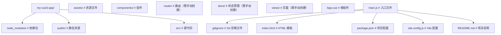

> 本节为增量补充，帮助你选择 Vue 与配套工具链版本。

- Vue：3.5.x 为当前稳定版；3.6 已进入 RC 阶段，核心变化是 Vapor 模式（无虚拟 DOM 的编译策略，已实现与虚拟 DOM 模式的功能对等）。生产项目继续用 3.5 稳定版，可在非关键路径提前试用 3.6 RC 反馈问题。
- 配套生态：Vite 8（Rolldown 驱动）做构建、Pinia 做状态、Vue Router 做路由（Router 5 已合并 unplugin-vue-router 且对 4 无破坏性变更，新项目直接用 5）、Vitest 做测试。
- 组合式 API + `<script setup>` 是新项目的默认选择，官方教程与现代实践均以它为主线；选项式 API 仍是官方完整支持的一等写法，主要用于 Vue 2 存量项目过渡与极简原型，不必刻意回避，但新代码优先组合式。


## 1. Vue3 概述 | Vue3 Overview

Vue3 是 Vue.js 框架的第三个主要版本，于 2020 年 9 月正式发布。它带来了许多重要的改进和新特性，包括：

- **组合式 API (Composition API)**：提供了一种新的方式来组织组件逻辑，使代码更易于维护和复用
- **响应式系统重构**：使用 ES6 Proxy 替代 Object.defineProperty，提供更强大的响应式能力
- **更好的 TypeScript 支持**：全面提升了 TypeScript 类型推断能力
- **性能优化**：包括虚拟 DOM 重写、编译器优化等，性能显著提升
- **更小的包体积**：通过 tree-shaking 等技术，减小了运行时体积

## 2. 环境搭建 | Environment Setup

### 2.1 安装 Node.js

Vue3 官方脚手架当前要求 Node.js `^22.18.0 || >=24.12.0`，建议安装 Node.js LTS 及以上版本。Node 版本过低是依赖安装或 Vite 启动失败的头号原因。

### 2.2 创建 Vue3 项目

官方推荐使用 create-vue 脚手架（基于 Vite 构建），它会交互式询问是否加入 TypeScript、Vue Router、Pinia、Vitest 等选项；create-vite 是通用 Vite 模板，也可以作为轻量替代：

```bash
 # 官方脚手架（推荐）
 npm create vue@latest my-vue3-app
 # 使用 create-vite 模板
 # 使用 npm
 npm create vite@latest my-vue3-app -- --template vue
 # 使用 yarn
 yarn create vite my-vue3-app --template vue
 # 使用 pnpm
 pnpm create vite my-vue3-app --template vue
```

### 2.3 项目结构

创建的 Vue3 项目结构如下：



### 2.4 安装常用依赖

```bash
 # 安装 Vue Router
 npm install vue-router
 # 安装 Pinia（Vue3 推荐的状态管理库）
 npm install pinia
 # 安装 TypeScript（可选）
 npm install typescript
 # 安装 ESLint 和 Prettier（可选）
 npm install eslint prettier
```

## 3. 第一个 Vue3 应用 | First Vue3 App

### 3.1 修改 App.vue

```vue
<template>
  <div class="app">
    <h1>Hello Vue3!</h1>
    <button @click="count++">Count: {{ count }}</button>
  </div>
</template>
<script setup>
import { ref } from 'vue';
const count = ref(0);
</script>
<style scoped>
.app {
  text-align: center;
  margin-top: 50px;
}
h1 {
  color: #42b983;
}
button {
  padding: 10px 20px;
  font-size: 16px;
  background-color: #42b983;
  color: white;
  border: none;
  border-radius: 4px;
  cursor: pointer;
}
button:hover {
  background-color: #35495e;
}
</style>
```

### 3.2 运行项目

```bash
 # 进入项目目录
 cd my-vue3-app
 # 安装依赖
 npm install
 # 启动开发服务器
 npm run dev
```

访问终端中显示的地址（通常是 `http://localhost:5173`），即可看到你的第一个 Vue3 应用。

## 4. 开发工具推荐 | Recommended Tools

- **VS Code**：推荐的代码编辑器
- **Volar**：Vue3 官方推荐的 VS Code 扩展，提供更好的 Vue3 支持
- **Vue DevTools**：浏览器扩展，用于调试 Vue 应用
- **ESLint**：代码质量检查工具
- **Prettier**：代码格式化工具

## 5. 常见问题 | Common Issues

### 6.1 无法启动开发服务器

- 检查 Node.js 版本是否符合要求
- 检查端口是否被占用
- 检查依赖是否正确安装

### 6.2 组件不显示

- 检查组件是否正确导入
- 检查组件名称是否正确
- 检查模板语法是否正确

### 6.3 响应式数据不更新

- 检查是否使用了 `ref` 或 `reactive` 来创建响应式数据
- 检查是否正确访问响应式数据（对于 `ref`，需要使用 `.value`）
- 检查是否在模板中正确使用响应式数据（模板中自动解包，不需要 `.value`）

## 6. 小结 | Summary

Vue3 带来了许多新特性和改进，使前端开发更加高效和愉快。通过本章节的学习，你已经了解了 Vue3 的基本概念和环境搭建方法，为后续的学习打下了基础。
接下来，我们将深入学习 Vue3 的组合式 API、响应式系统、组件系统等核心特性，帮助你构建更加复杂和功能丰富的 Vue3 应用。

## 应用创建

**createApp 创建应用实例**
`const <app> = createApp(<rootComponent>);`
```typescript
import { createApp } from 'vue';
import App from './App.vue';

const app = createApp(App);
```

**根组件直接对象定义**
`createApp({ setup() | data() | template | render })`
```typescript
const app = createApp({
  data() {
    return { msg: 'Hello' };
  },
  template: '<div>{{ msg }}</div>'
});
```

---

## 应用配置

**app.use 安装插件**
`app.use(<plugin>, [options]);`
```typescript
import { createApp } from 'vue';
import { createPinia } from 'pinia';
import router from './router';

const app = createApp(App);
app.use(createPinia());
app.use(router);
app.use(myPlugin, { optionKey: 'value' });
```

**app.component 全局组件注册**
`app.component(<name>, <component>);`
```typescript
app.component('MyButton', {
  template: '<button><slot/></button>'
});
// 异步组件需要用 defineAsyncComponent 包装，不能直接传 import 工厂
import { defineAsyncComponent } from 'vue';
app.component('MyComp', defineAsyncComponent(() => import('./MyComp.vue')));
```

**app.directive 全局指令注册**
`app.directive(<name>, <directive>);`
```typescript
app.directive('focus', {
  mounted(el) {
    el.focus();
  }
});
```

**app.mixin 全局混入(不推荐)**
`app.mixin(<mixin>);`
```typescript
app.mixin({
  created() {
    console.log('global mixin created');
  }
});
```

**app.provide 全局依赖注入**
`app.provide(<key>, <value>);`
```typescript
app.provide('theme', 'dark');
app.provide(Symbol('config'), { apiBase: '/api' });
```

---

## 应用挂载

**app.mount 挂载应用**
`app.mount(<container>);`
```typescript
app.mount('#app');
app.mount(document.getElementById('app'));
```

**app.unmount 卸载应用**
`app.unmount();`
```typescript
const app = createApp(App);
app.mount('#app');
setTimeout(() => app.unmount(), 5000);
```

---

## 应用上下文

**app.config 全局配置**
`app.config.<key> = <value>;`
```typescript
app.config.errorHandler = (err, instance, info) => {
  console.error('全局错误:', err, info);
};
app.config.warnHandler = (msg, instance, trace) => {
  console.warn(msg);
};
app.config.globalProperties.$format = (v) => v.toFixed(2);
app.config.performance = true;
// 注意：Vue 2 的 Vue.config.silent 在 Vue 3 中已移除，
// 关闭警告请改用打包时的 __DEV__ 剔除或生产构建。
```

**app.version 获取 Vue 版本**
```typescript
console.log(app.version);
```

**app.runWithContext 在应用上下文中执行**
`const <result> = app.runWithContext(<callback>);`
```typescript
const result = app.runWithContext(() => {
  return inject('theme');
});
```

---

## 应用链式调用

**链式注册与挂载**
```typescript
createApp(App)
  .use(createPinia())
  .use(router)
  .directive('focus', { mounted: (el) => el.focus() })
  .provide('apiBase', '/api')
  .mount('#app');
```
