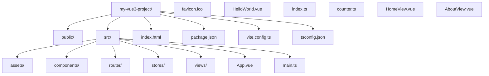

## 学习目标

- 用官方脚手架 create-vue 从零创建并跑起一个 Vue3 项目
- 认识单文件组件（SFC）三段式结构与 `<script setup>` 的基本写法
- 速览响应式数据、组件通信（props / emits / v-model）、路由与状态管理
- 知道新手最容易踩的几个坑，遇到报错能自己定位

## 前置知识

- HTML / CSS / JavaScript（ES Module 基础）：参见 [html5](/html5/010-WhatIsWebpage) 与 [javascript](/javascript/010-WhatIsJavaScript) 模块
- 命令行基本操作（cd、npm 命令）

## 1. 环境搭建

### 1.1 安装 Node.js

Vue3 项目需要 Node.js 环境，推荐安装最新的 LTS 版本：

- 访问 [Node.js 官网](https://nodejs.org/) 下载并安装 LTS 版本
- 安装完成后，在终端运行以下命令验证：

```bash
node -v
npm -v
```

### 1.2 用官方脚手架创建项目

Vue 官方推荐 create-vue 脚手架，底层基于 Vite，交互式勾选 TypeScript、Vue Router、Pinia、Vitest 等选项：

```bash
# 官方脚手架（推荐）
npm create vue@latest
# 通用 Vite 模板（轻量替代）
npm create vite@latest my-vue3-app -- --template vue
```

> Vue CLI（@vue/cli）已停止新功能开发，仅用于维护存量项目，新项目不应使用。

## 2. 项目结构

一个典型的 Vue3 项目结构如下：



要点：`main.ts` 是入口（createApp 挂载 App.vue），`App.vue` 是根组件，`views/` 放路由页面、`components/` 放可复用组件是约定俗成的分工。

## 3. 单文件组件（SFC）结构

Vue3 组件是 `.vue` 单文件组件，由三段组成：`<template>` 模板、`<script setup>` 逻辑、`<style scoped>` 样式：

```vue
<template>
  <div class="hello">
    <h1>{{ message }}</h1>
    <button @click="count++">点击计数: {{ count }}</button>
  </div>
</template>

<script setup lang="ts">
import { ref } from 'vue';

const message = ref('Hello Vue3!');
const count = ref(0);
</script>

<style scoped>
.hello {
  text-align: center;
  margin-top: 2rem;
}
</style>
```

三个关键点：

1. `{{ }}` 插值自动解包 ref，模板里写 `count` 而不是 `count.value`。
2. `<script setup>` 顶层声明的变量、函数、导入的组件，模板都能直接使用，无需 return。
3. `scoped` 让样式只作用于当前组件，避免全局污染。

## 4. 核心概念速览

### 4.1 组合式 API 三件套

```vue
<script setup lang="ts">
import { ref, computed, onMounted } from 'vue';

// 响应式数据
const count = ref(0);
// 计算属性：依赖变化自动重算，且有缓存
const doubleCount = computed(() => count.value * 2);
// 生命周期钩子
onMounted(() => {
  console.log('组件挂载完成');
});
// 方法
function increment() {
  count.value++;
}
</script>
```

### 4.2 响应式：ref 与 reactive

```vue
<script setup lang="ts">
import { ref, reactive, toRefs } from 'vue';

// 基本类型用 ref，读写要经过 .value
const count = ref(0);
// 对象可以用 reactive，直接改属性
const user = reactive({
  name: '张三',
  age: 20
});
// 解构 reactive 对象要用 toRefs，否则失去响应性
const { name, age } = toRefs(user);
</script>
```

经验法则：基本类型一律 `ref`；组合式函数返回对象时用 `ref` + 直接返回整个对象更简单，`reactive` 的解构陷阱见 [响应式系统](/vue3/050-ReactiveSystem)。

### 4.3 组件通信

#### 父传子（Props）

```vue
<!-- 父组件 -->
<template>
  <ChildComponent :message="parentMessage" />
</template>

<script setup lang="ts">
import { ref } from 'vue';
import ChildComponent from './ChildComponent.vue';

const parentMessage = ref('来自父组件的消息');
</script>
```

```vue
<!-- 子组件 ChildComponent.vue -->
<template>
  <div>{{ message }}</div>
</template>

<script setup lang="ts">
defineProps<{
  message: string;
}>();
</script>
```

#### 子传父（Emits）

```vue
<!-- 子组件 -->
<template>
  <button @click="emit('update', '来自子组件的消息')">发送消息</button>
</template>

<script setup lang="ts">
const emit = defineEmits<{
  (e: 'update', message: string): void;
}>();
</script>
```

```vue
<!-- 父组件 -->
<template>
  <ChildComponent @update="handleUpdate" />
  <div>{{ childMessage }}</div>
</template>

<script setup lang="ts">
import { ref } from 'vue';
import ChildComponent from './ChildComponent.vue';

const childMessage = ref('');
function handleUpdate(message: string) {
  childMessage.value = message;
}
</script>
```

#### 双向绑定（defineModel，Vue 3.4+）

表单类组件用 `defineModel` 一个宏搞定双向绑定，不用再手写 props + emits 对：

```vue
<!-- 子组件 CustomInput.vue -->
<template>
  <input v-model="model" placeholder="请输入" />
</template>

<script setup lang="ts">
const model = defineModel<string>();
</script>
```

```vue
<!-- 父组件 -->
<template>
  <CustomInput v-model="text" />
</template>

<script setup lang="ts">
import { ref } from 'vue';
import CustomInput from './CustomInput.vue';

const text = ref('');
</script>
```

## 5. 路由与状态管理

### 5.1 Vue Router

安装（create-vue 勾选 Router 会自动完成）：

```bash
npm install vue-router
```

基本配置：

```ts
// src/router/index.ts
import { createRouter, createWebHistory } from 'vue-router';
import Home from '../views/HomeView.vue';

const routes = [
  {
    path: '/',
    name: 'Home',
    component: Home
  },
  {
    path: '/about',
    name: 'About',
    // 路由级组件用动态 import 懒加载
    component: () => import('../views/AboutView.vue')
  }
];

const router = createRouter({
  history: createWebHistory(),
  routes
});

export default router;
```

在 `main.ts` 中 `app.use(router)`，模板里用 `<RouterView />` 渲染当前路由组件、`<RouterLink to="/about">` 做导航。系统学习见 [Vue Router 详解](/vue3/190-VueRouterDetailed)。

### 5.2 Pinia 状态管理

安装：

```bash
npm install pinia
```

定义 Store：

```ts
// src/stores/counter.ts
import { defineStore } from 'pinia';

export const useCounterStore = defineStore('counter', {
  state: () => ({
    count: 0
  }),
  actions: {
    increment() {
      this.count++;
    }
  },
  getters: {
    doubleCount: (state) => state.count * 2
  }
});
```

使用：

```vue
<script setup lang="ts">
import { useCounterStore } from '../stores/counter';

const counterStore = useCounterStore();
</script>

<template>
  <div>
    <p>Count: {{ counterStore.count }}</p>
    <p>Double: {{ counterStore.doubleCount }}</p>
    <button @click="counterStore.increment">Increment</button>
  </div>
</template>
```

> 注意：不要对 store 解构后直接使用（会丢响应性），需要解构时用 `storeToRefs(store)`。详见 [Pinia 状态管理详解](/vue3/210-PiniaStateManagementDetailed)。

## 6. 构建与部署

### 6.1 构建生产版本

```bash
npm run build
```

构建产物生成在 `dist` 目录，本地预览用 `npm run preview`。

### 6.2 部署选项

- **静态托管**：GitHub Pages、Vercel、Netlify 等
- **服务器部署**：Nginx、Apache 等（history 路由需配置回退到 index.html）
- **容器化部署**：Docker

## 7. 新手常见陷阱

| 陷阱 | 现象 | 正确做法 |
| --- | --- | --- |
| 忘写 `.value` | 脚本里改了数据视图不动 | `ref` 在 `<script>` 中必须 `count.value++`，模板中才自动解包 |
| 解构 reactive/props | 解构出来的值不再是响应式 | 用 `toRefs`，props 解构依赖 Vue 3.5+；store 用 `storeToRefs` |
| v-for 忘加 key | 列表更新错乱、动画异常 | `<li v-for="item in list" :key="item.id">`，key 用稳定 id 而非 index |
| 直接改 props | 控制台警告且数据流混乱 | 子组件通过 `emit` 通知父组件修改 |
| 用 index 当 key 且列表会增删排序 | 复用错组件、输入框串值 | 换成业务唯一 id |

## 8. 快速开发提示

1. **使用 TypeScript**：提供类型安全，减少运行时错误
2. **使用 ESLint 和 Prettier**：保持代码风格一致
3. **安装 Vue - Official（原 Volar）扩展**：Vue3 官方推荐的 VS Code 扩展，配合 vue-tsc 做类型检查
4. **安装 Vue DevTools 浏览器扩展**：可视化查看组件树、状态与路由，调试效率翻倍
5. **组件拆分**：将复杂组件拆分为更小的、可复用的组件
6. **使用 composables**：提取可复用逻辑，见 [自定义 Hook](/vue3/090-CustomHook)
7. **性能优化**：列表页可考虑 `v-memo`、`v-once`，进阶见 [性能优化实践](/vue3/340-PerformanceOptimization)

## 9. 小结

通过本指南你已经能从零创建 Vue3 项目、写出基本的 SFC 组件并跑通路由与状态管理。下一步建议按顺序学习：[模板语法](/vue3/030-Vue3TemplateSyntax) → [指令系统](/vue3/040-Vue3DirectiveSystem) → [组件系统](/vue3/110-ComponentSystem) → [响应式系统](/vue3/050-ReactiveSystem)，逐步建立完整的 Vue3 知识体系。
