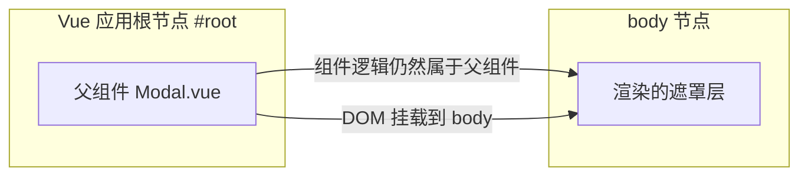
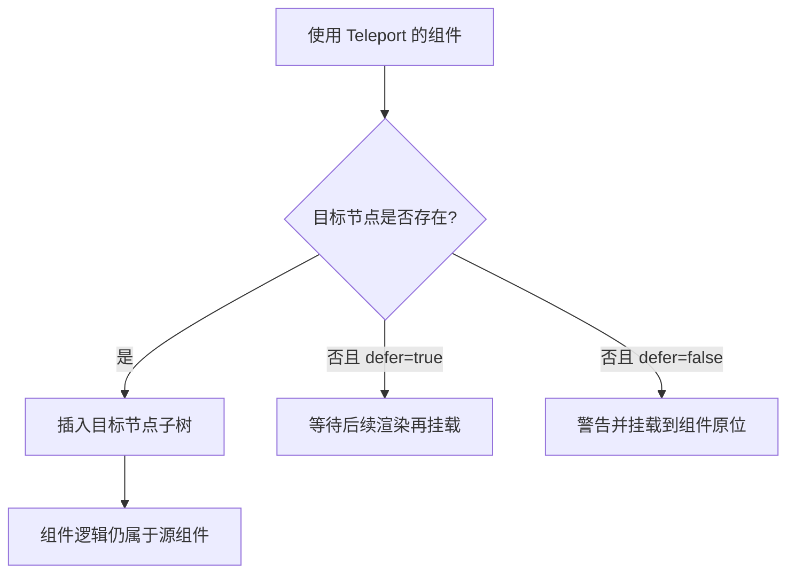

## 前置知识

- [自定义组合函数封装](/vue3/025-CustomComposableWrapper)：建议先完成前一篇的学习

## 学习目标

- 掌握「1. 历史动机与发展脉络」的核心机制、典型用法与常见陷阱
- 掌握「2. 形式化定义」的核心机制、典型用法与常见陷阱
- 掌握「3. 理论推导与原理解析」的核心机制、典型用法与常见陷阱
- 掌握「4. 代码示例（带详尽注释）」的核心机制、典型用法与常见陷阱
- 掌握「5. 对比分析」的核心机制、典型用法与常见陷阱


## 1. 历史动机与发展脉络

Teleport 的概念源于 React 的 Portal。React 16 在 2017 年正式发布 `ReactDOM.createPortal`，解决模态框、工具提示等 UI 需要渲染到 body 或指定 DOM 节点的问题。在此之前，前端开发者只能通过 `position: fixed` 加高 z-index 强行把浮层“抬”到页面顶部，但遇到父元素创建层叠上下文（如 `transform`、`filter`、`will-change`、`contain`）时，fixed 定位会被限制在父级内，浮层就会出现被裁剪、被遮挡、层级错乱等问题。

Vue 2 时代没有官方 Portal 方案，社区出现了 `vue-portal`、`portal-vue` 等第三方库。portal-vue 由 Thorsten Lünborg 维护，其设计经验直接影响了 Vue 3 的官方实现。Vue 3 在 2020 年发布时，`<Teleport>` 作为内置组件进入核心，并在后续版本中增加 `disabled` 等 props。Vue 3.4 起，Teleport 的实现经过重构，与 `<Transition>` 的配合更加稳定，多个 Teleport 共享同一目标节点时的挂载顺序也有了明确保证。

Vue 官方文档明确将 Teleport 定位为“解决 CSS 变换与层叠上下文对浮层影响”的标准工具。Vue 3.5 之后，配合内置的 `useTemplateRef` 等新 API，Teleport 目标节点的引用获取也更简单。



上图表达 Teleport 的核心：组件逻辑在左，DOM 结果在右，二者通过 Teleport 解耦。

## 2. 形式化定义

`<Teleport>` 是一个 Vue 内置组件，其形式化行为可以描述为：给定源组件 S、目标节点 T（由 `to` 指定）与子内容 C，Teleport 在 S 的渲染函数中接收 C，但在挂载阶段把 C 的根 DOM 节点插入到 T 下，而不是 S 的父节点下。

关键 props：

`to`：必填属性，类型为 `string | HTMLElement`。字符串形式是 CSS 选择器（如 `body`、`#modal-root`），Vue 会在文档中查找第一个匹配元素；也可以直接传入一个 DOM 元素对象。

`disabled`：可选属性，类型为 `boolean`，默认 `false`。当为 `true` 时，Teleport 退化为普通渲染，内容留在源组件的位置。该属性支持响应式切换，适合移动端与桌面端使用不同布局的场景。

`defer`：Vue 3.5 新增的可选属性，类型为 `boolean`。当为 `true` 时，Teleport 会等待目标节点在后续渲染中出现后再挂载，解决“目标节点本身也是动态渲染”的时序问题。

形式化约束：

第一，目标节点必须在 Teleport 挂载时已存在于文档中（除非使用 `defer`）；

第二，Teleport 的子内容仍然参与源组件的依赖追踪、生命周期与 keep-alive 缓存逻辑；

第三，多个 Teleport 指向同一目标时，按渲染顺序依次追加，后挂载的在 DOM 中位于更后面，因此在视觉上层级更高（相同 z-index 条件下）；

第四，Teleport 不改变 Vue 的虚拟 DOM 层级，因此 `$parent`、provide/inject、事件冒泡（组件事件）均不受影响。



## 3. 理论推导与原理解析

### 3.1 为什么需要 Teleport：层叠上下文推导

CSS 的层叠上下文（stacking context）由 `transform`、`filter`、`opacity < 1`、`position + z-index`、`contain` 等属性创建。一旦浮层所在父元素创建了层叠上下文，浮层的 z-index 就只能在该上下文内部比较，无法覆盖页面其他部分。

推导示例：父元素 `.card` 设置了 `transform: translateY(0)`（为了动画），内部模态框使用 `position: fixed; z-index: 9999`。由于 `transform` 使 `.card` 成为包含块与层叠上下文，模态框的 fixed 定位参照的不是视口而是 `.card`，z-index 9999 也只在与 `.card` 同级的元素之间生效。结果模态框可能被后续兄弟元素遮挡，或者定位偏移。

Teleport 的解决方案是物理上把模态框 DOM 移到 body 下，从而绕开父级的所有 CSS 约束。这正是“用 DOM 结构解决 CSS 限制”的典型工程手段。

### 3.2 虚拟 DOM 与真实 DOM 的分离

Vue 3 的渲染器（runtime-dom）在 patch 阶段区分“移动 vnode”与“挂载 vnode”。Teleport 在编译阶段生成 `Teleport` 类型的 vnode，渲染器遇到该类型时调用专门的 `process` 逻辑：目标节点解析成功后，把子 vnode 的 DOM 插入目标节点；`disabled` 为真时，则插入到当前组件容器。

因此 Teleport 的“传送”发生在渲染器层面，组件树（vnode 树）从未改变。这一设计带来两个推论：其一，`<Transition>` 包裹 Teleport 内容时过渡动画正常工作，因为过渡基于 vnode 生命周期；其二，Teleport 内容中的组件仍然可以通过 `provide/inject` 访问源组件的上下文。

### 3.3 挂载顺序推导

多个 Teleport 共享目标节点时，Vue 按子 vnode 的 patch 顺序依次 append。这意味着模板中先出现的 Teleport 内容在 DOM 中位于前面。如果要控制多个浮层的视觉层级（如提示层盖过弹窗层），应调整模板顺序或显式设置 z-index。

## 4. 代码示例（带详尽注释）

### 4.1 基础用法：把模态框传送到 body

```vue
<script setup>
import { ref } from 'vue'

// 控制模态框显示与否的响应式状态
const visible = ref(false)

// 打开与关闭函数：按钮事件会调用它们
const open = () => { visible.value = true }
const close = () => { visible.value = false }
</script>

<template>
  <div class="page">
    <!-- 页面主按钮：触发打开模态框 -->
    <button @click="open">打开模态框</button>

    <!-- Teleport 把遮罩层挂载到 body，避免父容器 overflow/transform 的影响 -->
    <Teleport to="body">
      <!-- 使用 v-if 条件渲染：visible 为 true 时才创建 DOM -->
      <div v-if="visible" class="modal-mask" @click.self="close">
        <div class="modal-panel">
          <h2>通知</h2>
          <p>这是一段由 Teleport 渲染到 body 下的内容。</p>
          <!-- 关闭按钮：阻止事件冒泡后调用 close -->
          <button @click="close">关闭</button>
        </div>
      </div>
    </Teleport>
  </div>
</template>

<style scoped>
/* scoped 样式仍然生效：Vue 会给 Teleport 内容添加 data 属性 */
.modal-mask {
  position: fixed;
  inset: 0;
  background: rgba(0, 0, 0, 0.5);
  display: flex;
  align-items: center;
  justify-content: center;
}
.modal-panel {
  background: #fff;
  padding: 24px;
  border-radius: 8px;
  min-width: 320px;
}
</style>
```

讲解：本示例是 Teleport 最标准的应用。要点有三个：`to="body"` 把 DOM 挂到 body；`v-if` 控制显示；`@click.self` 只允许点击遮罩本身时关闭，点击面板内部不触发。scoped 样式对 Teleport 内容同样生效，因为 Vue 的 scoped 机制基于编译期注入的 data 属性，与 DOM 位置无关。

### 4.2 disabled 属性的响应式切换

```vue
<script setup>
import { ref } from 'vue'

// 根据屏幕宽度决定是否启用传送
// 移动端希望浮层留在组件内做抽屉，桌面端希望挂到 body 做居中弹窗
const isMobile = ref(window.matchMedia('(max-width: 768px)').matches)

// 监听视口变化，实时更新 isMobile
window.matchMedia('(max-width: 768px)').addEventListener('change', (e) => {
  isMobile.value = e.matches
})
</script>

<template>
  <!-- disabled 为 true 时内容留在原位，为 false 时传送到 body -->
  <Teleport to="body" :disabled="isMobile">
    <div class="drawer">响应式浮层</div>
  </Teleport>
</template>
```

讲解：`disabled` 支持响应式绑定。本示例用 `matchMedia` 判断移动端，移动端渲染为组件内抽屉，桌面端渲染为 body 弹窗。需要注意 `window.matchMedia(...).addEventListener` 在新版浏览器中已取代已废弃的 `addListener`。

### 4.3 动态目标节点与 defer

```vue
<script setup>
import { ref, onMounted } from 'vue'

// 目标节点可能由其他组件动态创建
const target = ref(null)
const containerRef = ref(null)

onMounted(() => {
  // 动态创建一个挂载点元素
  target.value = document.createElement('div')
  target.value.id = 'dynamic-target'
  document.body.appendChild(target.value)
})
</script>

<template>
  <!-- defer=true 时，即使目标节点在初始渲染时还不存在，也会等它出现后再挂载 -->
  <Teleport defer :to="containerRef?.$el ?? '#dynamic-target'">
    <p>动态目标测试</p>
  </Teleport>
</template>
```

讲解：`defer` 是 Vue 3.5 新增属性，解决目标节点晚于 Teleport 渲染的时序问题。示例中目标节点在 `onMounted` 后创建，若不使用 `defer`，Teleport 在初始挂载时找不到目标，会发出警告并回退到原位渲染。

### 4.4 与 Transition 组合实现动画

```vue
<template>
  <Teleport to="body">
    <!-- Transition 包裹浮层：进入与离开都执行淡入淡出 -->
    <Transition name="fade">
      <div v-if="visible" class="modal-mask">
        <div class="modal-panel">带动画的模态框</div>
      </div>
    </Transition>
  </Teleport>
</template>

<style>
/* 过渡类名需要写在全局样式或非 scoped 样式块中 */
.fade-enter-active,
.fade-leave-active {
  transition: opacity 0.25s ease;
}
.fade-enter-from,
.fade-leave-to {
  opacity: 0;
}
</style>
```

讲解：Teleport 与 Transition 组合是官方推荐模式。进入动画在 vnode 挂载时触发，离开动画在卸载前执行，不会因为 DOM 位置改变而失效。注意过渡类名样式若写在 scoped 块中，由于 Teleport 内容与样式所在组件可能不在同一 DOM 子树，建议把过渡类名放入全局样式。

### 4.5 多 Teleport 共享目标

```vue
<template>
  <Teleport to="body">
    <div class="toast toast-a">第一条提示</div>
  </Teleport>
  <Teleport to="body">
    <div class="toast toast-b">第二条提示</div>
  </Teleport>
</template>
```

讲解：两个 Teleport 都指向 body，第一条提示在 DOM 中先出现，第二条随后追加。若两者 z-index 相同，后追加者在视觉上更靠上。需要精确控制覆盖顺序时，调整模板顺序即可。

## 5. 对比分析

### 5.1 Teleport 与 React Portal 对比

| 维度 | Vue Teleport | React createPortal |
| --- | --- | --- |
| 声明方式 | 模板内置组件 | `ReactDOM.createPortal(children, node)` |
| 目标指定 | `to` 选择器或元素 | 直接传 DOM 元素 |
| 禁用切换 | `disabled` prop | 自行条件渲染 |
| 延迟挂载 | Vue 3.5 的 `defer` | 无内置等效 |
| 事件系统 | 原生 DOM 事件仍按 DOM 树冒泡 | 合成事件按 React 树冒泡 |

讲解：两者解决同一类问题，但 Vue 把 Teleport 内置进模板系统，声明式更强；React 的 Portal 是命令式函数调用。Vue 的 DOM 事件冒泡遵循真实 DOM 结构（Teleport 后事件从 body 向上冒泡），React 的合成事件则遵循组件树，这是迁移时最容易踩的差异。

### 5.2 Teleport 与普通条件渲染对比

普通条件渲染把浮层放在组件原位，代码简单但受父级 CSS 限制；Teleport 牺牲一点可读性换取 DOM 位置的自由。工程上推荐：浮层类组件一律使用 Teleport，普通内容使用条件渲染。

### 5.3 Teleport 与 CSS 方案对比

`position: fixed` 加高 z-index 是 Teleport 出现前的常见方案，但无法解决父级 transform 创建包含块的问题。Teleport 是结构性方案，CSS 是表现性方案，两者可以共存：Teleport 解决挂载位置，CSS 解决视觉样式。

## 6. 常见陷阱与最佳实践

陷阱一：目标节点不存在。`to` 指向的选择器在挂载时找不到元素时，Vue 会告警并回退。最佳实践：在 `index.html` 中预留 `<div id="modal-root">`，或使用 `defer`。

陷阱二：scoped 样式失效的误判。Teleport 内容仍带 scope 属性，scoped 样式基本有效；但组件根节点样式选择器 `:deep()` 的行为需要测试验证。

陷阱三：在 SSR 场景使用 Teleport。服务端渲染时 Teleport 目标通常是 body，SSR 输出中浮层位置与客户端挂载后不一致，可能产生 hydration 警告。最佳实践：SSR 下用 `disabled` 或条件判断，仅在客户端渲染浮层。

陷阱四：Teleport 内容中的事件监听。原生事件冒泡按 DOM 树进行，Teleport 到 body 后，点击事件不会经过原父组件，依赖父级事件委托的代码会失效。最佳实践：在浮层内部使用组件事件或显式监听。

陷阱五：无限 Teleport 嵌套。Teleport 目标是另一个 Teleport 的内容时，需要保证目标在渲染时存在，否则产生循环依赖。

最佳实践：把模态框、通知、弹层封装成独立组件，统一使用 `<Teleport to="body">`；为每个浮层定义清晰的 z-index 规范；动画交给 Transition；内容状态交给组件自身。

## 7. 工程实践

### 7.1 全局 Modal 管理器封装

```ts
// modal-manager.ts：集中管理多个模态框的挂载与状态
import { reactive } from 'vue'

// 全局模态框注册表：每个条目包含组件与 props
interface ModalEntry {
  id: number
  component: object
  props: Record<string, unknown>
}

export const modalState = reactive<{ stack: ModalEntry[] }>({ stack: [] })

let nextId = 1

// 打开模态框：压入栈顶，后打开的在视觉上层
export function openModal(component: object, props: Record<string, unknown> = {}) {
  modalState.stack.push({ id: nextId++, component, props })
}

// 关闭指定模态框
export function closeModal(id: number) {
  const idx = modalState.stack.findIndex((m) => m.id === id)
  if (idx !== -1) modalState.stack.splice(idx, 1)
}
```

讲解：该管理器用响应式栈保存所有模态框，配合模板中的单个 Teleport 循环渲染。集中管理带来三个好处：浮层层级可控、状态可调试、多个组件可以共享打开逻辑。

```vue
<template>
  <!-- 唯一的 Teleport 出口：所有模态框都渲染在 body 下 -->
  <Teleport to="body">
    <div v-for="m in modalState.stack" :key="m.id">
      <component :is="m.component" v-bind="m.props" @close="closeModal(m.id)" />
    </div>
  </Teleport>
</template>

<script setup lang="ts">
import { modalState, closeModal } from './modal-manager'
</script>
```

讲解：`v-for` 渲染整个栈，`v-bind` 透传 props，`@close` 统一关闭。这个模式可扩展到 toast 通知、图片预览、确认框等所有浮层类 UI。

### 7.2 移动端底部抽屉与桌面端弹窗

```vue
<template>
  <!-- 移动端禁用传送，抽屉渲染在页面内；桌面端传送至 body -->
  <Teleport to="body" :disabled="isMobile">
    <Transition name="slide">
      <div v-if="open" :class="isMobile ? 'drawer' : 'dialog'">
        <slot />
      </div>
    </Transition>
  </Teleport>
</template>
```

讲解：一个组件同时服务两种形态，靠 `disabled` 响应式切换。样式类随形态变化，行为逻辑完全复用。

## 8. 案例研究：完整实现一个带遮罩的确认对话框

需求：实现 ConfirmDialog 组件，满足以下约束：挂载在 body 下；带淡入淡出动画；点击遮罩关闭；支持确认与取消回调；在 Vue Router 页面切换时自动关闭。

组件实现：

```vue
<script setup lang="ts">
import { ref, onBeforeUnmount } from 'vue'

// 对外暴露的可见状态与回调
const props = defineProps<{
  visible: boolean
  title?: string
  message?: string
}>()

const emit = defineEmits<{
  (e: 'update:visible', v: boolean): void
  (e: 'confirm'): void
  (e: 'cancel'): void
}>()

// 内部关闭：同步 visible 状态并触发 cancel
const close = () => {
  emit('update:visible', false)
  emit('cancel')
}

// 确认关闭：同步状态并触发 confirm
const confirm = () => {
  emit('update:visible', false)
  emit('confirm')
}

// 路由离开或组件卸载时自动清理
onBeforeUnmount(() => {
  emit('update:visible', false)
})
</script>

<template>
  <Teleport to="body">
    <Transition name="fade">
      <div v-if="props.visible" class="confirm-mask" @click.self="close">
        <div class="confirm-panel" role="dialog" aria-modal="true">
          <h3>{{ props.title ?? '确认操作' }}</h3>
          <p>{{ props.message }}</p>
          <div class="actions">
            <button @click="close">取消</button>
            <button class="primary" @click="confirm">确定</button>
          </div>
        </div>
      </div>
    </Transition>
  </Teleport>
</template>
```

讲解：组件通过 `v-model:visible` 双绑控制显隐，`@click.self` 实现遮罩关闭，`aria-modal` 提升无障碍支持。`onBeforeUnmount` 保证组件被销毁时状态不会残留。Teleport 确保该对话框在任何页面中都能覆盖全屏，不受路由组件容器样式影响。

配套使用：

```vue
<ConfirmDialog v-model:visible="showConfirm" title="删除确认" message="删除后不可恢复，确定继续吗？" @confirm="doDelete" />
```

## 9. 知识要点总结与深入讲解

Teleport 的核心一句话：DOM 位置可变，逻辑归属不变。理解这句话就能推导出大部分行为。

为什么 DOM 位置可变：因为 Vue 渲染器在 patch 阶段单独处理 Teleport 类型的 vnode，把子内容挂到目标节点。

为什么逻辑归属不变：因为组件树没有改变，props、事件、依赖注入、作用域插槽都按源码位置解析。

什么场景必须用 Teleport：模态框、通知、下拉浮层等需要突破父级层叠上下文与裁剪限制的 UI；什么场景不必用：普通内容布局、无需脱离文档流的元素。

`disabled` 与 `defer` 是两个容易忽略的 props：前者做响应式形态切换，后者解决目标节点时序。Vue 3.5+ 项目中应优先掌握这两个特性。

### 1. Teleport 基础

#### 1.1 基本用法

```html
<Teleport to="body">
  <div class="modal">模态框内容</div>
</Teleport>
```

`to` 属性指定目标容器，内容渲染到该容器中，但逻辑仍属于当前组件。

#### 1.2 条件传送

```html
<Teleport to="body" :disabled="isMobile">
  <Modal />
</Teleport>
```

`disabled` 为 true 时，内容渲染在原位。

### 1. 实际应用

#### 1.1 模态框

```html
<Teleport to="body">
  <div v-if="show" class="modal-overlay" @click="show = false">
    <div class="modal-content" @click.stop>
      <slot />
    </div>
  </div>
</Teleport>
```

#### 1.2 通知系统

```html
<Teleport to="#notifications">
  <TransitionGroup name="notification">
    <div v-for="n in notifications" :key="n.id" class="notification">{{ n.message }}</div>
  </TransitionGroup>
</Teleport>
```

#### 1.3 全屏遮罩

```html
<Teleport to="body">
  <div v-if="loading" class="fullscreen-loading">
    <Spinner />
  </div>
</Teleport>
```

### 2. 多 Teleport 同一目标

多个 Teleport 到同一目标时，按渲染顺序追加：

```html
<Teleport to="#modals">
  <div>A</div>
</Teleport>
<Teleport to="#modals">
  <div>b</div>
</Teleport>
<!-- 结果：a, b -->
```
