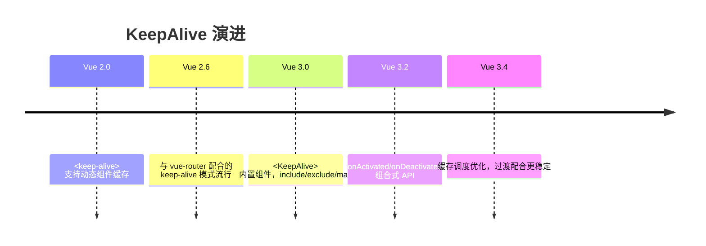
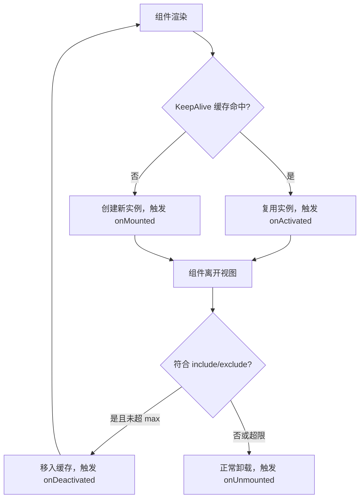

## 前置知识

- [Teleport 传送门应用](/vue3/026-TeleportPortalApp)：建议先完成前一篇的学习

## 学习目标

- 掌握「1. 历史动机与发展脉络」的核心机制、典型用法与常见陷阱
- 掌握「2. 形式化定义」的核心机制、典型用法与常见陷阱
- 掌握「3. 理论推导与原理解析」的核心机制、典型用法与常见陷阱
- 掌握「4. 代码示例（带详尽注释）」的核心机制、典型用法与常见陷阱
- 掌握「5. 对比分析」的核心机制、典型用法与常见陷阱


## 1. 历史动机与发展脉络

SPA 中组件随路由切换频繁创建与销毁。Vue 2 时期，开发者用 `<keep-alive>` 包裹动态组件保存状态，但只能缓存组件树中的组件；Vue Router 场景则需要 `keep-alive` 包裹 `<router-view>`，配合路由 meta 判断。Vue 3 保留 `<KeepAlive>`（PascalCase 命名），内部实现基于 `MoveType` 的移动缓存：被缓存组件卸载时以“失活”状态移入隐藏容器，而不是销毁。

Vue 3 的 KeepAlive 实现与 Suspense、异步组件深度集成：`defineAsyncComponent` 加载完成的组件可以被缓存；KeepAlive 内的组件卸载（`unmount`）时，若命中缓存则只执行 `deactivated` 而不执行 `unmounted`。Vue 3.4 后缓存渲染器的内部调度优化进一步减少了失活/激活的抖动。



## 2. 形式化定义

`<KeepAlive>` 是 Vue 内置组件，其行为形式化描述为：对直接子组件（通常只有一个动态子组件或 router-view）建立缓存表，键为子组件的类型标识（name 或定义对象）；当子组件卸载时，若命中 include/exclude 规则且缓存表未满，将其 vnode 与实例移入缓存容器；当子组件重新渲染时，若命中缓存，复用实例并触发 `activated`。

props：

`include`：字符串、正则或数组，匹配组件 name。匹配成功的组件才会被缓存；

`exclude`：同上，匹配成功的组件不被缓存。exclude 优先级高于 include；

`max`：数字，最大缓存实例数。超过时按 LRU（最近最少使用）淘汰最久未激活的缓存。

生命周期契约：被缓存组件在离开视图时触发 `onDeactivated`，重新进入时触发 `onActivated`；`onMounted`/`onUnmounted` 只在首次创建与最终销毁时各执行一次。



## 3. 理论推导与原理解析

### 3.1 缓存键与匹配规则

Vue 3 的 KeepAlive 使用 `getComponentName` 获取组件 name 作为匹配依据；未声明 name 的组件可以退化为组件定义对象自身。`include` 匹配采用字符串精确匹配、正则 `test` 或数组遍历。`<script setup>` 组件默认文件名即 name（Vue 3.2.34+ 支持通过 `defineOptions({ name })` 显式声明）。

### 3.2 LRU 淘汰推导

缓存表是一个 Map（有序键值）。每次命中时把键移到末尾（最近使用）；插入新缓存且数量超过 `max` 时，删除表头键（最久未使用）。推导可知：`max=10` 时，第 11 个组件进入会淘汰第 1 个，被淘汰组件真正卸载并触发 `onUnmounted`。

### 3.3 与路由的协作

`<router-view v-slot="{ Component }"><KeepAlive><component :is="Component" /></KeepAlive></router-view>` 是路由缓存的推荐形态。路由切换时，新路由组件实例进入视图，旧路由组件被缓存。`activated` 可用于判断“从缓存恢复”，从而决定是否刷新数据。

## 4. 代码示例（带详尽注释）

### 4.1 基础缓存

```vue
<script setup>
import { ref, onActivated, onDeactivated, onMounted, onUnmounted } from 'vue'

// 列表数据与滚动位置
const list = ref([])
const scrollTop = ref(0)

// 首次创建时加载数据
onMounted(async () => {
  console.log('首次挂载')
  list.value = await fetchList()
})

// 从缓存恢复时：恢复滚动位置，可按需刷新
onActivated(() => {
  console.log('从缓存激活')
  window.scrollTo(0, scrollTop.value)
})

// 离开视图进入缓存时：记录滚动位置
onDeactivated(() => {
  scrollTop.value = window.scrollY
})

// 缓存被淘汰或组件最终销毁时触发
onUnmounted(() => {
  console.log('真正卸载')
})
</script>

<template>
  <div>
    <div v-for="item in list" :key="item.id" class="item">{{ item.title }}</div>
  </div>
</template>
```

讲解：四个生命周期钩子的分工：`onMounted` 只执行一次（首次），`onActivated` 每次从缓存恢复都执行，`onDeactivated` 每次进入缓存执行，`onUnmounted` 只在淘汰时执行。这个对比是理解 KeepAlive 的关键。

### 4.2 include/exclude 控制

```vue
<script setup>
import { ref } from 'vue'
import ListPage from './ListPage.vue'
import DetailPage from './DetailPage.vue'

// 只缓存列表页，不缓存详情页
const cachedPages = ref(['ListPage'])
</script>

<template>
  <!-- include 使用逗号分隔字符串、正则或数组 -->
  <KeepAlive :include="cachedPages">
    <component :is="currentPage" />
  </KeepAlive>
</template>
```

讲解：`include` 动态变化时，被移出名单的缓存组件会立即被销毁（触发 unmounted），这是清理缓存的标准手段。

### 4.3 max 与 LRU

```vue
<template>
  <!-- 最多缓存 5 个页面，超出按最近最少使用淘汰 -->
  <KeepAlive :max="5">
    <router-view />
  </KeepAlive>
</template>
```

讲解：`max` 保护内存。用户在标签页系统中打开大量页面时，最久未访问的页面被自动销毁，避免内存无限增长。

### 4.4 与路由 meta 结合

```vue
<script setup>
import { useRoute } from 'vue-router'
const route = useRoute()
</script>

<template>
  <!-- 通过路由 meta.keepAlive 决定是否缓存 -->
  <KeepAlive :include="route.meta.keepAlive ? [route.name] : []">
    <router-view />
  </KeepAlive>
</template>
```

讲解：把缓存策略放进路由配置：`meta: { keepAlive: true }` 的页面缓存，其余不缓存。路由表成为缓存策略的单一事实来源。

### 4.5 缓存清理

```vue
<script setup>
import { ref, watch } from 'vue'

// 需要缓存的页面名列表
const keep = ref(['ListPage'])

// 用户点击“刷新”时，先清空缓存再重新进入
function refreshList() {
  keep.value = []
  // 下一帧恢复缓存名单，让组件重新创建
  requestAnimationFrame(() => {
    keep.value = ['ListPage']
  })
}
</script>

<template>
  <KeepAlive :include="keep">
    <router-view />
  </KeepAlive>
</template>
```

讲解：`include` 移除即销毁缓存实例，恢复名单后下次进入创建新实例，实现“强制刷新”。这是清理陈旧数据的官方推荐模式。

### 4.6 与 Teleport 协作

```vue
<template>
  <KeepAlive>
    <router-view v-slot="{ Component }">
      <!-- Teleport 内容也随缓存生命周期管理 -->
      <Teleport to="body">
        <component :is="Component" />
      </Teleport>
    </router-view>
  </KeepAlive>
</template>
```

讲解：KeepAlive 与 Teleport 可以组合：被缓存的页面即使 DOM 挂在 body 下，失活时也会整体移入缓存容器，不会残留浮层。

### 4.7 缓存与异步组件

```vue
<script setup>
import { defineAsyncComponent } from 'vue'

// 懒加载的重型页面组件
const HeavyPage = defineAsyncComponent(() => import('./HeavyPage.vue'))
</script>

<template>
  <KeepAlive :max="3">
    <component :is="HeavyPage" />
  </KeepAlive>
</template>
```

讲解：异步组件加载完成后可以被 KeepAlive 缓存；再次进入不需要重新发起网络请求。适合图表、编辑器等昂贵页面。

## 5. 对比分析

### 5.1 缓存组件与普通组件生命周期对比

| 阶段 | 普通组件 | KeepAlive 缓存组件 |
| --- | --- | --- |
| 首次进入 | mounted | mounted + activated |
| 离开视图 | unmounted | deactivated |
| 再次进入 | 重新创建 + mounted | activated（复用） |
| 最终销毁 | unmounted | unmounted（淘汰时） |

### 5.2 KeepAlive 与手动状态提升

把状态提升到 Pinia/父组件也能保留数据，但 DOM 状态（滚动位置、输入焦点、动画）需要手动恢复；KeepAlive 保留完整实例与 DOM，代价是内存。数据轻、DOM 重时用 KeepAlive；数据重、DOM 轻时用状态管理。

### 5.3 与 React 生态对比

React 没有内置 KeepAlive 等价物，社区方案（react-activation）模拟类似行为；Next.js 的 App Router 缓存的是 RSC 数据而非组件实例。Vue 的 KeepAlive 在“保留完整组件状态”这一点上仍是独有优势。

## 6. 常见陷阱与最佳实践

陷阱一：组件未声明 name，`include` 匹配失败。`<script setup>` 组件需 `defineOptions({ name: 'Xxx' })`。

陷阱二：把需要实时刷新的数据放进缓存组件，恢复后数据陈旧。最佳实践：`onActivated` 中按策略刷新。

陷阱三：缓存大量重型组件导致内存膨胀。最佳实践：设置 `max`，动态调整 include 名单。

陷阱四：在 `onDeactivated` 中执行销毁逻辑（如清除定时器），导致再次激活时功能缺失。定时器应继续运行或在 activated 重建。

陷阱五：KeepAlive 直接包裹多个子元素。KeepAlive 只缓存直接子组件，多子元素时应使用单根组件包裹或 v-if 切换。

陷阱六：与 Transition 组合时顺序错误。推荐 `<Transition><KeepAlive>...</KeepAlive></Transition>` 的顺序（KeepAlive 在内），并确认过渡模式。

## 7. 工程实践

### 7.1 标签页系统的缓存策略

```ts
// tabs.ts：标签页状态管理（Pinia）
import { defineStore } from 'pinia'

export const useTabsStore = defineStore('tabs', {
  state: () => ({
    // 已打开标签
    tabs: [] as Array<{ name: string; title: string }>,
    // 缓存名单：默认全部缓存，可单独关闭
    cacheable: new Set<string>()
  }),
  actions: {
    openTab(tab: { name: string; title: string }) {
      if (!this.tabs.some((t) => t.name === tab.name)) {
        this.tabs.push(tab)
        this.cacheable.add(tab.name)
      }
    },
    closeTab(name: string) {
      this.tabs = this.tabs.filter((t) => t.name !== name)
      // 关闭标签同时从缓存名单移除，销毁实例
      this.cacheable.delete(name)
    }
  }
})
```

讲解：`cacheable` 集合与 KeepAlive 的 `include` 绑定：打开标签加入缓存，关闭标签移除缓存（触发销毁）。标签页系统的内存与状态由此闭环管理。

### 7.2 表单草稿保留

表单页使用 KeepAlive 缓存后，用户误点返回再前进时草稿自动保留。配合 `onDeactivated` 记录离开时间，`onActivated` 判断是否提示“继续编辑或重置”。

## 8. 案例研究：带缓存的多标签文档站

需求：文档站支持多个文档标签页，切换不丢失阅读位置与搜索状态，最多同时缓存 5 个标签。

```vue
<template>
  <KeepAlive :include="tabNames" :max="5">
    <RouterView v-slot="{ Component }">
      <component :is="Component" />
    </RouterView>
  </KeepAlive>
</template>

<script setup>
import { computed } from 'vue'
import { useTabsStore } from '@/stores/tabs'

const tabs = useTabsStore()
// 缓存名单 = 当前打开的标签页名称
const tabNames = computed(() => [...tabs.cacheable])
</script>
```

讲解：路由视图被 KeepAlive 包裹，`include` 绑定标签状态。用户切换标签时，页面实例与滚动位置原样保留；关闭标签时实例销毁释放内存。`max=5` 兜底防止异常场景下的内存膨胀。

配套：每个页面在 `onActivated` 中检查数据版本，若全局数据版本变化（如文档更新）则局部刷新，兼顾缓存体验与数据新鲜度。

## 9. 知识要点总结与深入讲解

KeepAlive 的本质是“实例级缓存”：缓存的是组件实例与 DOM，而不是序列化数据。因此它能保留滚动位置、输入焦点、动画状态等难以手动保存的运行时状态。

生命周期的关键词是“失活”与“激活”：`deactivated` 不是销毁，`activated` 不是重建。判断逻辑该放在哪个钩子，取决于“只执行一次”还是“每次进出都执行”。

缓存管理三件套：`include` 控制谁缓存，`exclude` 排除谁，`max` 限制总量。动态修改 include 是清理缓存的官方途径；理解 LRU 淘汰机制可以解释 max 的行为。

### 1. KeepAlive 基础

#### 1.1 基本用法

```html
<RouterView v-slot="{ Component }">
  <KeepAlive>
    <component :is="Component" />
  </KeepAlive>
</RouterView>
```

#### 1.2 缓存策略

```html
<!-- 缓存指定组件 -->
<KeepAlive include="UserList,Settings">
  <component :is="current" />
</KeepAlive>

<!-- 排除指定组件 -->
<KeepAlive exclude="Login">
  <component :is="current" />
</KeepAlive>

<!-- 最大缓存数 -->
<KeepAlive :max="10">
  <component :is="current" />
</KeepAlive>
```

### 1. 生命周期钩子

```javascript
import { onActivated, onDeactivated } from 'vue';

export default {
  setup() {
    onActivated(() => {
      console.log('组件被激活');
    });

    onDeactivated(() => {
      console.log('组件被停用');
    });
  },
};
```

| 钩子            | 触发时机         |
| --------------- | ---------------- |
| `onActivated`   | 组件从缓存激活时 |
| `onDeactivated` | 组件被缓存停用时 |

### 2. 缓存刷新

```javascript
// 需要刷新缓存时，移除 include 中的组件名
const cachedViews = ref(['UserList', 'Settings']);

function refreshCache(name) {
  cachedViews.value = cachedViews.value.filter((v) => v !== name);
  nextTick(() => {
    cachedViews.value.push(name);
  });
}
```
### KeepAlive 基础

**KeepAlive 缓存组件**
```vue
<template>
  <KeepAlive>
    <component :is="currentComponent" />
  </KeepAlive>
</template>

<script setup>
import { ref, computed } from 'vue';
import CompA from './CompA.vue';
import CompB from './CompB.vue';

const tab = ref('A');
const currentComponent = computed(() => tab.value === 'A' ? CompA : CompB);
</script>
```

**KeepAlive 配合 router-view**
```vue
<template>
  <KeepAlive>
    <router-view />
  </KeepAlive>
</template>
```

---

### Props

**include 包含**
`<KeepAlive include="<name1>, <name2>">`
```vue
<!-- 缓存指定名称的组件 -->
<KeepAlive include="CompA,CompB">
  <component :is="current" />
</KeepAlive>

<!-- 数组形式 -->
<KeepAlive :include="['CompA', 'CompB']">
  <component :is="current" />
</KeepAlive>

<!-- 正则 -->
<KeepAlive :include="/^Comp/">
  <component :is="current" />
</KeepAlive>
```

**exclude 排除**
`<KeepAlive exclude="<name1>, <name2>">`
```vue
<KeepAlive exclude="CompC">
  <component :is="current" />
</KeepAlive>

<KeepAlive :exclude="['CompC', 'CompD']">
  <component :is="current" />
</KeepAlive>

<KeepAlive :exclude="/^Admin/">
  <component :is="current" />
</KeepAlive>
```

**max 最大缓存数**
`<KeepAlive :max="<number>">`
```vue
<KeepAlive :max="10">
  <component :is="current" />
</KeepAlive>
<!-- 超过 10 个时,LRU 淘汰最久未访问的 -->
```

**组合使用**
```vue
<KeepAlive :include="['CompA', 'CompB']" :max="5">
  <component :is="current" />
</KeepAlive>
```

---

### 缓存组件命名

**defineOptions 指定 name**
```vue
<script setup>
defineOptions({
  name: 'CompA'
});
</script>
```

**defineComponent 指定 name**
```typescript
export default defineComponent({
  name: 'CompA',
  setup() { /* ... */ }
});
```

**单文件组件文件名自动推断**
```vue
<!-- CompA.vue -->
<!-- 默认 name 推断为 CompA -->
<script setup>
</script>
```

---

### 生命周期钩子

**onActivated 缓存激活**
`onActivated(<callback>);`
```typescript
import { onActivated } from 'vue';

onActivated(() => {
  console.log('组件从缓存激活');
  refreshData();
  resumeTimer();
});
```

**onDeactivated 缓存停用**
`onDeactivated(<callback>);`
```typescript
import { onDeactivated } from 'vue';

onDeactivated(() => {
  console.log('组件被缓存(停用)');
  pauseTimer();
});
```

**钩子执行顺序**
```typescript
import {
  onMounted, onActivated,
  onDeactivated, onUnmounted
} from 'vue';

// 首次渲染:
//   onMounted -> onActivated
// 切换到其他组件:
//   onDeactivated
// 切换回来:
//   onActivated
// 完全销毁:
//   onDeactivated -> onUnmounted

onMounted(() => console.log('mounted'));
onActivated(() => console.log('activated'));
onDeactivated(() => console.log('deactivated'));
onUnmounted(() => console.log('unmounted'));
```

---

### KeepAlive 实战模式

**列表页 + 详情页缓存**
```vue
<template>
  <KeepAlive :include="['ListPage']">
    <router-view />
  </KeepAlive>
</template>
vue
<!-- ListPage.vue -->
<script setup>
import { ref, onActivated, onDeactivated } from 'vue';

const scrollPos = ref(0);
const list = ref([]);

onActivated(() => {
  // 恢复滚动位置
  window.scrollTo(0, scrollPos.value);
});

onDeactivated(() => {
  // 保存滚动位置
  scrollPos.value = window.scrollY);
});
</script>
```

**条件缓存(动态 include)**
```vue
<template>
  <KeepAlive :include="cachedNames">
    <component :is="currentComp" />
  </KeepAlive>
</template>

<script setup>
import { ref, computed } from 'vue';

const keepAliveList = ref(['Home', 'List']);

const cachedNames = computed(() => {
  return keepAliveList.value;
});

function clearCache(name) {
  keepAliveList.value = keepAliveList.value.filter(n => n !== name);
}
</script>
```

---

### 缓存控制 API

**通过组件实例访问 cache**
```typescript
import { getCurrentInstance } from 'vue';

const instance = getCurrentInstance();
// instance.cache 是内部缓存 Map,不推荐直接操作
```

**max + LRU 淘汰策略**
```vue
<!-- 最多缓存 3 个,最久未访问的被淘汰 -->
<KeepAlive :max="3">
  <component :is="current" />
</KeepAlive>
```

---

### 注意事项

**必须配合动态组件或 router-view**
```vue
<!-- 正确 -->
<KeepAlive>
  <component :is="current" />
</KeepAlive>

<!-- 正确 -->
<KeepAlive>
  <router-view />
</KeepAlive>

<!-- 错误:单个静态组件 -->
<KeepAlive>
  <StaticComp />
</KeepAlive>
<!-- 不会报错但毫无意义 -->
```

**v-if 与 KeepAlive 配合**
```vue
<KeepAlive>
  <CompA v-if="showA" />
  <CompB v-else />
</KeepAlive>
```

**注意 props include/exclude 匹配**
```vue
<!-- 必须确保组件 name 与 include 字符串完全匹配 -->
<script setup>
defineOptions({ name: 'UserProfile' });
</script>

<!-- 父组件 -->
<KeepAlive include="UserProfile">
  <UserProfile />
</KeepAlive>
```

---

### 综合应用

**Tab 切换缓存**
```vue
<template>
  <div class="tabs">
    <button
      v-for="tab in tabs"
      :key="tab.name"
      @click="current = tab.name"
      :class="{ active: current === tab.name }"
    >
      {{ tab.label }}
    </button>
  </div>

  <KeepAlive :max="5">
    <component :is="currentComp" />
  </KeepAlive>
</template>

<script setup>
import { ref, computed, markRaw } from 'vue';
import Home from './Home.vue';
import List from './List.vue';
import Detail from './Detail.vue';

const tabs = [
  { name: 'home', label: '首页', comp: markRaw(Home) },
  { name: 'list', label: '列表', comp: markRaw(List) },
  { name: 'detail', label: '详情', comp: markRaw(Detail) }
];

const current = ref('home');
const currentComp = computed(() =>
  tabs.find(t => t.name === current.value)?.comp
);
</script>
```

**onActivated 数据刷新**
```vue
<script setup>
import { ref, onActivated } from 'vue';

const lastActiveTime = ref<Date | null>(null);
const data = ref([]);

async function loadData() {
  data.value = await fetch('/api/data').then(r => r.json());
}

onActivated(async () => {
  const now = new Date();
  // 距离上次激活超过 30 秒,刷新数据
  if (!lastActiveTime.value ||
      now.getTime() - lastActiveTime.value.getTime() > 30000) {
    await loadData();
  }
  lastActiveTime.value = now;
});
</script>
```
