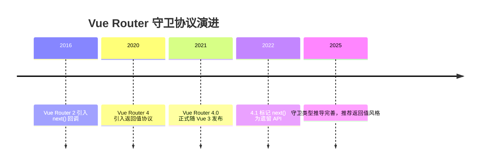
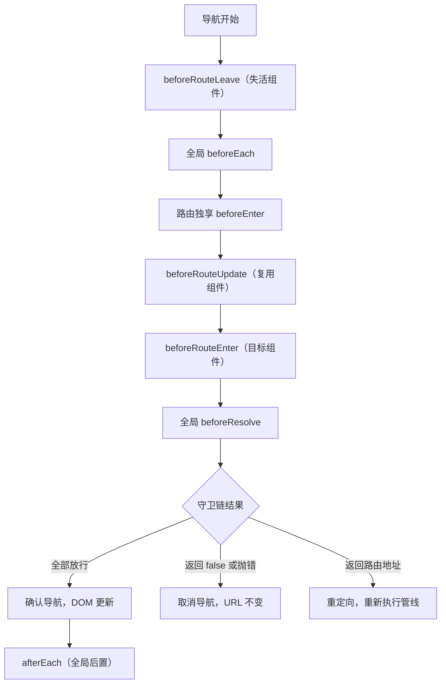

## 前置知识

- [Pinia 持久化插件](/vue3/029-PiniaPersistencePlugin)：建议先完成前一篇的学习

## 学习目标

- 掌握「1. 历史动机与发展脉络」的核心机制、典型用法与常见陷阱
- 掌握「2. 形式化定义」的核心机制、典型用法与常见陷阱
- 掌握「3. 理论推导与原理解析」的核心机制、典型用法与常见陷阱
- 掌握「4. 代码示例（带详尽注释）」的核心机制、典型用法与常见陷阱
- 掌握「5. 对比分析」的核心机制、典型用法与常见陷阱


## 1. 历史动机与发展脉络

Vue Router 从 0.x 时代起就提供导航守卫，用于在路由切换前执行校验。Vue Router 3（配合 Vue 2）使用 `next()` 回调风格：守卫函数接收 `(to, from, next)` 三个参数，必须调用 `next()` 放行，否则导航悬挂。这种风格的问题在于：忘记调用 `next()` 导致页面白屏；异步逻辑中重复调用 `next()` 导致不可预测行为；`next('error')` 等特殊用法晦涩。

Vue Router 4（2021 年随 Vue 3 发布）改进了守卫协议：守卫函数返回一个值来描述导航结果，不再依赖回调。返回值协议如下：

当前稳定版为 Vue Router 5，返回值协议与 4.x 保持一致，本文示例在 5.x 下同样成立。

返回 `true` 或 `undefined`：放行导航；

返回 `false`：取消当前导航，URL 不变；

返回一个路由地址对象（字符串路径、`{ name: ... }` 或 `{ path: ... }`）：重定向到该地址；

返回一个 `Error` 实例或 `{ error: Error }`：导航失败，错误由 `router.isReady` 或导航 promise 捕获。

Vue Router 4.1 之后，`next` 回调风格被标记为遗留 API，官方文档明确推荐返回值风格。Vue Router 4.5 时代（2025 年后）进一步强化了 TypeScript 类型支持与 `RouteLocationRaw` 推导，守卫中的类型错误可以在编译期暴露。



## 2. 形式化定义

导航守卫是挂载在路由解析管线上的函数序列。一次导航 N（从路由 from 到路由 to）的完整执行顺序如下：

第一步，失活组件触发 `beforeRouteLeave` 守卫（从 from 的组件树中按深度优先从内到外执行）；

第二步，全局 `beforeEach` 守卫按注册顺序执行；

第三步，目标路由配置中的 `beforeEnter` 守卫执行（若路由有多个记录，按记录顺序执行）；

第四步，被复用的组件触发 `beforeRouteUpdate`；

第五步，目标组件的 `beforeRouteEnter` 执行；

第六步，全局 `beforeResolve` 守卫执行（此时所有异步组件与懒加载路由已解析）；

第七步，导航被确认；

第八步，全局 `afterEach` 执行（不接收返回值，不能取消导航）；

第九步，DOM 更新完成，`beforeRouteEnter` 中传入的 `next` 回调（若有）接收组件实例执行。

守卫执行模型：每个守卫的返回值决定导航状态机转移。若任一守卫返回 `false` 或抛出错误，导航中止，`from` 路由保持不变；若返回路由地址，则以该地址为目标重新执行完整管线（会再次触发全局守卫，因此需要防循环设计）。



## 3. 理论推导与原理解析

### 3.1 导航状态机

Vue Router 4 内部用 promise 链串联守卫。每个守卫被包装为 `guard(to, from)` 调用，返回值按协议归一化：`false` 映射为取消信号，字符串/对象映射为 `NavigationFailure` 或新地址，错误映射为失败。

推导：设守卫序列 G1..Gn，导航成功当且仅当所有 Gi 返回真值或 undefined，且重定向目标 R 与当前目标不同。若 Gk 返回地址 R，则管线在第 k 步停止并重启：`navigate(R, from=to)`。为了避免无限循环，Vue Router 在重定向超过一定次数或回到同一地址时抛出 `NavigationFailureType.duplicated` 或重定向循环错误。

### 3.2 为什么 afterEach 不能取消导航

`afterEach` 在导航确认后执行，此时 URL 已更新、组件即将挂载。如果允许取消，会产生状态不一致：URL 显示新地址而组件仍是旧组件。因此 `afterEach` 只用于副作用（埋点、标题、滚动位置），返回值被忽略。

### 3.3 守卫中的异步与加载态

守卫函数可以返回 promise，管线会 await。工程上需要在等待期间展示加载状态，例如用全局 loading bar。Vue Router 4 没有内置 loading 组件，通常结合 `router.beforeEach` 的开始事件与 `afterEach`/`onError` 的结束事件控制进度条，这也是 nprogress 集成的标准做法。

## 4. 代码示例（带详尽注释）

### 4.1 全局前置守卫：登录鉴权

```ts
import { createRouter, createWebHistory } from 'vue-router'

const router = createRouter({
  history: createWebHistory(),
  routes: [
    { path: '/login', name: 'login', component: Login },
    {
      path: '/admin',
      component: AdminLayout,
      // meta 字段存放自定义权限信息，供守卫读取
      meta: { requiresAuth: true, roles: ['admin'] },
      children: [{ path: '', name: 'admin', component: AdminHome }]
    }
  ]
})

// 全局前置守卫：每次导航都会执行
router.beforeEach(async (to, from) => {
  // 白名单：登录页不需要鉴权
  if (to.name === 'login') return true

  // 读取本地登录令牌；真实项目应校验令牌有效性
  const token = localStorage.getItem('token')
  if (!token) {
    // 未登录：重定向到登录页，并携带来源路径便于登录后跳回
    return { name: 'login', query: { redirect: to.fullPath } }
  }

  // 路由需要权限但当前用户角色不满足
  const userRole = localStorage.getItem('role')
  const requiredRoles = to.meta.roles as string[] | undefined
  if (requiredRoles && (!userRole || !requiredRoles.includes(userRole))) {
    // 无权限：返回 false 取消导航，停留在当前页
    return false
  }

  // 默认放行
  return true
})

export default router
```

讲解：守卫通过 `to.meta` 读取路由配置中的自定义字段，实现声明式权限声明。`return { name: 'login', query: { redirect: to.fullPath } }` 使用返回值协议完成重定向；`return false` 直接取消导航。整个守卫是纯 async 函数，逻辑清晰且可测试。

### 4.2 动态加载用户信息的守卫

```ts
// 使用 Pinia 或全局状态保存用户信息
import { useUserStore } from '@/stores/user'

router.beforeEach(async (to) => {
  const userStore = useUserStore()

  // 已加载过用户信息则直接放行，避免每次导航都请求
  if (userStore.loaded) return true

  // 首次导航时拉取用户信息；失败则跳转登录
  try {
    await userStore.fetchProfile()
    return true
  } catch {
    return { name: 'login' }
  }
})
```

讲解：把“用户信息初始化”放进守卫，保证任何页面进入前数据就绪，页面组件不再各自处理加载失败。`userStore.loaded` 标志避免重复请求。

### 4.3 路由独享守卫 beforeEnter

```ts
const routes = [
  {
    path: '/reports/:id',
    component: ReportView,
    // 只对该路由生效
    beforeEnter: (to) => {
      const id = Number(to.params.id)
      // 参数不是正整数时直接取消导航
      if (!Number.isInteger(id) || id <= 0) {
        return { name: 'not-found' }
      }
      return true
    }
  }
]
```

讲解：`beforeEnter` 只在直接进入该路由时执行；从该路由切换到该路由（仅参数变化）时不会重新执行，此时应使用组件内 `beforeRouteUpdate`。这是初学者最容易混淆的点。

### 4.4 组件内守卫：离开确认

```vue
<script setup>
import { onBeforeRouteLeave } from 'vue-router'

// 表单脏数据标记：有未保存修改时提示
const dirty = ref(false)

// 离开前确认：返回 false 阻止离开
onBeforeRouteLeave((to, from) => {
  if (!dirty.value) return true
  // 浏览器原生 confirm 弹窗；工程中可替换为自定义对话框
  const ok = window.confirm('当前修改尚未保存，确定离开吗？')
  return ok
})
</script>
```

讲解：`onBeforeRouteLeave` 在组合式 API 中直接调用，无需组件选项。返回 `false` 阻止离开；返回 `true` 放行。注意该守卫不能阻止浏览器刷新或关闭标签页，那需要 `beforeunload` 事件配合。

### 4.5 组件内守卫：参数变化响应

```vue
<script setup>
import { ref } from 'vue'
import { onBeforeRouteUpdate } from 'vue-router'

const articleId = ref(null)

// 同一组件在不同路由参数间切换时触发
onBeforeRouteUpdate(async (to, from) => {
  // 参数变化时重新加载数据
  articleId.value = to.params.id
  await loadArticle(to.params.id)
})
</script>
```

讲解：`/article/1` 切换到 `/article/2` 时组件会被复用而非重新创建，`onMounted` 不会再次执行，因此必须用 `beforeRouteUpdate` 或监听 `route.params` 处理数据刷新。

### 4.6 全局后置守卫：页面标题

```ts
// 根据路由 meta.title 设置 document.title
router.afterEach((to) => {
  const baseTitle = 'FANDEX 学习平台'
  document.title = to.meta.title ? `${to.meta.title} - ${baseTitle}` : baseTitle
})
```

讲解：`afterEach` 适合做与导航结果无关的副作用。标题设置不依赖返回值，即使导航失败也最好不执行——注意 afterEach 在导航失败时不会触发，错误需由 `router.onError` 处理。

### 4.7 异步权限 + 动态路由

```ts
// 登录后根据角色动态添加路由
router.beforeEach(async (to) => {
  const userStore = useUserStore()
  if (!userStore.token) return { name: 'login' }

  // 尚未注册动态路由时，请求权限列表并注册
  if (!userStore.routesLoaded) {
    const routes = await fetchUserRoutes(userStore.role)
    routes.forEach((r) => router.addRoute(r))
    userStore.routesLoaded = true
    // 重新导航到目标，此时新路由已注册
    return { ...to, replace: true }
  }
  return true
})
```

讲解：`router.addRoute` 动态注册路由后，必须重新发起导航，否则目标路由仍找不到。`{ ...to, replace: true }` 保留目标地址并避免历史记录污染。这是大型后台系统的标准权限路由模式。

## 5. 对比分析

### 5.1 守卫层级对比

| 守卫 | 作用域 | 触发时机 | 典型用途 |
| --- | --- | --- | --- |
| `beforeEach` | 全局 | 每次导航开始 | 登录态、白名单、埋点开始 |
| `beforeEnter` | 单路由 | 直接进入该路由 | 参数校验、单路由权限 |
| `beforeRouteUpdate` | 组件 | 参数变化但组件复用 | 数据刷新 |
| `beforeRouteEnter` | 组件 | 进入组件前 | 进入前校验（拿不到 this） |
| `beforeResolve` | 全局 | 所有异步解析后 | 数据预取、最终确认 |
| `afterEach` | 全局 | 导航确认后 | 标题、埋点、滚动 |

### 5.2 返回值风格与 next 回调风格对比

| 维度 | 返回值风格 | next 回调风格 |
| --- | --- | --- |
| 可读性 | 返回即结果 | 需要跟踪调用位置 |
| 错误处理 | try/catch 自然生效 | 容易漏调或重复调用 |
| TypeScript | 类型推导完整 | 类型弱 |
| 官方态度 | 推荐 | 遗留 API |

### 5.3 守卫与中间件对比

守卫本质上是路由级中间件。与 Express/Koa 中间件相比，Vue Router 守卫少了 `next` 链式调用，多了返回值协议；与 Nuxt 的 route middleware 相比，Vue Router 守卫更底层，Nuxt 在其上封装了 `definePageMeta` 声明式中间件。理解底层守卫后，上层框架的中间件行为可以自然推导。

## 6. 常见陷阱与最佳实践

陷阱一：忘记返回真值。守卫函数没有 return 时返回 undefined，等价放行——但若逻辑分支遗漏，会出现“看起来没执行校验”的问题。最佳实践：让每个分支显式 return。

陷阱二：守卫循环。登录页守卫又重定向到登录页，形成死循环。最佳实践：对登录页等公开路由提前放行。

陷阱三：在 `beforeRouteEnter` 中访问 `this`。组件实例尚未创建，`this` 为 undefined。最佳实践：通过 `(to, from, next) => { next((vm) => { /* 此时才能访问组件实例 */ }) }`，或改用组合式 API 的 `onBeforeRouteEnter` 并配合外部状态。

陷阱四：把数据请求放进守卫导致白屏过长。最佳实践：区分“必须前置的数据”（权限、登录态）与“可以后置的数据”（列表内容），后者交给组件内部加载。

陷阱五：`beforeEach` 中重复注册。模块热更新或代码重复执行会导致守卫栈叠加。最佳实践：守卫注册放在路由实例创建处，一次注册。

陷阱六：忽略 `router.onError`。异步守卫抛出未捕获异常时，导航失败且无提示。最佳实践：全局注册 `router.onError` 统一处理，并区分鉴权过期与网络错误。

## 7. 工程实践

### 7.1 守卫文件组织

大型项目按职责拆分守卫：

```text
src/router/
  index.ts          # 创建路由实例并汇总守卫
  guards/
    auth.ts         # 登录鉴权守卫
    permission.ts   # 角色权限守卫
    progress.ts     # 进度条与埋点守卫
    title.ts        # 页面标题守卫
```

每个守卫文件导出 `export const authGuard = (to, from) => {...}` 形式的纯函数，在 `index.ts` 中按顺序 `router.beforeEach(authGuard); router.beforeEach(permissionGuard)`。这种组织方式让守卫可单测、可复用。

### 7.2 守卫的可测试性

守卫是纯函数（除副作用外），可以脱离路由实例测试：

```ts
// 测试 authGuard：未登录重定向到 login
import { describe, it, expect, vi } from 'vitest'
import { authGuard } from './auth'

describe('authGuard', () => {
  it('未登录时重定向到登录页', async () => {
    localStorage.clear()
    const to = { name: 'admin', fullPath: '/admin' } as any
    const from = {} as any
    const result = await authGuard(to, from)
    expect(result).toMatchObject({ name: 'login' })
  })
})
```

讲解：测试替身对象模拟 `to/from`，断言返回值。守卫逻辑越纯，测试成本越低，这也是官方推荐返回值风格带来的工程红利。

### 7.3 与 Teleport/KeepAlive 的协作

路由切换会卸载旧组件、挂载新组件。若项目使用 KeepAlive 缓存页面，`beforeRouteLeave` 不会销毁组件，而是进入缓存；此时配合 `onActivated/onDeactivated` 处理数据刷新。浮层类组件（模态框）在路由离开时应关闭，可以在 `beforeRouteLeave` 中同步状态或让模态框组件监听路由变化。

## 8. 案例研究：完整权限系统

需求：实现包含登录、角色权限、动态路由、无权限页面、登录过期处理的完整权限链路。

```ts
// guards/permission.ts：权限守卫完整实现
import type { NavigationGuard } from 'vue-router'

// 公开路由白名单：不经过任何权限校验
const PUBLIC_ROUTES = ['login', 'register', 'home']

export const permissionGuard: NavigationGuard = async (to, from) => {
  const userStore = useUserStore()

  // 公开路由直接放行
  if (PUBLIC_ROUTES.includes(to.name as string)) return true

  // 无 token：跳登录并记录来源
  if (!userStore.token) {
    return { name: 'login', query: { redirect: to.fullPath } }
  }

  // 动态路由未注册时先注册
  if (!userStore.dynamicRoutesReady) {
    const menus = await userStore.fetchMenus()
    menus.forEach((route) => router.addRoute(route))
    userStore.dynamicRoutesReady = true
    return { ...to, replace: true }
  }

  // 无权限页面
  if (to.meta.roles && !to.meta.roles.some((r) => userStore.roles.includes(r))) {
    return { name: 'forbidden' }
  }

  return true
}
```

讲解：该守卫把鉴权、动态路由、角色校验集中在一条链路，白名单优先、登录态其次、动态路由第三、角色最后。所有分支显式 return，配合 `router.onError` 与 `afterEach` 完成埋点，形成完整闭环。

## 9. 知识要点总结与深入讲解

导航守卫的本质是“路由状态机中的决策钩子”。初学者应记住执行顺序口诀：失活组件 → 全局前 → 路由独享 → 组件更新/进入 → 全局解析 → 确认 → 全局后。

返回值协议可以归纳为“三放行一取消一重定向”：`true/undefined` 放行，`false` 取消，地址对象重定向，`Error` 失败。这个协议把原来的 `next` 迷宫简化为普通函数返回值。

为什么要有 `beforeResolve`：因为组件可以异步加载（懒加载路由），在 `beforeEach` 阶段目标组件可能尚未下载完成；`beforeResolve` 保证所有异步依赖就绪后再做最终决策，适合放“必须等数据到齐”的校验。

为什么 `beforeEnter` 不重复触发：路由记录级守卫只在初始进入时执行，参数变化属于同一路由记录内的更新，应使用组件内守卫。这是面试与实战中的高频易错点。

### 1. 全局守卫

#### 1.1 beforeEach

```javascript
router.beforeEach((to, from) => {
  const auth = useAuthStore();
  if (to.meta.requiresAuth && !auth.isLoggedIn) {
    return { name: 'login', query: { redirect: to.fullPath } };
  }
});
```

#### 1.2 afterEach

```javascript
router.afterEach((to, from, failure) => {
  if (!failure) {
    document.title = to.meta.title || 'App';
  }
});
```

### 1. 路由独享守卫

```javascript
const routes = [
  {
    path: '/admin',
    component: Admin,
    beforeEnter: (to, from) => {
      if (!isAdmin()) return '/login';
    },
  },
];
```

### 2. 组件内守卫

```javascript
export default {
  beforeRouteEnter(to, from, next) {
    // 无法访问 this
    next((vm) => {
      // 通过 vm 访问组件实例
    });
  },
  beforeRouteUpdate(to, from) {
    // 路由参数变化时（如 /user/1 → /user/2）
  },
  beforeRouteLeave(to, from) {
    // 离开前确认
    if (hasUnsavedChanges) {
      return window.confirm('确认离开？');
    }
  },
};
```

### 3. 守卫执行顺序

1. beforeRouteLeave（离开组件）
2. beforeEach（全局）
3. beforeRouteUpdate（复用组件）
4. beforeEnter（路由配置）
5. beforeRouteEnter（进入组件）
6. afterEach（全局）

### 4. 返回值

| 返回值               | 效果     |
| -------------------- | -------- |
| `true` / `undefined` | 允许导航 |
| `false`              | 取消导航 |
| 路由对象             | 重定向   |
