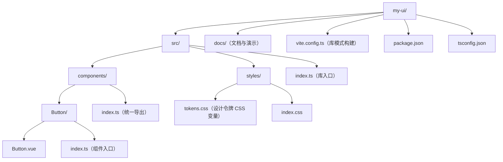

## 概述

组件库工程化是把一组组件从"项目内部复用"升级为"跨项目交付"的系统工程：对外需要按需引入与 Tree Shaking，对内需要清晰的目录、样式方案、类型导出和版本发布流程。本文以 Vite 库模式为例，从目录设计、构建配置、类型生成到发布清单，逐步说明一个 Vue 3 组件库的最小可行骨架，以及每一步要规避的常见问题，例如组件样式丢失、类型声明缺失、导出入口不完整等。

## 为什么需要

- 多个项目复用同一套组件时，复制粘贴必然漂移。
- 使用方需要：按需导入、Tree Shaking、完整类型提示、主题定制。
- 维护方需要：清晰的目录、样式隔离、自动化发布。

## 目录设计



## 构建配置：Vite 库模式

```ts
// vite.config.ts
import { defineConfig } from 'vite';
import vue from '@vitejs/plugin-vue';
import dts from 'vite-plugin-dts';

export default defineConfig({
  plugins: [vue(), dts({ include: ['src'] })],
  build: {
    lib: {
      entry: 'src/index.ts',
      name: 'MyUI',
      formats: ['es', 'cjs'], // ESM 供按需导入，CJS 兼容旧工具链
      fileName: (format) => `my-ui.${format}.js`,
    },
    rollupOptions: {
      external: ['vue'], // vue 是 peer 依赖，不进产物
    },
  },
});
json
// package.json 出口配置
{
  "name": "my-ui",
  "type": "module",
  "main": "./dist/my-ui.cjs.js",
  "module": "./dist/my-ui.es.js",
  "types": "./dist/index.d.ts",
  "exports": {
    ".": {
      "types": "./dist/index.d.ts",
      "import": "./dist/my-ui.es.js",
      "require": "./dist/my-ui.cjs.js"
    },
    "./styles.css": "./dist/styles.css"
  },
  "peerDependencies": {
    "vue": "^3.4.0"
  }
}
```

## 样式与主题

```css
/* tokens.css：主题由 CSS 变量驱动，用户可覆盖 */
:root {
  --ui-color-primary: #0e8c9c;
  --ui-radius: 4px;
}
vue
<!-- Button.vue：scoped 样式 + 变量取值 -->
<template>
  <button class="ui-button" :class="`ui-button--${variant}`">
    <slot />
  </button>
</template>

<style scoped>
.ui-button {
  padding: 6px 14px;
  border-radius: var(--ui-radius);
  color: var(--ui-color-primary);
}
</style>
```

## 发布与版本

- 语义化版本：破坏性变更发 major，新特性发 minor，修复发 patch。
- 变更日志（CHANGELOG）随版本更新，使用方才能判断升级风险。
- 发布前跑类型检查、单测与文档示例构建。

## 常见误区

| 误区 | 真相 |
| --- | --- |
| 把 vue 打进产物 | vue 应作为 peerDependency，否则多个副本导致运行时冲突 |
| 只发一个文件 | 需要 ESM + d.ts + 样式资源，配套 exports 映射 |
| 样式写在组件里就完事 | 主题化需要把可变值抽象成 CSS 变量 |
| 版本号随意升 | 语义化版本是组件库与使用方之间的契约 |

## 小结

组件库工程化没有玄学：目录按组件拆、构建用库模式、样式走变量、发布守语义化版本。
从第一个 Button 开始就按这个骨架走，后续加组件只是"复制目录 + 导出"的重复劳动。
