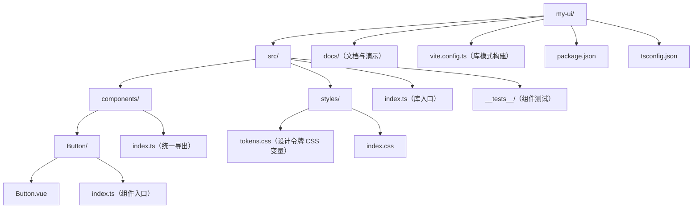

## 概述

组件库工程化是把一组组件从"项目内部复用"升级为"跨项目交付"的系统工程：对外需要按需引入与 Tree Shaking，对内需要清晰的目录、样式方案、类型导出和版本发布流程。本文以 Vite 库模式为例，从目录设计、构建配置、类型生成到发布清单，逐步说明一个 Vue 3 组件库的最小可行骨架，以及每一步要规避的常见问题，例如组件样式丢失、类型声明缺失、导出入口不完整等。

## 为什么需要

- 多个项目复用同一套组件时，复制粘贴必然漂移。
- 使用方需要：按需导入、Tree Shaking、完整类型提示、主题定制。
- 维护方需要：清晰的目录、样式隔离、自动化发布。

## 目录设计



## 构建配置：Vite 库模式

```ts
// vite.config.ts
import { defineConfig } from 'vite';
import vue from '@vitejs/plugin-vue';
import dts from 'vite-plugin-dts';

export default defineConfig({
  plugins: [vue(), dts({ include: ['src'] })],
  build: {
    lib: {
      entry: 'src/index.ts',
      name: 'MyUI',
      formats: ['es', 'cjs'], // ESM 供按需导入，CJS 兼容旧工具链
      fileName: (format) => `my-ui.${format}.js`,
    },
    rollupOptions: {
      external: ['vue'], // vue 是 peer 依赖，不进产物
    },
  },
});
```

```json
// package.json 出口配置
{
  "name": "my-ui",
  "type": "module",
  "main": "./dist/my-ui.cjs.js",
  "module": "./dist/my-ui.es.js",
  "types": "./dist/index.d.ts",
  "exports": {
    ".": {
      "types": "./dist/index.d.ts",
      "import": "./dist/my-ui.es.js",
      "require": "./dist/my-ui.cjs.js"
    },
    "./styles.css": "./dist/styles.css"
  },
  "peerDependencies": {
    "vue": "^3.5.0"
  }
}
```

`exports` 字段是现代 Node 与打包工具的入口事实标准：`types` 必须放在最前，编辑器才能同时拿到类型与实现；样式作为独立子路径导出，使用方 `import 'my-ui/styles.css'` 即可引入。

## 样式与主题

```css
/* tokens.css：主题由 CSS 变量驱动，用户可覆盖 */
:root {
  --ui-color-primary: #0e8c9c;
  --ui-radius: 4px;
}
```

```vue
<!-- Button.vue：scoped 样式 + 变量取值 -->
<template>
  <button class="ui-button" :class="`ui-button--${variant}`">
    <slot />
  </button>
</template>

<style scoped>
.ui-button {
  padding: 6px 14px;
  border-radius: var(--ui-radius);
  color: var(--ui-color-primary);
}
</style>
```

主题化的关键决策是"哪些值可变"：颜色、圆角、字号、间距抽成 CSS 变量发布，组件内部只引用变量名。使用方在自己的 `:root` 里覆盖变量即可换肤，无需重新编译组件库。

## 按需导入与 Tree Shaking

ESM 产物 + `sideEffects: false` 是 Tree Shaking 的前提：

```json
{
  "sideEffects": ["**/*.css"]
}
```

```ts
// src/components/index.ts：统一导出，让打包工具静态分析依赖
export { default as Button } from './Button';
export { default as Input } from './Input';
export type { ButtonProps } from './Button';
```

```ts
// 使用方：命名导入即可摇树，未用到的组件不进 bundle
import { Button } from 'my-ui';
```

`<script setup>` 与类型导出的组合让组件库天然对打包工具友好；如果使用方希望"模板里写 `<UIButton>` 不导入"，可以在其项目中配置 `unplugin-vue-components` 指向库的导出清单，组件库自身无需为此做任何事。

## 组件测试

组件库的可信度来自测试。用 Vitest + @vue/test-utils 覆盖组件的渲染与交互契约：

```ts
// src/components/__tests__/Button.spec.ts
import { describe, it, expect } from 'vitest';
import { mount } from '@vue/test-utils';
import Button from '../Button.vue';

describe('Button', () => {
  it('渲染插槽内容', () => {
    const wrapper = mount(Button, { slots: { default: '确定' } });
    expect(wrapper.text()).toContain('确定');
  });

  it('点击时触发 click 事件', async () => {
    const wrapper = mount(Button);
    await wrapper.trigger('click');
    expect(wrapper.emitted('click')).toHaveLength(1);
  });

  it('variant 决定修饰类名', () => {
    const wrapper = mount(Button, { props: { variant: 'danger' } });
    expect(wrapper.classes()).toContain('ui-button--danger');
  });
});
```

测试策略：每个组件至少覆盖"渲染输出、事件触发、props 映射"三类断言；样式回归交给文档站的视觉走查，不必在单测里断言具体 CSS。

## 组件入口与实例契约

`<script setup>` 组件默认对外封闭，组件库中需要明确"暴露什么"给使用方（模板引用、测试挂载）：

```vue
<!-- Button.vue：用 defineExpose 声明公共实例成员 -->
<script setup>
import { ref } from 'vue';

const buttonEl = ref(null);

function focus() {
  buttonEl.value?.focus();
}

// 只有列在这里的成员才会出现在组件实例上
defineExpose({ focus, buttonEl });
</script>

<template>
  <button ref="buttonEl" class="ui-button">
    <slot />
  </button>
</template>
```

```ts
// 使用方通过模板引用拿到的是 expose 后的契约面
const btn = ref<InstanceType<typeof Button> | null>(null);
btn.value?.focus();
```

约定：能通过 props 与事件解决的交互不进 expose；expose 只用于命令式能力（focus、scrollTo、reset），并且写进文档与测试，视为和 props 同等级的公共 API——改动 expose 成员同样是 breaking change。

## 文档与演示

- 组件库自带一个 VitePress 文档站：每个组件一页，写清 props / emits / slots / 用法示例。
- 文档示例即测试：示例代码与单测使用同一套 props 约定，升级版本时同步修改。
- 在 `docs/` 里提供可交互的 playground（VitePress 内嵌 Vue 演示），降低使用方试用成本。

## 发布与版本

- 语义化版本：破坏性变更发 major，新特性发 minor，修复发 patch。
- 变更日志（CHANGELOG）随版本更新，使用方才能判断升级风险。
- 发布前跑类型检查（`vue-tsc --noEmit`）、单测与文档示例构建。
- 发正式包先发 `next` dist-tag 灰度，确认无误再切 `latest`。
- CI 中用 `npm publish --provenance` 提供构建溯源，提升供应链可信度。

## 常见误区

| 误区 | 真相 |
| --- | --- |
| 把 vue 打进产物 | vue 应作为 peerDependency，否则多个副本导致运行时冲突 |
| 只发一个文件 | 需要 ESM + d.ts + 样式资源，配套 exports 映射 |
| 样式写在组件里就完事 | 主题化需要把可变值抽象成 CSS 变量 |
| 忘记 `sideEffects: false` | 使用方开了摇树也摇不干净，产物整体被打进 bundle |
| d.ts 手写或缺失 | 用 vite-plugin-dts 从源码生成，手写必然与实现漂移 |
| 版本号随意升 | 语义化版本是组件库与使用方之间的契约 |

## 小结

组件库工程化没有玄学：目录按组件拆、构建用库模式、样式走变量、类型自动生成、测试守住契约、发布守语义化版本。
从第一个 Button 开始就按这个骨架走，后续加组件只是"复制目录 + 导出 + 补测试"的重复劳动。
