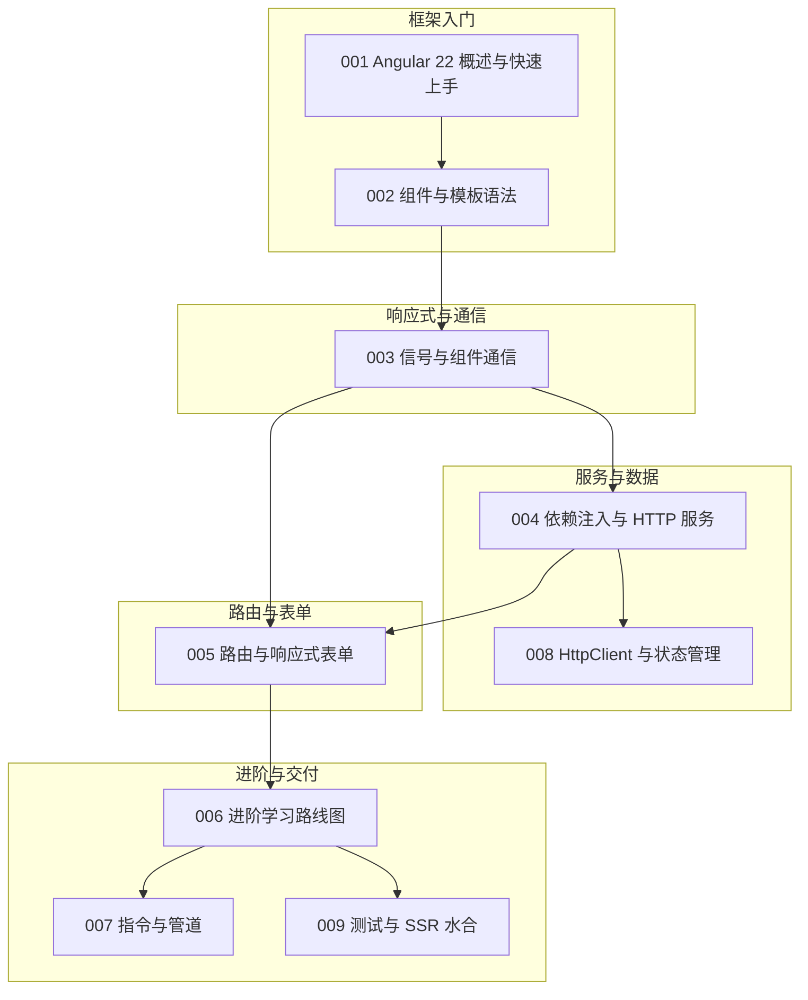

本篇是 angular 模块的收官总结。我们继续以"虚拟歌手音乐平台"为贯穿场景：用 Angular 22 搭一个打榜应用——歌姬（virtual singer）卡片展示应援色，P 主（producer）的作品库按热度排序，粉丝团（fan club）登录后提交投票表单，演唱会（concert）页走懒加载路由。围绕这些场景，把前 9 篇文档的内容重新串一遍：组件与模板、信号与通信、依赖注入、路由与表单，以及路线图指向的三站进阶。读完请用自检清单核对掌握程度。回顾建议按"两条腿走路"：模板与信号是写组件的腿，依赖注入与路由是组织应用的腿，测试与 SSR 是收尾的腿。Angular 22 的现代写法已经收敛得很干净——独立组件、函数式 API、信号优先，回顾时请一律按新写法校准，旧资料里的 NgModule 与装饰器写法仅作对照，不再作为新代码的参考。

## 前置知识

- [Angular 22 概述与快速上手](/angular/001-AngularOverview)：独立组件模式与 CLI 工具链是全部内容的地基，回顾前先确认能 `ng new` 并跑起来。
- [Angular 组件与模板语法](/angular/002-QuickStartComponentTemplate)：插值、绑定与 @if/@for 控制流是每天的"写字笔画"，必须形成肌肉记忆。

## 学习目标

1. 能用独立组件写法搭建组件树，说清它与历史 NgModule 模式的差异。
2. 能用 signal、computed、effect 组织响应式状态，用 input/output/model 完成组件通信。
3. 能用 inject() 在服务中封装 HttpClient 调用，并解释 providedIn: "root" 的作用域含义。
4. 能配置懒加载路由与响应式表单，理解守卫在导航流程中的位置。

还有一条值得先说的观察：Angular 的"全家桶"不是堆功能，而是把约定做成了默认值——组件默认独立、依赖默认单例、路由默认懒加载入口、校验默认走类内声明。约定带来的是一致性与可预测性：新成员加入项目时，只要掌握了这套默认值，就能在陌生代码库里快速定位组件在哪、服务在哪、路由在哪。回顾各节时，建议每读完一段就问一句"这里的默认行为是什么、我有没有必要覆盖它"，绝大多数场景答案都是不覆盖，代码也因此保持统一。

## 知识地图



读图按编号推进：001、002 打底，003 是响应式主线，004 与 008 是服务与数据主线，005 是导航与表单，006 是路线图，007 与 009 是路线图展开的收尾两站。注意 007-009 三篇当前为占位文档，主题已规划、正文待补全，可先按 006 的路线表与计划要点自行探索。

## 核心概念回顾

### 1. 独立组件与模板绑定

Angular 22 全面拥抱独立组件：组件不再挂在 NgModule 下，`imports` 数组直接声明依赖。模板是"HTML 加绑定"——`{{ }}` 输出、`[属性]` 输入、`(事件)` 输出，`@if/@for` 承担条件与循环（见[组件与模板语法](/angular/002-QuickStartComponentTemplate)）：

```typescript
// src/app/singer-card/singer-card.component.ts —— 歌姬卡片组件
import { Component } from "@angular/core"

@Component({
  selector: "app-singer-card",
  imports: [],
  template: `
    <article class="singer">
      <h2 style="border-left: 4px solid {{ color() }}">{{ name() }}</h2>
      @if (isVoting()) {
        <p>打榜通道开启中</p>
      }
    </article>
  `
})
export class SingerCardComponent {
  name = signal("初音未来")
  color = signal("#39c5bb") // 应援色
  isVoting = signal(true)
}
```

独立组件的 imports 数组把依赖精确到组件本身，带来了更好的摇树优化与更清晰的边界；代价是每个组件要自己声明用到的指令与管道，忘写就会在模板报错。模板里的 @if/@for 是编译期控制流，比历史的结构指令写法更接近原生 JavaScript 的直觉，也更容易被类型系统检查。

### 2. signal、computed 与 effect

信号是 Angular 的响应式状态单元：`signal()` 存值、`computed()` 派生、`effect()` 监听副作用。模板里读取信号要调用函数（`total()`），这是新旧写法最容易踩的差异（见[信号与组件通信](/angular/003-SignalsInputsOutputs)）：

```typescript
// src/app/vote/vote.component.ts —— 打榜页：派生值与副作用
import { Component, computed, effect, signal } from "@angular/core"

@Component({
  selector: "app-vote",
  template: `
    <p>单张打榜券：{{ price() }} 元</p>
    <p>数量：{{ qty() }}</p>
    <p>合计：{{ total() }} 元</p>
    <button (click)="qty.set(qty() + 1)">加一张</button>
  `
})
export class VoteComponent {
  price = signal(30)
  qty = signal(1)
  total = computed(() => this.price() * this.qty()) // 任一依赖变化自动重算

  constructor() {
    // 副作用：票数变更时同步打榜日志
    effect(() => console.log(`当前合计 ${this.total()} 元`))
  }
}
```

信号的读取规则只有一条：在模板与代码里调用它。computed 的依赖追踪是自动的——函数体里读过谁，谁变了就重算；effect 则用于"把变化告诉框架之外的世界"，例如更新页面标题、同步 localStorage。把这条边界记牢，就不会把本该派生的逻辑错写成副作用。

### 3. input、output 与 model

组件通信用三个函数式 API：`input()` 声明输入、`output()` 声明事件、`model()` 声明可双向绑定的输入。相比装饰器写法，它们与信号天然打通（见[信号与组件通信](/angular/003-SignalsInputsOutputs)）：

```typescript
// src/app/singer-card/singer-card.component.ts —— 输入与输出
import { Component, input, output } from "@angular/core"

@Component({ selector: "app-singer-card", template: `<button (click)="vote.emit(name())">打榜</button>` })
export class SingerCardComponent {
  // 输入：父组件传入歌姬名与应援色，必填校验在类型层完成
  name = input.required<string>()
  color = input("#39c5bb")
  // 输出：打榜事件携带歌姬名上抛
  vote = output<string>()
}
```

input.required 把"父组件忘了传参"从运行时错误提前到编译期；output 的泛型约束了事件载荷的形状，父子契约从此有了类型保护。model() 则是 input 加 output 的合并写法，适合"子组件可改、父组件可监听"的双向场景，三者的取舍在 003 篇的对比里写得很清楚。

### 4. 依赖注入与 HttpClient

依赖注入就是"要用什么服务，声明一下，框架给你实例"：`inject()` 一行拿到 HttpClient，`providedIn: "root"` 让服务成为全应用单例。API 调用统一收进服务类，组件保持轻薄（见[依赖注入与 HTTP 服务](/angular/004-DependencyInjectionServices)）：

```typescript
// src/app/data/song.service.ts —— 歌曲服务：封装平台 API
import { HttpClient } from "@angular/common/http"
import { Injectable, inject } from "@angular/core"

export interface Song {
  id: number
  title: string
  producerId: number
}

@Injectable({ providedIn: "root" }) // root 作用域：全应用共享同一实例
export class SongService {
  private http = inject(HttpClient)

  /** 拉取打榜热歌榜，供首页与演唱会页复用 */
  getHotSongs() {
    return this.http.get<Song[]>("/api/songs/hot")
  }
}
```

providedIn: "root" 的含义是"服务在根注入器注册、全应用单例"，HttpClient 能被 inject 到正是这个机制在工作。服务层还有一个隐性收益：组件不再直接依赖 HTTP 细节，单元测试时替身整个服务即可，无需真的发请求，这也为第八站的状态管理铺了路。

### 5. 路由与响应式表单

路由把 URL 映射到组件：`provideRouter` 声明映射，`loadComponent` 实现懒加载，守卫在导航前做权限检查；响应式表单用 FormGroup/FormControl 描述结构并校验，粉丝团报名页是典型组合（见[路由与响应式表单](/angular/005-RoutingForms)）：

```typescript
// src/app/app.routes.ts —— 懒加载路由 + 函数式守卫
import { inject } from "@angular/core"
import { CanActivateFn, Routes } from "@angular/router"

// 守卫：只有粉丝团成员才能进 VIP 应援区
const memberGuard: CanActivateFn = () => {
  const auth = inject(AuthService)
  return auth.isMember()
}

export const routes: Routes = [
  { path: "", redirectTo: "singers", pathMatch: "full" },
  {
    path: "concerts",
    loadComponent: () => import("./concerts/concerts.component").then((m) => m.ConcertsComponent),
    canActivate: [memberGuard]
  }
]
```

```typescript
// src/app/fanclub/fanclub.component.ts —— 粉丝团报名：响应式表单（片段）
// private fb = inject(NonNullableFormBuilder) 已在组件中注入
form = this.fb.group({
  fanName: ["", [Validators.required, Validators.minLength(2)]], // 粉丝名
  themeColor: ["#39c5bb"] // 应援色偏好，默认初音蓝
})

onSubmit() {
  if (this.form.invalid) return // 校验不通过不上送
  this.fanService.join(this.form.getRawValue()).subscribe()
}
```

响应式表单的"响应式"体现在：控件状态是可观察的数据流，valueChanges 可以驱动联动校验，禁用状态由程序控制而非模板猜测。对比模板驱动表单，前者把表单结构写在类里，复杂表单的可测试性完全不同，粉丝团报名这类带校验的页面几乎总是该选它。

### 6. 进阶三站：模板复用、数据流与交付质量

路线图把剩余能力拆成三站：指令与管道解决"模板怎么复用"，HttpClient 与状态管理解决"数据怎么流"（拦截器、resource、toSignal），测试与 SSR 水合解决"质量与首屏"（TestBed、@angular/ssr、provideClientHydration）。顺序不可跳：指令是模板写法基础，状态管理依赖信号，SSR 建立在完整应用之上（见[进阶学习路线图](/angular/006-AdvancedRoadmap)）：

```typescript
// src/app/hot.pipe.ts —— 自定义管道：热度值格式化（对应第六站主题）
import { Pipe, PipeTransform } from "@angular/core"

@Pipe({ name: "hotLevel" })
export class HotPipe implements PipeTransform {
  transform(votes: number): string {
    // 打榜数据展示：千位以上以"万"为单位
    return votes >= 10000 ? `${(votes / 10000).toFixed(1)} 万` : String(votes)
  }
}
```

路线图三站的顺序有依赖关系：指令与管道是模板层的复用单元，学懂它才能理解第七站拦截器与 resource 的数据流设计；测试与 SSR 则建立在完整应用之上，放最后收尾最合适。跳站学习看似快，实际会把概念悬空，回头补的成本更高。

## 易混淆概念对比

历史 NgModule 模式与现在的独立组件模式并存于大量资料中，先划清边界：

| 维度 | NgModule 模式（历史） | 独立组件模式（现状） |
| --- | --- | --- |
| 组件归属 | 必须声明在某个模块 declarations 里 | 组件自含，无需外层模块 |
| 依赖引入 | 模块 imports 汇总后全局生效 | 组件 imports 数组精确到自身 |
| 启动方式 | bootstrapModule | bootstrapApplication |
| 适用判断 | 旧项目维护 | 新项目一律使用 |

信号三件套的分工也常被混用，尤其容易把 computed 当 effect 用：

| 维度 | signal() | computed() | effect() |
| --- | --- | --- | --- |
| 职责 | 存储可变状态 | 从现有信号派生只读值 | 依赖变化时执行副作用 |
| 返回值 | 可写信号 | 只读信号 | 无（运行一次清理函数） |
| 可否赋值 | 可 set/update | 不可赋值 | 不产出状态 |
| 典型场景 | 存歌姬应援色 | 合计票数 | 写标题、打日志 |

总结的落点同样是反射：可变状态用 signal、派生用 computed、副作用用 effect；跨组件通信用 input、output、model；全局能力用服务加 root 作用域；页面切换用路由加守卫。把"某类问题对应某类 API"的映射记牢，Angular 的 API 面虽大，日常真正要用的部分其实很收敛。

## 常见误区与排查

以下五条来自真实项目的高频翻车，每条先给错误写法，再给修正代码。

1. 模板里把信号当属性读，页面不更新还以为绑定坏了。信号是"存值的函数"，读取必须调用：

```typescript
// 错误：{{ total }} 输出的是函数本身，且永不更新
// <p>合计：{{ total }}</p>

// 正确：调用信号函数，框架据此建立依赖追踪
// <p>合计：{{ total() }}</p>
```

2. 在模板插值里直接调用普通方法做派生计算，每次变更检测都会重复执行。派生逻辑应放进 computed：

```typescript
// 错误：变更检测一轮跑一次，列表大时明显卡顿
// get total() { return this.price * this.qty }

// 正确：computed 缓存结果，依赖不变不重算
total = computed(() => this.price() * this.qty())
```

3. 既写了 `providedIn: "root"` 又把服务加进组件 providers，制造出两个实例，状态互不相通。二选一（见[依赖注入与 HTTP 服务](/angular/004-DependencyInjectionServices)）：

```typescript
// 错误：组件里重复提供，root 单例被遮蔽
// @Component({ providers: [SongService] })

// 正确：全局服务只靠 providedIn: "root" 提供
@Injectable({ providedIn: "root" })
export class SongService {}
```

4. 响应式表单忘了在模板绑 `[formGroup]`，控件与 DOM 断开，输入永远为空：

```html
<!-- 错误：没有挂接表单组，formControlName 找不到宿主 -->
<!-- <input formControlName="fanName" /> -->

<!-- 正确：先绑定 formGroup，再用 formControlName 逐个挂控件 -->
<form [formGroup]="form" (ngSubmit)="onSubmit()">
  <input formControlName="fanName" />
  <button type="submit">加入粉丝团</button>
</form>
```

5. 懒加载组件误用 `loadChildren` 指向组件文件，类型报错。`loadChildren` 加载路由子表，`loadComponent` 才是加载单个组件：

```typescript
// 错误：loadChildren 期望返回 Routes
// { path: "concerts", loadChildren: () => import("./concerts.component") }

// 正确：单个懒加载组件用 loadComponent
{ path: "concerts", loadComponent: () => import("./concerts/concerts.component").then((m) => m.ConcertsComponent) }
```

全部自检通过后，做一个综合练习：为平台新增"演唱会抢票"页——懒加载路由进入、memberGuard 守卫、signal 管理剩余票数、响应式表单提交、computed 拼装展示文案，把五篇文档的能力拧成一股绳，做完再对照知识地图看看每一站是否都已落位。

## 自检清单

- [ ] 能用独立组件写法从零搭出组件树，并说出它与 NgModule 模式的差异
- [ ] 能默写插值、属性绑定、事件绑定的语法并各举一例
- [ ] 能用 signal、computed、effect 完成打榜合计与日志副作用
- [ ] 能用 input、output、model 完成一次完整的父子通信
- [ ] 能用 inject() 把 HttpClient 调用收进服务并解释 root 作用域
- [ ] 能配置 loadComponent 懒加载路由，说清它与 loadChildren 的区别
- [ ] 能用 FormGroup 与 Validators 搭一个带校验的报名表单
- [ ] 能对照路线图说出三站进阶各解决什么问题、为什么顺序不可颠倒

自检反复不过的条目，多半是示例没跑过：把对应文档的最小示例敲一遍再回来验收，效率远高于重复阅读。

## 后续学习路径

1. 夯实信号体系：重读[信号与组件通信](/angular/003-SignalsInputsOutputs)，把 input/output/model 各自的适用边界整理成自己的话。
2. 服务层进阶：按[依赖注入与 HTTP 服务](/angular/004-DependencyInjectionServices)练习错误处理与拦截器，衔接[HttpClient 与状态管理](/angular/008-HttpClientStateManagement)的 resource 方向。
3. 导航与表单：跟随[路由与响应式表单](/angular/005-RoutingForms)完成懒加载、守卫与校验的完整闭环。
4. 走路线图收尾：以[进阶学习路线图](/angular/006-AdvancedRoadmap)为纲，依次攻克[指令与管道](/angular/007-DirectivesPipes)与[测试与 SSR 水合](/angular/009-TestingSSRHydration)，并回顾[组件与模板语法](/angular/002-QuickStartComponentTemplate)查漏补缺。
