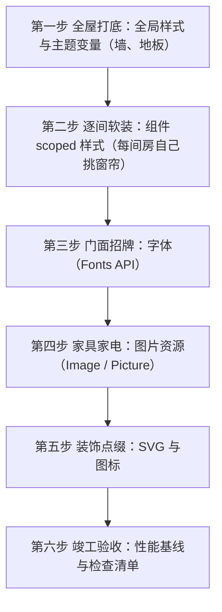

## 前置知识

- [Astro 岛屿架构与客户端指令](/astro/006-IslandsClientComponents)：建议先完成前一篇的学习

## 学习目标

- 掌握「0. 开篇：装修一套房子，先打底还是先挂画？」的核心机制、典型用法与常见陷阱
- 掌握「1. 第一步，全屋打底：全局样式与主题变量」的核心机制、典型用法与常见陷阱
- 掌握「2. 第二步，逐间软装：组件 scoped 样式」的核心机制、典型用法与常见陷阱
- 掌握「3. 第三步，门面招牌：字体与 Fonts API」的核心机制、典型用法与常见陷阱
- 掌握「4. 第四步，家具家电：图片资源优化」的核心机制、典型用法与常见陷阱


## 0. 开篇：装修一套房子，先打底还是先挂画？

想象你要装修一套房子。有经验的工长绝不会让你先挂装饰画、再选窗帘、最后才想起刷墙——那会让前面所有努力都作废。正确的顺序是：**先全屋打底（刷墙、铺地板、定水电），再逐间软装（挑家具、窗帘），最后才是点缀（挂画、摆件）**。这个顺序的背后是依赖关系：打底定了全屋的基调，局部要服从整体，点缀品不承担结构功能。

给 Astro 网站加样式，和装修是同一套逻辑。本文按"装修流程"组织成一条完整的操作链：



每一步都可以独立使用，但理解了顺序，你才知道"全局样式应该放哪、为什么组件样式不会互相污染、字体和图片为什么应该走专用 API"。

## 1. 第一步，全屋打底：全局样式与主题变量

装修先刷墙。网站的"墙"是全局样式：字体基调、颜色体系、间距、浏览器默认样式重置（Reset）。它们决定全站的长相，所以必须**统一、集中、只写一份**。

### 1.1 用 CSS 变量定主题

主题类的内容（颜色、字号、间距）用 CSS 自定义属性（变量）定义在 `:root`，全站通过 `var(--xxx)` 引用。这样"改主题=改一个文件"，而不是全站搜索替换颜色值。

```css
/* src/styles/global.css */
:root {
  /* 品牌色系 */
  --color-primary: #2563eb;
  --color-primary-hover: #1d4ed8;
  --color-text: #1f2937;
  --color-text-muted: #6b7280;
  --color-bg: #ffffff;
  --color-border: #e5e7eb;
  /* 字体与圆角 */
  --font-sans: 'Inter', system-ui, sans-serif;
  --radius-md: 8px;
  /* 间距刻度 */
  --space-1: 0.25rem;
  --space-4: 1rem;
  --space-8: 2rem;
}

/* 最简单的 Reset：去掉默认外边距，统一行高 */
body {
  margin: 0;
  font-family: var(--font-sans);
  color: var(--color-text);
  line-height: 1.7;
  background: var(--color-bg);
}

/* 标题统一排版 */
h1, h2, h3, h4, h5, h6 {
  line-height: 1.25;
  margin: 0 0 var(--space-4) 0;
}
```

### 1.2 在哪里引入全局样式

全局样式**只在布局组件中引入一次**（推荐），Astro 构建时会对重复 import 做去重合并，不会出现重复代码：

```astro
---
// src/layouts/Layout.astro
import '../styles/global.css'
---
```

注意引入顺序的直观含义：全局样式先于页面内容输出，主题变量早于组件渲染生效。**不要在每个组件里都 import global.css**——虽然不会重复打包，但会让"全局样式在哪"变得难以维护。

### 1.3 为什么不用"全局选择器"乱写

很多新手习惯直接写 `div { ... }`、`p { ... }` 这类全局选择器。这等于给全屋只刷一种颜色：后续任何组件想有自己的样子，都得和全局规则"打架"（优先级之争），越改越乱。正确的分工是：**变量与 Reset 留在全局，组件细节一律走 scoped 样式**（下一步）。

## 2. 第二步，逐间软装：组件 scoped 样式

每间房可以挑自己的窗帘，但绝不能影响隔壁房间。Astro 的 `<style>` 标签天然就是"每间房的窗帘"——**默认作用域隔离（scoped）**。

### 2.1 基本写法

```astro
---
// src/components/Card.astro
---
<div class="card">
  <h2 class="title">卡片标题</h2>
  <p class="desc">卡片描述</p>
</div>

<style>
  .card {
    border: 1px solid var(--color-border);
    border-radius: var(--radius-md);
    padding: var(--space-4);
  }
  .title {
    margin: 0 0 var(--space-1) 0;
    font-size: 1.25rem;
    color: var(--color-primary);
  }
</style>
```

### 2.2 作用域隔离的原理：哈希属性

构建时，Astro 会给组件里的元素与选择器都加上一个唯一的哈希标记，例如：

```html
<!-- 构建后输出的 HTML -->
<div class="card" data-astro-cid-7f3k9a>
  <h2 class="title" data-astro-cid-7f3k9a>卡片标题</h2>
</div>
```

```css
/* 构建后输出的 CSS：选择器带上了属性标记 */
.card[data-astro-cid-7f3k9a] { ... }
.title[data-astro-cid-7f3k9a] { ... }
```

效果：就算另一个组件里也有一个 `.card`，两个选择器带不同的哈希，互不干扰。**删除组件时样式自动消失，没有样式泄漏，没有全局污染**。这就是"每间房的窗帘不影响隔壁"的实现细节。

### 2.3 需要"通向外面的样式"怎么办：is:global 与 :global()

两种写法作用相同，选择取决于你想表达的范围：

```astro
<!-- 方式一：整块样式全局化 -->
<style is:global>
  body { background: #f8fafc; }
</style>

<!-- 方式二：scoped 块内局部逃逸 -->
<style>
  .prose { max-width: 720px; margin: 0 auto; }
  /* 只让 .prose 内部的链接走全局规则 */
  .prose :global(a) { color: var(--color-primary); text-decoration: none; }
</style>
```

使用原则：**尽量用 `:global()` 缩小逃逸面**，把全局影响限制在一个范围内（如富文本正文 `.prose` 内的 `a` 标签），而不是整个 `<style>` 直接 `is:global`。逃逸面越小，越不容易踩到其他组件的样式。

### 2.4 全家桶横向对比

| 方案 | 写法 | 作用域 | 适用场景 |
| --- | --- | --- | --- |
| `<style>` | 组件内标签 | 自动 scoped | 组件局部样式（首选） |
| 全局样式文件 | `import './global.css'` | 全局 | 主题变量、Reset、字体基调 |
| `<style is:global>` | 显式声明 | 全局 | 覆盖第三方注入内容（如富文本正文） |
| CSS Modules | `*.module.css` | scoped（类名哈希） | React/Vue 等框架组件内部 |
| 预处理器 Sass/Less | `npm i sass` 后直接写 `lang="scss"` | 同左 | 需要嵌套、变量、mixin 的场景 |
| Tailwind | `npx astro add tailwind` | 按类名 | 工具类优先的项目 |

其中 Tailwind 与 Sass 属于"升级项"：Sass 只需 `npm install sass` 即可在 `<style lang="scss">` 中使用（Astro 开箱支持）；Tailwind 通过 `npx astro add tailwind` 一键集成，Astro 7 内置对 Tailwind 4 的完整支持（Vite 插件方式，无需 PostCSS 胶水）。

## 3. 第三步，门面招牌：字体与 Fonts API

房子的门面是招牌，网站的门面是字体。但"换招牌"远比换字体文件复杂：需要下载多种字重、处理加载性能、考虑用户隐私、防止文字布局抖动（CLS）。手动做这些很容易出错。

### 3.1 传统手动方式的问题

```css
/* 手动方式：你需要自己托管文件、写 @font-face、手动加 preload */
@font-face {
  font-family: 'MyFont';
  src: url('/fonts/MyFont.woff2') format('woff2');
  font-display: swap;
}
```

手动方式要操心的事情非常多：字体文件从哪下载、加载时用哪个回退字体避免闪烁、要不要预加载、第三方字体域名是否泄露用户 IP 到 Google……Astro 6 起内置的 **Fonts API** 把这些问题全部自动化了。

### 3.2 Fonts API：声明式配置，自动托管

```js
// astro.config.mjs
import { defineConfig, fontProviders } from 'astro/config'

export default defineConfig({
  fonts: [
    {
      // 从 Google Fonts 拉取并自托管（构建期下载到本地，不再依赖第三方域名）
      provider: fontProviders.google(),
      name: 'Inter',
      cssVariable: '--font-inter',
      weights: [400, 500, 700],
      subsets: ['latin'],
    },
    {
      // 使用本地字体文件（.woff2 放 src/assets 下）
      provider: fontProviders.local(),
      name: 'DingTalk',
      path: './src/assets/fonts/DingTalk.woff2',
      cssVariable: '--font-ding',
    },
  ],
})
```

配置要点：

1. **每个字体必须指定三项**：`name`（字体家族名）、`cssVariable`（注入的 CSS 变量名）、`provider`（字体来源）；
2. **内置 provider 包括**：Google、Fontsource、Adobe、Bunny、Fontshare、Google Icons 与 Local（本地文件），覆盖绝大多数使用场景；
3. **构建期行为**：Astro 下载字体文件并自托管（隐私友好、无第三方请求）、自动生成优化的回退字体（fallback metrics，消除 CLS）、输出 `font-display` 优化与预加载链接。

### 3.3 在页面中启用字体

```astro
---
// src/layouts/Layout.astro
import { Font } from 'astro/fonts'
---
<!doctype html>
<html lang="zh-CN">
  <head>
    <!-- <Font /> 会在 head 中输出字体 CSS 与预加载链接 -->
    <Font cssVariable="--font-inter" />
    <Font cssVariable="--font-ding" />
  </head>
  <body>
    <slot />
  </body>
</html>
```

启用后，配置中声明的 `cssVariable` 变成可用的 CSS 变量，在任何组件里直接引用：

```css
body {
  /* 引用 Fonts API 注入的字体变量 */
  font-family: var(--font-inter), system-ui, sans-serif;
}
h1 {
  font-family: var(--font-ding), sans-serif;
}
```

### 3.4 预加载与变量字体

- **预加载（preload）**：`<Font />` 自动为首屏关键字体输出 `<link rel="preload">`，加快首屏文字渲染；
- **变量字体**：Fonts API 支持 variable fonts，一个文件覆盖所有字重，进一步减小体积（配置时省略 `weights` 即视为变量字体）。

一句话总结第三步：**字体是"门面"，交给 Fonts API 这个专业团队处理，你只负责声明"用哪个、放哪、叫什么变量"。**

## 4. 第四步，家具家电：图片资源优化

图片是网站里最重的"家具"。一张 5MB 的原图直接丢上网页，等于在客厅放了一台超重的老式冰箱——又慢又占地方。Astro 内置 `astro:assets` 模块，扮演"家电搬运工"：构建期完成压缩、格式转换、尺寸裁剪。

### 4.1 先选址：src/assets 还是 public？

| 目录 | 处理方式 | 用途 |
| --- | --- | --- |
| `src/assets/` | 参与构建：压缩、转格式、哈希重命名、响应式尺寸 | 所有需要优化的图片（首选） |
| `public/` | 原样拷贝，不做任何处理 | favicon、robots.txt、无需优化的静态文件 |

口诀：**"要优化的进 `src/assets/`，原样给的进 `public/`。"**

### 4.2 Image 组件：最常用的家电

```astro
---
// src/components/Hero.astro
import { Image } from 'astro:assets'
import heroImg from '../assets/hero.jpg'  // 导入时获得图片元数据
---

<Image
  src={heroImg}
  alt="课程封面"
  width={1200}
  height={675}
  format="webp"          // 构建期转成 webp
  loading="lazy"         // 视口外懒加载
/>
```

构建期发生了什么：

1. **格式转换**：`format="webp"`（也支持 avif），旧格式浏览器自动回退；
2. **尺寸压缩**：按 `width`/`height` 输出指定尺寸；
3. **哈希重命名**：`hero_abc123.webp`，内容变化文件名才变，利于 CDN 长缓存；
4. **自动 `srcset`**：生成响应式尺寸集，浏览器按屏幕选择最合适的一张；
5. **宽高占位**：输出正确 `width`/`height` 属性，防止图片加载时页面跳动（CLS）。

### 4.3 Picture 组件与 getImage

```astro
---
// src/components/Banner.astro
import { Picture, getImage } from 'astro:assets'
import banner from '../assets/banner.png'
---

<!-- Picture：多格式 + 多尺寸组合，输出 <source> 列表 -->
<Picture
  src={banner}
  formats={['avif', 'webp']}
  sizes="(max-width: 800px) 100vw, 800px"
  alt="横幅"
/>

<!-- getImage：编程式获取优化后的图片 URL（适合内容集合正文） -->
<script>
  const optimized = await getImage({ src: banner, width: 400 })
  console.log(optimized.src)  // 优化后的文件地址
</script>
```

使用场景区分：**`<Image />` 用于模板中静态写好的图片；`<Picture />` 用于需要多格式多尺寸切换的场景；`getImage()` 用于代码中动态处理（如内容集合的 Markdown 正文图片）。**

### 4.4 远程图片与响应式

```js
// astro.config.mjs：登记远程图片域名（否则远程图片无法优化）
export default defineConfig({
  image: {
    domains: ['images.example.com'],
    // 或更精确的 remotePatterns（支持协议、主机名、路径模式匹配）
    remotePatterns: [{ protocol: 'https', hostname: 'cdn.example.com' }],
  },
})
```

关于响应式图片：Astro 5 起实验性的**响应式图片**（Responsive Images）在 Astro 6/7 已全面可用——开启后 `<Image />` 默认自动生成多尺寸 `srcset`，无需手写 `densities`/`sizes`，配合 `image.experimentalLayout` 还能输出 `fill` 模式的自动裁剪。手动需要精确控制时仍可显式传 `densities={[1, 2]}` 或 `sizes` 属性。

### 4.5 内容集合中的图片字段

```ts
// src/content.config.ts
import { defineCollection, z } from 'astro:content'
import { glob } from 'astro/loaders'

const posts = defineCollection({
  loader: glob({ pattern: '**/*.md', base: './src/content/blog' }),
  schema: z.object({
    // 声明图片字段：自动验证文件存在、读取尺寸元数据
    heroImage: z.image().optional(),
  }),
})
```

`getCollection()` 返回的 `heroImage` 可直接传给 `<Image src={entry.data.heroImage} />`，在查询阶段就完成校验与优化链路，杜绝"图片路径写错直到上线才发现"。

## 5. 第五步，装饰点缀：SVG 与图标

装修的最后是挂装饰画。网站的"装饰画"是 SVG——体积小、可缩放、可着色。

### 5.1 三种用法的选择

| 用法 | 写法 | 适用场景 |
| --- | --- | --- |
| 内联 `<svg>` | 直接写在模板里 | 少数简单图标（请求数最少） |
| SVG 组件 | `import Logo from '../assets/logo.svg?astro'` | 需要传 props、改属性、套样式的复杂插图 |
| SVG 精灵图 | 多图标合并为一个 sprite | 站点有大量图标（一次请求） |

### 5.2 把 SVG 导入为组件

```astro
---
// src/components/Header.astro
// ?astro 后缀：把 SVG 编译为 Astro 组件
import Logo from '../assets/logo.svg?astro'
---

<Logo class="logo" />
```

```css
/* 组件化后可以像普通元素一样套样式 */
.logo {
  width: 120px;
  height: 40px;
  color: var(--color-primary);  /* 若 SVG 使用 currentColor 可整体着色 */
}
```

`?astro` 组件化带来三个好处：可以接收 props（如 `size`）、可被 scoped 样式精准控制、构建时会自动清理无用属性（如编辑器的 `<metadata>` 等）。小项目图标少时直接用内联 `<svg>` 即可，避免过度工程。

## 6. 竣工验收：性能基线与检查清单

装修完要验收，网站要按下面四条基线自查：

第一，**主题走变量，细节走 scoped**：全局选择器只保留 Reset 与 `:root` 变量，组件样式全部 scoped，禁止滥用 `is:global`；

第二，**字体统一走 Fonts API**：不再手动 `@font-face`、不引第三方字体域名，预加载与回退交给框架，杜绝 FOUT 闪烁与 CLS；

第三，**图片一律经 `<Image />`/`<Picture />`**：杜绝原图直出，`public/` 只放 favicon、robots.txt 等无需优化的静态文件；

第四，**验收指标**：构建后检查 `dist/_astro/` 中无体积异常的图片/字体；用浏览器 DevTools 的 Coverage 面板确认没有"未被使用的 CSS"大量堆积（scoped 样式天然裁剪到最小，若发现全局样式膨胀，优先怀疑 `is:global` 滥用）。

## 7. 常见错误与对策

| 常见错误 | 典型报错/现象 | 原因 | 解决办法 |
| --- | --- | --- | --- |
| 图片放 `public/` 却用 `<Image />` | 报错提示图片不来自 `src/` | `<Image />` 只处理 `src/assets` 或已登记域名的远程图片 | 把需要优化的图片移入 `src/assets/` 后重新导入 |
| 远程图片未登记域名 | 报错 `remote image ... is not allowed` | 安全策略默认禁止未登记的远程域名 | 在 `image.domains` 或 `image.remotePatterns` 中登记 |
| 用了 `format="webp"` 但没生效 | 输出仍是原格式 | 浏览器/构建环境不支持目标格式，或未走 `<Image />` | 确认经 `astro:assets` 处理；avif/webp 支持性由框架自动回退 |
| `@font-face` 手动引入的字体不显示 | 控制台 404，字体加载失败 | 路径写错或未正确处理 `font-display` | 改用 Fonts API：`fontProviders.local()` + `<Font />` |
| 组件样式"串"到别的组件 | 某组件样式影响全站 | 误用了全局选择器或 `is:global` | 去掉 `is:global`，改用 scoped 选择器；需要外溢时用 `:global()` 收窄范围 |
| `import '../styles/global.css'` 重复引入 | 样式重复出现（通常无报错） | 在每个组件里都导入了全局样式 | 只在布局组件中引入一次，其余组件靠变量与 scoped 样式 |

## 9. 一句话记忆

**"全局样式刷墙、scoped 样式软装、字体交给 Fonts API、图片交给 astro:assets——装修从打底开始，优化从源头抓起。"**
