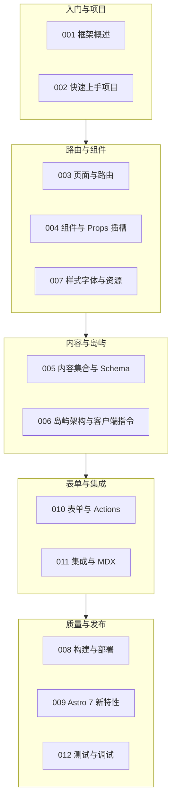

Astro 模块共 12 篇文档，主线是"为内容站把 JavaScript 成本压到最低"。本文仍以"虚拟歌手音乐平台"为背景：歌曲评测、歌姬资料属于纯静态内容，人气投票、播放器则做成按需水合的岛屿。借助这条主线，把岛屿架构、内容集合、文件路由、集成与发布五条线索收拢成一页复习索引。

使用建议：Astro 的知识要点集中在两处——理解"默认零 JS"的输出模型，以及掌握内容集合这套编目系统。前者决定你能否正确设计页面，后者决定站点能否长期维护。复习时建议先重读 [Astro 框架概述与文档站实践](/astro/001-AstroOverview) 的性能问题分析，再按地图逐组检验自己能否复述每个机制解决的是什么问题。

## 前置知识

- [Astro 框架概述与文档站实践](/astro/001-AstroOverview)：理解 SPA 为什么"重"，以及零 JS 默认、像报社一样出版内容的设计哲学。
- [Astro 快速上手项目](/astro/002-QuickStartProject)：会用 create astro 建立并运行第一个项目，认识 src 目录约定。
- [Astro 组件与 Props 插槽](/astro/004-ComponentsProps)：掌握组件三段式结构与 Props、Slot 语法，理解"零件与说明书"的类比。

## 学习目标

1. 能解释 Astro"默认零 JS"的输出模型，说出岛屿架构与整页水合 SPA 的本质差异与各自适用场景。
2. 能为歌姬主页写出 `[id].astro` 动态路由，并用 `getStaticPaths` 在构建期枚举全部页面。
3. 能用内容集合为歌曲评测定义 zod schema，让缺字段、错类型的坏数据在构建期被拦下。
4. 能按需选择 `client:load`、`client:visible`、`client:idle`、`client:media` 等客户端指令控制水合时机。
5. 能说出静态输出与 SSR 适配器的取舍，并为平台选择正确的部署形态与发布流程。

## 知识地图



十二篇文档可以分成两个半场：上半场 C1 与 C2 是"把页面搭出来"，解决结构、路由与样式问题，难度不高但必须一次学扎实；下半场的核心是 C3，内容集合与岛屿架构是 Astro 区别于其他框架的两张名片，也是面试与选型时最常被问到的能力；C4 与 C5 属于把站点做完整、发布出去的收尾工作。若时间紧张，C3 优先级最高。

## 核心概念回顾

### 1. 组件模型：frontmatter 三段式与模板语法

`.astro` 组件由 frontmatter（构建期运行的脚本）、模板（输出 HTML）与可选样式组成。frontmatter 里的代码只在服务器或构建时执行，绝不会进入浏览器，这正是歌曲卡片这类纯展示组件保持零 JS 的原因。同一项目里可以混用任意框架组件，但只有 Astro 组件适合充当页面骨架。

```astro
---
// src/components/SongCard.astro：组件三段式，frontmatter 写构建期逻辑
interface Props {
  title: string // 歌曲名
  singer: string // 演唱歌姬
  themeColor: string // 粉丝团应援色
}
const { title, singer, themeColor } = Astro.props
---
<article style={`border-left: 4px solid ${themeColor}`}>
  <h3>{title}</h3>
  <p>演唱：{singer}</p>
</article>
```

### 2. 文件路由与动态路由

`src/pages/` 下的文件路径就是 URL，不需要维护路由表，页面之间跳转直接使用原生 `<a>` 链接。歌姬主页用 `[id].astro` 承接动态段；静态输出模式下必须导出 `getStaticPaths`，把每个歌姬的页面在构建期全部枚举出来，构建器据此生成对应的 HTML 文件。

```astro
---
// src/pages/singers/[id].astro：动态路由，构建期枚举全部歌姬主页
interface Singer {
  id: string
  name: string
}

export async function getStaticPaths() {
  const singers: Singer[] = await fetch('https://api.fandex.dev/singers').then(
    (r) => r.json(),
  )
  return singers.map((s) => ({ params: { id: s.id } }))
}

const { id } = Astro.params
---
<h1>歌姬主页：{id}</h1>
<a href="/singers/">返回歌姬列表</a>
```

### 3. 内容集合与 Schema 校验

内容集合把一批同类 Markdown 组织成"带编目系统的馆藏"。`content.config.ts` 用 zod 定义每篇评测文档的必填字段与类型，缺字段、日期格式错误都会让构建直接失败，把问题拦在发布之前，而不是等读者点开页面才暴露。这是 FANDEX 这类两千篇级文档站保持秩序的核心机制。

```ts
// src/content.config.ts：为歌曲评测文档定义"借书卡"
import { defineCollection, z } from 'astro:content'
import { glob } from 'astro/loaders'

const songs = defineCollection({
  loader: glob({ pattern: '**/*.md', base: './src/content/songs' }),
  schema: z.object({
    title: z.string(), // 歌曲名
    singer: z.string(), // 演唱歌姬
    producer: z.string(), // P 主
    themeColor: z.string(), // 应援色
    publishedAt: z.coerce.date(), // 发布日期，自动转换字符串
  }),
})

export const collections = { songs }
```

### 4. 集合查询与页面渲染

`getCollection` 是检索馆藏的统一入口，返回的对象带完整类型推导，编辑器能直接提示 data 下的字段。结合动态路由的 `getStaticPaths`，就能在构建期为每篇评测生成独立页面；列表页只负责查询与排序，不需要任何运行时脚本。

```astro
---
// src/pages/songs/index.astro：查询歌曲评测并按发布日期倒序
import { getCollection } from 'astro:content'

const songs = (await getCollection('songs')).sort(
  (a, b) => b.data.publishedAt.valueOf() - a.data.publishedAt.valueOf(),
)
---
<h1>歌曲评测库</h1>
<ul>
  {songs.map((song) => (
    <li>
      <a href={`/songs/${song.id}/`}>{song.data.title}</a>
      <span>应援色：{song.data.themeColor}</span>
    </li>
  ))}
</ul>
```

### 5. 岛屿架构与客户端指令

页面默认是一张"静态冰山"，只有标注 `client:*` 的框架组件才会变成"活"的岛屿。指令的选择本质是水合时机的选择：首屏立刻要用的用 `client:load`，进入视口才需要的用 `client:visible`，浏览器空闲再加载的用 `client:idle`。人气投票按钮用 `client:visible`，滚动到可视区域才加载 React 运行时，首屏成本趋近于零。

```astro
---
// src/pages/index.astro：整页静态，仅投票按钮是需要水合的岛屿
import VoteButton from '../components/VoteButton.tsx'
---
<h1>本季歌姬人气投票</h1>
<p>页面其余部分不携带任何 JavaScript。</p>
<!-- client:visible：进入视口才加载并水合，首屏成本趋近于零 -->
<VoteButton client:visible singer="初霜" />
```

### 6. 集成体系：让框架岛屿与 MDX 生效

Astro 本身只负责输出静态 HTML，框架交互能力通过集成注册。`astro.config.mjs` 中加入 `@astrojs/react` 后，`.tsx` 组件才能作为岛屿使用；MDX 集成则让评测文档可以内嵌组件，实现"文章里嵌投票器"这类需求。集成按需添加，没注册的框架组件会被当作普通字符串渲染。

```ts
// astro.config.mjs：注册 React 集成，让 .tsx 岛屿可用
import { defineConfig } from 'astro/config'
import react from '@astrojs/react'

export default defineConfig({
  integrations: [react()],
  site: 'https://fandex.example.com', // 供 sitemap 与 canonical 使用
})
```

### 7. 表单与 Actions：服务端校验粉丝团报名

Astro Actions 把"接收输入、服务端校验、返回结果"收敛为一个带 schema 的函数。`input` 定义校验规则，只有通过 zod 校验的输入才会进入 `handler`，报名接口因此天然防脏数据；配合渐进增强，表单在无 JS 环境下也能回退为普通 POST 提交。

```ts
// src/actions/index.ts：粉丝团报名的服务端校验
import { defineAction, z } from 'astro:actions'

export const server = {
  fanClub: {
    join: defineAction({
      input: z.object({
        nickname: z.string().min(1, '昵称不能为空'),
      }),
      handler: async (input) => {
        // 通过校验后才会执行，这里可以安全地写入数据库
        return { welcome: `欢迎加入粉丝团，${input.nickname}` }
      },
    }),
  },
}
```

## 易混淆概念对比

### Astro 岛屿与整页水合的 SPA

| 对比项 | Astro 岛屿 | 整页水合的 SPA |
| --- | --- | --- |
| 初始 JavaScript | 仅有被激活岛屿的运行时 | 整站框架与页面代码 |
| 首屏渲染 | 构建期生成的完整 HTML | 等待 JS 下载执行后渲染 |
| 交互范围 | 仅 `client:*` 标注的组件 | 整棵组件树全部可交互 |
| 页面跳转 | 原生 `<a>` 链接整页加载 | 客户端路由拦截，无整页刷新 |
| 适用站点 | 文档站、博客、内容为主的平台 | 后台系统、重交互应用 |

### Astro 组件与 UI 框架组件

| 对比项 | Astro 组件（.astro） | 框架组件（.tsx 或 .vue） |
| --- | --- | --- |
| 运行时机 | 构建期或请求期，输出纯 HTML | 可被打包为浏览器脚本 |
| 状态与交互 | 无状态，不支持事件绑定 | 完整的 useState、事件与生命周期 |
| 打包结果 | 零 JavaScript | 需 `client:*` 指令才加载运行时 |
| 混用方式 | 可包裹任意框架组件 | 无法直接包含 Astro 组件模板 |
| 典型用途 | 页面骨架、列表、纯展示卡片 | 投票按钮、播放器、搜索框 |

## 常见误区与排查

### 误区 1：忘记 client 指令导致组件没有交互

这是 Astro 新手的第一大坑：React 组件只被渲染成 HTML 照片，点击毫无反应。

```astro
---
import VoteButton from '../components/VoteButton.tsx'
---
<!-- 错误：按钮只是 HTML 照片，点击毫无反应 -->
<VoteButton singer="初霜" />

<!-- 修正：加上 client 指令，组件才会水合成活岛屿 -->
<VoteButton client:load singer="初霜" />
```

### 误区 2：所有岛屿都用 client:load

```astro
---
import Player from '../components/Player.tsx'
import BackTop from '../components/BackTop.tsx'
---
<!-- 错误：两个组件首屏就加载运行时，零 JS 优势被吃掉 -->
<Player client:load song="星屑协奏曲" />
<BackTop client:load />

<!-- 修正：按交互时机选择指令，滚动可见或空闲时再水合 -->
<Player client:visible song="星屑协奏曲" />
<BackTop client:idle />
```

### 误区 3：在 frontmatter 中访问浏览器对象

frontmatter 在构建期或服务器端执行，那里没有 window 与 document。

```astro
---
// 错误：frontmatter 在构建期执行，不存在 window 与 document
const width = window.innerWidth
---
<p>当前宽度：{width}</p>

<!-- 修正：把浏览器逻辑放进客户端岛屿组件 -->
---
import ViewportInfo from '../components/ViewportInfo.tsx'
---
<ViewportInfo client:idle />
```

### 误区 4：静态模式下动态路由缺少 getStaticPaths

```astro
---
// 错误：静态输出时 [id].astro 没有导出 getStaticPaths，构建直接报错
const { id } = Astro.params
---
<h1>歌姬 {id}</h1>

---
// 修正：枚举全部合法参数后再读取动态段
export async function getStaticPaths() {
  const singers = await fetch('https://api.fandex.dev/singers').then((r) => r.json())
  return singers.map((s: { id: string }) => ({ params: { id: s.id } }))
}
const { id } = Astro.params
---
<h1>歌姬 {id}</h1>
```

### 误区 5：内容集合的日期字段没有做类型转换

```ts
// 错误：frontmatter 里的日期是字符串，z.date() 校验直接失败
schema: z.object({
  publishedAt: z.date(),
})

// 修正：使用 z.coerce.date() 自动把字符串转成 Date
schema: z.object({
  publishedAt: z.coerce.date(),
})
```

### 误区 6：在 .astro 模板里写 React 风格的事件

```astro
---
import VoteButton from '../components/VoteButton.tsx'
---
<!-- 错误：Astro 模板没有事件系统，onClick 被原样输出成非法属性 -->
<button onClick={() => vote()}>投票</button>

<!-- 修正：交互交给岛屿组件，事件写在 .tsx 内部 -->
<VoteButton client:load singer="初霜" />
```

### 误区 7：子路径部署却没有配置 base

站点发布到 GitHub Pages 这类子路径时，所有内部链接都必须带上前缀，否则整站 404。

```ts
// 错误：未配置 base，链接指向域名根路径，部署后全部 404
export default defineConfig({})

// 修正：声明 base，让链接统一生成 /repo/ 前缀
export default defineConfig({ base: '/repo/' })
```

### 误区 8：把页面写进 components 目录

页面必须放在 `src/pages/` 下才会成为路由；组件放在 `src/components/`，两者混放会导致页面静默丢失，访问时只有 404。排查口诀：URL 少了一页，先确认对应的 `.astro` 文件是否真的在 pages 目录树里。

## 自检清单

- [ ] 能解释"为 10% 的交互付出 100% 的 JS 成本"这句话，并说出 Astro 的解法。
- [ ] 能写出组件三段式结构，并说明 frontmatter 代码为何不会进入浏览器。
- [ ] 能用 getStaticPaths 为歌姬主页枚举页面，并解释它与 Astro.params 的关系。
- [ ] 能为歌曲评测集合定义含日期、枚举、默认值的 zod schema，并说清校验失败的构建表现。
- [ ] 能说出 client:load、client:idle、client:visible、client:media 各自的水合时机与选型依据。
- [ ] 能解释 Astro 组件无法包含状态，而岛屿组件可以的原因。
- [ ] 能在 astro.config.mjs 中注册 React 集成与 site 基础路径。
- [ ] 能用 Astro Action 实现粉丝团报名，并说清 zod 校验失败时的返回路径。
- [ ] 能说出静态输出与 SSR 适配器的差异，并为平台选定部署形态。
- [ ] 能用构建产物目录结构说明"为什么这个页面没有加载任何 JS"。

## 后续学习路径

1. 复习 [Astro 页面与路由](/astro/003-PagesRouting)，把静态、动态、Rest 参数、嵌套路由与重定向一次吃透。
2. 深入 [内容集合与 Schema](/astro/005-ContentCollections)，练习 glob loader 与 Live Content Collections，为更大规模的内容站做准备。
3. 精读 [岛屿架构与客户端指令](/astro/006-IslandsClientComponents)，掌握多框架岛屿共存与岛屿间通信方案。
4. 学习 [样式字体与资源](/astro/007-StylingFontsAssets)，把应援色主题落到作用域样式与字体 API 上，避免样式串扰。
5. 补齐 [表单与 Actions](/astro/010-AstroFormsActions)，为报名、评论等输入场景建立服务端校验与错误反馈链路。
6. 实践 [集成与 MDX](/astro/011-AstroIntegrationsMdx)，让评测文档可以内嵌交互岛屿，扩展内容的表现力。
7. 走一遍 [构建与部署](/astro/008-BuildDeploy)，把平台发布到静态托管或带适配器的 SSR 环境，并配置好环境变量。
8. 跟进 [Astro 7 新特性](/astro/009-Astro7Features)，再用 [测试与调试](/astro/012-AstroTestingDebugging) 收尾，保证框架升级不踩坑。
