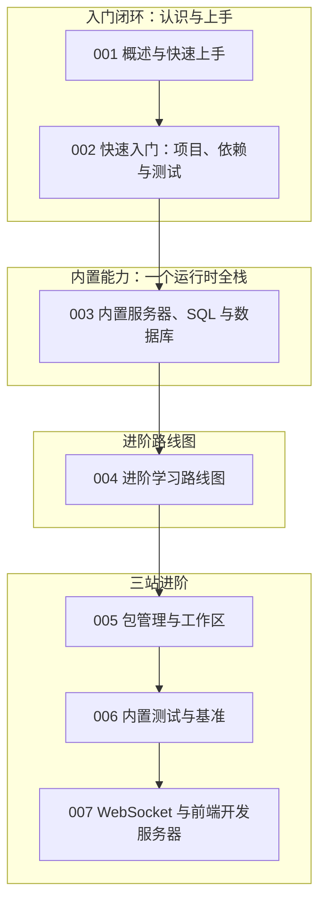

本篇是 bun 模块的收官总结。我们继续以"虚拟歌手音乐平台"为贯穿场景：用 Bun 给平台做一个轻量后端——P 主提交歌曲（song）、歌姬（virtual singer）的应援色档案入库、演唱会（concert）报名、粉丝团（fan club）的实时弹幕。围绕这些需求，把前 7 篇文档的核心内容重新串一遍：全家桶运行时、项目与依赖、内置服务器与 SQL，以及路线图指向的三站进阶。读完请用自检清单核对掌握程度。回顾的方法同样是"按能力块自测"：运行时定位、项目与依赖、内置服务器、内置 SQL、测试与实时通信，每一块都能独立出题考自己。Bun 的学习曲线很平，但"哪些能力是内置的、哪些仍需外部包"这根边界线，决定你能不能真正省掉一半依赖，也决定了遇到兼容问题时的排查方向。

## 前置知识

- [Bun 概述与快速上手](/bun/001-BunOverview)：理解 Bun 为什么被称为"全家桶"运行时，是所有后续内容的出发点。
- [Bun 快速入门：项目、依赖与测试](/bun/002-BunQuickStart)：`bun init`、`bun add`、`bun test` 三板斧是日常开发的主路径，回顾前先跑通示例项目。

提醒一点：模块内 005-007 三篇当前是占位文档，主题已规划、正文待补全。先用本文与路线图搭骨架、自行跑通三站的最小示例，等正文发布后再对照补齐即可。

## 学习目标

1. 能说出 Bun 与 Node.js 的生态位差异：哪些能力内置、哪些 npm 包可以省掉。
2. 能用 `Bun.serve` 写出带路由与 JSON 响应的 HTTP 服务，并用 `Bun.sql` 完成 SQLite 持久化。
3. 能用 `bun init/add/test` 管理一个完整的 TypeScript 项目，理解其与 npm 生态的兼容关系。
4. 能对照进阶路线图的三站（包管理、测试、WebSocket）规划后续学习并动手验证。

还有一条值得单独点出的主线：Bun 的"快"不是孤立的卖点，而是贯穿安装、启动、测试、构建全链路的整体设计。装包快，是因为锁文件与并行下载共用一套缓存；启动快，是因为解释器与工具链共享同一个可执行文件；测试快，是因为测试器与业务代码跑在同一个进程模型里。理解了"快是系统工程"这个前提，就不会把 Bun 简单当成更快的 Node，而是会主动用内置能力替换外部依赖、用单文件脚本替代临时工程。回顾各节时，建议把"这一步省掉了什么"当作每段代码的隐藏副标题：能省掉一个依赖，就少一份供应链风险与安装时间；能少一份配置，就少一处出错的角落。边读边问，全模块的知识自然连成一体，也为下一阶段的三站进阶打好地基。

## 知识地图



读图按编号推进：001、002 完成入门闭环，003 集中展示"一个运行时全栈"的内涵，004 是承上启下的路线图，005 到 007 是路线图展开的三站。值得注意的结构是"内置能力"只有一篇却是整个模块的招牌——服务器、SQL、Redis 客户端、文件路由四件事都写在 003，学透这一篇，Bun 的核心卖点就掌握了。

## 核心概念回顾

### 1. 全家桶运行时

Bun 是 Zig 编写的 JavaScript/TypeScript 运行时，把"解释器 + 包管理器 + 测试器 + 打包器"装进一个可执行文件：`bun hello.ts` 直接执行 TypeScript，启动快到几乎无感，而项目形态仍是 `package.json` 加 `node_modules` 的那套生态（见[概述与快速上手](/bun/001-BunOverview)）：

```typescript
// hello.ts —— 感受启动速度：打印歌姬应援色主题
const start = performance.now()
const theme: Record<string, string> = { miku: "#39c5bb", teto: "#eba9ee" }

console.log(`主题色已加载：${theme.miku}`)
console.log(`耗时：${(performance.now() - start).toFixed(1)}ms`)
```

全家桶的判断标准不是"有这个命令"，而是"命令之间共享同一套运行时"：bun install 与 bun test 跑在同一个进程模型上，启动开销与内存占用因此都更小。执行 TypeScript 无需编译配置，这一点让脚本与服务的界限也变得模糊——很多平台小工具（比如同步应援色配置的定时任务）直接用 bun 运行一个 .ts 文件就够了，不必起一个完整工程。

### 2. 项目、依赖与测试

Bun 的项目还是标准 npm 生态：`bun init` 生成开箱即用的 TypeScript 配置，`bun add` 管理依赖并写入 package.json，`bun test` 内置 Jest 兼容的测试器，全程不用额外安装工具（见[快速入门](/bun/002-BunQuickStart)）：

```typescript
// songs.test.ts —— 歌曲工具函数的测试：bun test 直接运行，零配置
import { describe, expect, test } from "bun:test"
import { formatSongTitle } from "./songs"

describe("formatSongTitle", () => {
  test("拼接歌姬名与曲名", () => {
    // 粉丝习惯看到"曲名 feat. 歌姬名"的展示格式
    expect(formatSongTitle("Tell Your World", "初音未来"))
      .toBe("Tell Your World feat. 初音未来")
  })
})
```

bun:test 的 Jest 兼容面覆盖 describe、test、expect 与常用 matcher，从 Jest 项目迁移大多是改一下 import 来源。测试文件与业务同目录的约定让"改一行就跑测试"的成本足够低，质量习惯能坚持下来的前提正是这个低成本循环。

### 3. Bun.serve：内置 HTTP 服务器

`Bun.serve` 用一个 fetch 函数描述全部路由：解析 URL、按路径分发、返回 Response 对象。没有框架时它是平台的轻量后端，接 Web 框架时它又可以直接当宿主（见[内置服务器、SQL 与数据库](/bun/003-BunBuiltinServerSQL)）：

```typescript
// server.ts —— 平台轻量后端：歌曲查询与演唱会报名
Bun.serve({
  port: 3000,
  async fetch(request) {
    const url = new URL(request.url)

    if (url.pathname === "/api/singers") {
      return Response.json([{ name: "初音未来", color: "#39c5bb" }])
    }

    if (url.pathname === "/api/concerts/signup" && request.method === "POST") {
      const fan = await request.json() // 粉丝团报名信息
      return Response.json({ ok: true, seatZone: fan.grade >= 3 ? "A" : "B" })
    }

    return new Response("Not Found", { status: 404 })
  }
})
```

Bun.serve 的 fetch 签名与 Web 标准一致：拿到 Request、返回 Response，任何标准库知识都能直接迁移。简单服务不需要框架；路由一旦多起来，再把 Hono 这类框架挂到同一个 fetch 上，升级路径是平滑的，这也呼应了 003 篇"文件路由"的思路——能力分层可选，而不是二选一。

### 4. Bun.sql：内置 SQL 与数据库

Bun 内置 SQL 客户端与 Redis 客户端，SQLite 场景连驱动都不用装：建表、插入、查询都是纯 SQL 语句加参数占位。平台的应援色档案与歌曲索引可以直接落在本地库文件里（见[内置服务器、SQL 与数据库](/bun/003-BunBuiltinServerSQL)）：

```typescript
// db.ts —— 用 Bun.sql 管理歌姬档案库（SQLite）
import { sql } from "bun"

await sql`CREATE TABLE IF NOT EXISTS singers (
  id INTEGER PRIMARY KEY,
  name TEXT NOT NULL,
  theme_color TEXT NOT NULL
)`

// 插入一位歌姬：参数占位防注入
await sql`INSERT INTO singers (name, theme_color) VALUES (${ "重音テト" }, ${ "#eba9ee" })`

const rows = await sql`SELECT name, theme_color FROM singers` // 查询返回普通对象数组
console.log(rows)
```

SQLite 的场景边界要分清：本地缓存、单机小服务、配置存储用内置 SQL 最顺手；需要多实例共享写入的数据仍然交给 PostgreSQL 这类服务端数据库。内置 Redis 客户端覆盖的则是计数、排行榜这类高频读写场景，三者的分工在 003 篇的示例里都有对应。

### 5. 进阶三站：包管理、测试与实时

路线图把剩余能力拆成三站：包管理与工作区让项目"装得快、装得稳"（bun install、bun.lock、workspaces），内置测试与基准让代码"改得起"（bun test、mock、覆盖率），WebSocket 与前端开发服务器把能力扩展到实时通信（websocket 处理器、routes 路由表）。粉丝团弹幕是最典型的实时场景（见[进阶学习路线图](/bun/004-AdvancedRoadmap)）：

```json
{
  "name": "vsmusic-platform",
  "workspaces": [
    "apps/web",
    "packages/shared"
  ]
}
```

```typescript
// broadcast.ts —— 粉丝团应援弹幕：WebSocket 消息广播给全部连接
Bun.serve({
  port: 3001,
  websocket: {
    message(ws, message) {
      ws.publish("concert", message) // 把弹幕转发到演唱会频道
    },
    open(ws) {
      ws.subscribe("concert") // 新粉丝进入订阅频道
    }
  },
  fetch() {
    return new Response("弹幕服务运行中")
  }
})
```

路线图的三站对应三个工程问题：包管理解决"装得快装得稳"，测试解决"改得起"，WebSocket 解决"实时与一体化"。工作区让平台前端与后端共享类型定义，bun.lock 把版本冻结成可复现的安装，这两件事在 monorepo 里是一体的，也是从"能跑"走向"可维护"的分水岭。

## 易混淆概念对比

Bun 与 Node.js 最容易混淆的是"生态位"——两者共享 npm 生态，但能力边界不同：

| 维度 | Node.js | Bun |
| --- | --- | --- |
| TypeScript 执行 | 需 ts-node/编译或原生 strip types | 直接运行，零配置 |
| 包管理 | 依赖 npm/pnpm/yarn 外部工具 | 内置 bun install 与 bun.lock |
| HTTP 服务器 | 需 Express/Hono 等框架或原生 http | 内置 Bun.serve |
| 测试与基准 | 依赖 Jest/Vitest 外部安装 | 内置 bun test 与 Jest 兼容面 |
| 生态兼容 | 事实标准 | 兼容大部分 Node API 与 npm 包 |

内置能力与传统组合的对照，解释了"少装一半依赖"这句话：

| 需求 | 传统组合（各自安装） | Bun 内置 |
| --- | --- | --- |
| HTTP 服务 | Express | Bun.serve |
| 数据库驱动 | better-sqlite3 等三方包 | Bun.sql |
| 缓存客户端 | ioredis | 内置 Redis 客户端 |
| 测试框架 | Jest/Vitest | bun:test |
| 实时通信 | ws 包 | websocket 处理器 |

总结的落点同样是"条件反射"：看到 HTTP 服务想到 Bun.serve，看到本地存储想到 Bun.sql，看到测试想到 bun:test，看到装包慢想到 bun install。同时保留一条边界意识：遇到兼容性问题先查官方兼容性文档，确认是内置能力缺失还是 Node API 行为差异，排查方向立刻收敛，不会在错误的层面浪费时间。

## 常见误区与排查

以下五条是初上手 Bun 最容易踩的坑，每条先给错误写法，再给修正代码。

1. 混淆 `bun run` 与 `bun` 直接执行：前者执行 package.json 的 script，后者直接运行文件。写错会导致"找不到脚本"：

```bash
# 错误：bun run 后接文件路径，会去 package.json 的 scripts 里找
# bun run server.ts

# 正确：直接执行文件用 bun；执行脚本才用 bun run
bun server.ts
bun run dev # 等价于 npm run dev
```

2. 以为所有 Node 原生模块都可用，遇到个别原生扩展或冷门 API 时报兼容错误。先查 Bun 的兼容性文档，必要处回退 Node：

```typescript
// 错误：默认冷门原生模块全部可用
// import nativeCodec from "some-native-codec"

// 正确：优先用 Bun 内置等价能力替代
const compressed = Bun.gzipSync(Buffer.from("应援色数据")) // 内置压缩
```

3. 把 `Bun.sql` 当成 PostgreSQL 客户端去连远程库。`Bun.sql` 的内置面以 SQLite 为主，远程关系库仍需对应驱动（见[内置服务器、SQL 与数据库](/bun/003-BunBuiltinServerSQL)）：

```typescript
// 错误：假设内置 SQL 直连任意远程数据库
// await sql`CONNECT postgres://...`

// 正确：内置 SQL 面向 SQLite 场景，远程库用官方驱动
import pg from "pg" // bun add pg
const pool = new pg.Pool({ connectionString: process.env.DATABASE_URL })
```

4. 忘记把 `bun.lock` 提交进仓库，团队与 CI 各自解析出不同版本，出现"我这台是好的"。锁文件必须入库，CI 用冻结模式安装：

```bash
# 错误：.gitignore 里排除 bun.lock，依赖版本随时间漂移
# echo bun.lock >> .gitignore

# 正确：锁文件入库，CI 以冻结模式保证可复现安装
bun install --frozen-lockfile
```

5. WebSocket 处理器里忘记 `ws.subscribe` 频道，广播永远收不到消息。发布与订阅必须成对出现：

```typescript
// 错误：只 publish 不 subscribe，客户端收不到任何弹幕
// message(ws, msg) { ws.publish("concert", msg) }

// 正确：open 时先订阅，message 时再发布
open(ws) { ws.subscribe("concert") },
message(ws, msg) { ws.publish("concert", msg) }
```

三站自检全部通过后，可以做一个综合练习：把平台的"弹幕 + 出票"合并成一个小项目——Bun.serve 托管页面、WebSocket 广播弹幕、Bun.sql 记录出票、bun test 覆盖关键函数，四个内置能力一次串通，做完再回头数一数 package.json 里省掉了多少依赖。

## 自检清单

- [ ] 能说出 Bun 内置了哪些传统上需要外部安装的工具（包管理、测试、服务器、SQL）
- [ ] 能用 `bun init` 与 `bun add` 从零搭起一个 TypeScript 项目
- [ ] 能用 `Bun.serve` 写出带 404 兜底的 JSON API
- [ ] 能用 `Bun.sql` 建表、插入并查询应援色档案
- [ ] 能写出 `bun:test` 的用例并解释它与 Jest 的兼容关系
- [ ] 能为 monorepo 配置 workspaces 并说明 bun.lock 的作用
- [ ] 能实现一个 WebSocket 广播最小示例，说清 subscribe 与 publish 的配对关系
- [ ] 能对照路线图说出三站进阶各自解决什么问题、顺序为何不可颠倒

自检不必一次全过：先勾选有把握的条目，反复不过的那几条，多半是示例没有亲手跑过——回到对应文档把代码敲一遍再回来验收，比反复阅读有效十倍。

## 后续学习路径

1. 巩固内置能力：重读[内置服务器、SQL 与数据库](/bun/003-BunBuiltinServerSQL)，把服务器、SQL、Redis、文件路由四块各写一个最小示例。
2. 走进阶路线：按[进阶学习路线图](/bun/004-AdvancedRoadmap)的三站顺序，依次攻克[包管理与工作区](/bun/005-BunPackageManagerWorkspaces)、[内置测试与基准](/bun/006-BunTestBench)、[WebSocket 与前端开发服务器](/bun/007-BunWebSocketFrontendDev)。
3. 对照 Node 项目：选一个自己写过的 Express 服务，用 Bun 等价内置能力重写并比较依赖数量。
4. 每完成一站回到本文自检清单勾选对应条目，保持知识体系完整。
