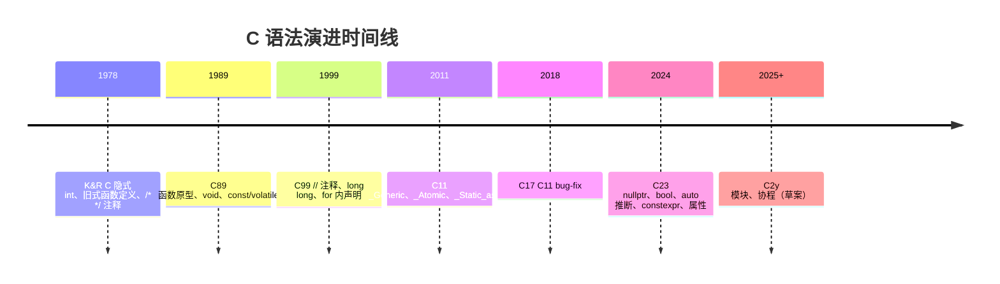
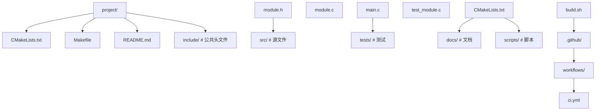

## 前置知识

- [C 语言概述](/c/002-CLanguageOverview)：建议先完成前一篇的学习

## 学习目标

- 掌握「0. 前言与导读」的核心机制、典型用法与常见陷阱
- 掌握「1. 历史动机与发展脉络」的核心机制、典型用法与常见陷阱
- 掌握「2. 形式化定义」的核心机制、典型用法与常见陷阱
- 掌握「3. 理论推导与原理解析」的核心机制、典型用法与常见陷阱
- 掌握「4. 代码示例」的核心机制、典型用法与常见陷阱


## 0. 前言与导读

本文是 FANDEX C 模块的基础章节，系统讲解 C 程序的组成结构、语法元素与编译过程。掌握本章是后续学习数据类型、指针、函数、模块化编程的前提。本文对标 K&R《The C Programming Language》第 1 章与 ISO/IEC 9899:2024 (C23) 标准。

阅读本文后，读者应能够：

- 用准确的术语描述 C 程序的语法元素（token、preprocessing directive、declaration、statement、expression）；
- 编写结构清晰、注释规范、命名一致的 C 程序；
- 理解 C 程序从源代码到可执行文件的完整编译流水线；
- 区分声明（declaration）与定义（definition）；
- 使用现代 C（C11/C23）的语法特性编写可移植代码。

---

## 1. 历史动机与发展脉络

### 1.1 K&R 时代的程序结构

K&R C（1978）的程序结构相对松散：

- 隐式 int：未声明类型的变量默认 `int`。
- 旧式函数定义：`int add(a, b) int a, b; { ... }`。
- 无函数原型：调用前无需声明参数类型。
- 注释仅 `/* ... */`。

K&R 时代的 hello.c：

```c
main()
{
    printf("hello, world\n");
}
```

注意：`main` 默认返回 `int`，`printf` 隐式声明（C89 仍允许，C99 起禁止）。

### 1.2 C89 的标准化

C89 引入了：

- 函数原型：`int add(int a, int b);`。
- `void` 关键字。
- `const`、`volatile` 类型限定符。
- 完整的标准库。

C89 风格的 hello.c：

```c
#include <stdio.h>

int main(void)
{
    printf("hello, world\n");
    return 0;
}
```

### 1.3 C99 的现代化

C99 引入了：

- `//` 单行注释。
- `long long` 类型。
- 变量可在使用处声明（C89 要求在块首）。
- `for` 循环内的变量声明：`for (int i = 0; ...)`.
- 指定初始化器：`struct Point p = {.x = 1, .y = 2};`。

### 1.4 C11/C17 的并发与安全

C11 引入了：

- 多线程：`<threads.h>`、`_Thread_local`、`_Atomic`。
- `_Generic` 泛型选择。
- `_Static_assert` 静态断言。
- 匿名结构体/联合体成员。
- 边界检查接口（Annex K，可选）。

### 1.5 C23 的现代化

C23 进一步现代化：

- `bool`、`true`、`false` 成为关键字。
- `nullptr` 替代 `NULL`。
- `auto` 类型推断。
- `typeof`、`typeof_unqual`。
- 数字分隔符：`1'000'000`。
- 二进制字面量：`0b1010'1100`。
- `[[nodiscard]]`、`[[maybe_unused]]` 标准化属性。
- 移除 K&R 函数定义、三字母词。
- `constexpr` 对象。

C23 风格的 hello.c：

```c
#include <stdio.h>

int main(void)
{
    constexpr auto greeting = "hello, world\n";
    printf("%s", greeting);
    return 0;
}
```

### 1.6 演进时间线



---

## 2. 形式化定义

### 2.1 翻译阶段（Phases of Translation）

ISO/IEC 9899:2024 §5.1.1.2 定义了 C 程序的八个翻译阶段：

| 阶段 | 操作 |
| --- | --- |
| 1 | 物理源文件字符映射到源字符集（含三字母词替换，C23 移除） |
| 2 | 行拼接（反斜杠 `\` 后换行被删除） |
| 3 | 注释替换为单个空格；token 化；识别预处理指令 |
| 4 | 执行预处理指令（`#include`、`#define`、`#if`）；展开宏 |
| 5 | 字符常量与字符串字面量中的转义序列解释 |
| 6 | 相邻字符串字面量拼接 |
| 7 | 编译为汇编代码，再汇编为目标文件 |
| 8 | 链接所有目标文件与库，解析外部引用，生成可执行文件 |

### 2.2 Token（词法单元）

ISO/IEC 9899:2024 §6.4 定义 token 分类：

$$
\text{token} ::= \text{keyword} \mid \text{identifier} \mid \text{constant} \mid \text{string-literal} \mid \text{punctuator}
$$

预处理 token 还包含：头文件名、`#`、`##`、`__VA_ARGS__` 等。

### 2.3 标识符形式化

ISO/IEC 9899:2024 §6.4.2 定义标识符：

$$
\text{identifier} ::= \text{identifier-nondigit} \mid \text{identifier identifier-nondigit} \mid \text{identifier digit}
$$

$$
\text{identifier-nondigit} ::= \text{nondigit} \mid \text{universal-character-name}
$$

其中 `nondigit` 为 `[A-Za-z_]`，`digit` 为 `[0-9]`，`universal-character-name` 允许 Unicode 字符（如 `\u00E9` 等价于 `é`）。

C23 进一步允许标识符中直接使用 Unicode 字符（部分实现）：

```c
int café = 1;  // C23 允许
```

### 2.4 声明与定义

**声明（declaration）**：引入一个名字，告知其类型与链接性。

**定义（definition）**：实际创建对象、函数或类型实例。

形式化：

$$
\text{Declaration} \to \text{introduces name} \to \text{type}
$$

$$
\text{Definition} \to \text{creates instance} \to \text{storage}
$$

例如：

```c
extern int x;       /* 声明：告知 x 存在，类型 int */
int x = 42;         /* 定义：分配存储并初始化 */

int add(int, int);  /* 函数声明（原型） */
int add(int a, int b) { return a + b; }  /* 函数定义 */
```

### 2.5 翻译单元

ISO/IEC 9899:2024 §5.1.1.1：

$$
\text{TranslationUnit} = \text{SourceFile} \oplus \bigcup_{i} \text{Header}_i \ominus \text{Skipped}
$$

预处理后，所有 `#include` 展开为一个完整的翻译单元。

### 2.6 作用域（Scope）

ISO/IEC 9899:2024 §6.2.1 定义作用域：

| 作用域 | 范围 |
| --- | --- |
| Block scope | 在 `{}` 内，自声明点到块尾 |
| File scope | 从声明点到翻译单元末尾 |
| Function prototype scope | 函数原型参数列表内 |
| Function scope | 仅 label，整个函数内 |

C99 新增：

| 作用域 | 范围 |
| --- | --- |
| Function scope (for loop) | `for (int i = 0; ...)` 中 `i` 仅在循环内 |

形式化：

$$
\text{Scope}(n) = \text{region where name } n \text{ is visible}
$$

### 2.7 链接（Linkage）

ISO/IEC 9899:2024 §6.2.2：

| 链接类型 | 可见范围 |
| --- | --- |
| External linkage | 整个程序 |
| Internal linkage | 当前翻译单元 |
| No linkage | 当前作用域 |

```c
int x = 1;              /* external linkage */
static int y = 2;       /* internal linkage */
void f(void) {
    int z = 3;          /* no linkage */
}
```

### 2.8 存储期（Storage Duration）

ISO/IEC 9899:2024 §6.2.4：

| 存储期 | 生命周期 |
| --- | --- |
| Static | 程序整个生命周期 |
| Thread (C11) | 线程整个生命周期 |
| Automatic | 所在代码块执行期间 |
| Allocated | `malloc` 到 `free` |

### 2.9 类型（Type）

ISO/IEC 9899:2024 §6.2.5 定义类型分类：

- **object type**：对象类型（`int`、`struct S` 等）。
- **function type**：函数类型。
- **incomplete type**：不完整类型（如 `void`、`struct S;` 前向声明）。

类型由四部分组成：

1. 基本类型（basic type）。
2. 派生类型（derived type）：pointer、array、function、struct、union。
3. 类型限定符（type qualifier）：`const`、`volatile`、`restrict`、`_Atomic`。
4. 函数说明符（function specifier）：`inline`、`_Noreturn`。

---

## 3. 理论推导与原理解析

### 3.1 文法与语法分析

C 语法用上下文无关文法（CFG）描述。例如声明语句的产生式：

$$
\text{declaration} ::= \text{declaration-specifiers init-declarator-list}_{opt} \; ;
$$

$$
\text{declaration-specifiers} ::= \text{storage-class-specifier} \mid \text{type-specifier} \mid \text{type-qualifier} \mid \text{function-specifier} \mid \text{alignment-specifier}
$$

复杂的"右左法则"用于解析 C 声明：

1. 从标识符开始。
2. 向右看（数组 `[]`、函数 `()`）。
3. 遇到 `)` 或 `;` 时向左看（指针 `*`）。
4. 重复 2-3 直到解析完成。

例如：

```c
int (*fp)(int);
```

解析讲解：`fp` 是指针，指向一个函数，函数接受 `int` 返回 `int`。

### 3.2 词法分析的歧义

C 词法分析遵循"最大 munch"（maximal munch）原则：每一步都匹配最长的可能 token。

例如：

```c
a+++b;     /* 等价于 a++ + b，而非 a + ++b */
```

但注意：

```c
a---b;     /* 等价于 a-- - b，而非 a - --b */
```

更微妙的例子：

```c
/* C 风格注释 */
i = a/*b;  /* 这是注释开始，而非除法 */
```

为避免歧义，建议在除号后加空格：

```c
i = a / *b;  /* 显式除法 */
```

### 3.3 字符集与编码

C 源代码使用以下字符集：

- **基本源字符集**（96 字符）：ASCII 字母、数字、标点、空白。
- **扩展源字符集**：通过 universal-character-name（`\uXXXX`）。

C23 引入 UTF-8 字符串字面量：

```c
const char *s = u8"你好";      /* C11/C17: const char[] */
const char *t = u8"Hello";    /* C23: const char[]，与之前一致 */
char8_t *u = u8"你好";         /* C23 中 u8"" 在 char8_t 字符串 */
```

### 3.4 转义序列

| 转义 | 含义 |
| --- | --- |
| `\n` | 换行 LF |
| `\r` | 回车 CR |
| `\t` | 水平制表 |
| `\v` | 垂直制表 |
| `\f` | 换页 |
| `\a` | 响铃 |
| `\b` | 退格 |
| `\\` | 反斜杠 |
| `\'` | 单引号 |
| `\"` | 双引号 |
| `\?` | 问号 |
| `\0` | 空字符 |
| `\xHH` | 十六进制 |
| `\OOO` | 八进制 |
| `\uXXXX` | 通用字符名（4 位十六进制） |
| `\UXXXXXXXX` | 通用字符名（8 位十六进制） |

### 3.5 标识符长度

C 标准规定：

- **最小支持长度**：31 个有效字符（C89），63 个（C99+）。
- **外部链接标识符**：31 个有效字符（C89），31 个（C99），4095 个（C23+）。

实际编译器支持长度更长（GCC、Clang 通常支持 4095 字符）。

### 3.6 注释语义

注释在翻译阶段 3 被替换为单个空格：

```c
int/* comment */x;  /* 等价于 int x; */
```

注意"行尾反斜杠续行"与"注释"的交互：

```c
// comment \
this is still comment
int x;
```

C23 引入 `//` 单行注释已 20 余年，C89 仍要求 `/* */`。

### 3.7 字符串字面量

字符串字面量类型：

```c
char *a = "hello";           /* C89/C99/C11/C17: char[] */
const char *b = "hello";      /* C23: const char[]（breaking change） */
```

C23 起，字符串字面量类型为 `const char[]`（去除历史 `char[]`），修改字符串字面量是 UB。

修改字符串字面量：

```c
char *s = "hello";
s[0] = 'H';   /* UB：修改只读内存 */
```

---

## 4. 代码示例

### 4.1 完整 C 程序结构

```c
/* main.c — 完整 C 程序结构示例（C23） */

/* 1. 预处理指令 */
#include <stdio.h>
#include <stdlib.h>
#include <stdint.h>

/* 2. 宏定义 */
#define PI 3.14159
#define MAX_SIZE 100
#define SQUARE(x) ((x) * (x))

/* 3. 类型定义 */
typedef struct {
    int32_t x;
    int32_t y;
} Point;

typedef enum {
    COLOR_RED,
    COLOR_GREEN,
    COLOR_BLUE
} Color;

/* 4. 全局变量（外部链接） */
int g_counter = 0;

/* 5. 内部链接变量（仅本文件可见） */
static int s_internal = 42;

/* 6. 函数原型 */
static int32_t compute_distance(Point a, Point b);
[[nodiscard]] Point *point_new(int32_t x, int32_t y);
void point_free(Point *p);

/* 7. 主函数 */
int main(int argc, char *argv[])
{
    (void)argc;
    (void)argv;

    Point p1 = {.x = 0, .y = 0};
    Point p2 = {.x = 3, .y = 4};

    int32_t dist = compute_distance(p1, p2);
    printf("Distance: %d\n", dist);

    Point *p = point_new(10, 20);
    if (p == nullptr) {
        fprintf(stderr, "Allocation failed\n");
        return EXIT_FAILURE;
    }
    printf("Point: (%d, %d)\n", p->x, p->y);
    point_free(p);

    return EXIT_SUCCESS;
}

/* 8. 函数定义 */
static int32_t compute_distance(Point a, Point b)
{
    int32_t dx = b.x - a.x;
    int32_t dy = b.y - a.y;
    return (int32_t)(SQUARE(dx) + SQUARE(dy));
}

[[nodiscard]] Point *point_new(int32_t x, int32_t y)
{
    Point *p = malloc(sizeof(Point));
    if (p != nullptr) {
        p->x = x;
        p->y = y;
    }
    return p;
}

void point_free(Point *p)
{
    free(p);
}
```

### 4.2 头文件结构

```c
/* point.h — 头文件 */
#ifndef POINT_H
#define POINT_H

#include <stdint.h>

/* 类型定义 */
typedef struct Point Point;

/* 函数原型 */
[[nodiscard]] Point *point_create(int32_t x, int32_t y);
void point_destroy(Point *p);
int32_t point_get_x(const Point *p);
int32_t point_get_y(const Point *p);
void point_set_x(Point *p, int32_t x);
void point_set_y(Point *p, int32_t y);

#endif /* POINT_H */
```

### 4.3 注释风格

```c
/**
 * @brief 计算两个整数的最大公约数
 * @param a 第一个整数（非负）
 * @param b 第二个整数（非负）
 * @return GCD(a, b)
 *
 * 使用欧几里得算法。
 * 时间复杂度：O(log(min(a, b)))
 */
int gcd(int a, int b)
{
    while (b != 0) {
        int t = b;
        b = a % b;
        a = t;
    }
    return a;
}
```

### 4.4 标识符命名

```c
/* snake_case：变量与函数 */
int user_age = 25;
int total_count = 0;
double calculate_average(int *scores, int count);

/* UPPER_CASE：宏与常量 */
#define MAX_BUFFER_SIZE 1024
const int DEFAULT_PORT = 8080;

/* PascalCase：类型（typedef） */
typedef struct {
    int x, y;
} Point2D;

typedef enum {
    StatusOk,
    StatusError
} Status;

/* _t 后缀：标准类型风格 */
typedef int32_t my_int_t;
```

### 4.5 关键字分类

#### 4.5.1 类型关键字

```c
char c = 'A';
short s = 32767;
int i = 2147483647;
long l = 9223372036854775807L;
long long ll = 9223372036854775807LL;
float f = 3.14f;
double d = 3.141592653589793;
long double ld = 3.14159265358979323846L;
void *ptr = NULL;
_Bool b = 1;          /* C99，C23 起 bool 是关键字 */
```

#### 4.5.2 控制流关键字

```c
if (x > 0) { /* ... */ } else { /* ... */ }
switch (x) {
    case 1: /* ... */ break;
    case 2: /* ... */ break;
    default: /* ... */ break;
}
for (int i = 0; i < 10; ++i) { /* ... */ }
while (cond) { /* ... */ }
do { /* ... */ } while (cond);
goto end;
end:
return 0;
break;
continue;
```

#### 4.5.3 存储类关键字

```c
auto x = 42;           /* C23: 类型推断；C89: 默认 */
register int y = 0;    /* C17 已弃用，C23 移除 */
static int z = 0;      /* 静态存储期 + 内部链接 */
extern int w;          /* 声明外部定义 */
```

#### 4.5.4 类型限定符

```c
const int ci = 42;             /* 不可修改 */
volatile int vi;               /* 不优化 */
int *restrict p = &arr[0];    /* 别名提示 */
_Atomic int ai = 0;           /* 原子操作 */
```

### 4.6 编译过程演示

```bash
# 1. 预处理：输出 .i 文件
gcc -std=c23 -E main.c -o main.i

# 2. 编译为汇编：输出 .s 文件
gcc -std=c23 -S main.c -o main.s

# 3. 汇编为目标文件：输出 .o 文件
gcc -std=c23 -c main.c -o main.o

# 4. 链接为可执行文件
gcc main.o -o main

# 一步完成
gcc -std=c23 -Wall -Wextra -O2 main.c -o main
```

### 4.7 多文件编译

```bash
# 方式一：一次编译
gcc -std=c23 main.c point.c -o app

# 方式二：分别编译，最后链接
gcc -std=c23 -c main.c -o main.o
gcc -std=c23 -c point.c -o point.o
gcc main.o point.o -o app
```

### 4.8 main 函数的所有形式

```c
/* C89 标准 */
int main(void) { /* ... */ return 0; }
int main(int argc, char *argv[]) { /* ... */ return 0; }

/* C99 允许 */
int main(void) { /* ... */ }  /* 隐式 return 0; */

/* C23 允许 */
int main(void) { /* ... */ }  /* 隐式 return 0; */

/* 非标准（但常见） */
void main(void) { /* ... */ }          /* 错误：违反标准 */
int main(int argc, char **argv) { /* ... */ }  /* 等价于 char *argv[] */
int main(int argc, char *argv[], char *envp[]) { /* ... */ }  /* 非标准扩展 */
```

### 4.9 程序退出码

```c
#include <stdlib.h>

int main(void)
{
    /* 标准退出码 */
    return EXIT_SUCCESS;  /* 等价于 return 0; */
    return EXIT_FAILURE;  /* 等价于 return 1; */

    /* 自定义退出码（POSIX 限制为 0-255） */
    return 42;
}
```

### 4.10 命令行参数

```c
#include <stdio.h>

int main(int argc, char *argv[])
{
    printf("argc = %d\n", argc);
    for (int i = 0; i < argc; ++i) {
        printf("argv[%d] = %s\n", i, argv[i]);
    }
    return 0;
}
```

运行：

```bash
./app hello world
# 输出：
# argc = 3
# argv[0] = ./app
# argv[1] = hello
# argv[2] = world
```

### 4.11 环境变量

```c
#include <stdlib.h>
#include <stdio.h>

int main(void)
{
    char *path = getenv("PATH");
    if (path != nullptr) {
        printf("PATH = %s\n", path);
    }

    /* 设置环境变量 */
    setenv("MY_VAR", "hello", 1);  /* POSIX */
    char *my = getenv("MY_VAR");
    printf("MY_VAR = %s\n", my);

    return 0;
}
```

---

## 5. 对比分析

### 5.1 C 与 C++ 程序结构对比

| 特性 | C | C++ |
| --- | --- | --- |
| 入口函数 | `int main(void)` 或 `int main(int argc, char *argv[])` | 同 C，另有 `int main()` |
| 头文件包含 | `#include <stdio.h>` | `#include <iostream>` |
| 标准库命名 | `<stdio.h>`、`<stdlib.h>` | `<cstdio>`、`<cstdlib>` |
| 命名空间 | 无 | `std::` |
| 类 | 无（用 struct） | 支持 |
| 引用 | 无 | 支持 |
| 重载 | 无 | 支持 |
| 模板 | 无 | 支持 |
| 异常 | 无 | try/catch |
| RAII | 无（手动管理） | 析构函数 |

### 5.2 C 与其他语言对比

| 维度 | C | Rust | Go | Python |
| --- | --- | --- | --- | --- |
| 编译方式 | 编译型 | 编译型 | 编译型 | 解释型 |
| 入口函数 | `main` | `main` | `main` | 无（脚本） |
| 类型系统 | 静态弱 | 静态强 | 静态强 | 动态 |
| 内存管理 | 手动 | 所有权 | GC | GC |
| 错误处理 | 返回码 | Result | error | 异常 |
| 模块系统 | 头文件 | mod | package | import |
| 注释 | `//`、`/* */` | `//`、`/* */` | `//`、`/* */` | `#` |
| 命名约定 | snake_case | snake_case | MixedCase | snake_case |

### 5.3 注释规范对比

#### 5.3.1 C 风格

```c
/* 块注释 */
// 单行注释

/* Doxygen */
/**
 * @brief 函数说明
 * @param arg 参数说明
 * @return 返回值
 */
```

#### 5.3.2 Python 风格

```python
# 单行注释
"""Docstring"""
def func(arg):
    """Docstring"""
    pass
```

#### 5.3.3 Rust 风格

```rust
// 单行
/* 块 */
/// 文档注释
```

### 5.4 何时使用何种注释

| 场景 | 推荐注释 |
| --- | --- |
| 简短说明 | `//` 单行 |
| 多行说明 | `/* ... */` |
| 函数文档 | Doxygen `/** */` |
| 临时禁用代码 | `#if 0 ... #endif`（C 风格，更安全） |
| TODO | `// TODO(author): description` |
| FIXME | `// FIXME: description` |

---

## 6. 常见陷阱与最佳实践

### 6.1 陷阱一：忘记 `#include`

```c
int main(void) {
    printf("hello\n");  /* C89: 隐式声明返回 int，UB */
    return 0;
}
```

修正：

```c
#include <stdio.h>

int main(void) {
    printf("hello\n");
    return 0;
}
```

### 6.2 陷阱二：头文件循环包含

```c
/* a.h */
#include "b.h"

/* b.h */
#include "a.h"   /* 循环！ */
```

最佳实践：使用 include guard。

```c
#ifndef A_H
#define A_H
/* ... */
#endif
```

或 C23 的 `#pragma once`（非标准但广泛支持）：

```c
#pragma once
/* ... */
```

### 6.3 陷阱三：忘记函数原型

```c
/* 没有 int add(int, int); 的声明 */
int main(void) {
    int s = add(1, 2);  /* C89: 隐式声明为 int add(); */
    return 0;
}

int add(int a, int b) { return a + b; }
```

C99 起禁止隐式函数声明。

### 6.4 陷阱四：变量未初始化

```c
int x;       /* 未初始化，UB 读取 */
if (x) { /* ... */ }
```

修正：

```c
int x = 0;
```

### 6.5 陷阱五：混淆声明与定义

```c
/* 错误：在头文件中定义变量 */
int x = 42;   /* 多文件包含会重复定义 */
```

修正：

```c
/* 头文件 */
extern int x;

/* 源文件 */
int x = 42;
```

### 6.6 陷阱六：缺少返回值

```c
int f(int x) {
    if (x > 0) return 1;
    /* 忘记处理 x <= 0 的情况：UB */
}
```

修正：

```c
int f(int x) {
    if (x > 0) return 1;
    return 0;
}
```

### 6.7 陷阱七：分号缺失

```c
struct Point {
    int x;
    int y;
}            /* 缺少分号 */
int main(void) { /* ... */ }
```

修正：

```c
struct Point {
    int x;
    int y;
};           /* 必须有分号 */
```

### 6.8 陷阱八：注释嵌套

C 不允许 `/* */` 嵌套：

```c
/* outer /* inner */ outer continues */
```

实际只注释了 `outer /* inner */`，之后的 `outer continues */` 是语法错误。

### 6.9 陷阱九：宏的副作用

```c
#define MAX(a, b) ((a) > (b) ? (a) : (b))
int x = 5, y = 3;
int z = MAX(x++, y++);  /* x++ 被展开两次 */
```

修正：使用 inline 函数。

```c
static inline int max(int a, int b) {
    return a > b ? a : b;
}
```

### 6.10 陷阱十：变长数组（VLA）滥用

```c
int n = get_size();
int arr[n];   /* C99 VLA，栈分配，可能爆栈 */
```

VLA 在 C11 改为可选，C23 仍有争议。建议大数组使用 `malloc`。

### 6.11 综合最佳实践清单

1. **启用所有警告**：`-Wall -Wextra -Wpedantic -Werror`。
2. **使用现代 C**：`-std=c23` 或至少 `-std=c11`。
3. **包含头文件**：所有库函数调用前包含对应头文件。
4. **声明函数原型**：所有函数在调用前声明。
5. **初始化变量**：声明时即赋初值。
6. **使用 const**：不修改的参数标记 `const`。
7. **使用 static**：内部函数标记 `static`。
8. **使用 stdint.h**：固定宽度类型 `int32_t` 等。
9. **避免宏**：使用 inline 函数替代。
10. **错误处理**：检查所有可能失败的函数返回值。

---

## 7. 工程实践

### 7.1 文件组织

推荐目录结构：



### 7.2 头文件保护

#### 7.2.1 传统 include guard

```c
#ifndef MODULE_H
#define MODULE_H

/* ... */

#endif /* MODULE_H */
```

#### 7.2.2 #pragma once

```c
#pragma once

/* ... */
```

`#pragma once` 非标准但 GCC、Clang、MSVC 均支持。优点：

- 不需选唯一宏名。
- 编译速度略快（编译器可跳过整个文件）。

缺点：

- 非标准。
- 在符号链接等边缘情况下可能误判。

### 7.3 命名规范

参考 Linux Kernel 风格：

- 局部变量：`snake_case`，如 `user_count`。
- 全局变量：`g_` 前缀，如 `g_config`。
- 静态变量：`s_` 前缀，如 `s_cache`。
- 函数：`snake_case`，如 `parse_command`。
- 类型：`PascalCase` 或 `snake_case_t`。
- 宏：`UPPER_CASE`，如 `MAX_SIZE`。
- 头文件宏：`MODULE_H` 格式。

### 7.4 注释规范

参考 Linux Kernel：

```c
/*
 * 多行注释：第一行空，每行以 * 开头
 * 用于函数说明、复杂逻辑解释
 */

/* 单行注释：简洁 */

/* TODO: 描述待办事项 */

/* FIXME: 描述已知问题 */
```

### 7.5 函数规范

参考 Linux Kernel：

- 函数长度：建议 50 行内，最长不超过 100 行。
- 参数数量：建议 4 个以内，最多 7 个。
- 出口参数：使用指针输出，返回值用于错误码。

```c
/* 良好示例 */
int parse_int(const char *str, int *result);
```

### 7.6 错误处理

```c
/* POSIX 风格：返回 -1，errno 设置 */
int fd = open("file.txt", O_RDONLY);
if (fd == -1) {
    perror("open");
    return EXIT_FAILURE;
}

/* Linux Kernel 风格：返回错误码（负数） */
long ret = sys_call(...);
if (ret < 0) {
    return ret;
}

/* 错误码枚举 */
typedef enum {
    ERR_OK = 0,
    ERR_INVALID_ARG = -1,
    ERR_OUT_OF_MEM = -2,
    ERR_IO = -3
} ErrorCode;
```

### 7.7 头文件设计

头文件应：

1. 自包含（包含自身依赖的所有头文件）。
2. 最小化依赖（不暴露实现细节）。
3. 提供清晰 API。
4. 使用 `[[nodiscard]]` 标记不可忽略返回值。
5. 使用 `const` 标记不修改参数。

```c
/* vector.h */
#ifndef VECTOR_H
#define VECTOR_H

#include <stddef.h>
#include <stdint.h>

typedef struct Vector Vector;

[[nodiscard]] Vector *vector_create(size_t capacity);
void vector_destroy(Vector *v);
[[nodiscard]] int vector_push(Vector *v, int32_t value);
[[nodiscard]] int vector_get(const Vector *v, size_t index, int32_t *out);
size_t vector_size(const Vector *v);

#endif /* VECTOR_H */
```

### 7.8 跨平台宏

```c
/* platform.h */
#ifndef PLATFORM_H
#define PLATFORM_H

#if defined(_WIN32) || defined(_WIN64)
    #define PLATFORM_WINDOWS 1
#elif defined(__linux__)
    #define PLATFORM_LINUX 1
#elif defined(__APPLE__) && defined(__MACH__)
    #define PLATFORM_MACOS 1
#elif defined(__FreeBSD__)
    #define PLATFORM_FREEBSD 1
#else
    #define PLATFORM_UNKNOWN 1
#endif

#if defined(_WIN32)
    #define EXPORT __declspec(dllexport)
    #define IMPORT __declspec(dllimport)
#else
    #define EXPORT __attribute__((visibility("default")))
    #define IMPORT
#endif

#endif /* PLATFORM_H */
```

### 7.9 编译选项

```makefile
CFLAGS := -std=c23 -Wall -Wextra -Wpedantic -Werror \
          -Wconversion -Wshadow -Wformat=2 \
          -Wmissing-prototypes -Wstrict-prototypes \
          -O2 -g -gdwarf-5

# Debug build
CFLAGS_DEBUG := -O0 -g -fsanitize=address,undefined

# Release build
CFLAGS_RELEASE := -O3 -DNDEBUG -flto
```

### 7.10 CI/CD

```yaml
# .github/workflows/ci.yml
name: CI
on: [push, pull_request]

jobs:
  build:
    runs-on: ${{ matrix.os }}
    strategy:
      matrix:
        os: [ubuntu-latest, macos-latest, windows-latest]
        compiler: [gcc, clang]
    steps:
      - uses: actions/checkout@v4
      - name: Configure
        run: cmake -B build -DCMAKE_BUILD_TYPE=Release
      - name: Build
        run: cmake --build build
      - name: Test
        run: cd build && ctest --output-on-failure
```

---

## 8. 案例研究

### 8.1 Linux Kernel 程序结构

Linux 内核的代码风格（`Documentation/process/coding-style.rst`）：

- 缩进：Tab（8 字符宽）。
- 行宽：80 字符。
- 函数长度：通常 50 行内，最长不超过 100 行。
- 注释：`/* */`，不用 `//`（兼容 K&R 风格）。
- 命名：`snake_case`，避免 `PascalCase`。
- 全局变量：使用 `g_` 前缀（部分子系统）。

```c
/* Linux kernel 风格示例 */
int register_device(struct device *dev)
{
    int ret;

    if (!dev)
        return -EINVAL;

    ret = mutex_lock_interruptible(&dev->mutex);
    if (ret)
        return ret;

    /* ... */

    mutex_unlock(&dev->mutex);
    return 0;
}
```

### 8.2 Redis 程序结构

Redis 风格特点：

- 函数定义：返回类型独占一行。

```c
void *
zmalloc(size_t size)
{
    void *ptr = malloc(size);
    if (!ptr) zmalloc_oom_handler(size);
    return ptr;
}
```

- 全局变量：`server`、`shared`。
- 字符串：自定义 SDS 类型。
- 错误处理：返回 NULL 表示失败。

### 8.3 SQLite 程序结构

SQLite 风格特点：

- 单文件合并：所有源文件合并为 `sqlite3.c`。
- 命名前缀：`sqlite3_`。
- 错误码：`SQLITE_OK`、`SQLITE_ERROR` 等。

```c
SQLITE_API int sqlite3_open(
    const char *filename,
    sqlite3 **ppDb
);
```

### 8.4 musl libc 程序结构

musl libc 风格特点：

- 简洁：函数短小，避免过度抽象。
- 标准：严格遵循 ISO C 与 POSIX。
- 头文件组织：每个头文件对应源文件。

### 8.5 curl 程序结构

curl 风格特点：

- 跨平台：使用宏抽象平台差异。
- 模块化：每个协议独立文件。
- 错误码：`CURLE_OK`、`CURLE_URL_MALFORMAT` 等。

---

### 填空题知识点讲解

**题 1**：C 程序的入口函数是 ________，其完整原型为 ________。

**解析讲解**：`main`；`int main(int argc, char *argv[])` 或 `int main(void)`。

**题 2**：C 语言支持的两种注释风格是 ________ 与 ________。

**解析讲解**：`/* ... */`；`// ...`（C99 起）。

**题 3**：C 标识符第一个字符必须是 ________ 或 ________。

**解析讲解**：字母；下划线。

**题 4**：`static` 修饰全局变量时改变其 ________；修饰局部变量时改变其 ________；修饰函数时改变其 ________。

**解析讲解**：链接性（external → internal）；存储期（automatic → static）；链接性。

**题 5**：C 翻译过程的四个主要阶段是 ________、________、________、________。

**解析讲解**：预处理；编译；汇编；链接。

**题 6**：C23 中 `nullptr` 的类型是 ________。

**解析讲解**：`nullptr_t`。

**题 7**：`extern int x;` 是 ________（声明/定义），`int x = 42;` 是 ________（声明/定义）。

**解析讲解**：声明；定义。

**题 8**：C 中字符串字面量 `"hello"` 的类型在 C23 中是 ________。

**解析讲解**：`const char[6]`（包含末尾 `\0`）。

### 编程题知识点讲解

**题 1**：编写一个完整的 C23 程序，包含：

- 头文件包含
- 类型定义
- 函数原型
- main 函数
- 一个辅助函数定义

要求：计算并打印一个圆的面积。

**解析讲解**：

```c
/* circle.c — 计算圆面积 */
#include <stdio.h>
#include <math.h>

constexpr double PI = 3.141592653589793;

typedef struct {
    double radius;
} Circle;

double circle_area(const Circle *c);
void circle_print(const Circle *c);

int main(void)
{
    Circle c = {.radius = 5.0};
    circle_print(&c);
    return 0;
}

double circle_area(const Circle *c)
{
    return PI * c->radius * c->radius;
}

void circle_print(const Circle *c)
{
    printf("Circle with radius %.2f has area %.4f\n",
           c->radius, circle_area(c));
}
```

编译：

```bash
gcc -std=c23 -Wall -Wextra -O2 circle.c -lm -o circle
./circle
```

**题 2**：编写一个程序，演示变量存储期的差异（自动 vs 静态）。

**解析讲解**：

```c
#include <stdio.h>

void counter_auto(void)
{
    int count = 0;   /* 自动存储期 */
    ++count;
    printf("auto: %d\n", count);
}

void counter_static(void)
{
    static int count = 0;   /* 静态存储期 */
    ++count;
    printf("static: %d\n", count);
}

int main(void)
{
    for (int i = 0; i < 3; ++i) {
        counter_auto();
        counter_static();
    }
    return 0;
}
```

输出：

```text
auto: 1
static: 1
auto: 1
static: 2
auto: 1
static: 3
```

**题 3**：编写一个跨平台程序，使用宏检测操作系统并输出对应消息。

**解析讲解**：

```c
#include <stdio.h>

int main(void)
{
#if defined(_WIN32)
    puts("Running on Windows");
#elif defined(__APPLE__) && defined(__MACH__)
    puts("Running on macOS");
#elif defined(__linux__)
    puts("Running on Linux");
#elif defined(__FreeBSD__)
    puts("Running on FreeBSD");
#elif defined(__NetBSD__)
    puts("Running on NetBSD");
#elif defined(__OpenBSD__)
    puts("Running on OpenBSD");
#elif defined(__sun)
    puts("Running on Solaris");
#elif defined(__HAIKU__)
    puts("Running on Haiku");
#else
    puts("Running on unknown platform");
#endif
    return 0;
}
```

**题 4**：编写一个简单的命令行参数解析器，输出所有参数。

**解析讲解**：

```c
#include <stdio.h>

int main(int argc, char *argv[])
{
    printf("Number of arguments: %d\n", argc);
    for (int i = 0; i < argc; ++i) {
        printf("argv[%d] = \"%s\"\n", i, argv[i]);
    }
    return 0;
}
```

**题 5**：编写一个程序，使用 `_Static_assert` 在编译期验证假设。

**解析讲解**：

```c
#include <stdio.h>
#include <stdint.h>
#include <limits.h>

static_assert(sizeof(int) * CHAR_BIT >= 32, "int must be at least 32 bits");
static_assert(sizeof(void *) == 8, "64-bit platform required");
static_assert(sizeof(int64_t) == 8, "int64_t must be 8 bytes");

int main(void)
{
    printf("sizeof(int) = %zu\n", sizeof(int));
    printf("sizeof(void *) = %zu\n", sizeof(void *));
    printf("sizeof(int64_t) = %zu\n", sizeof(int64_t));
    printf("All compile-time assertions passed.\n");
    return 0;
}
```

### 11.1 经典书籍

1. **K&R《The C Programming Language》**：C 圣经，第 1 章讲程序结构。
2. **King《C Programming: A Modern Approach》**：现代教材。
3. **Prinz《C in a Nutshell》**：参考手册。
4. **Seacord《Effective C》**：现代 C 实践。
5. **Gustedt《Modern C》**：覆盖 C17/C23，免费开放。

### 11.3 课程

1. **MIT 6.S081 Operating System Engineering**：https://pdos.csail.mit.edu/6.S081/
2. **Stanford CS107 Computer Organization & Systems**：https://web.stanford.edu/class/archive/cs/cs107/
3. **CMU 15-213 Introduction to Computer Systems**：https://www.cs.cmu.edu/~213/
4. **Berkeley CS61C Great Ideas in Computer Architecture**：https://cs61c.org/

### 11.4 论文

1. **Ritchie, D. M. (1993). The Development of the C Language**. ACM HOPL II.
2. **Stroustrup, B. (1991). The C++ Programming Language** (3rd ed.).
3. **Bryant, R. E. and O'Hallaron, D. R. (2015). Computer Systems: A Programmer's Perspective**.

### 11.5 开源项目

1. **Linux Kernel**：https://github.com/torvalds/linux
2. **musl libc**：https://musl.libc.org/
3. **Redis**：https://github.com/redis/redis
4. **SQLite**：https://www.sqlite.org/
5. **curl**：https://github.com/curl/curl

### 11.6 工具

1. **GCC**：https://gcc.gnu.org/
2. **Clang/LLVM**：https://clang.llvm.org/
3. **CMake**：https://cmake.org/
4. **Make**：https://www.gnu.org/software/make/
5. **Doxygen**：https://www.doxygen.nl/
6. **clang-tidy**：https://clang.llvm.org/extra/clang-tidy/
7. **cppcheck**：http://cppcheck.sourceforge.net/

### 11.7 社区与博客

1. **Stack Overflow C tag**：https://stackoverflow.com/questions/tagged/c
2. **Reddit r/C_Programming**：https://www.reddit.com/r/C_Programming/
3. **Lobsters C tag**：https://lobste.rs/t/c
4. **Eli Bendersky's Website**：https://eli.thegreenplace.net/

### 11.8 编码规范

1. **GNU Coding Standards**：https://www.gnu.org/prep/standards/
2. **Linux Kernel Coding Style**：https://www.kernel.org/doc/html/latest/process/coding-style.html
3. **Google C++ Style Guide**：https://google.github.io/styleguide/cppguide.html
4. **CERT C Secure Coding Standard**：https://wiki.sei.cmu.edu/confluence/display/c/
5. **MISRA C:2012**：https://www.misra.org.uk/

---

## 附录 A：C 关键字全表

### A.1 C89 关键字（32 个）

```text
auto        break       case        char
const       continue    default     do
double      else        enum        extern
float       for         goto        if
int         long        register    return
short       signed      sizeof      static
struct      switch      typedef     union
unsigned    void        volatile    while
```

### A.2 C99 新增（5 个）

```text
_Bool       _Complex    _Imaginary  inline    restrict
```

### A.3 C11 新增（7 个）

```text
_Alignas    _Alignof    _Atomic     _Generic
_Noreturn   _Static_assert  _Thread_local
```

### A.4 C23 新增

```text
alignas     alignof     bool        char8_t
char16_t    char32_t    constexpr   nullptr
static_assert   thread_local  typeof  typeof_unqual
```

### A.5 C23 弃用

```text
register    _Alignas/_Alignof (推荐 alignas/alignof)
```

---

## 附录 B：C 标点符号

| 符号 | 用途 |
| --- | --- |
| `;` | 语句结束、声明结束 |
| `,` | 分隔符（参数、初始化器） |
| `.` | 结构体成员访问 |
| `->` | 指针访问成员 |
| `[]` | 数组下标、声明 |
| `()` | 函数调用、声明、分组 |
| `{}` | 块、初始化 |
| `*` | 指针、乘法、解引用 |
| `&` | 取地址、按位与 |
| `#` | 预处理指令 |
| `##` | 预处理 token 拼接 |
| `...` | 可变参数 |
| `:` | case、label、位域 |
| `?` | 三目运算符 |
| `=` | 赋值 |
| `==` `!=` `<` `>` `<=` `>=` | 比较 |
| `+` `-` `*` `/` `%` | 算术 |
| `<<` `>>` | 移位 |
| `^` `|` `~` | 位运算 |
| `&&` `||` `!` | 逻辑 |
| `++` `--` | 自增自减 |
| `+=` `-=` `*=` `/=` `%=` | 复合赋值 |
| `<<=` `>>=` `&=` `^=` `|=` | 位复合赋值 |

---

## 附录 C：C 程序结构总览

```mermaid
flowchart TD
    S1[1. 预处理指令<br/>#include / #define / #if / #ifdef / #endif]
    S2[2. 类型定义<br/>typedef struct / typedef enum]
    S3[3. 全局变量声明<br/>extern int / static int]
    S4[4. 函数原型<br/>int function(int, int)]
    S5[5. main 函数<br/>int main(int argc, char *argv[])]
    S6[6. 函数定义<br/>int function(int a, int b)]
    S1 --> S2 --> S3 --> S4 --> S5 --> S6
```

---

## 源文件结构

**基本写法：包含头文件**
`#include <<header>>`
```c
// 包含标准输入输出头文件
#include <stdio.h>
```

---

**基本写法：宏定义**
`#define <NAME> <value>`
```c
// 定义圆周率常量
#define PI 3.14159
```

---

**基本写法：类型定义**
`typedef <type> <new_name>;`
```c
// 为 unsigned int 创建别名
typedef unsigned int uint;
```

---

**基本写法：全局变量声明**
`<type> <var_name> = <value>;`
```c
// 声明全局变量并初始化
int global_count = 0;
```

---

**基本写法：函数原型声明**
`<return_type> <func_name>(<parameter_list>);`
```c
// 声明函数原型
void print_hello();
```

---

**基本写法：主函数入口**
`int main() { ... return 0; }`
```c
// 程序主入口
int main() {
    int local_val = 10;
    printf("Value: %d\n", local_val);
    return 0;
}
```

---

**基本写法：函数实现**
`<return_type> <func_name>(<parameter_list>) { ... }`
```c
// 函数具体实现
void print_hello() {
    printf("Hello!\n");
}
```

---

## 头文件保护

**基本写法：防止重复包含**
`#ifndef <HEADER_H> / #define <HEADER_H> / ... / #endif`
```c
// 头文件保护宏
#ifndef MY_HEADER_H
#define MY_HEADER_H
void my_function();
#endif /* MY_HEADER_H */
```

---

## 注释

**单行写法：行内注释**
`// <注释内容>`
```c
// 这是一个单行注释
int x = 10;
```

---

**单行写法：行尾注释**
`<code> // <注释内容>`
```c
// 行尾注释说明变量用途
int x = 10; // 计数器变量
```

---

**多行写法：块注释**
`/* <注释内容> */`
```c
/*
 * 这是一个多行注释
 * 可以跨越多行
 */
int y = 20;
```

---

**文档写法：Doxygen 格式**
`/** @brief <描述> @param <参数> <说明> @return <返回值> */`
```c
/**
 * @brief 计算圆的面积
 * @param radius 圆的半径
 * @return 圆的面积
 */
double calculate_area(double radius) {
    return PI * radius * radius;
}
```

---

## 主函数

**无参写法：无参数主函数**
`int main() { ... return 0; }`
```c
// 无参数形式的 main 函数
int main() {
    printf("Hello\n");
    return 0;
}
```

---

**带参写法：命令行参数主函数**
`int main(int argc, char *argv[]) { ... }`
```c
// argc 为参数个数，argv 为参数字符串数组
int main(int argc, char *argv[]) {
    for (int i = 0; i < argc; i++) {
        printf("Argument %d: %s\n", i, argv[i]);
    }
    return 0;
}
```

---

## 程序终止

**正常写法：正常终止程序**
`return 0;`
```c
// 在 main 函数中正常返回
int main() {
    printf("Done\n");
    return 0;
}
```

---

**强制写法：调用 exit 终止**
`exit(0);`
```c
// 直接终止整个程序
exit(0);
```

---

**异常写法：异常终止程序**
`exit(1);`
```c
// 非零状态码表示异常终止
exit(1);
```

---

## 编译命令

**单文件写法：编译单个源文件**
`gcc <source.c> -o <output>`
```bash
# 编译 hello.c 生成可执行文件 hello
gcc hello.c -o hello
```

---

**优化写法：启用优化编译**
`gcc -O2 <source.c> -o <output>`
```bash
# 启用二级优化
gcc -O2 hello.c -o hello
```

---

**调试写法：生成调试信息**
`gcc -g <source.c> -o <output>`
```bash
# 生成调试信息便于 GDB 调试
gcc -g hello.c -o hello
```

---

**多文件写法：编译多个源文件**
`gcc <file1.c> <file2.c> -o <output>`
```bash
# 一次性编译多个源文件
gcc file1.c file2.c -o program
```

---

**分步写法：分别编译后链接**
`gcc -c <source.c> -o <object.o>`
```bash
# 编译 file1.c 生成目标文件
gcc -c file1.c -o file1.o
```

---

**链接写法：链接目标文件**
`gcc <file1.o> <file2.o> -o <output>`
```bash
# 链接多个目标文件生成可执行文件
gcc file1.o file2.o -o program
```
