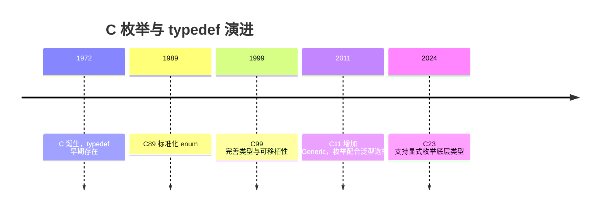
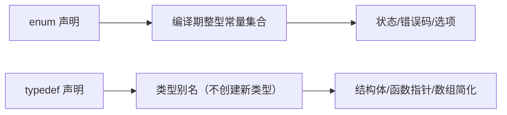

## 前置知识

- [运算符与表达式](/c/008-OperatorExpression)：建议先完成前一篇的学习

## 学习目标

- 掌握「1. 历史动机与发展脉络」的核心机制、典型用法与常见陷阱
- 掌握「2. 形式化定义」的核心机制、典型用法与常见陷阱
- 掌握「3. 理论推导与原理解析」的核心机制、典型用法与常见陷阱
- 掌握「4. 代码示例（带详尽注释）」的核心机制、典型用法与常见陷阱
- 掌握「5. 对比分析」的核心机制、典型用法与常见陷阱


## 1. 历史动机与发展脉络

C 语言早期没有布尔类型与命名常量机制，开发者用 `#define` 定义魔数，导致类型不安全、作用域泄漏、调试信息缺失。C89（ANSI C，1989）正式标准化 `enum`，提供编译期常量集合；`typedef` 则从 C 的早期版本就存在，用于为类型创建别名，是抽象类型（不透明指针、函数指针）的基石。

C99 允许枚举底层类型由实现选择；C23 标准新增显式底层类型语法（`enum E : int {...}`），并允许枚举项使用属性，进一步收紧行为。`typedef` 在 C23 中继续作为类型别名机制，与 `_Bool`、`_Static_assert` 等特性共同完善类型系统。



## 2. 形式化定义

### 2.1 枚举定义

```c
enum 标签名 {
    枚举常量1 [= 值1],
    枚举常量2 [= 值2],
    ...
};
```

未显式赋值时，第一个常量取 0，后续依次 +1；显式赋值后，后续常量在上一值基础上 +1。枚举常量是编译期整型常量，可参与常量表达式。

枚举变量的取值可以是任意整型值（不限于枚举常量列表），这是 C 的历史行为，也是常见误用来源。

### 2.2 typedef 定义

`typedef` 的语法是“存储类说明符 + 类型 + 别名”，例如：

```c
typedef unsigned long size_t_my;      // 无符号长整型别名
typedef struct Point Point;           // 结构体别名
typedef int (*Handler)(int);          // 函数指针类型别名
typedef int Vector4[4];               // 定长数组类型别名
```

`typedef` 声明不创建新类型，只引入同义词；因此 `typedef int A; typedef int B;` 后 `A` 与 `B` 完全兼容。

### 2.3 枚举与 typedef 组合

```c
typedef enum {
    STATE_IDLE = 0,
    STATE_RUNNING,
    STATE_STOPPED
} State;
```

讲解：这是嵌入式与系统编程中最常见的组合：`typedef enum {...} 类型名;` 同时定义枚举类型与别名，避免每次书写 `enum State`。



## 3. 理论推导与原理解析

### 3.1 枚举的底层类型推导

C 标准要求枚举的底层类型是“能表示所有枚举值”的整型（char、signed/unsigned 整数类型均可）。实现通常选择 `int` 或 `unsigned int`，但若所有值在 `char` 范围内，部分编译器会选更小类型。C23 的显式底层类型语法消除了这一不确定性：

```c
enum Color : unsigned char { RED, GREEN, BLUE }; // C23
```

因此 `sizeof(enum)` 在 C11 及之前不可移植，序列化枚举时不应假设大小。

### 3.2 typedef 的解析规则

typedef 声明遵循 C 的声明语法（declarator 规则）：`typedef int (*FP)(void);` 中 `(*FP)(void)` 是函数指针声明符，`FP` 被绑定为“指向返回 int、无参数函数的指针”类型。复杂声明可以用“从内向外读”的方法解析：`FP` 先解引用为指针，再调用，再取 int。掌握这一规则后，任何 typedef 都可以读懂。

### 3.3 枚举 vs 宏 vs const

`#define RED 0` 是文本替换，无类型、无作用域，可能在宏展开时产生意外；`const int RED = 0` 是运行期对象（非编译期常量，不能用于 case 标签或数组尺寸）；`enum { RED = 0 }` 是编译期常量、有作用域、能参与类型检查（有限）。C23 的 `constexpr` 提供第三种选择，但枚举在状态机与位标志场景仍最常用。

## 4. 代码示例（带详尽注释）

### 4.1 基础枚举

```c
#include <stdio.h>

// 默认取值：MON=0, TUE=1, ..., SUN=6
enum Weekday {
    MON, TUE, WED, THU, FRI, SAT, SUN
};

int main(void) {
    enum Weekday today = WED;
    // 枚举可以比较与算术（底层是整数）
    printf("today = %d\n", today);       // 2
    printf("tomorrow = %d\n", today + 1); // 3
    return 0;
}
```

讲解：默认从 0 递增是枚举的基础行为。输出 `today = 2`。枚举参与算术时退化为基础整型，这是 C 的宽松行为，使用时注意。

### 4.2 显式赋值

```c
#include <stdio.h>

// 显式赋值：错误码通常从 1 开始，0 表示成功
enum ErrorCode {
    ERR_NONE = 0,
    ERR_IO = 1,
    ERR_NET = 2,
    // 位标志可以按位或组合
    FLAG_A = 1 << 0,
    FLAG_B = 1 << 1,
    FLAG_C = 1 << 2
};

int main(void) {
    // 位标志组合
    int flags = FLAG_A | FLAG_C;
    if (flags & FLAG_A) {
        printf("FLAG_A 已设置\n");
    }
    printf("ERR_NET = %d\n", ERR_NET);
    return 0;
}
```

讲解：显式赋值让枚举胜任错误码与位标志。位移表达式（`1 << n`）保证位不重叠；组合结果可能不是枚举常量之一，C 允许这种赋值，但要显式转换为目标类型。

### 4.3 枚举在 switch 中使用

```c
#include <stdio.h>

typedef enum {
    STATE_IDLE,
    STATE_RUNNING,
    STATE_PAUSED,
    STATE_STOPPED
} State;

// 状态机的事件处理：switch 穷举状态
const char* state_name(State s) {
    switch (s) {
        case STATE_IDLE:    return "空闲";
        case STATE_RUNNING: return "运行";
        case STATE_PAUSED:  return "暂停";
        case STATE_STOPPED: return "停止";
        default:            return "未知"; // 防御未知值
    }
}

int main(void) {
    State s = STATE_RUNNING;
    printf("状态：%s\n", state_name(s));
    return 0;
}
```

讲解：枚举与 switch 是状态机的经典组合。`default` 分支防御“枚举变量被赋了列表外的整数值”的 C 特性，保证函数对任意输入都有输出。

### 4.4 typedef 基本用法

```c
#include <stdio.h>

// 基础类型别名：屏蔽平台差异
typedef unsigned char u8;
typedef unsigned short u16;
typedef unsigned int u32;

// 结构体别名：免写 struct 关键字
typedef struct {
    u32 x;
    u32 y;
} Point;

int main(void) {
    u8 byte = 200;          // 别名直接使用
    Point p = {10, 20};     // 无需 struct Point
    printf("byte=%u, p=(%u,%u)\n", byte, p.x, p.y);
    return 0;
}
```

讲解：`typedef struct {...} Point;` 同时完成结构体定义与别名。嵌入式开发常用 `u8/u16/u32` 等宽度别名保证跨平台一致。注意 `typedef` 不能用于在声明时初始化对象。

### 4.5 typedef 与函数指针

```c
#include <stdio.h>

// 回调函数类型：接收 int，返回 int
typedef int (*Callback)(int);

// 两个回调实现
static int double_it(int x) { return x * 2; }
static int triple_it(int x) { return x * 3; }

// 表驱动：回调数组（表格驱动架构）
static const Callback ops[] = { double_it, triple_it };

int main(void) {
    for (int i = 0; i < 2; i++) {
        printf("ops[%d](5) = %d\n", i, ops[i](5));
    }
    return 0;
}
```

讲解：函数指针 typedef 让回调类型可复用、可数组化。表驱动（用数据表代替 if-else 链）是 C 工程的重要架构模式，函数指针数组是其核心载体。

### 4.6 typedef 与定长数组

```c
#include <stdio.h>

// 定长数组类型别名：参数传递时保持“数组语义”
typedef int Vector4[4];

// 传数组指针，避免数组退化为指针
void fill(Vector4 *v) {
    for (int i = 0; i < 4; i++) {
        (*v)[i] = i * i;
    }
}

int main(void) {
    Vector4 arr;
    fill(&arr);
    for (int i = 0; i < 4; i++) {
        printf("arr[%d]=%d\n", i, arr[i]);
    }
    return 0;
}
```

讲解：`typedef int Vector4[4]` 后，`Vector4*` 是指向整个数组的指针，函数参数带上长度信息，防止数组退化为指针导致越界。

### 4.7 typedef 与联合体

```c
#include <stdio.h>
#include <string.h>

// 联合体别名：同一内存按不同类型解释
typedef union {
    unsigned int raw;
    unsigned char bytes[4];
} Word;

int main(void) {
    Word w;
    w.raw = 0x11223344u;
    // 字节序相关：小端机器上 bytes[0]=0x44
    printf("raw=%08x, byte0=%02x\n", w.raw, w.bytes[0]);
    return 0;
}
```

讲解：联合体别名用于协议解析、寄存器访问等场景。注意输出依赖主机字节序，跨平台协议解析应使用移位而非直接读字节。

### 4.8 枚举与字符串映射

```c
#include <stdio.h>

typedef enum {
    LOG_DEBUG,
    LOG_INFO,
    LOG_WARN,
    LOG_ERROR
} LogLevel;

// 枚举到字符串的静态映射表：索引即枚举值
static const char* const level_names[] = {
    "DEBUG", "INFO", "WARN", "ERROR"
};

// 防御性访问：越界返回未知
const char* level_name(LogLevel level) {
    if (level < LOG_DEBUG || level > LOG_ERROR) {
        return "UNKNOWN";
    }
    return level_names[level];
}

int main(void) {
    printf("%s\n", level_name(LOG_WARN));
    return 0;
}
```

讲解：映射表依赖“枚举值连续且从 0 开始”的前提，因此访问前做范围检查。这是枚举序列化与日志系统的常见模式。

## 5. 对比分析

### 5.1 枚举 vs 宏常量

| 维度 | enum | #define |
| --- | --- | --- |
| 类型 | 有枚举类型（弱） | 无类型 |
| 作用域 | 遵循代码块作用域 | 预处理器全局 |
| 调试 | 调试器可显示名称 | 宏不保留名称 |
| 编译期常量 | 是 | 是 |
| 与 switch/case | 配合良好 | 配合良好 |

### 5.2 typedef vs 宏别名

`#define HANDLER int (*)(int)` 也能缩写声明，但宏在语法层面替换，容易出现优先级错误且无类型检查；`typedef` 是语言级别名，解析正确、可读性好。现代 C 代码应使用 typedef。

### 5.3 枚举底层类型在不同标准下的行为

C89-C17 由实现选择底层类型；C23 允许显式指定。跨编译器序列化枚举时应显式转换为基础整型或使用 C23 语法。

## 6. 常见陷阱与最佳实践

陷阱一：枚举常量名全局冲突。同一作用域内枚举常量名不能重复。最佳实践：加前缀（如 `STATE_`、`ERR_`）。

陷阱二：假设枚举连续或从 0 开始。显式赋值或重排后映射表会错位。最佳实践：映射表与范围检查配合。

陷阱三：把枚举当强类型使用。C 的枚举是弱类型，可被赋任意整型。最佳实践：编译器开启 `-Wconversion`、`-Wenum-conversion` 等告警。

陷阱四：对枚举做 `sizeof` 假设。底层类型由实现决定。最佳实践：序列化时使用固定宽度整数。

陷阱五：`typedef struct S {...} S;` 中忘记 `struct S` 自引用时，结构体内必须用 `struct S*`，因为 typedef 名称在该点尚未定义。最佳实践：自引用结构使用标签名。

陷阱六：函数指针 typedef 阅读困难。最佳实践：从内向外读声明，或拆分为两步（先 `typedef` 返回类型函数）。

## 7. 工程实践

### 7.1 错误码头文件设计

```c
// errors.h：统一错误码
#ifndef ERRORS_H
#define ERRORS_H

typedef enum {
    ERR_OK = 0,
    ERR_INVALID_ARG = 1,
    ERR_NOT_FOUND = 2,
    ERR_TIMEOUT = 3,
    ERR_IO = 4,
    ERR_UNKNOWN = 255
} Error;

// 错误码转可读字符串
const char* error_string(Error err);

#endif
```

讲解：头文件用 include guard 防重复包含；错误码从 0 开始且显式赋值；`error_string` 声明让实现与使用分离。这是 C 库的经典接口设计。

### 7.2 状态机实现

```c
// 状态-事件表驱动状态机骨架
typedef enum { S_IDLE, S_BUSY, S_DONE } State;
typedef enum { E_START, E_FINISH } Event;

// 状态转移表：行是状态，列是事件，值是下一状态
static const State transition[3][2] = {
    /* S_IDLE */ { S_BUSY, S_IDLE },
    /* S_BUSY */ { S_BUSY, S_DONE },
    /* S_DONE */ { S_DONE, S_DONE }
};

State next_state(State s, Event e) {
    return transition[s][e];
}
```

讲解：表驱动状态机把转移逻辑从 switch 中抽离为数据，便于生成与验证。枚举值是数组下标，要求枚举连续，用静态断言（`_Static_assert`）保证。

## 8. 案例研究：带字符串映射的日志系统

需求：实现日志级别过滤与级别名输出，级别可扩展。

```c
#include <stdio.h>

// 日志级别：显式赋值保证稳定
typedef enum {
    LOG_LEVEL_DEBUG = 0,
    LOG_LEVEL_INFO = 1,
    LOG_LEVEL_WARN = 2,
    LOG_LEVEL_ERROR = 3
} LogLevel;

// 级别名表：与枚举一一对应
static const char* const kLevelNames[] = {
    "DEBUG", "INFO", "WARN", "ERROR"
};

// 当前过滤级别（全局配置）
static LogLevel g_min_level = LOG_LEVEL_INFO;

// 设置过滤级别，返回旧值
LogLevel set_min_level(LogLevel level) {
    LogLevel old = g_min_level;
    g_min_level = level;
    return old;
}

// 统一日志输出：低于过滤级别不打印
void log_message(LogLevel level, const char* msg) {
    if (level < g_min_level) {
        return;
    }
    // 范围检查后查表
    if (level < LOG_LEVEL_DEBUG || level > LOG_LEVEL_ERROR) {
        printf("[UNKNOWN] %s\n", msg);
        return;
    }
    printf("[%s] %s\n", kLevelNames[level], msg);
}

int main(void) {
    log_message(LOG_LEVEL_DEBUG, "调试信息"); // 被过滤
    log_message(LOG_LEVEL_WARN, "警告信息");  // 输出
    set_min_level(LOG_LEVEL_DEBUG);
    log_message(LOG_LEVEL_DEBUG, "调试信息"); // 现在输出
    return 0;
}
```

讲解：该案例综合枚举（级别）、typedef（别名）、映射表（字符串化）、防御检查（范围校验）与工程结构（过滤策略）。运行输出为 `[WARN] 警告信息` 与 `[DEBUG] 调试信息`。

## 9. 知识要点总结与深入讲解

枚举的本质是“一组有名字的编译期整型常量”，typedef 的本质是“类型的别名”。两者组合产生 C 中最常用的类型定义模式：`typedef enum {...} Name;`。

枚举的弱类型特性是双刃剑：灵活但易错。工程上通过命名前缀、范围检查、编译器告警与静态断言来约束它。

typedef 的阅读技巧是“从内向外”：`int (*Handler)(int)` 中 `Handler` 是指针，指向函数，函数返回 int。掌握声明解析后，函数指针、数组指针等复杂类型不再可怕。

#### typedef 与函数指针

```c
#include <stdio.h>
#include <stdlib.h>

// 不使用 typedef：函数指针声明很复杂
// int (*comparator)(const void *, const void *);

// 使用 typedef：简洁明了
typedef int (*Comparator)(const void *, const void *);

// 升序比较函数
int ascending(const void *a, const void *b) {
    return *(int *)a - *(int *)b;
}

// 降序比较函数
int descending(const void *a, const void *b) {
    return *(int *)b - *(int *)a;
}

// 使用函数指针作为参数
void sort_array(int *arr, int n, Comparator cmp) {
    qsort(arr, n, sizeof(int), cmp);
}

int main(void) {
    int arr[] = {5, 2, 8, 1, 9, 3};
    int n = sizeof(arr) / sizeof(arr[0]);

    // 升序排序
    sort_array(arr, n, ascending);
    printf("升序: ");
    for (int i = 0; i < n; i++) printf("%d ", arr[i]);
    printf("\n");

    // 降序排序
    sort_array(arr, n, descending);
    printf("降序: ");
    for (int i = 0; i < n; i++) printf("%d ", arr[i]);
    printf("\n");

    return 0;
}
```

### 概述

枚举（enum）和类型别名（typedef）是C语言中两种重要的类型定义工具。枚举用于定义一组命名的整数常量，使代码更具可读性；typedef 用于为已有类型创建新的名称，简化复杂类型声明并提高可移植性。两者结合使用可以显著提升代码的清晰度和维护性。

### 基础概念

#### 枚举的本质

枚举类型在C语言中本质上是整数类型。每个枚举常量都是一个 `int` 类型的值，编译器将枚举变量视为 `int`（或兼容的整数类型）来处理。

#### typedef 的作用

typedef 不创建新类型，而是为已有类型创建一个别名。它在以下场景中特别有用：

- 简化复杂的类型声明（如函数指针）
- 提高代码可移植性（如 `uint32_t` 在不同平台上可能映射到不同的基础类型）
- 增强代码可读性

### 快速上手

#### 定义和使用枚举

```c
#include <stdio.h>

// 定义枚举类型
enum Color { RED, GREEN, BLUE };

int main(void) {
    // 声明枚举变量
    enum Color favorite = GREEN;

    // 枚举值就是整数
    printf("RED = %d\n", RED);     // 输出: 0
    printf("GREEN = %d\n", GREEN); // 输出: 1
    printf("BLUE = %d\n", BLUE);   // 输出: 2

    // 可以在 switch 中使用
    switch (favorite) {
        case RED:   printf("红色\n"); break;
        case GREEN: printf("绿色\n"); break;
        case BLUE:  printf("蓝色\n"); break;
    }

    return 0;
}
```

#### 使用 typedef 创建别名

```c
#include <stdio.h>

// 为基本类型创建别名
typedef unsigned long ulong;
typedef unsigned char byte;

// 为结构体创建别名
typedef struct {
    double x;
    double y;
} Point;

int main(void) {
    ulong big_num = 123456789UL;
    byte data[4] = {0x01, 0x02, 0x03, 0x04};

    Point p = {1.0, 2.0};
    printf("点: (%.1f, %.1f)\n", p.x, p.y);
    printf("大数: %lu\n", big_num);

    return 0;
}
```

### 详细用法

#### 枚举的值指定

```c
// 默认从0开始递增
enum Day { MON, TUE, WED, THU, FRI, SAT, SUN };
// MON=0, TUE=1, ..., SUN=6

// 手动指定值
enum HttpStatus {
    OK = 200,
    CREATED = 201,
    BAD_REQUEST = 400,
    NOT_FOUND = 404,
    INTERNAL_ERROR = 500
};

// 部分指定：未指定的值自动递增
enum Priority {
    LOW = 1,
    MEDIUM,    // 自动为2
    HIGH,      // 自动为3
    URGENT = 10,
    CRITICAL   // 自动为11
};

// 可以有重复的值
enum Direction {
    UP = 1,
    DOWN = -1,
    LEFT = -2,
    RIGHT = 2
};
```

#### 枚举与 typedef 结合

```c
#include <stdio.h>

// 使用 typedef 简化枚举类型名
typedef enum {
    STATE_IDLE,
    STATE_RUNNING,
    STATE_PAUSED,
    STATE_STOPPED
} State;

// 使用时不需要 enum 前缀
State current_state = STATE_IDLE;

const char *state_to_string(State s) {
    switch (s) {
        case STATE_IDLE:    return "空闲";
        case STATE_RUNNING: return "运行中";
        case STATE_PAUSED:  return "已暂停";
        case STATE_STOPPED: return "已停止";
        default:            return "未知";
    }
}

int main(void) {
    current_state = STATE_RUNNING;
    printf("当前状态: %s\n", state_to_string(current_state));
    return 0;
}
```

#### typedef 与数组类型

```c
#include <stdio.h>

// 定义数组类型别名
typedef int IntArray[10];
typedef char Name[32];

int main(void) {
    IntArray scores = {90, 85, 92, 78, 95, 88, 76, 91, 87, 83};
    Name student = "张三";

    printf("学生: %s\n", student);
    for (int i = 0; i < 10; i++) {
        printf("科目%d: %d分\n", i + 1, scores[i]);
    }

    return 0;
}
```

### 常见场景

#### 场景一：状态机

```c
#include <stdio.h>
#include <stdbool.h>

typedef enum {
    STATE_INIT,
    STATE_CONNECTING,
    STATE_CONNECTED,
    STATE_DISCONNECTING,
    STATE_ERROR
} ConnectionState;

typedef struct {
    ConnectionState state;
    int retry_count;
} Connection;

const char *get_state_name(ConnectionState s) {
    static const char *names[] = {
        "初始化", "连接中", "已连接", "断开中", "错误"
    };
    return names[s];
}

void handle_connection(Connection *conn) {
    switch (conn->state) {
        case STATE_INIT:
            printf("[%s] 准备连接\n", get_state_name(conn->state));
            conn->state = STATE_CONNECTING;
            break;
        case STATE_CONNECTING:
            printf("[%s] 正在建立连接\n", get_state_name(conn->state));
            conn->state = STATE_CONNECTED;
            break;
        case STATE_CONNECTED:
            printf("[%s] 连接正常\n", get_state_name(conn->state));
            conn->state = STATE_DISCONNECTING;
            break;
        case STATE_DISCONNECTING:
            printf("[%s] 正在断开\n", get_state_name(conn->state));
            conn->state = STATE_INIT;
            break;
        case STATE_ERROR:
            printf("[%s] 连接错误\n", get_state_name(conn->state));
            break;
    }
}

int main(void) {
    Connection conn = {STATE_INIT, 0};

    for (int i = 0; i < 5; i++) {
        handle_connection(&conn);
    }

    return 0;
}
```

#### 场景二：错误码定义

```c
#include <stdio.h>

typedef enum {
    ERR_NONE = 0,
    ERR_INVALID_PARAM = -1,
    ERR_OUT_OF_MEMORY = -2,
    ERR_FILE_NOT_FOUND = -3,
    ERR_PERMISSION_DENIED = -4,
    ERR_TIMEOUT = -5,
    ERR_NETWORK = -6
} ErrorCode;

const char *error_message(ErrorCode err) {
    switch (err) {
        case ERR_NONE:             return "成功";
        case ERR_INVALID_PARAM:    return "参数无效";
        case ERR_OUT_OF_MEMORY:    return "内存不足";
        case ERR_FILE_NOT_FOUND:   return "文件未找到";
        case ERR_PERMISSION_DENIED: return "权限不足";
        case ERR_TIMEOUT:          return "操作超时";
        case ERR_NETWORK:          return "网络错误";
        default:                   return "未知错误";
    }
}

// 模拟一个可能失败的操作
ErrorCode read_config(const char *path) {
    if (!path) return ERR_INVALID_PARAM;
    if (path[0] == '\0') return ERR_INVALID_PARAM;
    // 模拟文件不存在
    return ERR_FILE_NOT_FOUND;
}

int main(void) {
    ErrorCode err = read_config("");
    if (err != ERR_NONE) {
        printf("错误: %s (代码: %d)\n", error_message(err), err);
    }
    return 0;
}
```

#### 场景三：可移植的类型定义

```c
#include <stdio.h>
#include <stdint.h>

// 使用 typedef 定义平台无关的类型
typedef uint8_t  u8;
typedef uint16_t u16;
typedef uint32_t u32;
typedef uint64_t u64;

typedef int8_t  s8;
typedef int16_t s16;
typedef int32_t s32;
typedef int64_t s64;

// 定义回调函数类型
typedef void (*EventCallback)(u32 event_id, void *user_data);

// 定义结果类型
typedef struct {
    s32 code;
    const char *message;
} Result;

// 使用示例
void on_event(u32 event_id, void *user_data) {
    printf("事件 %u 触发, 用户数据: %s\n", event_id, (char *)user_data);
}

int main(void) {
    u8 byte_val = 255;
    u32 counter = 1000000;
    s64 timestamp = 1700000000LL;

    printf("字节: %u\n", byte_val);
    printf("计数器: %u\n", counter);
    printf("时间戳: %lld\n", timestamp);

    EventCallback cb = on_event;
    cb(1, "测试数据");

    Result res = {0, "操作成功"};
    printf("结果: [%d] %s\n", res.code, res.message);

    return 0;
}
```

### 注意事项

#### 枚举值的范围

C标准规定枚举类型兼容 `int`，但枚举常量的实际类型由实现定义。不要假设枚举值一定是正数或一定在某个范围内：

```c
enum Flags {
    FLAG_A = 1,
    FLAG_B = 2,
    FLAG_C = 4
};

// 枚举值可以按位组合，但类型安全性不如 C++ 的 enum class
int combined = FLAG_A | FLAG_C; // 合法但类型不严格
```

#### 枚举与整数隐式转换

C语言允许枚举和整数之间的隐式转换，这可能导致意外行为：

```c
enum Color { RED, GREEN, BLUE };
enum Color c = 5; // 合法！5不在枚举范围内

// 更安全的做法：使用函数验证
int is_valid_color(int val) {
    return val >= RED && val <= BLUE;
}
```

#### typedef 不是类型安全

typedef 创建的是别名而非新类型，两个不同的 typedef 可能实际上是同一类型：

```c
typedef int Celsius;
typedef int Fahrenheit;

Celsius temp_c = 25;
Fahrenheit temp_f = temp_c; // 编译通过！但语义错误
```

#### 枚举名的作用域

枚举常量的作用域与普通标识符相同，不同枚举中不能有同名常量：

```c
// 错误：重复定义
enum Color { RED, GREEN, BLUE };
enum Signal { RED, YELLOW, GREEN }; // 编译错误：RED 和 GREEN 重复

// 解决方案：加前缀
enum Color { COLOR_RED, COLOR_GREEN, COLOR_BLUE };
enum Signal { SIGNAL_RED, SIGNAL_YELLOW, SIGNAL_GREEN };
```

### 进阶用法

#### 使用枚举实现位标志

```c
#include <stdio.h>

typedef enum {
    PERM_READ    = 1 << 0,  // 1
    PERM_WRITE   = 1 << 1,  // 2
    PERM_EXECUTE = 1 << 2,  // 4
    PERM_DELETE  = 1 << 3   // 8
} Permission;

// 检查权限
int has_permission(int perms, Permission perm) {
    return (perms & perm) != 0;
}

// 添加权限
int add_permission(int perms, Permission perm) {
    return perms | perm;
}

// 移除权限
int remove_permission(int perms, Permission perm) {
    return perms & ~perm;
}

int main(void) {
    // 读写权限
    int user_perms = PERM_READ | PERM_WRITE;

    printf("读权限: %s\n", has_permission(user_perms, PERM_READ) ? "有" : "无");
    printf("执行权限: %s\n", has_permission(user_perms, PERM_EXECUTE) ? "有" : "无");

    // 添加执行权限
    user_perms = add_permission(user_perms, PERM_EXECUTE);
    printf("添加执行后: %s\n", has_permission(user_perms, PERM_EXECUTE) ? "有" : "无");

    // 移除写权限
    user_perms = remove_permission(user_perms, PERM_WRITE);
    printf("移除写后: %s\n", has_permission(user_perms, PERM_WRITE) ? "有" : "无");

    return 0;
}
```

#### X-Macro 技巧自动生成枚举和字符串映射

```c
#include <stdio.h>

// 定义枚举项列表（单一定义点）
#define FRUIT_LIST \
    X(APPLE)       \
    X(BANANA)      \
    X(CHERRY)      \
    X(DURIAN)      \
    X(ELDERBERRY)

// 生成枚举定义
typedef enum {
    #define X(name) FRUIT_##name,
    FRUIT_LIST
    #undef X
    FRUIT_COUNT // 自动计算枚举项数量
} Fruit;

// 生成字符串数组
static const char *fruit_names[] = {
    #define X(name) #name,
    FRUIT_LIST
    #undef X
};

const char *fruit_to_string(Fruit f) {
    if (f >= 0 && f < FRUIT_COUNT) {
        return fruit_names[f];
    }
    return "未知";
}

int main(void) {
    for (Fruit f = 0; f < FRUIT_COUNT; f++) {
        printf("FRUIT_%s = %d\n", fruit_to_string(f), f);
    }
    // 输出:
    // FRUIT_APPLE = 0
    // FRUIT_BANANA = 1
    // FRUIT_CHERRY = 2
    // FRUIT_DURIAN = 3
    // FRUIT_ELDERBERRY = 4

    return 0;
}
```

#### 使用 typedef 简化回调架构

```c
#include <stdio.h>
#include <stdlib.h>

// 定义事件类型
typedef enum {
    EVENT_CLICK,
    EVENT_HOVER,
    EVENT_KEY_PRESS
} EventType;

// 定义事件结构
typedef struct {
    EventType type;
    int x;
    int y;
    int key_code;
} Event;

// 定义回调函数类型
typedef void (*EventHandler)(const Event *event);

// 事件处理器注册表
#define MAX_HANDLERS 10
typedef struct {
    EventHandler handlers[MAX_HANDLERS];
    int count;
} EventSystem;

void event_system_init(EventSystem *es) {
    es->count = 0;
}

void event_system_subscribe(EventSystem *es, EventHandler handler) {
    if (es->count < MAX_HANDLERS) {
        es->handlers[es->count++] = handler;
    }
}

void event_system_emit(EventSystem *es, const Event *event) {
    for (int i = 0; i < es->count; i++) {
        es->handlers[i](event);
    }
}

// 具体的事件处理器
void on_click(const Event *e) {
    printf("点击事件: (%d, %d)\n", e->x, e->y);
}

void on_key(const Event *e) {
    printf("按键事件: 键码 %d\n", e->key_code);
}

void logger(const Event *e) {
    printf("[日志] 事件类型: %d\n", e->type);
}

int main(void) {
    EventSystem es;
    event_system_init(&es);

    event_system_subscribe(&es, on_click);
    event_system_subscribe(&es, on_key);
    event_system_subscribe(&es, logger);

    Event click = {EVENT_CLICK, 100, 200, 0};
    event_system_emit(&es, &click);

    Event key = {EVENT_KEY_PRESS, 0, 0, 65};
    event_system_emit(&es, &key);

    return 0;
}
```
### 枚举定义

**基本写法：枚举定义**
`enum <Name> { <MEM1>, <MEM2>, ... };`
```c
// 定义星期枚举
enum Weekday { MONDAY, TUESDAY, WEDNESDAY, THURSDAY, FRIDAY };
```

---

**自定义写法：指定枚举值**
`enum <Name> { <MEM1> = <val>, <MEM2>, ... };`
```c
// 从 1 开始递增
enum Months { JAN = 1, FEB, MAR, APR };
```

---

**分散写法：枚举值显式指定**
`enum <Name> { <MEM1> = <val>, <MEM2> = <val>, ... };`
```c
// 显式指定每个枚举值
enum Color { RED = 1, GREEN = 2, BLUE = 4 };
```

---

**typedef 写法：枚举别名**
`typedef enum { <members> } <Name>;`
```c
// 定义枚举类型别名
typedef enum { STATUS_OK, STATUS_ERROR, STATUS_PENDING } Status;
```

---

### 枚举变量

**基本写法：声明枚举变量**
`enum <Name> <var_name>;`
```c
// 声明枚举变量
enum Weekday today;
```

---

**初始化写法：声明并初始化**
`enum <Name> <var> = <MEMBER>;`
```c
// 初始化枚举变量
enum Weekday today = MONDAY;
```

---

**typedef 写法：使用别名声明**
`<TypeName> <var_name>;`
```c
// 使用类型别名声明
Status current_status = STATUS_OK;
```

---

### 枚举在 switch 中使用

**基本写法：switch 处理枚举**
`switch (<enum_var>) { case <MEM1>: ... break; ... }`
```c
// 使用 switch 处理枚举值
enum Weekday today = MONDAY;
switch (today) {
    case MONDAY:
        printf("Start of week\n");
        break;
    case FRIDAY:
        printf("End of week\n");
        break;
    default:
        printf("Middle of week\n");
}
```

---

### typedef 基本用法

**基本写法：为基本类型创建别名**
`typedef <existing_type> <new_name>;`
```c
// 为 unsigned int 创建别名
typedef unsigned int uint;
```

---

**基本写法：为指针类型创建别名**
`typedef <type> *<PtrName>;`
```c
// 为整型指针创建别名
typedef int *IntPtr;
```

---

**基本写法：为数组类型创建别名**
`typedef <type> (<ArrayName>)[<size>];`
```c
// 为整型数组创建别名
typedef int IntArray[10];
```

---

### typedef 与结构体

**基本写法：结构体别名**
`typedef struct { <members> } <Name>;`
```c
// 定义 Point 结构体类型
typedef struct {
    int x;
    int y;
} Point;
```

---

**基本写法：为已定义结构体创建别名**
`typedef struct <Name> <Alias>;`
```c
// 为结构体创建别名
struct Point { int x; int y; };
typedef struct Point Point;
```

---

### typedef 与枚举

**基本写法：枚举别名**
`typedef enum { <members> } <Name>;`
```c
// 定义枚举类型别名
typedef enum { RED, GREEN, BLUE } Color;
```

---

### typedef 与联合体

**基本写法：联合体别名**
`typedef union { <members> } <Name>;`
```c
// 定义联合体类型别名
typedef union {
    int i;
    float f;
} Data;
```

---

### typedef 复杂类型

**基本写法：多维数组别名**
`typedef <type> (<ArrayName>)[<rows>][<cols>];`
```c
// 为二维数组创建别名
typedef int Matrix[3][3];
```

---

**基本写法：指向数组的指针别名**
`typedef <type> (*<PtrName>)[<size>];`
```c
// 为指向数组的指针创建别名
typedef int (*ArrayPtr)[5];
```

---

### 枚举与整数

**转换写法：枚举转整数**
`int <var> = <ENUM_MEMBER>;`
```c
// 枚举值隐式转换为整数
enum Color c = RED;
int value = c;
```

---

**转换写法：整数转枚举**
`enum <Name> <var> = (<enum_name>)<int_value>;`
```c
// 整数显式转换为枚举
enum Color c = (enum Color)1;
```

---

### 枚举大小

**基本写法：获取枚举大小**
`sizeof(enum <Name>)`
```c
// 查看枚举类型大小
enum Color { RED, GREEN, BLUE };
printf("Size: %zu\n", sizeof(enum Color));
```
