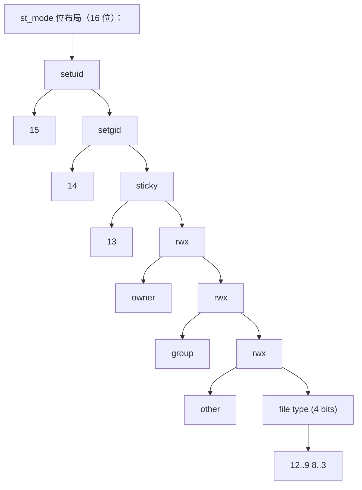

## 前置知识

- [共享内存与信号量](/c/028-SharedMemorySemaphore)：建议先完成前一篇的学习

## 学习目标

- 掌握「1. 历史动机与演化」的核心机制、典型用法与常见陷阱
- 掌握「2. 形式化定义」的核心机制、典型用法与常见陷阱
- 掌握「3. 理论推导与证明」的核心机制、典型用法与常见陷阱
- 掌握「4. 代码示例」的核心机制、典型用法与常见陷阱
- 掌握「5. 对比分析」的核心机制、典型用法与常见陷阱


## 1. 历史动机与演化

### 1.1 Unix 文件系统的设计哲学（1970s）

Ken Thompson 与 Dennis Ritchie 在 1969-1971 年设计 Unix 文件系统时，确立了几个核心原则：

1. **一切皆文件**（Everything is a file）：普通文件、目录、设备、管道、套接字都通过文件描述符操作。
2. **树形目录结构**：单一根目录 `/`，所有文件通过路径访问。
3. **简单的 API**：`open`/`read`/`write`/`close`/`lseek` 五个核心系统调用覆盖大部分需求。
4. **权限模型**：owner/group/other 三类用户，r/w/x 三种权限。

这种设计极大简化了系统接口，使得 Unix 文件系统 API 至今仍在使用，几乎没有改动。

### 1.2 POSIX 标准化（1988）

POSIX.1-1988（IEEE Std 1003.1-1988）将 Unix 文件系统 API 标准化，引入：

- `opendir`/`readdir`/`closedir` 目录遍历接口
- `stat`/`fstat`/`lstat` 文件属性查询
- `mkdir`/`rmdir`/`chdir`/`getcwd` 目录操作
- `link`/`unlink`/`symlink`/`readlink` 链接操作
- `chmod`/`chown`/`umask` 权限操作
- `rename`/`truncate` 文件操作

POSIX 同时定义了 `struct stat` 的标准字段：`st_mode`、`st_ino`、`st_dev`、`st_size`、`st_mtime` 等。

### 1.3 BSD 与 SVR4 的扩展（1980s-1990s）

BSD Unix 与 System V Release 4 引入了若干扩展：

- `readdir_r` 线程安全版本（POSIX.1c-1995）
- `fts`/`ftw` 目录遍历库
- `realpath` 路径规范化
- `mkstemp` 安全的临时文件创建
- `flock`/`fcntl` 文件锁

### 1.4 Linux 特有扩展（2000s）

Linux 内核引入了若干新特性：

- **inotify**（Linux 2.6.13, 2005）：取代笨重的 dnotify，提供高效的文件事件通知
- **`*at` 系列函数**（POSIX.1-2008）：`openat`、`fstatat`、`unlinkat`、`renameat` 等，解决路径竞态问题
- **fanotify**（Linux 2.6.36, 2010）：替代 inotify，支持全系统监控与权限控制
- **O_TMPFILE**（Linux 3.11, 2013）：创建无名临时文件，杜绝 `/tmp` 竞态
- **copy_file_range**（Linux 4.5, 2016）：内核态文件复制，支持跨文件系统
- **io_uring**（Linux 5.1, 2019）：高性能异步 I/O，取代 AIO

### 1.5 Windows 文件 API 的差异

Windows 采用 Win32 API，与 POSIX 差异较大：

| 操作       | POSIX            | Win32                   |
| ---------- | ---------------- | ----------------------- |
| 打开文件   | `open`           | `CreateFile`            |
| 读写       | `read`/`write`   | `ReadFile`/`WriteFile`  |
| 关闭       | `close`          | `CloseHandle`           |
| 目录遍历   | `opendir`+`readdir` | `FindFirstFile`+`FindNextFile` |
| 文件属性   | `stat`           | `GetFileAttributesEx`   |
| 重命名     | `rename`         | `MoveFileEx`            |
| 删除       | `unlink`         | `DeleteFile`            |
| 创建目录   | `mkdir`          | `CreateDirectory`       |

Windows 也支持路径分隔符 `\` 与 `/`，但 `\` 是首选。Windows NT 内核支持硬链接（`CreateHardLink`）与符号链接（`CreateSymbolicLink`，需管理员权限或开发者模式）。

### 1.6 现代 C 标准的尝试

C17 引入了一些文件系统相关的边界检查函数（Annex K，可选）：

- `fopen_s`、`freopen_s`：安全版本
- `tmpfile_s`、`tmpnam_s`：安全的临时文件

C23 未引入文件系统模块（C++17 已引入 `<filesystem>`），C 仍依赖 POSIX 或平台 API。

## 2. 形式化定义

### 2.1 文件描述符的语义

文件描述符（file descriptor, fd）是进程级整数索引，指向内核维护的"打开文件表"（open file table）条目。

$$
\text{fd} \in \mathbb{N}_0, \quad \text{fd} \mapsto \text{OpenFileEntry}
$$

每个进程默认拥有三个标准文件描述符：

- `STDIN_FILENO = 0`：标准输入
- `STDOUT_FILENO = 1`：标准输出
- `STDERR_FILENO = 2`：标准错误

新打开的文件总是使用最小的可用 fd 值。

### 2.2 文件偏移量与并发

每个打开文件描述（open file description）有一个文件偏移量 `offset`，可被 `lseek` 修改：

$$
\text{read}(fd, buf, n) \Rightarrow \text{copy } n \text{ bytes from } \text{offset}, \text{ then } \text{offset} += n
$$

$$
\text{write}(fd, buf, n) \Rightarrow \text{write } n \text{ bytes at } \text{offset}, \text{ then } \text{offset} += n
$$

原子操作 `pread`/`pwrite` 不修改文件偏移量：

$$
\text{pread}(fd, buf, n, \text{pos}) \Rightarrow \text{read from pos, without changing offset}
$$

多线程共享 fd 时，应使用 `pread`/`pwrite` 避免竞态。

### 2.3 文件权限的位掩码

`st_mode` 包含文件类型与权限信息：



权限位常量：

- `S_IRUSR = 0400`：owner read
- `S_IWUSR = 0200`：owner write
- `S_IXUSR = 0100`：owner execute
- `S_IRGRP = 0040`：group read
- `S_IWGRP = 0020`：group write
- `S_IXGRP = 0010`：group execute
- `S_IROTH = 0004`：other read
- `S_IWOTH = 0002`：other write
- `S_IXOTH = 0001`：other execute
- `S_ISUID = 04000`：set-user-ID
- `S_ISGID = 02000`：set-group-ID
- `S_ISVTX = 01000`：sticky bit

### 2.4 目录遍历的形式化

目录遍历可形式化为对文件系统树的深度优先搜索（DFS）或广度优先搜索（BFS）：

$$
\text{Traverse}(T, v) = \text{Visit}(v) \cup \bigcup_{c \in \text{Children}(v)} \text{Traverse}(T, c)
$$

其中 $T$ 是文件系统树，$v$ 是当前节点（目录或文件），$\text{Children}(v)$ 返回 $v$ 的子节点列表（若 $v$ 是目录）。

递归实现的栈深度等于树的高度，对于深层目录可能栈溢出。迭代实现可显式管理栈或队列。

### 2.5 inotify 事件模型

inotify 使用文件描述符 + 读取事件流的方式工作：

$$
\text{Event} = (\text{wd}, \text{mask}, \text{cookie}, \text{name})
$$

其中：

- `wd`：watch descriptor，由 `inotify_add_watch` 返回
- `mask`：事件类型位掩码（`IN_CREATE`、`IN_MODIFY`、`IN_DELETE` 等）
- `cookie`：用于关联相关事件（如 `IN_MOVE_FROM` 与 `IN_MOVE_TO`）
- `name`：被监控目录内的文件名（仅对目录监控有效）

事件通过 `read(inotify_fd, buf, len)` 读取，`buf` 包含一个或多个 `struct inotify_event`。

## 3. 理论推导与证明

### 3.1 定理：`readdir` 的非线程安全性

**定理**：`readdir` 使用静态缓冲区，多线程同时调用同一 `DIR*` 时是未定义行为；多线程调用不同 `DIR*` 在 POSIX.1-2008 起为线程安全。

**证明**：早期 POSIX 标准未规定 `readdir` 的线程安全行为。POSIX.1-2008 明确：

- 不同 `DIR*` 上的 `readdir` 是线程安全的。
- 同一 `DIR*` 上的 `readdir` 不需要线程安全。
- 若需线程安全，使用 `readdir_r`（已废弃）或外部加锁。

**现代实践**：`readdir_r` 在 POSIX.1-2008 中被标记为废弃，在 glibc 2.24 中被废弃。原因：

1. `readdir_r` 的接口设计存在缓冲区大小问题（`NAME_MAX` 不一定准确）。
2. 现代实现通过 TLS（Thread-Local Storage）使 `readdir` 在不同 `DIR*` 上线程安全。
3. 同一 `DIR*` 上的并发访问应由调用方加锁。

### 3.2 定理：硬链接与符号链接的差异

**定理**：硬链接共享 inode，删除原文件后硬链接仍可访问内容；符号链接是独立文件，删除原文件后符号链接失效（dangling）。

**证明**：

- 硬链接：`link(old, new)` 在 inode 表中创建新的目录项，指向同一 inode。inode 的 `i_nlink` 计数加 1。`unlink` 删除目录项并使 `i_nlink` 减 1，当 `i_nlink = 0` 且无打开的 fd 时，inode 与数据块被释放。
- 符号链接：`symlink(target, linkpath)` 创建一个特殊文件，内容是 `target` 的路径字符串。访问 `linkpath` 时，内核解析路径并重定向到 `target`。`unlink(linkpath)` 删除链接文件本身，不影响 `target`。

**推论**：

- 硬链接不能跨文件系统（inode 是文件系统本地的）。
- 硬链接不能指向目录（避免循环，POSIX 禁止；Linux 允许 root 用 `link` 系统调用，但用户态 `link()` 会失败）。
- 符号链接可以跨文件系统、可以指向目录。
- `stat` 跟随符号链接，`lstat` 不跟随。

### 3.3 定理：TOCTOU 竞态条件

**定理**："检查-使用"模式（Time-Of-Check-Time-Of-Use）在多进程环境下存在竞态条件，可被利用进行安全攻击。

**证明**：考虑以下代码：

```c
if (access("/tmp/secret", W_OK) == 0) {
    int fd = open("/tmp/secret", O_WRONLY);
    write(fd, data, len);
}
```

在 `access` 与 `open` 之间，攻击者可以将 `/tmp/secret` 替换为符号链接指向 `/etc/passwd`，导致写入敏感文件。

**防御**：使用 `openat` + `fstat` 或 `O_NOFOLLOW`：

```c
int fd = open("/tmp/secret", O_WRONLY | O_NOFOLLOW);
if (fd < 0) { /* handle */ }
struct stat st;
if (fstat(fd, &st) < 0) { /* handle */ }
if (!S_ISREG(st.st_mode)) { close(fd); /* reject */ }
if (st.st_uid != getuid()) { close(fd); /* reject */ }
write(fd, data, len);
```

### 3.4 定理：`*at` 系列函数的原子性

**定理**：`openat`、`fstatat`、`unlinkat` 等 `*at` 函数相对于目录 fd 是原子的，避免了相对路径的竞态。

**证明**：`openat(dirfd, pathname, flags)` 解析 `pathname` 时，若 `pathname` 是相对路径，则以 `dirfd` 指向的目录为起点；若 `pathname` 是绝对路径，则忽略 `dirfd`；若 `pathname` 是空字符串且 `flags` 含 `AT_EMPTY_PATH`，则操作 `dirfd` 自身。

**优势**：

1. 避免了 `chdir` 改变进程全局状态。
2. 避免了 `access` + `open` 的 TOCTOU 竞态。
3. 支持线程安全的相对路径操作。

### 3.5 定理：`O_APPEND` 的原子性

**定理**：`O_APPEND` 标志保证每次 `write` 的"定位偏移量 + 写入"操作是原子的。

**证明**：无 `O_APPEND` 时，`lseek(fd, 0, SEEK_END)` + `write(fd, buf, n)` 是两次独立操作，多进程同时追加时可能交错，导致数据覆盖。

`O_APPEND` 使内核在每次 `write` 前自动将偏移量设为文件末尾，整个操作在内核中是原子的（对同一文件的同一 inode 加锁）。

**推论**：多进程追加日志应使用 `O_APPEND`，而非 `lseek` + `write`。

## 4. 代码示例

### 4.1 基础目录遍历

```c
#include <stdio.h>
#include <dirent.h>
#include <errno.h>
#include <string.h>

/* 基础目录遍历：列出指定目录下的所有条目 */
int list_directory(const char *path) {
    DIR *dir = opendir(path);
    if (!dir) {
        fprintf(stderr, "opendir('%s') failed: %s\n",
                path, strerror(errno));
        return -1;
    }

    errno = 0;  /* 区分"结束"与"错误" */
    struct dirent *entry;
    while ((entry = readdir(dir)) != NULL) {
        /* 跳过 . 与 .. */
        if (strcmp(entry->d_name, ".") == 0 ||
            strcmp(entry->d_name, "..") == 0) {
            continue;
        }

        /* d_type 字段（Linux/BSD）告知文件类型，无需 stat */
        const char *type;
        switch (entry->d_type) {
            case DT_REG:  type = "FILE";   break;
            case DT_DIR:  type = "DIR ";   break;
            case DT_LNK:  type = "LINK";   break;
            case DT_CHR:  type = "CHAR";   break;
            case DT_BLK:  type = "BLOCK";  break;
            case DT_FIFO: type = "FIFO";   break;
            case DT_SOCK: type = "SOCK";   break;
            default:      type = "UNKN";   break;
        }
        printf("[%s] %s\n", type, entry->d_name);
    }

    if (errno != 0) {
        fprintf(stderr, "readdir failed: %s\n", strerror(errno));
        closedir(dir);
        return -1;
    }

    closedir(dir);
    return 0;
}

int main(int argc, char *argv[]) {
    const char *path = argc > 1 ? argv[1] : ".";
    return list_directory(path);
}
```

### 4.2 递归目录遍历（带深度限制）

```c
#include <stdio.h>
#include <dirent.h>
#include <sys/stat.h>
#include <string.h>
#include <errno.h>
#include <limits.h>

#define MAX_DEPTH 20

/* 递归遍历目录，限制深度防止过深递归 */
static int walk_recursive(const char *path, int depth) {
    if (depth > MAX_DEPTH) {
        fprintf(stderr, "depth limit exceeded at %s\n", path);
        return -1;
    }

    DIR *dir = opendir(path);
    if (!dir) {
        fprintf(stderr, "opendir('%s'): %s\n", path, strerror(errno));
        return -1;
    }

    struct dirent *entry;
    while ((entry = readdir(dir)) != NULL) {
        if (strcmp(entry->d_name, ".") == 0 ||
            strcmp(entry->d_name, "..") == 0) {
            continue;
        }

        /* 拼接完整路径，注意 PATH_MAX 限制 */
        char full_path[PATH_MAX];
        int n = snprintf(full_path, sizeof(full_path), "%s/%s",
                         path, entry->d_name);
        if (n < 0 || n >= (int)sizeof(full_path)) {
            fprintf(stderr, "path too long: %s/%s\n", path, entry->d_name);
            continue;
        }

        /* 使用 lstat 而非 stat，避免跟随符号链接造成循环 */
        struct stat st;
        if (lstat(full_path, &st) < 0) {
            fprintf(stderr, "lstat('%s'): %s\n", full_path, strerror(errno));
            continue;
        }

        /* 缩进表示层级 */
        for (int i = 0; i < depth; i++) printf("  ");

        if (S_ISDIR(st.st_mode)) {
            printf("%s/\n", entry->d_name);
            walk_recursive(full_path, depth + 1);
        } else if (S_ISLNK(st.st_mode)) {
            char target[PATH_MAX];
            ssize_t len = readlink(full_path, target, sizeof(target) - 1);
            if (len >= 0) {
                target[len] = '\0';
                printf("%s -> %s\n", entry->d_name, target);
            } else {
                printf("%s -> (broken link)\n", entry->d_name);
            }
        } else {
            printf("%s (%lld bytes)\n", entry->d_name,
                   (long long)st.st_size);
        }
    }

    closedir(dir);
    return 0;
}

int main(int argc, char *argv[]) {
    const char *path = argc > 1 ? argv[1] : ".";
    return walk_recursive(path, 0);
}
```

### 4.3 使用 `nftw` 进行高效遍历

```c
#include <stdio.h>
#include <ftw.h>
#include <sys/stat.h>
#include <string.h>

static long long total_size = 0;
static long long file_count = 0;
static long long dir_count = 0;

/* nftw 回调函数 */
static int walk_callback(const char *fpath, const struct stat *sb,
                         int typeflag, struct FTW *ftwbuf) {
    (void)ftwbuf;  /* 不使用层级信息 */

    switch (typeflag) {
        case FTW_F:    /* 普通文件 */
            total_size += sb->st_size;
            file_count++;
            break;
        case FTW_D:    /* 目录（进入时） */
            dir_count++;
            break;
        case FTW_DNR:  /* 不可读目录 */
            fprintf(stderr, "cannot read directory: %s\n", fpath);
            break;
        case FTW_NS:   /* stat 失败 */
            fprintf(stderr, "stat failed: %s\n", fpath);
            break;
        case FTW_SL:   /* 符号链接 */
            break;
        default:
            break;
    }
    return 0;  /* 继续遍历 */
}

int main(int argc, char *argv[]) {
    const char *path = argc > 1 ? argv[1] : ".";

    /* nftw 参数：
     *   path: 起点
     *   fn: 回调
     *   nopenfd: 同时打开的最大 fd 数（影响性能）
     *   flags: FTW_PHYS（不跟随符号链接）| FTW_DEPTH（后序遍历）
     */
    int ret = nftw(path, walk_callback, 64, FTW_PHYS | FTW_DEPTH);
    if (ret < 0) {
        perror("nftw");
        return 1;
    }

    printf("Directories: %lld\n", dir_count);
    printf("Files:       %lld\n", file_count);
    printf("Total size:  %.2f MB\n", total_size / (1024.0 * 1024.0));

    return 0;
}
```

### 4.4 文件属性查询与时间戳

```c
#include <stdio.h>
#include <sys/stat.h>
#include <time.h>
#include <unistd.h>
#include <string.h>
#include <pwd.h>
#include <grp.h>

/* 显示文件详细信息（类似 ls -l） */
int show_file_info(const char *path) {
    struct stat st;
    if (lstat(path, &st) < 0) {
        perror("lstat");
        return -1;
    }

    /* 文件类型 */
    char type;
    if (S_ISREG(st.st_mode))  type = '-';
    else if (S_ISDIR(st.st_mode))  type = 'd';
    else if (S_ISLNK(st.st_mode))  type = 'l';
    else if (S_ISCHR(st.st_mode))  type = 'c';
    else if (S_ISBLK(st.st_mode))  type = 'b';
    else if (S_ISFIFO(st.st_mode)) type = 'p';
    else if (S_ISSOCK(st.st_mode)) type = 's';
    else                            type = '?';

    /* 权限位 */
    char perms[10];
    perms[0] = (st.st_mode & S_IRUSR) ? 'r' : '-';
    perms[1] = (st.st_mode & S_IWUSR) ? 'w' : '-';
    perms[2] = (st.st_mode & S_IXUSR) ? 'x' : '-';
    perms[3] = (st.st_mode & S_IRGRP) ? 'r' : '-';
    perms[4] = (st.st_mode & S_IWGRP) ? 'w' : '-';
    perms[5] = (st.st_mode & S_IXGRP) ? 'x' : '-';
    perms[6] = (st.st_mode & S_IROTH) ? 'r' : '-';
    perms[7] = (st.st_mode & S_IWOTH) ? 'w' : '-';
    perms[8] = (st.st_mode & S_IXOTH) ? 'x' : '-';
    perms[9] = '\0';

    /* setuid/setgid/sticky 位 */
    if (st.st_mode & S_ISUID) perms[2] = (perms[2] == 'x') ? 's' : 'S';
    if (st.st_mode & S_ISGID) perms[5] = (perms[5] == 'x') ? 's' : 'S';
    if (st.st_mode & S_ISVTX) perms[8] = (perms[8] == 'x') ? 't' : 'T';

    /* 所有者与组 */
    struct passwd *pw = getpwuid(st.st_uid);
    struct group *gr = getgrgid(st.st_gid);
    const char *owner = pw ? pw->pw_name : "unknown";
    const char *group = gr ? gr->gr_name : "unknown";

    /* 时间戳 */
    char mtime[64];
    struct tm *tm = localtime(&st.st_mtime);
    strftime(mtime, sizeof(mtime), "%Y-%m-%d %H:%M:%S", tm);

    /* 输出 */
    printf("%c%s %3lu %s %s %10lld %s %s\n",
           type, perms,
           (unsigned long)st.st_nlink,
           owner, group,
           (long long)st.st_size,
           mtime, path);

    /* 符号链接目标 */
    if (S_ISLNK(st.st_mode)) {
        char target[1024];
        ssize_t len = readlink(path, target, sizeof(target) - 1);
        if (len >= 0) {
            target[len] = '\0';
            printf("  -> %s\n", target);
        }
    }

    return 0;
}

int main(int argc, char *argv[]) {
    for (int i = 1; i < argc; i++) {
        show_file_info(argv[i]);
    }
    return 0;
}
```

### 4.5 文件权限操作

```c
#include <stdio.h>
#include <sys/stat.h>
#include <unistd.h>
#include <errno.h>
#include <string.h>

/* 修改文件权限 */
int set_file_mode(const char *path, mode_t mode) {
    if (chmod(path, mode) < 0) {
        fprintf(stderr, "chmod('%s', 0%o): %s\n",
                path, mode, strerror(errno));
        return -1;
    }
    return 0;
}

/* 递归修改目录及其内容的权限 */
int chmod_recursive(const char *path, mode_t dir_mode, mode_t file_mode) {
    struct stat st;
    if (lstat(path, &st) < 0) {
        perror("lstat");
        return -1;
    }

    if (S_ISLNK(st.st_mode)) {
        /* 不修改符号链接本身 */
        return 0;
    }

    mode_t target_mode = S_ISDIR(st.st_mode) ? dir_mode : file_mode;
    if (chmod(path, target_mode) < 0) {
        fprintf(stderr, "chmod('%s'): %s\n", path, strerror(errno));
        /* 继续处理其他文件 */
    }

    if (S_ISDIR(st.st_mode)) {
        DIR *dir = opendir(path);
        if (!dir) {
            perror("opendir");
            return -1;
        }

        struct dirent *entry;
        while ((entry = readdir(dir)) != NULL) {
            if (strcmp(entry->d_name, ".") == 0 ||
                strcmp(entry->d_name, "..") == 0) {
                continue;
            }

            char child[4096];
            snprintf(child, sizeof(child), "%s/%s", path, entry->d_name);
            chmod_recursive(child, dir_mode, file_mode);
        }
        closedir(dir);
    }

    return 0;
}

int main(void) {
    /* 设置文件权限为 0644（rw-r--r--） */
    set_file_mode("test.txt", 0644);

    /* 设置可执行文件权限为 0755（rwxr-xr-x） */
    set_file_mode("program", 0755);

    /* 递归设置目录权限为 0755，文件权限为 0644 */
    /* chmod_recursive("project", 0755, 0644); */

    return 0;
}
```

### 4.6 使用 `*at` 函数避免竞态

```c
#include <stdio.h>
#include <fcntl.h>
#include <sys/stat.h>
#include <unistd.h>
#include <dirent.h>
#include <string.h>
#include <errno.h>

/* 安全的目录遍历：使用 *at 函数避免路径竞态 */
int safe_walk(int dirfd, const char *name, int depth) {
    /* 获取子条目信息，不跟随符号链接 */
    struct stat st;
    if (fstatat(dirfd, name, &st, AT_SYMLINK_NOFOLLOW) < 0) {
        fprintf(stderr, "fstatat('%s'): %s\n", name, strerror(errno));
        return -1;
    }

    /* 缩进输出 */
    for (int i = 0; i < depth; i++) printf("  ");
    printf("%s", name);

    if (S_ISDIR(st.st_mode)) {
        printf("/\n");

        /* 打开子目录，获取新的 dirfd */
        int child_fd = openat(dirfd, name, O_DIRECTORY | O_NOFOLLOW);
        if (child_fd < 0) {
            fprintf(stderr, "openat('%s'): %s\n", name, strerror(errno));
            return -1;
        }

        DIR *dir = fdopendir(child_fd);
        if (!dir) {
            close(child_fd);
            return -1;
        }

        struct dirent *entry;
        while ((entry = readdir(dir)) != NULL) {
            if (strcmp(entry->d_name, ".") == 0 ||
                strcmp(entry->d_name, "..") == 0) {
                continue;
            }
            safe_walk(child_fd, entry->d_name, depth + 1);
        }

        closedir(dir);  /* 同时关闭 child_fd */
    } else {
        printf(" (%lld bytes)\n", (long long)st.st_size);
    }

    return 0;
}

int main(int argc, char *argv[]) {
    const char *path = argc > 1 ? argv[1] : ".";
    int dirfd = open(path, O_DIRECTORY);
    if (dirfd < 0) {
        perror("open");
        return 1;
    }

    /* 从 dirfd 开始遍历 */
    DIR *dir = fdopendir(dirfd);
    if (!dir) {
        close(dirfd);
        return 1;
    }

    struct dirent *entry;
    while ((entry = readdir(dir)) != NULL) {
        if (strcmp(entry->d_name, ".") == 0 ||
            strcmp(entry->d_name, "..") == 0) {
            continue;
        }
        safe_walk(dirfd, entry->d_name, 0);
    }

    closedir(dir);
    return 0;
}
```

### 4.7 inotify 实时监控

```c
#include <stdio.h>
#include <stdlib.h>
#include <sys/inotify.h>
#include <unistd.h>
#include <string.h>
#include <errno.h>
#include <poll.h>

#define EVENT_BUF_LEN (16 * (sizeof(struct inotify_event) + NAME_MAX + 1))

/* 监控目录变化，使用 poll 实现可中断的等待 */
int watch_directory(const char *path) {
    int ifd = inotify_init1(IN_CLOEXEC);
    if (ifd < 0) {
        perror("inotify_init1");
        return -1;
    }

    /* 监控所有事件类型 */
    uint32_t mask = IN_CREATE | IN_DELETE | IN_MODIFY |
                    IN_MOVED_FROM | IN_MOVED_TO | IN_DELETE_SELF |
                    IN_MOVE_SELF | IN_ATTRIB | IN_CLOSE_WRITE;

    int wd = inotify_add_watch(ifd, path, mask);
    if (wd < 0) {
        fprintf(stderr, "inotify_add_watch('%s'): %s\n",
                path, strerror(errno));
        close(ifd);
        return -1;
    }

    printf("Watching %s (wd=%d), press Ctrl+C to stop...\n", path, wd);

    char buf[EVENT_BUF_LEN] __attribute__((aligned(8)));

    while (1) {
        /* 使用 poll 实现可中断的等待 */
        struct pollfd pfd = { .fd = ifd, .events = POLLIN };
        int ret = poll(&pfd, 1, 10000);  /* 10 秒超时 */
        if (ret < 0) {
            if (errno == EINTR) continue;
            perror("poll");
            break;
        }
        if (ret == 0) {
            printf("[heartbeat] still watching...\n");
            continue;
        }

        /* 读取事件 */
        ssize_t len = read(ifd, buf, sizeof(buf));
        if (len < 0) {
            if (errno == EINTR) continue;
            perror("read");
            break;
        }

        /* 解析事件流 */
        for (char *p = buf; p < buf + len; ) {
            struct inotify_event *ev = (struct inotify_event *)p;

            /* 事件类型描述 */
            const char *action = "unknown";
            if (ev->mask & IN_CREATE)        action = "created";
            else if (ev->mask & IN_DELETE)   action = "deleted";
            else if (ev->mask & IN_MODIFY)   action = "modified";
            else if (ev->mask & IN_MOVED_FROM) action = "moved from";
            else if (ev->mask & IN_MOVED_TO)   action = "moved to";
            else if (ev->mask & IN_ATTRIB)   action = "attr changed";
            else if (ev->mask & IN_CLOSE_WRITE) action = "closed (write)";
            else if (ev->mask & IN_DELETE_SELF) action = "watched dir deleted";
            else if (ev->mask & IN_MOVE_SELF)   action = "watched dir moved";

            /* 文件类型 */
            const char *type = "";
            if (ev->mask & IN_ISDIR) type = " [dir]";

            /* 输出事件 */
            if (ev->len > 0) {
                printf("[%s] %s%s\n", action, ev->name, type);
            } else {
                printf("[%s] (watched directory itself)%s\n", action, type);
            }

            /* 移动关联 cookie */
            if (ev->mask & IN_MOVED_FROM) {
                printf("  (cookie=%u, waiting for IN_MOVED_TO)\n", ev->cookie);
            }

            /* 下一个事件 */
            p += sizeof(struct inotify_event) + ev->len;
        }
    }

    inotify_rm_watch(ifd, wd);
    close(ifd);
    return 0;
}

int main(int argc, char *argv[]) {
    const char *path = argc > 1 ? argv[1] : ".";
    return watch_directory(path);
}
```

### 4.8 路径操作与规范化

```c
#include <stdio.h>
#include <stdlib.h>
#include <limits.h>
#include <string.h>
#include <libgen.h>
#include <unistd.h>
#include <errno.h>

/* 路径操作示例 */
int path_ops(const char *input) {
    char buf[PATH_MAX];

    /* 1. realpath: 解析符号链接、.、..，得到绝对路径 */
    char *resolved = realpath(input, buf);
    if (resolved) {
        printf("realpath:    %s\n", resolved);
    } else {
        printf("realpath failed: %s\n", strerror(errno));
    }

    /* 2. dirname + basename：注意它们可能修改参数 */
    char *copy1 = strdup(input);
    char *copy2 = strdup(input);
    if (copy1 && copy2) {
        printf("dirname:     %s\n", dirname(copy1));
        printf("basename:    %s\n", basename(copy2));
    }
    free(copy1);
    free(copy2);

    /* 3. getcwd：获取当前工作目录 */
    if (getcwd(buf, sizeof(buf))) {
        printf("getcwd:      %s\n", buf);
    }

    /* 4. 路径规范化（自定义实现） */
    /* 去除多余的 /、./、../ */
    /* 实际项目应使用 realpath，但 realpath 要求路径存在 */

    return 0;
}

/* 拼接路径，处理分隔符 */
int join_path(char *dst, size_t dst_size, const char *a, const char *b) {
    if (!a || !b || !dst || dst_size == 0) return -1;

    size_t a_len = strlen(a);
    size_t b_len = strlen(b);

    /* 处理 b 是绝对路径的情况 */
    if (b[0] == '/') {
        if (b_len >= dst_size) return -1;
        strcpy(dst, b);
        return 0;
    }

    /* 计算需要的长度 */
    int need_sep = (a_len > 0 && a[a_len - 1] != '/');
    size_t total = a_len + (need_sep ? 1 : 0) + b_len;
    if (total >= dst_size) return -1;

    memcpy(dst, a, a_len);
    size_t pos = a_len;
    if (need_sep) dst[pos++] = '/';
    memcpy(dst + pos, b, b_len);
    dst[pos + b_len] = '\0';

    return 0;
}

int main(int argc, char *argv[]) {
    const char *path = argc > 1 ? argv[1] : ".";
    path_ops(path);

    /* 测试路径拼接 */
    char joined[PATH_MAX];
    join_path(joined, sizeof(joined), "/usr/local", "bin/program");
    printf("joined:      %s\n", joined);

    join_path(joined, sizeof(joined), "/usr/local/", "/bin/program");
    printf("joined:      %s\n", joined);

    return 0;
}
```

### 4.9 临时文件创建

```c
#include <stdio.h>
#include <stdlib.h>
#include <string.h>
#include <unistd.h>
#include <fcntl.h>
#include <errno.h>

/* mkstemp: 安全的临时文件创建 */
int safe_tempfile(void) {
    char template[] = "/tmp/myapp_XXXXXX";  /* XXXXXX 会被替换 */
    int fd = mkstemp(template);
    if (fd < 0) {
        perror("mkstemp");
        return -1;
    }

    /* mkstemp 返回后，文件已创建并打开，且已 unlink（在某些实现上）
     * 为安全起见，立即 unlink，使文件在关闭后自动删除 */
    if (unlink(template) < 0) {
        perror("unlink");
        /* 继续使用 fd */
    }

    printf("Temporary file created (fd=%d)\n", fd);

    /* 使用文件... */
    const char *data = "Hello, temporary world!\n";
    write(fd, data, strlen(data));

    /* 重新定位到开头 */
    lseek(fd, 0, SEEK_SET);

    /* 读取验证 */
    char buf[64];
    ssize_t n = read(fd, buf, sizeof(buf) - 1);
    if (n > 0) {
        buf[n] = '\0';
        printf("Read back: %s", buf);
    }

    close(fd);  /* 此时文件被真正删除 */
    return 0;
}

/* Linux 3.11+: O_TMPFILE 创建无名临时文件 */
int linux_tmpfile(void) {
#ifdef O_TMPFILE
    int fd = open("/tmp", O_TMPFILE | O_RDWR, 0600);
    if (fd < 0) {
        perror("open(O_TMPFILE)");
        return -1;
    }

    printf("O_TMPFILE created (fd=%d)\n", fd);

    /* 可选：给文件命名（linkat） */
    /* char path[64]; */
    /* snprintf(path, sizeof(path), "fd=%d", fd); */
    /* linkat(AT_FDCWD, "/proc/self/fd/%d", AT_FDCWD, path, AT_SYMLINK_FOLLOW); */

    close(fd);
    return 0;
#else
    printf("O_TMPFILE not supported on this system\n");
    return -1;
#endif
}

/* tmpfile: 标准库函数，返回 FILE* */
int stdio_tempfile(void) {
    FILE *fp = tmpfile();
    if (!fp) {
        perror("tmpfile");
        return -1;
    }

    fprintf(fp, "Temporary data via stdio\n");
    rewind(fp);

    char buf[64];
    if (fgets(buf, sizeof(buf), fp)) {
        printf("tmpfile read: %s", buf);
    }

    fclose(fp);  /* 文件自动删除 */
    return 0;
}

int main(void) {
    safe_tempfile();
    linux_tmpfile();
    stdio_tempfile();
    return 0;
}
```

### 4.10 文件锁

```c
#include <stdio.h>
#include <fcntl.h>
#include <unistd.h>
#include <string.h>
#include <errno.h>
#include <sys/file.h>

/* flock: BSD 风格的整文件锁（建议性锁） */
int flock_example(const char *path) {
    int fd = open(path, O_RDWR | O_CREAT, 0644);
    if (fd < 0) {
        perror("open");
        return -1;
    }

    /* 非阻塞获取独占锁 */
    if (flock(fd, LOCK_EX | LOCK_NB) < 0) {
        if (errno == EWOULDBLOCK) {
            printf("File is locked by another process\n");
        } else {
            perror("flock");
        }
        close(fd);
        return -1;
    }

    printf("Acquired exclusive lock\n");

    /* 写入数据 */
    const char *data = "locked write\n";
    write(fd, data, strlen(data));

    /* 释放锁（关闭 fd 也会自动释放） */
    flock(fd, LOCK_UN);
    close(fd);
    return 0;
}

/* fcntl: POSIX 风格的记录锁（区域锁） */
int fcntl_example(const char *path) {
    int fd = open(path, O_RDWR | O_CREAT, 0644);
    if (fd < 0) {
        perror("open");
        return -1;
    }

    struct flock fl;
    fl.l_type = F_WRLCK;      /* 写锁 */
    fl.l_whence = SEEK_SET;   /* 从文件开头算 */
    fl.l_start = 0;           /* 偏移 0 */
    fl.l_len = 100;           /* 锁定前 100 字节 */
    fl.l_pid = getpid();

    /* 非阻塞获取锁 */
    if (fcntl(fd, F_SETLK, &fl) < 0) {
        if (errno == EACCES || errno == EAGAIN) {
            printf("Region locked by another process\n");
        } else {
            perror("fcntl");
        }
        close(fd);
        return -1;
    }

    printf("Acquired write lock on bytes 0-99\n");

    /* 写入数据 */
    write(fd, "Hello", 5);

    /* 释放锁 */
    fl.l_type = F_UNLCK;
    fcntl(fd, F_SETLK, &fl);

    close(fd);
    return 0;
}

int main(int argc, char *argv[]) {
    const char *path = argc > 1 ? argv[1] : "test.lock";
    flock_example(path);
    fcntl_example(path);
    return 0;
}
```

## 5. 对比分析

### 5.1 目录遍历方案对比

| 方案                  | 优点                         | 缺点                            | 适用场景                     |
| --------------------- | ---------------------------- | ------------------------------- | ---------------------------- |
| `readdir` + 递归      | 实现简单、可读性好           | 栈深度限制、路径拼接繁琐       | 小型项目、教学示例           |
| `readdir` + 迭代栈    | 无栈深度限制、可控制内存     | 代码复杂、需手动管理栈         | 深层目录、可靠性要求高       |
| `nftw`                | 标准库提供、自动管理 fd      | 全局状态、回调风格不灵活       | 一次性遍历、简单统计         |
| `fts`（BSD）          | 灵活的迭代接口、高效         | 非标准（POSIX 未收录）         | BSD 系统的专业工具           |
| `openat` + `fstatat`  | 避免 TOCTOU、线程安全        | 代码较复杂                     | 安全敏感的应用               |
| `find` 命令 + `popen` | 功能强大、一行代码           | 进程创建开销、解析输出         | 脚本、原型                   |
| 多线程并行遍历        | 利用多核、加速大规模扫描     | 同步复杂、fd 资源消耗          | 大规模文件系统扫描           |

### 5.2 文件锁方案对比

| 方案                | 语义           | 粒度       | 强制性     | 平台支持              |
| ------------------- | -------------- | ---------- | ---------- | --------------------- |
| `flock`（BSD）      | 整文件锁       | 整个文件   | 建议性     | Linux、BSD、macOS     |
| `fcntl`（POSIX）    | 记录锁         | 字节区域   | 建议性     | POSIX 系统            |
| `OFD` 锁（Linux）   | 打开文件描述锁 | 字节区域   | 建议性     | Linux 3.15+           |
| `lockf`（SVR4）     | 区域锁         | 字节区域   | 建议性     | POSIX（部分）         |
| Linux `O_CREAT`+`O_EXCL` | 锁文件     | 文件存在性 | 强制性     | 所有 POSIX            |
| Windows `LockFileEx`| 记录锁         | 字节区域   | 强制性     | Windows               |

### 5.3 文件 I/O 方案对比

| 方案              | 缓冲    | 优点                   | 缺点                  | 适用场景               |
| ----------------- | ------- | ---------------------- | --------------------- | ---------------------- |
| `FILE*`（stdio）  | 用户态  | 易用、格式化、行缓冲   | 线程安全需额外注意    | 文本处理、配置文件     |
| `read`/`write`    | 无      | 直接、可控             | 需手动管理缓冲        | 二进制、设备文件       |
| `pread`/`pwrite`  | 无      | 不修改偏移、线程安全   | 接口较新              | 多线程共享 fd          |
| `mmap`            | 内核态  | 零拷贝、随机访问快     | 对齐要求、信号处理    | 大文件随机访问         |
| `io_uring`        | 无      | 异步、批量、高性能     | 接口复杂、Linux 专用  | 高性能服务器           |
| `aio_read/write`  | 无      | 异步、POSIX 标准       | 实现差异大            | 跨平台异步 I/O         |

### 5.4 跨平台抽象层设计

```c
/* fs.h：跨平台文件系统抽象层 */
#ifndef FS_H
#define FS_H

#include <stdbool.h>
#include <stddef.h>

#ifdef _WIN32
#include <windows.h>
typedef HANDLE fs_dir_t;
typedef WIN32_FIND_DATAW fs_dirent_t;
#else
#include <dirent.h>
typedef DIR *fs_dir_t;
typedef struct dirent fs_dirent_t;
#endif

typedef enum {
    FS_TYPE_FILE,
    FS_TYPE_DIR,
    FS_TYPE_LINK,
    FS_TYPE_OTHER
} fs_type_t;

typedef struct {
    char name[256];
    fs_type_t type;
    long long size;
    long long mtime;  /* Unix 时间戳 */
} fs_entry_t;

/* 跨平台接口 */
bool fs_dir_open(const char *path, fs_dir_t *dir);
bool fs_dir_next(fs_dir_t *dir, fs_entry_t *entry);
void fs_dir_close(fs_dir_t *dir);

bool fs_stat(const char *path, fs_entry_t *entry);
bool fs_mkdir(const char *path);
bool fs_remove(const char *path);
bool fs_rename(const char *old_path, const char *new_path);

#endif /* FS_H */
```

### 5.5 选型决策

**默认选择**：

1. **目录遍历**：小型项目用 `readdir` + 递归；生产代码用 `nftw` 或 `openat` + 迭代；安全敏感用 `openat` + `fstatat`。
2. **文件 I/O**：文本处理用 `FILE*`；二进制/设备用 `read`/`write`；多线程共享用 `pread`/`pwrite`；大文件随机访问用 `mmap`。
3. **文件锁**：跨进程互斥用 `flock`（简单）或 `fcntl`（区域锁）；强制锁用 `O_CREAT` + `O_EXCL` 锁文件方案。
4. **临时文件**：优先 `mkstemp`；Linux 3.11+ 用 `O_TMPFILE`；标准库用 `tmpfile`。
5. **路径处理**：用 `realpath` 规范化；用 `openat` 避免竞态；避免 `dirname`/`basename`（会修改参数）。

## 6. 常见陷阱

### 6.1 `readdir` 的 `errno` 处理

```c
/* 错误：无法区分"遍历结束"与"出错" */
while (readdir(dir) != NULL) { ... }

/* 正确：errno 在循环前置 0，循环后检查 */
errno = 0;
while ((entry = readdir(dir)) != NULL) { ... }
if (errno != 0) { /* 出错处理 */ }
```

### 6.2 路径长度溢出

```c
/* 错误：固定大小缓冲区可能溢出 */
char full_path[256];
sprintf(full_path, "%s/%s", path, entry->d_name);

/* 正确：使用 PATH_MAX，并检查 snprintf 返回值 */
char full_path[PATH_MAX];
int n = snprintf(full_path, sizeof(full_path), "%s/%s", path, entry->d_name);
if (n < 0 || n >= (int)sizeof(full_path)) {
    /* 路径过长，跳过或报错 */
}
```

### 6.3 符号链接导致循环

```c
/* 错误：使用 stat 会跟随符号链接，可能造成循环 */
struct stat st;
stat(full_path, &st);
if (S_ISDIR(st.st_mode)) {
    walk_recursive(full_path);  /* 可能无限递归 */
}

/* 正确：使用 lstat 不跟随符号链接 */
lstat(full_path, &st);
if (S_ISDIR(st.st_mode)) {
    walk_recursive(full_path);  /* 符号链接不会进入这里 */
}
```

### 6.4 文件描述符泄漏

```c
/* 错误：异常路径未关闭 fd */
int fd = open(path, O_RDONLY);
if (fd < 0) return -1;
if (read(fd, buf, n) < 0) return -1;  /* fd 泄漏！ */
close(fd);

/* 正确：使用 goto cleanup 或资源保护宏 */
int fd = open(path, O_RDONLY);
if (fd < 0) return -1;
if (read(fd, buf, n) < 0) {
    close(fd);
    return -1;
}
close(fd);
```

### 6.5 TOCTOU 竞态

```c
/* 错误：access + open 之间存在竞态 */
if (access(path, W_OK) == 0) {
    int fd = open(path, O_WRONLY);  /* 攻击者可在此替换文件 */
}

/* 正确：直接 open + fstat 验证 */
int fd = open(path, O_WRONLY | O_NOFOLLOW);
if (fd < 0) { /* handle */ }
struct stat st;
fstat(fd, &st);
if (!S_ISREG(st.st_mode) || st.st_uid != getuid()) {
    close(fd);
    /* reject */
}
```

### 6.6 `rename` 的非原子性

```c
/* 陷阱：rename 跨文件系统时非原子 */
rename("/tmp/file", "/home/user/file");  /* 若 /tmp 与 /home 是不同文件系统，
                                            rename 可能失败或非原子 */

/* 正确：同文件系统内 rename 是原子的 */
rename("/home/user/.tmpfile", "/home/user/file");  /* 原子 */
```

### 6.7 `fclose` 与缓冲未刷新

```c
/* 陷阱：程序崩溃时缓冲区数据丢失 */
FILE *fp = fopen("log.txt", "w");
fprintf(fp, "important log\n");
/* 程序崩溃，数据可能仍在缓冲区未写入磁盘 */

/* 正确：关键日志用 fflush + fsync */
fprintf(fp, "important log\n");
fflush(fp);        /* 刷新到内核 */
fsync(fileno(fp)); /* 刷到磁盘 */
```

### 6.8 `O_APPEND` 与 `lseek` 的混用

```c
/* 陷阱：O_APPEND 下 lseek 无效 */
int fd = open("log", O_WRONLY | O_APPEND);
lseek(fd, 0, SEEK_SET);  /* 偏移量设为 0 */
write(fd, "x", 1);       /* 实际写入位置是文件末尾，而非开头 */

/* 若需在指定位置写入，不要用 O_APPEND */
int fd = open("log", O_WRONLY);
lseek(fd, 10, SEEK_SET);
write(fd, "x", 1);  /* 写入偏移 10 处 */
```

## 7. 工程实践

### 7.1 资源管理宏

```c
#include <stdio.h>
#include <stdlib.h>

/* cleanup 属性：变量作用域结束时自动调用指定函数 */
#define DEFER_CLOSE(fd) \
    int fd __attribute__((cleanup(cleanup_close)))

static void cleanup_close(int *fd) {
    if (*fd >= 0) close(*fd);
}

/* 使用 */
int read_file(const char *path) {
    DEFER_CLOSE(fd) = open(path, O_RDONLY);
    if (fd < 0) return -1;

    char buf[1024];
    ssize_t n = read(fd, buf, sizeof(buf));
    /* fd 在此处自动关闭 */
    return n;
}
```

### 7.2 增量目录遍历

```c
#include <stdio.h>
#include <dirent.h>
#include <sys/stat.h>
#include <string.h>
#include <db.h>  /* Berkeley DB */

/* 增量目录扫描：只处理自上次扫描后变化的文件 */
typedef struct {
    DB *db;  /* 存储 path -> {mtime, size} 的映射 */
} IncrementalScanner;

int scan_incremental(IncrementalScanner *s, const char *path) {
    struct stat st;
    if (lstat(path, &st) < 0) return -1;

    if (S_ISDIR(st.st_mode)) {
        DIR *dir = opendir(path);
        if (!dir) return -1;

        struct dirent *entry;
        while ((entry = readdir(dir)) != NULL) {
            if (strcmp(entry->d_name, ".") == 0 ||
                strcmp(entry->d_name, "..") == 0) continue;

            char child[PATH_MAX];
            snprintf(child, sizeof(child), "%s/%s", path, entry->d_name);
            scan_incremental(s, child);
        }
        closedir(dir);
    } else if (S_ISREG(st.st_mode)) {
        /* 查询数据库中的旧记录 */
        DBT key = { .data = (void *)path, .size = strlen(path) };
        DBT value = { 0 };
        char old_data[64];
        int ret = s->db->get(s->db, NULL, &key, &value, 0);

        long long old_mtime = 0, old_size = 0;
        if (ret == 0 && value.size >= 16) {
            memcpy(&old_mtime, value.data, 8);
            memcpy(&old_size, (char *)value.data + 8, 8);
        }

        /* 判断是否变化 */
        if (old_mtime != st.st_mtime || old_size != st.st_size) {
            printf("Changed: %s\n", path);

            /* 更新数据库 */
            memcpy(old_data, &st.st_mtime, 8);
            memcpy(old_data + 8, &st.st_size, 8);
            value.data = old_data;
            value.size = 16;
            s->db->put(s->db, NULL, &key, &value, 0);
        }
    }

    return 0;
}
```

### 7.3 多线程并行遍历

```c
#include <stdio.h>
#include <dirent.h>
#include <sys/stat.h>
#include <pthread.h>
#include <stdatomic.h>

#define MAX_THREADS 8

typedef struct {
    char path[PATH_MAX];
} Task;

typedef struct {
    Task tasks[1024];
    size_t head, tail;
    pthread_mutex_t lock;
    pthread_cond_t not_empty, not_full;
    atomic_int active_dirs;
    int done;
} TaskQueue;

void *worker(void *arg) {
    TaskQueue *q = arg;

    while (1) {
        pthread_mutex_lock(&q->lock);
        while (q->head == q->tail && !q->done && q->active_dirs > 0) {
            pthread_cond_wait(&q->not_empty, &q->lock);
        }
        if (q->head == q->tail && (q->done || q->active_dirs == 0)) {
            pthread_mutex_unlock(&q->lock);
            break;
        }

        Task task = q->tasks[q->head];
        q->head = (q->head + 1) % 1024;
        pthread_cond_signal(&q->not_full);
        pthread_mutex_unlock(&q->lock);

        /* 处理目录 */
        DIR *dir = opendir(task.path);
        if (!dir) continue;

        struct dirent *entry;
        while ((entry = readdir(dir)) != NULL) {
            if (strcmp(entry->d_name, ".") == 0 ||
                strcmp(entry->d_name, "..") == 0) continue;

            char child[PATH_MAX];
            snprintf(child, sizeof(child), "%s/%s", task.path, entry->d_name);

            struct stat st;
            if (lstat(child, &st) < 0) continue;

            if (S_ISDIR(st.st_mode)) {
                /* 入队 */
                pthread_mutex_lock(&q->lock);
                atomic_fetch_add(&q->active_dirs, 1);
                while ((q->tail + 1) % 1024 == q->head) {
                    pthread_cond_wait(&q->not_full, &q->lock);
                }
                strcpy(q->tasks[q->tail].path, child);
                q->tail = (q->tail + 1) % 1024;
                pthread_cond_signal(&q->not_empty);
                pthread_mutex_unlock(&q->lock);
            } else {
                /* 处理文件 */
                printf("File: %s (%lld bytes)\n", child, (long long)st.st_size);
            }
        }
        closedir(dir);

        atomic_fetch_sub(&q->active_dirs, 1);
    }

    return NULL;
}
```

### 7.4 跨平台文件操作库

```c
/* cross_fs.c：跨平台文件操作 */
#ifdef _WIN32
#include <windows.h>
#include <io.h>
#include <direct.h>
#define PATH_SEP '\\'
#else
#include <unistd.h>
#include <sys/stat.h>
#include <dirent.h>
#include <fcntl.h>
#define PATH_SEP '/'
#endif

#include <string.h>

int fs_mkdir(const char *path, int mode) {
#ifdef _WIN32
    (void)mode;
    return _mkdir(path);
#else
    return mkdir(path, mode);
#endif
}

int fs_rmdir(const char *path) {
#ifdef _WIN32
    return _rmdir(path);
#else
    return rmdir(path);
#endif
}

int fs_unlink(const char *path) {
#ifdef _WIN32
    return _unlink(path);
#else
    return unlink(path);
#endif
}

int fs_rename(const char *old_path, const char *new_path) {
#ifdef _WIN32
    return MoveFileExA(old_path, new_path, MOVEFILE_REPLACE_EXISTING) ? 0 : -1;
#else
    return rename(old_path, new_path);
#endif
}

int fs_chmod(const char *path, int mode) {
#ifdef _WIN32
    return _chmod(path, mode);
#else
    return chmod(path, mode);
#endif
}

char fs_path_sep(void) {
#ifdef _WIN32
    return '\\';
#else
    return '/';
#endif
}

/* 路径拼接（跨平台） */
int fs_path_join(char *dst, size_t size, const char *a, const char *b) {
    size_t la = strlen(a);
    size_t lb = strlen(b);
    if (la + 1 + lb >= size) return -1;

    memcpy(dst, a, la);
    size_t pos = la;
    if (la > 0 && a[la-1] != '/' && a[la-1] != '\\') {
        dst[pos++] = fs_path_sep();
    }
    memcpy(dst + pos, b, lb);
    dst[pos + lb] = '\0';
    return 0;
}
```

### 7.5 文件系统事件日志

```c
#include <stdio.h>
#include <sys/inotify.h>
#include <sys/epoll.h>
#include <unistd.h>
#include <fcntl.h>
#include <time.h>
#include <string.h>

/* 基于 inotify + epoll 的高性能文件事件日志器 */
typedef struct {
    int epoll_fd;
    int inotify_fd;
    FILE *log;
} FsLogger;

int fs_logger_init(FsLogger *l, const char *log_path) {
    l->log = fopen(log_path, "a");
    if (!l->log) return -1;

    l->inotify_fd = inotify_init1(IN_NONBLOCK | IN_CLOEXEC);
    if (l->inotify_fd < 0) {
        fclose(l->log);
        return -1;
    }

    l->epoll_fd = epoll_create1(EPOLL_CLOEXEC);
    if (l->epoll_fd < 0) {
        close(l->inotify_fd);
        fclose(l->log);
        return -1;
    }

    struct epoll_event ev = {
        .events = EPOLLIN,
        .data.fd = l->inotify_fd
    };
    epoll_ctl(l->epoll_fd, EPOLL_CTL_ADD, l->inotify_fd, &ev);

    return 0;
}

int fs_logger_watch(FsLogger *l, const char *path, uint32_t mask) {
    int wd = inotify_add_watch(l->inotify_fd, path, mask);
    if (wd < 0) return -1;
    fprintf(l->log, "[%ld] Watch added: %s (wd=%d)\n",
            time(NULL), path, wd);
    return wd;
}

int fs_logger_run(FsLogger *l, int timeout_ms) {
    struct epoll_event events[16];
    int n = epoll_wait(l->epoll_fd, events, 16, timeout_ms);
    if (n < 0) return -1;

    for (int i = 0; i < n; i++) {
        if (events[i].data.fd != l->inotify_fd) continue;

        char buf[8192] __attribute__((aligned(8)));
        ssize_t len = read(l->inotify_fd, buf, sizeof(buf));
        if (len < 0) continue;

        for (char *p = buf; p < buf + len; ) {
            struct inotify_event *ev = (struct inotify_event *)p;
            fprintf(l->log, "[%ld] wd=%d mask=0x%x cookie=%u name=%s\n",
                    time(NULL), ev->wd, ev->mask, ev->cookie,
                    ev->len > 0 ? ev->name : "");
            p += sizeof(struct inotify_event) + ev->len;
        }
    }

    fflush(l->log);
    return n;
}

void fs_logger_destroy(FsLogger *l) {
    close(l->epoll_fd);
    close(l->inotify_fd);
    fclose(l->log);
}
```

### 7.6 原子文件写入

```c
#include <stdio.h>
#include <string.h>
#include <unistd.h>
#include <fcntl.h>
#include <errno.h>

/* 原子写入：写入临时文件，再 rename 替换原文件 */
int atomic_write(const char *path, const void *data, size_t len) {
    char tmp_path[4096];
    snprintf(tmp_path, sizeof(tmp_path), "%s.tmp.XXXXXX", path);

    int fd = mkstemp(tmp_path);
    if (fd < 0) return -1;

    const char *p = data;
    size_t remaining = len;
    while (remaining > 0) {
        ssize_t n = write(fd, p, remaining);
        if (n < 0) {
            if (errno == EINTR) continue;
            close(fd);
            unlink(tmp_path);
            return -1;
        }
        p += n;
        remaining -= n;
    }

    /* 确保数据落盘 */
    if (fsync(fd) < 0) {
        close(fd);
        unlink(tmp_path);
        return -1;
    }
    close(fd);

    /* 原子替换 */
    if (rename(tmp_path, path) < 0) {
        unlink(tmp_path);
        return -1;
    }

    return 0;
}

/* 使用 */
int save_config(const char *path, const char *json) {
    return atomic_write(path, json, strlen(json));
}
```

## 8. 案例研究

### 8.1 `find` 命令的实现

GNU `find` 的核心遍历逻辑：

```c
/* 简化版 find 实现 */
#include <stdio.h>
#include <dirent.h>
#include <sys/stat.h>
#include <string.h>
#include <fnmatch.h>
#include <getopt.h>

typedef struct {
    const char *name_pattern;  /* -name */
    const char *type;          /* -type */
    long min_size;             /* -size + */
    long max_size;             /* -size - */
} FindOptions;

static void find_callback(const char *path, const FindOptions *opts) {
    struct stat st;
    if (lstat(path, &st) < 0) return;

    /* 类型过滤 */
    if (opts->type) {
        char t = '?';
        if (S_ISREG(st.st_mode))  t = 'f';
        else if (S_ISDIR(st.st_mode))  t = 'd';
        else if (S_ISLNK(st.st_mode))  t = 'l';
        else if (S_ISCHR(st.st_mode))  t = 'c';
        else if (S_ISBLK(st.st_mode))  t = 'b';
        else if (S_ISFIFO(st.st_mode)) t = 'p';
        else if (S_ISSOCK(st.st_mode)) t = 's';

        if (t != opts->type[0]) return;
    }

    /* 大小过滤 */
    if (opts->min_size > 0 && st.st_size < opts->min_size) return;
    if (opts->max_size > 0 && st.st_size > opts->max_size) return;

    /* 名称过滤 */
    if (opts->name_pattern) {
        const char *basename = strrchr(path, '/');
        basename = basename ? basename + 1 : path;
        if (fnmatch(opts->name_pattern, basename, 0) != 0) return;
    }

    printf("%s\n", path);
}

static void find_walk(const char *path, const FindOptions *opts) {
    find_callback(path, opts);

    struct stat st;
    if (lstat(path, &st) < 0) return;
    if (!S_ISDIR(st.st_mode)) return;

    DIR *dir = opendir(path);
    if (!dir) return;

    struct dirent *entry;
    while ((entry = readdir(dir)) != NULL) {
        if (strcmp(entry->d_name, ".") == 0 ||
            strcmp(entry->d_name, "..") == 0) continue;

        char child[4096];
        snprintf(child, sizeof(child), "%s/%s", path, entry->d_name);
        find_walk(child, opts);
    }

    closedir(dir);
}
```

### 8.2 `cp` 命令的实现

```c
#include <stdio.h>
#include <fcntl.h>
#include <unistd.h>
#include <sys/stat.h>
#include <errno.h>
#include <string.h>

/* 简化版 cp：使用 sendfile 零拷贝 */
int copy_file(const char *src, const char *dst) {
    int in_fd = open(src, O_RDONLY);
    if (in_fd < 0) {
        fprintf(stderr, "open('%s'): %s\n", src, strerror(errno));
        return -1;
    }

    /* 获取源文件权限 */
    struct stat st;
    if (fstat(in_fd, &st) < 0) {
        close(in_fd);
        return -1;
    }

    int out_fd = open(dst, O_WRONLY | O_CREAT | O_TRUNC, st.st_mode);
    if (out_fd < 0) {
        close(in_fd);
        return -1;
    }

    /* Linux sendfile：内核态零拷贝 */
    off_t offset = 0;
    off_t remaining = st.st_size;
    while (remaining > 0) {
        ssize_t n = sendfile(out_fd, in_fd, &offset, remaining);
        if (n < 0) {
            if (errno == EINTR) continue;
            /* sendfile 不支持时回退到 read/write */
            char buf[65536];
            ssize_t r = pread(in_fd, buf, sizeof(buf), offset);
            if (r <= 0) break;
            ssize_t w = pwrite(out_fd, buf, r, offset);
            if (w < 0) break;
            offset += w;
            remaining -= w;
        } else {
            remaining -= n;
        }
    }

    /* 确保数据落盘 */
    fsync(out_fd);

    close(in_fd);
    close(out_fd);
    return 0;
}

int main(int argc, char *argv[]) {
    if (argc < 3) {
        fprintf(stderr, "Usage: %s <src> <dst>\n", argv[0]);
        return 1;
    }
    return copy_file(argv[1], argv[2]);
}
```

### 8.3 Linux 内核的 `VFS` 抽象

Linux 内核通过 VFS（Virtual File System）层抽象不同文件系统：

```c
/* 简化的 VFS 接口（内核内部） */
struct file_operations {
    ssize_t (*read)(struct file *, char __user *, size_t, loff_t *);
    ssize_t (*write)(struct file *, const char __user *, size_t, loff_t *);
    int (*open)(struct inode *, struct file *);
    int (*release)(struct inode *, struct file *);
    int (*fsync)(struct file *, loff_t, loff_t, int);
    long (*unlocked_ioctl)(struct file *, unsigned int, unsigned long);
};

struct inode_operations {
    int (*create)(struct inode *, struct dentry *, umode_t, bool);
    struct dentry *(*lookup)(struct inode *, struct dentry *, unsigned int);
    int (*link)(struct dentry *, struct inode *, struct dentry *);
    int (*unlink)(struct inode *, struct dentry *);
    int (*symlink)(struct inode *, struct dentry *, const char *);
    int (*mkdir)(struct inode *, struct dentry *, umode_t);
    int (*rmdir)(struct inode *, struct dentry *);
    int (*rename)(struct inode *, struct dentry *,
                  struct inode *, struct dentry *);
};

/* 每种文件系统（ext4、xfs、btrfs、nfs）实现这些接口 */
/* 用户态的 open/read/write 通过系统调用进入 VFS，再分派到具体文件系统 */
```

### 8.4 SQLite 的文件锁策略

SQLite 使用 `fcntl` 锁实现事务隔离：

```c
/* SQLite 的锁升级路径（简化） */
typedef enum {
    SQLITE_LOCK_NONE,      /* 无锁 */
    SQLITE_LOCK_SHARED,    /* 共享锁（读） */
    SQLITE_LOCK_RESERVED,  /* 保留锁（准备写） */
    SQLITE_LOCK_PENDING,   /* 等待锁（写前） */
    SQLITE_LOCK_EXCLUSIVE  /* 独占锁（写） */
} SqliteLockState;

/* 读事务：SHARED */
/* 写事务：SHARED -> RESERVED -> PENDING -> EXCLUSIVE */
```

### 8.5 Redis 的 RDB 持久化

Redis 通过 `fork` + `COW`（Copy-On-Write）实现非阻塞持久化：

```c
/* Redis RDB 持久化简化逻辑 */
int rdb_save_background(const char *filename) {
    pid_t pid = fork();
    if (pid < 0) return -1;
    if (pid > 0) {
        /* 父进程：立即返回，继续服务 */
        return 0;
    }

    /* 子进程：写入临时文件 */
    char tmpfile[256];
    snprintf(tmpfile, sizeof(tmpfile), "%s.tmp", filename);

    int fd = open(tmpfile, O_WRONLY | O_CREAT | O_TRUNC, 0644);
    if (fd < 0) _exit(1);

    /* 遍历所有键，写入 RDB 格式 */
    /* ... */

    fsync(fd);
    close(fd);

    /* 原子替换 */
    rename(tmpfile, filename);
    _exit(0);
}
```

### 8.6 `git` 的对象存储

Git 使用基于 SHA-1 哈希的对象存储：

```c
/* Git 对象存储简化逻辑 */
#include <stdio.h>
#include <string.h>
#include <sys/stat.h>
#include <fcntl.h>
#include <zlib.h>

/* 对象路径：.git/objects/<前2位>/<后38位> */
int git_object_path(const char *sha1, char *path, size_t size) {
    return snprintf(path, size, ".git/objects/%c%c/%s",
                    sha1[0], sha1[1], sha1 + 2);
}

int git_write_object(const char *sha1, const void *data, size_t len) {
    char path[256];
    git_object_path(sha1, path, sizeof(path));

    /* 确保目录存在 */
    char dir[256];
    snprintf(dir, sizeof(dir), ".git/objects/%c%c", sha1[0], sha1[1]);
    mkdir(dir, 0755);

    /* zlib 压缩写入 */
    int fd = open(path, O_WRONLY | O_CREAT | O_EXCL, 0444);
    if (fd < 0) return -1;  /* 已存在 */

    /* zlib 压缩 */
    uLong comp_len = compressBound(len);
    char *comp = malloc(comp_len);
    compress((Bytef *)comp, &comp_len, (const Bytef *)data, len);

    write(fd, comp, comp_len);
    close(fd);
    free(comp);

    return 0;
}
```

### 8.7 Dropbox 的增量同步

Dropbox 通过分块哈希实现增量同步：

```c
/* 块级增量同步 */
#include <stdio.h>
#include <openssl/sha.h>

#define CHUNK_SIZE 4096

typedef struct {
    char hash[20];   /* SHA-1 */
    size_t offset;
    size_t size;
} Chunk;

/* 计算文件所有块的哈希 */
int compute_chunks(const char *path, Chunk *chunks, size_t max_chunks) {
    FILE *fp = fopen(path, "rb");
    if (!fp) return -1;

    char buf[CHUNK_SIZE];
    size_t count = 0;
    size_t offset = 0;

    while (count < max_chunks) {
        size_t n = fread(buf, 1, CHUNK_SIZE, fp);
        if (n == 0) break;

        SHA1((unsigned char *)buf, n, (unsigned char *)chunks[count].hash);
        chunks[count].offset = offset;
        chunks[count].size = n;

        offset += n;
        count++;
        if (n < CHUNK_SIZE) break;
    }

    fclose(fp);
    return count;
}

/* 客户端上传：先发哈希列表，服务端告知哪些块需要上传 */
/* 服务端：比较哈希，只请求缺失的块 */
```

## 文件信息

**基本写法：获取文件状态**
`stat(<路径>, &<结构>);`
```c
// 获取文件元数据
struct stat st;
stat("file.txt", &st);
```

---

**基本写法：获取文件大小**
`<st>.st_size`
```c
// 取出文件字节数
off_t size = st.st_size;
```

---

**基本写法：判断是否目录**
`S_ISDIR(<st>.st_mode)`
```c
// 检查是否为目录
if (S_ISDIR(st.st_mode)) { }
```

---

**基本写法：判断是否普通文件**
`S_ISREG(<st>.st_mode)`
```c
// 检查是否为普通文件
if (S_ISREG(st.st_mode)) { }
```

---

**基本写法：获取文件权限**
`<st>.st_mode & 0777`
```c
// 取出权限位
mode_t perm = st.st_mode & 0777;
```

---

**基本写法：获取修改时间**
`<st>.st_mtime`
```c
// 文件最后修改时间戳
time_t mtime = st.st_mtime;
```

---

## 目录操作

**基本写法：创建目录**
`mkdir(<路径>, <权限>);`
```c
// 创建目录
mkdir("newdir", 0755);
```

---

**基本写法：删除目录**
`rmdir(<路径>);`
```c
// 删除空目录
rmdir("newdir");
```

---

**基本写法：打开目录**
`opendir(<路径>);`
```c
// 打开目录流
DIR* dir = opendir(".");
```

---

**基本写法：读取目录项**
`readdir(<dir>);`
```c
// 逐个读取目录项
struct dirent* entry;
while ((entry = readdir(dir)) != NULL) {
    printf("%s\n", entry->d_name);
}
```

---

**基本写法：关闭目录**
`closedir(<dir>);`
```c
// 关闭目录流
closedir(dir);
```

---

**基本写法：切换工作目录**
`chdir(<路径>);`
```c
// 改变当前工作目录
chdir("/tmp");
```

---

**基本写法：获取工作目录**
`getcwd(<缓冲>, <大小>);`
```c
// 取得当前工作目录
char buf[256];
getcwd(buf, sizeof(buf));
```

---

## 文件操作

**基本写法：创建文件**
`creat(<路径>, <权限>);`
```c
// 创建或截断文件
int fd = creat("file.txt", 0644);
```

---

**基本写法：删除文件**
`unlink(<路径>);`
```c
// 删除文件
unlink("file.txt");
```

---

**基本写法：重命名**
`rename(<旧名>, <新名>);`
```c
// 重命名或移动文件
rename("old.txt", "new.txt");
```

---

**基本写法：链接文件**
`link(<原路径>, <新路径>);`
```c
// 创建硬链接
link("file.txt", "hardlink.txt");
```

---

**基本写法：符号链接**
`symlink(<目标>, <链接名>);`
```c
// 创建软链接
symlink("file.txt", "softlink.txt");
```

---

**基本写法：读取符号链接**
`readlink(<链接>, <缓冲>, <大小>);`
```c
// 读取链接指向的目标
char buf[256];
ssize_t n = readlink("softlink.txt", buf, sizeof(buf));
buf[n] = '\0';
```

---

## 权限与所有者

**基本写法：修改权限**
`chmod(<路径>, <权限>);`
```c
// 修改文件权限
chmod("file.txt", 0644);
```

---

**基本写法：修改所有者**
`chown(<路径>, <uid>, <gid>);`
```c
// 修改文件所有者
chown("file.txt", 1000, 1000);
```

---

**基本写法：修改文件描述符权限**
`fchmod(<fd>, <权限>);`
```c
// 通过描述符修改权限
fchmod(fd, 0644);
```

---

## 文件描述符操作

**基本写法：复制描述符**
`dup(<fd>);` / `dup2(<fd>, <新fd>);`
```c
// 重定向到指定描述符
dup2(fd, STDOUT_FILENO);
```

---

**基本写法：打开文件**
`open(<路径>, <标志>);`
```c
// 读写方式打开
int fd = open("file.txt", O_RDWR | O_CREAT, 0644);
```

---

**基本写法：读写**
`read(<fd>, <缓冲>, <大小>);` `write(<fd>, <数据>, <大小>);`
```c
// 底层读写
ssize_t n = read(fd, buf, sizeof(buf));
write(fd, buf, n);
```

---

**基本写法：定位文件偏移**
`lseek(<fd>, <偏移>, <起始>);`
```c
// 移动文件读写位置
lseek(fd, 0, SEEK_SET);   // 回到开头
```

---

**基本写法：关闭描述符**
`close(<fd>);`
```c
// 关闭文件描述符
close(fd);
```

---

## 遍历目录树

**基本写法：递归遍历目录**
`nftw(<路径>, <回调>, <深度>, <标志>);`
```c
// 文件树遍历
int cb(const char* path, const struct stat* st, int type, struct FTW* ftw) {
    if (type == FTW_F) printf("%s\n", path);
    return 0;
}
nftw(".", cb, 10, FTW_PHYS);
```

---

## glob 模式匹配

**基本写法：通配符匹配文件**
`glob(<模式>, 0, NULL, &<结果>);`
```c
// 匹配所有 .txt 文件
glob_t g;
glob("*.txt", 0, NULL, &g);
for (size_t i = 0; i < g.gl_pathc; i++) {
    printf("%s\n", g.gl_pathv[i]);
}
globfree(&g);
```

---

## 临时文件

**基本写法：创建临时文件**
`tmpfile();`
```c
// 创建自动删除的临时文件
FILE* fp = tmpfile();
```

---

**基本写法：生成临时文件名**
`mkstemp(<模板>);`
```c
// 安全创建临时文件
char tmpl[] = "/tmp/myfileXXXXXX";
int fd = mkstemp(tmpl);
```
