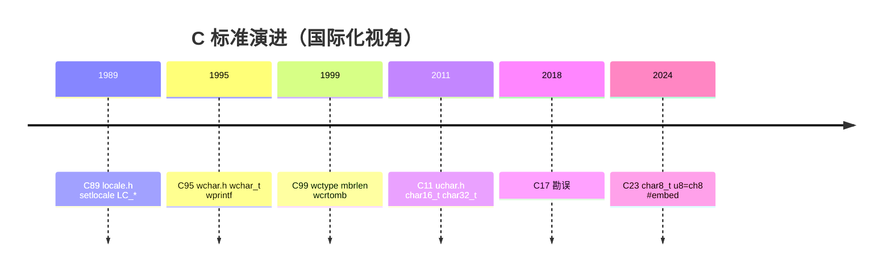
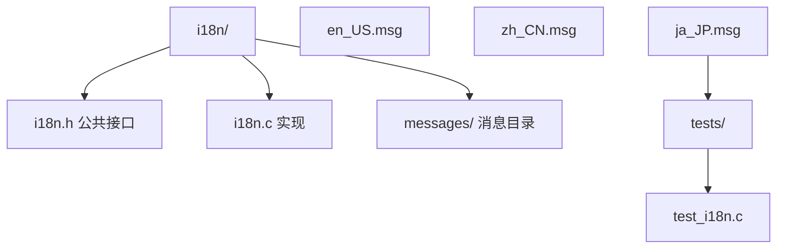
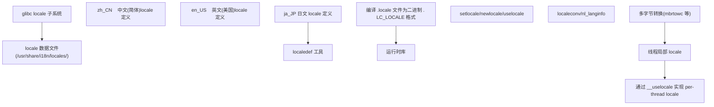

## 前置知识

- [动态库与静态库](/c/031-DynamicStaticLibrary)：建议先完成前一篇的学习

## 学习目标

- 掌握「1. 历史动机与标准演进」的核心机制、典型用法与常见陷阱
- 掌握「2. 形式化定义:locale 抽象机模型」的核心机制、典型用法与常见陷阱
- 掌握「3. setlocale 与 localeconv API 形式语义」的核心机制、典型用法与常见陷阱
- 掌握「4. 宽字符与多字节字符」的核心机制、典型用法与常见陷阱
- 掌握「5. Unicode 与 UTF 编码族」的核心机制、典型用法与常见陷阱


## 1. 历史动机与标准演进

理解 C 国际化机制的设计,必须回到其历史语境。C 语言的国际化能力是标准委员会对全球化软件需求的渐进式回应,每一次标准修订都凝结着工程实践与理论权衡。

### 1.1 C 语言诞生与 ASCII 时代(1969-1989)

1969 年,Ken Thompson 与 Dennis Ritchie 在 PDP-7 上开始 UNIX 原型开发;1972 年,Dennis Ritchie 将 B 语言改造为 C 语言,其字符模型直接继承自当时主流的 7 位 ASCII(ANSI X3.4-1963)。`char` 被定义为容纳"实现的基本字符集中任一字符"的最小单元,在 ASCII 时代等价于 8 位字节。

```
1969  UNIX 原型,B 语言诞生
1972  C 语言诞生,char = 8 bit,ASCII 模型
1978  K&R C 出版,字符模型仍以 ASCII 为中心
1989  ANSI X3.159-1989(C89)发布,引入 <locale.h> 与 setlocale
```

C89 是 C 国际化的真正起点。标准委员会引入 `<locale.h>` 头文件,定义 `setlocale`、`localeconv` 与六个 `LC_*` 分类常量,首次承认"程序运行环境的文化惯例"是一个独立的可配置维度。然而 C89 的国际化能力仍极其有限:没有宽字符,没有多字节转换函数,`char` 仍被假定为单字节字符。

### 1.2 C90 Amendment 1 与宽字符(1995)

1995 年,ISO 发布 ISO/IEC 9899:1990/Amd 1:1995(俗称 C90 Amendment 1 或 C95),引入了三项关键能力:

1. `wchar_t` 类型与 `<wchar.h>` 头文件
2. 宽字符 I/O 函数:`wprintf`、`wscanf`、`fgetwc`、`fputwc` 等
3. 多字节字符转换函数:`mbrtowc`、`wcrtomb`、`mbsrtowcs`、`wcsrtombs`

C95 标志着 C 语言正式承认"字符"与"字节"是两个不同概念:`char` 是字节单元,`wchar_t` 是逻辑字符单元。这一区分是所有后续国际化工作的理论基石。

### 1.3 C99:完善多字节支持(1999)

C99 在 C95 基础上进一步完善多字节字符处理,引入 `mbrlen`、`wcrtomb`(可重入版本)与 `<wctype.h>`(宽字符分类函数)。C99 还首次明确规定了"基础执行字符集"(basic execution character set)与"扩展执行字符集"(extended execution character set)的区分。

```c
/* C99 引入的可重入多字节转换函数 */
#include <wchar.h>
#include <errno.h>

size_t convert_mb_to_wc(wchar_t *wc, const char *mb, size_t n,
                        mbstate_t *ps) {
    size_t ret = mbrtowc(wc, mb, n, ps);
    if (ret == (size_t)-1) {
        /* EILSEQ: 非法字节序列 */
        errno = EILSEQ;
        return (size_t)-1;
    }
    if (ret == (size_t)-2) {
        /* 输入不完整,需要更多字节 */
        return (size_t)-2;
    }
    return ret;
}
```

### 1.4 C11:Unicode 友好的字符类型(2011)

C11 引入了 `<uchar.h>` 头文件与两个明确的 Unicode 友好类型:`char16_t` 与 `char32_t`,分别对应 UTF-16 与 UTF-32 的码单元。这一改动解决了 `wchar_t` 宽度实现定义带来的跨平台不可移植问题。

```c
#include <uchar.h>

/* C11:显式 Unicode 编码单元 */
char16_t utf16_str[] = u"你好";   /* UTF-16 字符串字面量 */
char32_t utf32_str[] = U"你好";   /* UTF-32 字符串字面量 */
```

C11 同时引入了线程支持(`threads.h`)与原子操作(`stdatomic.h`),这间接暴露了 `setlocale` 的线程安全问题——标准委员会在 C11 §7.11.1.1 注中明确警告"实现应避免在多线程环境下产生数据竞争,但本国际标准不强制要求"。

### 1.5 C17/C18:勘误与稳定(2018)

C17(ISO/IEC 9899:2018,俗称 C18)主要是 C11 的勘误版,未引入新的国际化特性,但修复了若干 `<uchar.h>` 的缺陷报告(DR 488 等)。

### 1.6 C23:char8_t 与 u8 字符串字面量(2024)

C23(ISO/IEC 9899:2024)是国际化能力的又一次重大升级,核心改动包括:

1. 引入 `char8_t` 类型(等价于 `unsigned char`,但语义明确为 UTF-8 码单元)
2. `u8""` 字符串字面量类型从 `char[]` 改为 `char8_t[]`
3. 引入 `<uchar.h>` 中的 `mbrtoc8`、`c8rtomb`、`char8_t` 系列
4. 引入 `#embed` 预处理指令(便于嵌入二进制资源)
5. 弃用/deprecate 老旧的 `gets` 函数族

```c
#include <uchar.h>

/* C23:u8 字面量类型变更 */
char8_t *s8 = u8"你好,FANDEX";  /* C23 中类型为 char8_t[] */
/* C17 中,u8"..." 类型为 char[] */
```

### 1.7 C2y 草案动向(2026+)

截至 2026 年,WG14(N3220 之后)正在讨论的 C2y 草案(N3301+)涉及国际化的议题包括:

- 提案 N3026:`<uchar.h>` 中增加 `mbrtoc8`/`c8rtomb` 的边界检查版本
- 提案 N3260:统一 `char8_t`/`char16_t`/`char32_t` 字符串字面量初始化语义
- 提案 N3357:探索运行时字符集协商机制,长期目标是消除对"执行字符集"的编译期假设



## 2. 形式化定义:locale 抽象机模型

本节用 ISO/IEC 9899:2024 的形式语义刻画 C 语言的 locale 抽象机,为后续 API 的语义推导建立严格的数学基础。

### 2.1 locale 作为环境函数

ISO/IEC 9899:2024 §7.11 将 locale 形式化为一个对实现可见的全局状态 $\mathcal{L}$。设程序启动时 $\mathcal{L}_0$ 为"C" locale,则:

$$
\mathcal{L}: \text{Time} \to \bigcup_{c \in \text{Cat}} \text{Value}_c
$$

其中 $\text{Cat} = \{\text{ALL}, \text{COLLATE}, \text{CTYPE}, \text{MONETARY}, \text{NUMERIC}, \text{TIME}\}$ 是六个 locale 分类的集合,$\text{Value}_c$ 是每个分类对应的值域。`setlocale` 是对 $\mathcal{L}$ 的赋值操作:

$$
\text{setlocale}(c, s) \triangleq \begin{cases}
\mathcal{L}' = \mathcal{L}[c \mapsto \text{interpret}(s)] & \text{if } \text{interpret}(s) \text{ valid} \\
\text{return NULL} & \text{otherwise}
\end{cases}
$$

### 2.2 受 locale 影响的函数族

locale 状态 $\mathcal{L}$ 影响的函数族构成 locale 依赖集 $\mathcal{F}_{\text{loc}}$。下表给出 $\mathcal{F}_{\text{loc}}$ 的核心成员及其依赖的分类:

| 函数族 | 依赖分类 | 影响维度 |
| :--- | :--- | :--- |
| `strcoll` / `wcscoll` / `strxfrm` | LC_COLLATE | 字符串比较与排序 |
| `isalpha` / `isdigit` / `toupper` | LC_CTYPE | 字符分类与大小写转换 |
| `mbrtowc` / `wcrtomb` | LC_CTYPE | 多字节与宽字符转换 |
| `strftime` / `wcsftime` | LC_TIME | 日期时间格式化 |
| `strtod` / `printf("%f")` | LC_NUMERIC | 数字解析与格式化 |
| `localeconv` | LC_MONETARY + LC_NUMERIC | 货币与数字格式化细节 |

### 2.3 数据竞争的形式化条件

设 $T_1, T_2$ 为两个线程,$f \in \mathcal{F}_{\text{loc}}$ 为 locale 依赖函数,$g = \text{setlocale}$ 为 locale 修改函数。C11 §7.11.1.1 第 6 段(在 C23/C2y 中保留并强化)规定:

$$
\text{DataRace}(T_1, T_2) \iff \exists\, t_1, t_2: \neg \text{HB}(t_1, t_2) \wedge \neg \text{HB}(t_2, t_1) \wedge ((f \in T_1 \wedge g \in T_2) \vee (g \in T_1 \wedge g \in T_2))
$$

其中 $\text{HB}$ 是 happens-before 关系。该条件意味着:任何无同步的 locale 修改与 locale 依赖函数的并发执行,均构成数据竞争,从而触发未定义行为(Undefined Behavior,UB)。

### 2.4 线程局部 locale:uselocale 模型

C11 引入 `newlocale`/`uselocale`/`freelocale` 三元组,允许每个线程持有独立的 locale 状态 $\mathcal{L}_T$,而非共享全局 $\mathcal{L}$:

$$
\text{uselocale}(\ell) \triangleq \mathcal{L}_T \leftarrow \ell
$$

线程局部 locale 的引入将 $\mathcal{F}_{\text{loc}}$ 的依赖从全局 $\mathcal{L}$ 改为 $\mathcal{L}_T$,从而消除跨线程数据竞争。这一模型是 POSIX 2008 与 glibc 2.3+ 的事实标准。

### 2.5 编码转换的形式语法

设 $B^*$ 为字节序列空间,$C^*$ 为字符(码点)序列空间。多字节编码是函数 $\mathcal{E}: C^* \to B^*$,其逆 $\mathcal{D}: B^* \to C^*$ 称为解码。C 标准要求:

$$
\forall c \in C^*: \mathcal{D}(\mathcal{E}(c)) = c \quad \text{(round-trip 安全)}
$$

但反向不成立:并非所有字节序列都是合法的多字节序列。当 $\mathcal{D}$ 遇到非法字节序列时,`mbrtowc` 返回 $(\text{size\_t})-1$ 并设置 `errno = EILSEQ`。

## 3. setlocale 与 localeconv API 形式语义

本节深入解析 C 标准库中 locale API 的形式语义,涵盖原型、参数、返回值、错误处理与线程安全。

### 3.1 setlocale 函数

```c
#include <locale.h>

char *setlocale(int category, const char *locale);
```

**形式语义**:`setlocale(category, locale)` 修改由 `category` 指定的 locale 分类,设为 `locale` 字符串所代表的 locale。

**参数**:
- `category`:locale 分类,取值为 `LC_ALL`、`LC_COLLATE`、`LC_CTYPE`、`LC_MONETARY`、`LC_NUMERIC`、`LC_TIME` 之一。
- `locale`:
  - `NULL`:仅查询当前 locale,不修改。
  - `""`:由实现查询环境变量 `LC_ALL`、`LC_*`、`LANG` 确定默认 locale。
  - `"C"`:最小化 locale,保证可移植性,ASCII 字符集。
  - 其他字符串(如 `"zh_CN.UTF-8"`):由实现定义。

**返回值**:成功返回指向字符串的指针,该字符串表示修改后的 locale;失败返回 `NULL`。返回的字符串内容是实现定义的,但其生命周期由实现管理,后续 `setlocale` 调用可能覆盖该字符串。

**线程安全**:`setlocale` 修改全局状态,在多线程环境下与任何 locale 依赖函数并发调用构成数据竞争(ISO/IEC 9899:2024 §7.11.1.1 第 6 段)。

```c
/* 安全查询当前 locale 的模式 */
#include <locale.h>
#include <string.h>
#include <stdlib.h>

char *get_current_locale(void) {
    char *cur = setlocale(LC_ALL, NULL);  /* 查询,不修改 */
    if (cur == NULL) return NULL;
    /* 必须立即复制,后续 setlocale 调用可能覆盖 */
    return strdup(cur);
}
```

### 3.2 六大 locale 分类常量

ISO/IEC 9899:2024 §7.11 定义六个 locale 分类常量,每个常量对应一个独立的 locale 维度:

```c
#include <locale.h>

/* 标准定义的六个分类常量 */
LC_ALL        /* 全部分类,等价于五个分类的并集 */
LC_COLLATE    /* 字符串排序与比较,影响 strcoll/wcscoll/strxfrm */
LC_CTYPE      /* 字符分类与转换,影响 isalpha/toupper/mbrtowc */
LC_MONETARY   /* 货币格式化,仅影响 localeconv 返回值 */
LC_NUMERIC    /* 数字格式化,影响 printf/strtod 与 localeconv */
LC_TIME       /* 时间格式化,影响 strftime/wcsftime */
```

**注意**:标准未规定分类常量的具体数值,实现可自由选择。POSIX 在此基础上扩展了 `LC_MESSAGES`(影响错误消息语言),但严格 ISO C 程序不应依赖该常量。

### 3.3 localeconv 函数

```c
#include <locale.h>

struct lconv *localeconv(void);
```

`localeconv` 返回指向 `struct lconv` 的指针,该结构体包含当前 locale 下的数字与货币格式化细节。`struct lconv` 的关键字段包括:

| 字段 | 类型 | 含义 | 示例(zh_CN.UTF-8) |
| :--- | :--- | :--- | :--- |
| `decimal_point` | `char *` | 小数点 | `"."` |
| `thousands_sep` | `char *` | 千分位分隔符 | `","` |
| `grouping` | `char *` | 分组规则 | `""`(不分组) |
| `int_curr_symbol` | `char *` | 国际货币符号 | `"CNY "` |
| `currency_symbol` | `char *` | 本地货币符号 | `"¥"` |
| `mon_decimal_point` | `char *` | 货币小数点 | `"."` |
| `mon_thousands_sep` | `char *` | 货币千分位 | `","` |
| `positive_sign` | `char *` | 正号标记 | `""` |
| `negative_sign` | `char *` | 负号标记 | `"-"` |
| `int_frac_digits` | `char` | 国际货币小数位 | `2` |
| `frac_digits` | `char` | 本地货币小数位 | `2` |

```c
/* 数字按 locale 格式化的最小示例 */
#include <stdio.h>
#include <locale.h>

int main(void) {
    setlocale(LC_ALL, "");
    struct lconv *lc = localeconv();
    printf("decimal_point = %s\n", lc->decimal_point);
    printf("thousands_sep = %s\n", lc->thousands_sep);
    printf("currency_symbol = %s\n", lc->currency_symbol);
    return 0;
}
```

**线程安全警告**:`localeconv` 返回的指针指向静态存储,在多线程环境下被并发调用构成数据竞争。C23 引入了边界检查版本 `localeconv_s`(可选,见 Annex K),但实际可移植性较差。

### 3.4 线程局部 locale:newlocale/uselocale/freelocale

```c
#include <locale.h>

locale_t newlocale(int category_mask, const char *locale, locale_t base);
locale_t uselocale(locale_t newloc);
void freelocale(locale_t loc);
```

`newlocale` 创建一个新的 locale 对象,`uselocale` 将当前线程的 locale 切换为该对象,`freelocale` 释放之。三个函数共同构成线程安全 locale 模型。

```c
/* 线程安全地使用 zh_CN.UTF-8 locale */
#include <locale.h>
#include <stdio.h>
#include <threads.h>

static locale_t zh_locale;

int worker(void *arg) {
    (void)arg;
    /* 切换当前线程的 locale */
    locale_t old = uselocale(zh_locale);
    if (old == NULL) return 1;

    /* 在此线程内调用 locale 依赖函数,与全局 locale 隔离 */
    char buf[100];
    time_t t = time(NULL);
    strftime(buf, sizeof(buf), "%x", localtime(&t));
    printf("zh date: %s\n", buf);

    /* 恢复原 locale */
    uselocale(old);
    return 0;
}

int main(void) {
    zh_locale = newlocale(LC_ALL_MASK, "zh_CN.UTF-8", (locale_t)0);
    if (zh_locale == (locale_t)0) {
        perror("newlocale");
        return 1;
    }

    thrd_t t1, t2;
    thrd_create(&t1, worker, NULL);
    thrd_create(&t2, worker, NULL);
    thrd_join(t1, NULL);
    thrd_join(t2, NULL);

    freelocale(zh_locale);
    return 0;
}
```

**关键约束**:
1. `uselocale` 返回值必须保存,函数结束时调用 `uselocale(old)` 恢复。
2. `freelocale` 不能释放当前线程正在使用的 locale。
3. `newlocale` 创建的 locale 对象引用计数为 1,`uselocale` 不增加引用计数。

### 3.5 POSIX 扩展:LC_MESSAGES 与 nl_langinfo

POSIX.1-2008 在 ISO C 基础上扩展了 `LC_MESSAGES` 分类(影响错误消息与 yes/no 字符串)与 `nl_langinfo` 函数(精细查询 locale 信息):

```c
#include <langinfo.h>
#include <locale.h>
#include <stdio.h>

int main(void) {
    setlocale(LC_ALL, "");
    /* 查询月份名称(POSIX 扩展,非 ISO C) */
    printf("first weekday: %s\n", nl_langinfo(FIRST_WEEKDAY));
    printf("yes string: %s\n", nl_langinfo(YESEXPR));
    return 0;
}
```

**可移植性提示**:使用 `LC_MESSAGES`/`nl_langinfo` 的代码在 Windows MSVC 上不可移植。跨平台程序应通过抽象层封装。

## 4. 宽字符与多字节字符

本节深入 C 语言的字符模型,辨析 `char`、`wchar_t`、`char16_t`、`char32_t`、`char8_t` 五种字符类型的语义差异。

### 4.1 字节 vs 字符:概念辨析

C 语言刻意区分两个概念:

- **字节(byte)**:由 `char` 类型表示,宽度为 `CHAR_BIT` 位(几乎总是 8),是内存的最小可寻址单元。
- **字符(character)**:逻辑文本单元,可能由多个字节组成。

在 ASCII 时代,1 字节 = 1 字符,这一等价性深入人心。但在 UTF-8 等可变长度编码下,一个 Unicode 码点可能由 1-4 个字节组成。C 语言用 `wchar_t` 表示"逻辑字符",用 `char` 表示"字节",从而区分两者。

### 4.2 wchar_t 类型

```c
#include <wchar.h>

wchar_t wc = L'中';   /* 宽字符字面量 */
wchar_t *ws = L"你好"; /* 宽字符串字面量 */
```

`wchar_t` 的关键性质:

| 平台 | 宽度 | 等价类型 | 编码方案 |
| :--- | :--- | :--- | :--- |
| Linux/glibc | 32 位 | `int32_t` | UCS-4/UTF-32 |
| Windows/MSVC | 16 位 | `uint16_t` | UTF-16 |
| macOS (Intel) | 32 位 | `int32_t` | UCS-4/UTF-32 |
| AIX | 16 位 | `unsigned short` | UTF-16 |

**跨平台陷阱**:由于 `wchar_t` 宽度不一致,跨平台代码不应假设 `sizeof(wchar_t)`。Windows 上 `L"笑脸"`(U+1F600)需要代理对,而 Linux 上可单 `wchar_t` 表示。

### 4.3 宽字符 I/O 函数

```c
#include <wchar.h>

int wprintf(const wchar_t *format, ...);
int wscanf(const wchar_t *format, ...);
wint_t fgetwc(FILE *stream);
wint_t fputwc(wchar_t wc, FILE *stream);
wint_t getwc(FILE *stream);
wint_t ungetwc(wint_t wc, FILE *stream);
```

**关键约束**:宽字符 I/O 函数要求流定向为宽字符定向(wide-oriented)。`FILE*` 流首次 I/O 操作决定其定向,一旦定向确定,不能在该流上调用窄字符 I/O 函数(反之亦然),否则返回 `WEOF` 或 `EOF` 并设置 errno。

```c
/* 流定向的正确切换模式 */
#include <stdio.h>
#include <wchar.h>
#include <locale.h>

int main(void) {
    setlocale(LC_ALL, "");

    FILE *f = fopen("test.txt", "w");
    /* fwide 显式设置定向,正数=宽,负数=窄,0=查询 */
    if (fwide(f, 1) < 0) {
        fprintf(stderr, "cannot set wide orientation\n");
    }
    fwprintf(f, L"你好,FANDEX\n");
    fclose(f);
    return 0;
}
```

### 4.4 多字节字符转换函数

C 标准提供两类转换函数:不可重入(C89 风格)与可重入(C95/C99 风格)。

```c
/* 不可重入(C89 风格,使用内部静态状态) */
int mblen(const char *s, size_t n);
int mbtowc(wchar_t *pwc, const char *s, size_t n);
int wctomb(char *s, wchar_t wc);

/* 可重入(C95/C99 风格,显式 mbstate_t) */
size_t mbrtowc(wchar_t *pwc, const char *s, size_t n, mbstate_t *ps);
size_t wcrtomb(char *s, wchar_t wc, mbstate_t *ps);
size_t mbsrtowcs(wchar_t *dst, const char **src, size_t len, mbstate_t *ps);
size_t wcsrtombs(char *dst, const wchar_t **src, size_t len, mbstate_t *ps);
```

**生产建议**:新代码应一律使用可重入版本,避免内部静态状态带来的线程不安全与状态污染。

```c
/* 完整的 UTF-8 字符串转 wchar_t 数组(可重入版本) */
#include <wchar.h>
#include <stdlib.h>
#include <errno.h>

/**
 * 将 UTF-8 多字节字符串转换为 wchar_t 数组。
 * @param  dst  目标 wchar_t 数组,可为 NULL(仅计算长度)
 * @param  src  源 UTF-8 字符串
 * @param  n    目标数组容量
 * @return 写入的 wchar_t 数(不含终止符);失败返回 (size_t)-1
 */
size_t utf8_to_wcs(wchar_t *dst, const char *src, size_t n) {
    mbstate_t state = {0};  /* 初始化转换状态 */
    const char *p = src;
    size_t count = mbsrtowcs(dst, &p, n, &state);
    if (count == (size_t)-1) {
        errno = EILSEQ;
        return (size_t)-1;
    }
    return count;
}
```

### 4.5 mbstate_t 状态机

`mbstate_t` 是多字节转换的状态机,记录"上一个不完整多字节序列的剩余字节"。其内部结构由实现定义,典型实现是:

```c
typedef struct {
    unsigned char buf[MB_LEN_MAX];  /* 待处理字节缓冲 */
    size_t count;                   /* 已积累字节数 */
    /* 可能还有 codec/编码标识 */
} mbstate_t;
```

`mbrtowc` 在调用时:
1. 若 `ps->count == 0`:尝试从 `s` 解码一个完整字符;若 `s` 中字节不完整,将剩余字节存入 `ps->buf`,返回 `(size_t)-2`。
2. 若 `ps->count > 0`:先用 `ps->buf` 中字节,再补充 `s` 中字节,直到能解码或确认非法。

```c
/* 流式解码示例:从网络分块读取 UTF-8,逐步转换 */
#include <wchar.h>
#include <stdio.h>

void stream_decode(FILE *in) {
    mbstate_t state = {0};
    char buf[4096];
    wchar_t wc;
    size_t consumed;

    while (fgets(buf, sizeof(buf), in)) {
        const char *p = buf;
        size_t left = strlen(buf);
        while (left > 0) {
            consumed = mbrtowc(&wc, p, left, &state);
            if (consumed == (size_t)-1) {
                perror("mbrtowc EILSEQ");
                return;
            }
            if (consumed == (size_t)-2) {
                /* 当前块末尾不完整,等待下一块 */
                break;
            }
            if (consumed == 0) {
                /* 空字符,占 1 字节 */
                consumed = 1;
            }
            p += consumed;
            left -= consumed;
            wprintf(L"%lc", wc);
        }
    }
}
```

## 5. Unicode 与 UTF 编码族

Unicode 是字符编码的现代基石。本节从码点、码元、编码方案三个层次,辨析 UTF-8/UTF-16/UTF-32 的形式语义与 C 表示。

### 5.1 Unicode 码点与平面

Unicode 码点(code point)是 $U+0000$ 到 $U+10FFFF$ 范围内的整数,共 $1{,}114{,}112$ 个可能值。Unicode 码点空间划分为 17 个平面(plane),每平面 $65{,}536$ 个码点:

- 平面 0:基本多文种平面(BMP),$U+0000$ - $U+FFFF$
- 平面 1:辅助多文种平面(SMP),$U+10000$ - $U+1FFFF$
- 平面 2:表意文字补充平面(SIP),$U+20000$ - $U+2FFFF$
- 平面 3-13:保留
- 平面 14:特殊用途补充平面(SSP)
- 平面 15-16:私用区(PUA)

```c
/* 判断码点所在平面 */
#include <stdint.h>

typedef enum {
    PLANE_BMP = 0,
    PLANE_SMP = 1,
    PLANE_SIP = 2,
    PLANE_SSP = 14,
    PLANE_PUA_A = 15,
    PLANE_PUA_B = 16
} unicode_plane;

unicode_plane plane_of(uint32_t cp) {
    return (unicode_plane)(cp >> 16);
}
```

### 5.2 UTF-32:定长编码

UTF-32 将每个码点直接编码为 32 位整数。优点是定长、随机访问快;缺点是空间占用高(英文文本浪费 4 倍空间)。

```c
#include <uchar.h>

char32_t utf32[] = U"你好FANDEX";  /* 每个码点占 4 字节 */
/* UTF-32 字符串长度 = 码点数 */
size_t char_count = sizeof(utf32)/sizeof(utf32[0]) - 1;
```

**字节序问题**:UTF-32 有 BE/LE 之分,跨平台数据交换需要 BOM($U+FEFF$)或显式声明字节序。

### 5.3 UTF-16:变长(1-2 码元)

UTF-16 将 BMP 码点编码为 1 个 16 位码元,将辅助平面码点编码为 2 个 16 位码元(代理对)。

代理对的编码规则:
- 高代理:$D800$ - $DBFF$
- 低代理:$DC00$ - $DFFF$
- 码点 $c > U+FFFF$ 编码为:$\text{high} = D800 + ((c - 10000) \gg 10)$,$\text{low} = DC00 + ((c - 10000) \mathbin{\&} 3FF)$

```c
#include <uchar.h>
#include <stdint.h>

/* UTF-16 代理对编码 */
void encode_utf16_surrogate(uint32_t cp, char16_t pair[2]) {
    if (cp < 0x10000) {
        pair[0] = (char16_t)cp;
        pair[1] = 0;
    } else {
        uint32_t v = cp - 0x10000;
        pair[0] = (char16_t)(0xD800 + (v >> 10));
        pair[1] = (char16_t)(0xDC00 + (v & 0x3FF));
    }
}
```

### 5.4 UTF-8:变长(1-4 字节)

UTF-8 是互联网的事实标准,具有 ASCII 兼容、自同步、字节序无关等优良特性。其编码规则:

| 码点范围 | 字节数 | 编码格式 |
| :--- | :--- | :--- |
| $U+0000$ - $U+007F$ | 1 | `0xxxxxxx` |
| $U+0080$ - $U+07FF$ | 2 | `110xxxxx 10xxxxxx` |
| $U+0800$ - $U+FFFF$ | 3 | `1110xxxx 10xxxxxx 10xxxxxx` |
| $U+10000$ - $U+10FFFF$ | 4 | `11110xxx 10xxxxxx 10xxxxxx 10xxxxxx` |

```c
/* UTF-8 编码器:码点 -> 字节序列 */
#include <stdint.h>
#include <stddef.h>

/**
 * 将 Unicode 码点编码为 UTF-8 字节序列。
 * @param  cp  码点
 * @param  buf 输出缓冲,至少 4 字节
 * @return 写入字节数;cp 非法返回 0
 */
size_t utf8_encode(uint32_t cp, uint8_t *buf) {
    if (cp <= 0x7F) {
        buf[0] = (uint8_t)cp;
        return 1;
    } else if (cp <= 0x7FF) {
        buf[0] = (uint8_t)(0xC0 | (cp >> 6));
        buf[1] = (uint8_t)(0x80 | (cp & 0x3F));
        return 2;
    } else if (cp <= 0xFFFF) {
        /* 排除代理对码点(非法) */
        if (cp >= 0xD800 && cp <= 0xDFFF) return 0;
        buf[0] = (uint8_t)(0xE0 | (cp >> 12));
        buf[1] = (uint8_t)(0x80 | ((cp >> 6) & 0x3F));
        buf[2] = (uint8_t)(0x80 | (cp & 0x3F));
        return 3;
    } else if (cp <= 0x10FFFF) {
        buf[0] = (uint8_t)(0xF0 | (cp >> 18));
        buf[1] = (uint8_t)(0x80 | ((cp >> 12) & 0x3F));
        buf[2] = (uint8_t)(0x80 | ((cp >> 6) & 0x3F));
        buf[3] = (uint8_t)(0x80 | (cp & 0x3F));
        return 4;
    }
    return 0;  /* 非法码点 */
}
```

```c
/* UTF-8 解码器:字节序列 -> 码点 */
#include <stdint.h>
#include <stddef.h>

/**
 * 解码 UTF-8 字节序列为 Unicode 码点。
 * @param  s    字节序列
 * @param  n    字节序列长度
 * @param  cp   输出码点
 * @return 消费字节数;非法序列返回 0
 */
size_t utf8_decode(const uint8_t *s, size_t n, uint32_t *cp) {
    if (n == 0) return 0;
    uint8_t b0 = s[0];
    if (b0 < 0x80) {
        *cp = b0;
        return 1;
    }
    size_t len;
    uint32_t val;
    if ((b0 & 0xE0) == 0xC0) { len = 2; val = b0 & 0x1F; }
    else if ((b0 & 0xF0) == 0xE0) { len = 3; val = b0 & 0x0F; }
    else if ((b0 & 0xF8) == 0xF0) { len = 4; val = b0 & 0x07; }
    else return 0;  /* 非法首字节 */

    if (n < len) return 0;  /* 不完整 */
    for (size_t i = 1; i < len; i++) {
        if ((s[i] & 0xC0) != 0x80) return 0;  /* 后续字节非法 */
        val = (val << 6) | (s[i] & 0x3F);
    }
    /* 检查 overlong 编码 */
    if (len == 2 && val < 0x80) return 0;
    if (len == 3 && val < 0x800) return 0;
    if (len == 4 && (val < 0x10000 || val > 0x10FFFF)) return 0;
    /* 检查代理对 */
    if (val >= 0xD800 && val <= 0xDFFF) return 0;
    *cp = val;
    return len;
}
```

### 5.5 BOM:字节序标记

BOM(Byte Order Mark)是 $U+FEFF$ 字符,用作 UTF-16/32 的字节序指示:

| 编码 | BOM 字节 |
| :--- | :--- |
| UTF-8 | `EF BB BF` |
| UTF-16 BE | `FE FF` |
| UTF-16 LE | `FF FE` |
| UTF-32 BE | `00 00 FE FF` |
| UTF-32 LE | `FF FE 00 00` |

UTF-8 的 BOM 是可选的且不推荐(Unix 工具链常将其误判为有效字符)。Windows 偏好带 BOM 的 UTF-8(Unix 偏好不带)。

## 6. C23/C2y 新特性:char8_t 与 u8string

C23 引入 `char8_t` 类型,标志着 C 语言正式将 UTF-8 提升为一等公民。本节解析这一改动的影响。

### 6.1 char8_t 类型

```c
/* C23 引入 */
#include <uchar.h>

typedef unsigned char char8_t;  /* 语义明确为 UTF-8 码单元 */
```

`char8_t` 与 `unsigned char` 在二进制表示上等价,但类型系统将其视为不同类型。这一区分使函数重载(C++)与类型检查能够区分"任意字节"与"UTF-8 码单元"。

### 6.2 u8 字符串字面量类型变更

```c
/* C17 */
const char *s17 = u8"hello";   /* 类型为 char[] */

/* C23 */
const char8_t *s23 = u8"hello";  /* 类型为 char8_t[] */
```

**迁移影响**:任何将 `u8""` 赋值给 `char*` 的代码在 C23 下会产生编译警告或错误。迁移方案:

```c
/* 兼容 C17 与 C23 的写法 */
#include <uchar.h>
#if __STDC_VERSION__ >= 202311L
typedef char8_t u8char_t;
#else
typedef unsigned char u8char_t;
#endif

const u8char_t *s = (const u8char_t *)u8"hello";
```

### 6.3 mbrtoc8 与 c8rtomb

C23 在 `<uchar.h>` 中引入 `mbrtoc8` 与 `c8rtomb`,提供 UTF-8 与 `char8_t` 之间的转换:

```c
#include <uchar.h>
#include <wchar.h>

size_t mbrtoc8(char8_t *pc8, const char *s, size_t n, mbstate_t *ps);
size_t c8rtomb(char *s, char8_t c8, mbstate_t *ps);
```

```c
/* C23:逐码元解码 UTF-8 */
#include <uchar.h>
#include <stdio.h>

void print_utf8_chars(const char *s) {
    mbstate_t state = {0};
    char8_t c8;
    size_t consumed;
    while (*s) {
        consumed = mbrtoc8(&c8, s, MB_CUR_MAX, &state);
        if (consumed == (size_t)-1) {
            perror("mbrtoc8");
            return;
        }
        if (consumed == (size_t)-2 || consumed == (size_t)-3) continue;
        printf("char8_t: 0x%02x\n", (unsigned)c8);
        s += (consumed == 0) ? 1 : consumed;
    }
}
```

### 6.4 C2y 草案:边界检查版本

C2y 草案(N3357 等)正在讨论引入 `mbrtoc8_s`/`c8rtomb_s` 等边界检查版本,与 Annex K 的 `_s` 函数族一致。截至 2026 年,这些提案仍在 WG14 讨论中,实际可用性有限。

## 7. 代码示例:生产级 i18n 模块

本节给出一个生产级 i18n 模块骨架,涵盖 locale 初始化、编码转换、字符串格式化与多语言资源管理。

### 7.1 模块设计



### 7.2 公共接口

```c
/* i18n.h:国际化模块公共接口 */
#ifndef FANDEX_I18N_H
#define FANDEX_I18N_H

#include <stddef.h>
#include <uchar.h>
#include <stdbool.h>

#ifdef __cplusplus
extern "C" {
#endif

/* i18n 上下文,封装 locale 与消息目录 */
typedef struct i18n_ctx i18n_ctx;

/* 创建 i18n 上下文,locale 形如 "zh_CN.UTF-8" */
i18n_ctx *i18n_create(const char *locale);

/* 销毁 i18n 上下文 */
void i18n_destroy(i18n_ctx *ctx);

/* 翻译消息:key 为消息标识,返回当前 locale 的翻译 */
const char *i18n_translate(i18n_ctx *ctx, const char *key);

/* 格式化数字到 buf,返回写入字节数 */
size_t i18n_format_number(i18n_ctx *ctx, char *buf, size_t n,
                          double value, int precision);

/* 格式化日期到 buf,返回写入字节数 */
size_t i18n_format_date(i18n_ctx *ctx, char *buf, size_t n,
                        const struct tm *tm, const char *fmt);

/* UTF-8 字符串长度(码点数) */
size_t i18n_utf8_strlen(const char *s);

/* UTF-8 字符串截取(按码点) */
size_t i18n_utf8_substr(char *dst, size_t n, const char *src,
                        size_t start, size_t len);

#ifdef __cplusplus
}
#endif

#endif /* FANDEX_I18N_H */
```

### 7.3 实现

```c
/* i18n.c:国际化模块实现 */
#include "i18n.h"
#include <locale.h>
#include <langinfo.h>
#include <stdlib.h>
#include <string.h>
#include <time.h>
#include <stdio.h>
#include <wchar.h>

/* 消息条目 */
typedef struct {
    const char *key;
    const char *msg;
} msg_entry;

/* 简化的消息目录:实际项目应使用 gettext 或自实现哈希表 */
static const msg_entry messages_zh[] = {
    {"hello", "你好"},
    {"welcome", "欢迎来到 FANDEX"},
    {"goodbye", "再见"},
    {NULL, NULL}
};

static const msg_entry messages_en[] = {
    {"hello", "Hello"},
    {"welcome", "Welcome to FANDEX"},
    {"goodbye", "Goodbye"},
    {NULL, NULL}
};

static const msg_entry messages_ja[] = {
    {"hello", "こんにちは"},
    {"welcome", "FANDEX へようこそ"},
    {"goodbye", "さようなら"},
    {NULL, NULL}
};

/* i18n 上下文结构 */
struct i18n_ctx {
    locale_t posix_locale;   /* POSIX locale 对象 */
    const msg_entry *msgs;   /* 当前消息目录 */
    char locale_name[64];    /* locale 名称副本 */
};

/* 从 locale 名推断语言前缀 */
static const char *lang_prefix(const char *locale) {
    /* "zh_CN.UTF-8" -> "zh" */
    static char buf[8];
    size_t i = 0;
    while (locale[i] && locale[i] != '_' && locale[i] != '.' && i < 7) {
        buf[i] = locale[i];
        i++;
    }
    buf[i] = '\0';
    return buf;
}

i18n_ctx *i18n_create(const char *locale) {
    i18n_ctx *ctx = calloc(1, sizeof(*ctx));
    if (!ctx) return NULL;

    /* 复制 locale 名 */
    strncpy(ctx->locale_name, locale, sizeof(ctx->locale_name) - 1);

    /* 创建 POSIX locale 对象(线程局部) */
    ctx->posix_locale = newlocale(LC_ALL_MASK, locale, (locale_t)0);
    if (ctx->posix_locale == (locale_t)0) {
        /* fallback:使用 "C" locale */
        ctx->posix_locale = newlocale(LC_ALL_MASK, "C", (locale_t)0);
    }

    /* 选择消息目录 */
    const char *lang = lang_prefix(locale);
    if (strcmp(lang, "zh") == 0) ctx->msgs = messages_zh;
    else if (strcmp(lang, "ja") == 0) ctx->msgs = messages_ja;
    else ctx->msgs = messages_en;

    return ctx;
}

void i18n_destroy(i18n_ctx *ctx) {
    if (!ctx) return;
    if (ctx->posix_locale) freelocale(ctx->posix_locale);
    free(ctx);
}

const char *i18n_translate(i18n_ctx *ctx, const char *key) {
    if (!ctx || !key) return key;
    for (const msg_entry *e = ctx->msgs; e->key; e++) {
        if (strcmp(e->key, key) == 0) return e->msg;
    }
    return key;  /* 未找到,返回 key 本身 */
}

size_t i18n_format_number(i18n_ctx *ctx, char *buf, size_t n,
                          double value, int precision) {
    if (!ctx || !buf || n == 0) return 0;

    /* 临时切换到目标 locale */
    locale_t old = uselocale(ctx->posix_locale);
    size_t written = (size_t)snprintf(buf, n, "%.*f", precision, value);
    uselocale(old);
    return written;
}

size_t i18n_format_date(i18n_ctx *ctx, char *buf, size_t n,
                        const struct tm *tm, const char *fmt) {
    if (!ctx || !buf || n == 0 || !tm || !fmt) return 0;

    locale_t old = uselocale(ctx->posix_locale);
    size_t written = (size_t)strftime_l(buf, n, fmt, tm, ctx->posix_locale);
    uselocale(old);
    return written;
}

size_t i18n_utf8_strlen(const char *s) {
    if (!s) return 0;
    size_t count = 0;
    while (*s) {
        uint8_t b = (uint8_t)*s;
        if (b < 0x80) s += 1;
        else if ((b & 0xE0) == 0xC0) s += 2;
        else if ((b & 0xF0) == 0xE0) s += 3;
        else if ((b & 0xF8) == 0xF0) s += 4;
        else s += 1;  /* 非法字节,跳过 */
        count++;
    }
    return count;
}

size_t i18n_utf8_substr(char *dst, size_t n, const char *src,
                        size_t start, size_t len) {
    if (!dst || n == 0 || !src) return 0;
    size_t cp_count = 0;
    size_t byte_pos = 0;
    size_t start_byte = 0;
    size_t end_byte = 0;
    bool found_start = false;

    while (src[byte_pos]) {
        if (cp_count == start) {
            start_byte = byte_pos;
            found_start = true;
        }
        if (cp_count == start + len) {
            end_byte = byte_pos;
            break;
        }
        uint8_t b = (uint8_t)src[byte_pos];
        if (b < 0x80) byte_pos += 1;
        else if ((b & 0xE0) == 0xC0) byte_pos += 2;
        else if ((b & 0xF0) == 0xE0) byte_pos += 3;
        else if ((b & 0xF8) == 0xF0) byte_pos += 4;
        else byte_pos += 1;
        cp_count++;
    }
    if (!found_start) {
        dst[0] = '\0';
        return 0;
    }
    if (end_byte == 0) end_byte = byte_pos;
    if (end_byte - start_byte >= n) {
        end_byte = start_byte + n - 1;
    }
    memcpy(dst, src + start_byte, end_byte - start_byte);
    dst[end_byte - start_byte] = '\0';
    return end_byte - start_byte;
}
```

### 7.4 使用示例

```c
/* main.c:演示 i18n 模块 */
#include "i18n/i18n.h"
#include <stdio.h>
#include <time.h>

int main(int argc, char **argv) {
    const char *locale = (argc > 1) ? argv[1] : "zh_CN.UTF-8";
    i18n_ctx *ctx = i18n_create(locale);
    if (!ctx) {
        fprintf(stderr, "i18n_create failed\n");
        return 1;
    }

    /* 翻译消息 */
    printf("%s\n", i18n_translate(ctx, "hello"));
    printf("%s\n", i18n_translate(ctx, "welcome"));
    printf("%s\n", i18n_translate(ctx, "goodbye"));

    /* 格式化数字 */
    char numbuf[64];
    i18n_format_number(ctx, numbuf, sizeof(numbuf), 1234567.891, 2);
    printf("number: %s\n", numbuf);

    /* 格式化日期 */
    char datebuf[64];
    time_t t = time(NULL);
    struct tm *tm = localtime(&t);
    i18n_format_date(ctx, datebuf, sizeof(datebuf), tm, "%x %X");
    printf("date: %s\n", datebuf);

    /* UTF-8 字符串操作 */
    const char *s = "你好,FANDEX 世界";
    printf("utf8 strlen: %zu\n", i18n_utf8_strlen(s));
    char sub[32];
    i18n_utf8_substr(sub, sizeof(sub), s, 2, 4);
    printf("substr: %s\n", sub);

    i18n_destroy(ctx);
    return 0;
}
```

### 7.5 编译与运行

```bash
# 使用 gcc 编译,启用 C23 标准
gcc -std=c23 -Wall -Wextra -Wpedantic \
    -finput-charset=UTF-8 -fexec-charset=UTF-8 \
    -o demo main.c i18n/i18n.c

# 运行(指定 locale)
./demo zh_CN.UTF-8
./demo en_US.UTF-8
./demo ja_JP.UTF-8
```

## 8. 对比分析:C/C++/Rust/Go/Zig

本节将 C 的国际化能力与主流系统编程语言横向对比,帮助读者理解不同设计哲学。

### 8.1 C vs C++

| 维度 | C | C++ |
| :--- | :--- | :--- |
| locale API | `setlocale` + `localeconv` | `std::locale` 类(面向对象) |
| 字符类型 | `char`/`wchar_t`/`char16_t`/`char32_t`/`char8_t` | 同 C,加 `std::u8string` 等 |
| 字符串 | `char*` / `wchar_t*` | `std::string` / `std::wstring` / `std::u8string` |
| 编码转换 | `mbrtowc` / `wcrtomb`(手动管理状态) | `std::wstring_convert`(C++17 已弃用)/ ICU |
| 资源管理 | 手动 `newlocale`/`freelocale` | RAII,`std::locale` 析构自动释放 |
| 标准库完整性 | 仅基础 locale,无内置 Unicode 工具 | 同 C,但 Boost.Locale 提供高层抽象 |

**核心差异**:C++ 的 `std::locale` 设计更为面向对象,但 C++17 弃用 `std::wstring_convert` 后,标准库缺乏现代 Unicode 工具,实际项目多依赖 ICU。

### 8.2 C vs Rust

| 维度 | C | Rust |
| :--- | :--- | :--- |
| 字符串编码 | `char*` 编码由 locale 决定 | `String` 强制 UTF-8,`str` 是 UTF-8 切片 |
| 字符类型 | `char`(字节)/ `wchar_t` | `char` 是 4 字节 Unicode 码点 |
| locale 支持 | `<locale.h>` 标准库 | 标准库无,需第三方 crate(如 `fluent`) |
| 编码转换 | `mbrtowc` 等 | `std::str::from_utf8` 等(返回 `Result`) |
| 错误处理 | `errno` + 返回值 | `Result<T, E>` 类型系统强制 |
| 内存安全 | UB 频发 | 编译期保证,无 UB |

**核心差异**:Rust 在语言层面强制 UTF-8,消除了"字节 vs 字符"的歧义;但牺牲了对非 UTF-8 编码的原生支持。locale 在 Rust 中是第三方领域,需要 `fluent-rs` 等库。

### 8.3 C vs Go

| 维度 | C | Go |
| :--- | :--- | :--- |
| 字符串编码 | `char*` 由 locale 决定 | `string` 强制 UTF-8 |
| 字符类型 | `char`/`wchar_t` | `rune`(等价 `int32`,Unicode 码点) |
| 字符串遍历 | 手动解码 UTF-8 | `for i, r := range s`(自动按码点迭代) |
| locale | `<locale.h>` | 标准库无,需第三方(如 `golang.org/x/text`) |
| 资源管理 | 手动 | GC 自动 |
| 国际化包 | 无 | `golang.org/x/text/language`、`message`、`currency` |

**核心差异**:Go 在语言层面强制 UTF-8,标准库虽无 locale 但有强大的 `x/text` 子包,支持 BCP 47 语言标签、消息目录、货币/日期格式化。Go 的 i18n 体验优于 C,但牺牲了对非 UTF-8 编码的原生支持。

### 8.4 C vs Zig

| 维度 | C | Zig |
| :--- | :--- | :--- |
| 字符串编码 | `char*` 由 locale 决定 | `[]const u8` 字节切片,显式标注编码 |
| 字符类型 | `char` | `u8` 字节;`u21` 用于 Unicode 码点 |
| locale | `<locale.h>` | 标准库无 |
| 编码转换 | `mbrtowc` | `std.unicode.Utf8View`、`Utf16Le` 等 |
| 错误处理 | `errno` | 显式错误联合(`!T`) |
| 内存安全 | UB 频发 | 编译期 + 运行期检查,可选安全级别 |

**核心差异**:Zig 取消了 `char` 类型,字符与字节彻底分离;标准库提供完整的 UTF-8/16 解码器,但无 locale 抽象。Zig 的设计哲学是"显式优于隐式",locale 应由应用层处理。

### 8.5 综合对比表

| 特性 | C11 | C23 | C++20 | Rust 1.70+ | Go 1.21+ | Zig 0.13+ |
| :--- | :--- | :--- | :--- | :--- | :--- | :--- |
| UTF-8 字面量 | `u8""`(char) | `u8""`(char8_t) | `u8""`(char8_t) | 默认 | 默认 | `""`(u8 切片) |
| UTF-16 字面量 | `u""` | `u""` | `u""` | 无 | 无 | 无 |
| UTF-32 字面量 | `U""` | `U""` | `U""` | 无 | 无 | 无 |
| 标准 locale | 是 | 是 | 是(类) | 否 | 否 | 否 |
| 标准 Unicode 工具 | 弱 | 弱 | 弱 | 强 | 强 | 强 |
| 线程局部 locale | 是 | 是 | 否 | N/A | N/A | N/A |

**结论**:C 在标准化 locale 抽象方面领先,但在现代 Unicode 工具(规范化、断词、双向算法)方面弱于 Rust/Go/Zig。生产级 i18n 项目应结合 C 标准库与 ICU。

## 9. 常见陷阱与未定义行为

本节枚举 i18n 编程中的高频陷阱,每个陷阱给出错误代码、危害分析与修复方案。

### 9.1 陷阱 1:未调用 setlocale 导致宽字符输出失败

```c
/* 错误:未调用 setlocale */
#include <wchar.h>
int main(void) {
    wprintf(L"你好\n");  /* 输出可能为空或乱码 */
    return 0;
}
```

**危害**:`wprintf` 默认在 "C" locale 下工作,宽字符定向流无法正确转换为多字节输出,`errno` 被置为 `EILSEQ`,返回负值。

**修复**:

```c
#include <wchar.h>
#include <locale.h>
int main(void) {
    setlocale(LC_ALL, "");  /* 必须先设置 locale */
    wprintf(L"你好\n");
    return 0;
}
```

### 9.2 陷阱 2:多线程并发调用 setlocale 导致数据竞争

```c
/* 错误:多线程并发修改 locale */
#include <threads.h>
#include <locale.h>
#include <stdio.h>

int worker(void *arg) {
    setlocale(LC_ALL, (const char *)arg);  /* 数据竞争! */
    printf("locale: %s\n", setlocale(LC_ALL, NULL));
    return 0;
}
```

**危害**:ISO/IEC 9899:2024 §7.11.1.1 明确规定多线程并发调用 `setlocale` 与 locale 依赖函数构成数据竞争,触发未定义行为。表现包括:输出格式不一致、字符串比较错误、随机崩溃。

**修复**:使用 `uselocale` + `newlocale` 创建线程局部 locale:

```c
#include <threads.h>
#include <locale.h>
#include <stdio.h>

int worker(void *arg) {
    locale_t loc = newlocale(LC_ALL_MASK, (const char *)arg, (locale_t)0);
    if (loc == (locale_t)0) return 1;
    locale_t old = uselocale(loc);
    /* 在此线程内调用 locale 依赖函数,与其他线程隔离 */
    printf("locale: %s\n", setlocale(LC_ALL, NULL));
    uselocale(old);
    freelocale(loc);
    return 0;
}
```

### 9.3 陷阱 3:假设 wchar_t 宽度

```c
/* 错误:假设 wchar_t 是 32 位 */
#include <wchar.h>
void buggy(void) {
    wchar_t s[] = L"\u{1F600}";  /* U+1F600,辅助平面 */
    /* Windows:需要代理对,占 2 个 wchar_t */
    /* Linux:单 wchar_t,占 1 个 */
    /* 假设 sizeof(wchar_t)==4 在 Windows 上是 UB */
}
```

**危害**:跨平台代码在 Windows 上无法正确表示辅助平面字符。

**修复**:使用 `char32_t`(C11+)保证 32 位,或使用 `char8_t`(C23+)与 UTF-8:

```c
#include <uchar.h>
void correct(void) {
    char32_t s[] = U"\u{1F600}";  /* 保证 32 位,跨平台一致 */
}
```

### 9.4 陷阱 4:u8 字符串赋值给 char*

```c
/* C17 中可编译,C23 中编译失败 */
char *s = u8"hello";  /* C23: char8_t[] 不能赋值给 char* */
```

**危害**:C23 将 `u8""` 类型改为 `char8_t[]`,此代码在 C23 下产生类型错误。

**修复**:

```c
#include <uchar.h>
#if __STDC_VERSION__ >= 202311L
const char8_t *s = u8"hello";
#else
const char *s = u8"hello";
#endif
```

### 9.5 陷阱 5:mbrtowc 状态机污染

```c
/* 错误:多次使用同一 mbstate_t 但未重置 */
#include <wchar.h>
void buggy(void) {
    mbstate_t state;  /* 未初始化! */
    wchar_t wc;
    mbrtowc(&wc, "你", 3, &state);
    /* state 现在含残留状态 */
    mbrtowc(&wc, "好", 3, &state);  /* 可能失败 */
}
```

**危害**:未初始化的 `mbstate_t` 含垃圾值,导致解码失败或乱码。

**修复**:每次使用前显式初始化:

```c
mbstate_t state = {0};  /* 零初始化 */
/* 或:memset(&state, 0, sizeof(state)); */
```

### 9.6 陷阱 6:localeconv 返回的静态缓冲被覆盖

```c
/* 错误:多次调用 localeconv 覆盖缓冲 */
#include <locale.h>
#include <stdio.h>
void buggy(void) {
    struct lconv *lc1 = localeconv();
    char *dp1 = lc1->decimal_point;  /* 指向静态缓冲 */
    setlocale(LC_ALL, "de_DE.UTF-8");
    struct lconv *lc2 = localeconv();
    /* dp1 现在可能指向新值 */
    printf("old dp: %s\n", dp1);  /* 可能不是 "." */
}
```

**危害**:`localeconv` 返回的指针指向静态存储,后续 `setlocale` 或 `localeconv` 调用会覆盖该缓冲。

**修复**:立即复制所需字段:

```c
struct lconv *lc = localeconv();
char *decimal_point = strdup(lc->decimal_point);  /* 立即复制 */
```

### 9.7 陷阱 7:文件流定向不一致

```c
/* 错误:同一流混合使用窄字符与宽字符 I/O */
#include <stdio.h>
#include <wchar.h>
void buggy(void) {
    FILE *f = fopen("test.txt", "w");
    fprintf(f, "hello");   /* 窄字符定向 */
    fwprintf(f, L"world"); /* 宽字符 I/O,失败 */
}
```

**危害**:流一旦定向,不能混用窄字符与宽字符 I/O。`fwprintf` 在窄字符定向流上返回负值并设置 `errno`。

**修复**:用 `fwide` 显式设置定向,或使用两个独立流:

```c
FILE *f = fopen("test.txt", "w");
fwide(f, 1);  /* 显式宽字符定向 */
fwprintf(f, L"你好");
```

### 9.8 陷阱 8:UTF-8 overlong 编码

```c
/* 错误:接受 overlong 编码 */
/* 0xC0 0xAF 是 '/' 的 overlong 编码,合法 UTF-8 但应拒绝 */
uint8_t overlong[] = {0xC0, 0xAF, 0x00};
```

**危害**:Overlong 编码可绕过文件系统路径过滤,导致安全漏洞(如目录遍历)。

**修复**:解码器必须检查每个码点的最小字节长度:

```c
/* 见 6.4 节 utf8_decode 函数,已包含 overlong 检查 */
```

### 9.9 陷阱 9:locale 名不可移植

```c
/* 错误:硬编码 locale 名 */
setlocale(LC_ALL, "zh_CN.UTF-8");  /* Windows 上无效 */
```

**危害**:Windows 使用 `"chs"` 或 `"Chinese_China.936"`,而非 POSIX 风格的 `"zh_CN.UTF-8"`。

**修复**:使用 `setlocale(LC_ALL, "")` 让实现查询环境变量,或按平台分支:

```c
#ifdef _WIN32
setlocale(LC_ALL, "chs");
#else
setlocale(LC_ALL, "zh_CN.UTF-8");
#endif
```

### 9.10 陷阱 10:多字节字符串长度假设

```c
/* 错误:用 strlen 计算"字符数" */
#include <string.h>
#include <stdio.h>
void buggy(void) {
    const char *s = "你好";  /* UTF-8 下 6 字节 */
    printf("length: %zu\n", strlen(s));  /* 输出 6,不是 2 */
}
```

**危害**:`strlen` 返回字节数,不是字符数。

**修复**:用 `mbrtowc` 逐字符解码,或使用 8.3 节的 `i18n_utf8_strlen`。

## 10. 工程实践:编译选项与静态分析

本节给出 i18n 项目的工程实践,涵盖编译选项、静态分析、运行时检测。

### 10.1 编译选项

```bash
# C23 标准,启用所有警告
gcc -std=c23 -Wall -Wextra -Wpedantic -Wformat=2 \
    -Wconversion -Wsign-conversion \
    -finput-charset=UTF-8 -fexec-charset=UTF-8 \
    -c i18n.c -o i18n.o

# 源文件字符集与执行字符集
# -finput-charset: 源文件编码(默认 UTF-8)
# -fexec-charset: 字符串字面量在目标文件中的编码(默认 UTF-8)

# Windows MSVC
cl /std:c11 /utf8 /W4 /permissive- i18n.c
# /utf8 等价于 /source-charset:utf-8 /execution-charset:utf-8
```

### 10.2 关键警告标志

| 标志 | GCC/Clang | MSVC | 作用 |
| :--- | :--- | :--- | :--- |
| 启用全部警告 | `-Wall -Wextra` | `/W4` | 启用常见警告 |
| 严格 ISO C | `-Wpedantic` | `/permissive-` | 拒绝非标准扩展 |
| 格式字符串检查 | `-Wformat=2` | 是 | 检查 printf/wprintf 格式串 |
| 符号转换 | `-Wsign-conversion` | 否 | 警告有符号/无符号转换 |
| 字符集 | `-finput-charset=UTF-8` | `/utf8` | 指定源文件字符集 |
| 执行字符集 | `-fexec-charset=UTF-8` | `/utf8` | 指定字符串字面量编码 |

### 10.3 静态分析工具

#### 10.3.1 Clang Static Analyzer

```bash
# 扫描 i18n.c
scan-build gcc -std=c23 -Wall i18n.c

# 查看报告
scan-view /tmp/scan-build-XXXX
```

#### 10.3.2 Coverity

```bash
# Coverity 商业工具,支持 locale 相关缺陷检测
cov-build --dir cov-int gcc -std=c23 i18n.c
cov-analyze --dir cov-int
```

#### 10.3.3 cppcheck

```bash
cppcheck --enable=all --std=c23 --suppress=missingInclude \
         --inconclusive i18n.c
```

### 10.4 运行时检测:ASan/UBSan/TSan

```bash
# AddressSanitizer:检测内存越界、UAF
gcc -std=c23 -fsanitize=address -g i18n.c -o i18n_asan

# UndefinedBehaviorSanitizer:检测 UB(如非法转换)
gcc -std=c23 -fsanitize=undefined -g i18n.c -o i18n_ubsan

# ThreadSanitizer:检测数据竞争(包括 setlocale 引发的)
gcc -std=c23 -fsanitize=thread -g i18n.c -o i18n_tsan
```

**i18n 相关检测案例**:

```bash
# TSan 检测 setlocale 数据竞争
$ ./i18n_tsan
==================
WARNING: ThreadSanitizer: data race
  Write of size 8 by main thread:
    #0 setlocale <locale.h>
    #1 worker i18n.c:42
  Previous read of size 8 by thread T1:
    #0 strftime <time.h>
    #1 consumer i18n.c:88
==================
```

### 10.5 自定义 lint 规则

```python
# scripts/check_i18n.py:检测硬编码字符串字面量
import re
import sys

PATTERN = re.compile(r'(printf|fprintf|sprintf)\s*\(\s*"[^"]*[\x80-\xff]')

def check_file(path):
    with open(path, encoding='utf-8') as f:
        for i, line in enumerate(f, 1):
            if PATTERN.search(line):
                print(f"{path}:{i}: 硬编码中文字符串,应使用 i18n_translate")

if __name__ == '__main__':
    for path in sys.argv[1:]:
        check_file(path)
```

### 10.6 CI/CD 集成

```yaml
# .github/workflows/i18n-check.yml
name: i18n-check
on: [push, pull_request]
jobs:
  lint:
    runs-on: ubuntu-latest
    steps:
      - uses: actions/checkout@v4
      - name: Setup
        run: |
          sudo apt-get install -y cppcheck clang-tools
      - name: Static analysis
        run: |
          cppcheck --enable=all --std=c23 --error-exitcode=1 src/i18n/
      - name: TSan test
        run: |
          gcc -std=c23 -fsanitize=thread -g src/i18n/i18n.c test/test_i18n.c -o test_tsan
          ./test_tsan
```

## 11. 案例研究:glibc、SQLite、Redis

本节分析三个真实开源项目的 i18n 实现策略,提炼可复用的工程经验。

### 11.1 glibc:locale 数据库与 uselocale 实现

glibc(GNU C Library)是 Linux 事实标准 libc,其 locale 实现是业界最完整的之一。

**架构层次**:



**关键设计**:

1. **locale 数据外部化**:locale 定义存储在 `/usr/share/i18n/locales/`,以文本格式描述,通过 `localedef` 编译为二进制。这使添加新 locale 无需重新编译程序。

2. **线程局部 locale**:`uselocale` 通过 TSD(Thread-Specific Data)实现,每个线程持有独立的 `__locale_t` 指针。

3. **多字节转换状态隔离**:`mbstate_t` 是值类型,可在线程间安全传递。

**学习要点**:
- 数据驱动设计:locale 定义与代码分离。
- 线程局部存储:用 `__thread`/`_Thread_local` 实现 per-thread 状态。
- 二进制兼容性:locale 二进制格式版本化,支持升级。

### 11.2 SQLite:UTF-8/UTF-16 双模式

SQLite 是嵌入式 SQL 数据库,其国际化策略颇具特色。

**核心设计**:

```c
/* SQLite 字符串类型:同时支持 UTF-8 与 UTF-16 */
typedef struct sqlite3 sqlite3;

/* UTF-8 接口 */
int sqlite3_exec(sqlite3*, const char *sql, ...);

/* UTF-16 接口 */
int sqlite3_exec16(sqlite3*, const void *sql, ...);

/* 编码转换 */
void sqlite3_utf8to16(const char *in, void **out);
void sqlite3_utf16to8(const void *in, char **out);
```

**关键策略**:

1. **双接口并存**:同一 API 提供 UTF-8 与 UTF-16 两个版本,应用按需选择。

2. **内部统一编码**:SQLite 内部以 UTF-8 为主,UTF-16 接口在边界处转换。

3. **字符串比较**:提供 `sqlite3_create_collation` 注册自定义比较函数,支持 locale 敏感排序。

4. **LIKE/GLOB**:实现 Unicode 感知的 LIKE,避免 ASCII-only 限制。

**学习要点**:
- 双接口策略:同一功能提供多种编码入口。
- 边界转换:在 I/O 边界处统一转换,内部保持单一编码。
- 可扩展比较:允许注册 locale 敏感的排序函数。

### 11.3 Redis:简化 i18n 与日志国际化

Redis 是内存数据库,其 i18n 策略以简化为核心。

**核心设计**:

1. **强制 UTF-8**:Redis 假设所有字符串是 UTF-8,但不强制验证(将字符串视为字节序列)。

2. **无 locale 依赖**:Redis 启动时不调用 `setlocale`,所有格式化使用 "C" locale,保证跨平台一致。

3. **日志消息英文**:错误/日志消息保持英文,不进行翻译,简化运维。

4. **数字格式化**:用 `snprintf` 而非 `printf` 与 locale 解耦。

**关键代码片段**:

```c
/* Redis 的字符串长度计算:字节级,不关心编码 */
size_t stringlen(const char *s) {
    return strlen(s);  /* 字节数,不是字符数 */
}

/* Redis 的字符串比较:字节级,不调用 strcoll */
int stringcmp(const char *a, const char *b) {
    return strcmp(a, b);  /* 字节序比较 */
}
```

**学习要点**:
- 简化优先:对于不直接面向终端用户的系统软件,可放弃 locale 支持。
- 字节级抽象:将字符串视为字节序列,避免编码假设。
- 一致性优先:"C" locale 保证跨平台行为一致,便于调试。

### 11.4 Linux 内核:无 locale 内核空间

Linux 内核是极端案例:内核空间完全无 locale 支持。

**设计原则**:

1. **内核不做 i18n**:所有 locale 敏感操作(日期格式化、数字格式化)放到用户空间。

2. **字符串 ASCII-only**:内核消息、日志保持 ASCII,避免多字节编码复杂性。

3. **字符设备驱动**:字符设备以字节流形式传递数据,编码由用户空间处理。

**例外**:`/proc` 与 `sysfs` 中的部分接口允许 UTF-8,但内核不验证。

**学习要点**:
- 关注点分离:i18n 是用户空间关注点,内核保持简单。
- ASCII 优先:系统底层保持 ASCII,降低复杂性。

### 11.5 综合比较

| 项目 | locale 依赖 | 编码假设 | i18n 完整度 |
| :--- | :--- | :--- | :--- |
| glibc | 强 | 配置化 | 完整 |
| SQLite | 弱 | 双模式 | 中等 |
| Redis | 无 | UTF-8 假设 | 简化 |
| Linux kernel | 无 | ASCII-only | 无 |

**结论**:i18n 策略应与项目定位匹配。面向终端用户的应用需要完整 i18n(glibc 模式);库应提供双模式接口(SQLite 模式);系统软件可简化(Redis 模式);内核应彻底回避(kernel 模式)。

### 填空题知识点讲解

### 12.3 代码修正题

### 12.4 开放性问题

#### 13.2.1 书籍

- Kernighan, B. W., & Ritchie, D. M. (1988). *The C Programming Language* (2nd ed.). Prentice Hall. (K&R C,第 1 章对字符与字符串的论述仍具参考价值)
- Harbison, S. P., & Steele, G. L. (2017). *C: A Reference Manual* (5th ed.). Pearson. (涵盖 C11 标准,对 locale 与宽字符有详尽参考)
- Prata, S. (2013). *C Primer Plus* (6th ed.). Addison-Wesley. (入门级,第 11 章涵盖字符与字符串)
- Gilluwe, F. V. (1996). *The Undocumented PC: A Programmer's Guide to I/O, CPUs, and Fixed Memory Areas*. Addison-Wesley. (PC 平台字符编码历史)
- Brown, D. E. (2003). *Unicode: A Primer*. M&T Books. (Unicode 入门)

#### 13.2.2 论文

- Davis, M. (2008). *Moving to Unicode 5.1*. Proceedings of the 22nd International Unicode Conference.
- Freytag, A. (2005). *Unicode normalization forms*. Unicode Technical Report #15.
- Whistler, K., Davis, M., & Freytag, A. (2008). *Unicode Character Encoding Model*. Unicode Technical Report #17.
- Davis, M., & Suess, K. (2002). *A survey of Unicode and internationalization techniques*. Software: Practice and Experience, 32(11), 1041-1073.

#### 13.2.3 开源项目

- **glibc**: GNU C Library,https://sourceware.org/glibc/ — 业界最完整的 C locale 实现
- **ICU**: International Components for Unicode,https://icu.unicode.org/ — 跨平台 i18n 库,支持 C/C++/Java
- **libiconv**: GNU libiconv,https://www.gnu.org/software/libiconv/ — 字符编码转换库
- **gettext**: GNU gettext,https://www.gnu.org/software/gettext/ — 消息国际化工具
- **UTF-8 Everywhere**: http://utf8everywhere.org/ — UTF-8 推广宣言
- **SQLite**: https://www.sqlite.org/ — 嵌入式 SQL 数据库,UTF-8/UTF-16 双模式参考
- **Redis**: https://redis.io/ — 内存数据库,简化 i18n 策略参考

### 13.3 致谢

本章内容参考了 ISO/IEC 9899:2024(C23)标准、Unicode 15.1.0 标准、glibc 源码、SQLite 文档与多篇学术论文。感谢 WG14 标准委员会、Unicode Consortium 与开源社区的无私贡献。

## 附录 A:locale 名速查表

### A.1 常用 locale 名

| 语言/地区 | POSIX locale 名 | Windows locale 名 |
| :--- | :--- | :--- |
| 简体中文(中国) | `zh_CN.UTF-8` | `chs` 或 `Chinese_China.936` |
| 繁体中文(台湾) | `zh_TW.UTF-8` | `cht` 或 `Chinese_Taiwan.950` |
| 英文(美国) | `en_US.UTF-8` | `english` 或 `English_United States.1252` |
| 英文(英国) | `en_GB.UTF-8` | `enggb` 或 `English_United Kingdom.1252` |
| 日文 | `ja_JP.UTF-8` | `japanese` 或 `Japanese_Japan.932` |
| 韩文 | `ko_KR.UTF-8` | `korean` 或 `Korean_Korea.949` |
| 法文(法国) | `fr_FR.UTF-8` | `french` 或 `French_France.1252` |
| 德文(德国) | `de_DE.UTF-8` | `german` 或 `German_Germany.1252` |
| 俄文 | `ru_RU.UTF-8` | `russian` 或 `Russian_Russia.1251` |
| 阿拉伯文 | `ar_SA.UTF-8` | `arabic` 或 `Arabic_Saudi Arabia.1256` |

### A.2 locale 环境变量优先级

POSIX 系统中,`setlocale(LC_ALL, "")` 按以下优先级查询环境变量:

1. `LC_ALL`(最高优先级,覆盖所有)
2. 各分类对应的 `LC_*`(`LC_CTYPE`、`LC_TIME` 等)
3. `LANG`(最低优先级,默认值)

```bash
# 设置默认 locale 为中文
export LANG=zh_CN.UTF-8

# 仅数字格式化用英文
export LC_NUMERIC=en_US.UTF-8

# 强制所有分类为日文
export LC_ALL=ja_JP.UTF-8
```

## 附录 B:UTF-8 编码速查表

### B.1 UTF-8 编码规则

| 码点范围 | 字节数 | 第一字节 | 后续字节 | 总位数 |
| :--- | :--- | :--- | :--- | :--- |
| $U+0000$ - $U+007F$ | 1 | `0xxxxxxx` | - | 7 |
| $U+0080$ - $U+07FF$ | 2 | `110xxxxx` | `10xxxxxx` | 11 |
| $U+0800$ - $U+FFFF$ | 3 | `1110xxxx` | `10xxxxxx 10xxxxxx` | 16 |
| $U+10000$ - $U+10FFFF$ | 4 | `11110xxx` | `10xxxxxx 10xxxxxx 10xxxxxx` | 21 |

### B.2 常见中文 UTF-8 编码示例

| 字符 | Unicode 码点 | UTF-8 字节序列 |
| :--- | :--- | :--- |
| 你 | $U+4F60$ | `E4 BD A0` |
| 好 | $U+597D$ | `E5 A5 BD` |
| 世 | $U+4E16$ | `E4 B8 96` |
| 界 | $U+754C$ | `E7 95 8C` |
| 中 | $U+4E2D$ | `E4 B8 AD` |
| 文 | $U+6587$ | `E6 96 87` |

### B.3 UTF-8 验证正则表达式

```regex
# 严格 UTF-8 验证(拒绝 overlong 与代理对)
^([\x00-\x7F]
|[\xC2-\xDF][\x80-\xBF]
|\xE0[\xA0-\xBF][\x80-\xBF]
|[\xE1-\xEC][\x80-\xBF]{2}
|\xED[\x80-\x9F][\x80-\xBF]
|[\xEE-\xEF][\x80-\xBF]{2}
|\xF0[\x90-\xBF][\x80-\xBF]{2}
|[\xF1-\xF3][\x80-\xBF]{3}
|\xF4[\x80-\x8F][\x80-\xBF]{2}
)*$
```

## 附录 C:命令速查

### C.1 locale 相关命令

```bash
# 查看当前 locale
locale

# 列出所有可用 locale
locale -a

# 生成新 locale(需要 root)
sudo locale-gen zh_CN.UTF-8

# 更新 locale 数据库
sudo locale-update

# 查看特定 locale 信息
locale -k LC_TIME    # 查看 LC_TIME 所有键
```

### C.2 字符编码检测

```bash
# 检测文件编码
file -i filename.txt

# 转换编码
iconv -f GBK -t UTF-8 input.txt -o output.txt

# 查看文件十六进制
xxd filename.txt | head

# 查看字符的 Unicode 码点
echo -n '你' | xxd
# 输出: 00000000: e4bd a0
```

### C.3 编译时检查

```bash
# 检查源文件编码
file -i source.c

# 编译时指定字符集
gcc -finput-charset=UTF-8 -fexec-charset=UTF-8 ...

# 启用 C23 标准
gcc -std=c23 -Wall -Wextra
```

## 附录 D:学习路径建议

### D.1 入门级(1-2 周)

1. 阅读 K&R C 第 1 章,理解 `char` 与字节的关系。
2. 完成本章第 2、4、5 节,理解 locale 与宽字符基础。
3. 要点：一个简单程序,在 zh_CN.UTF-8 locale 下打印中文。
4. 完成习题 13.1.1、13.1.2、13.2.1。

### D.2 中级(2-4 周)

1. 阅读本章第 6、7 节,深入理解 Unicode 与 UTF 编码。
2. 阅读 glibc locale 源码(`glibc/locale/`)。
3. 要点：一个 UTF-8 编码/解码器(参考 6.4 节)。
4. 完成习题 13.3.1、13.3.2、13.4.4。

### D.3 高级(4-8 周)

1. 阅读本章第 8、11、12 节,掌握生产级 i18n 工程实践。
2. 阅读 ICU 文档,理解专业 i18n 库的设计。
3. 要点：一个完整的 i18n 模块(参考第 8 节),支持多语言切换、线程安全、编码转换。
4. 完成习题 13.4.1、13.4.2、13.4.3。

### D.4 专家级(持续)

1. 跟踪 WG14 N 草案,关注 C2y i18n 提案。
2. 阅读 Unicode 技术报告(TR 9/10/15/17/25 等)。
3. 参与 ICU 或 glibc 开源社区贡献。
4. 研究嵌入式 RTOS 下的轻量级 i18n 实现。

## 附录 E:术语表

| 术语 | 英文 | 定义 |
| :--- | :--- | :--- |
| 国际化 | internationalization (i18n) | 设计软件使其能适应不同语言与地区,无需工程改动。 |
| 本地化 | localization (l10n) | 将国际化软件适配到特定语言与地区。 |
| locale | locale | 一组与地理、文化、语言相关的运行时配置。 |
| 码点 | code point | Unicode 标准中字符的唯一整数编号。 |
| 码元 | code unit | 编码方案中的最小单元(如 UTF-8 的 8 位字节)。 |
| BOM | Byte Order Mark | $U+FEFF$ 字符,用于指示字节序。 |
| 代理对 | surrogate pair | UTF-16 中用两个 16 位码元表示辅助平面字符。 |
| overlong 编码 | overlong encoding | 用多于必要的字节表示码点的非法 UTF-8 序列。 |
| 字节序 | endianness | 多字节数据在内存中的排列顺序(BE/LE)。 |
| 执行字符集 | execution character set | 程序运行时 `char` 表示的字符集。 |
| 翻译单元 | translation unit | 经预处理后的单个源文件。 |
| 数据竞争 | data race | 多线程无同步访问同一可变状态,至少一个为写。 |
| RAII | Resource Acquisition Is Initialization | 资源获取即初始化,析构时自动释放。 |

---

*本文档由 FANDEX Content Engineering Team 编写,最后审阅日期 2026-07-20。本文档遵循 ISO/IEC 9899:2024(C23)标准,并参考 Unicode 15.1.0 标准。如发现错误或建议改进,请通过 FANDEX 项目仓库提交 issue。*
