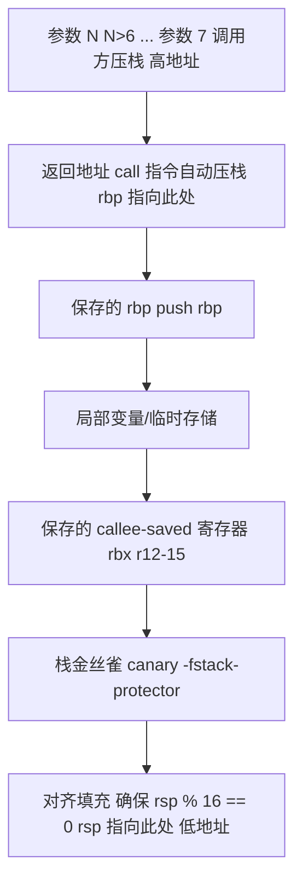

# 函数调用栈帧（Function Call Stack Frame）

## 前置知识

- [结构体与联合体](/c/044-StructAndUnion)：建议先完成前一篇的学习

## 学习目标

- 掌握「摘要」的核心机制、典型用法与常见陷阱
- 掌握「1. 历史动机与发展脉络」的核心机制、典型用法与常见陷阱
- 掌握「2. 形式化定义」的核心机制、典型用法与常见陷阱
- 掌握「3. 理论推导与原理解析」的核心机制、典型用法与常见陷阱
- 掌握「4. 代码示例」的核心机制、典型用法与常见陷阱


> "The stack is a data structure that has come to be accepted as a matter of course. We rarely think about how it works, or what life would be like without it. Yet the stack is the cornerstone of programming language implementation: it makes recursive procedures possible, it provides the mechanism for passing parameters and returning values, and it gives each procedure invocation its own private storage."
> —— Richard P. Draves, *The Use of Function Calls in Operating System Implementation*, CMU CS 1991

## 摘要

本文系统论述 C 语言函数调用栈帧（function call stack frame，简称 stack frame 或 activation record）的形式化定义、底层实现、跨架构差异与工程实践。栈帧是程序运行时调用栈（call stack）的基本组成单元，承载函数调用过程中必需的全部运行时上下文：实际参数（arguments）、返回地址（return address）、保存的寄存器（saved registers）、局部变量（local variables）与临时存储（temporaries）。理解栈帧机制是掌握 C 语言运行时行为、调试（debugging）、性能优化、安全防护（security hardening）与跨语言互操作（FFI）的核心前置知识。

本文对标 MIT 6.087（Practical Programming in C）、Stanford CS107（Programming Paradigms）、CMU 15-213（CSAPP Chapter 3: Machine-Level Representation of Programs）等海外名校课程教学水准，融合 ISO/IEC 9899:2024（C23）规范、System V Application Binary Interface AMD64 ABI、Itanium C++ ABI（同源于 C 栈帧算法）、Linux Kernel、glibc、SQLite、Redis、Nginx、DPDK 等真实工程案例，提供从形式化定义到生产级代码的完整路径。

---

## 1. 历史动机与发展脉络

### 1.1 栈式调用的史前时代

在调用栈（call stack）概念确立之前，早期高级语言（如 FORTRAN I, 1957）采用静态分配策略：每个子程序拥有固定的内存区域存储局部变量，递归调用直接被禁止。FORTRAN 66 标准明确不允许递归，因为静态分配无法区分不同调用深度的局部变量实例。

ALGOL 60（1960）首次引入块结构（block structure）与递归过程（recursive procedure），但具体实现方案留待编译器设计者。1960 年代出现了两种竞争性的实现策略：

1. **静态链（static chain）**：每个栈帧保存一个指向外层过程栈帧的指针，访问非局部变量时沿静态链查找。
2. **Display 表**：维护一个固定大小的指针数组，索引为词法嵌套深度，O(1) 访问非局部变量。

ALGOL 60 的实现促进了"栈式分配"（stack allocation）概念的形成：每次过程调用在栈上分配一块新内存，返回时释放。

### 1.2 PDP-11 与 C 语言的栈实现

Dennis Ritchie 在 1972 年将 C 语言移植到 PDP-11 时，PDP-11 的硬件特性深刻影响了 C 的调用约定：

- PDP-11 有 8 个 16 位通用寄存器（`R0`-`R7`），其中 `R6` 作为栈指针（`SP`），`R7` 作为程序计数器（`PC`）。
- PDP-11 的 `JSR`（Jump to Subroutine）指令自动将返回地址压入寄存器栈，`RTS`（Return from Subroutine）指令弹出返回地址。
- PDP-11 的栈向低地址增长，`SP` 在 `push` 时递减，`pop` 时递增。

K&R C 时代的调用约定（即后来的 cdecl）由此定型：

1. 参数从右到左压栈（使 `printf` 这样的变参函数可工作）。
2. 调用方负责清理栈（caller cleanup），支持变参函数。
3. 返回值存于 `R0`。
4. `R5` 寄存器作为帧指针（frame pointer），形成栈帧链表。

### 1.3 x86 与 cdecl/stdcall/fastcall 的分化

Intel 8086（1978）与 80386（1985）沿袭 PDP-11 的栈设计：栈向低地址增长，`ESP` 为栈指针，`EBP` 为帧指针。但 x86 时代的编译器厂商分化出多种调用约定：

| 调用约定 | 参数传递 | 栈清理 | 名称修饰 | 典型用途 |
| -------- | -------- | ------ | -------- | -------- |
| cdecl | 右到左入栈 | 调用方 | `_func` | C 默认，支持变参 |
| stdcall | 右到左入栈 | 被调用方 | `_func@N` | Windows API（Win32） |
| fastcall | ECX/EDX + 栈 | 被调用方 | `@func@N` | 性能敏感场景 |
| thiscall | ECX = this + 栈 | 被调用方 | C++ 名称修饰 | MSVC C++ 成员函数 |
| vectorcall | ECX/EDX + 向量寄存器 | 被调用方 | 复杂 | SIMD 优化 |

这种分化导致跨编译器、跨平台的二进制兼容性极差，催生了后来 ABI 标准化的需求。

### 1.4 RISC 架构与寄存器窗口

1980 年代的 RISC 革命引入了"寄存器窗口"（register window）概念，以减少函数调用时的内存访问：

- **SPARC**：实现重叠寄存器窗口（overlapping register window），每次函数调用切换到一组新的 16 个寄存器（8 in + 8 local + 8 out 共享给被调用方），仅在窗口耗尽时溢出到栈。这一设计将 C 函数调用的内存开销摊销到极少次调用上，但硬件复杂度高，最终未被业界广泛采纳。
- **MIPS**：放弃寄存器窗口，但引入"调用者保存"（caller-saved）与"被调用者保存"（callee-saved）寄存器划分：`$t0-$t9` 为临时寄存器（调用者保存），`$s0-$s7` 为保存寄存器（被调用者保存）。这一划分成为现代 RISC 的标配。
- **ARM**：早期 ARMv4/v5 采用类似 MIPS 的寄存器划分，`r0-r3` 为参数传递与返回值寄存器，`r4-r11` 为被调用者保存，`r13` 为栈指针，`r14` 为链接寄存器（lr），`r15` 为程序计数器。

寄存器窗口的失败经验与寄存器划分的成功实践，共同奠定了 x86_64 ABI 的设计基础。

### 1.5 x86_64 与 System V AMD64 ABI

AMD 在设计 x86_64（AMD64, 1999-2000）时大幅扩展寄存器数量：8 个通用寄存器扩展为 16 个（`rax`、`rbx`、`rcx`、`rdx`、`rsi`、`rdi`、`rbp`、`rsp`、`r8`-`r15`）。这为寄存器传参提供了硬件基础。

2003-2004 年间，AMD 与 Linux 社区共同制定了 System V AMD64 ABI（最新版本 v1.0 于 2018 年发布），规定了统一的调用约定：

1. **整数参数**：依次通过 `rdi`、`rsi`、`rdx`、`rcx`、`r8`、`r9` 传递，超出 6 个参数借助栈。
2. **浮点参数**：通过 `xmm0`-`xmm7` 传递，最多 8 个。
3. **返回值**：整数与指针通过 `rax`、`rdx` 返回；浮点通过 `xmm0`、`xmm1` 返回。
4. **栈对齐**：`call` 指令前 `rsp` 必须 16 字节对齐（即 `rsp % 16 == 0`，`call` 自动压入 8 字节返回地址后变为 `rsp % 16 == 8`）。
5. **被调用者保存寄存器**：`rbx`、`rbp`、`r12`-`r15`。
6. **变参函数**：需通过 `al` 寄存器告知使用了几个 XMM 寄存器。

Microsoft x64 ABI（用于 Windows）与 System V AMD64 ABI 类似但有差异：仅用 4 个寄存器传参（`rcx`、`rdx`、`r8`、`r9`），且预留 32 字节"shadow space"供被调用方保存寄存器参数。

### 1.6 ARMv8-A 与 AAPCS64

ARMv8-A（2011）引入 64 位 ARM 架构（AArch64），伴随新的过程调用标准 AAPCS64（ARM Architecture Procedure Call Standard, 64-bit）：

1. **参数寄存器**：`x0`-`x7` 传递整数与指针参数（最多 8 个），`v0`-`v7` 传递浮点参数。
2. **返回值**：`x0`（整数）、`v0`（浮点）。
3. **帧指针**：`x29`（FP），栈指针 `sp`，链接寄存器 `x30`（LR）。
4. **被调用者保存寄存器**：`x19`-`x28`、`x29`（FP）。
5. **栈对齐**：SP 必须 16 字节对齐。

AAPCS64 与 System V AMD64 ABI 设计哲学相近，但寄存器更多（31 个通用寄存器），传参效率更高。

### 1.7 RISC-V 与 RISC-V calling convention

RISC-V（2010 起）的调用约定延续 RISC 传统：

1. **参数寄存器**：`a0`-`a7`（即 `x10`-`x17`）传递参数与返回值（最多 8 个）。
2. **被调用者保存**：`s0`-`s11`（`x8`-`x9`、`x18`-`x27`）。
3. **栈指针**：`sp`（`x2`），帧指针 `fp`（`x8`/`s0`，可选）。
4. **返回地址**：`ra`（`x1`）。
5. **栈对齐**：16 字节对齐（RV64）。

### 1.8 C 标准对栈的"沉默"

值得注意的是，**ISO/IEC 9899 标准对调用栈的实现只字未提**。C 标准仅规定：

- 函数调用的语义（§6.5.2.2）。
- 局部变量的存储类为 `auto`，生命周期为所在块（§6.2.4）。
- 递归调用合法（§6.5.2.2¶5）。

栈帧、寄存器、调用约定等均为"实现定义"（implementation-defined）或"未指定"（unspecified）行为，由编译器、ABI、操作系统共同决定。这种"沉默"使 C 语言具有跨平台移植性，但程序员必须依赖平台文档（如 System V ABI）才能编写涉及栈布局的代码。

---

## 2. 形式化定义

### 2.1 调用栈的形式化模型

调用栈是一个 LIFO（Last-In-First-Out）数据结构，由一系列栈帧组成。形式化地，设 $S$ 为调用栈，$F_i$ 为第 $i$ 层栈帧：

$$
S = \langle F_0, F_1, \ldots, F_n \rangle
$$

其中 $F_0$ 为栈底（通常是 `main` 或线程入口函数的栈帧），$F_n$ 为栈顶（当前正在执行的函数栈帧）。每次函数调用执行 push 操作：

$$
S' = S \cup \langle F_{n+1} \rangle
$$

每次函数返回执行 pop 操作：

$$
S' = S \setminus \langle F_n \rangle
$$

### 2.2 栈帧的形式化定义

每个栈帧 $F$ 由以下字段组成：

$$
F = \langle \text{args}, \text{retaddr}, \text{saved\_fp}, \text{saved\_regs}, \text{locals}, \text{temps}, \text{canary} \rangle
$$

各字段含义：

- $\text{args}$：实际参数区。System V AMD64 ABI 中前 6 个整数参数通过寄存器传递，但被调用方若需要保存这些寄存器参数到栈上以使用寄存器或取地址，会在 prologue 中存储到此处。剩余参数由调用方压栈至此。
- $\text{retaddr}$：返回地址。由 `call` 指令自动压栈，指示函数返回后应执行的指令地址。
- $\text{saved\_fp}$：保存的帧指针。被调用方在 prologue 中保存调用方的帧指针，在 epilogue 中恢复。
- $\text{saved\_regs}$：被调用方保存的寄存器。callee-saved 寄存器若被使用，必须保存原值。
- $\text{locals}$：局部变量区。包含所有 `auto` 存储类的局部变量。
- $\text{temps}$：临时存储区。用于中间计算结果、复杂表达式求值等。
- $\text{canary}$：栈金丝雀（stack canary）。Stack Protector 机制在 $\text{retaddr}$ 与 $\text{locals}$ 之间插入的随机值，用于检测缓冲区溢出。

### 2.3 栈帧布局：System V AMD64 ABI

System V AMD64 ABI 规定的典型栈帧布局（栈向低地址增长）：



注意 System V AMD64 ABI 中"参数区"位于调用方的栈帧，被调用方通过 `rbp + 16` 偏移访问。被调用方可在自己的栈帧中预留空间保存寄存器参数（称为"home space"），但 ABI 不强制要求。

### 2.4 栈指针与帧指针的关系

设 $SP$ 为栈指针，$FP$ 为帧指针。在典型 prologue 后：

$$
FP = SP_{\text{after prologue}} = SP_{\text{before call}} - 8 - 8
$$

其中 `-8` 来自 `call` 压入的返回地址，`-8` 来自 `push rbp`。后续 `sub rsp, N` 进一步分配局部变量空间，但 $FP$ 保持不变，作为栈帧的稳定基准。

栈帧内任意位置的访问均以 $FP$ 为基准：

- 访问局部变量：$FP - \text{offset}$（offset > 0）。
- 访问参数：$FP + \text{offset}$（offset > 16，前 16 字节为 retaddr 与 saved_fp）。

### 2.5 调用约定的形式化定义

调用约定是一组规则集合，规定函数调用的下列方面：

1. **参数传递方式**：寄存器 vs 栈，顺序（左到右或右到左）。
2. **返回值传递方式**：寄存器 vs 栈，多个返回值的处理。
3. **寄存器保存职责**：caller-saved vs callee-saved 划分。
4. **栈清理职责**：caller cleanup（如 cdecl）vs callee cleanup（如 stdcall）。
5. **栈对齐要求**：通常 8 或 16 字节对齐。
6. **变参函数支持**：是否支持 `...` 形式参数。

形式化地，调用约定 $CC$ 是一个五元组：

$$
CC = \langle \text{Args}, \text{Ret}, \text{Save}, \text{Cleanup}, \text{Align} \rangle
$$

例如 System V AMD64 ABI：

$$
CC_{\text{SysV}} = \langle \text{[rdi, rsi, rdx, rcx, r8, r9] + 栈}, \text{rax + rdx}, \text{callee: [rbx, rbp, r12-r15]}, \text{caller}, 16 \rangle
$$

### 2.6 ABI 与调用约定的关系

ABI（Application Binary Interface）是比调用约定更广的概念，包含：

1. **调用约定**（calling convention）。
2. **数据类型大小与对齐**（type size & alignment）：`int` 4 字节、`long` 在 LP64 模型下 8 字节等。
3. **结构体布局算法**（struct layout algorithm）：成员对齐、填充、尾部填充。
4. **系统调用接口**（system call interface）：系统调用号、参数传递、返回值约定。
5. **异常处理表格式**（exception handling format）：如 DWARF CFI、`.eh_frame` 段。
6. **位置无关代码（PIC）的实现**：GOT/PLT 的布局与使用。
7. **TLS（Thread-Local Storage）的实现**：`fs:`/`gs:` 段基址寄存器的使用。

调用约定是 ABI 的子集，专注于函数调用层面。

---

## 3. 理论推导与原理解析

### 3.1 函数 prologue 的指令分解

考虑一个典型的 C 函数：

```c
int add(int a, int b) {
    int sum = a + b;
    return sum;
}
```

在 x86_64 + System V AMD64 ABI 下，`gcc -O0 -S` 生成的汇编大致为：

```asm
add:
    push    rbp                 ; 保存调用方的 rbp
    mov     rbp, rsp            ; 设置当前 rbp 为栈顶
    mov     DWORD PTR -20[rbp], edi  ; 保存参数 a（来自 edi）
    mov     DWORD PTR -24[rbp], esi  ; 保存参数 b（来自 esi）
    mov     edx, DWORD PTR -20[rbp]  ; 加载 a 到 edx
    mov     eax, DWORD PTR -24[rbp]  ; 加载 b 到 eax
    add     eax, edx            ; eax = a + b
    mov     DWORD PTR -8[rbp], eax   ; sum = eax
    mov     eax, DWORD PTR -8[rbp]   ; 返回值 = sum
    pop     rbp                 ; 恢复调用方 rbp
    ret                         ; 弹出返回地址并跳转
```

prologue 由三条指令构成：

1. `push rbp`：将调用方的帧指针压栈，`rsp` 减 8。
2. `mov rbp, rsp`：将当前栈顶设为新帧指针。
3. （可选）`sub rsp, N`：为局部变量分配 N 字节空间。

epilogue 对应：

1. `mov rsp, rbp`（或 `leave` 指令）：释放局部变量空间。
2. `pop rbp`：恢复调用方帧指针。
3. `ret`：弹出返回地址并跳转。

`leave` 指令是 `mov rsp, rbp; pop rbp` 的复合指令，单条指令完成 epilogue 前两步。

### 3.2 栈指针 16 字节对齐的由来

System V AMD64 ABI 要求 `call` 指令前 `rsp % 16 == 0`。这一规定的根源是 SSE/AVX 指令对 16/32 字节对齐的硬性要求：

- `movaps`（Move Aligned Packed Single-Precision）要求操作数 16 字节对齐，否则触发 `#GP`（General Protection Fault）。
- `vmovaps`（AVX 版本）要求 16 或 32 字节对齐。
- 编译器在函数内可能使用 `movaps` 保存 XMM 寄存器到栈上，需保证栈地址对齐。

考虑 `call` 指令会自动将 8 字节返回地址压栈，使 `rsp` 从 16 对齐变为 8 对齐。因此被调用方 prologue 中 `push rbp` 后 `rsp` 再次变为 16 对齐，后续 `sub rsp, N` 中 N 必须保持 16 字节对齐。

未对齐调用导致 `movaps` 触发段错误是初学者编写汇编时常遇到的陷阱：

```asm
; 错误：sub rsp, 8 破坏 16 对齐
push rbp
mov rbp, rsp
sub rsp, 8            ; rsp % 16 == 8，未对齐！
movaps [rsp], xmm0    ; 触发 SIGSEGV
```

### 3.3 帧指针链与栈回溯

帧指针链（frame pointer chain）是栈回溯（stack unwinding）的基础。每个栈帧的 $\text{saved\_fp}$ 字段保存调用方的 $FP$ 值，形成单链表：

$$
FP_{\text{current}} \to FP_{\text{caller}} \to FP_{\text{caller's caller}} \to \ldots \to FP_{\text{main}}
$$

栈回溯算法：

```c
void backtrace_fp(void) {
    void **fp = __builtin_frame_address(0);
    while (fp != NULL) {
        void *retaddr = fp[1];        // saved_fp 后续即返回地址
        printf("  %p\n", retaddr);
        fp = (void **)fp[0];          // saved_fp 指向上一个 fp
    }
}
```

此算法依赖 `rbp` 帧指针链完整。`-fomit-frame-pointer` 优化会破坏该链，此时需依赖 `.eh_frame` 段中的 DWARF CFI（Call Frame Information）进行栈回溯，`libunwind` 与 `gdb backtrace` 即采用此机制。

### 3.4 Stack Canary 的工作原理

Stack Protector（栈保护）机制由 IBM 的 Hiroaki Etoh 与 Sanjit Sengupta 于 1998 年在 GCC 中实现，对应编译选项 `-fstack-protector`。

工作原理：

1. **程序启动时**：从 `/dev/urandom` 或 `AT_RANDOM` auxv 读取随机值，存入 TLS（Thread-Local Storage）区域的 `__stack_chk_guard` 变量。
2. **函数 prologue 中**：从 `__stack_chk_guard` 读取 canary 值，存储到栈帧中 $\text{locals}$ 与 $\text{retaddr}$ 之间的位置。
3. **函数 epilogue 中**：比较栈上 canary 与 `__stack_chk_guard`，若不一致则调用 `__stack_chk_fail()` 终止程序。

典型汇编（GCC `-fstack-protector-strong`）：

```asm
; prologue
mov     rax, QWORD PTR fs:40           ; 从 TLS 读取 canary
mov     QWORD PTR -8[rbp], rax         ; 存入栈帧

; epilogue
mov     rax, QWORD PTR -8[rbp]         ; 读取栈上 canary
xor     rax, QWORD PTR fs:40           ; 与 TLS canary 异或
jne     .L5                            ; 不等则跳转至失败处理
leave
ret
.L5:
call    __stack_chk_fail               ; 终止程序
```

canary 值通常包含 `\0` 字节以阻断 `strcpy` 等字符串函数的越界写入（null 终止符会中止复制）。Linux glibc 中 `__stack_chk_guard` 低位 8 位固定为 `\0`。

### 3.5 Stack Canary 的局限性

Stack Canary 仅能检测"线性缓冲区溢出"覆盖返回地址的场景，对以下攻击无效：

1. **相邻局部变量覆盖**：若 `buf` 与 `secret_key` 同处栈帧且 `buf` 在前，溢出 `buf` 可直接修改 `secret_key` 而不触及 canary。
2. **函数指针覆盖**：覆盖栈上的函数指针，调用时跳转至攻击者地址。
3. **指针参数覆盖**：覆盖栈上的指针参数，使后续对该指针的写入重定向到任意地址。
4. **setjmp/longjmp 攻击**：`setjmp` 保存的寄存器集若被溢出覆盖，`longjmp` 时跳转至攻击者地址。

更现代的防护机制包括：

- **Shadow Stack（Intel CET）**：硬件维护独立的"影子栈"，仅存储返回地址，与数据栈物理隔离，`ret` 指令验证影子栈与数据栈返回地址一致。
- **IBT（Indirect Branch Tracking）**：要求间接跳转目标必须是 `endbr64` 指令，防止 ROP/JOP 攻击。
- **PAC（Pointer Authentication, ARMv8.3-A）**：指针高位存储加密签名，验证失败触发异常。

### 3.6 alloca 与 VLA 的栈分配机制

`alloca` 是 POSIX 函数，在调用方的栈帧中动态分配内存：

```c
#include <alloca.h>
void *alloca(size_t size);
```

实现机制：直接调整 `rsp`：

```asm
; alloca(N) 大致等价于：
mov     rax, N
add     rax, 15              ; 16 字节对齐
and     rax, -16
sub     rsp, rax             ; 调整栈指针
mov     rax, rsp             ; 返回值 = 新栈顶
```

特点：

1. **无需 `free`**：函数返回时栈指针自动恢复，内存自动释放。
2. **不初始化**：返回的内存未清零，包含先前栈帧的残留数据。
3. **失败时不返回 NULL**：栈空间不足时直接栈溢出，行为未定义（通常 SIGSEGV）。
4. **破坏帧指针链**：若 `alloca` 后再访问局部变量，编译器需通过 `rbp` 而非 `rsp` 访问，因为 `rsp` 已改变。

VLA（Variable-Length Array）的 C99 引入，本质与 `alloca` 相同，但作用域规则更严格：

```c
void func(int n) {
    int arr[n];               // VLA
    // ...
}                             // arr 在此处自动释放
```

C11 起 VLA 成为可选特性，`__STDC_NO_VLA__` 宏指示编译器不支持。Microsoft Visual C++ 历来不支持 VLA，是其与 GCC/Clang 的显著差异之一。

### 3.7 Tail Call Optimization（TCO）

尾调用（tail call）指函数末尾的最后一个动作是调用另一函数并直接返回其结果。此时被调用方的栈帧可复用调用方的栈帧，无需新建：

```c
int factorial(int n, int acc) {
    if (n == 0) return acc;
    return factorial(n - 1, n * acc);   // 尾调用
}
```

未优化时，递归调用 `factorial(10000, 1)` 需 10000 个栈帧，可能栈溢出。TCO 优化后，仅用 1 个栈帧：

```asm
; 未优化
factorial:
    push rbp
    mov rbp, rsp
    ; ...
    call factorial          ; 新建栈帧
    ; ...                  ; 使用返回值
    pop rbp
    ret

; TCO 优化
factorial:
    ; ...
    jmp factorial           ; 复用栈帧，直接跳转
```

C 编译器是否启用 TCO 取决于优化级别与代码语义：

- `-O2` 及以上通常启用 TCO。
- 若被调用方参数依赖调用方的局部变量地址（栈上），TCO 失效。
- System V AMD64 ABI 下，不同调用约定的函数不能 TCO（如 `cdecl` 调用 `stdcall`）。
- 变参函数不能作为尾调用目标。

---

## 4. 代码示例

### 4.1 基础示例：观察栈帧布局

```c
#include <stdio.h>
#include <stdint.h>

/**
 * 打印当前函数的栈帧地址信息
 * 演示栈向低地址增长、栈帧内布局等基础概念
 */
void inspect_stack(void) {
    int local_a = 0xAA;
    int local_b = 0xBB;
    int local_c = 0xCC;

    printf("=== 栈帧检查 ===\n");
    printf("&local_a = %p (value = 0x%X)\n", (void *)&local_a, local_a);
    printf("&local_b = %p (value = 0x%X)\n", (void *)&local_b, local_b);
    printf("&local_c = %p (value = 0x%X)\n", (void *)&local_c, local_c);

    /* 局部变量在栈上向低地址方向排列（GCC 默认行为） */
    printf("\n局部变量地址差（验证栈增长方向）：\n");
    printf("  &local_b - &local_a = %td\n", (char *)&local_b - (char *)&local_a);
    printf("  &local_c - &local_b = %td\n", (char *)&local_c - (char *)&local_b);
}

int main(void) {
    inspect_stack();
    return 0;
}
```

编译运行：

```bash
gcc -O0 -g stack_inspect.c -o stack_inspect
./stack_inspect
```

典型输出（地址因 ASLR 而异）：

```
=== 栈帧检查 ===
&local_a = 0x7ffeaa8b1a48 (value = 0xAA)
&local_b = 0x7ffeaa8b1a44 (value = 0xBB)
&local_c = 0x7ffeaa8b1a40 (value = 0xCC)

局部变量地址差（验证栈增长方向）：
  &local_b - &local_a = -4
  &local_c - &local_b = -4
```

### 4.2 进阶示例：观察 prologue 与 epilogue

```c
/**
 * 简单函数，用于观察 prologue/epilogue 汇编
 * 使用 volatile 防止编译器优化
 */
int simple_func(int a, int b) {
    volatile int local = a + b;
    return local;
}

int main(void) {
    volatile int result = simple_func(3, 4);
    return result & 0xFF;
}
```

生成汇编（AT&T 语法）：

```bash
gcc -O0 -S simple.c -o simple.s
cat simple.s
```

Intel 语法输出：

```bash
gcc -O0 -S -masm=intel simple.c -o simple_intel.s
```

观察 prologue（`push rbp; mov rbp, rsp`）与 epilogue（`pop rbp; ret`）的指令模式。

### 4.3 高级示例：手动栈回溯

```c
#define _GNU_SOURCE
#include <stdio.h>
#include <execinfo.h>
#include <signal.h>
#include <unistd.h>
#include <stdlib.h>

/**
 * 使用 glibc 的 backtrace() 进行栈回溯
 * backtrace() 内部依赖帧指针链或 .eh_frame 段
 */
void print_backtrace(void) {
    void *buffer[32];
    int nptrs = backtrace(buffer, 32);
    printf("backtrace() returned %d addresses:\n", nptrs);

    char **strings = backtrace_symbols(buffer, nptrs);
    if (strings == NULL) {
        perror("backtrace_symbols");
        exit(EXIT_FAILURE);
    }

    for (int j = 0; j < nptrs; j++) {
        printf("  [%d] %s\n", j, strings[j]);
    }
    free(strings);
}

/**
 * 基于帧指针的手动栈回溯（GCC 扩展）
 * 仅在 -fno-omit-frame-pointer 下可靠工作
 */
void manual_backtrace(void) {
    printf("\n=== 手动栈回溯 ===\n");
    void **fp = __builtin_frame_address(0);
    int depth = 0;

    while (fp != NULL && depth < 32) {
        /* fp[0] = 上一帧的 fp，fp[1] = 返回地址 */
        void *retaddr = fp[1];
        if (retaddr == NULL) break;

        printf("  [%d] retaddr = %p\n", depth, retaddr);

        /* 沿帧指针链向上遍历 */
        fp = (void **)fp[0];
        depth++;
    }
}

void level3(void) {
    print_backtrace();
    manual_backtrace();
}

void level2(void) { level3(); }
void level1(void) { level2(); }

int main(void) {
    level1();
    return 0;
}
```

### 4.4 生产级示例：自定义信号处理与栈溢出检测

```c
/**
 * 生产级栈溢出检测与处理示例
 * 功能：
 *   1. 使用 sigaltstack 设置备用信号栈
 *   2. 捕获 SIGSEGV/SIGBUS 信号
 *   3. 检测栈溢出并打印诊断信息
 * 编译：gcc -O2 -g stack_overflow.c -o stack_overflow -rdynamic
 */
#define _GNU_SOURCE
#include <stdio.h>
#include <stdlib.h>
#include <signal.h>
#include <unistd.h>
#include <execinfo.h>
#include <string.h>
#include <errno.h>
#include <sys/resource.h>
#include <sys/mman.h>

#define ALT_STACK_SIZE (SIGSTKSZ * 4)   /* 64 KiB 备用栈 */
#define BACKTRACE_MAX  64

static void *alt_stack_mem = NULL;

/**
 * 信号处理函数
 * 注意：信号处理函数中只能调用异步信号安全（async-signal-safe）函数
 * backtrace() 与 backtrace_symbols() 在 glibc 中是 async-signal-safe 的
 */
static void signal_handler(int sig, siginfo_t *si, void *ctx) {
    const char *sig_name = sig == SIGSEGV ? "SIGSEGV" :
                           sig == SIGBUS  ? "SIGBUS"  : "UNKNOWN";
    (void)fprintf(stderr, "\n[FATAL] Caught signal %d (%s)\n", sig, sig_name);
    (void)fprintf(stderr, "  si_addr = %p\n", si->si_addr);

    /* 检查是否为栈溢出 */
    void *fault_addr = si->si_addr;
    void *stack_top = NULL;
    size_t stack_size = 0;
    pthread_attr_t attr;
    if (pthread_getattr_np(pthread_self(), &attr) == 0) {
        pthread_attr_getstack(&attr, &stack_top, &stack_size);
        pthread_attr_destroy(&attr);
    }

    if (stack_top != NULL) {
        void *stack_bottom = (char *)stack_top + stack_size;
        (void)fprintf(stderr, "  stack range: [%p, %p) size = %zu KiB\n",
                      stack_top, stack_bottom, stack_size / 1024);
        if (fault_addr >= stack_top && fault_addr < stack_bottom) {
            (void)fprintf(stderr, "  >> 栈溢出嫌疑：故障地址位于栈范围\n");
        }
    }

    /* 打印栈回溯 */
    void *buffer[BACKTRACE_MAX];
    int nptrs = backtrace(buffer, BACKTRACE_MAX);
    (void)fprintf(stderr, "\nBacktrace (%d frames):\n", nptrs);
    backtrace_symbols_fd(buffer, nptrs, STDERR_FILENO);

    /* 恢复默认信号处理并重发信号以正常终止 */
    struct sigaction sa;
    memset(&sa, 0, sizeof(sa));
    sa.sa_handler = SIG_DFL;
    sigaction(sig, &sa, NULL);
    raise(sig);
}

/**
 * 安装信号处理器
 * 关键：使用 sigaltstack 避免栈溢出时信号处理递归崩溃
 */
static int install_signal_handlers(void) {
    /* 1. 分配备用信号栈 */
    alt_stack_mem = malloc(ALT_STACK_SIZE);
    if (alt_stack_mem == NULL) {
        perror("malloc alt stack");
        return -1;
    }

    stack_t ss;
    ss.ss_sp = alt_stack_mem;
    ss.ss_size = ALT_STACK_SIZE;
    ss.ss_flags = 0;
    if (sigaltstack(&ss, NULL) == -1) {
        perror("sigaltstack");
        return -1;
    }

    /* 2. 注册信号处理器 */
    struct sigaction sa;
    memset(&sa, 0, sizeof(sa));
    sa.sa_sigaction = signal_handler;
    sa.sa_flags = SA_SIGINFO | SA_ONSTACK | SA_NODEFER;
    sigemptyset(&sa.sa_mask);

    if (sigaction(SIGSEGV, &sa, NULL) == -1) {
        perror("sigaction SIGSEGV");
        return -1;
    }
    if (sigaction(SIGBUS, &sa, NULL) == -1) {
        perror("sigaction SIGBUS");
        return -1;
    }

    return 0;
}

/**
 * 触发栈溢出的递归函数
 */
static void recursive_overflow(int depth) {
    char padding[8192];   /* 每次消耗 8 KiB */
    padding[0] = (char)(depth & 0xFF);
    (void)padding[0];
    (void)fprintf(stderr, "depth = %d\n", depth);
    recursive_overflow(depth + 1);
}

/**
 * 演示触发栈溢出后的优雅处理
 */
int main(void) {
    if (install_signal_handlers() != 0) {
        return EXIT_FAILURE;
    }

    /* 显示当前栈大小限制 */
    struct rlimit rl;
    if (getrlimit(RLIMIT_STACK, &rl) == 0) {
        (void)fprintf(stderr, "Stack limit: soft=%zu KiB, hard=%zu KiB\n",
                      (size_t)rl.rlim_cur / 1024,
                      (size_t)rl.rlim_max / 1024);
    }

    (void)fprintf(stderr, "即将触发栈溢出...\n");
    recursive_overflow(0);

    return EXIT_SUCCESS;
}
```

### 4.5 生产级示例：CMake 构建配置

```cmake
# CMakeLists.txt - 栈分析示例项目
cmake_minimum_required(VERSION 3.16)
project(stack_frame_demo C)

set(CMAKE_C_STANDARD 11)
set(CMAKE_C_STANDARD_REQUIRED ON)
set(CMAKE_C_EXTENSIONS OFF)

# 调试信息
add_compile_options(-g -gdwarf-4 -fno-omit-frame-pointer)

# 栈保护
add_compile_options(-fstack-protector-strong)

# 警告
add_compile_options(-Wall -Wextra -Wpedantic -Wconversion)

# 优化级别（调试用 -O0，生产用 -O2）
if(CMAKE_BUILD_TYPE STREQUAL "Release")
    add_compile_options(-O2 -DNDEBUG)
else()
    add_compile_options(-O0)
endif()

# 目标
add_executable(stack_inspect stack_inspect.c)
add_executable(simple simple.c)
add_executable(backtrace_demo backtrace.c)
add_executable(stack_overflow stack_overflow.c)

# 链接 libpthread（pthread_getattr_np 需要）
target_link_libraries(stack_overflow PRIVATE pthread)

# 安装
install(TARGETS stack_inspect simple backtrace_demo stack_overflow
        DESTINATION bin)
```

### 4.6 生产级示例：Makefile 配置

```makefile
# Makefile - 栈分析示例项目
CC      := gcc
CFLAGS  := -std=c11 -g -gdwarf-4 -O0 -Wall -Wextra -Wpedantic \
           -fno-omit-frame-pointer -fstack-protector-strong
LDFLAGS := -rdynamic -lpthread

TARGETS := stack_inspect simple backtrace_demo stack_overflow

.PHONY: all clean install

all: $(TARGETS)

%: %.c
	$(CC) $(CFLAGS) $< -o $@ $(LDFLAGS)

clean:
	rm -f $(TARGETS)

install: all
	install -d $(DESTDIR)/usr/local/bin
	install -m 755 $(TARGETS) $(DESTDIR)/usr/local/bin/

# 调试目标：生成汇编
%.s: %.c
	$(CC) $(CFLAGS) -S $< -o $@

# 调试目标：生成 Intel 语法汇编
%.intel.s: %.c
	$(CC) $(CFLAGS) -S -masm=intel $< -o $@
```

### 4.7 生产级示例：跨架构栈帧检查

```c
/**
 * 跨架构获取当前栈指针
 * 用于在调试时快速检查栈地址范围
 */
#include <stdio.h>
#include <stdint.h>

static inline uintptr_t get_sp(void) {
#if defined(__x86_64__)
    uintptr_t sp;
    __asm__ volatile("mov %%rsp, %0" : "=r"(sp));
    return sp;
#elif defined(__i386__)
    uintptr_t sp;
    __asm__ volatile("mov %%esp, %0" : "=r"(sp));
    return sp;
#elif defined(__aarch64__)
    uintptr_t sp;
    __asm__ volatile("mov %0, sp" : "=r"(sp));
    return sp;
#elif defined(__arm__)
    uintptr_t sp;
    __asm__ volatile("mov %0, sp" : "=r"(sp));
    return sp;
#elif defined(__riscv) && (__riscv_xlen == 64)
    uintptr_t sp;
    __asm__ volatile("mv %0, sp" : "=r"(sp));
    return sp;
#else
    return 0;
#endif
}

static inline uintptr_t get_fp(void) {
#if defined(__x86_64__)
    uintptr_t fp;
    __asm__ volatile("mov %%rbp, %0" : "=r"(fp));
    return fp;
#elif defined(__i386__)
    uintptr_t fp;
    __asm__ volatile("mov %%ebp, %0" : "=r"(fp));
    return fp;
#elif defined(__aarch64__)
    uintptr_t fp;
    __asm__ volatile("mov %0, x29" : "=r"(fp));
    return fp;
#elif defined(__arm__)
    uintptr_t fp;
    __asm__ volatile("mov %0, r11" : "=r"(fp));
    return fp;
#elif defined(__riscv) && (__riscv_xlen == 64)
    uintptr_t fp;
    __asm__ volatile("mv %0, s0" : "=r"(fp));
    return fp;
#else
    return 0;
#endif
}

int main(void) {
    printf("当前架构栈指针 SP = 0x%016lX\n", (unsigned long)get_sp());
    printf("当前架构帧指针 FP = 0x%016lX\n", (unsigned long)get_fp());
    printf("栈帧大小（FP - SP）= %ld bytes\n",
           (long)(get_fp() - get_sp()));
    return 0;
}
```

---

## 5. 对比分析

### 5.1 跨架构栈帧布局对比

| 架构 | 栈增长方向 | 栈指针寄存器 | 帧指针寄存器 | 返回地址寄存器 | 默认栈对齐 |
| ---- | ---------- | ------------ | ------------ | -------------- | ---------- |
| x86 (i386) | 向下 | `esp` | `ebp` | 栈上（`call` 压栈） | 4 字节（System V）/ 16 字节（现代） |
| x86_64 | 向下 | `rsp` | `rbp` | 栈上（`call` 压栈） | 16 字节（System V AMD64 ABI） |
| ARMv7-A | 向下 | `sp` (`r13`) | `r11` (`fp`) | `lr` (`r14`)，`bl` 写入 | 8 字节（AAPCS） |
| ARMv8-A (AArch64) | 向下 | `sp` | `x29` (`fp`) | `x30` (`lr`)，`bl` 写入 | 16 字节（AAPCS64） |
| RISC-V (RV64) | 向下 | `sp` (`x2`) | `s0`/`fp` (`x8`) | `ra` (`x1`)，`jal` 写入 | 16 字节 |
| MIPS | 向下 | `$sp` (`$29`) | `$fp` (`$30`) | `$ra` (`$31`)，`jal` 写入 | 8 字节 |
| SPARC | 向下 | `%sp`/`%o6` | `%fp`/`%i6` | 寄存器窗口 | 8 字节 |
| LoongArch | 向下 | `$sp` (`$r3`) | `$fp` (`$r22`) | `$ra` (`$r1`) | 16 字节 |

### 5.2 调用约定对比（x86_64）

| 调用约定 | 整数参数寄存器 | 浮点参数寄存器 | 栈清理 | 栈对齐 | 平台 |
| -------- | -------------- | -------------- | ------ | ------ | ---- |
| System V AMD64 | `rdi, rsi, rdx, rcx, r8, r9` | `xmm0-xmm7` | 调用方 | 16 字节 | Linux, macOS, BSD |
| Microsoft x64 | `rcx, rdx, r8, r9` | `xmm0-xmm3` | 调用方 | 16 字节 | Windows |
| Vectorcall | `rcx, rdx, r8, r9` + 向量 | `xmm0-xmm5` + 向量 | 调用方 | 16 字节 | Windows（SIMD 优化） |
| cdecl (x86) | 无，全栈传参 | 无 | 调用方 | 4 字节 | x86 传统 |
| stdcall (x86) | 无，全栈传参 | 无 | 被调用方 | 4 字节 | Windows API |

### 5.3 callee-saved 寄存器对比

| ABI | callee-saved 寄存器 | caller-saved 寄存器 |
| --- | ------------------ | ------------------ |
| System V AMD64 | `rbx, rbp, r12, r13, r14, r15` | `rax, rcx, rdx, rsi, rdi, r8-r11` |
| Microsoft x64 | `rbx, rbp, rdi, rsi, r12-r15, xmm6-xmm15` | `rax, rcx, rdx, r8-r11, xmm0-xmm5` |
| AAPCS (ARMv7) | `r4-r11, r13(sp), r14(lr)` | `r0-r3, r12(ip)` |
| AAPCS64 (ARMv8) | `x19-x28, x29(fp), x30(lr), sp` | `x0-x18` |
| RISC-V | `s0-s11, sp, ra` | `t0-t6, a0-a7` |

### 5.4 跨语言栈帧兼容性

不同语言在调用 C 函数时的栈帧兼容性：

| 语言 | 调用约定 | 栈帧兼容性 |
| ---- | -------- | ---------- |
| C/C++ | System V AMD64 ABI | 原生 |
| Rust | System V AMD64 ABI（`extern "C"`） | 兼容 |
| Go | 自定义 Go ABI（栈可增长） | **不兼容**，需通过 `cgo` 桥接 |
| Swift | Swift ABI（基于 C ABI 扩展） | 兼容 C ABI |
| Java (JNI) | System V AMD64 ABI | 通过 JNI 桥接 |
| Python (ctypes) | System V AMD64 ABI | 通过 `libffi` 动态调用 |
| Node.js N-API | System V AMD64 ABI | 通过 V8 FFI |

Go 语言的栈是可增长的（growable stack），运行时可能复制整个栈到新位置，这与 C 的固定栈假设冲突，是 `cgo` 调用开销大的根本原因。

---

## 6. 常见陷阱与最佳实践

### 6.1 陷阱：返回栈上局部变量的地址

```c
/**
 * UB（Undefined Behavior）示例
 * 返回栈上局部变量地址，调用方解引用悬垂指针
 */
int *dangling_pointer(void) {
    int local = 42;
    return &local;   /* UB: 局部变量在函数返回后生命周期结束 */
}

int main(void) {
    int *p = dangling_pointer();
    /* *p 是 UB，可能返回 42、随机值或崩溃 */
    printf("%d\n", *p);
    return 0;
}
```

修复：使用 `static`、堆分配或由调用方传入缓冲区。

### 6.2 陷阱：未对齐的栈访问

```asm
; 手写汇编时常见的对齐错误
my_func:
    push rbp
    mov rbp, rsp
    sub rsp, 8          ; rsp % 16 == 8，破坏对齐！
    movaps [rsp], xmm0  ; SIGSEGV
    add rsp, 8
    pop rbp
    ret
```

修复：`sub rsp, N` 中 N 必须保持 16 字节对齐。

### 6.3 陷阱：`alloca` 失败时的未定义行为

```c
#include <alloca.h>

void risky_alloca(size_t n) {
    /* alloca 不返回 NULL，失败时栈溢出，UB */
    char *buf = alloca(n);
    /* 若 n 极大，可能直接 SIGSEGV */
    buf[0] = 'x';
}
```

最佳实践：限制 `alloca` 大小，超大分配改用 `malloc`。

### 6.4 陷阱：信号处理函数中的栈操作

```c
/**
 * 错误：信号处理函数中使用非 async-signal-safe 函数
 */
void bad_handler(int sig) {
    printf("Signal %d\n", sig);   /* printf 非异步信号安全 */
    char buf[1024];
    snprintf(buf, sizeof(buf), "..."); /* snprintf 也不安全 */
}
```

修复：仅调用 `write()`、`_exit()` 等 async-signal-safe 函数。

### 6.5 陷阱：递归过深导致栈溢出

```c
/**
 * 错误：未优化的递归 factorial(100000) 会栈溢出
 */
long factorial_naive(int n) {
    if (n <= 1) return 1;
    return n * factorial_naive(n - 1);   /* 非尾递归，无法 TCO */
}

/**
 * 修复：尾递归版本，可被 TCO 优化为迭代
 */
long factorial_tail(int n, long acc) {
    if (n <= 1) return acc;
    return factorial_tail(n - 1, n * acc);   /* 尾递归 */
}
```

### 6.6 陷阱：变参函数与栈布局

```c
#include <stdarg.h>

/**
 * 变参函数依赖栈布局访问后续参数
 * System V AMD64 ABI 要求变参函数通过 al 寄存器告知使用了几 个 XMM 寄存器
 */
int sum_varargs(int count, ...) {
    va_list args;
    va_start(args, count);
    int total = 0;
    for (int i = 0; i < count; i++) {
        total += va_arg(args, int);
    }
    va_end(args);
    return total;
}
```

陷阱：错误地传递 `float` 给 `%d` 格式符，或反之，会导致栈布局错位，行为未定义。

### 6.7 陷阱：内联汇编破坏帧指针链

```c
/**
 * 错误：内联汇编破坏 rbp，导致栈回溯失败
 */
void bad_inline_asm(void) {
    __asm__ volatile(
        "mov $0, %%rbp\n\t"   /* 破坏 rbp！ */
        : : : "rbp"
    );
}
```

修复：避免在内联汇编中修改 `rbp`，或在 clobber 列表中声明并保存恢复。

### 6.8 陷阱：线程栈大小不足

```c
#include <pthread.h>

void *thread_func(void *arg) {
    char big_buf[1024 * 1024];   /* 1 MiB 栈上分配 */
    /* ... */
    return NULL;
}

int main(void) {
    pthread_t tid;
    /* 错误：默认线程栈可能仅 8 MiB，多个大栈线程会耗尽虚拟地址空间 */
    pthread_create(&tid, NULL, thread_func, NULL);
    pthread_join(tid, NULL);
    return 0;
}
```

修复：使用 `pthread_attr_setstacksize` 显式设置栈大小，或将大对象移至堆。

### 6.9 最佳实践总结

1. **启用栈保护**：编译时使用 `-fstack-protector-strong` 或 `-fstack-protector-all`。
2. **保留帧指针**：调试构建使用 `-fno-omit-frame-pointer`，便于 `gdb backtrace`。
3. **限制栈使用**：单函数栈上分配不超过 4 KiB，超大对象使用堆。
4. **避免深度递归**：超过 1000 层的递归应改写为迭代或显式栈模拟。
5. **谨慎使用 VLA/alloca**：仅在大小可控时使用，绝不接受外部未校验的输入作为大小。
6. **正确设置信号栈**：使用 `sigaltstack` 避免栈溢出时信号处理递归崩溃。
7. **跨语言 FFI 时核对 ABI**：确保双方调用约定一致（如 `extern "C"` 与 System V AMD64 ABI）。

---

## 7. 工程实践

### 7.1 调试工具链

| 工具 | 用途 | 示例命令 |
| ---- | ---- | -------- |
| `gdb` | 调试器，检查栈帧 | `gdb ./prog` → `backtrace` / `info frame` |
| `lldb` | LLVM 调试器 | `lldb ./prog` → `bt` / `frame info` |
| `perf` | 性能分析，调用栈采样 | `perf record -g ./prog` → `perf report` |
| `valgrind` | 内存检查，含栈分析 | `valgrind --tool=memcheck ./prog` |
| `pahole` | 分析 struct 与栈布局 | `pahole -C struct_name ./prog` |
| `objdump` | 反汇编 | `objdump -d ./prog` |
| `readelf` | 读取 ELF 信息（含 `.eh_frame`） | `readelf -wf ./prog` |
| `addr2line` | 地址转源码行 | `addr2line -e ./prog 0x401234` |
| `eu-stack` | elfutils 栈回溯工具 | `eu-stack -p PID` |
| `libunwind` | 编程式栈回溯库 | `unw_backtrace()` |

### 7.2 编译选项

栈相关的 GCC/Clang 编译选项：

| 选项 | 作用 | 推荐 |
| ---- | ---- | ---- |
| `-fstack-protector` | 启用栈保护（仅含字符数组的函数） | 基础 |
| `-fstack-protector-strong` | 启用栈保护（更严格判定） | 推荐 |
| `-fstack-protector-all` | 启用栈保护（所有函数） | 极致安全 |
| `-fno-stack-protector` | 禁用栈保护 | 性能极致场景 |
| `-fomit-frame-pointer` | 省略帧指针 | 性能优化（调试不便） |
| `-fno-omit-frame-pointer` | 保留帧指针 | 调试推荐 |
| `-fstack-clash-protection` | 启用 Stack Clash 防护 | 安全推荐 |
| `-fcf-protection` | 启用 CET 控制流保护 | 安全推荐（x86） |
| `-fstack-usage` | 输出每个函数栈使用量 | 分析 |
| `-Wstack-usage=N` | 警告栈使用超过 N 字节 | 静态检查 |
| `-Wframe-larger-than=N` | 警告栈帧大于 N 字节 | Linux Kernel 常用 |

### 7.3 静态分析与 Sanitizer

| 工具 | 作用 |
| ---- | ---- |
| AddressSanitizer (ASan) | 内存错误检测，含栈缓冲区溢出 |
| UndefinedBehaviorSanitizer (UBSan) | UB 检测，含返回栈地址等 |
| ThreadSanitizer (TSan) | 数据竞争检测 |
| MemorySanitizer (MSan) | 未初始化内存读取检测 |
| clang-tidy | 静态分析，含栈相关检查 |
| `cppcheck` | 静态分析 |

启用 ASan 检测栈溢出：

```bash
gcc -fsanitize=address -g -O0 program.c -o program
./program
```

### 7.4 CI/CD 集成

GitHub Actions 示例（栈保护检查）：

```yaml
name: Stack Safety Check
on: [push, pull_request]

jobs:
  stack-check:
    runs-on: ubuntu-latest
    steps:
      - uses: actions/checkout@v4
      - name: Compile with stack protections
        run: |
          gcc -std=c11 -g -O2 \
            -fstack-protector-strong \
            -fstack-clash-protection \
            -fcf-protection \
            -D_FORTIFY_SOURCE=2 \
            -fno-omit-frame-pointer \
            -Wall -Wextra -Wpedantic \
            -Wstack-usage=4096 \
            -c src/*.c
      - name: Run with ASan
        run: |
          gcc -fsanitize=address -g -O1 src/*.c -o test_asan
          ./test_asan
      - name: Run with UBSan
        run: |
          gcc -fsanitize=undefined -g -O1 src/*.c -o test_ubsan
          ./test_ubsan
```

---

## 8. 案例研究

### 8.1 Linux Kernel：`DECLARE_TASK_STACK` 与栈审计

Linux Kernel 中每个线程拥有独立的内核栈（通常 8 KiB 或 16 KiB）。为防止栈溢出，内核引入多项机制：

1. **`STACK_SIZE` 宏**：定义内核栈大小，可在编译时调整。
2. **`check_stack_usage()`**：定期检查栈使用量，输出 `/proc/sys/kernel/stack_max_usage`。
3. **`CONFIG_VMAP_STACK`**：将内核栈分配在 vmalloc 区，配合 guard page 检测溢出。
4. **`CONFIG_STACKPROTECTOR`**：启用 GCC `-fstack-protector-strong`。
5. **`-Wframe-larger-than=1024`**：编译时警告栈帧超过 1024 字节的函数。

源码示例（`arch/x86/kernel/process.c`）：

```c
void __init fork_init(void) {
    /* ... */
    /* 设置内核栈大小 */
    thread_stack_cache_init();
}

void check_stack_usage(void) {
    static DEFINE_SPINLOCK(lock);
    static long max_stack;
    unsigned long stack_top = ...;
    unsigned long stack_bottom = ...;
    long current_usage = stack_top - stack_bottom;

    if (current_usage > max_stack) {
        spin_lock(&lock);
        if (current_usage > max_stack) {
            max_stack = current_usage;
            printk(KERN_INFO "stack: new max = %ld bytes\n", max_stack);
        }
        spin_unlock(&lock);
    }
}
```

### 8.2 glibc：`__stack_chk_guard` 实现

glibc 在 `csu/libc-start.c` 中初始化 canary 值：

```c
/* 简化版 */
uintptr_t __stack_chk_guard;

void __libc_start_main(...) {
    /* 从 AT_RANDOM auxv 读取 16 字节随机值 */
    uintptr_t canary;
    if (random_data) {
        canary = *(uintptr_t *)random_data;
    } else {
        canary = (uintptr_t)&canary ^ 0x...;   /* 回退方案 */
    }
    /* 强制最低字节为 0，阻断 strcpy 等 */
    canary &= ~(uintptr_t)0xFF;
    __stack_chk_guard = canary;

    /* ... */
}

void __stack_chk_fail(void) {
    __fortify_fail("stack smashing detected");
}
```

TLS 中 `__stack_chk_guard` 通过 `fs:40` 偏移访问（x86_64），保证每线程独立 canary。

### 8.3 SQLite：`sqlite3StackAlloc` 与栈管理

SQLite 在 VDBE（Virtual Database Engine）中使用栈式分配：

```c
/* 简化版 */
typedef struct VdbeFrame VdbeFrame;
struct VdbeFrame {
    Vdbe *v;
    VdbeFrame *parent;     /* 父帧，形成栈链 */
    int pc;
    int nOp;
    /* ... */
};

VdbeFrame *sqlite3VdbeFramePush(Vdbe *p) {
    VdbeFrame *pFrame = sqlite3Malloc(sizeof(VdbeFrame));
    pFrame->parent = p->pFrame;
    p->pFrame = pFrame;
    return pFrame;
}

void sqlite3VdbeFramePop(Vdbe *p) {
    VdbeFrame *pFrame = p->pFrame;
    p->pFrame = pFrame->parent;
    sqlite3Free(pFrame);
}
```

这是 C 程序中"手动实现栈帧"的经典案例，用于递归触发器（recursive trigger）支持。

### 8.4 Redis：协程与栈切换

Redis 4.0+ 引入模块系统，模块可注册阻塞命令，内部通过协程（co-routine）切换栈：

```c
/* 简化版 */
typedef struct RedisModuleCtx {
    void *stack_backup;
    /* ... */
} RedisModuleCtx;

void *RM_SaveThreadStack(RedisModuleCtx *ctx) {
    /* 保存当前栈寄存器 */
    void *sp = __builtin_frame_address(0);
    ctx->stack_backup = sp;
    return sp;
}

void RM_RestoreThreadStack(RedisModuleCtx *ctx) {
    /* 恢复栈寄存器 */
    /* 实际实现涉及 ucontext 或自定义汇编 */
}
```

### 8.5 Nginx：异步非阻塞与栈深度

Nginx 使用异步非阻塞模型，每个连接复用 worker 进程的栈，无需为每个连接分配独立栈。但模块开发需注意：

1. **避免阻塞调用**：阻塞会占用整个 worker。
2. **限制递归深度**：配置解析等场景的递归需限制深度。
3. **`ngx_palloc` 池分配**：替代 `malloc`，栈上分配极少。

```c
/* nginx/src/core/ngx_palloc.c */
void *ngx_palloc(ngx_pool_t *pool, size_t size) {
    /* 从内存池分配，避免频繁 malloc */
    if (size <= pool->max) {
        return ngx_palloc_small(pool, size, 1);
    }
    return ngx_palloc_large(pool, size);
}
```

### 8.6 DPDK：`rte_eal_remote_launch` 与每核栈

DPDK（Data Plane Development Kit）为每个 CPU 核心分配独立栈：

```c
/* 简化版 */
int rte_eal_remote_launch(lcore_function_t *f, void *arg, unsigned slave_id) {
    struct rte_config *cfg = rte_eal_get_configuration();
    struct lcore_config *lc = &lcore_config[slave_id];

    /* 设置栈大小（通常 2 MiB，huge page） */
    pthread_attr_t attr;
    pthread_attr_init(&attr);
    pthread_attr_setstack(&attr, lc->stack_base, lc->stack_size);

    pthread_create(&lc->thread_id, &attr, eal_thread_loop, lc);
    /* ... */
}
```

DPDK 使用 huge page 作为栈，减少 TLB miss，提升性能。

---

### 填空题知识点讲解

**题目 4**：在 x86_64 上，`call func` 指令执行两步原子操作：将 _______ 压入栈，然后跳转至 `func`。

**解析讲解**：返回地址（return address，即 `call` 指令下一条指令的地址）

---

**题目 5**：System V AMD64 ABI 中，整数参数前 6 个依次通过 _______ 寄存器传递。

**解析讲解**：`rdi, rsi, rdx, rcx, r8, r9`

---

**题目 6**：ARMv8-A 中，帧指针寄存器是 _______，链接寄存器是 _______。

**解析讲解**：`x29`（FP），`x30`（LR）

---

### 编程题知识点讲解

**题目 7**：实现一个函数 `void print_stack_frame_info(void)`，打印当前栈帧的：
1. 栈指针（SP）值
2. 帧指针（FP）值
3. 返回地址
4. 调用方的帧指针

**解析讲解**：

```c
#include <stdio.h>
#include <stdint.h>

void print_stack_frame_info(void) {
    /* 使用 GCC 内建函数获取帧信息 */
    void **fp = __builtin_frame_address(0);

    /* 当前栈指针：通过 fp 估算（实际 SP 在 fp 下方） */
    uintptr_t sp;
    __asm__ volatile("mov %%rsp, %0" : "=r"(sp));

    uintptr_t fp_val = (uintptr_t)fp;
    void *retaddr = fp[1];            /* 返回地址 */
    void *caller_fp = fp[0];          /* 调用方 FP */

    printf("=== Stack Frame Info ===\n");
    printf("  SP        = 0x%016lX\n", (unsigned long)sp);
    printf("  FP        = 0x%016lX\n", (unsigned long)fp_val);
    printf("  Return    = %p\n", retaddr);
    printf("  Caller FP = %p\n", caller_fp);
    printf("  Frame size (FP - SP) = %ld bytes\n",
           (long)(fp_val - sp));
}

int main(void) {
    print_stack_frame_info();
    return 0;
}
```

编译：`gcc -O0 -fno-omit-frame-pointer -g frame_info.c -o frame_info`

---

**题目 8**：实现一个尾递归优化的斐波那契数列计算函数，确保在 `-O2` 下不会栈溢出。

**解析讲解**：

```c
#include <stdio.h>
#include <stdint.h>

/**
 * 尾递归辅助函数
 * acc1 = fib(n-1), acc2 = fib(n-2)
 */
uint64_t fib_tail(uint64_t n, uint64_t acc1, uint64_t acc2) {
    if (n == 0) return acc2;
    if (n == 1) return acc1;
    return fib_tail(n - 1, acc1 + acc2, acc1);
}

uint64_t fibonacci(uint64_t n) {
    return fib_tail(n, 1, 0);
}

int main(void) {
    for (uint64_t i = 0; i < 100; i++) {
        printf("fib(%lu) = %lu\n", i, fibonacci(i));
    }
    return 0;
}
```

验证 TCO：`gcc -O2 -S fib.c -o fib.s`，检查 `fib_tail` 中是否为 `jmp` 而非 `call`。

---

### 11.1 书籍

- **《Computer Systems: A Programmer's Perspective, 3rd ed.》** — Randal E. Bryant, David R. O'Hallaron
  - 第 3 章"Machine-Level Representation of Programs"详细论述 x86_64 栈帧、调用约定、过程调用。
- **《Computer Architecture: A Quantitative Approach, 6th ed.》** — John L. Hennessy, David A. Patterson
  - 附录 A"Instruction Set Principles"包含 RISC 与 CISC 栈设计的对比。
- **《Linkers and Loaders》** — John R. Levine
  - 第 7 章"Dynamic Linking and Loading"涉及 PIC 与栈帧相对寻址。
- **《Expert C Programming: Deep C Secrets》** — Peter van der Linden
  - 第 6 章"Runtime Data Structures"生动讲解栈帧与活动记录。
- **《The Art of Assembly Language, 2nd ed.》** — Randall Hyde
  - 详细论述 x86 汇编与调用约定的配合。

### 11.2 课程

- **MIT 6.087: Practical Programming in C** (MIT OpenCourseWare)
  - 第 6 章"Functions and Program Structure"涵盖栈帧基础。
- **Stanford CS107: Programming Paradigms** (Stanford Continuing Studies)
  - 第 2-3 讲详细展示 C 栈帧、`alloca`、函数指针的底层实现。
- **CMU 15-213: Introduction to Computer Systems** (CSAPP)
  - 第 3 章"Machine-Level Representation of Programs"是栈帧教学的标准参考。
- **UC Berkeley CS61C: Great Ideas in Computer Architecture**
  - 第 7-8 讲涵盖 MIPS 与 RISC-V 调用约定、栈帧实现。
- **MIT 6.172: Performance Engineering of Software Systems**
  - 多个讲座涉及栈对齐、缓存行对齐、TCO 等性能优化议题。

### 11.4 开源项目

- **Linux Kernel**：`arch/x86/kernel/entry_64.S`、`arch/x86/kernel/process.c` — 内核栈管理。
- **glibc**：`csu/libc-start.c`、`debug/stack_chk_fail.c` — Stack Canary 实现。
- **libunwind**：https://github.com/libunwind/libunwind — 跨平台栈回溯库。
- **gperftools**：https://github.com/gperftools/gperftools — 性能分析含栈采样。
- **DPDK**：https://www.dpdk.org/ — 高性能网络栈，含每核栈管理。

### 11.5 标准与规范

- **ISO/IEC 9899:2024 (C23)** — C 语言标准。
- **ISO/IEC 2360:2022 (RISC-V ABI)** — RISC-V 调用约定。
- **DWARF 5** — 调试信息格式，含 CFI（Call Frame Information）。
- **ELF Format Specification** — 可执行与可链接格式，含 `.eh_frame` 段定义。

---

## 附录 A：栈帧相关术语表

| 术语 | 英文 | 解释 |
| ---- | ---- | ---- |
| 栈帧 | Stack Frame / Activation Record | 函数调用在栈上分配的内存区域 |
| 帧指针 | Frame Pointer (FP) | 指向当前栈帧基准的寄存器 |
| 栈指针 | Stack Pointer (SP) | 指向当前栈顶的寄存器 |
| 返回地址 | Return Address | 函数返回后应执行的指令地址 |
| 序言 | Prologue | 函数开头的指令序列，建立栈帧 |
| 尾声 | Epilogue | 函数结尾的指令序列，销毁栈帧 |
| 调用约定 | Calling Convention | 函数调用的规则集合 |
| 应用二进制接口 | Application Binary Interface (ABI) | 二进制兼容性规范 |
| 栈金丝雀 | Stack Canary | 检测栈溢出的随机值 |
| 栈溢出 | Stack Overflow | 栈使用超出限制 |
| 栈展开 | Stack Unwinding | 遍历调用栈的过程 |
| 叶子函数 | Leaf Function | 不调用其他函数的函数 |
| 尾调用优化 | Tail Call Optimization (TCO) | 复用栈帧的尾调用优化 |
| 地址空间布局随机化 | Address Space Layout Randomization (ASLR) | 内存布局随机化 |
| 数据执行保护 | Data Execution Prevention (DEP/NX) | 禁止栈执行 |
| 影子栈 | Shadow Stack | 硬件隔离的返回地址栈 |
| 控制流完整性 | Control-Flow Integrity (CFI) | 控制流劫持防护 |
| 指针认证 | Pointer Authentication (PAC) | ARM 指针签名机制 |

## 附录 B：栈帧指令速查

### B.1 x86_64 栈帧指令

| 指令 | 作用 | 等价操作 |
| ---- | ---- | ---- |
| `push rax` | 压栈 | `sub rsp, 8; mov [rsp], rax` |
| `pop rax` | 弹栈 | `mov rax, [rsp]; add rsp, 8` |
| `call func` | 调用函数 | `push rip+n; jmp func` |
| `ret` | 返回 | `pop tmp; jmp tmp` |
| `enter N, 0` | 建立栈帧 | `push rbp; mov rbp, rsp; sub rsp, N` |
| `leave` | 销毁栈帧 | `mov rsp, rbp; pop rbp` |

### B.2 ARMv8-A 栈帧指令

| 指令 | 作用 |
| ---- | ---- |
| `str x29, [sp, #-16]!` | 保存 FP 并分配栈空间 |
| `mov x29, sp` | 设置 FP |
| `stp x29, x30, [sp, #-16]!` | 同时保存 FP 与 LR |
| `ldp x29, x30, [sp], #16` | 同时恢复 FP 与 LR |
| `bl func` | 跳转并保存返回地址到 x30 |
| `ret` | 跳转到 x30（默认） |

### B.3 RISC-V 栈帧指令

| 指令 | 作用 |
| ---- | ---- |
| `addi sp, sp, -16` | 分配栈空间 |
| `sd ra, 8(sp)` | 保存返回地址 |
| `sd s0, 0(sp)` | 保存 FP |
| `addi s0, sp, 16` | 设置 FP |
| `sd s0, 0(sp)` | 保存 FP |
| `ld ra, 8(sp)` | 恢复返回地址 |
| `ld s0, 0(sp)` | 恢复 FP |
| `addi sp, sp, 16` | 释放栈空间 |
| `jal ra, func` | 跳转并保存返回地址到 ra |
| `ret` | 跳转到 ra |

## 附录 C：栈大小限制速查

| 平台 | 默认主线程栈 | 默认 pthread 栈 | 调整方式 |
| ---- | ------------ | -------------- | -------- |
| Linux | 8 MiB | 8 MiB | `ulimit -s` / `pthread_attr_setstacksize` |
| Windows | 1 MiB | 1 MiB | 链接器 `/STACK:size` / `pthread_attr_setstacksize` |
| macOS | 8 MiB | 512 KiB | `ulimit -s` / `pthread_attr_setstacksize` |
| FreeBSD | 512 MiB | 1 MiB | `ulimit -s` / `pthread_attr_setstacksize` |
| Linux Kernel | 8/16 KiB | N/A | `CONFIG_THREAD_SIZE` |
| Embedded RTOS | 通常 1-4 KiB | N/A | 链接器脚本配置 |

## 附录 D：栈保护机制对比

| 机制 | 引入时间 | 防护范围 | 性能开销 | 硬件需求 |
| ---- | -------- | -------- | -------- | -------- |
| Stack Canary | 1998 (GCC) | 返回地址覆盖 | ~1-2% | 无 |
| ASLR | 2001 (OpenBSD) | 整体布局随机化 | 几乎为 0 | MMU |
| DEP/NX | 2003 (AMD64) | 栈不可执行 | 几乎为 0 | NX bit |
| Shadow Stack (CET) | 2020 (Intel Tiger Lake) | 返回地址劫持 | <1% | Intel CET |
| IBT (CET) | 2020 (Intel) | 间接跳转劫持 | <1% | Intel CET |
| PAC (ARMv8.3-A) | 2018 (ARM) | 指针签名 | ~1-3% | ARMv8.3-A+ |
| BTI (ARMv8.5-A) | 2019 (ARM) | 间接跳转劫持 | <1% | ARMv8.5-A+ |
| Stack Clash Protection | 2017 (GCC) | 大栈跳过 guard page | 几乎为 0 | 无 |

## 附录 E：常见编译器警告与栈

| 警告 | 编译器 | 作用 |
| ---- | ------ | ---- |
| `-Wstack-usage=N` | GCC/Clang | 警告栈使用超过 N 字节 |
| `-Wframe-larger-than=N` | GCC | 警告栈帧大于 N 字节 |
| `-Wstack-protector` | GCC | 警告栈保护相关 |
| `-Wreturn-local-addr` | GCC/Clang | 警告返回局部变量地址 |
| `-Walloca` | GCC/Clang | 警告 `alloca` 使用 |
| `-Wvla` | GCC/Clang | 警告 VLA 使用 |
| `-Wstack-protector-disabled` | Clang | 警告栈保护被禁用 |
