## 1. 冯诺依曼体系与哈佛体系

### 1.1 冯诺依曼体系的核心思想

冯诺依曼体系结构的三大核心原则：

1. **存储程序**：指令和数据存储在同一存储器中
2. **顺序执行**：指令按存储顺序依次执行（除非遇到分支）
3. **二进制表示**：指令和数据均以二进制编码

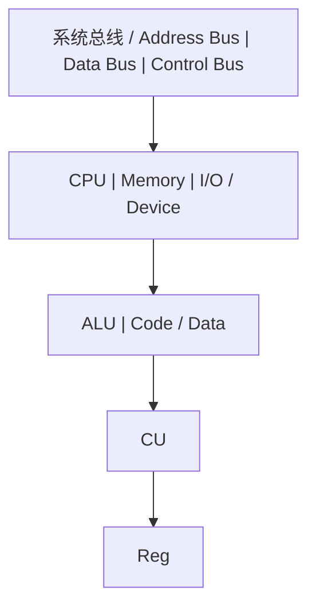

### 1.2 冯诺依曼瓶颈

指令和数据共享同一总线，CPU无法同时读取指令和数据。这是冯诺依曼体系最根本的性能瓶颈。

```
执行一条指令的时间线:

|---取指---|---译码---|---执行---|---访存---|---写回---|
   ^                                                ^
   |          指令和数据争用同一总线                   |
   +------------------------------------------------+
```

**缓解策略**：

- 缓存分离：L1 Cache分为L1I（指令）和L1D（数据），在缓存层实现哈佛体系
- 预取：提前将指令/数据加载到缓存
- 乱序执行：在等待访存时执行其他指令

### 1.3 哈佛体系

哈佛体系将指令存储器和数据存储器分离，拥有独立的总线：

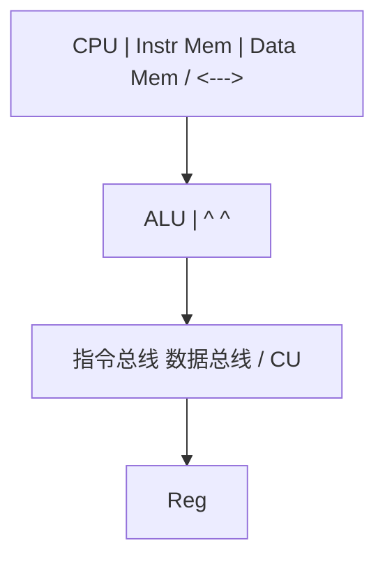

**对比**：

| 特性          | 冯诺依曼         | 哈佛          |
| ------------- | ---------------- | ------------- |
| 指令/数据存储 | 统一             | 分离          |
| 总线          | 共享             | 独立          |
| 带宽          | 受限             | 双倍          |
| 灵活性        | 高（代码即数据） | 低            |
| 典型应用      | 通用计算机       | DSP、微控制器 |

> 跨模块引用：[C语言](/c/001-CZeroBasisStart)的函数指针特性直接利用了冯诺依曼体系中"代码即数据"的本质。[操作系统](os)的虚拟内存管理通过MMU在冯诺依曼体系上实现了地址空间的隔离。

---

## 2. 指令集体系结构 (ISA)

### 2.1 ISA的设计哲学

ISA是硬件和软件之间的**接口契约**（参见[概述](overview)的抽象层级模型）。ISA定义了：

- 指令格式与编码
- 寄存器集合
- 寻址模式
- 数据类型
- 异常/中断模型
- 内存模型

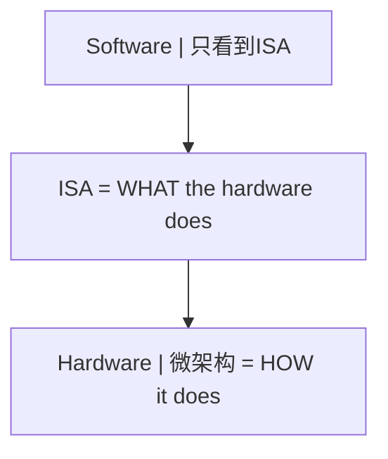

### 2.2 CISC vs RISC

| 维度     | CISC (x86)       | RISC (ARM/RISC-V) |
| -------- | ---------------- | ----------------- |
| 指令长度 | 可变 (1-15字节)  | 固定 (4字节)      |
| 指令数量 | 多 (>1000)       | 少 (<200)         |
| 寻址模式 | 丰富             | 简单 (Load/Store) |
| 微操作   | 需要解码为微操作 | 指令即微操作      |
| 编码密度 | 高               | 低                |
| 流水线   | 复杂             | 简单              |
| 功耗     | 高               | 低                |

**设计哲学差异**：

```
CISC哲学:  让硬件做更多事，简化编译器
  MOV EAX, [EBX + ECX*4 + 0x10]   // 一条指令完成复杂操作

RISC哲学:  让编译器做更多事，简化硬件
  SLLI T0, T1, 2      // 移位
  ADD  T0, T0, T2     // 加基址
  LW   T3, 16(T0)     // 加载
```

### 2.3 RISC-V指令集示例

```
RISC-V寄存器约定:

x0  (zero) - 硬连线0
x1  (ra)   - 返回地址
x2  (sp)   - 栈指针
x5-x7  (t0-t2) - 临时寄存器
x8-x9  (s0-s1) - 保存寄存器
x10-x17 (a0-a7) - 参数/返回值
x18-x27 (s2-s11) - 保存寄存器
x28-x31 (t3-t6) - 临时寄存器
```

**RISC-V指令编码格式**：

```
R-type (寄存器-寄存器操作):
|31    25|24   20|19   15|14  12|11    7|6     0|
| funct7 |  rs2  |  rs1  |funct3|  rd   |opcode |

I-type (立即数操作):
|31      20|19   15|14  12|11    7|6     0|
|  imm[11:0]|  rs1  |funct3|  rd   |opcode |

S-type (存储操作):
|31    25|24   20|19   15|14  12|11    7|6     0|
|imm[11:5]|  rs2  |  rs1  |funct3|imm[4:0]|opcode |
```

### 2.4 寻址模式

```
寻址模式分类:

1. 立即寻址:    ADDI x1, x2, 100        // 操作数在指令中
2. 寄存器寻址:  ADD  x1, x2, x3         // 操作数在寄存器中
3. 基址偏移:    LW   x1, 100(x2)        // 基址+偏移量
4. PC相对:      BEQ  x1, x2, offset     // PC + 偏移量
5. 间接寻址:    JR   x1                  // 跳转到寄存器值
```

> 跨模块引用：[编译原理](compiler)的代码生成阶段需要根据ISA选择合适的寻址模式和指令调度。[C语言](/c/001-CZeroBasisStart)的指针算术直接映射到基址偏移寻址模式。

---

## 3. 流水线原理

### 3.1 五级流水线

经典的RISC五级流水线：

```
五级流水线时空图:

周期:    1     2     3     4     5     6     7
指令1:  IF    ID    EX    MEM   WB
指令2:        IF    ID    EX    MEM   WB
指令3:              IF    ID    EX    MEM   WB
指令4:                    IF    ID    EX    MEM   WB
指令5:                          IF    ID    EX    MEM   WB

IF  = Instruction Fetch (取指)
ID  = Instruction Decode (译码)
EX  = Execute (执行)
MEM = Memory Access (访存)
WB  = Write Back (写回)
```

**流水线加速比**：

```
理论加速比 = 流水线级数 n

实际加速比 = n / (1 + (n-1) * p)

其中 p = 由于冒险导致的停顿概率

CPI_ideal = 1 (每周期完成一条指令)
CPI_actual = 1 + stall_cycles_per_instruction
```

### 3.2 流水线冒险

三类冒险及其解决方案：

**数据冒险**：

```
RAW (Read After Write) -- 真依赖:
  ADD x1, x2, x3    // 写x1
  SUB x4, x1, x5    // 读x1 (需要ADD的结果)

解决方案: 数据前递 (Forwarding/Bypassing)

  ADD x1, x2, x3    [IF][ID][EX][MEM][WB]
                           |_______________^
  SUB x4, x1, x5         [IF][ID] [EX] [MEM][WB]
                                    ^
                              前递路径: EX/MEM -> EX
```

**控制冒险**：

```
分支指令导致的流水线冲刷:

  BEQ x1, x2, target  [IF][ID][EX][MEM][WB]
  instr2 (wrong)           [IF] [X] [X] [X]  <- 冲刷
  instr2 (wrong)                [IF] [X] [X]  <- 冲刷
  target_instr                      [IF][ID][EX]...

解决方案:
  1. 分支预测 (静态/动态)
  2. 延迟分支 (分支延迟槽)
  3. 分支目标缓存 (BTB)
```

**结构冒险**：

```
硬件资源冲突 (如指令和数据同时访存):

解决方案:
  1. 哈佛缓存 (L1I / L1D分离)
  2. 资源复制
  3. 流水线停顿
```

### 3.3 动态分支预测

```
2-bit饱和计数器状态机:

         Weakly Taken
          /    ^    \
    NT   /     |     \  T
        v      |      v
  Weakly NT    |    Strongly Taken
        \      |      /
    NT   \     |     /  T
          v    |    v
         Strongly NT

状态转移:
  00: Strongly Not Taken
  01: Weakly Not Taken
  10: Weakly Taken
  11: Strongly Taken

预测规则: 高位为1则预测Taken，高位为0则预测Not Taken
```

**两级自适应预测器**：

```
GShare预测器:

  全局历史寄存器 (GHR): 记录最近k次分支结果
       |
       v
  GHR XOR PC -> 索引模式历史表 (PHT)
                    |
                    v
              2-bit饱和计数器 -> 预测结果
```

### 3.4 超标量与乱序执行

```
超标量流水线 (每个周期发射多条指令):

  取指 -> 译码 -> 重命名 -> 发射 -> 执行 -> 写回 -> 提交
   |       |       |        |       |       |       |
  多条    多条   消除假    保留站  多功能  重排    顺序
  指令    指令   依赖(WAR  (RS)   单元    缓冲    提交
                 WAW)

乱序执行的关键数据结构:

  Register Alias Table (RAT): 逻辑寄存器 -> 物理寄存器映射
  Reorder Buffer (ROB): 保证顺序提交
  Reservation Station (RS): 等待操作数就绪
```

> 跨模块引用：[操作系统](os)的进程上下文切换需要保存/恢复流水线状态。[编译原理](compiler)的指令调度需要理解流水线冒险以避免性能损失。

---

## 4. 存储层次结构

### 4.1 存储层次金字塔

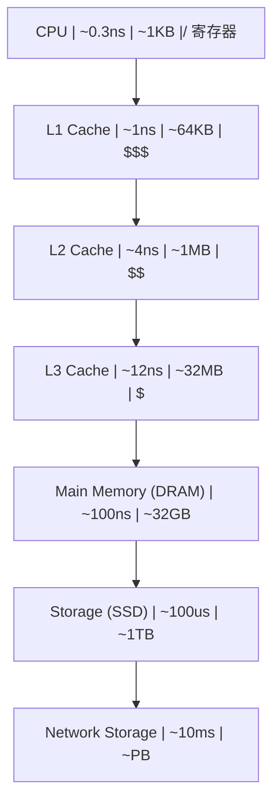

### 4.2 局部性原理

局部性是存储层次有效性的理论基础：

**时间局部性**（Temporal Locality）：最近访问的数据很可能再次被访问

```
for (i = 0; i < N; i++) {
    sum += a[i];  // sum 在每次迭代都被访问 -> 时间局部性
}
```

**空间局部性**（Spatial Locality）：访问某地址后，附近地址很可能被访问

```
for (i = 0; i < N; i++) {
    a[i] = 0;  // a[i], a[i+1] 相邻 -> 空间局部性
}
```

### 4.3 缓存设计

**缓存映射方式**：

```
1. 直接映射 (Direct-Mapped):
   每个内存块只能映射到一个缓存行
   index = block_address % cache_lines

   优点: 硬件简单，查找快
   缺点: 冲突率高

2. 组相联 (Set-Associative):
   每个内存块可映射到一组中的任意行
   index = block_address % num_sets
   组内全相联查找

   优点: 冲突率低
   缺点: 硬件复杂度增加

3. 全相联 (Fully-Associative):
   内存块可映射到任意缓存行
   全部行并行查找

   优点: 冲突率最低
   缺点: 硬件最复杂，功耗高
```

**缓存寻址分解**：

```
内存地址分解:

|-------- Tag --------|--- Index ---|--- Offset ---|
|                     |             |              |
| 标识哪个内存块       | 映射到哪一组  | 块内偏移      |

缓存查找过程:
  1. 用 Index 选择组
  2. 用 Tag 与组内所有行的Tag比较
  3. 若匹配且Valid=1 -> 命中 (Hit)
  4. 否则 -> 未命中 (Miss)
```

**缓存替换策略**：

```
LRU (Least Recently Used):
  替换最久未访问的行
  实现方式: 年龄计数器 / 伪LRU树

伪LRU (PLRU) 树形结构 (4路示例):

          bit0
         /    \
      bit1    bit2
      / \     / \
    W0  W1  W2  W3

  bit=0: 左子树更久未用
  bit=1: 右子树更久未用
  访问时翻转路径上的位
  替换时沿位指示方向走到叶节点
```

### 4.4 缓存一致性协议 (MESI)

多核系统中，每个核心有自己的L1/L2缓存，必须保证一致性：

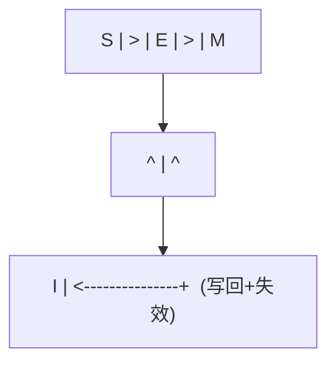

**MESI伪代码**：

```python
def cache_read(cache, addr):
    line = cache.find(addr)
    if line and line.state != INVALID:
        return line.data                    # Cache Hit
    # Cache Miss
    bus_broadcast(BusRd, addr)
    if other_cache_has(addr, MODIFIED):
        other_cache.flush_and_downgrade(addr)  # M -> S
        data = memory_or_bus_read(addr)
        cache.store(addr, data, SHARED)
    elif other_cache_has(addr, EXCLUSIVE):
        other_cache.downgrade(addr)            # E -> S
        data = memory_read(addr)
        cache.store(addr, data, SHARED)
    else:
        data = memory_read(addr)
        cache.store(addr, data, EXCLUSIVE)
    return data
```

### 4.5 虚拟内存

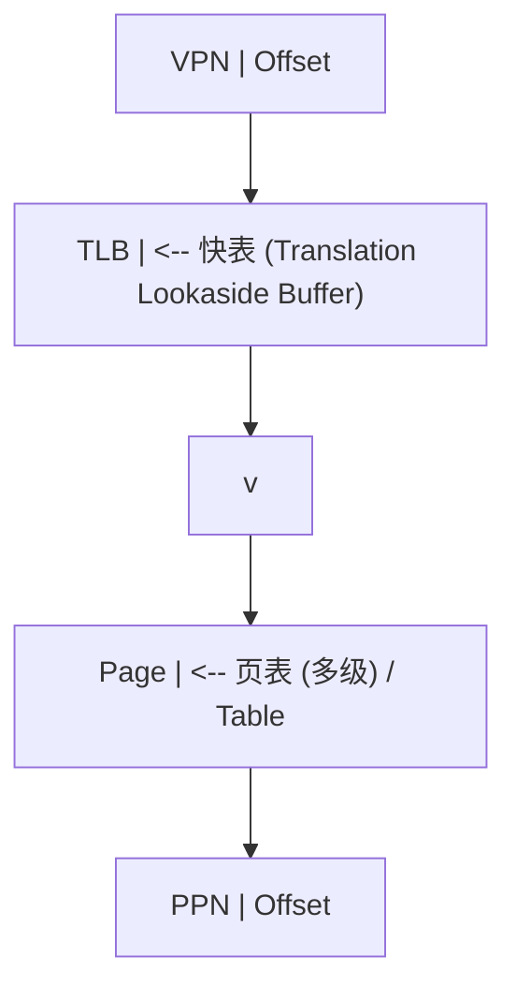

**多级页表结构**（以x86-64的4级页表为例）：

```
虚拟地址 (48位有效):
| PML4 (9b) | PDPT (9b) | PD (9b) | PT (9b) | Offset (12b) |

翻译过程:
  CR3 -> PML4表 -> PDPT表 -> PD表 -> PT表 -> 物理页

每级页表项 (PTE) 格式:
|--- Physical Frame Number ---| D | A | PC | G | U | W | P |
                               |   |   |    |   |   |   |
                               |   |   |    |   |   |   +-- Present
                               |   |   |    |   |   +------ Write
                               |   |   |    |   +---------- User
                               |   |   |    +-------------- Global
                               |   |   +------------------- Page Cache
                               |   +----------------------- Accessed
                               +--------------------------- Dirty
```

> 跨模块引用：[操作系统](os)的内存管理建立在虚拟内存机制之上。[C语言](/c/001-CZeroBasisStart)的指针解引用触发完整的地址翻译链路。[C++](/cpp/001-WhatIsCpp)的智能指针在虚拟内存之上增加了语义层。

---

## 5. 总线与互连

### 5.1 总线分类

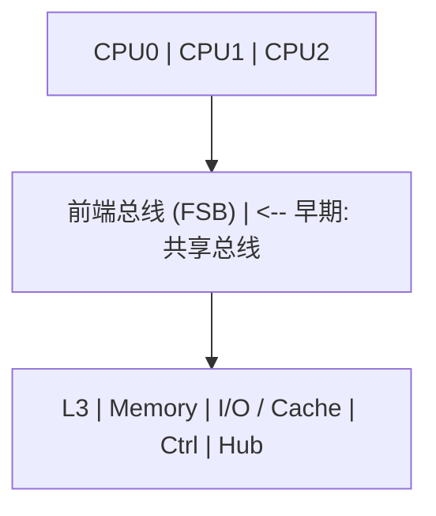

### 5.2 AMBA AXI协议

AXI (Advanced eXtensible Interface) 是ARM定义的高性能总线协议，包含5个独立通道：

```
AXI5通道架构:

  读地址通道 (AR):  ARADDR, ARLEN, ARSIZE, ARBURST, ARVALID, ARREADY
  读数据通道 (R):   RDATA, RRESP, RLAST, RVALID, RREADY
  写地址通道 (AW):  AWADDR, AWLEN, AWSIZE, AWBURST, AWVALID, AWREADY
  写数据通道 (W):   WDATA, WSTRB, WLAST, WVALID, WREADY
  写响应通道 (B):   BRESP, BVALID, BREADY

握手协议:
  VALID = 主设备数据有效
  READY = 从设备准备接收
  传输发生在 VALID && READY 的时钟沿

       CLK:  _|^|_|^|_|^|_|^|_|^|_|^|_|^|_
     VALID:  _________|^^^^^^^^^|_________
     READY:  _______________|^^^^^^^^^^^^^
     TRANS:  _______________|     |________
                           ^     ^
                        传输发生
```

### 5.3 PCIe协议栈

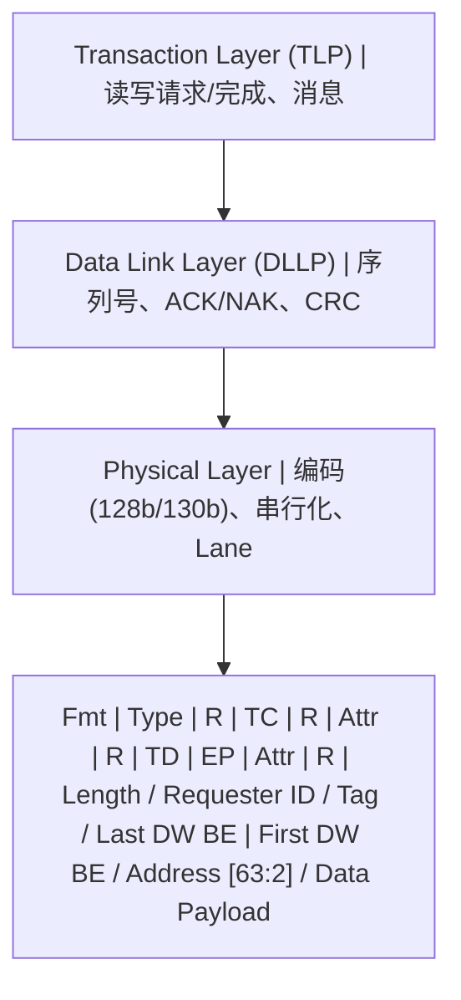

---

## 6. 并行体系结构

### 6.1 并行分类 (Flynn分类法)

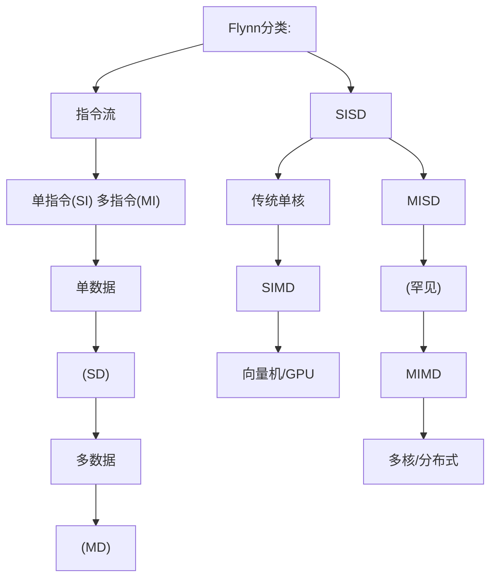

### 6.2 SIMD与向量化

```
SIMD执行模型:

标量执行 (SISD):
  ADD r1, r2, r3    // 1对数据相加

SIMD执行:
  VADD v1, v2, v3   // N对数据同时相加

  v1 = [a0, a1, a2, a3, a4, a5, a6, a7]  (256-bit AVX)
  v2 = [b0, b1, b2, b3, b4, b5, b6, b7]
  v3 = [a0+b0, a1+b1, a2+b2, a3+b3, a4+b4, a5+b5, a6+b6, a7+b7]

SIMD指令集演进:
  x86: MMX(64b) -> SSE(128b) -> AVX(256b) -> AVX-512(512b)
  ARM: NEON(128b) -> SVE(可变128-2048b)
```

### 6.3 GPU体系结构

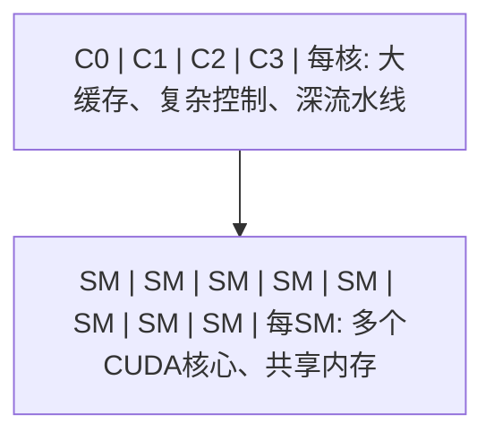

### 6.4 多核缓存一致性

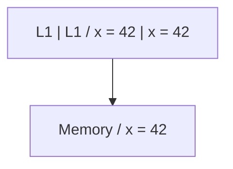

### 6.5 内存一致性模型

```
内存一致性模型谱系:

严格 <---> 宽松

Sequential Consistency (SC):
  所有线程看到相同的操作顺序
  等价于所有操作某种全局交错

Total Store Order (TSO) [x86]:
  写操作进入Store Buffer，后续读可先于写完成
  仅允许 Store -> Load 重排

Relaxed Consistency [ARM/RISC-V]:
  允许更多重排: Store->Store, Load->Load, Store->Load, Load->Store
  需要显式内存屏障 (FENCE) 同步

屏障指令:
  x86:    MFENCE, LFENCE, SFENCE
  ARM:    DMB, DSB, ISB
  RISC-V: FENCE, FENCE.I
```

> 跨模块引用：[C++](/cpp/001-WhatIsCpp)的内存模型（memory_order_relaxed/acquire/release/seq_cst）直接映射到硬件一致性模型。[Java](/java/001-WhatIsJava)的volatile关键字在x86上无需额外屏障，但在ARM上需要dmb。

---

## 7. 速查表

### 7.1 ISA速查

| 特性       | x86-64   | ARMv8   | RISC-V     |
| ---------- | -------- | ------- | ---------- |
| 类型       | CISC     | RISC    | RISC       |
| 指令长度   | 1-15B    | 4B      | 4B(可扩展) |
| 通用寄存器 | 16       | 31      | 31         |
| 地址宽度   | 48/57b   | 48b     | 39/48/57b  |
| 字节序     | Little   | 双端    | Little     |
| 特权级     | Ring 0-3 | EL0-EL3 | U/S/M      |

### 7.2 流水线冒险速查

| 冒险类型 | 原因       | 解决方案      |
| -------- | ---------- | ------------- |
| RAW      | 真数据依赖 | 前递/转发     |
| WAR      | 反依赖     | 寄存器重命名  |
| WAW      | 输出依赖   | 寄存器重命名  |
| 控制     | 分支       | 预测/延迟槽   |
| 结构     | 资源冲突   | 资源复制/分离 |

### 7.3 存储层次速查

| 层级   | 延迟   | 容量  | 管理   |
| ------ | ------ | ----- | ------ |
| 寄存器 | ~0.3ns | ~1KB  | 编译器 |
| L1     | ~1ns   | ~64KB | 硬件   |
| L2     | ~4ns   | ~1MB  | 硬件   |
| L3     | ~12ns  | ~32MB | 硬件   |
| DRAM   | ~100ns | ~32GB | OS     |
| SSD    | ~100us | ~1TB  | OS     |
| HDD    | ~10ms  | ~10TB | OS     |

### 7.4 缓存一致性速查

| MESI状态 | 含义   | 可读 | 可写       | 与内存一致 |
| -------- | ------ | ---- | ---------- | ---------- |
| M        | 已修改 | 是   | 是         | 否         |
| E        | 独占   | 是   | 是         | 是         |
| S        | 共享   | 是   | 否(需升级) | 是         |
| I        | 无效   | 否   | 否         | -          |
