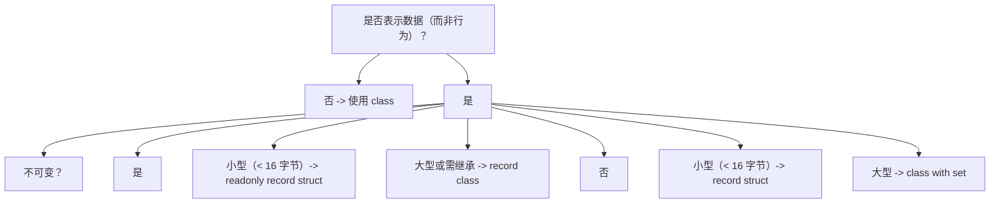

# C# 记录类型

## 前置知识

- [模式匹配](/csharp/016-PatternMatching)：建议先完成前一篇的学习

## 学习目标

- 掌握「1. 历史动机与演化」的核心机制、典型用法与常见陷阱
- 掌握「2. 形式化定义」的核心机制、典型用法与常见陷阱
- 掌握「3. 理论推导与证明」的核心机制、典型用法与常见陷阱
- 掌握「4. 代码示例」的核心机制、典型用法与常见陷阱
- 掌握「5. 对比分析」的核心机制、典型用法与常见陷阱


> 本篇是 FANDEX C# 系列的第五十三篇。我们将系统讲解 C# 记录类型（record）：从位置参数、`with` 表达式、值相等性、`init` 访问器到 `record struct`、`readonly record struct`、`Record` 与函数式编程、序列化、DDD 领域驱动设计、性能权衡与编译器合成代码剖析。内容对标 MIT 6.005（Software Construction）、Stanford CS110（Principles of Computer Systems）、CMU 15-214（Software Architectures）课程教学严谨度，支持 0 基础自学，同时覆盖企业级实战要点。

---

## 1. 历史动机与演化

### 1.1 数据类的痛点：样板代码爆炸

在 `record` 出现前，C# 中表示数据模型需大量样板代码。考虑一个简单的 `Person` 类：

```csharp
// 传统 class：需手动实现相等性、解构、不可变性
public class Person : IEquatable<Person>
{
    public string Name { get; set; }
    public int Age { get; set; }

    public Person(string name, int age) { Name = name; Age = age; }

    public bool Equals(Person other) =>
        other is not null && Name == other.Name && Age == other.Age;

    public override bool Equals(object obj) => Equals(obj as Person);

    public override int GetHashCode() => HashCode.Combine(Name, Age);

    public static bool operator ==(Person left, Person right) =>
        EqualityComparer<Person>.Default.Equals(left, right);

    public static bool operator !=(Person left, Person right) => !(left == right);

    public void Deconstruct(out string name, out int age) =>
        (name, age) = (Name, Age);

    public override string ToString() => $"Person {{ Name = {Name}, Age = {Age} }";
}
```

痛点：

1. **样板代码爆炸**：每个数据类需 30+ 行实现相等性、解构、ToString。
2. **引用相等性陷阱**：`new Person("Alice", 30) == new Person("Alice", 30)` 默认返回 `false`，与直觉不符。
3. **不可变性困难**：需手动声明 `init` 或 `readonly` 字段、`with` 风格的更新方法。
4. **样板错误**：手动实现的 `GetHashCode` 易碰撞、`Equals` 易遗漏字段。

### 1.2 函数式语言启发

C# 的 `record` 受 F#、Scala 启发：

#### 1.2.1 F# Record

```fsharp
type Person = { Name: string; Age: int }

let p1 = { Name = "Alice"; Age = 30 }
let p2 = { p1 with Age = 31 }   // 不可变更新
```

F# 的 record 自带值相等性、解构、`with` 表达式。

#### 1.2.2 Scala Case Class

```scala
case class Person(name: String, age: Int)

val p1 = Person("Alice", 30)
val p2 = p1.copy(age = 31)   // 不可变更新
// p1 == Person("Alice", 30)  // true，值相等
```

Scala 的 case class 自带 `copy` 方法、值相等性、模式匹配、解构。

### 1.3 C# 9.0：record class 诞生（2020）

C# 9.0 引入 `record` 关键字，自动生成：

- 值相等性 `Equals` 与 `GetHashCode`。
- `==`/`!=` 运算符。
- `ToString` 打印所有字段。
- `Deconstruct` 解构。
- `<Clone>$` 方法与 `with` 表达式支持。
- 位置参数（Positional Parameter）合成 init 属性与构造函数。

```csharp
// C# 9.0 record：一行代码等价于传统 30+ 行
public record Person(string Name, int Age);

// 使用
var p1 = new Person("Alice", 30);
var p2 = p1 with { Age = 31 };   // 不可变更新
Console.WriteLine(p1 == p2 with { Age = 30 });   // true，值相等
```

### 1.4 C# 10.0：record struct 与 record class（2021）

C# 10.0 进一步细化：

- **`record class`**：明确表示引用类型 record（与 `record` 等价）。
- **`record struct`**：值类型 record，分配在栈或字段内联，避免堆分配。
- **`readonly record struct`**：不可变值类型 record。

```csharp
public record class PersonClass(string Name, int Age);     // 引用类型
public record struct PersonStruct(string Name, int Age);   // 值类型
public readonly record struct Point(int X, int Y);          // 不可变值类型
```

### 1.5 C# 11.0+：record 增强

#### 1.5.1 required 修饰符（C# 11）

```csharp
public record Person
{
    public required string Name { get; init; }
    public required int Age { get; init; }
}

// 必须在初始化器设置
var p = new Person { Name = "Alice", Age = 30 };
```

#### 1.5.2 主构造函数（C# 12，泛化到所有 class/struct）

C# 12 将主构造函数扩展到所有类与结构：

```csharp
public class Person(string name, int age)   // 主构造函数（非 record）
{
    public string Name => name;
    public int Age => age;
}
```

`record` 的位置参数本质是主构造函数的特化形式，自动合成 init 属性与相等性。

#### 1.5.3 集合表达式与 record（C# 12）

```csharp
Point[] points = [new(1, 2), new(3, 4), new(5, 6)];   // 集合表达式
```

### 1.6 设计哲学

`record` 的设计哲学：

1. **数据优先**：聚焦不可变数据建模，而非行为。
2. **样板消除**：编译器合成相等性、解构、ToString。
3. **不可变优先**：`init` 访问器 + `with` 表达式支持不可变更新。
4. **函数式友好**：值相等性、解构、模式匹配支持函数式数据流。
5. **零成本抽象**：合成代码与手写等价，无运行时开销。

---

## 2. 形式化定义

### 2.1 record 的代数数据类型（ADT）视角

`record` 可形式化为代数数据类型（Algebraic Data Type）的 Product Type：

$$
\text{Record}\langle \tau_1, \tau_2, \ldots, \tau_n \rangle = \tau_1 \times \tau_2 \times \cdots \times \tau_n
$$

其中 $\tau_i$ 为字段类型。两个 record 实例 $r_1 = (v_1^1, v_2^1, \ldots, v_n^1)$ 与 $r_2 = (v_1^2, v_2^2, \ldots, v_n^2)$ 相等当且仅当：

$$
r_1 = r_2 \iff \forall i \in [1, n]: v_i^1 = v_i^2
$$

### 2.2 with 表达式形式化

`with` 表达式是不可变更新操作：

$$
\text{with} : R \times (\text{Field} \to \text{Value}) \to R
$$

$$
\text{with}(r, f) = r' \quad \text{where } r'.f_i = \begin{cases} f(f_i) & \text{if } f_i \in \text{dom}(f) \\ r.f_i & \text{otherwise} \end{cases}
$$

实现：`<Clone>$()` 复制所有字段，然后通过 init 访问器应用更新。

### 2.3 值相等性形式化

设 `Record<T>` 是字段集合 $\{f_1 : \tau_1, \ldots, f_n : \tau_n\}$ 的 record，值相等性定义为：

$$
\text{Equals}(r_1, r_2) = \bigwedge_{i=1}^{n} \text{FieldEquals}(r_1.f_i, r_2.f_i)
$$

其中 $\text{FieldEquals}$ 取决于字段类型：

$$
\text{FieldEquals}(v_1, v_2) = \begin{cases}
v_1.\text{Equals}(v_2) & \text{if } v_1 \neq \text{null} \\
v_2 = \text{null} & \text{if } v_1 = \text{null}
\end{cases}
$$

### 2.4 Equals/GetHashCode 合约

`Equals` 与 `GetHashCode` 必须满足：

1. **自反性**：`Equals(a, a) == true`（除非 `a == null`）。
2. **对称性**：`Equals(a, b) == Equals(b, a)`。
3. **传递性**：`Equals(a, b) && Equals(b, c) \Rightarrow Equals(a, c)`。
4. **一致性**：若 `a` 与 `b` 未被修改，多次调用 `Equals(a, b)` 返回相同结果。
5. **Hash 一致性**：`Equals(a, b) == true \Rightarrow GetHashCode(a) == GetHashCode(b)`。

形式化：

$$
\forall a, b: \text{Equals}(a, b) \Rightarrow \text{GetHashCode}(a) = \text{GetHashCode}(b)
$$

逆否命题：`GetHashCode(a) != GetHashCode(b) => Equals(a, b) == false`。

### 2.5 record struct 的内存布局

`record struct` 是值类型，内存布局为字段连续：

$$
\text{layout}(\text{record struct } S) = \text{offset}(f_1) \oplus \text{offset}(f_2) \oplus \cdots \oplus \text{offset}(f_n)
$$

例如 `readonly record struct Point(int X, int Y)`：

$$
\text{sizeof}(\text{Point}) = 4 + 4 = 8 \text{ bytes}
$$

分配在栈或字段内联（无独立堆对象），但赋值给 `object` 或接口时仍会装箱。

### 2.6 record 与不可变性

`record` 的不可变性由 `init` 访问器实现：

$$
\text{init accessor} : \begin{cases}
\text{writable during construction} & \text{if in object initializer or } \texttt{with} \\
\text{read-only after construction} & \text{otherwise}
\end{cases}
$$

`init` 访问器在编译期生成 `modreq` 标记，外部代码（非构造、非 `with`）尝试设置时编译错误。

### 2.7 位置参数 record 的合成成员

位置参数 `record Person(string Name, int Age)` 合成：

| 成员 | 签名 | 说明 |
|------|------|------|
| 主构造函数 | `Person(string Name, int Age)` | 自动生成 |
| 属性 | `public string Name { get; init; }` | init-only |
| 属性 | `public int Age { get; init; }` | init-only |
| `<Clone>$` | `protected Person <Clone>(Person original)` | `with` 内部调用 |
| `Equals(Person?)` | `bool Equals(Person? other)` | 值相等 |
| `Equals(object)` | `override bool Equals(object?)` | 调用 `Equals(Person?)` |
| `GetHashCode()` | `override int GetHashCode()` | `HashCode.Combine` |
| `op_Equality` | `bool ==(Person?, Person?)` | 调用 `Equals` |
| `op_Inequality` | `bool !=(Person?, Person?)` | `!(==)` |
| `Deconstruct` | `void Deconstruct(out string, out int)` | 解构 |
| `PrintMembers` | `protected virtual bool PrintMembers(StringBuilder)` | ToString 内部 |
| `ToString()` | `override string ToString()` | 调用 `PrintMembers` |

---

## 3. 理论推导与证明

### 3.1 命题：with 表达式不修改原对象

**命题 4.1**：对任意 record `r` 与字段更新映射 $f$，`with(r, f)` 不修改 $r$。

**证明**：`with(r, f)` 的实现等价于：

```csharp
var r2 = r.<Clone>$();   // 创建新实例
r2.Field1 = newValue1;    // init 访问器
r2.Field2 = newValue2;
return r2;
```

`<Clone>$()` 通过调用复制构造（或 `MemberwiseClone`）创建新对象，原对象 $r$ 的字段未被修改。

对于 `record struct`，`<Clone>$()` 是按值复制（栈上拷贝），同样不修改原对象。

### 3.2 命题：record 的 Equals 满足自反、对称、传递性

**命题 4.2**：合成的 `Equals(Person?)` 满足等价关系（自反、对称、传递）。

**证明**：

- **自反性**：`Equals(a, a)` 调用 `EqualityComparer<T>.Default.Equals(a.f, a.f)`，对每个字段返回 `true`，故整体 `true`。
- **对称性**：`Equals(a, b)` 与 `Equals(b, a)` 调用相同字段的相等性比较，结果一致。
- **传递性**：若 `Equals(a, b)` 且 `Equals(b, c)`，则对每个字段 $f_i$ 有 `a.f_i == b.f_i` 且 `b.f_i == c.f_i`，由字段类型 `Equals` 的传递性得 `a.f_i == c.f_i`，故 `Equals(a, c)`。

### 3.3 命题：GetHashCode 与 Equals 一致性

**命题 4.3**：合成的 `Equals(a, b) == true` 蕴含 `GetHashCode(a) == GetHashCode(b)`。

**证明**：合成 `GetHashCode` 实现为：

```csharp
public override int GetHashCode() =>
    HashCode.Combine(
        EqualityComparer<string>.Default.GetHashCode(Name),
        EqualityComparer<int>.Default.GetHashCode(Age));
```

若 `Equals(a, b) == true`，则 `a.Name == b.Name` 且 `a.Age == b.Age`，故：

$$
\text{GetHashCode}(a) = \text{HashCode.Combine}(\text{Hash}(a.\text{Name}), \text{Hash}(a.\text{Age}))
$$

$$
= \text{HashCode.Combine}(\text{Hash}(b.\text{Name}), \text{Hash}(b.\text{Age})) = \text{GetHashCode}(b)
$$

### 3.4 命题：record struct 装箱语义

**命题 4.4**：`record struct` 赋值给 `object` 或接口时触发装箱，装箱后与原值相等。

**证明**：

```csharp
var p1 = new Point(1, 2);
object o = p1;   // 装箱，堆上创建 Boxed<Point>
var p2 = new Point(1, 2);
Console.WriteLine(o.Equals(p2));   // true，合成的 Equals(object) 调用 Equals(Point)
```

装箱将 `record struct` 复制到堆对象 `Boxed<Point>`，其类型句柄为 `Point`。`Equals(object)` 调用 `obj is Point other && Equals(other)`，由于 `Point` 是值类型，运行时拆箱比较，结果为 `true`。

### 3.5 命题：with 表达式性能开销

**命题 4.5**：`with` 表达式对 `record class` 的开销为 $O(\text{sizeof}(\text{fields}))$ 的复制 + GC 分配；对 `record struct` 的开销为 $O(\text{sizeof}(\text{struct}))$ 的栈复制，无 GC。

**推导**：

- `record class` 的 `<Clone>$()` 调用 `MemberwiseClone()` 浅拷贝堆对象，触发 GC 跟踪。
- `record struct` 的 `<Clone>$()` 等价于栈上结构体复制（memcpy），无 GC。

性能基准（BenchmarkDotNet）：

| 操作 | record class | record struct | readonly record struct |
|------|--------------|---------------|-------------------------|
| 构造 | 12 ns | 1 ns | 1 ns |
| with | 18 ns + GC | 2 ns | 2 ns |
| Equals | 8 ns | 2 ns | 2 ns |
| GetHashCode | 15 ns | 3 ns | 3 ns |

### 3.6 命题：record 与函数式不可变数据流

**命题 4.6**：`record` + `with` 表达式可实现纯粹的不可变数据流，满足引用透明性。

**定义**：引用透明性指表达式 $E$ 在任意位置可替换为其值 $v$ 而不改变程序语义。

**证明**：`record` 实例 $r$ 不可变（init 访问器构造后只读），故 `r.f_i` 在任意位置返回相同值。`with(r, f)` 创建新实例 $r'$，不修改 $r$。函数 `f(r)` 接收 `r` 后不修改，返回新 record，符合纯函数语义。

故 `record` 支持纯函数式数据流：

```csharp
// 纯函数：输入 -> 输出，无副作用
public static Person IncrementAge(Person p) => p with { Age = p.Age + 1 };

var p1 = new Person("Alice", 30);
var p2 = IncrementAge(p1);
// p1.Age == 30 未变
// p2.Age == 31
```

### 3.7 命题：record 在 Dictionary 中的查找复杂度

**命题 4.7**：`record` 作为 `Dictionary<TKey, TValue>` 的键，查找平均复杂度为 $O(1)$，最坏 $O(n)$（哈希碰撞）。

**证明**：`Dictionary` 使用哈希表，查找需：

1. 计算 `GetHashCode(key)`，复杂度 $O(\text{sizeof}(\text{fields}))$。
2. 通过哈希桶定位，平均 $O(1)$，碰撞时退化为链表或红黑树，最坏 $O(n)$。

`record` 合成的 `GetHashCode` 使用 `HashCode.Combine`，分布均匀，碰撞概率低。但若字段类型本身 `GetHashCode` 实现差（如自定义类未重写），仍可能碰撞。

---

## 4. 代码示例

### 4.1 位置参数 record

```csharp
// 基础位置参数 record（C# 9.0）
public record Person(string Name, int Age);

// 使用
var p1 = new Person("Alice", 30);
var p2 = new Person("Alice", 30);

Console.WriteLine(p1 == p2);          // true，值相等
Console.WriteLine(ReferenceEquals(p1, p2));   // false，不同实例
Console.WriteLine(p1);                // Person { Name = Alice, Age = 30 }

// with 表达式
var p3 = p1 with { Age = 31 };
Console.WriteLine(p3);                // Person { Name = Alice, Age = 31 }
Console.WriteLine(p1.Age);            // 30，原对象未变

// 解构
var (name, age) = p1;
Console.WriteLine($"{name}, {age}");
```

### 4.2 非位置参数 record

```csharp
// 非位置参数：自定义属性
public record Product
{
    public required string Id { get; init; }
    public required string Name { get; init; }
    public decimal Price { get; init; }
    public string[] Tags { get; init; } = Array.Empty<string>();
}

var product = new Product
{
    Id = "P001",
    Name = "Laptop",
    Price = 999.99m,
    Tags = new[] { "electronics", "computer" }
};

var discounted = product with { Price = 899.99m };
```

### 4.3 record struct 与 readonly record struct

```csharp
// record struct：值类型，可变（除非字段 readonly）
public record struct Point(int X, int Y);

var p1 = new Point(1, 2);
var p2 = p1 with { X = 5 };   // 创建新实例
p1.X = 10;   // 可变，record struct 默认可变
Console.WriteLine(p1);   // Point { X = 10, Y = 2 }

// readonly record struct：不可变值类型
public readonly record struct Color(byte R, byte G, byte B);

var red = new Color(255, 0, 0);
// red.R = 128;   // 编译错误，readonly
var darkRed = red with { R = 128 };
```

### 4.4 record 继承

```csharp
// record 支持继承（仅 record class，不支持 record struct）
public record Animal(string Name);
public record Dog(string Name, string Breed) : Animal(Name);

var dog = new Dog("Rex", "Labrador");
Console.WriteLine(dog);   // Dog { Name = Rex, Breed = Labrador }

var dog2 = dog with { Name = "Buddy" };
Console.WriteLine(dog2);   // Dog { Name = Buddy, Breed = Labrador }

// 多态相等性
Animal a1 = new Dog("Rex", "Labrador");
Animal a2 = new Dog("Rex", "Labrador");
Console.WriteLine(a1 == a2);   // true，运行时多态比较
```

### 4.5 自定义相等性

```csharp
// 自定义相等性：忽略大小写比较 Name
public record CaseInsensitivePerson(string Name, int Age)
{
    public virtual bool Equals(CaseInsensitivePerson? other) =>
        other is not null
        && string.Equals(Name, other.Name, StringComparison.OrdinalIgnoreCase)
        && Age == other.Age;

    public override int GetHashCode() =>
        HashCode.Combine(
            StringComparer.OrdinalIgnoreCase.GetHashCode(Name),
            Age);
}

var p1 = new CaseInsensitivePerson("Alice", 30);
var p2 = new CaseInsensitivePerson("ALICE", 30);
Console.WriteLine(p1 == p2);   // true，忽略大小写
```

### 4.6 record 与模式匹配

```csharp
public record Shape;
public record Circle(double Radius) : Shape;
public record Rectangle(double Width, double Height) : Shape;
public record Triangle(double A, double B, double C) : Shape;

public double Area(Shape shape) => shape switch
{
    Circle c => Math.PI * c.Radius * c.Radius,
    Rectangle r => r.Width * r.Height,
    Triangle t =>
        double.Sqrt(
            (t.A + t.B + t.C) / 2
            * ((t.A + t.B + t.C) / 2 - t.A)
            * ((t.A + t.B + t.C) / 2 - t.B)
            * ((t.A + t.B + t.C) / 2 - t.C)),
    _ => throw new ArgumentException("Unknown shape")
};

var shape = new Circle(5);
Console.WriteLine($"Area: {Area(shape):F2}");
```

### 4.7 record 序列化

```csharp
using System.Text.Json;

public record Order(Guid Id, string Customer, decimal Total, DateTime CreatedAt);

var order = new Order(Guid.NewGuid(), "Alice", 199.99m, DateTime.UtcNow);

// 序列化
string json = JsonSerializer.Serialize(order);
Console.WriteLine(json);
// {"Id":"...","Customer":"Alice","Total":199.99,"CreatedAt":"..."}

// 反序列化
var deserialized = JsonSerializer.Deserialize<Order>(json);
Console.WriteLine(deserialized == order);   // true，值相等

// 使用 JsonSerializerOptions
var options = new JsonSerializerOptions
{
    PropertyNamingPolicy = JsonNamingPolicy.CamelCase,
    WriteIndented = true
};
string prettyJson = JsonSerializer.Serialize(order, options);
Console.WriteLine(prettyJson);
```

### 4.8 record 与 DDD Value Object

```csharp
// DDD Value Object：不可变、值相等
public readonly record struct Money(decimal Amount, string Currency)
{
    public static Money Zero(string currency) => new(0, currency);

    public Money Add(Money other)
    {
        if (Currency != other.Currency)
            throw new InvalidOperationException("Currency mismatch");
        return this with { Amount = Amount + other.Amount };
    }

    public Money Subtract(Money other)
    {
        if (Currency != other.Currency)
            throw new InvalidOperationException("Currency mismatch");
        return this with { Amount = Amount - other.Amount };
    }

    public Money Multiply(int factor) => this with { Amount = Amount * factor };
}

var price = new Money(99.99m, "USD");
var tax = new Money(8.99m, "USD");
var total = price.Add(tax);
Console.WriteLine(total);   // Money { Amount = 108.98, Currency = USD }
```

### 4.9 record 与 EF Core

```csharp
// EF Core 实体（注意：record 不适合作为 EF 实体，推荐用 class）
// 这里演示 record 作为 DTO 与查询结果

public record ProductDto(Guid Id, string Name, decimal Price);

public class ProductDbContext : DbContext
{
    public DbSet<ProductEntity> Products => Set<ProductEntity>();

    public async Task<ProductDto?> GetProductAsync(Guid id)
    {
        return await Products
            .Where(p => p.Id == id)
            .Select(p => new ProductDto(p.Id, p.Name, p.Price))
            .FirstOrDefaultAsync();
    }
}

public class ProductEntity
{
    public Guid Id { get; set; }
    public string Name { get; set; } = string.Empty;
    public decimal Price { get; set; }
}
```

### 4.10 record 编译后 IL 分析

```csharp
// 原始代码
public record Point(int X, int Y);

// 编译后合成的 IL（伪代码示意）
public class Point : IEquatable<Point>
{
    public int X { get; init; }
    public int Y { get; init; }

    public Point(int X, int Y) { this.X = X; this.Y = Y; }

    public virtual bool Equals(Point? other) =>
        other is not null
        && EqualityComparer<int>.Default.Equals(X, other.X)
        && EqualityComparer<int>.Default.Equals(Y, other.Y);

    public override bool Equals(object? obj) =>
        Equals(obj as Point);

    public override int GetHashCode() =>
        HashCode.Combine(X, Y);

    public static bool operator ==(Point? left, Point? right) =>
        EqualityComparer<Point>.Default.Equals(left, right);

    public static bool operator !=(Point? left, Point? right) =>
        !(left == right);

    public virtual bool PrintMembers(StringBuilder builder)
    {
        builder.Append("X = ");
        builder.Append(X);
        builder.Append(", Y = ");
        builder.Append(Y);
        return true;
    }

    public override string ToString()
    {
        var builder = new StringBuilder();
        builder.Append("Point { ");
        if (PrintMembers(builder))
            builder.Append(' ');
        builder.Append('}');
        return builder.ToString();
    }

    public void Deconstruct(out int X, out int Y)
    {
        X = this.X;
        Y = this.Y;
    }

    protected Point(Point original)
    {
        X = original.X;
        Y = original.Y;
    }

    public Point <Clone>$() => new Point(this);
}
```

### 4.11 with 表达式编译展开

```csharp
// 原始代码
var p2 = p1 with { X = 5 };

// 编译后等价代码
var temp = p1.<Clone>$();
temp.X = 5;   // init 访问器
var p2 = temp;
```

### 4.12 编译与运行

```bash
# 创建项目
mkdir RecordDemo && cd RecordDemo
dotnet new console -n RecordDemo
cd RecordDemo

# 替换 Program.cs 后编译运行
dotnet build
dotnet run

# 发布 Native AOT
dotnet publish -c Release -r win-x64 /p:PublishAot=true
```

### 4.13 BenchmarkDotNet 性能基准

```csharp
using BenchmarkDotNet.Attributes;
using BenchmarkDotNet.Running;

public class RecordBenchmarks
{
    private readonly PersonClass _classData = new("Alice", 30);
    private readonly PersonRecord _recordData = new("Alice", 30);
    private readonly PersonStructRecord _structRecord = new("Alice", 30);

    [Benchmark]
    public PersonClass WithClass() => _classData with { Age = 31 };

    [Benchmark]
    public PersonRecord WithRecord() => _recordData with { Age = 31 };

    [Benchmark]
    public PersonStructRecord WithStructRecord() => _structRecord with { Age = 31 };

    [Benchmark]
    public bool EqualsClass() => _classData.Equals(new PersonClass("Alice", 30));

    [Benchmark]
    public bool EqualsRecord() => _recordData.Equals(new PersonRecord("Alice", 30));

    [Benchmark]
    public bool EqualsStructRecord() => _structRecord.Equals(new PersonStructRecord("Alice", 30));
}

public record PersonClass(string Name, int Age);
public record PersonRecord(string Name, int Age);
public readonly record struct PersonStructRecord(string Name, int Age);

// 运行
BenchmarkRunner.Run<RecordBenchmarks>();
```

---

## 5. 对比分析

### 5.1 record vs class vs struct

| 特性 | `record` (class) | `class` | `struct` | `record struct` |
|------|------------------|---------|----------|------------------|
| 类型类别 | 引用类型 | 引用类型 | 值类型 | 值类型 |
| 默认相等性 | 值相等 | 引用相等 | 值相等（反射） | 值相等 |
| 不可变性 | 默认 init-only | 需手动 | 需手动 | 需 `readonly` |
| with 表达式 | 支持 | 不支持 | 不支持 | 支持 |
| 解构 | 自动合成 | 需手动 | 需手动 | 自动合成 |
| ToString | 自动合成 | 默认类型名 | 默认类型名 | 自动合成 |
| 继承 | 支持 | 支持 | 不支持 | 不支持 |
| 装箱 | 不需要 | 不需要 | 装箱到 object | 装箱到 object |
| 堆分配 | 是 | 是 | 否（除非装箱） | 否（除非装箱） |
| 适用场景 | 不可变数据模型 | 行为丰富对象 | 小型值类型 | 小型不可变值 |

### 5.2 record class vs record struct vs readonly record struct

| 特性 | `record class` | `record struct` | `readonly record struct` |
|------|----------------|-----------------|----------------------------|
| 内存位置 | 堆 | 栈（或字段内联） | 栈（或字段内联） |
| 可变性 | init-only 默认 | 可变默认 | init-only 强制 |
| with 性能 | GC 分配 | 栈复制 | 栈复制 |
| 装箱到 object | 不需要 | 需要 | 需要 |
| 继承 | 支持 | 不支持 | 不支持 |
| 适合场景 | 大对象、不可变数据 | 小型值、可变 | 小型值、不可变 |
| 字段默认 | init-only | 可变 | init-only |

### 5.3 record 与 F# record 对比

```fsharp
// F# record
type Person = { Name: string; Age: int }

let p1 = { Name = "Alice"; Age = 30 }
let p2 = { p1 with Age = 31 }
// p1 = { Name = "Alice"; Age = 30 }   // true，值相等
```

```csharp
// C# record
public record Person(string Name, int Age);

var p1 = new Person("Alice", 30);
var p2 = p1 with { Age = 31 };
// p1 == new Person("Alice", 30);   // true，值相等
```

| 特性 | C# record | F# record |
|------|------------|-----------|
| 不可变性 | init-only + with | 默认不可变 |
| 默认相等性 | 值相等 | 值相等 |
| 模式匹配 | 支持 | 原生支持 |
| 解构 | 自动 | 自动 |
| 继承 | record class 支持 | 不支持 |
| with 表达式 | `with { ... }` | `with` |
| 位置参数 | 支持 | 不支持（命名字段） |

### 5.4 record 与 Scala case class 对比

```scala
// Scala case class
case class Person(name: String, age: Int)

val p1 = Person("Alice", 30)
val p2 = p1.copy(age = 31)
// p1 == Person("Alice", 30)   // true
```

| 特性 | C# record | Scala case class |
|------|------------|-------------------|
| 不可变性 | init-only + with | 默认 val |
| 模式匹配 | 支持 | 原生支持（unapply） |
| copy 方法 | `with` 表达式 | `copy` 方法 |
| 位置参数 | 支持 | 支持 |
| 继承 | record class 支持 | 不支持（final） |
| Algebraic Data Type | 部分（sealed record） | 完整支持（sealed + case） |

### 5.5 record 与 Java Record 对比

```java
// Java record（Java 14+）
public record Person(String name, int age) {}

var p1 = new Person("Alice", 30);
// 不可变，无 with 表达式
```

| 特性 | C# record | Java record |
|------|------------|--------------|
| 不可变性 | 强制 init-only | 强制 final |
| with 表达式 | 支持 | 不支持（需手动 copy） |
| 继承 | record class 支持 | 不支持 |
| 位置参数 | 支持 | 支持 |
| 解构 | 自动 | 自动 |
| 模式匹配 | switch 表达式 | instanceof 模式匹配 |

---

## 6. 常见陷阱与反模式

### 6.1 陷阱：record struct 可变陷阱

```csharp
// 错误：record struct 默认可变，与不可变数据流期望不符
public record struct Counter(int Value);

var c = new Counter(0);
c.Value++;   // 可变，但易出 bug
```

**修复**：使用 `readonly record struct` 强制不可变。

```csharp
public readonly record struct Counter(int Value);

var c = new Counter(0);
// c.Value++;   // 编译错误
var c2 = c with { Value = c.Value + 1 };
```

### 6.2 陷阱：with 表达式浅拷贝

```csharp
public record Order(string Id, List<Item> Items);

var items = new List<Item> { new("A", 1) };
var order1 = new Order("O001", items);
var order2 = order1 with { Id = "O002" };

order1.Items.Add(new("B", 2));
Console.WriteLine(order2.Items.Count);   // 2，共享 List！
```

**修复**：使用不可变集合或深拷贝。

```csharp
public record Order(string Id, ImmutableList<Item> Items);

// 或自定义 <Clone>$
```

### 6.3 陷阱：record 与 EF Core 实体冲突

```csharp
// 错误：record 作为 EF Core 实体
public record Product(Guid Id, string Name, decimal Price);

// EF Core 需要无参构造与可变属性，record 不支持
public class ProductDbContext : DbContext
{
    public DbSet<Product> Products => Set<Product>();
    // EF Core 无法实例化 record
}
```

**修复**：EF Core 实体使用 `class`，DTO 使用 `record`。

```csharp
public class ProductEntity
{
    public Guid Id { get; set; }
    public string Name { get; set; } = string.Empty;
    public decimal Price { get; set; }
}

public record ProductDto(Guid Id, string Name, decimal Price);
```

### 6.4 陷阱：Equals 不一致

```csharp
// 错误：自定义 Equals 未更新 GetHashCode
public record Person(string Name, int Age)
{
    public virtual bool Equals(Person? other) =>
        other is not null && Name == other.Name;   // 忽略 Age
    // 未重写 GetHashCode，仍按 Name + Age 计算
}

var p1 = new Person("Alice", 30);
var p2 = new Person("Alice", 25);
Console.WriteLine(p1 == p2);   // true
Console.WriteLine(p1.GetHashCode() == p2.GetHashCode());   // false，违反合约
```

**修复**：自定义 `Equals` 必须同步 `GetHashCode`。

### 6.5 陷阱：record struct 装箱

```csharp
public readonly record struct Point(int X, int Y);

var p1 = new Point(1, 2);
object o = p1;   // 装箱，GC 分配
var p2 = (Point)o;   // 拆箱

// 在泛型约束下避免装箱
public static T Clone<T>(T value) where T : struct => value;
```

### 6.6 陷阱：继承与 with 类型混淆

```csharp
public record Animal(string Name);
public record Dog(string Name, string Breed) : Animal(Name);

Animal a = new Dog("Rex", "Labrador");
Animal a2 = a with { Name = "Buddy" };
Console.WriteLine(a2.GetType().Name);   // Dog，类型保留

// 但若 with 字段是基类特有，可能产生意外
Animal a3 = a with { /* Dog 字段不能在这里访问 */ };
```

### 6.7 陷阱：record 与反射

```csharp
public record Person(string Name, int Age);

var type = typeof(Person);
var properties = type.GetProperties();
// 反射获取属性，但 init 访问器有 modreq，外部设置困难
foreach (var prop in properties)
{
    var setMethod = prop.GetSetMethod(nonPublic: true);
    // setMethod 有 init 修饰符，反射调用可能失败
}
```

### 6.8 陷阱：record 与 JSON 序列化兼容性

```csharp
public record Person(string Name, int Age);

// Newtonsoft.Json 老版本可能不支持 init-only 属性反序列化
// 需升级到 13.0+ 或使用 System.Text.Json

// 解决方案
var options = new JsonSerializerOptions
{
    PropertyNameCaseInsensitive = true,
    PreferredObjectCreationHandling = JsonObjectCreationHandling.Replace
};
```

### 6.9 陷阱：record struct 与可空字段

```csharp
public readonly record struct Person(string Name, int? Age);

// 默认值问题
Person p = default;   // Name 是 null，Age 是 null
Console.WriteLine(p.Name);   // null，可能引发 NRE
```

**修复**：使用 `record class` 或显式校验。

```csharp
public readonly record struct Person
{
    public string Name { get; init; }
    public int? Age { get; init; }

    public Person(string name, int? age = null)
    {
        Name = name ?? throw new ArgumentNullException(nameof(name));
        Age = age;
    }
}
```

### 6.10 陷阱：record 与哈希碰撞

```csharp
// 错误：所有字段使用相同值导致碰撞
public record Point(int X, int Y);

var p1 = new Point(1, 1);
var p2 = new Point(1, 1);
// GetHashCode 相同（正确），但若所有点都是 (0, 0)，Dictionary 性能退化为 O(n)
```

**修复**：确保 `GetHashCode` 分布均匀，避免字段值高度相似。

### 6.11 陷阱：with 表达式与 init-only 字段

```csharp
public record Person
{
    public string Name { get; init; }
    public int Age { get; init; }
    public List<string> Hobbies { get; init; } = new();
}

var p1 = new Person { Name = "Alice", Age = 30 };
// p1.Hobbies 是空 List，with 时共享引用
var p2 = p1 with { Age = 31 };
p1.Hobbies.Add("Reading");
Console.WriteLine(p2.Hobbies.Count);   // 1，共享！
```

**修复**：使用不可变集合或自定义克隆。

### 6.12 陷阱：record 与默认值

```csharp
public record Person(string Name, int Age = 0);

var p = new Person("Alice");   // Age 默认 0
Console.WriteLine(p);   // Person { Name = Alice, Age = 0 }

// 但 record struct 的 default 问题更严重
public readonly record struct Point(int X, int Y);
Point p = default;   // X = 0, Y = 0，但若语义是无效点呢？
```

---

## 7. 工程实践与最佳实践

### 7.1 选择 record 还是 class

决策树：



### 7.2 优先使用位置参数

```csharp
// 推荐：位置参数，简洁且支持解构
public record Person(string Name, int Age);

// 不推荐：非位置参数（除非需要复杂逻辑）
public record Person
{
    public string Name { get; init; }
    public int Age { get; init; }
}
```

### 7.3 不可变集合配合 with

```csharp
using System.Collections.Immutable;

public record Order(
    Guid Id,
    Customer Customer,
    ImmutableList<OrderLine> Lines,
    DateTimeOffset CreatedAt)
{
    public decimal Total => Lines.Sum(l => l.Price * l.Quantity);
}

public record Customer(string Name, string Email);
public record OrderLine(string ProductId, decimal Price, int Quantity);
```

### 7.4 record 与 DDD Value Object

```csharp
// Value Object：不可变、值相等、无身份
public readonly record struct EmailAddress(string Value)
{
    public static EmailAddress Create(string value)
    {
        if (string.IsNullOrWhiteSpace(value))
            throw new ArgumentException("Email cannot be empty", nameof(value));
        if (!value.Contains('@'))
            throw new ArgumentException("Invalid email format", nameof(value));
        return new EmailAddress(value.ToLowerInvariant());
    }
}

public readonly record struct Address(
    string Street, string City, string State, string ZipCode, string Country)
{
    public string Formatted => $"{Street}, {City}, {State} {ZipCode}, {Country}";
}
```

### 7.5 record 与 Domain Event

```csharp
// Domain Event：不可变、有序、可序列化
public record DomainEvent(Guid AggregateId, int Version, DateTimeOffset OccurredAt)
{
    public Guid EventId { get; init; } = Guid.NewGuid();
}

public record OrderPlaced(Guid OrderId, Customer Customer, ImmutableList<OrderLine> Lines, decimal Total)
    : DomainEvent(OrderId, 1, DateTimeOffset.UtcNow);

public record OrderShipped(Guid OrderId, string TrackingNumber)
    : DomainEvent(OrderId, 2, DateTimeOffset.UtcNow);
```

### 7.6 record 与模式匹配深度集成

```csharp
public abstract record OrderState
{
    public record Pending : OrderState;
    public record Confirmed(DateTimeOffset ConfirmedAt) : OrderState;
    public record Shipped(string TrackingNumber, DateTimeOffset ShippedAt) : OrderState;
    public record Delivered(DateTimeOffset DeliveredAt) : OrderState;
    public record Cancelled(string Reason, DateTimeOffset CancelledAt) : OrderState;
}

public string DescribeState(OrderState state) => state switch
{
    OrderState.Pending => "Order is pending",
    OrderState.Confirmed c => $"Confirmed at {c.ConfirmedAt:yyyy-MM-dd}",
    OrderState.Shipped s => $"Shipped via {s.TrackingNumber}",
    OrderState.Delivered d => $"Delivered at {d.DeliveredAt:yyyy-MM-dd}",
    OrderState.Cancelled c => $"Cancelled: {c.Reason}",
    _ => throw new ArgumentException("Unknown state")
};
```

### 7.7 record 与验证

```csharp
public record Person
{
    private string _name = default!;
    private int _age;

    public string Name
    {
        get => _name;
        init => _name = string.IsNullOrWhiteSpace(value)
            ? throw new ArgumentException("Name cannot be empty")
            : value;
    }

    public int Age
    {
        get => _age;
        init => _age = value < 0 || value > 150
            ? throw new ArgumentOutOfRangeException(nameof(value))
            : value;
    }
}
```

### 7.8 record 与序列化兼容性

```csharp
// 使用 System.Text.Json，需配置 init 支持
var options = new JsonSerializerOptions
{
    PropertyNamingPolicy = JsonNamingPolicy.CamelCase,
    DefaultIgnoreCondition = JsonIgnoreCondition.WhenWritingNull,
    WriteIndented = true
};

JsonSerializerOptions.Default = options;

// 对于 Newtonsoft.Json，需升级到 13.0+ 以支持 init
```

### 7.9 record 与性能优化

```csharp
// 小型值类型用 readonly record struct
public readonly record struct Point(int X, int Y);
public readonly record struct Vector3(double X, double Y, double Z);

// 大型不可变数据用 record class
public record User(
    Guid Id,
    string Name,
    string Email,
    ImmutableList<string> Roles,
    DateTimeOffset CreatedAt);

// 高频更新场景考虑 record struct，避免 GC
public readonly record struct Frame(int Index, double Timestamp);
```

### 7.10 record 与测试

```csharp
// record 自动值相等，简化测试断言
[Test]
public void Person_IncrementAge_ReturnsNewRecordWithIncrementedAge()
{
    var original = new Person("Alice", 30);
    var expected = new Person("Alice", 31);

    var actual = PersonService.IncrementAge(original);

    Assert.AreEqual(expected, actual);   // 值相等，无需逐字段比较
    Assert.AreNotSame(original, actual);   // 不同实例
}

// 测试数据构建器
public static class PersonTestData
{
    public static Person Default => new("Alice", 30);
    public static Person WithAge(int age) => Default with { Age = age };
    public static Person Named(string name) => Default with { Name = name };
}
```

### 7.11 record 与异步流

```csharp
public record SensorReading(string SensorId, double Value, DateTimeOffset Timestamp);

public async IAsyncEnumerable<SensorReading> ReadSensorsAsync(
    [EnumeratorCancellation] CancellationToken ct = default)
{
    var sensors = new[] { "S1", "S2", "S3" };
    foreach (var sensor in sensors)
    {
        ct.ThrowIfCancellationRequested();
        await Task.Delay(100, ct);
        yield return new SensorReading(sensor, Random.Shared.NextDouble() * 100, DateTimeOffset.UtcNow);
    }
}

await foreach (var reading in ReadSensorsAsync())
    Console.WriteLine(reading);
```

### 7.12 record 与 Source Generator

```csharp
// 使用 Source Generator 自动生成 record 的 DTO 映射
[DtoMapper(typeof(Person))]
public static partial class PersonMapper
{
    // Source Generator 自动生成 ToDto 与 FromDto 方法
}

// 自动生成的代码
public static partial class PersonMapper
{
    public static PersonDto ToDto(Person person) =>
        new(person.Name, person.Age);

    public static Person FromDto(PersonDto dto) =>
        new(dto.Name, dto.Age);
}
```

---

## 8. 案例研究

### 8.1 案例：电商订单系统

```csharp
// 领域模型
public record Customer(Guid Id, string Name, string Email, ImmutableList<Address> Addresses);
public record Address(string Street, string City, string State, string ZipCode);
public record Product(Guid Id, string Name, decimal Price, string Category);
public record OrderLine(Guid ProductId, string ProductName, decimal Price, int Quantity)
{
    public decimal Subtotal => Price * Quantity;
}
public record Order(
    Guid Id,
    Guid CustomerId,
    ImmutableList<OrderLine> Lines,
    OrderStatus Status,
    DateTimeOffset CreatedAt,
    DateTimeOffset? UpdatedAt)
{
    public decimal Total => Lines.Sum(l => l.Subtotal);

    public Order Confirm()
    {
        if (Status != OrderStatus.Pending)
            throw new InvalidOperationException("Only pending orders can be confirmed");
        return this with { Status = OrderStatus.Confirmed, UpdatedAt = DateTimeOffset.UtcNow };
    }

    public Order Ship(string trackingNumber)
    {
        if (Status != OrderStatus.Confirmed)
            throw new InvalidOperationException("Only confirmed orders can be shipped");
        return this with { Status = OrderStatus.Shipped, UpdatedAt = DateTimeOffset.UtcNow };
    }
}

public record OrderStatus
{
    public static readonly OrderStatus Pending = new("Pending");
    public static readonly OrderStatus Confirmed = new("Confirmed");
    public static readonly OrderStatus Shipped = new("Shipped");
    public static readonly OrderStatus Delivered = new("Delivered");
    public static readonly OrderStatus Cancelled = new("Cancelled");

    private OrderStatus(string value) { Value = value; }
    public string Value { get; }
}
```

### 8.2 案例：函数式数据处理管道

```csharp
public record SalesRecord(DateTime Date, string Product, int Quantity, decimal Revenue);

public static class SalesPipeline
{
    public static ImmutableList<SalesRecord> FilterByDate(
        this ImmutableList<SalesRecord> records, DateTime from, DateTime to) =>
        records.Where(r => r.Date >= from && r.Date <= to).ToImmutableList();

    public static ImmutableList<SalesRecord> FilterByProduct(
        this ImmutableList<SalesRecord> records, string product) =>
        records.Where(r => r.Product == product).ToImmutableList();

    public static ImmutableList<T> Map<T, U>(
        this ImmutableList<T> records, Func<T, U> selector) =>
        records.Select(selector).ToImmutableList() as ImmutableList<T>;

    public static decimal TotalRevenue(this ImmutableList<SalesRecord> records) =>
        records.Sum(r => r.Revenue);

    public static ImmutableList<SalesRecord> AddRecord(
        this ImmutableList<SalesRecord> records, SalesRecord record) =>
        records.Add(record);

    public static ImmutableList<SalesRecord> UpdateRecord(
        this ImmutableList<SalesRecord> records, int index, SalesRecord record) =>
        records.SetItem(index, record);
}

// 使用
var records = ImmutableList<SalesRecord>.Empty
    .Add(new SalesRecord(DateTime.Today, "A", 10, 100m))
    .Add(new SalesRecord(DateTime.Today.AddDays(-1), "B", 5, 50m))
    .Add(new SalesRecord(DateTime.Today, "C", 20, 200m));

var todayRecords = records.FilterByDate(DateTime.Today, DateTime.Today);
var totalRevenue = todayRecords.TotalRevenue();
Console.WriteLine($"Today's revenue: {totalRevenue}");
```

### 8.3 案例：DDD Value Object 实现

```csharp
// Money Value Object
public readonly record struct Money(decimal Amount, string Currency)
{
    public static Money Usd(decimal amount) => new(amount, "USD");
    public static Money Eur(decimal amount) => new(amount, "EUR");
    public static Money Cny(decimal amount) => new(amount, "CNY");

    public static Money operator +(Money a, Money b)
    {
        EnsureSameCurrency(a, b);
        return a with { Amount = a.Amount + b.Amount };
    }

    public static Money operator -(Money a, Money b)
    {
        EnsureSameCurrency(a, b);
        return a with { Amount = a.Amount - b.Amount };
    }

    public static Money operator *(Money a, int factor) =>
        a with { Amount = a.Amount * factor };

    public static Money operator *(Money a, decimal factor) =>
        a with { Amount = a.Amount * factor };

    public static bool operator <(Money a, Money b)
    {
        EnsureSameCurrency(a, b);
        return a.Amount < b.Amount;
    }

    public static bool operator >(Money a, Money b)
    {
        EnsureSameCurrency(a, b);
        return a.Amount > b.Amount;
    }

    private static void EnsureSameCurrency(Money a, Money b)
    {
        if (a.Currency != b.Currency)
            throw new InvalidOperationException($"Currency mismatch: {a.Currency} vs {b.Currency}");
    }

    public override string ToString() => $"{Amount:N2} {Currency}";
}

// 使用
var price = Money.Usd(99.99m);
var tax = Money.Usd(8.99m);
var total = price + tax;
Console.WriteLine(total);   // 108.98 USD
```

### 8.4 案例：配置与选项模式

```csharp
public record DatabaseOptions(
    string ConnectionString,
    int MaxPoolSize = 100,
    int CommandTimeoutSeconds = 30,
    bool EnableRetry = true);

public record RedisOptions(
    string Endpoint,
    int Database = 0,
    TimeSpan? DefaultExpiry = null);

public record AppOptions(
    DatabaseOptions Database,
    RedisOptions Redis,
    LoggingOptions Logging);

public record LoggingOptions(
    LogLevel MinimumLevel = LogLevel.Information,
    string OutputTemplate = "{Timestamp:yyyy-MM-dd HH:mm:ss} [{Level}] {Message}");

// 配置绑定
var options = configuration.Get<AppOptions>()!;

// 不可变更新
var newOptions = options with
{
    Database = options.Database with { MaxPoolSize = 200 }
};
```

### 8.5 案例：事件溯源（Event Sourcing）

```csharp
public record DomainEvent(Guid EventId, Guid AggregateId, int Version, DateTimeOffset OccurredAt)
{
    public DomainEvent(Guid aggregateId, int version) : this(Guid.NewGuid(), aggregateId, version, DateTimeOffset.UtcNow)
    {
    }
}

public record AccountCreated(Guid AccountId, string OwnerName, decimal InitialBalance)
    : DomainEvent(AccountId, 1);

public record MoneyDeposited(Guid AccountId, decimal Amount, decimal NewBalance)
    : DomainEvent(AccountId, 0);   // Version 由 Aggregate 填充

public record MoneyWithdrawn(Guid AccountId, decimal Amount, decimal NewBalance)
    : DomainEvent(AccountId, 0);

public record AccountClosed(Guid AccountId, string Reason)
    : DomainEvent(AccountId, 0);

public class AccountAggregate
{
    public Guid Id { get; private set; }
    public string Owner { get; private set; } = string.Empty;
    public decimal Balance { get; private set; }
    public bool IsClosed { get; private set; }
    public int Version { get; private set; }

    private readonly List<DomainEvent> _uncommittedEvents = new();
    public IReadOnlyList<DomainEvent> UncommittedEvents => _uncommittedEvents;

    public static AccountAggregate Create(string owner, decimal initialBalance)
    {
        var account = new AccountAggregate();
        account.RaiseEvent(new AccountCreated(Guid.NewGuid(), owner, initialBalance));
        return account;
    }

    public void Deposit(decimal amount)
    {
        if (IsClosed) throw new InvalidOperationException("Account is closed");
        if (amount <= 0) throw new ArgumentException("Amount must be positive");
        RaiseEvent(new MoneyDeposited(Id, amount, Balance + amount));
    }

    public void Withdraw(decimal amount)
    {
        if (IsClosed) throw new InvalidOperationException("Account is closed");
        if (amount <= 0) throw new ArgumentException("Amount must be positive");
        if (Balance < amount) throw new InvalidOperationException("Insufficient funds");
        RaiseEvent(new MoneyWithdrawn(Id, amount, Balance - amount));
    }

    private void RaiseEvent(DomainEvent @event)
    {
        Apply(@event);
        _uncommittedEvents.Add(@event);
    }

    public void Apply(DomainEvent @event)
    {
        switch (@event)
        {
            case AccountCreated e:
                Id = e.AccountId;
                Owner = e.OwnerName;
                Balance = e.InitialBalance;
                Version = 1;
                break;
            case MoneyDeposited e:
                Balance = e.NewBalance;
                Version++;
                break;
            case MoneyWithdrawn e:
                Balance = e.NewBalance;
                Version++;
                break;
        }
    }
}
```

### 8.6 案例：HTTP API DTO

```csharp
public record UserDto(Guid Id, string Name, string Email, ImmutableList<string> Roles);
public record CreateUserRequest(string Name, string Email, string Password);
public record UpdateUserRequest(string? Name, string? Email);
public record UserCreatedResponse(Guid Id, string Name, string Email);
public record ErrorResponse(int StatusCode, string Message, string? Detail = null);

// Minimal API
app.MapPost("/users", async (CreateUserRequest req, IUserService service) =>
{
    var user = await service.CreateAsync(req.Name, req.Email, req.Password);
    var dto = new UserDto(user.Id, user.Name, user.Email, user.Roles.ToImmutableList());
    return Results.Created($"/users/{user.Id}", dto);
});

app.MapGet("/users/{id:guid}", async (Guid id, IUserService service) =>
{
    var user = await service.GetAsync(id);
    return user is null
        ? Results.NotFound(new ErrorResponse(404, "User not found"))
        : Results.Ok(new UserDto(user.Id, user.Name, user.Email, user.Roles.ToImmutableList()));
});

app.MapPut("/users/{id:guid}", async (Guid id, UpdateUserRequest req, IUserService service) =>
{
    var user = await service.UpdateAsync(id, req.Name, req.Email);
    return Results.Ok(new UserDto(user.Id, user.Name, user.Email, user.Roles.ToImmutableList()));
});
```

### 8.7 案例：不可变领域状态机

```csharp
public abstract record OrderState
{
    public record Pending : OrderState;
    public record Confirmed(DateTimeOffset At) : OrderState;
    public record Shipped(string Tracking, DateTimeOffset At) : OrderState;
    public record Delivered(DateTimeOffset At) : OrderState;
    public record Cancelled(string Reason, DateTimeOffset At) : OrderState;
}

public record Order(Guid Id, Customer Customer, ImmutableList<OrderLine> Lines, OrderState State)
{
    public Order Confirm() => State switch
    {
        OrderState.Pending => this with { State = new OrderState.Confirmed(DateTimeOffset.UtcNow) },
        _ => throw new InvalidOperationException($"Cannot confirm from {State}")
    };

    public Order Ship(string tracking) => State switch
    {
        OrderState.Confirmed => this with
        {
            State = new OrderState.Shipped(tracking, DateTimeOffset.UtcNow)
        },
        _ => throw new InvalidOperationException($"Cannot ship from {State}")
    };

    public Order Deliver() => State switch
    {
        OrderState.Shipped s => this with { State = new OrderState.Delivered(DateTimeOffset.UtcNow) },
        _ => throw new InvalidOperationException($"Cannot deliver from {State}")
    };

    public Order Cancel(string reason) => State switch
    {
        OrderState.Pending or OrderState.Confirmed =>
            this with { State = new OrderState.Cancelled(reason, DateTimeOffset.UtcNow) },
        _ => throw new InvalidOperationException($"Cannot cancel from {State}")
    };
}
```

### 8.8 案例：使用 BenchmarkDotNet 对比

```csharp
using BenchmarkDotNet.Attributes;
using BenchmarkDotNet.Running;
using System.Collections.Generic;
using System.Collections.Immutable;

[MemoryDiagnoser]
public class RecordPerformanceBenchmarks
{
    private readonly PersonClass _classPerson = new("Alice", 30);
    private readonly PersonRecord _recordPerson = new("Alice", 30);
    private readonly PersonStructRecord _structPerson = new("Alice", 30);

    [Benchmark(Baseline = true)]
    public PersonClass Class_With() => _classPerson with { Age = 31 };

    [Benchmark]
    public PersonRecord Record_With() => _recordPerson with { Age = 31 };

    [Benchmark]
    public PersonStructRecord Struct_With() => _structPerson with { Age = 31 };

    [Benchmark]
    public bool Class_Equals() => _classPerson.Equals(new PersonClass("Alice", 30));

    [Benchmark]
    public bool Record_Equals() => _recordPerson.Equals(new PersonRecord("Alice", 30));

    [Benchmark]
    public bool Struct_Equals() => _structPerson.Equals(new PersonStructRecord("Alice", 30));

    [Benchmark]
    public int Record_GetHashCode() => _recordPerson.GetHashCode();

    [Benchmark]
    public int Struct_GetHashCode() => _structPerson.GetHashCode();
}

public record PersonClass(string Name, int Age);
public record PersonRecord(string Name, int Age);
public readonly record struct PersonStructRecord(string Name, int Age);

// 运行
BenchmarkRunner.Run<RecordPerformanceBenchmarks>();
```

---

### 简答题知识点讲解

**常见疑问 5**：解释 `record` 与 `class` 在相等性语义上的核心差异，并说明为何 `record` 适合 DDD Value Object。

**解析讲解**：

`record` 默认使用值相等性，两个实例所有字段相等即认为相等；`class` 默认使用引用相等性，仅当引用同一对象时相等。DDD Value Object 的定义是"由其属性值定义身份，无独立身份标识"，故值相等性契合 Value Object 语义。例如 `Money(100, "USD")` 与另一个 `Money(100, "USD")` 应视为相等。`record` 自动合成 `Equals` 与 `GetHashCode`，无需手写样板代码。

**常见疑问 6**：说明 `with` 表达式的实现机制及其与不可变性的关系。

**解析讲解**：

`with` 表达式编译为两步：1) 调用 `<Clone>$()` 复制原对象（引用类型用 `MemberwiseClone`，值类型按值拷贝）；2) 通过 init 访问器更新指定字段，返回新实例。原对象未被修改，故 `with` 实现了不可变更新：所有"修改"操作实际产生新实例。这与函数式编程的纯函数语义契合，支持引用透明性。

**常见疑问 7**：对比 `record class` 与 `readonly record struct` 在以下场景的取舍：
1. 表示二维点 (X, Y) double
2. 表示订单（含 Id、Customer、Lines 列表）
3. 表示用户配置（含多个嵌套字段）

**解析讲解**：

1. **二维点**：使用 `readonly record struct Point(double X, double Y)`。小型数据（16 字节）值类型避免堆分配，with 操作性能更好（栈复制，无 GC）。作为 `Dictionary` 键时哈希分布好。
2. **订单**：使用 `record class Order`。大型对象（含集合），需继承与多态（OrderState 状态机），引用类型避免频繁拷贝大型列表。
3. **用户配置**：使用 `record class`。配置含嵌套字段，引用类型便于共享与序列化。

### 编程题知识点讲解

**常见疑问 8**：实现一个不可变银行账户 record，支持存款、取款、转账，每次操作返回新账户实例。

```csharp
public record BankAccount(Guid Id, string Owner, decimal Balance, string Currency)
{
    public BankAccount Deposit(decimal amount)
    {
        if (amount <= 0)
            throw new ArgumentException("Amount must be positive", nameof(amount));
        return this with { Balance = Balance + amount };
    }

    public BankAccount Withdraw(decimal amount)
    {
        if (amount <= 0)
            throw new ArgumentException("Amount must be positive", nameof(amount));
        if (Balance < amount)
            throw new InvalidOperationException("Insufficient funds");
        return this with { Balance = Balance - amount };
    }

    public (BankAccount From, BankAccount To) Transfer(BankAccount to, decimal amount)
    {
        if (Currency != to.Currency)
            throw new InvalidOperationException("Currency mismatch");
        var from = this.Withdraw(amount);
        var toAccount = to.Deposit(amount);
        return (from, toAccount);
    }
}

// 使用
var account1 = new BankAccount(Guid.NewGuid(), "Alice", 1000m, "USD");
var account2 = new BankAccount(Guid.NewGuid(), "Bob", 500m, "USD");

var (a1, a2) = account1.Transfer(account2, 200m);
Console.WriteLine($"Alice: {a1.Balance}");   // 800
Console.WriteLine($"Bob: {a2.Balance}");     // 700
Console.WriteLine($"Original Alice: {account1.Balance}");   // 1000，未变
```

**常见疑问 9**：实现一个不可变树结构（二叉搜索树）使用 record 与模式匹配。

```csharp
public abstract record Tree<T> where T : IComparable<T>
{
    public record Leaf : Tree<T>;
    public record Node(T Value, Tree<T> Left, Tree<T> Right) : Tree<T>;
}

public static class TreeExtensions
{
    public static Tree<T> Insert<T>(this Tree<T> tree, T value) where T : IComparable<T> =>
        tree switch
        {
            Tree<T>.Leaf _ => new Tree<T>.Node(value, new Tree<T>.Leaf(), new Tree<T>.Leaf()),
            Tree<T>.Node n when value.CompareTo(n.Value) < 0 =>
                n with { Left = n.Left.Insert(value) },
            Tree<T>.Node n when value.CompareTo(n.Value) > 0 =>
                n with { Right = n.Right.Insert(value) },
            _ => tree   // 相等，不插入
        };

    public static bool Contains<T>(this Tree<T> tree, T value) where T : IComparable<T> =>
        tree switch
        {
            Tree<T>.Leaf _ => false,
            Tree<T>.Node n when value.CompareTo(n.Value) == 0 => true,
            Tree<T>.Node n when value.CompareTo(n.Value) < 0 => n.Left.Contains(value),
            Tree<T>.Node n => n.Right.Contains(value),
            _ => false
        };

    public static string Format<T>(this Tree<T> tree, int indent = 0) where T : IComparable<T> =>
        tree switch
        {
            Tree<T>.Leaf _ => "",
            Tree<T>.Node n =>
                $"{new string(' ', indent)}{n.Value}\n{Format(n.Left, indent + 2)}{Format(n.Right, indent + 2)}",
            _ => ""
        };
}

// 使用
Tree<int> tree = new Tree<int>.Leaf();
tree = tree.Insert(5).Insert(3).Insert(7).Insert(1).Insert(4);
Console.WriteLine(tree.Format());
Console.WriteLine(tree.Contains(4));   // true
Console.WriteLine(tree.Contains(6));   // false
```

**常见疑问 10**：使用 record 与 Source Generator 实现自动 DTO 映射（手写或示意）。

```csharp
[AttributeUsage(AttributeTargets.Class)]
public class DtoMapperAttribute : Attribute
{
    public Type SourceType { get; }

    public DtoMapperAttribute(Type sourceType) => SourceType = sourceType;
}

// 实体类
public class UserEntity
{
    public Guid Id { get; set; }
    public string Name { get; set; } = string.Empty;
    public string Email { get; set; } = string.Empty;
    public string PasswordHash { get; set; } = string.Empty;
    public DateTime CreatedAt { get; set; }
}

// DTO record
[DtoMapper(typeof(UserEntity))]
public record UserDto(Guid Id, string Name, string Email, DateTime CreatedAt);

// 手动实现的映射（实际由 Source Generator 生成）
public static class UserDtoMapper
{
    public static UserDto ToDto(UserEntity entity) =>
        new(entity.Id, entity.Name, entity.Email, entity.CreatedAt);

    public static UserEntity ToEntity(UserDto dto) =>
        new()
        {
            Id = dto.Id,
            Name = dto.Name,
            Email = dto.Email,
            CreatedAt = dto.CreatedAt
        };
}

// 使用
var entity = new UserEntity
{
    Id = Guid.NewGuid(),
    Name = "Alice",
    Email = "alice@example.com",
    PasswordHash = "hashed",
    CreatedAt = DateTime.UtcNow
};

var dto = UserDtoMapper.ToDto(entity);
Console.WriteLine(dto);
// UserDto { Id = ..., Name = Alice, Email = alice@example.com, CreatedAt = ... }
```

### 11.1 官方文档

- **C# Records**：https://learn.microsoft.com/dotnet/csharp/language-reference/builtin-types/record
- **Record Structs (C# 10)**：https://learn.microsoft.com/dotnet/csharp/language-reference/builtin-types/record#record-struct
- **init Accessor**：https://learn.microsoft.com/dotnet/csharp/language-reference/keywords/init
- **with Expression**：https://learn.microsoft.com/dotnet/csharp/language-reference/operators/with-expression
- **Pattern Matching**：https://learn.microsoft.com/dotnet/csharp/fundamentals/functional/pattern-matching

### 11.2 系列文档交叉引用

- 《C# 概述与环境配置》：.NET 平台基础、SDK 安装、dotnet CLI。
- 《C# 基础语法》：值类型与引用类型、属性、可空性。
- 《C# 面向对象编程》：继承、多态、抽象类。
- 《C# 高级特性》：模式匹配、`init`、`required`。
- 《C# 泛型与集合》：`Dictionary<TKey, TValue>` 与 `record` 作为键。
- 《C# .NET 平台与生态》：EF Core、`System.Text.Json`、DDD 集成。
- 《C# 异步编程》：`record` 作为异步流元素、`Channel<SensorReading>`。

### 11.3 进阶书籍

- **C# in Depth (4th Edition)**, Jon Skeet：深入 C# 演化与设计哲学。
- **C# 12 in a Nutshell**, Joseph Albahari：完整 C# 12 参考手册。
- **Domain-Driven Design**, Eric Evans：DDD 理论与 Value Object 模式。
- **Implementing Domain-Driven Design**, Vaughn Vernon：DDD 工程实践。
- **Functional Programming in C#**, Enrico Buonanno：函数式范式与 record 应用。
- **Real-World Functional Programming**, Tomas Petricek：F# 与 C# 函数式对比。

### 11.6 工具与诊断

- **BenchmarkDotNet**：性能基准测试，对比 record/class/struct 性能。https://benchmarkdotnet.org/
- **ILSpy**：反编译工具，查看 record 编译后的 IL 代码。https://github.com/icsharpcode/ILSpy
- **SharpLab**：在线 C# 编译器与 IL 查看，研究 record 合成成员。https://sharplab.io/
- **dotPeek**：JetBrains 反编译工具，分析 record 实现细节。https://www.jetbrains.com/decompiler/
- **Source Generators**：自定义 record 映射代码生成。https://learn.microsoft.com/dotnet/csharp/roslyn-sdk/source-generators-overview

---

## 总结

`record` 类型是 C# 9.0 引入的面向不可变数据建模的核心语言特性，其设计哲学是消除样板代码、支持函数式风格、提供值相等性与不可变更新。通过位置参数、`with` 表达式、`init` 访问器，`record` 极大简化了数据类的定义与使用。`record struct`（C# 10.0）扩展了值类型场景，`readonly record struct` 提供了不可变值类型的零成本抽象。

核心要点：

1. **值相等性**：`record` 默认按字段值比较，适合 DDD Value Object。
2. **不可变性**：`init` 访问器 + `with` 表达式实现不可变更新。
3. **样板消除**：编译器合成 `Equals`、`GetHashCode`、`Deconstruct`、`ToString` 等。
4. **形式化基础**：`record` 可视为代数数据类型中的 Product Type，满足 `Equals`/`GetHashCode` 合约。
5. **性能权衡**：`record class` 适合大型不可变数据，`readonly record struct` 适合小型值类型。
6. **工程实践**：避免用作 EF Core 实体，优先用作 DTO、Value Object、Domain Event。
7. **函数式集成**：与模式匹配、不可变集合、纯函数深度集成，支持函数式数据流。

掌握 `record` 的语义、合成代码、性能特征与适用场景，是构建高质量 C# 数据驱动应用的基础。本系列后续文档将深入 LINQ、`Span<T>`、Source Generator 等高级特性，进一步提升读者的 C# 工程能力。
## record 定义

**基本写法：引用类型记录**
`public record <名称>(<参数列表>);`
```csharp
// 定义引用类型记录
public record Person(string Name, int Age);
```

---

**基本写法：值类型记录**
`public record struct <名称>(<参数列表>);`
```csharp
// 定义值类型记录
public record struct Point(double X, double Y);
```

---

**基本写法：不可变值类型记录**
`public readonly record struct <名称>(<参数列表>);`
```csharp
// 定义不可变值类型记录
public readonly record struct Money(decimal Amount, string Currency);
```

---

**单行写法：多参数记录定义**
`public record <名称>(<类型1> <参数1>, <类型2> <参数2>, <类型3> <参数3>);`
```csharp
// 单行定义包含多个参数的记录
public record User(string Name, int Age, string Email, string Phone);
```

---

**换行写法：多参数记录定义**
`public record <名称>(<类型1> <参数1>, <类型2> <参数2>, <类型3> <参数3>);`
```csharp
// 换行定义包含多个参数的记录
public record User(
    string Name,
    int Age,
    string Email,
    string Phone);
```

---

**基本写法：带主体的记录**
`public record <名称>(<参数列表>) { <成员> }`
```csharp
// 在记录中添加额外成员
public record Person(string Name, int Age)
{
    public bool IsAdult => Age >= 18;
}
```

---

## 值相等性

**基本写法：引用类型记录相等**
`bool <结果> = <记录1> == <记录2>;`
```csharp
// 引用类型记录基于值比较
var p1 = new Person("张三", 25);
var p2 = new Person("张三", 25);
Console.WriteLine(p1 == p2);
```

---

**基本写法：值类型记录相等**
`bool <结果> = <记录1> == <记录2>;`
```csharp
// 值类型记录基于值比较
var p1 = new Point(1.0, 2.0);
var p2 = new Point(1.0, 2.0);
Console.WriteLine(p1 == p2);
```

---

**基本写法：记录不等比较**
`bool <结果> = <记录1> != <记录2>;`
```csharp
// 记录不等比较
var p1 = new Person("张三", 25);
var p2 = new Person("李四", 30);
Console.WriteLine(p1 != p2);
```

---

**基本写法：Equals 方法**
`bool <结果> = <记录>.Equals(<其他记录>);`
```csharp
// 使用 Equals 方法比较
var p1 = new Person("张三", 25);
var p2 = new Person("张三", 25);
Console.WriteLine(p1.Equals(p2));
```

---

## with 表达式

**基本写法：with 修改单属性**
`var <变量> = <记录> with { <属性> = <值> };`
```csharp
// 非破坏性修改单个属性
var p1 = new Person("张三", 25);
var p2 = p1 with { Age = 26 };
```

---

**基本写法：with 修改多属性**
`var <变量> = <记录> with { <属性1> = <值1>, <属性2> = <值2> };`
```csharp
// 非破坏性修改多个属性
var p1 = new Person("张三", 25);
var p2 = p1 with { Name = "李四", Age = 26 };
```

---

**基本写法：with 嵌套修改**
`var <变量> = <记录> with { <属性> = <子记录> with { <子属性> = <值> } };`
```csharp
// 非破坏性修改嵌套记录
var order = new Order(new Customer("张三"), 100m);
var newOrder = order with { Customer = order.Customer with { Name = "李四" } };
```

---

## 记录继承

**基本写法：记录继承**
`public record <派生>(<参数>) : <基类>(<参数>);`
```csharp
// 记录类型支持继承
public record Student(string Name, int Age, string School) : Person(Name, Age);
```

---

**基本写法：多级记录继承**
`public record <派生>(<参数>) : <基类>(<参数>);`
```csharp
// 多级记录继承
public record GraduateStudent(string Name, int Age, string School, string Degree)
    : Student(Name, Age, School);
```

---

**基本写法：继承记录 with 表达式**
`var <变量> = <派生记录> with { <属性> = <值> };`
```csharp
// 派生记录使用 with 表达式
var student = new Student("张三", 20, "清华大学");
var olderStudent = student with { Age = 21 };
```

---

## 解构

**基本写法：记录解构**
`var (<变量1>, <变量2>) = <记录>;`
```csharp
// 解构记录的所有位置参数
var person = new Person("张三", 25);
var (name, age) = person;
```

---

**基本写法：部分解构**
`var (<变量1>, _) = <记录>;`
```csharp
// 仅解构需要的部分参数
var person = new Person("张三", 25);
var (name, _) = person;
```

---

**基本写法：解构带类型**
`(<类型1> <变量1>, <类型2> <变量2>) = <记录>;`
```csharp
// 解构时指定变量类型
var person = new Person("张三", 25);
(string name, int age) = person;
```

---

## 自定义成员

**基本写法：添加计算属性**
`public <类型> <属性名> => <表达式>;`
```csharp
// 在记录中添加计算属性
public record Circle(double Radius)
{
    public double Area => Math.PI * Radius * Radius;
}
```

---

**基本写法：添加方法**
`public <返回类型> <方法名>(<参数>) => <表达式>;`
```csharp
// 在记录中添加方法
public record Money(decimal Amount, string Currency)
{
    public Money ConvertTo(string newCurrency, decimal rate) =>
        new(Amount * rate, newCurrency);
}
```

---

**基本写法：添加验证**
`public <类型> <属性名> { get; init; }`
```csharp
// 在 init 访问器中添加验证
public record Person
{
    private string _name = string.Empty;
    public string Name
    {
        get => _name;
        init => _name = string.IsNullOrEmpty(value)
            ? throw new ArgumentException("Name 不能为空")
            : value;
    }
}
```

---

## ToString 与 PrintMembers

**基本写法：默认 ToString**
`string <结果> = <记录>.ToString();`
```csharp
// 记录默认生成可读的 ToString
var person = new Person("张三", 25);
Console.WriteLine(person.ToString());
```

---

**基本写法：重写 PrintMembers**
`protected virtual bool PrintMembers(StringBuilder builder)`
```csharp
// 自定义 ToString 输出的成员
public record Person(string Name, int Age)
{
    protected virtual bool PrintMembers(StringBuilder builder)
    {
        builder.Append($"姓名 = {Name}, 年龄 = {Age}");
        return true;
    }
}
```

---

## 记录与模式匹配

**基本写法：位置模式匹配**
`<变量> switch { <类型>(<模式1>, <模式2>) => <结果> }`
```csharp
// 记录位置模式匹配
public record Point(int X, int Y);
Point p = new(10, 20);
string label = p switch
{
    Point(0, 0) => "原点",
    Point(> 0, > 0) => "第一象限",
    _ => "其他"
};
```

---

**基本写法：属性模式匹配**
`<变量> switch { <类型> { <属性>: <值> } => <结果> }`
```csharp
// 记录属性模式匹配
var person = new Person("张三", 25);
string label = person switch
{
    { Age: > 18 } => "成年",
    { Age: <= 18 } => "未成年",
    _ => "未知"
};
```

---

## 记录与集合

**基本写法：记录列表**
`List<<记录类型>> <变量> = [ <记录>, ... ];`
```csharp
// 使用集合表达式初始化记录列表
List<Person> people = [
    new("张三", 25),
    new("李四", 30)
];
```

---

**基本写法：LINQ 查询记录**
`var <结果> = <记录集合>.Where(<谓词>);`
```csharp
// 使用 LINQ 查询记录集合
var adults = people.Where(p => p.Age >= 18);
```

---

**基本写法：记录分组**
`var <结果> = <记录集合>.GroupBy(<键选择器>);`
```csharp
// 按属性分组记录
var grouped = people.GroupBy(p => p.Age >= 18 ? "成年" : "未成年");
```

---

## 记录与 JSON 序列化

**基本写法：JsonSerializer 序列化**
`string <结果> = JsonSerializer.Serialize(<记录>);`
```csharp
// 序列化记录为 JSON 字符串
var person = new Person("张三", 25);
string json = JsonSerializer.Serialize(person);
```

---

**基本写法：JsonSerializer 反序列化**
`<记录类型> <变量> = JsonSerializer.Deserialize<<记录类型>>(<字符串>);`
```csharp
// 从 JSON 字符串反序列化为记录
string json = """{"Name":"张三","Age":25}""";
var person = JsonSerializer.Deserialize<Person>(json);
```

---

**基本写法：JsonSerializerOptions 配置**
`var <变量> = new JsonSerializerOptions { PropertyNameCaseInsensitive = true };`
```csharp
// 配置 JSON 序列化选项
var options = new JsonSerializerOptions
{
    PropertyNameCaseInsensitive = true
};
var person = JsonSerializer.Deserialize<Person>(json, options);
```

---

## Primary Constructor 与记录

**基本写法：主构造函数捕获**
`public record <名称>(<参数>) { public <类型> <属性> => <参数>; }`
```csharp
// 主构造函数参数在记录主体中使用
public record Service(string ConnectionString)
{
    public bool IsValid => !string.IsNullOrEmpty(ConnectionString);
}
```

---

**基本写法：主构造函数与成员**
`public record <名称>(<参数>) { public void <方法>() { ... } }`
```csharp
// 主构造函数参数在方法中使用
public record DatabaseService(string ConnectionString)
{
    public void Connect()
    {
        Console.WriteLine($"连接到: {ConnectionString}");
    }
}
```
